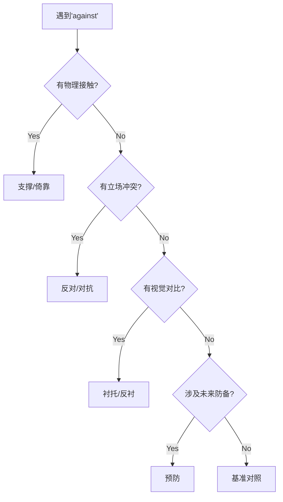

> Maman died today. Or yesterday maybe, I don't know. I got a telegram from the home: "Mother deceased. Funeral tomorrow. Faithfully yours." That doesn't mean anything. Maybe it was yesterday.

## 连读

- got a


兹有甘兴行村民在大田塱村委会长江村村尾，从02年开始至今一直在养猪，特此证明。

# 完成时

## **时间轴对比**

|句型|时间指向|持续性|
|---|---|---|
|_He ran._|单纯过去|❌|
|_He was running._|过去持续|✅|
|_He has run._|现已完成|❌|
|_He has been running._|持续至今|✅|
|_He must have run._|推测过去完成|❌|
|_He must have been running._|推测过去持续|✅|

**是否需要建立时间关联**（完成时的本质）

## **完成时的根本作用**

英语完成时（have/has/had + 过去分词）的核心功能是：  
**表明某个动作/状态与特定时间参照点的关系**，具体分为：

| 类型        | 时间关联     | 例句                              | 持续性？   |
| --------- | -------- | ------------------------------- | ------ |
| **现在完成时** | 过去动作影响现在 | _I've lost my keys._            | ❌ 瞬间动作 |
| **过去完成时** | 过去之过去的动作 | _He had left when I arrived._   | ❌ 瞬间动作 |
| **完成进行时** | 强调动作持续过程 | _She's been reading for hours._ | ✅ 必须持续 |

---

完成时（have/has/had + 过去分词）的本质是：  
**建立动作与特定时间参照点的关联**，强调动作的**相关性**而非单纯时间顺序。它不是时态（tense），而是**体貌（aspect）**。

## **完成时的三大核心功能**

| 功能类型      | 关键逻辑          | 示例                               | 中文对应            |
| --------- | ------------- | -------------------------------- | --------------- |
| **结果影响性** | 过去动作对当前状态造成影响 | _I've lost my keys._             | "我弄丢了钥匙（现在找不到）" |
| **经历性**   | 过去某时间段的经验总结   | _She has visited Japan twice._   | "她去过日本两次"       |
| **持续性**   | 动作/状态从过去延续至今  | _We've lived here for 10 years._ | "我们住这儿10年了"     |
|           |               |                                  |                 |
## **何时必须用完成时？**

##### **场景1：因果链构建**

当需要明确表达**过去动作导致现在结果**时：

- ❌ _I ate breakfast._ （单纯陈述过去）
    
- ✅ _I've eaten breakfast, so I'm not hungry._ （解释现在不饿的原因）
    

##### **场景2：无明确时间状语**

当动作发生在**未指定的过去时间**时：

- ❌ _I saw that movie._ （隐含具体时间）
    
- ✅ _I've seen that movie._ （不关心何时看的）
    

##### **场景3：跨越时间段的持续性**

描述**从过去延续至今**的状态：

- ❌ _He is sick for a week._ （错误，需用完成时）
    
- ✅ _He has been sick for a week._


# against

#### **1. 核心空间关系（物理接触）**

**本义**：表示两物体直接接触并产生反作用力

- _She leaned against the wall._  
    （她靠在墙上。）→ 身体与墙面接触
    
- _The ladder rests against the house._  
    （梯子倚着房子。）  
    **要点**：强调**支撑/对抗性的物理接触**，通常一方为静态表面。
    

#### **2. 对立/对抗关系（抽象延伸）**

**逻辑扩展**：从物理接触引申为立场的对立

- _The protest was against the new law._  
    （抗议针对新法规。）
    
- _He voted against the proposal._  
    （他投票反对该提案。）  
    **要点**：此时**无物理接触**，纯抽象对立，常与动词（fight, argue, protest）搭配。
    

#### **3. 衬托/背景关系（视觉对比）**

**特殊用法**：通过对比凸显某物

- _Red flowers stand out against the green leaves._  
    （红花在绿叶衬托下很醒目。）
    
- _The screws shone against the dark wood._  
    （螺丝在深色木头上发亮。）→ 您例句中的用法  
    **要点**：强调**视觉反差**，类似中文"映衬"。
    

#### **4. 预防/防备关系**

**时间性对抗**：为未来可能的冲突做准备

- _Get vaccinated against COVID-19._  
    （接种新冠疫苗预防。）
    
- _She saved money against hard times._  
    （她存钱以备不时之需。）  
    **要点**：隐含"未来威胁→当下防御"的时间轴。
    

#### **5. 规则/基准参照**

**比较框架**：以某标准为对立面进行衡量

- _The yen fell against the dollar._  
    （日元对美元贬值。）
    
- _Check the list against the original._  
    （对照原件核对清单。）  
    **要点**：需两个可比较对象。



```mermaid

```

