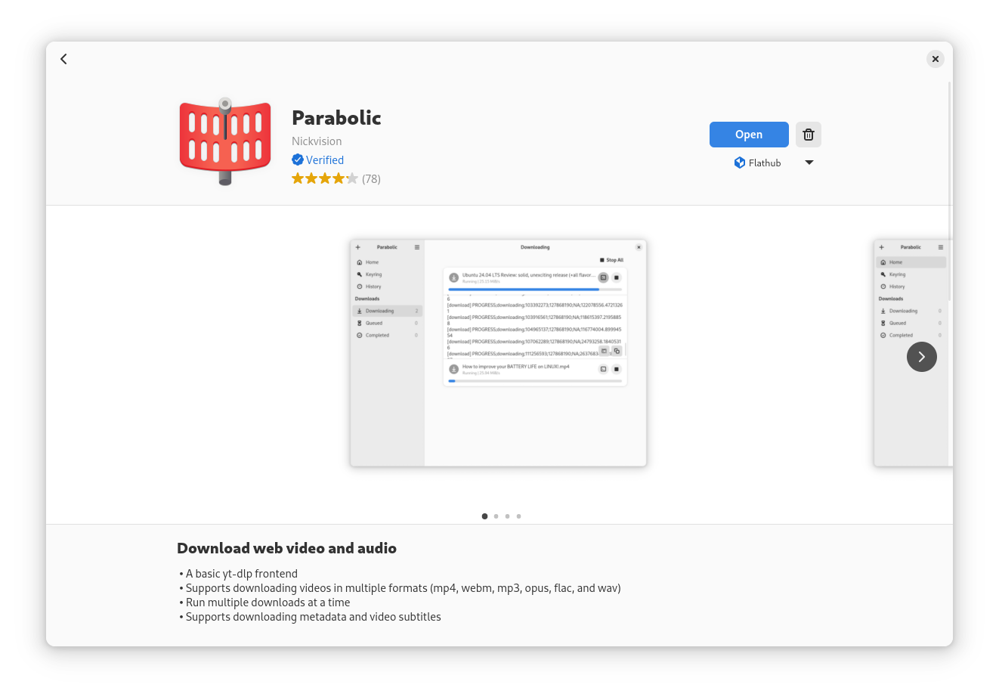
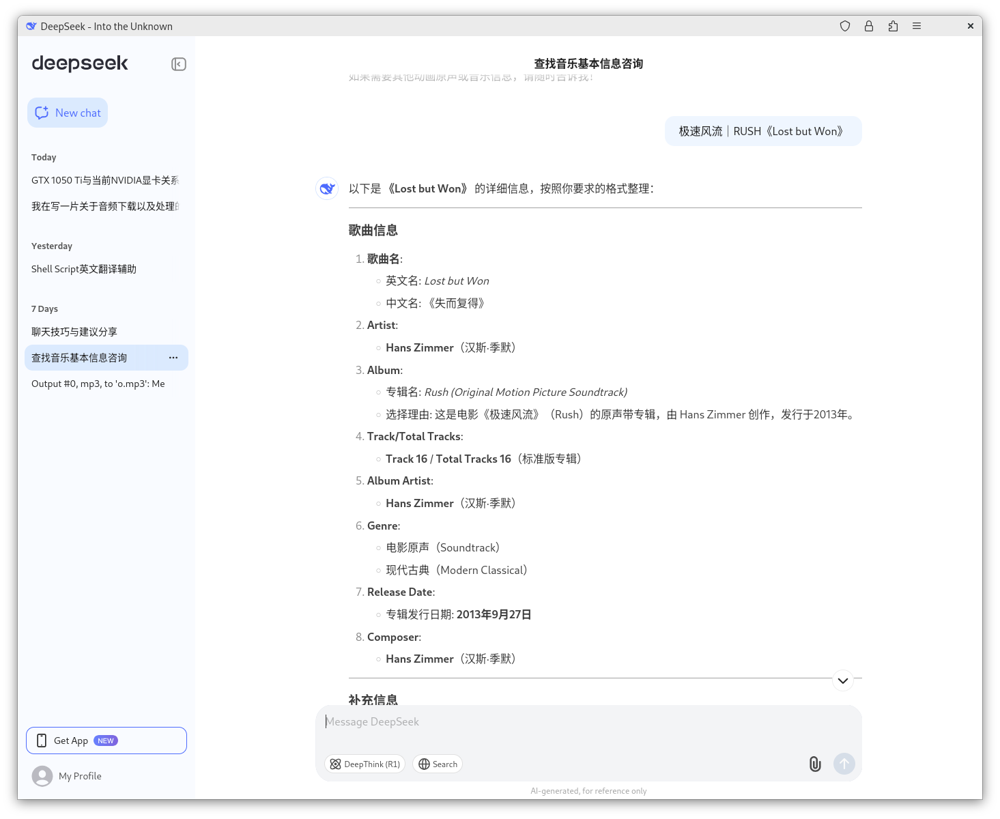
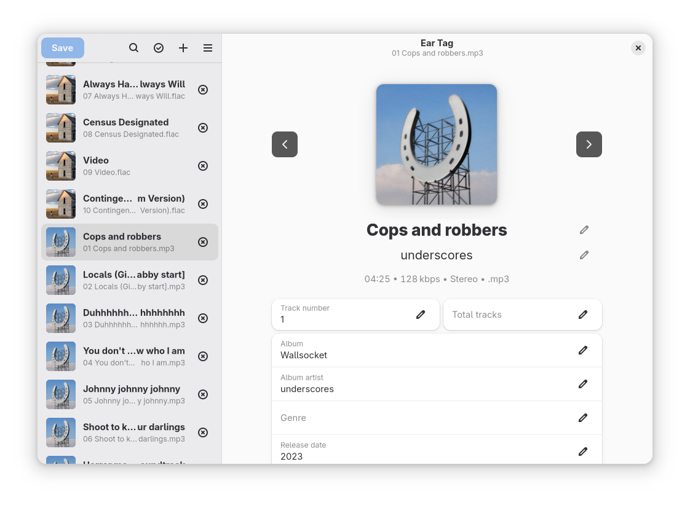
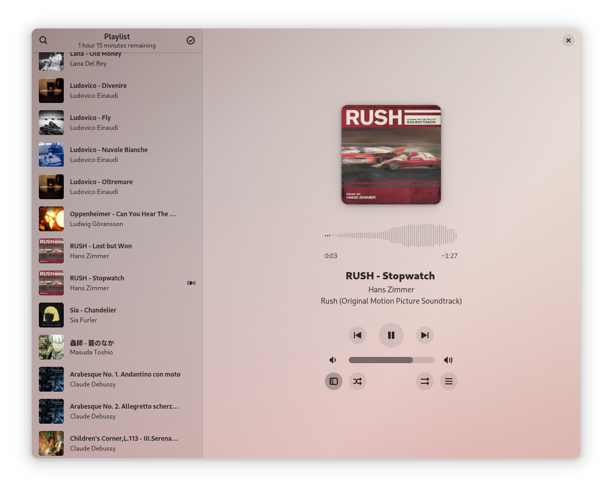
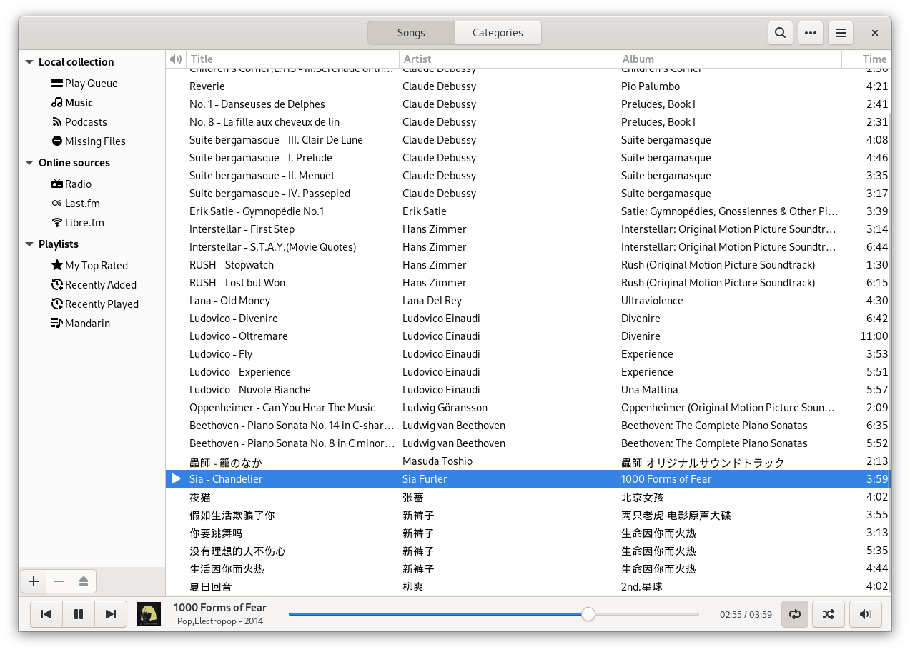
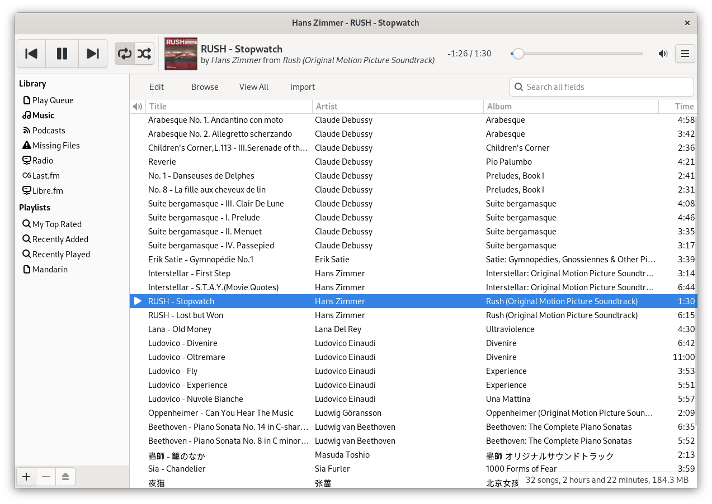
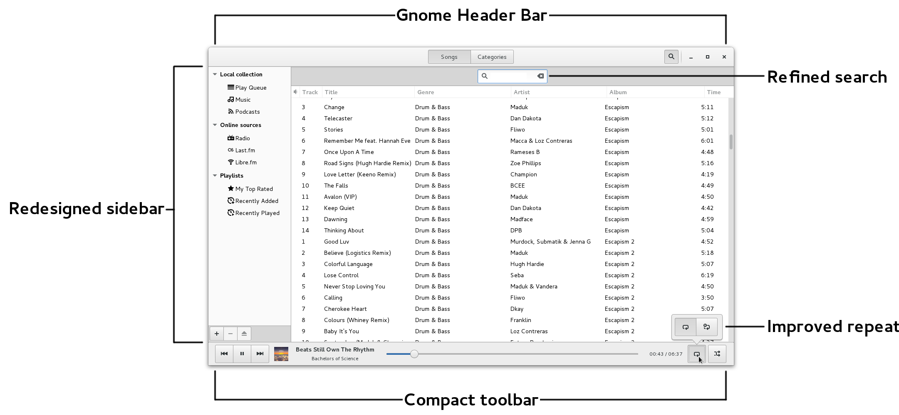
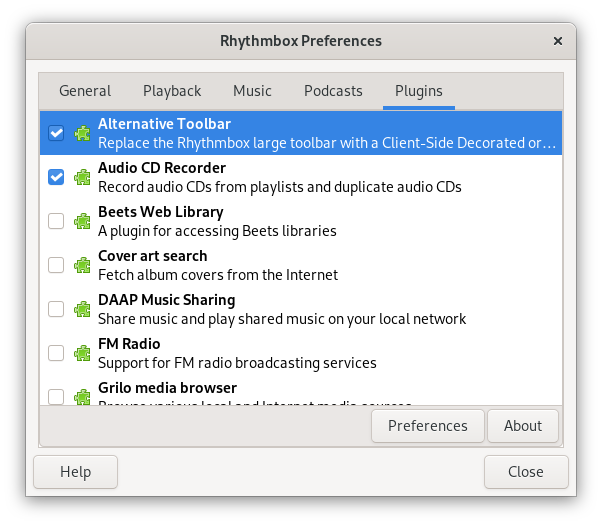

我现在使用的是 Linux 系统，并需要一个音乐播放器。由于路径依赖，首先想到的是手机端使用的音乐软件——Apple Music，但显然它无法在 Linux 上使用，其他常用的软件如 QQ Music、网易云音乐（实际非我常用，也不乐意用）也未达我的要求。Spotify 倒是可以，但是它需要翻墙，并且会员费用略贵（12刀起）。思虑良久，选择退而求其之使用本地音乐，再择相宜软件播放它们。在这个过程中体验了多款 Linux 音乐播放器，各有优劣，三千弱水取其两瓢。在获取、完善音源的过程中也碰到了有趣的知识与软件，遂记录之。

<!-- more -->

本文是个人记录，非路径最优选择的实践，因此期间不会作相关对比然后择优而用的实验。接下来会分三大部分，按顺序记录实现本地音乐播放的工作流，它们分别是：

- **下载音频**：直接下载音频不可取，另辟蹊径视频转音频；
- **音频的完善**：音频信息缺失或错漏或不理想，不得不动手编辑音频信息；
- **本地音乐播放器的选择**：展示简单配置最后选择的两款播放器：
  - *Rhythmbox*：**GNOME** 桌面环境默认的**音乐播放与管理软件**；
  - *Amberol*：轻量级、现代化的 **Linux 音乐播放器**，专为 **GNOME 桌面环境**设计。

> 旁白
> 我需要的不是找到最优的选择，而是找到符合要求的选择。在体验当前选择的过程中，如果发现不适的方面，根据不适的程度决定是否基于此去寻找更优选择。若是相当不适，则立马寻找，直到新选择的出现，具备相当的急迫情绪；若是仅仅是非主要体验的不适，则仅是留意新选择，然后交给时间将更优选择送到我跟前。
## 背景

```shell
## System Details Report
---

### Report details
- **Date generated:**                              2025-03-24 07:20:52

### Hardware Information:
- **Hardware Model:**                              ASUSTeK COMPUTER INC. TUF B360M-PLUS GAMING S
- **Memory:**                                      16.0 GiB
- **Processor:**                                   Intel® Core™ i5-8600K × 6
- **Graphics:**                                    NV137
- **Disk Capacity:**                               1.3 TB

### Software Information:
- **Firmware Version:**                            2418
- **OS Name:**                                     Fedora Linux 41 (Workstation Edition)
- **OS Build:**                                    (null)
- **OS Type:**                                     64-bit
- **GNOME Version:**                               47
- **Windowing System:**                            Wayland
- **Kernel Version:**                              Linux 6.13.6-200.fc41.x86_64
```

## 下载音频


### 音源选择

这里说的音源选择并非是选择那个音乐平台，而是选择下载音频（audio）还是视频（video -> audio）。在目前这个时间点，想要直接下载免费且优质的音频已经不是容易的事。音乐的版权越来越规范，音频被不同的平台收录，防盗措施也做得越来越好。想通过非官方提供的手段下载的门槛也是越发的高，尽管有也不知道那天就会失效！并且音源是通过手机软件、电脑客户端的形式提供。此类形式，本身就自带门槛！另外，尽管愿意为音乐买单付费，也可能存在你喜欢的列表里的音频版权不完全归属于统一平台，这不单止增加成本也带来体验的割裂感！

日前不久，较大的[免费音频下载网站](dcf290e7/https://tools.liumingye.cn/p/bulletin/myfreemp3%e5%81%9c%e6%ad%a2%e8%bf%90%e8%90%a5%e9%80%9a%e7%9f%a5)也停止运营，直接下载音频的路也不好走！而音乐视频方面，目前看来还是路平且宽：

1. **无版权问题**：音乐类视频由个人用户上传而非官方所有；
2. **下载门槛较低**：视频平台都有网页端，甚至运营的侧重点就是网页端！而从网页端下载资源的难度在我看来比起客户端是要底得多的；
3. **音源质量不错**：不少个人用户上传的音乐视频是官方 MV 或者是经过二次优化处理的。

### 下载工具

> 旁白
> b 站有很多Hi-Res音乐视频
> 

下载工具可以从 3 个方向选择：

1. 专门下载视频的个人网站，如 [UKC.COM.NP](dcf290e7/https://www.ukc.com.np/p/youtube-m4a.html)；
2. 浏览器插件；
3. Linux 软件（图形 or CMD 工具）。

这里不是要对比以上方式的优劣（当然我都尝试过以上方向），仅仅是记录当前我正使用的一款 Linux 软件：[Parabolic](dcf290e7/https://github.com/NickvisionApps/Parabolic)。


Parabolic 是由 Nickvision 开发的一款 Linux 软件，旨在帮助用户下载网络视频和音频。以下是 Parabolic 的一些主要特点和信息：

1. **功能**：
    
    - Parabolic 是一个基本的 yt-dlp 前端，支持多种格式的视频下载，包括 mp4、webm、mp3、m4a、opus、flac 和 wav。
    - 允许同时运行多个下载任务。
    - 支持下载视频元数据和字幕。
2. **版本更新**：
    
    - 最近的版本是 2025.1.4，约两个月前发布，包含一些功能修改和修复，例如添加了新选项以启用或禁用独立下载缩略图，修复了一些格式选择和章节分割的问题。
3. **系统需求**：
    
    - 安装大小约为 428.17 MiB，下载大小为 162.82 MiB。
    - 兼容的架构包括 aarch64 和 x86_64。
4. **社区驱动**：
    
    - Parabolic 是一个开放社区开发的项目，遵循 GNU General Public License v3.0 或更高版本的许可协议。
5. **安装信息**：
    
    - 目前该应用的安装量已超过 201,449 次。


使用方式非常简单，此处不做赘述。

## 完善本地音频

音源无论是来源于免费的音频网站或是视频网站都有一个共有的缺点：音频信息不完整或不理想，如封面（cover）、标题（title）、专辑信息（artist、artist album）、作曲家（composer）、歌词（lyrics）等等。

结合当前我已知的信息，一个较为完整的音频当具备以下信息：

- Cover（专辑封面）；
- Title（歌曲标题，非文件名）；
- Artist（音乐演奏者）；
- Album Artist（发行当前专辑的艺术家）；
- Composer（作曲家）；
- Genre（音乐的风格）；
- Track number / Total tracks；（当前音乐在专辑中的序号 / 专辑的所有音乐数）
- Year（发行年份）；
- Lyrics（可选，歌词）。
### 音频数据获取

关于以上音频的基本信息，推荐使用 deepseek 等大模型进行检索。比起使用浏览器，大模型会更加方便、提供的信息更加精准。



### 编辑音频数据

关于音乐数据的编辑，这里提供 2 种我接触到的方式：

1. Linux 图形化软件：[Ear Tag](dcf290e7/https://gitlab.gnome.org/World/eartag)；
2. CMD 工具：[FFmpeg](dcf290e7/https://www.ffmpeg.org/)。

此处先不对 FFmpeg 作展开，后续工作流的优化时再作相关说明。Ear Tag 是图形化软件，使用几乎是没有门槛：



**Ear Tag**（原名 **GNOME Music Tagger**）是一款 **GTK 4** 开发的 **开源音频元数据编辑器**，专为 **GNOME 桌面环境** 设计，适用于 **Linux** 系统。它提供简洁的图形界面，支持编辑 MP3、FLAC、OGG、M4A 等常见音频文件的标签信息（如标题、艺术家、专辑封面等）。  

#### **核心功能**  

1. **元数据编辑**  
   - 修改基础标签：标题（Title）、艺术家（Artist）、专辑（Album）、年份（Year）、流派（Genre）等。  
   - 支持 **嵌入式专辑封面**（可添加/删除/替换）。  
   - 自动从 **MusicBrainz** 数据库获取元数据（需联网）。  

2. **文件管理**  
   - 批量编辑多个文件的标签。  
   - 支持通过文件名自动填充标签（如 `Artist - Title.mp3` 格式）。  

#### **优缺点**  

**优点**  
- 界面现代简洁，符合 GNOME 设计规范；
- 支持批量编辑和 MusicBrainz 自动补全；
- 轻量级，无复杂依赖。

**缺点**  
- 功能较基础，不适合专业音频管理（如无音频波形编辑）；
- 部分格式支持有限（如 WAV 标签写入可能不兼容）。  

## 本地音频播放器

Linux 支持播放本地音频的播放器很多，经体验不下 10 款后，我选择了其中两款：

| Icon                            | Name                                               | Desc                                                                                               |
| ------------------------------- | -------------------------------------------------- | -------------------------------------------------------------------------------------------------- |
|  | [Rhythmbox](dcf290e7/https://wiki.gnome.org/Apps/Rhythmbox) | **GNOME** 桌面环境默认的**音乐播放与管理软件**，适用于 **Linux** 系统。它提供音频播放、音乐库管理、网络电台、播客支持等功能，界面简洁易用，适合日常听歌和轻度音乐整理需求。 |
|  | [Amberol](dcf290e7/https://apps.gnome.org/Amberol/)         | 一款轻量级、现代化的 **Linux 音乐播放器**，专为 **GNOME 桌面环境**设计。它专注于**简洁播放体验**，界面极简，适合快速播放本地音乐文件，无复杂功能干扰。           |

### Amberol

#### 优点

- **界面美观**：现代化 GTK 4 设计，无冗余元素；
- **快速流畅**：专注播放，无后台扫描或数据库负担；
- **适合 GNOME**：完美融入最新 GNOME 桌面。

#### 缺点

- 功能极其基础，不支持播放列表、标签编辑或高级音效；
- 仅适合临时播放，不适合管理大型音乐库。

#### 适用场景

- 需要快速播放单个或少量音乐文件（如临时试听）；
- 偏好 GNOME 原生应用风格，追求极简体验；
- 作为备用播放器，搭配 Rhythmbox 使用。

### Rhythmbox



#### 优点

- **集成度高**：GNOME 默认应用，与桌面环境无缝兼容；
- **功能全面**：覆盖播放、电台、播客等常见需求；
- **低资源占用**：相比 Amarok 或 Clementine 更轻量。

#### 缺点

- 界面较传统，缺乏现代化设计（如未适配 GTK 4）；
- 高级功能（如智能播放列表）不如 **Amarok** 或 **Clementine**。、

#### 适用场景

- GNOME 用户需要一款开箱即用的播放器；
- 管理本地音乐库 + 收听网络电台/播客；
- 作为基础工具，搭配插件扩展功能。

#### 插件

##### Alternative Toolbar

上面图片中 Rhythmbox 的外观并非原有的，而是安装第三方插件 [fossfreedom /alternative-toolbar](dcf290e7/https://github.com/fossfreedom/alternative-toolbar) 后并作简单配置的效果。下面是原有的外观：



 [fossfreedom /alternative-toolbar](dcf290e7/https://github.com/fossfreedom/alternative-toolbar) 旨在改进默认界面的用户体验，提供更现代化的布局和增强的功能。在多个方面都作了不同程度的增强与优化：
 

**1. 界面优化**

✅ **更紧凑的工具栏**

- 合并播放控制、搜索栏和视图切换，减少空间占用。
- 支持自定义工具栏按钮（隐藏/显示特定功能）。

✅ **现代化的播放控制**

- 更直观的播放按钮（类似现代播放器风格）。    
- 支持进度条内显示当前/总时间。

✅ **主题适配**

- 支持 **Dark Mode（深色模式）**，适配 GNOME 环境。
- 可调整工具栏高度，适应不同屏幕尺寸。

---

**2. 功能增强**

🔧 **增强的搜索功能**

- 全局搜索栏集成到工具栏，快速查找歌曲、专辑或艺术家。

🔧 **快捷视图切换**

- 一键切换 **“专辑视图”**、**“艺术家视图”** 和 **“播放列表”**，无需进入侧边栏。

🔧 **播放状态显示优化**

- 当前播放歌曲信息（标题、艺术家）直接显示在工具栏。
- 可自定义显示元数据（如比特率、文件格式）。

---

**3. 自定义选项**

⚙️ **可调整布局**

- 允许用户选择 **经典模式**（默认 Rhythmbox 风格）或 **紧凑模式**（节省空间）。    
- 支持隐藏不常用的按钮（如广播、播客）。

⚙️ **快捷键支持**

- 提供额外的键盘快捷键控制播放（如 `Ctrl+F` 快速聚焦搜索栏）。

##### 其他

除了 Alternative Toolbar 外，Rhythmbox 还有内置的、外置的插件。在 Perferences -> Plugins 中可见。但目前为止，Alternative Toolbar 是我觉得作用最大，对于其他的插件，我赞为体会到他们美好！有几个内置的插件（如 Cover art search、Songs Lyrics），从标题与简介来看颇用用处，但实际使用时（选中主页面中音频条目后右键选择“Properties”可体验）却无甚大用。



## ffmpeg

### 获取音频

已经下载到本地的音频，其中已包含元数据、封面和歌词等等数据，当前目的是从这样的音频中得到纯净的音频。


下面是从语言大模型得到的信息。将逐一测试

#### 0x01 
使用 `ffmpeg` 删除歌曲封面的命令如下：

```
ffmpeg -i input.mp3 -c copy -map 0 -metadata:s:v title="" -metadata:s:v comment="" output.mp3
```

- `input.mp3` 是你要处理的原始文件。
- `output.mp3` 是去掉封面后的新文件名。
- `-c copy` 用于复制音频流，而不重新编码。
- `-map 0` 表示将所有流都包括在内。
- `-metadata:s:v title=""` 和 `-metadata:s:v comment=""` 用于清除封面图像的元数据。

*结果*：无效

#### 0x02

要获得一个完全不包含封面和其他元数据的纯净音频文件，可以使用以下 `ffmpeg` 命令：


```
ffmpeg -i input.mp3 -vn -acodec copy -map_metadata -1 output.mp3
```

- `-i input.mp3` 指定输入文件。
- `-vn` 表示不处理视频流（在音频文件中无视频流，但可以防止其他流）。
- `-acodec copy` 表示复制音频编码。
- `-map_metadata -1` 表示不复制任何元数据。

*结果*：有效


### 添加封面

获得纯净音频后。将本地图片做为封面添加到音频中。

下面是语言大模型提供的方案，会逐一做尝试。

#### 0x01

```shell
ffmpeg -i input.m4a -i cover.jpg -c copy -map 0 -map 1 -metadata:s:v title="Album cover" -metadata:s:v comment="Cover (front)" output.m4a
```

- `input.m4a` 是你要添加封面的原始音频文件。
- `cover.jpg` 是你要用作封面的图片文件。
- `output.m4a` 是输出文件名。
- `-c copy` 表示复制音频流，而不重新编码。
- `-map 0` 表示包含第一个输入（音频）。
- `-map 1` 表示包括第二个输入（封面图像）。
- `-metadata:s:v title="Album cover"` 和 `-metadata:s:v comment="Cover (front)"` 为封面添加标题和注释。

*结果*：无效。见下面报错信息。输出的文件无法使用。

```shell
[ipod @ 0x562b21b52fc0] Could not find tag for codec mjpeg in stream #1, codec not currently supported in container
[out#0/ipod @ 0x562b21b52ec0] Could not write header (incorrect codec parameters ?): Invalid argument
Conversion failed
```
提供错误信息给大模型，得到的回答是：

> [!NOTE]
> 这个错误通常是因为 M4A 容器不支持 MJPEG 编码的封面图像。为了避免这个问题，可以将封面图像转换为 PNG 格式，或使用 JPG 格式，但确保使用正确的选项。

使用 ffmpeg 查看当前封面（`cover.jpg`）信息如下：

```shell
Input #0, image2, from 'cover.jpg':
  Duration: 00:00:00.04, start: 0.000000, bitrate: 25562 kb/s
  Stream #0:0: Video: mjpeg (Baseline), yuvj444p(pc, bt470bg/unknown/unknown), 640x640 [SAR 37:37 DAR 1:1], 25 fps, 25 tbr, 25 tb
```

可见确实是 mjpeg 格式的图片。

##### mjpeg to jpg

尝试使用大模型提供的，将mjpeg转jpg的两个方案均失败：

```shell
ffmpeg -i cover.jpg -q:v 2 output.jpg
```

```shell
ffmpeg -i cover.jpg -vf "scale=iw:ih" -q:v 2 output.jpg
```

最后解决方案是：使用截图工具得到 png 图片。

### 换用 mp3 容器

因个人喜好以及音频质量，而使用m4a格式，但在使用 ffmpeg 附着封面到音频时，遇到暂无法解决的问题，因此将音频格式换为mp3格式。

- [ x ] 获取纯净音频；
- [ x ] 附着封面图至音频；

#### 添加元数据

```shell
ffmpeg -i input.mp3 -metadata title="Your Title" \
-metadata artist="Your Artist" \
-metadata album="Your Album" \
-metadata album_artist="Your Album Artist" \
-metadata genre="Your Genre" \
-metadata date="2025" \
-metadata composer="Your Composer" \
-c copy output.mp3
```

*结果*：有效。
