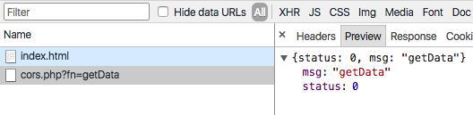
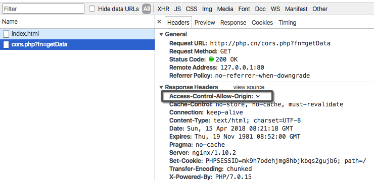
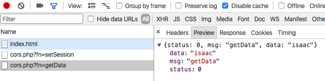
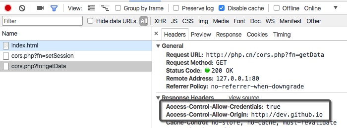

# 前言

跨域是什么？只要请求地址与当前地址的**协议**、**域名**、**端口**其中一个不同都会引起跨域，这是由于浏览器的同源策略导致。

[同源策略的存在意义]

但有时候跨域又是难以避难，目前有很多跨域的方法：

1. JSON-P(安全性不好)；
2. window.name + iframe(实现的方式恶心)；
3. window.postMessage(HTML5)；
4. proxy(麻烦的部署及维护)；
5. 使用同域后端语言作为中转；
6. 跨域资源共享;
7. ...

其中我实践过得有1、4、5、6，常用的是4，最近XXX的时候被问到CORS，引申出很多知识，比如其中问到了**复杂请求和简单请求**，我对CORS并没有太多深入，接下来你懂的……


CORS需要服务器端及客户端双方面的更改支持。本编主要基于js和php代码以及session机制介绍如何实现CORS跨域以及解决CORS后的session丢失问题。


以下是本次实现的前后端域名。观两端域名可知会引起跨域问题。

前端域名为：`http://dev.github.io`；

后端域名：`http://php.cn` 请求地址为：`http://php.cn/cors.php`。


# CORS的兼容性

- Chrome 3+
- Firefox 3.5+
- Opera 12+
- Safari 4+
- Internet Explorer 8+


#CORS实现跨域

- 客服端（Client）

  封装一个ajax函数：

  path：`http://dev.github.io/index.html`
  ```js
  function request(sender) {
      var xhr = new XMLHttpRequest();
      var url = "http://php.cn/cors.php?fn=" + sender.url.slice(1);

      if ("withCredentials" in xhr) {
          // "withCredentials"属性只存在于XMLHttpRequest2对象中
          // Chrome, Firefox, Opera and Safari
          xhr.open(sender.method, url, true);

      } else if (typeof XDomainRequest != "undefined") {
          // XDomainRequest对象，兼容IE
          xhr = new XDomainRequest();
          xhr.open(sender.method, url);

      } else {
          xhr = null;
      }

      for(var key in sender.header) {
          xhr[key] = sender.header[key];
      }

      xhr.onload = function() {
          var responseText = xhr.responseText;
          sender.callback && sender.callback(responseText);
      };
      xhr.send();
  }
  ```

  发起一个get请求：

    ```js
  function getData(callback) {
      request({
          method: 'GET',
          url: '/getData',
          callback: callback
      });
  }

  getData(function(resp) {
      console.log(resp);
  });
    ```


- 服务端（Server）

  path：`http://php.cn/cors.php`

  ```php
  <?php
  error_reporting(0);
  session_start();

  // header('Access-Control-Allow-Origin: *');
  // header('Access-Control-Allow-Origin: http://dev.github.io');
  $fn = $_GET['fn'] ? $_GET['fn'] : 'getData';
  $fn();

  function returnAjax($arr) {
  	echo json_encode($arr);
  };

  function getData() {
  	returnAjax(array(
  		'status' => 0,
  		'msg' => "getData"
  	));
  }
  ```
  
  准备代码写完，先发起一个请求测试：

  抛出以下异常

  > `Failed to load http://php.cn/cors.php?fn=getData: No 'Access-Control-Allow-Origin' header is present on the requested resource. Origin 'http://dev.github.io' is therefore not allowed access.`
  
  大致意思就是响应报文中没有指定当前域为可跨域域名。
  
  CORS怎么解决，也是很简单：
  
  回看刚刚的php代码，你发现两行注释代码，取消任意一行都可以解决以上异常
  
  - 使用通配符，表示允许任何来源域名进行跨域；
  - 也可以指定来源域名，比如第二行。
  
  **ok，取消第一行注释，来实践一下：**
  
  
  
  **这就这么简单，关键是服务端向响应报文的消息头中指定可进行跨域的源域名**


# CORS后出现session丢失问题

先简单介绍一下session机制：

服务端建立session，比如php

```php
$_SESSION['name'] = "isaac";
```

建立session后，session保存的到服务端，生成一个sessionId以cookie形式保存到客户端。

当下一次访问的时候，保存在浏览器cookie的sessionId会被带在请求头中，服务端就会根据请求头中的sessionId去服务端获取对应的sessionId


然后，再来说一下CORS后出现session丢失问题，为什么会出现呢？

这就需要说一下`Access-Control-Allow-Credentials`

>**Access-Control-Allow-Credentials**
>
> 该字段可选。它的值是一个布尔值，表示是否允许发送Cookie。默认情况下，Cookie不包括在CORS请求之中。设为`true`，即表示服务器明确许可，Cookie可以包含在请求中，一起发给服务器。这个值也只能设为`true`，如果服务器不要浏览器发送Cookie，删除该字段即可。

CORS后默认是不会发送cookie的，在看上面说到的session机制，最后一步是需要发送sessionId的cookie到服务端的，服务端才能获取到对应的session，这就是session丢失的原因。


既然知道原因，那么就好办了！


如上引用中写到，需要服务端向响应头中设置Access-Control-Allow-Credentials为true才能允许浏览器向服务器发送cookie。


另外，在浏览器端也是需要在AJAX请求中打开`withCredentials`属性

```js
var xhr = new XMLHttpRequest();
xhr.withCredentials = true;
```

注意：必须浏览器端将`withCredentials`设为`true`和服务端将`Access-Control-Allow-Credentials`设为`true`才能达到预期效果


ok，现在再来实践一下，首先先做一下代码准备：

html:

```js
function getData(callback) {
    request({
        method: 'GET',
        url: '/getData',
        header: {
            withCredentials: true
        },
        callback: callback
    });
}

function setSession(callback) {
    request({
        method: 'POST',
        url: '/setSession',
        callback: callback
    });
}

// 先发送请求建立一个session，然后在发送一个请求获取刚刚建立的session，若果不为空即session没有丢失
setSession(function() {
    getData(function(resp) {
        console.log(resp);
    });
});
```

php：

```php
<?php
error_reporting(0);
session_start();

// header('Access-Control-Allow-Origin: *');
header('Access-Control-Allow-Origin: http://dev.github.io');

$fn = $_GET['fn'] ? $_GET['fn'] : 'getData';
$fn();

function returnAjax($arr) {
	echo json_encode($arr);
};

function getData() {
	header("Access-Control-Allow-Credentials: true"); 

	returnAjax(array(
		'status' => 0,
		'msg' => "getData",
		'data' => $_SESSION['name']
	));
}

function setSession() {
	$_SESSION['name'] = "isaac";

	returnAjax(array(
		'status' => 0,
		'msg' => 'setSession'
	));
}
```

ok，现在来执行一下





如上，发送第一个请求php代码建立的一个session

```php
$_SESSION['name'] = "isaac";
```

发送第二个请求，获取该session，并且如上图，确实返回了该session保存的值。


对比第一次实现CORS，你会发现第二次实现CORS的时候，在服务端，没有再用通配符`*`来配置`Access-Control-Allow-Origin`而是直接指定为：`http://dev.github.io`，这也是一个注意点，要发送cookie就必须明确指明可跨域域名，不可以使用通配符，不然则会抛出如下异常：

> `Failed to load http://php.cn/cors.php?fn=getData: The value of the 'Access-Control-Allow-Origin' header in the response must not be the wildcard '*' when the request's credentials mode is 'include'. Origin 'http://dev.github.io' is therefore not allowed access. The credentials mode of requests initiated by the XMLHttpRequest is controlled by the withCredentials attribute.`

#写在最后
看得多了，不如试试？！


[同源策略的存在意义]: https://www.zhihu.com/question/31459669

