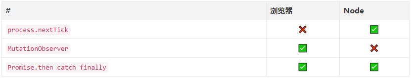

# 关于setTimeout的想法

## 前言

```jsvascript
setTimeout(() => {
  console.log('i am isaac');
}, 0);
```

## 正文

首先setTimeout是个宏任务（macro-task），我们知道最后他会被推入任务队列，等待事件轮询（Event Loop）调用它的回调函数（Callback）。这里就出现两个疑问：
1. `setTimeout`的回调函数（Callback）是什么时候被推入事件队列？
2. `setTimeout`的回调函数（Callback）是什么时候被事件轮询（Event Loop）触发的？

在普通认知中，或者感官上，对于设置`setTimout`的延时时间（delay），比如设置`1000ms`，我们都会认为它会在1s后调用。在特定情况下，大概是接近这个延时的时间后执行，什么情况下呢？

主线程中没有同步代码在执行！意思是，不用等待主线程同步代码执行完毕就立刻进入事件轮询的周期，执行任务队列的任务，而对头的第一个任务就是刚刚设置的`setTimeout`。很特殊不是吗？！在实际开发下当然没有那么理想的情况啦~

那么这个延时意味着什么？

它指定了，异步代码的回调函数什么时候可以被推入任务队列，至于它的回调函数实际的执行时机只能视当前情况而定！我们只能保证它的执行时间是触发异步代码后的delay时间后（time > delay），没错你没有看错，我写的是`time > delay`是没有等号的，因为大概有4ms的空隙~

ok，到此第一个问覅完全解决：经过delay ms后会被推入任务队列等待执行。


至于回调会在什么时候执行，这个就没有确定的时间了！
首先要执行任务队列里面的任务有两个大前提：
1. 主线程代码执行完毕（这里暂时讨论浏览器端，所以暂时忽略nextTick，也忽略vue的$nextTick）；
2. 下一次事件轮询到来。

在这个两个前提下，还要从任务队列上进行细分，因为任务队列的任务也是有分类的：*微任务*和*宏任务*，我们可以通俗地说微任务的执行优先级高于宏任务，每次事件轮询决策执行那个任务都会优先执行微任务队列里面的任务，到这里你会发现微任务和宏任务不是在同一个队列的，他们分别在两条不同的队列，只要微任务的队列的任务数不为零，那么每次都会去微任务的队列里面取任务。

宏任务（macro-task）：


微任务（micro-task）：


从上面知道要调用setTimeout的回调函数，还需要等待微任务队列里面的所有任务调用完毕，然后还需要等待宏任务队列中前面的所有任务调用完毕后，才正真执行文中的setTimeout的回调函数。

## 最后说一句