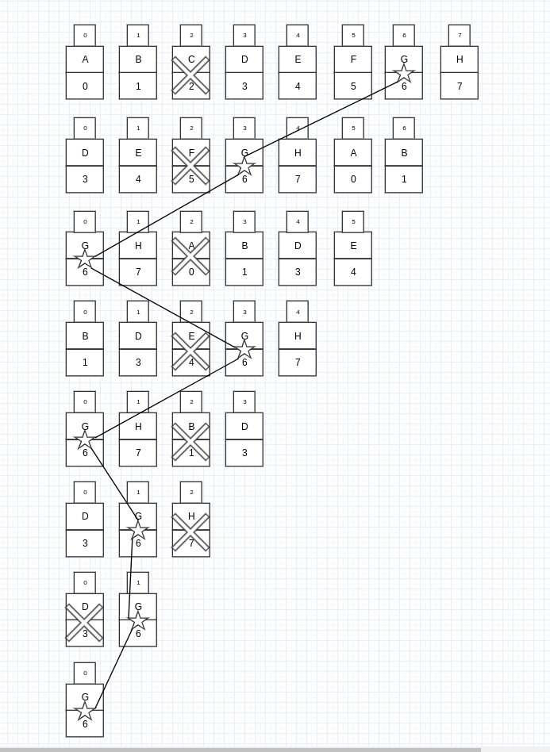

# 面试题62. 圆圈中最后剩下的数字

0,1,,n-1这n个数字排成一个圆圈，从数字0开始，每次从这个圆圈里删除第m个数字。求出这个圆圈里剩下的最后一个数字。

例如，0、1、2、3、4这5个数字组成一个圆圈，从数字0开始每次删除第3个数字，则删除的前4个数字依次是2、0、4、1，因此最后剩下的数字是3。

 

示例 1：

输入: n = 5, m = 3
输出: 3
示例 2：

输入: n = 10, m = 17
输出: 2


限制：

1 <= n <= 10^5
1 <= m <= 10^6

来源：力扣（LeetCode）
链接：https://leetcode-cn.com/problems/yuan-quan-zhong-zui-hou-sheng-xia-de-shu-zi-lcof

## 1.暴力模拟（超时）

```js
/**
 * @param {number} n
 * @param {number} m
 * @return {number}
 */
var lastRemaining = lastRemaining2;
function lastRemaining1(n, m) {
  let idx = 0;
  let num = 0;
  let count = 0;
  let getIdx = (idx) => idx % n;
  const record = {};
  while (1) {
    if (!record[num]) idx++;
    // console.log(num, idx, record)
    if (!record[num] && idx > 0 && idx % m === 0) {
      count++;
      // console.log({count, n})
      record[num] = true;
      if (count >= n) return num;
      idx = 0;
    }
    num = getIdx(num + 1);
  }
};
```

## 2.约瑟夫自杀环



```js
/**
 * f(x)：最后输出的序号
 * f(n, m) = (f(n - 1, m) + m)
 * @param {number} n
 * @param {number} m
 * @return {number}
 */
function lastRemaining2(n, m) {
  function josephus(n, m) {
    if (n === 1) return 0;
    return (josephus(n - 1, m) + m) % n;
  }
  return josephus(n, m);
}
```

