oauth2实践

auth2中的角色


# 管理OAuth客户端注册

oauth服务器需要为每个客户端分配唯一的客户端标识！

## 由谁来生成客户端 ID？ 

在常规 的 OAuth系统中，客户端 ID（client_id）和密钥（client_secret）由 *授权服务器* 颁发给客户端

通过客户端 ID查找信息，客户端 ID是从请求 

## 对客户端授权 

OAuth协议要求授权服务器提供两个端点：

- 授权端点，运行在前端信道上；
- 令牌端点，运行 在后端信道上

### 授权端点

授权服务器提供了一个授权端点，供客户端请求访问令牌和刷新令牌。客户端直接向该端点 发出请求，携带一组表单格式的参数，授权服务器解析并处理这些参数。然后授权服务器返回一 个代表令牌的 JSON对象

### 令牌端点

令牌端点不面向用户

客户端得到授权码，它可以将其发送给授权服务器的令牌端点，换取 OAuth访问令牌， 再进行解析和存储


OAuth流程中的很多部分都使用标准的 HTTP请求和响应格式来相互通信。由于这些请求通 常都发生在资源拥有者和用户代理的可见范围之外，因此它们统称为后端信道通信


### 重定向到授权端点 

授权端点是一个前端信道端点，客户端会 将用户浏览器重定向至该端点，以发出授权请求。

资源拥有者从客户端重定向到授权端点，它会带上客户端id。授权端点根客户端 ID查找客户端的详细信息：

1. 需要检查客户端是否存在；
2. 需要渲染出一个页面来（/authorize），让用户交互并进行授权

### 资源拥有者对客户端授权

1. 在授权页面交互，发请求（/approve）给授权点，生成授权码。
2. 生成授权码，将授权码存储。以便后续客户端用授权码换令牌

通过浏览器传过来的唯一信息就是 client_id，由于该信息是用浏览器通过前端信道传输的， 因此被视为公开信息。如此一来，任何人都可以冒充该客户端，但是我们还是可以借助一些信息 来判断请求的合法性，其中重要的就是检查传入的 redirect_uri 是否与客户端注册信息中 的一致

### 授权点需要保存客户端注册信息

1. client_id
2. redirect_uri，可以是array
3. client_secret

## 令牌颁发
1. 对客户端进行身份认证
2. 处理授权许可请求

客户端带过来的授权码其实没有很大用处。至少在书中它没和令牌有直接的关系！

授权码是作为一个一次性凭证，请求的时候就必须消耗，二次请求就会失效！

授权码的作用：保持一次性！


### 对客户端进行身份认证

客户端会带来 client_id 和 client_secret，用client_id去查client_id对应的的客户端已经注册的信息！比对 client_secret 是否正确有效！

### 处理授权许可请求

根据 grant_type 参数，选择令牌颁发方式！

OAuth 2.0完全没有规定访问令牌的内容应该是什么样的，它有一个很好的理由：支持多 样化的选择，每种选择都有各自的权衡，并适应于不同的场景。


看下面代码，我思考后发现：access_token，它颗粒度是去到单个用户，而不是单个client的维度！


客户端获取权限之后，用access_token访问受保护资源时，使用access_token去数据库查找详细信息，得到scope！


# 授权许可类型

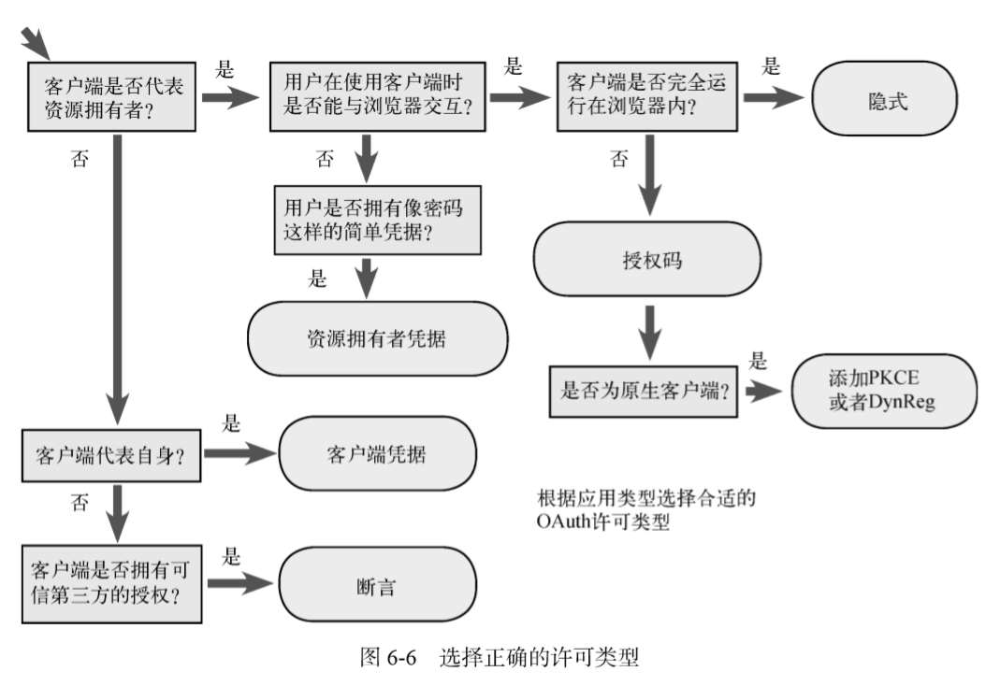

1. **隐式许可类型**，直接从授权端点返回令牌，没有令牌端点；
2. **客户端凭据许可类型**，没有明确的资源拥有者。只使用后端信道。
3. **资源拥有者凭据许可类型**，资源拥有者通过客户端使用账号密码换令牌
4. **断言许可类型**,

隐式许可类型 的起点入口： 

授权点接口（`/authorize`）的url search参数

| 参数名 | 类型 | 释义 |  |
|:--|:--|:--|:--|
| response_type | emAuthRespType | 响应类型 | required |
| scope | string | 需要申请的权限域 | optional |
| client_id | string | 客户端的唯一标识 | required |
| redirect_uri | string | 客户端地址，需要授权完成后跳转的地址 | required |
| state | string | csrf-token | optional |

回包结构

```js
// 隐式许可类型
?access_token=987tghjkiu6trfghjuytrghj&token_type=Bearer
```

```js
enum emAuthRespType {
  CODE: 'code',
  TOKEN: 'token'  // 隐式许可类型 
}
```

客户端凭据许可类型 与 资源拥有者凭据许可类型 的起点接口

`/token`，该接口是上面用code换access_token

| body参数 | 类型 | 释义 | - |
|:--|:--|:--|:--|
| grant_type | emGrantType | 获取token的方式 | required |
| scope | string | csrf-token | optional |
| username | string | 账户，资源拥有者凭据许可类型使用，账户是受保护资源的账户 | optional |
| password | string | 密码，资源拥有者凭据许可类型使用，账户是受保护资源的账户 | optional |

注意
- 账号和密码是由用户交互输出的，交互的页面由客户端提供！


| header参数 | 类型 | 释义 | - |
|:--|:--|:--|:--|
| Authorization | 'Basic <clent_id>+<clent_secret>' | *客户端凭证许可类型*和*资源拥有者凭据许可类型 *的使用，传递账号密码 | optional |

```js
enum emGrantType {
  AUTHORIZATION_CODE: 'authorization_code',
  CLIENT_CREDENTIALS: 'client_credentials',
  PASSWORD: 'password'
}
```
回报接口
```js
{
  "access_token": "987tghjkiu6trfghjuytrghj",
  "scope": "foo bar",
  "token_type": "Bearer"
} 
```

## 隐式许可类型

```js
} else if (query.response_type == 'token') { 
```

完全运行在浏览器中的 JavaScript应用就属于这种情况。在这种情况下，通过浏览器向客户端传递仅用于换 取令牌的授权码就没有任何实际意义了，因为这个额外的保密层没有起到任何作.

这种许可流程只使用授权端点而不使 用令牌端点

隐式许可流程不可用于获取刷新令牌。因为浏览器内的应用具有短暂运行的特点，只会在被加载到浏览器的期间保持会话，所以刷新令牌在这里的作用非常有限。

response_type 参数的值为 token，而不是 code。这样会通知授权服务器直接生成令牌，而 不是生成一个用于换取令牌的授权码。 


## 客户端凭据许可类型

与前面不同，使用另外一个接口（`/token`）

`/token`，该接口是上面用code换access_token

| 参数 | 类型 | 释义 | - |
|:--|:--|:--|:--|
| grant_type | emGrantType | 获取token的方式 | required |


```js
enum emGrantType {
  AUTHORIZATION_CODE: 'authorization_code',
  CLIENT_CREDENTIALS: 'client_credentials',
}
```

```js
} else if (req.body.grant_type == emGrantType.CLIENT_CREDENTIALS) { 
```

比如后端系统之间需要直接通信
只使用后端信道，客户端代表自己（它自己就是资源拥有 者）从令牌端点获取令牌。 

客户端向授权服务器的令牌端点发出令牌请求，这与授权码流程是一样的，只不过这一次使 用 client_credentials 作为 grant_type 参数的值，而且没有授权码或者其他用于换取令牌 的临时凭据。相反，客户端直接向授权服务器进行身份认证，而授权服务器给客户端颁发访问令牌

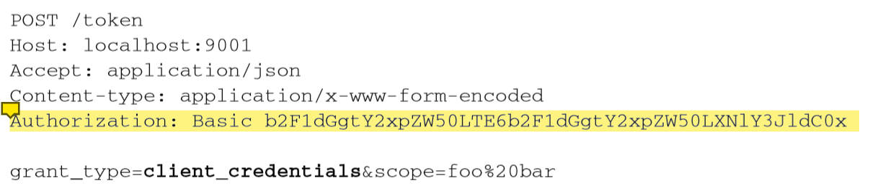

在客户端凭据许可流程中不会颁发刷新令牌，因为我们认为客户端能够随时获取新令牌，无 须单独的资源拥有者参与，因此在这种情况下没有必要使用刷新令牌。 

客户端凭据许可类型没有任何直接的用户交互!它确实是为可信的后端系统直接 访问服务而准备的。

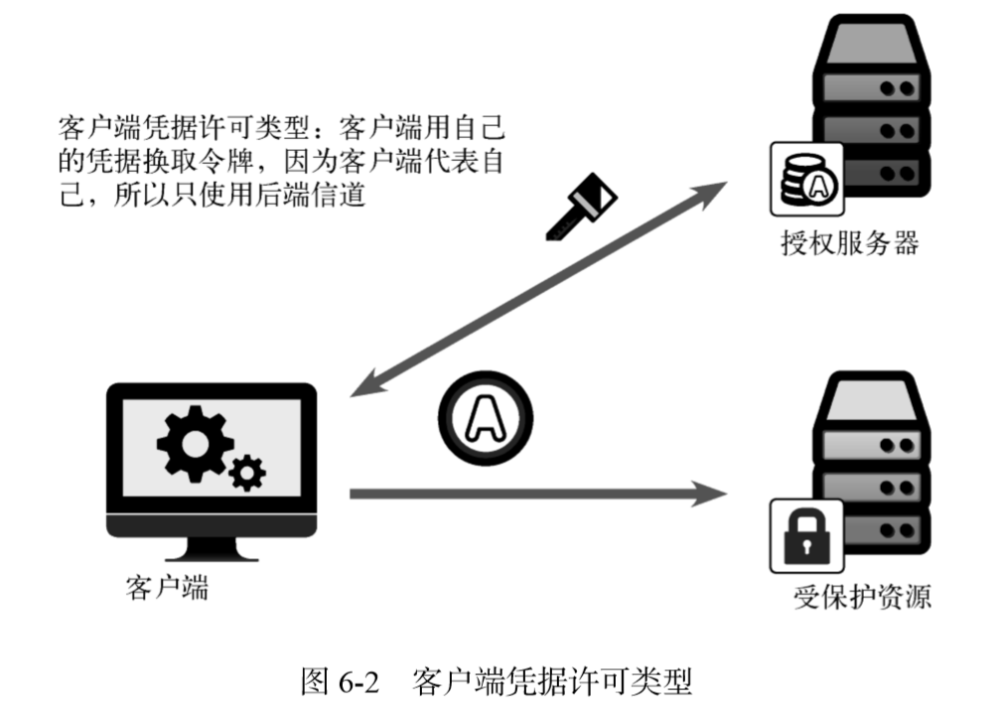


## 资源拥有者凭据许可类型 

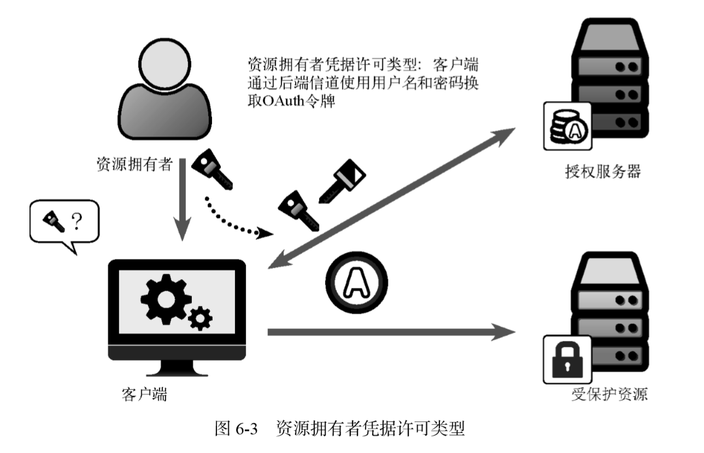

用户名和密码，那么客户端可以向用户索取用户 的凭据，然后用这个凭据换取令牌。支持客户端这样做的是资源拥有者凭据许可类型，也叫作密码流程。


这种许可类型的工作方式很简单。客户端收集用户的用户名和密码（使用什么样的交互接口 由客户端决定），然后将它们发送至授权服务器。 

授权服务器从收到的请求中取出用户名和密码，并与本地存储的用户信息对比。如果匹配， 则授权服务器向客户端颁发令牌。 

```js
grant_type == 'password'
```

完成所有的检查之后，就可以生成并返回令牌了。请注意，还可以生成刷新令牌（我们的练 习中这样做了）。为客户端提供刷新令牌之后，它就不需要再保存用户的密码了


# 客户端部署的应用类型

1. Web应用；
2. 浏览器应用；
3. 原生应用；

## Web应用

Web应用运行在远程服务器上，需要通过Web浏览器访问。应用的配置和运行时状态由 Web 服务器维护，通常使用会话 cookie 与浏览器保持 连接。

Web 应用很容易有效地使用授权码、客 户端凭据或者断言许可流程。由于浏览器一般不会将请求 URI 中的片段部分发送给服务器，大 多数情况下隐式许可流程不适用于Web 应用。 

## 浏览器应用

浏览器应用完全运行在浏览器内，一般使用 JavaScript。虽然应用的代码确实需要由Web 服 务器提供，但代码本身并不在服务器上运行，Web 服务器也不会维护应用的任何运行时状态。应 用的所有执行动作都发生在最终用户计算机的浏览器内。 

因 为浏览器应用受限于同源策略以及其他安全限制条件，这些限制是为了防止跨站攻击。因此，最 适合这类应用的是隐式许可流程，该许可流程就是针对这种应用场景而做的优化。 

## 原生应用

原生应用是直接在最终用户的设备（计算机或者移动设备）上运行的应用。应用软件通常是在外部经过编译或者打包之后再安装到设备上的。

# 密钥

客户端密钥属 于配置期间秘密，因为它代表客户端自身，是配置在客户端软件内部的。访问令牌、刷新令牌和 授权码都属于运行时秘密，因为它们都是在客户端软件被部署之后由客户端存储的。

运行时秘密仍然需要安全存储并保护，但是它们被设计得容易撤销或更改。相反，配置期间秘密一般不会经 常改变。 

不要求所有客户端都拥有客户端密钥，而是将客户 端分为两种类型：公开客户端和保密客户端，划分依据是能否持有配置期间秘密


Web 应用是最常见的保密客户端类 型，它是运行在 Web 服务器上的单个实例，单个 OAuth客户端可以对应多个资源拥有者


# OAuth令牌

**授权服务器生成令牌之后，会将令牌值存储在磁盘上的共享数据库中。当受保护资源从客户 端收到令牌之后，它会在同一个数据库中查找令牌值，以确定令牌有效**

*授权服务器* 和 *受保护资源* 间共享数据库。存在两者不共享的场景！

在授权服务器和受保护资源间共享数据库并不总是实际可行，特别是在一个授权服务器需要 保护下游的多个资源服务器的情况下。该如何解决这个问题呢？本章将讨论另外两种常见的方 案：结构化令牌和令牌内省

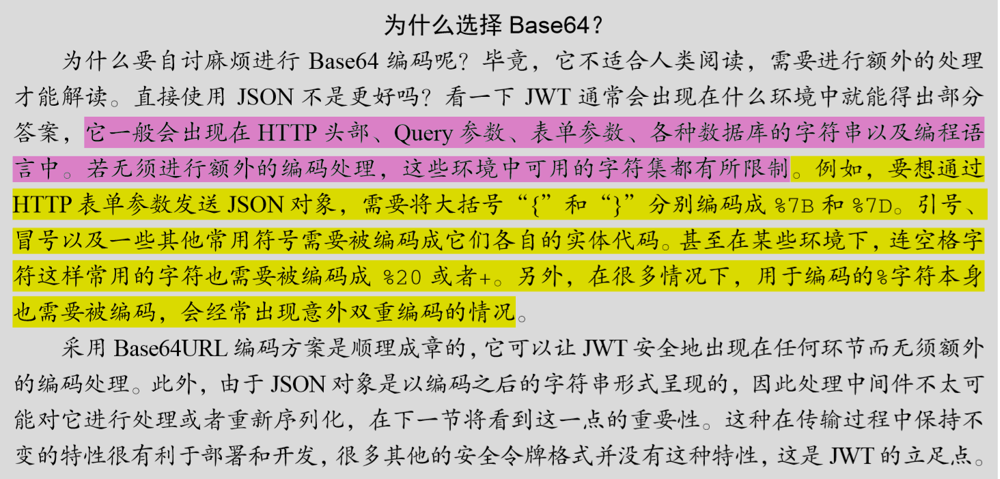


## JWT的结构

JWT的核心是将一个 JSON对象封 装为一种用于网络传输的格式

> eyJ0eXAiOiJKV1QiLCJhbGciOiJub25lIn0.eyJzdWIiOiIxMjM0NTY3ODkwIiwibmFtZSI6IkpvaG4gRG9lIiwiYWRtaW4iOnRydWV9. 

句点符号将字符串分割成了两部分

以句点符号将令牌字符串分解，让我们可以对令牌的 不同部分分别进行处理


>eyJ0eXAiOiJKV1QiLCJhbGciOiJub25lIn0
>
>. 
>
>eyJzdWIiOiIxMjM0NTY3ODkwIiwibmFtZSI6IkpvaG4gRG9lIiwiYWRtaW4iOnRydWV9
>
>.

对第一部分解码：

```js
{
  "typ": "JWT", 
  "alg": "none"
} 
```

这是 JWT的头部，它是一个 JSON对象，用于描述与令牌剩余部分有关的信息。其中的 typ 头告诉处理程序令牌的第二部分（载荷）是何种类型。

第二部分是令牌的载荷，它的序列化方式与 JWT头部相同：对 JSON对象进行 Base64URL 编码。由于它是 JWT，因此其载荷可以是任意的 JSON对象

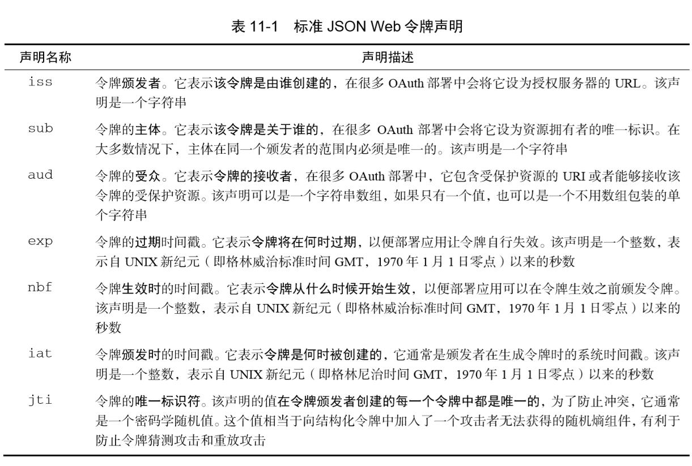


```js
var header = { 'typ': 'JWT', 'alg': 'none' }; 
var payload = {
  iss: 'http://localhost:9001/',   
  sub: code.user ? code.user.sub : undefined,   
  aud: 'http://localhost:9002/',   
  iat: Math.floor(Date.now() / 1000),   
  exp: Math.floor(Date.now() / 1000) + (5 * 60),   
  jti: randomstring.generate(8)
};
var access_token = base64url.encode(JSON.stringify(header))
  + '.'
  + base64url.encode(JSON.stringify(payload))
  + '.';
```


## 令牌的加密保护：JOSE 

JSON对象的签名和加密标准（JOSE①）。这套规范以 JSON为基础数据模型，提供了 签名（JSON Web签名，或称 JWS）、加密（JSON Web加密，或称 JWE）以及密钥存储格式（JSON Web 密钥，或称 JWK）的标准


### 使用HS256的对称签名

```js
var header = { 'typ': 'JWT', 'alg': 'HS256'}; 
var access_token = jose.jws.JWS.sign(
  header.alg,   
  JSON.stringify(header),   
  JSON.stringify(payload),   
  new Buffer(sharedTokenSecret).toString('hex')); 

// access_token
// eyJ0eXAiOiJKV1QiLCJhbGciOiJIUzI1NiJ9.eyJpc3MiOiJodHRwOi8vbG9jYWxob3N0OjkwMDEv   
// Iiwic3ViIjoiOVhFMy1KSTM0LTAwMTMyQSIsImF1ZCI6Imh0dHA6Ly9sb2NhbGhvc3Q6OTAwMi8   
// iLCJpYXQiOjE0NjcyNTEwNzMsImV4cCI6MTQ2NzI1MTM3MywianRpIjoiaEZLUUpSNmUifQ.Wq  
// RsY03pYwuJTx-9pDQXftkcj7YbRn95o-16NHrVugg
```

### 使用RS256的非对称签名

使用共享密钥时，创建签名和验证签名的系统使用的是同一个密钥。这实际上意味着授权服务器和资源服务器都能够生成令牌，因为它们都拥有创建令牌所需的密钥。

使用公钥 加密的话，授权服务器拥有公钥和私钥，可用于生成令牌，而受保护资源则只能访问授权服务器 的公钥，用于验证令牌。与使用共享密钥不同的是，受保护资源虽然能够很容易地验证令牌，但它无法自己生成有效的令牌。、

*使用非对称加密签名的目的就为了将创建令牌的权限收归到授权服务器。受保护资源服务器只能使用公钥进行验证而不能创建令牌！*


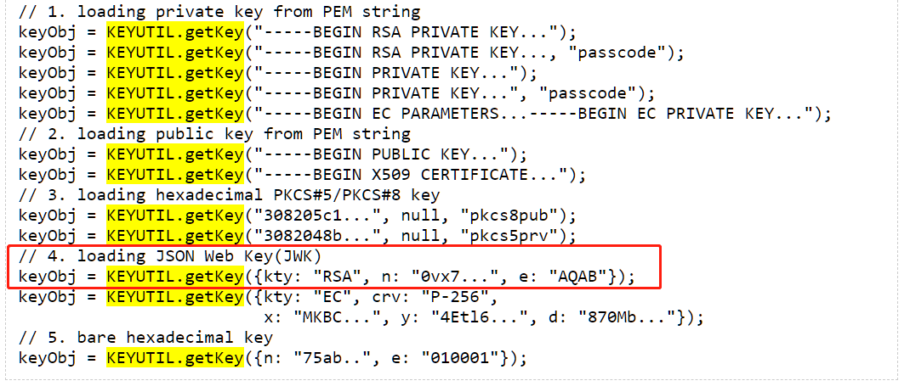


# 内省协议 

OAuth令牌内省协议定义了一种机制，让受保护资源能够主动向授权服务器查询令牌状态。
该协议是对 OAuth 的一个简单增强。授权服务器向客户端颁发令牌，客户端向受保护资源 出示令牌，受保护资源则向授权服务器查询令牌状

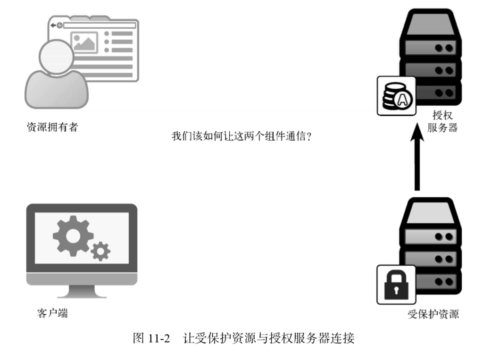

内省请求

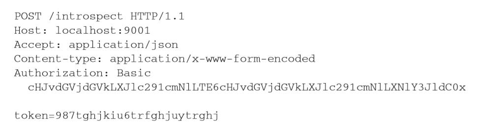

内省请求的响应是一个 JSON 对象，用于描述令牌信息。它的内容与 JWT 的载荷相似，任 何有效的 JWT声明都可以包含在响应中。 

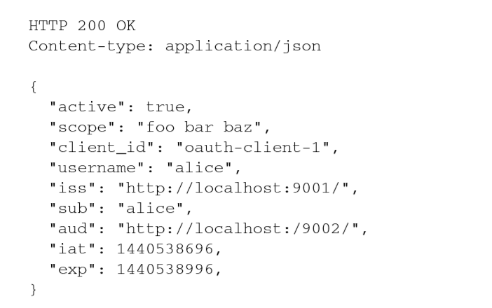

内省协议规范还在 JWT的基础上增加了几个声明定义，其中重要的是 active 声明。此 声明告诉受保护资源当前令牌在授权服务器上是否有效，且是唯一必须返回的声明。

## 构建内省端点

```js
var protectedResources = [{
  "resource_id": "protected-resource-1",        
  "resource_secret": "protected-resource-secret-1"
}];

var getProtectedResource = function(resourceId) {
  return __.find(protectedResources, function(protectedResource) {
    return   protectedResource.resource_id == resourceId;
  });
};

app.post('/introspect', function(req, res) { 
  var auth = req.headers['authorization']; 
  var resourceCredentials = decodeClientCredentials(auth); 
  var resourceId = resourceCredentials.id; 
  var resourceSecret = resourceCredentials.secret;

  var resource = getProtectedResource(resourceId);
  if (!resource) {   
    res.status(401).end();   
    return; 
  } 

  if (resource.resource_secret != resourceSecret) {   
    res.status(401).end();   
    return; 
  }

  var inToken = req.body.token; 
  
  nosql.one(function(token) {   
    if (token.access_token == inToken) {        
      return token;   
    } 
  }, function(err, token) {   
    if (token) { 
      var introspectionResponse = {              
        active: true,              
        iss: 'http://localhost:9001/',              
        aud: 'http://localhost:9002/',              
        sub: token.user ? token.user.sub : undefined,              
        username: token.user ? token.user.preferred_username : undefined,
        scope: token.scope ? token.scope.join(' ') : undefined,              
        client_id: token.client_id       
      }; 
      res.status(200).json(introspectionResponse);       
      return;   
    } else {       
      var introspectionResponse = {              
        active: false       
      };       
      res.status(200).json(introspectionResponse);       
      return;   
    } 
  });
});
```


## 发起令牌内省请求 

```js
var protectedResource = {   
  "resource_id": "protected-resource-1",   
  "resource_secret": "protected-resource-secret-1"
};
var form_data = qs.stringify({   
  token: inToken
}); 
var headers = {   
  'Content-Type': 'application/x-www-form-urlencoded',   
  'Authorization': 'Basic ' + encodeClientCredentials(
    protectedResource.resource_id, protectedResource.resource_secret)
}; 
 
var tokRes = await request('POST', authServer.introspectionEndpoint, {   
  body: form_data,   
  headers: headers 
});

if (tokRes.statusCode >= 200 && tokRes.statusCode < 300) {   
  var body = JSON.parse(tokRes.getBody()); 
 
  console.log('Got introspection response', body);   
  var active = body.active;   
  if (active) {        
    req.access_token = body;   
  } 
}
```

呈现了两种用于授权服务器和受保护资源之间传递信息的方法：结构化令牌（具体来说 就是 JWT）和令牌内省。看起来这两种方法需要二选一，但实际上，将它们结合起来使用也可 以得到很好的效果

# 动态客户端注册


OAuth 动态客户端注册协议②提供了一种方法，让客户端可以自行加入授权服务器，并注册 自己的各类相关信息。

# 生成授权码

```js

const randomString = require('random-string');

const code = randomString();

mysql.insert({
  table: 'code',
  field: { code }
})

```

# 附录

## 生成密钥

```js
const { KEYUTIL } = require('jsrsasign');
const rsaKeypair = KEYUTIL.generateKeypair("RSA", 1024);
const PRIVATE = KEYUTIL.getPEM(rsaKeypair.prvKeyObj, "PKCS8PRV");
const PUBLIC = KEYUTIL.getPEM(rsaKeypair.pubKeyObj);
```
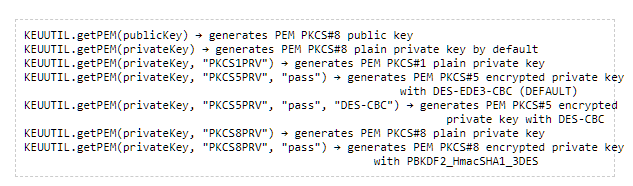
参考：http://kjur.github.io/jsrsasign/api/symbols/KEYUTIL.html

## 参考

- [oauth2 nodejs实战](http://laibh.top/2020-07-17-oauth2%20nodejs%E5%AE%9E%E6%88%98.html)
- [使用 Nodejs 搭建一个 OAuth2.0 服务](https://www.jianshu.com/p/7febbe553c83)
- [rfc6749](http://www.rfcreader.com/#rfc6749)