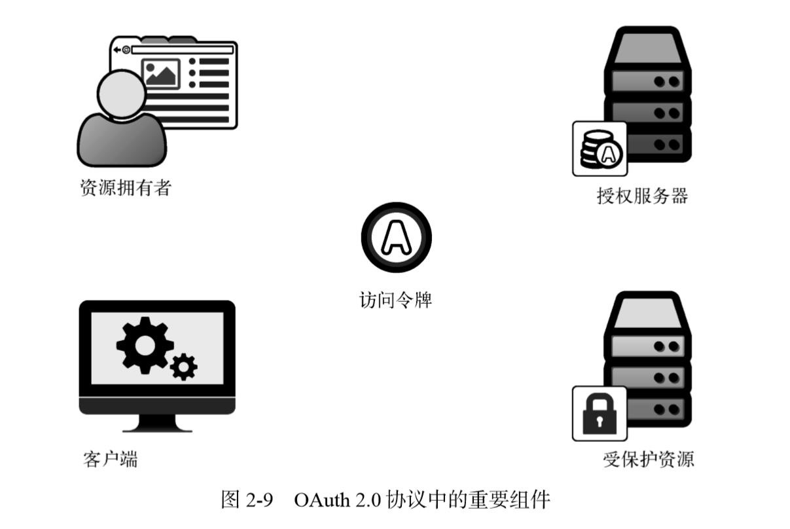
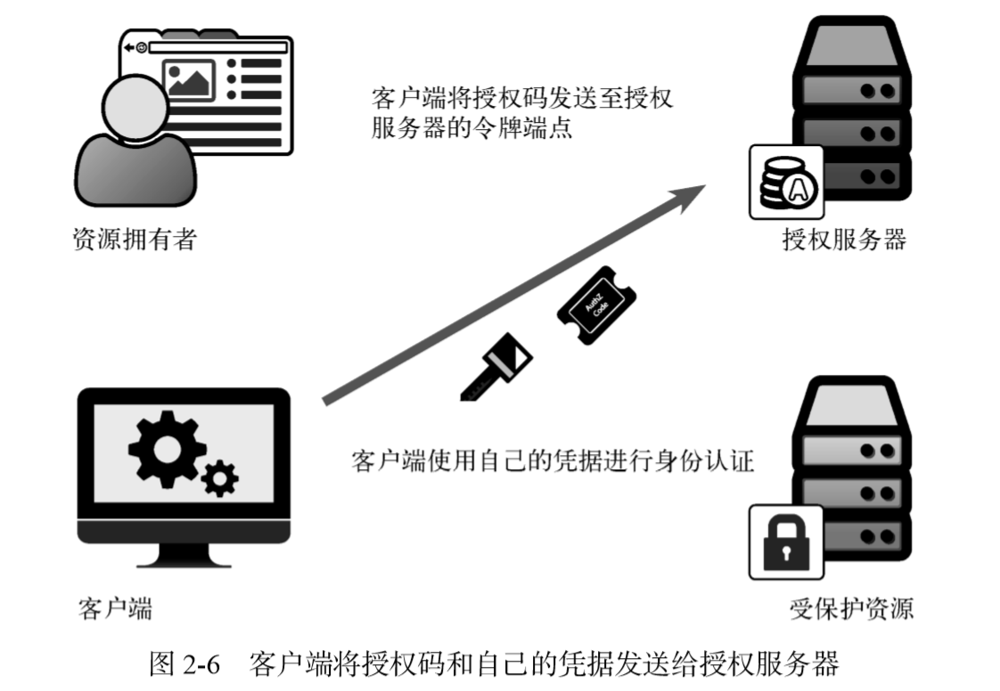
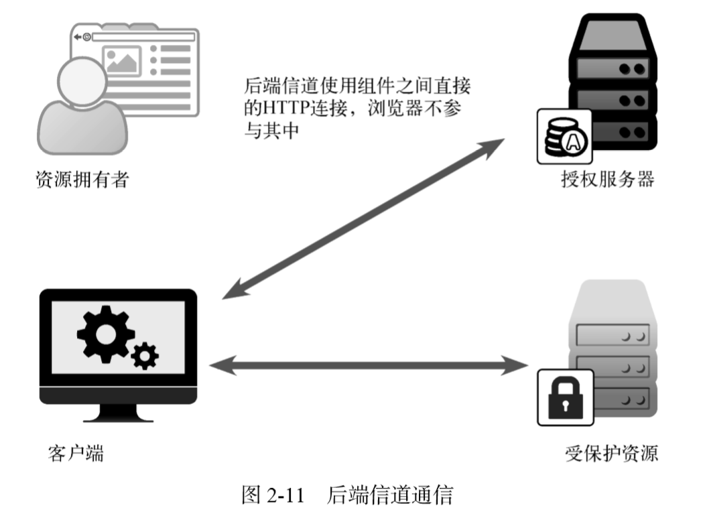
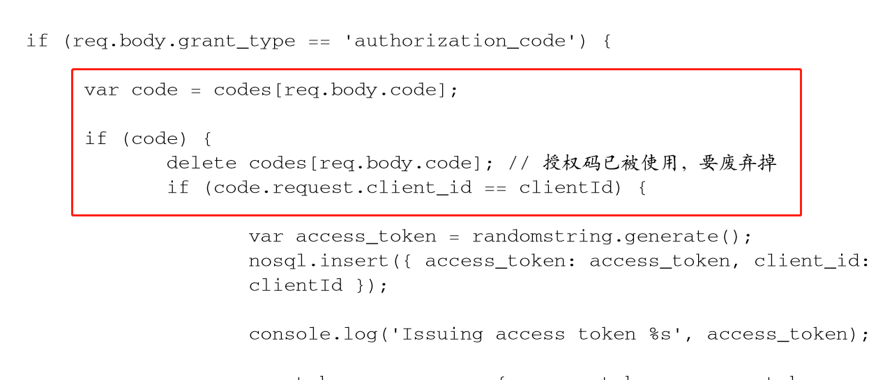
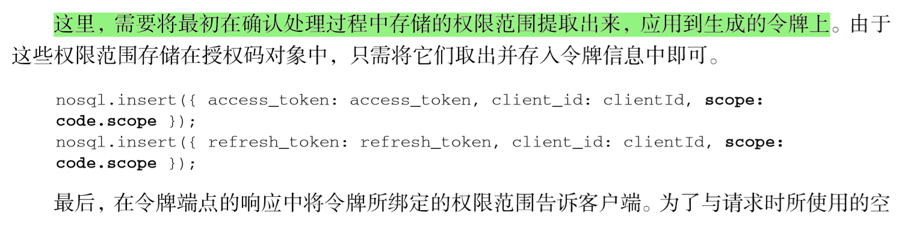

oauth2实践

auth2中的角色

# 管理OAuth客户端注册

oauth服务器需要为每个客户端分配唯一的客户端标识！

## 由谁来生成客户端 ID？ 

在常规 的 OAuth系统中，客户端 ID（client_id）和密钥（client_secret）由 *授权服务器* 颁发给客户端

通过客户端 ID查找信息，客户端 ID是从请求 

## 对客户端授权 

OAuth协议要求授权服务器提供两个端点：

- 授权端点，运行在前端信道上；
- 令牌端点，运行 在后端信道上

### 授权端点

授权服务器提供了一个授权端点，供客户端请求访问令牌和刷新令牌。客户端直接向该端点 发出请求，携带一组表单格式的参数，授权服务器解析并处理这些参数。然后授权服务器返回一 个代表令牌的 JSON对象

### 令牌端点

令牌端点不面向用户

客户端得到授权码，它可以将其发送给授权服务器的令牌端点，换取 OAuth访问令牌， 再进行解析和存储

OAuth流程中的很多部分都使用标准的 HTTP请求和响应格式来相互通信。由于这些请求通 常都发生在资源拥有者和用户代理的可见范围之外，因此它们统称为后端信道通信

### 重定向到授权端点 

授权端点是一个前端信道端点，客户端会 将用户浏览器重定向至该端点，以发出授权请求。

资源拥有者从客户端重定向到授权端点，它会带上客户端id。授权端点根客户端 ID查找客户端的详细信息：

1. 需要检查客户端是否存在；
2. 需要渲染出一个页面来（/authorize），让用户交互并进行授权

### 资源拥有者对客户端授权

1. 在授权页面交互，发请求（/approve）给授权点，生成授权码。
2. 生成授权码，将授权码存储。以便后续客户端用授权码换令牌

通过浏览器传过来的唯一信息就是 client_id，由于该信息是用浏览器通过前端信道传输的， 因此被视为公开信息。如此一来，任何人都可以冒充该客户端，但是我们还是可以借助一些信息 来判断请求的合法性，其中重要的就是检查传入的 redirect_uri 是否与客户端注册信息中 的一致

### 授权点需要保存客户端注册信息

1. client_id
2. redirect_uri，可以是array
3. client_secret

## 令牌颁发
1. 对客户端进行身份认证
2. 处理授权许可请求

客户端带过来的授权码其实没有很大用处。至少在书中它没和令牌有直接的关系！

授权码是作为一个一次性凭证，请求的时候就必须消耗，二次请求就会失效！

授权码的作用：保持一次性！

### 对客户端进行身份认证

客户端会带来 client_id 和 client_secret，用client_id去查client_id对应的的客户端已经注册的信息！比对 client_secret 是否正确有效！

### 处理授权许可请求

根据 grant_type 参数，选择令牌颁发方式！

OAuth 2.0完全没有规定访问令牌的内容应该是什么样的，它有一个很好的理由：支持多 样化的选择，每种选择都有各自的权衡，并适应于不同的场景。

看下面代码，我思考后发现：access_token，它颗粒度是去到单个用户，而不是单个client的维度！

客户端获取权限之后，用access_token访问受保护资源时，使用access_token去数据库查找详细信息，得到scope！

# 授权许可类型

1. 隐式许可类型，直接从授权端点返回令牌，没有令牌端点；

# 附录

## 参考

- [oauth2 nodejs实战](http://laibh.top/2020-07-17-oauth2%20nodejs%E5%AE%9E%E6%88%98.html)
- [使用 Nodejs 搭建一个 OAuth2.0 服务](https://www.jianshu.com/p/7febbe553c83)
- [rfc6749](http://www.rfcreader.com/#rfc6749)