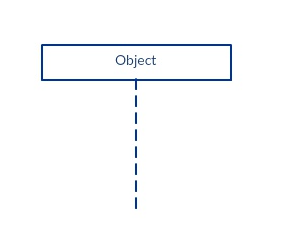

uml学习记录

# 生命线（lifeline）

|x|x|x|x|x|
|:--|:--:|:--:|:--:|--:|
||  |  |  |  |

# 激活条(Activation Bars)

激活条是被放在生命线上的一个矩形. 它被用来指示一个对象正在与其他对象交互,处于活跃的(或实例化的)状态. 这个矩形的长度表明对象处于激活状态的持续时间.

# 消息（Message）

连接生命线直线的连线

- 异步消息
- 同步消息
- 同步返回消息
- 丢失与找回消息

例子

# 附录

## 参考

- [快速学习时序图：时序图简介、画法及实例](http://www.uml.org.cn/oobject/201909202.asp)

## 示例

