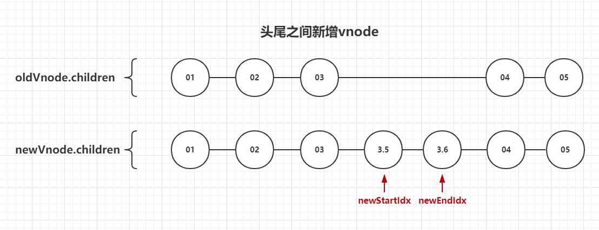

# 前言

**vue版本：2.6.10**

每次更新视图前都会根据视图模板生成vnode（虚拟的节点树），vnode类似dom树，但更简陋，每个vnode都与页面的上的元素html元素一一对应！为了更好的性能，因此要复用元素。那么就要知道怎么复用！就要对比newVnode（当前生成的vnode）和oldVnode（上次生成的vnode），对比完之后才知道那些是要删除，那些是需要重新创建，那些需要移动、移动到哪里！？
而diff算法则是对比的一种比较好的方式，更好的更快地对比，谁被谁复用！

newVnode和oldVnode的比对仅限于同层级之间对比，兄弟之间相互比较，如下图。不会出现跨层级的对比。


# diff算法是什么


diff算法不是一种对比的方法，而是一种寻找与当前节点匹配可复用节点的方法；寻找oldVnode.children中那个成员与newVnode.children中那个成员相同。

这种寻找的方法如图可见一斑，主要的方法有5种，辅助的有2种（未画在图上），一共7种。每种寻找方式相互独立！通过循环遍历children，逐一判断，直到循环结束。下面结合代码分别说明其中寻找方式。

**ps：无需过于在意图中所表达的逻辑，图只是用于辅助说明下面的源码**


```typescript
function updateChildren (
  parentElm,  // {Element}，父节点的真实html元素
  oldCh,  // {Vnode[]}，oldVnode.children
  newCh,  // {Vnode[]}，newVnode.children
  insertedVnodeQueue,   // {Vnode[]}，插入的节点队列（此时可忽略）
  removeOnly  // {Boolean}，是否只可以删除
) {
    let oldStartIdx = 0
    let newStartIdx = 0
    let oldEndIdx = oldCh.length - 1
    let oldStartVnode = oldCh[0]
    let oldEndVnode = oldCh[oldEndIdx]
    let newEndIdx = newCh.length - 1
    let newStartVnode = newCh[0]
    let newEndVnode = newCh[newEndIdx]
    let oldKeyToIdx, idxInOld, vnodeToMove, refElm

    // ...
}
```
建立四个指针`oldStartVnode`、`oldEndVnode`、`newStartVnode`、`newEndVnode`，由`updateChildren`中的定义可以知道：开始时，他们分别指向`oldVnode.children`的头部、`oldVnode.children`的尾部、`newVnode.children`的头部、`newVnode.children`的尾部。然后，这四个指针的指向也不是固定的，在循环遍历的过程中，他们的指向也会变动，他们指向会因为以下索引的变动而变动，`oldStartIdx`、`oldEndIdx`、`newStartIdx`、`newEndIdx`。

## 1.新头与旧头垂直对比


新旧头部vnode进行对比，判断是否匹配，以复用。sameVnode的功能与实现逻辑参考[附录：sameVnode的功能与实现逻辑]，值得一提的是：a.是input元素，更新前后type不一致；b.变动的是key属性；c.元素更新前后将所有属性删除，或从无到有；只要不是以上三种情况之一，不论怎么增删、修改元素上的属性，都不会影响是否匹配的结果！

1.判断新旧头部是匹配的，那么就调用`patchVnode`，给`newStartVnode`打补丁！

`patchVnode`函数的主要功能：

a. 复用elm，将oldVnode.elm赋值到newVnode.elm；
b. 更新elm上的属性变动；
c. 更新newVnode.children，增删或复用，这里的复用就是通过调用`updateChildren`来实现，没错递归了！

patchVnode函数的主要功能参考：[附录：patchVnode函数的关键实现]

2.分别右移`oldStartVnode`和`newStartVnode`。

```typescript
function updateChildren (/* */) {
  // ...
  while (oldStartIdx <= oldEndIdx && newStartIdx <= newEndIdx) {
    // ...

    /* 1 */
    else if (sameVnode(oldStartVnode, newStartVnode)) {
      patchVnode(oldStartVnode, newStartVnode, insertedVnodeQueue, newCh, newStartIdx)
      oldStartVnode = oldCh[++oldStartIdx]
      newStartVnode = newCh[++newStartIdx]
    }
    // ...
  }
  // ...
}
```

## 2.新尾与旧尾垂直对比


新旧尾部的对比情况和[1新头与旧头垂直对比]类似，再次再累累述，以下实现的逻辑：

```typescript
function updateChildren (/* */) {
  // ...
  while (oldStartIdx <= oldEndIdx && newStartIdx <= newEndIdx) {
    // ...

    /* 2 */
    else if (sameVnode(oldEndVnode, newEndVnode)) {
      patchVnode(oldEndVnode, newEndVnode, insertedVnodeQueue, newCh, newEndIdx)
      oldEndVnode = oldCh[--oldEndIdx]
      newEndVnode = newCh[--newEndIdx]
    }
    // ...
  }
  // ...
}
```

## 3.新尾与旧头交叉对比


当前情况与[1新头与旧头垂直对比]略有不同！看源码中，多出了下面这句：

```typescript
canMove && nodeOps.insertBefore(parentElm, oldStartVnode.elm, nodeOps.nextSibling(oldEndVnode.elm))
```

这句代码实现就是图片中移动elm的功能！为什么要移动elm？因为newEndVnode复用了oldStartVnode.elm，复用这一步已经由`patchVnode`函数实现，然后还需要让elm列的顺序与newVnode的顺序保持一致，所以需要将`oldStartVnode.elm`移动到正确的位置！

```typescript
function updateChildren (/* */) {
  // ...
  while (oldStartIdx <= oldEndIdx && newStartIdx <= newEndIdx) {
    // ...

    /* 3 */
    else if (sameVnode(oldStartVnode, newEndVnode)) { // Vnode moved right
      patchVnode(oldStartVnode, newEndVnode, insertedVnodeQueue, newCh, newEndIdx)
      /**
       * Node.insertBefore() 方法在参考节点之前插入一个拥有指定父节点的子节点。
       * 如果给定的子节点是对文档中现有节点的引用，insertBefore() 会将其从当前位置移动到新位置
       */
      // canMove && 在parentElm的nodeOps.nextSibling(oldEndVnode.elm)前面插入oldStartVnode.elm
      // 换言之，在 oldEndVnode.elm 前面插入 oldStartVnode.elm
      // 旧children的 头部真实元素 移动到 尾部真实元素的后面
      canMove && nodeOps.insertBefore(parentElm, oldStartVnode.elm, nodeOps.nextSibling(oldEndVnode.elm))
      oldStartVnode = oldCh[++oldStartIdx]
      newEndVnode = newCh[--newEndIdx]
    }
    // ...
  }
  // ...
}
```

## 4.新头与旧尾交叉对比


当前情况与[新尾与旧头交叉对比]类似，不做赘述！配合图片和源码食用口味更佳~

```typescript
function updateChildren (/* */) {
  // ...
  while (oldStartIdx <= oldEndIdx && newStartIdx <= newEndIdx) {
    // ...

    /* 4 */
    else if (sameVnode(oldEndVnode, newStartVnode)) { // Vnode moved left
      patchVnode(oldEndVnode, newStartVnode, insertedVnodeQueue, newCh, newStartIdx)
      // 将旧children的尾部真实元素移动到头部真实元素的后面
      canMove && nodeOps.insertBefore(parentElm, oldEndVnode.elm, oldStartVnode.elm)
      oldEndVnode = oldCh[--oldEndIdx]
      newStartVnode = newCh[++newStartIdx]
    }
    // ...
  }
  // ...
}
```

## 5.当前新vnode与旧头尾之间的vnode对比

在本次循环中，前4种控制流都没有进入，就说明一头一尾、两次交叉对比都没有找到可复用的节点！但这并非代表旧children中无可复用，因为头与尾之间的元素还没有比对过，第5种方式即是如此！这第5种方式在有定义`key`(`v-for`指令中的`key`)或没有的情况下又是不同的表现！

**注意：在此情况下，是用新头去旧children的头尾之间寻找可复用元素**

### 5-1.构建oldCildren映射表(key => idx)

从oldChildren构建一个映射表(key => idx)，这样就可以通过key，结合这个映射表快速找到匹配的可复用的元素。时间复杂度就是`O(1)`！

```typescript
function updateChildren (/* */) {
  // ...
  while (oldStartIdx <= oldEndIdx && newStartIdx <= newEndIdx) {
    // ...

    /* 5：当前新vnode与旧头尾之间的vnode对比 */
    else {
      /* 5-1 */
      // 只会执行一次，第一次定义映射表
      if (isUndef(oldKeyToIdx)) {
        // 创建对象映射表，children.key => children.i, i ∈ [oldStartIdx, oldEndIdx]
        oldKeyToIdx = createKeyToOldIdx(oldCh, oldStartIdx, oldEndIdx)
      }
      // ...
      newStartVnode = newCh[++newStartIdx]
    }
    // ...
  }
  // ...
}
```
createKeyToOldIdx的实现：
```typescript
function createKeyToOldIdx (children, beginIdx, endIdx) {
  let i, key
  const map = {}
  for (i = beginIdx; i <= endIdx; ++i) {
    key = children[i].key
    if (isDef(key)) map[key] = i
  }
  return map
}
```

### 5-2.根据5-1的映射表找到可复用vnode的索引

列表渲染中不一定会定义`key`，如果没有定义那么`5-1`的映射表就没有用了。那么就需要遍历旧children节点寻找与新头匹配的元素（详见下面代码的`findIdxInOld`方法）！那么时间复杂度就上来了，不再是使用映射表时的`O(1)`，而是`O(n)`。由此也可以知道使用`key`的性能优化优越之所在！

```typescript
function updateChildren (/* */) {
  // ...
  while (oldStartIdx <= oldEndIdx && newStartIdx <= newEndIdx) {
    // ...

    /* 5：当前新vnode与旧头尾之间的vnode对比 */
    else {
      // ...

      /* 5.2 */
      // 定义key，直接在名射表找，时间复杂度: O(1)
      // 没有定义key，用新vnode与旧vnode数组比对，时间复杂度：O(n)
      // const isDef = (v) => v !== undefined && v !== null
      idxInOld = isDef(newStartVnode.key)
        ? oldKeyToIdx[newStartVnode.key]
        // 返回oldCh中与newStartVnode相同（ sameVnode(newStartVnode, oldCh[itIdx]) ）节点(即isDef(oldCh[itIdx].key) 同样是false)的index
        : findIdxInOld(newStartVnode, oldCh, oldStartIdx, oldEndIdx)
      // ...
      newStartVnode = newCh[++newStartIdx]
    }
    // ...
  }
  // ...
}
```
findIdxInOld：时间复杂度`O(n)`
```typescript
function findIdxInOld (node, oldCh, start, end) {
  for (let i = start; i < end; i++) {
    const c = oldCh[i]
    if (isDef(c) && sameVnode(node, c)) return i
  }
}
```

### 5-3.无可复用旧元素

在旧children可能会找到也可能找不到可复用的元素，没有找到是什么情况？如图：


假如现在`newStartVnode`指向的是`key = 1.5`的vnode，那么很明显旧children中就没有可以复用的vnode，那么需要做的就是：a.创建一个与`newStartVnode`对应的newElm(新的真实html元素)；b.然后将newElm插入到旧children中`key=02`的vnode对应的真实元素的前面！

```typescript
function updateChildren (/* */) {
  // ...
  while (oldStartIdx <= oldEndIdx && newStartIdx <= newEndIdx) {
    // ...

    /* 5：当前新vnode与旧头尾之间的vnode对比 */
    else {
      // ...

      /* 5.3 */
      // 在旧虚拟节点中不存在新节点，无法复用旧元素
      /**
       * [ 1 ] [ 2 ] [ 3 ] [ 4 ] [ 5 ]
       * [ 1 ] [ 2 ] [2.5] [ 3 ] [ 4 ] [ 5 ]
       * [2.5]就是插入的，且就children中没有与之“相同”的vnode
       * 目前 newStartIdx = oldStartIdx = 2
       * 那么现在需要做的是：a.创建一个与[2.5]对应的真实元素；b.将元素插入到 [ 2 ] 后面 [ 3 ]前面
       * nodeOps.insertBefore(parentElm, newElm, oldStartVnode.elm)
       */
      if (isUndef(idxInOld)) { // New element
        // 创建 newStartVnode 对应的elm，将elm插入到parentElm的子元素oldStartVnode.elm的前面（如果oldStartVnode.elm不存在即插入到parentElm的最后）
        createElm(newStartVnode, insertedVnodeQueue, parentElm, oldStartVnode.elm, false, newCh, newStartIdx)
      }
      // ...
      newStartVnode = newCh[++newStartIdx]
    }
    // ...
  }
  // ...
}
```

### 5-4.复用旧元素

5-3和5-4是互斥的，进入5-4控制流就表示5-2中返回的`idxInOld`不为空，旧children中存在这匹配的vnode。虽然存在可用的vnode，但如果`key`并不可信呢？比如`v-for="(item, index) in items"`中的索引被用作`key`！！！因此有了下面的5-4-1和5-4-2。

#### 5-4-1.确实可复用

使用sameVnode方法二次确认vnodeToMove（在旧children中找到的vnode）时可用的！接下就是类似的操作。但比较明显的不同是：其他都是递增或递减新旧索引，但在5-4-1中则是递增newStartIdx，然后旧vnode置为null(`oldCh[idxInOld] = undefined`)，这是设计的巧妙之处，当前还没有感受到，再看下[-1.跳过左边已经复用的vnode](#-1跳过左边已经复用的vnode)和[0.跳过右边已经复用的vnode](#0跳过右边已经复用的vnode)中的内容就会豁然开朗！

```typescript
function updateChildren (/* */) {
  // ...
  while (oldStartIdx <= oldEndIdx && newStartIdx <= newEndIdx) {
    // ...

    /* 5：当前新vnode与旧头尾之间的vnode对比 */
    else {
      // ...

      /* 5-4 */
      // 在旧虚拟节点中存在新节点
      else {
        /* 5-4-1 */
        vnodeToMove = oldCh[idxInOld]
        // 保证节点的key和虚拟节点都相同（ oldKeyToIdx[newStartVnode.key] 获取的idxInOld，指向
        // 的虚拟节点可能与newStartVnode节点不一样(!sameVnode) ）
        if (sameVnode(vnodeToMove, newStartVnode)) {
          patchVnode(vnodeToMove, newStartVnode, insertedVnodeQueue, newCh, newStartIdx)
          oldCh[idxInOld] = undefined
          canMove && nodeOps.insertBefore(parentElm, vnodeToMove.elm, oldStartVnode.elm)
        }
      }
      // ...
      newStartVnode = newCh[++newStartIdx]
    }
    // ...
  }
  // ...
}
```

#### 5-4-2.虚假的可复用

5-4-1与5-4-2是互斥的，既然没有元素可以复用到`newStartVnode`中，那么只能像5-3中那样创建与`newStartVnode`对应的html元素！！！

```typescript
function updateChildren (/* */) {
  // ...
  while (oldStartIdx <= oldEndIdx && newStartIdx <= newEndIdx) {
    // ...

    /* 5：当前新vnode与旧头尾之间的vnode对比 */
    else {
      // ...

      /* 5-4 */
      // 在旧虚拟节点中存在新节点
      else {
        /* 5-4-2 */
        else {
          // same key but different element. treat as new element
          // key相同但虚拟节点不同，newStartVnode当做新元素创建
          createElm(newStartVnode, insertedVnodeQueue, parentElm, oldStartVnode.elm, false, newCh, newStartIdx)

        }
      }
      // ...
      newStartVnode = newCh[++newStartIdx]
    }
    // ...
  }
  // ...
}
```

## -1.跳过左边已经复用的vnode

我们知道`oldStartVnode`这个指针是不断地右移，从下面的代码中的`isUndef(oldStartVnode)`知道，一旦碰到未定的vnode就会右移一个单位，继续循环比对后面的vnode。为什么会有未定义的vnode？正常来说应该存在，因为vnode都是与页面上的html元素一一对应的！在[5-4-1.确实可复用](#5-4-1确实可复用)中，vue确实地将旧children中存在可复用elm的vnode手动置为了undefined：`oldCh[idxInOld] = undefined`！为什么置空不直接用`delete`操作符删除？！删了就换了idx顺序！！

```typescript
function updateChildren (/* */) {
  // ...
  while (oldStartIdx <= oldEndIdx && newStartIdx <= newEndIdx) {
    /* -1 */
    if (isUndef(oldStartVnode)) {
      oldStartVnode = oldCh[++oldStartIdx] // Vnode has been moved left

    }
    // ...
  }
  // ...
}
```

## 0.跳过右边已经复用的vnode

参考[-1.跳过左边已经复用的vnode](#-1跳过左边已经复用的vnode)

```typescript
function updateChildren (/* */) {
  // ...
  while (oldStartIdx <= oldEndIdx && newStartIdx <= newEndIdx) {
    // ...

    /* 0 */
    else if (isUndef(oldEndVnode)) {
      oldEndVnode = oldCh[--oldEndIdx]
    }
    // ...
  }
  // ...
}
```

## while中的控制流顺序

上面为了突出重点去讲，没有按while中控制流的顺序书写，以下是while块总各控制流的顺序：

```typescript
while (oldStartIdx <= oldEndIdx && newStartIdx <= newEndIdx) {
  /* -1：跳过左边已经复用的vnode */
  if (isUndef(oldStartVnode)) { /* */ }
  /* 0：跳过右边已经复用的vnode */
  else if (isUndef(oldEndVnode)) { /* */ }
  /* 1：新头与旧头垂直对比 */
  else if (sameVnode(oldStartVnode, newStartVnode)) { /* */ }
  /* 2：新尾与旧尾垂直对比 */
  else if (sameVnode(oldEndVnode, newEndVnode)) { /* */ }
  /* 3：新尾与旧头交叉对比 */
  else if (sameVnode(oldStartVnode, newEndVnode)) { /* */ }
  /* 4：新头与旧尾交叉对比 */
  else if (sameVnode(oldEndVnode, newStartVnode)) { /* */ }
  /* 5：当前新vnode与旧头尾之间的vnode对比 */
  else { /* */ }
}
```

# while之外

留意while的循环条件：`oldStartIdx <= oldEndIdx && newStartIdx <= newEndIdx`，只要`oldStartIdx`大于`oldEndIdx`或`newStartIdx`大于`newEndIdx`就会结束循环！换言之，只要遍历完新旧children任意一个就会结束循环！

a. 先遍历完旧children就说明**新children新增了vnode**，那么就要创建与这些vnodes对应的elm；
b. 先遍历完新children就说明**新children删除了一些vnode**，那么就要删除多出的vnodes。

```typescript
if (oldStartIdx > oldEndIdx) {
  // 会用调用node.insertBefore插入新元素，现在就是找引用元素，在refElm前面插入新元素
  refElm = isUndef(newCh[newEndIdx + 1])
    /**
     * 新的children没有新增元素（newStartIdx > newEndIdx） 
     * 或 后面新增了vnode（newStartIdx <= newEndIdx）
     * */
    ? null
    /**
     * newStartIdx <= newEndIdx
     * 新的children新增了元素，但不是在后面！
     * 可能是中间！
     * 也可能是在前面
     * */
    : newCh[newEndIdx + 1].elm

  // 循环调用 createElm
  addVnodes(parentElm, refElm, newCh, newStartIdx, newEndIdx, insertedVnodeQueue)
} else if (newStartIdx > newEndIdx) {
  removeVnodes(oldCh, oldStartIdx, oldEndIdx)
}
```

因为在循环遍历children的时候，startIdx（newStartIdx或oldStartIdx）和endIdx分别会向左和右移动。下面是四个索引移动的情况：

- newStartIdx右移：[1.新头与旧头垂直对比]、[4.新头与旧尾交叉对比]、[5.当前新vnode与旧头尾之间的vnode对比]；

- newEndIdx左移：[2.新尾与旧尾垂直对比]、[3.新尾与旧头交叉对比]；

- oldStartIdx右移：[-1.跳过左边已经复用的vnode]、[1.新头与旧头垂直对比]、[3.新尾与旧头交叉对比]；

- ildEndIdx左移：[0.跳过右边已经复用的vnode]、[2.新尾与旧尾垂直对比]、[4.新头与旧尾交叉对比]；


## 新children新增了vnode

根据newStartIdx和newEndIdx的移动情况

1.newStartIdx一直右移，由于新增的vnode都在后面，可以服用的vnode都在前面了，newEndIdx会保持不变，直到遍历完旧children：

&nbsp;

2.newStartIdx右移，newEndIdx左移，直到遍历完旧children：



3.新增的vnode都在前面了，由于是新的节点所以存在“newStartIdx右移”的情况，newStartIdx就保持不变了，而可复用的vnode在右边，随着一次次循环，newEndIdx则会左移：


新children删除了vnode的情况就不赘述，情况可以从上面的解析类推！


# 新旧vnode与真实元素elm的关系

vnode是和elm一一对应的，vnode的顺序和elm保持这一直，vnode上的属性也是与对应的elm的属性对应。所以，在patch（给oldVnode打补丁）前，可以认为oldVnode树与页面上elm树是对应的！


1.oldVnode.children中vnode的顺序和oldVnode.elm.children(oldVnode对应的elm的子元素列表)的顺序是保持一致的、elm上的属性也是保持一致；

2.diff算法通过对比oldVnode.children与newVnode.children的vnode，找到可以复用的elm，并改变elm的位置，使之与newVnode.children的顺序保持一致！


# 附录

## sameVnode的功能与实现逻辑

```typescript
function sameVnode (a, b) {
  return (
    a.key === b.key && (
      (
        // 标签相同
        a.tag === b.tag &&

        // 都是注释元素, 或都不是
        a.isComment === b.isComment &&

        // idDef = (v) => v !== undefined && v !== null
        // 都定义了，或都没有定义
        isDef(a.data) === isDef(b.data) &&

        // a = { data: { atttrs: { type: 'xxx' } } }
        // 1. 两节点的type相同，
        //   i. type存在, 且相同；
        //   ii. 两个type都没有定义，都是undefined；a、b都算是通过
        // 2. a、b节点type都是'text,number,password,search,email,tel,url'中之一
        // 换言之 a.type = text, b.type = password，也可以说两个input节点相同
        // 3. a不是input标签
        sameInputType(a, b)
      ) || (
        isTrue(a.isAsyncPlaceholder) &&
        a.asyncFactory === b.asyncFactory &&
        isUndef(b.asyncFactory.error)
      )
    )
  )
}

/**
 * makeMap是个工厂函数，生成 isTextInputType = (key) => {
 *   const map = { text: true, ..., url: true };
 *   return map[key];
 * }
 * 
 * 类似于 (val) => [text,number,password,search,email,tel,url].include(val);
 * */
const isTextInputType = makeMap('text,number,password,search,email,tel,url')
function sameInputType (a, b) {
  if (a.tag !== 'input') return true
  let i
  const typeA = isDef(i = a.data) && isDef(i = i.attrs) && i.type
  const typeB = isDef(i = b.data) && isDef(i = i.attrs) && i.type
  return typeA === typeB || isTextInputType(typeA) && isTextInputType(typeB)
}
```


- sameVnode的逻辑
- patchVnode的实现功能
- 移动元素：nodeOps.insertBefore


## patchVnode函数的关键实现

```typescript
function patchVnode (/* */) {
  // ...

  // a. 复用elm，将oldVnode.elm赋值到newVnode.elm；
  const elm = vnode.elm = oldVnode.elm

  const oldCh = oldVnode.children
  const ch = vnode.children

  // b. 更新elm上的属性变动；
  if (isDef(data) && isPatchable(vnode)) {
    for (i = 0; i < cbs.update.length; ++i) {
      cbs.update[i](oldVnode, vnode);
    }
    if (isDef(i = data.hook) && isDef(i = i.update)) i(oldVnode, vnode)
  }

  // 没有文本，即是还有子节点等情况
  if (isUndef(vnode.text)) {
    // 新旧vnode都有children
    if (isDef(oldCh) && isDef(ch)) {
      // c. 更新newVnode.children，增删或复用，这里的复用就是通过调用`updateChildren`来实现，没错递归了！
      if (oldCh !== ch) updateChildren(elm, oldCh, ch, insertedVnodeQueue, removeOnly)
    }
    // 省略其他的更新children的操作：增、删等
  }
  // ...
}
```

1.只和同等级元素比较


```typescript
function patchVnode(newVnode, oldVnode) {
  const elm = newVnode.elm = oldVnode.elm;
  const ch = newVnode.children;
  const oldCh = oldVnode.children;
  patchTagAttrs();
  if (
    isUndef(newVnode.text)
    && isDef(oldCh) && isDef(ch)
    && oldCh !== ch
  ) {
    updateChildren(ch, oldCh);
  }
}

updateChildren(newChild, oldChild) {
  let newStartIdx = 0;
  let oldStartIdx = 0;
  let newEndIdx = newChild.length - 1;
  let oldEndIdx = oldChild.length - 1;

  while (newStartIdx <= newEndIdx && oldStartIdx <= oldEndIdx) {
    if (vnodeHasKey()) {
      // O(n)
      itToFindSameVnode();
    } else {
      // O(1)
      findInMap();
    }
    patchVnode();
  }
}
```

[-1.跳过左边已经复用的vnode]: #-1跳过左边已经复用的vnode
[0.跳过右边已经复用的vnode]: #0跳过右边已经复用的vnode
[1.新头与旧头垂直对比]: #1新头与旧头垂直对比
[2.新尾与旧尾垂直对比]: #2新尾与旧尾垂直对比
[3.新尾与旧头交叉对比]: #3新尾与旧头交叉对比
[4.新头与旧尾交叉对比]: #4新头与旧尾交叉对比
[5.当前新vnode与旧头尾之间的vnode对比]: #5当前新vnode与旧头尾之间的vnode对比
[附录]: #附录
[附录：sameVnode的功能与实现逻辑]: #sameVnode的功能与实现逻辑
[附录：patchVnode函数的关键实现]: #patchVnode函数的关键实现


入口，patchVnode
遍历children： n
T(v) = T(v.children) + O(1);