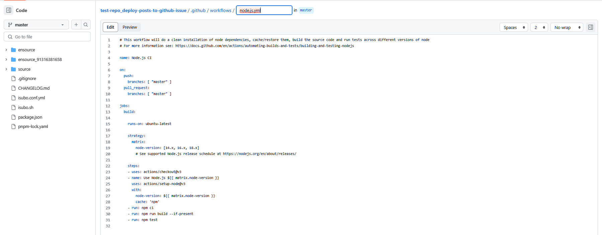

# Git Actions是什么？

> GitHub Actions is a continuous integration and continuous delivery (CI/CD) platform that allows you to automate your build, test, and deployment pipeline. You can create workflows that build and test every pull request to your repository, or deploy merged pull requests to production.
> https://docs.github.com/en/actions/learn-github-actions/understanding-github-actions#overview

# 什么是CICD？

CI/CD（持续集成和持续交付/部署）是一种软件开发实践，旨在通过自动化构建、测试和部署过程来加快软件交付的速度和质量。CI/CD 流程通常与版本控制系统（如 Git）和自动化工具（如 Jenkins、Travis CI、CircleCI、GitLab CI/CD 等）结合使用。

以下是一个基本的 CI/CD 流程的示例：

1. 代码托管：将代码存储在版本控制系统中，如 Git。

2. 触发构建：当代码被推送到特定的分支（如主分支）或提交到特定的分支时，CI/CD 工具会自动触发构建过程。

3. 构建：CI/CD 工具会从代码仓库中获取最新的代码，并执行构建过程。构建过程可以包括编译代码、运行单元测试、生成构建产物等。

4. 测试：构建完成后，自动化测试工具会运行各种测试，包括单元测试、集成测试、端到端测试等。测试的目的是确保代码的质量和功能的稳定性。

5. 静态分析：可以使用静态代码分析工具来检查代码质量，并提供反馈和建议以改善代码。

6. 部署：如果构建和测试成功，CI/CD 工具会自动将构建产物部署到目标环境，如开发、测试或生产环境。部署可以包括将代码复制到服务器、配置环境变量、启动服务等操作。

7. 自动化流程：整个 CI/CD 过程可以通过配置和脚本自动化执行，以确保一致性和可重复性。

8. 监控和反馈：在部署完成后，可以设置监控和日志记录系统来跟踪应用程序的性能和行为。如果出现问题，可以通过集成警报系统发送通知。

CI/CD 的好处包括减少手动操作、提高开发团队的效率、加速软件交付、提高代码质量和稳定性等。

具体的 CI/CD 流程会因组织和项目的需求而有所不同，可以根据团队的实际情况进行定制和扩展。常见的 CI/CD 工具提供了丰富的功能和配置选项，使您能够根据项目的特定需求来创建自定义的 CI/CD 流程。

# 常见的CICD有那些？

| 工具/平台      | 描述                                                     | 特点                                                         | 出现时间 |
|---------------|----------------------------------------------------------|--------------------------------------------------------------|----------|
| Jenkins       | 开源的 CI/CD 工具，提供丰富的插件和扩展性                         | 可扩展性强，支持各种复杂构建和部署场景                              | 2004年   |
| Bamboo        | Atlassian 公司提供的 CI/CD 工具，适用于大型企业和团队               | 与其他 Atlassian 产品无缝集成，适用于复杂的开发和部署需求              | 2007年   |
| TeamCity      | JetBrains 公司提供的 CI/CD 工具，具有简单易用的界面和强大的可扩展性  | 提供易用的界面和强大的可扩展性，适用于各种构建、测试和部署场景         | 2006年   |
| Travis CI     | 托管的 CI/CD 平台，与 GitHub 集成紧密                             | 简单易用，广泛用于开源项目                                        | 2011年   |
| CircleCI      | 基于云的 CI/CD 平台，适用于小型和中型项目                         | 配置简单，提供快速的构建和部署                                    | 2011年   |
| GitLab CI/CD  | GitLab 内置的 CI/CD 工具，与 GitLab 代码托管平台紧密结合            | 与 GitLab 紧密集成，便于代码管理和版本控制                           | 2011年   |
| Azure DevOps  | Microsoft 提供的全面开发和交付工具，适用于云原生应用程序开发和部署 | 提供完整的开发和交付生命周期管理，与 Microsoft 技术生态紧密集成        | 2018年   |
| GitHub Actions| GitHub 提供的集成 CI/CD 服务，与 GitHub 代码仓库紧密结合            | 与 GitHub 紧密集成，提供丰富的操作库和工作流程定义                    | 2019年   |

以上是按照工具/平台的出现时间排序的常见 CI/CD 工具和平台的表格。

# 怎么调试Git Actions？

# 可以在Git Actions中使用那些预定义的操作？

# github actions中的general和runners有什么不同

在 GitHub Actions 中，"General" 和 "Runners" 是两个不同的概念，它们之间有以下区别：

1. **General（通用）：** "General" 是指 GitHub Actions 的一般功能和特性。它是一种持续集成和持续部署（CI/CD）平台，允许您自动化构建、测试和部署代码。使用 "General" 功能，您可以定义工作流程、触发事件、设置环境变量、配置工作步骤等。它是 GitHub Actions 的核心部分，提供了灵活的自动化能力。

2. **Runners（运行器）：** "Runners" 是 GitHub Actions 中负责执行工作流程的计算机环境。它们是托管在云端或本地的虚拟机或容器实例。当您的工作流程被触发时，GitHub Actions 会选择合适的运行器来运行工作流程中的每个步骤。运行器执行工作步骤的过程中，可以访问您的代码仓库，并执行预定义的操作，如克隆代码、运行命令和脚本等。

   - **GitHub 托管的运行器：** GitHub 提供了托管的运行器，称为 "GitHub-hosted runners"。这些运行器由 GitHub 管理和维护，可以在 GitHub Actions 中免费使用。它们包括各种预安装的软件和工具，如操作系统、编程语言环境等。

   - **自托管的运行器：** 除了使用 GitHub-hosted runners，您还可以配置和使用自己的运行器。这些自托管的运行器可以在您自己的服务器、虚拟机或容器中运行。自托管运行器允许您更好地控制运行环境和硬件资源，并可以满足特定的需求。

总结起来，"General" 是 GitHub Actions 的核心功能，提供了构建、测试和部署等自动化能力，而 "Runners" 是用于执行工作流程的计算机环境，可以是 GitHub 托管的运行器或自托管的运行器。

# 实践-创建action文件

可以被event触发，也可以手动触发

> Workflows
> A workflow is a configurable automated process that will run one or more jobs. Workflows are defined by a YAML file checked in to your repository and will run when <mark>triggered by an event in your repository, or they can be triggered manually, or at a defined schedule</mark>.
>
> Workflows are defined in the `.github/workflows` directory in a repository, and a repository can have multiple workflows, each of which can perform a different set of tasks. For example, you can have one workflow to build and test pull requests, another workflow to deploy your application every time a release is created, and still another workflow that adds a label every time someone opens a new issue.
> 
> You can reference a workflow within another workflow. For more information, see "Reusing workflows."
> 
> For more information about workflows, see "Using workflows."

# 参考

- https://docs.github.com/en/actions/quickstart

# 附录

## npm ci

`npm ci` 是 npm（Node Package Manager）命令的一种形式，用于执行项目的快速、干净的安装过程。它的作用如下：

1. **确定性安装：** `npm ci` 的主要目的是在项目中进行确定性的依赖项安装。它会根据 `package-lock.json`（或 `npm-shrinkwrap.json`）文件中记录的确切依赖项版本，安装项目所需的依赖项。这样可以确保在不同环境下的安装结果始终一致，减少了可能出现的依赖项版本冲突问题。

2. **忽略 package.json：** 与 `npm install` 不同，`npm ci` 在安装依赖时忽略 `package.json` 文件，而是直接使用 `package-lock.json`（或 `npm-shrinkwrap.json`）作为依赖项清单。这样可以确保只安装指定版本的依赖项，而不考虑 `package.json` 中可能存在的不精确或不确定的版本范围。

3. **快速安装：** `npm ci` 在执行时会进行一些优化，以提高安装速度。它会跳过创建或更新 `node_modules` 目录中的符号链接，而是直接将依赖项从 `package-lock.json`（或 `npm-shrinkwrap.json`）解析并安装到适当的位置。这种简化的安装过程使得安装速度更快。

需要注意的是，`npm ci` 命令要求项目中必须存在 `package-lock.json`（或 `npm-shrinkwrap.json`）文件，以确保安装的依赖项版本的确定性。因此，它通常用于生产环境或持续集成（CI）环境中，以确保在不同的环境中构建和部署项目时使用相同的依赖项版本。对于开发环境，通常使用 `npm install` 命令来安装依赖项，以便可以更灵活地处理版本范围和开发依赖项的安装。