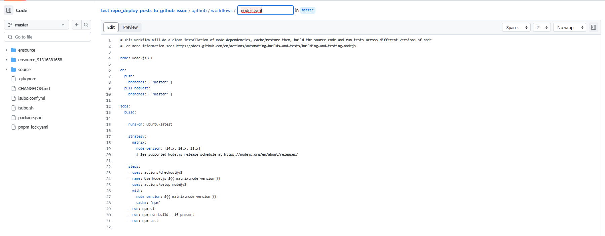
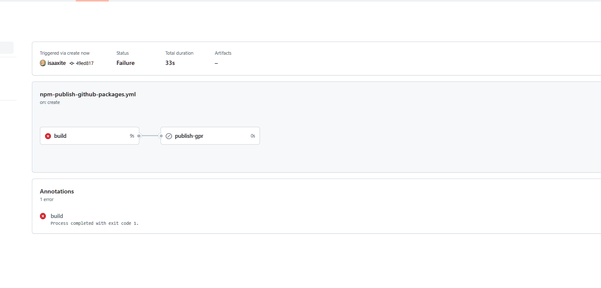
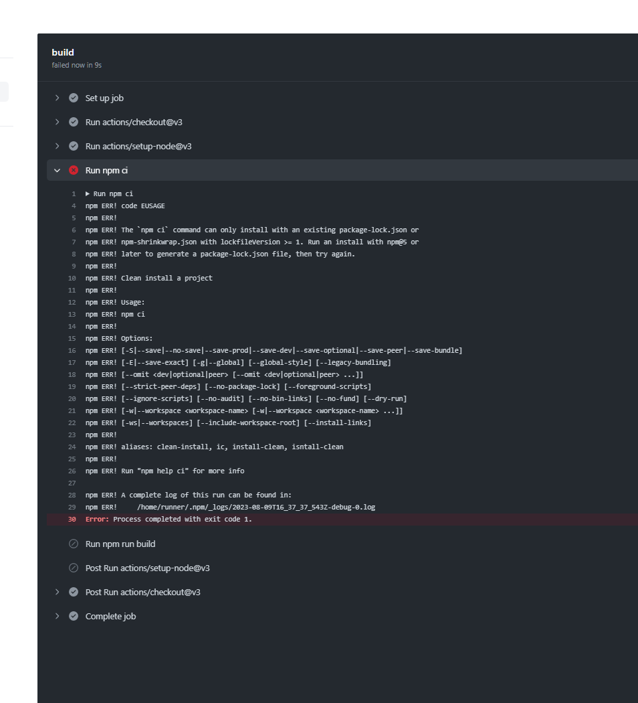
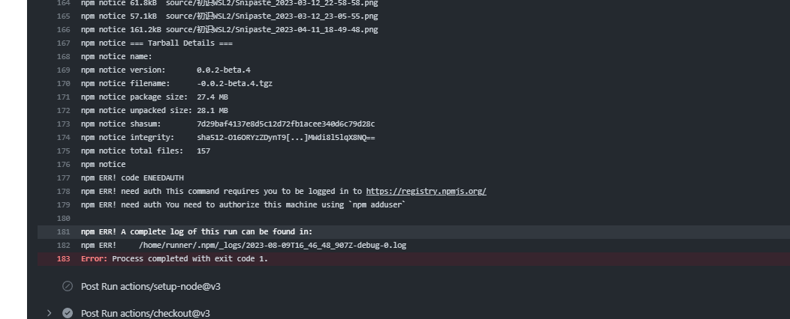

# 前言

最近持续迭代的npm包，isubo。功能已经完成得七七八八，因此开始逐渐完成包开发的一些基本设施，比如自动化的能力。在项目代码使用Github管理，在它开始之初已经略有了解 GitHub-Actions，模糊地知道Gtihub Actions 是 Github 提供的 CICD 工具。由于各种原因的将此增加自动化能力的工作置后到最近。

本文将围绕Github Actions展开，了解Gtihub Actions、CICD概念，常见的CICD。接着回归实际问题，详细了解Github Actions的使用、配置文件的常用配置项。最后，实践上面提到的isubo的自动化能力。

# Git Actions是什么？

> GitHub Actions is a continuous integration and continuous delivery (CI/CD) platform that allows you to automate your build, test, and deployment pipeline. You can create workflows that build and test every pull request to your repository, or deploy merged pull requests to production.
> https://docs.github.com/en/actions/learn-github-actions/understanding-github-actions#overview

# 什么是CICD？

CI/CD（持续集成和持续交付/部署）是一种软件开发实践，旨在通过自动化构建、测试和部署过程来加快软件交付的速度和质量。CI/CD 流程通常与版本控制系统（如 Git）和自动化工具（如 Jenkins、Travis CI、CircleCI、GitLab CI/CD 等）结合使用。

以下是一个基本的 CI/CD 流程的示例：

1. 代码托管：将代码存储在版本控制系统中，如 Git。

2. 触发构建：当代码被推送到特定的分支（如主分支）或提交到特定的分支时，CI/CD 工具会自动触发构建过程。

3. 构建：CI/CD 工具会从代码仓库中获取最新的代码，并执行构建过程。构建过程可以包括编译代码、运行单元测试、生成构建产物等。

4. 测试：构建完成后，自动化测试工具会运行各种测试，包括单元测试、集成测试、端到端测试等。测试的目的是确保代码的质量和功能的稳定性。

5. 静态分析：可以使用静态代码分析工具来检查代码质量，并提供反馈和建议以改善代码。

6. 部署：如果构建和测试成功，CI/CD 工具会自动将构建产物部署到目标环境，如开发、测试或生产环境。部署可以包括将代码复制到服务器、配置环境变量、启动服务等操作。

7. 自动化流程：整个 CI/CD 过程可以通过配置和脚本自动化执行，以确保一致性和可重复性。

8. 监控和反馈：在部署完成后，可以设置监控和日志记录系统来跟踪应用程序的性能和行为。如果出现问题，可以通过集成警报系统发送通知。

CI/CD 的好处包括减少手动操作、提高开发团队的效率、加速软件交付、提高代码质量和稳定性等。

具体的 CI/CD 流程会因组织和项目的需求而有所不同，可以根据团队的实际情况进行定制和扩展。常见的 CI/CD 工具提供了丰富的功能和配置选项，使您能够根据项目的特定需求来创建自定义的 CI/CD 流程。

# 常见的CICD有那些？

| 工具/平台      | 描述                                                     | 特点                                                         | 出现时间 |
|---------------|----------------------------------------------------------|--------------------------------------------------------------|----------|
| Jenkins       | 开源的 CI/CD 工具，提供丰富的插件和扩展性                         | 可扩展性强，支持各种复杂构建和部署场景                              | 2004年   |
| Bamboo        | Atlassian 公司提供的 CI/CD 工具，适用于大型企业和团队               | 与其他 Atlassian 产品无缝集成，适用于复杂的开发和部署需求              | 2007年   |
| TeamCity      | JetBrains 公司提供的 CI/CD 工具，具有简单易用的界面和强大的可扩展性  | 提供易用的界面和强大的可扩展性，适用于各种构建、测试和部署场景         | 2006年   |
| Travis CI     | 托管的 CI/CD 平台，与 GitHub 集成紧密                             | 简单易用，广泛用于开源项目                                        | 2011年   |
| CircleCI      | 基于云的 CI/CD 平台，适用于小型和中型项目                         | 配置简单，提供快速的构建和部署                                    | 2011年   |
| GitLab CI/CD  | GitLab 内置的 CI/CD 工具，与 GitLab 代码托管平台紧密结合            | 与 GitLab 紧密集成，便于代码管理和版本控制                           | 2011年   |
| Azure DevOps  | Microsoft 提供的全面开发和交付工具，适用于云原生应用程序开发和部署 | 提供完整的开发和交付生命周期管理，与 Microsoft 技术生态紧密集成        | 2018年   |
| GitHub Actions| GitHub 提供的集成 CI/CD 服务，与 GitHub 代码仓库紧密结合            | 与 GitHub 紧密集成，提供丰富的操作库和工作流程定义                    | 2019年   |

以上是按照工具/平台的出现时间排序的常见 CI/CD 工具和平台的表格。

# github actions的原理

GitHub Actions是GitHub提供的一种自动化工作流程解决方案，可以帮助开发者在代码库中自动执行各种任务和操作。它的工作原理可以简单概括为以下几个步骤：

1. 触发事件：GitHub Actions会根据代码库中的事件触发工作流程。事件可以是代码提交、分支创建、问题更新等，或者可以通过API手动触发。

1. 选择工作流程：一旦触发了事件，GitHub会根据库中的配置文件（例如`.github/workflows`目录下的YAML文件）来确定要执行的工作流程。一个库可以定义多个工作流程。

1. 创建作业（Job）：每个工作流程由一个或多个作业组成。作业是指一系列要执行的任务。一个工作流程可以包含并行或顺序运行的多个作业。

1. 运行步骤（Step）：每个作业由一个或多个步骤组成。步骤是要在作业中执行的独立任务。每个步骤可以运行特定的命令、脚本或操作。

1. 执行环境（Runner）：GitHub Actions提供了托管的执行环境（称为Runner），用于运行工作流程中的作业和步骤。Runner可以是GitHub托管的虚拟机器，也可以是自己托管的物理机器、虚拟机器或容器。

1. 执行操作（Action）：每个步骤可以使用现有的操作（Action）或自定义的操作来执行特定的任务。操作是可重用的脚本或命令集，可用于构建和执行特定的任务。

1. 输出结果：在工作流程运行期间，可以将输出结果传递给其他步骤或作业。这些输出可以用于根据结果执行后续操作或通知。

1. 监控和日志记录：GitHub Actions会监视工作流程的执行，并生成相应的日志记录。开发者可以查看日志，了解每个步骤的执行情况，以及发现和解决任何潜在的问题。

通过这些步骤，GitHub Actions提供了一种灵活且可扩展的自动化方式，可以根据代码库中的事件和条件触发各种操作和任务，从而提高开发工作流程的效率和质量。


# 怎么调试Git Actions？

# 可以在Git Actions中使用那些预定义的操作？

# github actions中的general和runners有什么不同

在 GitHub Actions 中，"General" 和 "Runners" 是两个不同的概念，它们之间有以下区别：

1. **General（通用）：** "General" 是指 GitHub Actions 的一般功能和特性。它是一种持续集成和持续部署（CI/CD）平台，允许您自动化构建、测试和部署代码。使用 "General" 功能，您可以定义工作流程、触发事件、设置环境变量、配置工作步骤等。它是 GitHub Actions 的核心部分，提供了灵活的自动化能力。

2. **Runners（运行器）：** "Runners" 是 GitHub Actions 中负责执行工作流程的计算机环境。它们是托管在云端或本地的虚拟机或容器实例。当您的工作流程被触发时，GitHub Actions 会选择合适的运行器来运行工作流程中的每个步骤。运行器执行工作步骤的过程中，可以访问您的代码仓库，并执行预定义的操作，如克隆代码、运行命令和脚本等。

   - **GitHub 托管的运行器：** GitHub 提供了托管的运行器，称为 "GitHub-hosted runners"。这些运行器由 GitHub 管理和维护，可以在 GitHub Actions 中免费使用。它们包括各种预安装的软件和工具，如操作系统、编程语言环境等。

   - **自托管的运行器：** 除了使用 GitHub-hosted runners，您还可以配置和使用自己的运行器。这些自托管的运行器可以在您自己的服务器、虚拟机或容器中运行。自托管运行器允许您更好地控制运行环境和硬件资源，并可以满足特定的需求。

总结起来，"General" 是 GitHub Actions 的核心功能，提供了构建、测试和部署等自动化能力，而 "Runners" 是用于执行工作流程的计算机环境，可以是 GitHub 托管的运行器或自托管的运行器。


# 实践-创建action文件



可以被event触发，也可以手动触发


> Workflows
> A workflow is a configurable automated process that will run one or more jobs. Workflows are defined by a YAML file checked in to your repository and will run when <mark>triggered by an event in your repository, or they can be triggered manually, or at a defined schedule</mark>.
>
> Workflows are defined in the `.github/workflows` directory in a repository, and a repository can have multiple workflows, each of which can perform a different set of tasks. For example, you can have one workflow to build and test pull requests, another workflow to deploy your application every time a release is created, and still another workflow that adds a label every time someone opens a new issue.
> 
> You can reference a workflow within another workflow. For more information, see "Reusing workflows."
> 
> For more information about workflows, see "Using workflows."


*events的作用是触发工作流*

> Events
> <mark>An event is a specific activity in a repository that triggers a workflow run.</mark> For example, activity can originate from GitHub when someone creates a pull request, opens an issue, or pushes a commit to a repository. You can also trigger a workflow to run on a schedule, by posting to a REST API, or manually.
>
> For a complete list of events that can be used to trigger workflows, see Events that trigger workflows.

Events 有那些预设？

文章中列出了支持的预设：[Events that trigger workflows](https://docs.github.com/en/actions/using-workflows/events-that-trigger-workflows)

合并到主分支应该监听那个event？

可以使用 [pull_request](https://docs.github.com/en/actions/using-workflows/events-that-trigger-workflows#pull_request)

它包含众多子类型：
抱歉我之前的回答遗漏了一些类型。以下是完整的 `pull_request` 事件的 `types` 属性列表及其含义：

- **assigned:** 当有人被分配为 pull request 的负责人时触发工作流。
- **unassigned:** 当有人被解除分配为 pull request 的负责人时触发工作流。
- **labeled:** 当为 pull request 添加标签时触发工作流。
- **unlabeled:** 当从 pull request 移除标签时触发工作流。
- **opened:** 当有新的 pull request 被创建时触发工作流。
- **edited:** 当 pull request 的标题、描述或分支发生更改时触发工作流。
- **closed:** 当任何一个 pull request 被关闭时触发工作流。
- **reopened:** 当之前关闭的 pull request 被重新打开时触发工作流。
- **synchronize:** 当某个已打开的 pull request 中的提交发生更改时触发工作流。
- **converted_to_draft:** 当 pull request 被转为草稿状态时触发工作流。
- **ready_for_review:** 当 pull request 被标记为 "ready for review" 时触发工作流。
- **locked:** 当 pull request 被锁定时触发工作流。
- **unlocked:** 当 pull request 被解锁时触发工作流。
- **review_requested:** 当为 pull request 请求代码审查时触发工作流。
- **review_request_removed:** 当从 pull request 移除代码审查请求时触发工作流。
- **auto_merge_enabled:** 当自动合并功能被启用时触发工作流。
- **auto_merge_disabled:** 当自动合并功能被禁用时触发工作流。

这些类型提供了丰富的事件触发选项，您可以根据需要选择适当的类型以实现特定的工作流程。

其中在需要

- 测试分支质量时可以监听 opened 类型；

- 持续继承与发布时可以监听 closed 类型


*jobs是什么？*

jobs 描述工作流的内容，比测试、版本管理，发布等等。

> Jobs
> A job is a set of steps in a workflow that is executed on the same runner. Each step is either a shell script that will be executed, or an action that will be run. Steps are executed in order and are dependent on each other. Since each step is executed on the same runner, you can share data from one step to another. For example, you can have a step that builds your application followed by a step that tests the application that was built.
>
> You can configure a job's dependencies with other jobs; by default, jobs have no dependencies and run in parallel with each other. When a job takes a dependency on another job, it will wait for the dependent job to complete before it can run. For example, you may have multiple build jobs for different architectures that have no dependencies, and a packaging job that is dependent on those jobs. The build jobs will run in parallel, and when they have all completed successfully, the packaging job will run.
>
> For more information about jobs, see "Using jobs."


jobs 有一组job组成，每个job应该是对单一功能的描述，比如测试。

而每个 job 则由一组step组成。

*job支持那些预设？*

在 GitHub Actions 的作业（job）中，您可以使用多个属性来配置和自定义作业的行为。以下是一些常见的作业属性：

- **`name`**：定义作业的名称。
- **`needs`**：指定作业依赖的其他作业，确保在依赖的作业完成后再执行当前作业。
- **`runs-on`**：指定作业的运行环境，可以是预设值（如 `ubuntu-latest`、`windows-latest`、`macos-latest`）或自定义的虚拟环境。
- **`env`**：设置作业的环境变量。
- **`if`**：定义一个条件表达式，根据条件的结果来决定是否运行该作业。
- **`steps`**：指定作业的步骤，即要执行的操作和任务。
- **`timeout-minutes`**：设置作业执行的最大超时时间（以分钟为单位）。
- **`continue-on-error`**：指定是否在步骤执行失败时继续执行后续步骤。
- **`strategy`**：定义作业的策略，如矩阵构建、并行构建等。
- **`outputs`**：定义作业的输出结果，可以供其他作业或工作流使用。
- **`container`**：指定作业运行时使用的容器配置。
- **`services`**：指定作业运行时使用的服务配置。
- **`defaults`**：为作业中的所有步骤定义默认值。

这些属性提供了广泛的配置选项，使您能够根据需要自定义作业的行为和环境。您可以根据具体的工作流程和需求来选择适当的属性，并将它们添加到作业的配置中。

---

要设定 run-on，设定默认的ubuntu就好，应该是指定执行工作流（job）的运行时

*steps 由一些了的step组成，描述每一个步骤做了什么*


在 GitHub Actions 的作业（job）中，`steps` 属性用于定义作业中的步骤，每个步骤可以配置多个属性以自定义其行为。以下是一些常用的步骤属性配置：

- **`name`**：定义步骤的名称，用于标识该步骤。
- **`id`**：为步骤指定一个唯一的标识符，以便在后续的步骤中引用该步骤的输出。
- **`run`**：指定要执行的命令或脚本，可以是单行命令或多行脚本。
- **`uses`**：指定要使用的操作或动作，可以是内置操作、自定义操作或其他仓库中的操作。
- **`with`**：为步骤提供参数和输入值，可以是命名参数或键值对。
- **`env`**：设置步骤的环境变量，可以是单个变量或多个变量。
- **`if`**：定义一个条件表达式，根据条件的结果来决定是否执行该步骤。
- **`continue-on-error`**：指定是否在步骤执行失败时继续执行后续步骤。
- **`timeout-minutes`**：设置步骤执行的最大超时时间（以分钟为单位）。

这些属性提供了灵活的配置选项，使您能够根据需要自定义步骤的行为和环境。您可以根据具体的任务和要执行的操作选择适当的属性，并将它们添加到步骤的配置中。

以下是一个示例，展示了如何配置步骤的属性：

```yaml
steps:
  - name: Checkout code
    uses: actions/checkout@v2

  - name: Build project
    run: |
      npm install
      npm run build

  - name: Run tests
    run: npm test
    env:
      TEST_ENV: "true"
```

在上述示例中，步骤包括了 `name`、`uses`、`run` 和 `env` 属性的配置。每个步骤都根据其特定的任务和需求进行了属性的设置。请注意，这只是一些常用的属性，您可以根据实际需要选择和配置更多的属性。

*uses有那些配置可以设置？*

在 GitHub Actions 中，`uses` 属性用于指定要使用的操作或动作。它可以接受多种配置形式，以满足不同的需求。以下是 `uses` 属性的几种常见配置方式：

1. **内置操作**：使用 GitHub 提供的内置操作来执行特定的任务。配置示例：`uses: actions/checkout@v2`，其中 `actions/checkout@v2` 是一个内置操作的引用。

2. **自定义操作**：使用自定义操作来执行任务。配置示例：`uses: ./path/to/custom-action`，其中 `./path/to/custom-action` 是存储在仓库中的自定义操作的路径。

3. **其他仓库中的操作**：使用其他仓库中的操作来执行任务。配置示例：`uses: organization/repo/action@v1`，其中 `organization/repo/action@v1` 是其他仓库中操作的引用。

4. **Docker 容器**：使用 Docker 容器来执行任务。配置示例：`uses: docker://image:tag`，其中 `docker://image:tag` 是 Docker 镜像的引用。

5. **JavaScript/TypeScript 模块**：使用 JavaScript/TypeScript 模块来执行任务。配置示例：`uses: actions/github-script@v4`，其中 `actions/github-script@v4` 是 JavaScript/TypeScript 模块的引用。

这些配置方式提供了灵活性和可扩展性，使您能够根据需要选择适当的操作或动作。您可以根据任务的要求来选择和配置适当的 `uses` 属性。

请注意，`uses` 属性的具体配置方式可能会根据操作或动作的来源和类型而有所不同。在使用特定操作或动作时，建议查阅其文档以了解正确的配置方式和参数选项。


---

工作流应该要有所调整

原来：合并触发版本创建，changelog，build，发布

这里有个问题：版本创建时，版本号有非唯一性，需要手动选择下一个版本号

调整：上面工作不在合并后触发。推送主分支时触发比较好。版本创建应该在本地做，在推送后触发build和发布。

但版本创建肯定是不能在开发分支做的，因为预设有多个开发分支在并行，可能出现版本号冲突的问题。

思路1：增加一个release分支，在main分支做版本更新，合并main分支到release分支时触发build和发布！

思路2：上文有提到可以通过非事件触发工作流，所以尝试在开发分支合并到。。。


*如何通过非事件触发工作流？*

要通过手动触发 GitHub Actions 工作流，您可以使用 GitHub 的 REST API 或 GitHub 用户界面上的操作来完成。下面是两种常见的方法：

**方法 1：通过 GitHub 用户界面触发**

1. 打开 GitHub 仓库：导航到包含您要触发的工作流的 GitHub 仓库。

2. 转到 "Actions" 选项卡：在仓库的顶部菜单中，点击 "Actions" 选项卡，进入工作流页面。

3. 选择要触发的工作流：在工作流页面中，找到您要触发的工作流。单击工作流的名称，进入工作流的详细页面。

4. 点击 "Run workflow"：在工作流详细页面的右上方，会有一个绿色的按钮，标有 "Run workflow"。单击该按钮，将手动触发该工作流。

5. 提供可选参数（如果需要）：某些工作流可能需要您提供一些可选参数或配置选项。在触发工作流后，您可能需要填写表单或提供必要的输入数据。

6. 确认触发：一旦您提供了必要的参数（如果适用），点击 "Run workflow" 按钮，确认触发工作流的执行。

7. 监视执行：在 GitHub 用户界面上，您可以监视工作流的执行状态、输出日志和任何相关信息。您可以在工作流页面中查看工作流的执行历史记录。

**方法 2：通过 GitHub REST API 触发**

1. 获取 Personal Access Token (PAT)：首先，您需要生成一个具有适当权限的 Personal Access Token。在 GitHub 的 "Settings" 页面中，转到 "Developer settings" 下的 "Personal access tokens"，然后点击 "Generate new token" 创建新的 PAT。确保为 PAT 授予适当的权限（例如 repo 指定仓库权限）。

2. 使用 REST API 触发工作流：使用以下 cURL 命令或任何其他适合您的工具来触发工作流。将 `<repo>` 替换为您的仓库所有者和仓库名称，将 `<workflow_id>` 替换为要触发的工作流的 ID（可以在工作流文件中找到）。

```shell
curl -X POST \
  -H "Authorization: Bearer <PAT>" \
  -H "Accept: application/vnd.github.v3+json" \
  https://api.github.com/repos/<repo>/actions/workflows/<workflow_id>/dispatches \
  -d '{"ref":"<branch>"}'
```

确保将 `<PAT>` 替换为您生成的 PAT，`<repo>` 替换为您的仓库所有者和仓库名称，`<workflow_id>` 替换为要触发的工作流的 ID，`<branch>` 替换为要触发的分支名称。

---

思路3：本地在main分支创建版本，然后push，工作流监听新tag的推送，触发build和发布的工作流。

*如何通过监听tag的创建触发工作流*

下面是xgpt的答案，我未在官网文档找到出处

要在 GitHub Actions 工作流中在标签（tag）创建时触发工作流，您可以使用 `on` 关键字来配置工作流的触发条件。以下是在标签创建时触发工作流的配置示例：

```yaml
name: My Workflow

on:
  create:
    tags:
      - '*'
```

上述示例中的工作流配置文件是一个 YAML 文件，其中 `on` 关键字指定了工作流的触发条件。在 `on` 关键字下，使用 `create` 子关键字指定了触发工作流的事件类型，而 `tags` 子关键字指定了要触发工作流的标签名称。

在示例中，`tags` 的值设置为 `'*'`，表示匹配任何标签名称。您也可以使用具体的标签名称来指定要触发工作流的特定标签。

当仓库中新建一个标签时，该工作流将被触发并开始执行。

请注意，您需要将上述工作流配置文件添加到您的 GitHub 仓库中的 `.github/workflows/` 目录下，并确保文件命名为适当的名称（例如 `workflow.yml`）。GitHub Actions 会自动检测并加载该目录下的工作流配置文件。

希望这些信息对您有所帮助，并能帮助您在标签创建时触发 GitHub Actions 工作流！


---




点击 build job 卡片可以看详情



需要解决github_token的问题



---

GITHUB_TOKEN 不需要手动创建，工作流在触发时会自动创建。

> 在每个工作流作业开始时，GitHub 会自动创建唯一的 GITHUB_TOKEN 机密以在工作流中使用。 可以使用 GITHUB_TOKEN 在工作流作业中进行身份验证。
> https://docs.github.com/zh/actions/security-guides/automatic-token-authentication#about-the-github_token-secret

# 参考

- https://docs.github.com/en/actions/quickstart

# 附录

## npm ci

`npm ci` 是 npm（Node Package Manager）命令的一种形式，用于执行项目的快速、干净的安装过程。它的作用如下：

1. **确定性安装：** `npm ci` 的主要目的是在项目中进行确定性的依赖项安装。它会根据 `package-lock.json`（或 `npm-shrinkwrap.json`）文件中记录的确切依赖项版本，安装项目所需的依赖项。这样可以确保在不同环境下的安装结果始终一致，减少了可能出现的依赖项版本冲突问题。

2. **忽略 package.json：** 与 `npm install` 不同，`npm ci` 在安装依赖时忽略 `package.json` 文件，而是直接使用 `package-lock.json`（或 `npm-shrinkwrap.json`）作为依赖项清单。这样可以确保只安装指定版本的依赖项，而不考虑 `package.json` 中可能存在的不精确或不确定的版本范围。

3. **快速安装：** `npm ci` 在执行时会进行一些优化，以提高安装速度。它会跳过创建或更新 `node_modules` 目录中的符号链接，而是直接将依赖项从 `package-lock.json`（或 `npm-shrinkwrap.json`）解析并安装到适当的位置。这种简化的安装过程使得安装速度更快。

需要注意的是，`npm ci` 命令要求项目中必须存在 `package-lock.json`（或 `npm-shrinkwrap.json`）文件，以确保安装的依赖项版本的确定性。因此，它通常用于生产环境或持续集成（CI）环境中，以确保在不同的环境中构建和部署项目时使用相同的依赖项版本。对于开发环境，通常使用 `npm install` 命令来安装依赖项，以便可以更灵活地处理版本范围和开发依赖项的安装。