# Part One

## Chapter I

## Chapter II

## Chapter III

### Paragraph 1

> I worked hard at the office today. The boss was nice. He asked me if I wasn't too tired and he also wanted to know Maman's age. I said, "About sixty," so as not to make a mistake; and I don't know why, but he seemed to be [relieved](#relieved) somehow and to consider the matter closed.

### Paragraph 2

> There was [a stack of](#a-stack-of) [freight invoices](#freight-invoices) that had [piled up](#piled-up) on my desk, and I had to [go through](#go-through) them all. Before leaving the office to go to lunch, I washed my hands. I really like doing this at lunchtime. I don't enjoy it so much in the evening, because [the roller towel](#the-roller-towel) you use is [soaked through](#soaked-through): one towel has to [last](#last) all day. I mentioned it once to my boss. He told me he was sorry but it was really a [minor detail](#minor-detail). I left a little late, at half past twelve, with Emmanuel, who works as a [dispatcher](#dispatcher). The office [overlooks](#overlooks) the sea, and we took a minute to watch the [freighters](#freighters) in the [harbor](#harbor), which was [ablaze](#ablaze) with sun light. Then a [truck](#truck) came toward us with its chains [rattling](#rattling) and its engine [backfiring](#backfiring). Emmanuel said, "How'bout it?" and I started running. The truck passed us and we ran after it. I was [engulfed](#engulfed) by the noise and the [dust](#dust). I couldn't see anything, and all I was [conscious of](#conscious-of) was the [sensation](#sensation) of [hurtling](#hurtling) forward in a mad [dash](#dash) through [cranes](#cranes) and [winches](#winches), [masts](#masts) [bobbing](#bobbing) on the horizon and the [hulls](#hulls) of ships [alongside](#alongside) us as we ran. I was first to [grab](#grab) hold and take a [flying leap](#flying-leap). Then I [reached out](#reached-out) and helped Emmanuel [scramble up](#scramble-up). We were [out of breath](#out-of-breath); the truck was [bumping around](#bumping-around) on the [uneven cobblestones](#uneven-cobblestones) of the [quay](#quay) in a cloud of dust and sun. Emmanuel was laughing so hard he could hardly breathe.

### Paragraph 3

> We arrived at Céleste's [dripping with sweat](#dripping-with-sweat). Céleste was there, as always, with his big [belly](#belly), his [apron](#apron), and his white moustache. He asked me if things were "all right now." I told him yes they were and said I was hungry. I ate fast and had some coffee. Then I went home and slept for a while because I'd drunk too much wine, and when I woke up I felt like having a smoke. It was late and I ran to catch a [streetcar](#streetcar). I worked all afternoon. It got very hot in the office, and that evening, when I left, I was glad to walk back slowly along the docks. The sky was green; I felt good. But I went straight home because I wanted to [boil](#boil) myself some potatoes.

### Paragraph 4

> On my way upstairs, in the dark, I ran into old Salamano, my neighbor [across the landing](#across-the-landing). He was with his dog. The two of them have been inseparable for eight years. The [spaniel](#spaniel) has a skin disease—[mange](#mange), I think—which makes almost all its hair fall out and leaves it covered with brown [sores](#sores) and [scabs](#scabs). After living together for so long, the two of them alone in one tiny room, they've ended up looking like each other. Old Salamano has reddish scabs on his face and [wispy](#wispy) yellow hair. As for the dog, he's [sort of](#sort-of) [taken on](#taken-on) his master's [stooped look](#stooped-look), [muzzle down](#muzzle-down), [neck straining](neck-straining). They look as if they belong to the same [species](#species), and yet they hate each other. Twice a day, at eleven and six, the old man takes the dog out for a walk. They haven't changed their route in eight years. You can see them in the `rue de Lyon`(法语街道名), the dog pulling the man along until old Salamano [stumbles](#stumbles). Then he beats the dog and [swears at](#swears-at) it. The dog [cowers](#cowers) and [trails](#trails) behind. Then it's the old man who pulls the dog. Once the dog has forgotten, it starts dragging its master along again, and again gets beaten and [sworn at](#swears-at). Then they both stand there on the [sidewalk](#sidewalk) and stare at each other, the dog in terror, the man in [hatred](#hatred). It's the same thing every day. When the dog wants to [urinate](#urinate), the old man won't give him enough time and [yanks](#yanks) at him, so that the spaniel leaves behind a trail of little [drops](#drops). If the dog has an accident in the room, it gets beaten again. This has been going on for eight years. Céleste is always saying, "It's [pitiful](#pitiful)," but really, who's to say? When I ran into him on the stairs, Salamano was swearing away at the dog. He was saying, "[Filthy](#Filthy), [stinking](#stinking) [bastard](#bastard)!" and the dog was [whimpering](#whimpering). I said "Good evening," but the old man just went on [cursing](#cursing). So I asked him what the dog had done. He didn't answer. All he said was "Filthy, stinking bastard!" I could barely see him leaning over his dog, trying to fix something on its [collar](#collar). I spoke louder. Then, without turning around, he answered with a kind of [suppressed](#suppressed) [rage](#rage), "He's always there." Then he left, yanking at the animal, which was letting itself be dragged along, whimpering.

### Paragraph 5

> Just then my other neighbor came in. The word around the neighborhood is that he [lives off](#lives-off) women. But when you ask him what he does, he's a "[warehouse guard](#warehouse-guard)." Generally speaking, he's not very popular. But he often talks to me and sometimes stops by my place for a minute, because I listen to him. I find what he has to say interesting. Besides, I don't have any reason not to talk to him. His name is Raymond Sintès. He's a little [on the short side](#on-the-short-side), with [broad shoulders](#broad-shoulders) and a nose like a [boxer's](#boxer’s). He always dresses very [sharp](#sharp). And once he said to me, talking about Salamano, "If that isn't pitiful!" He asked me didn't I think it was disgusting and I said no.

### Paragraph 6

> We went upstairs and I was about to leave him when he said, "I've got some [blood sausage](#blood-sausage) and some wine at my place. How about joining me?" I [figured](#figured) it would save me the trouble of having to cook for myself, so I accepted. He has only one room too, and a little kitchen with no window. Over his bed he has a pink-and-white [plaster angel](#plaster-angel), some pictures of famous [athletes](#athletes), and two or three photographs of [naked](#naked) women. The room was dirty and the bed was [unmade](#unmade). First he lit his [paraffin lamp](#paraffin-lamp), then he took a pretty [dubious-looking](#dubious-looking) bandage out of his pocket and wrapped it around his right hand. I asked him what he'd done to it. He said he'd been in a fight with some guy who was trying to start trouble.

### Paragraph 7

> "You see, Monsieur Meursault," he said, "it's not that I'm a bad guy, but I have [a short fuse](#a-short-fuse). This guy says to me, 'If you're man enough you'll get down off that [streetcar](#streetcar).' I said, 'C'mon, take it easy.' Then he said, 'You're yellow.' So I got off and I said to him, 'I think you better stop right there or I'm gonna have to teach you a lesson.' And he said, 'You and who else?' So I let him have it. He went down. I was about to help him up but he started kicking me from there on the ground. So I kneed him one and [slugged](#slugged) him a couple of times. His face was all [bloody](#bloody). I asked him if he'd had enough. He said, 'Yes.' " All this time, Sintès was [fiddling with](#fiddling-with) his bandage. I was sitting on the bed. He said, "So you see, I wasn't the one who started it. He was asking for it." It was true and I agreed. Then he told me that as a matter of fact he wanted to ask my advice about the whole business, because I was a man, I knew about things, I could help him out, and then we'd be [pals](#pals). I didn't say anything, and he asked me again if I wanted to be pals. I said it was fine with me: he seemed pleased. He got out the blood sausage, fried it up, and set out [glasses](#glasses), [plates](#plates), knives and forks, and two bottles of wine. All this in silence. Then we sat down. As we ate, he started telling me his story. He was a little [hesitant](#hesitant) at first. "I knew this lady . . . as a matter of fact, well, she was my [mistress](#mistress)." The man he'd had the fight with was this woman's brother. He told me he'd been keeping her. I didn't say anything, and yet right away he added that he knew what people around the neighborhood were saying, but that his [conscience](#conscience) was clear and that he was a warehouse guard.

### Paragraph 8

> "To get back to what I was saying," he continued, "I realized that she was cheating on me." He'd been giving her just enough to live on. He paid the rent on her room and gave her twenty [francs](#francs) a day for food. "Three hundred francs for the room, six hundred for food, a pair of [stockings](#stockings) every now and then—that made it a thousand francs. And [Her Highness](#Her-Highness) refused to work. But she was always telling me that things were too tight, that she couldn't get by on what I was giving her. And I'd say to her, 'Why not work half-days? You'd be helping me out on all the little extras. I bought you a new [outfit](#outfit) just this month, I give you twenty francs a day, I pay your rent, and what do you do? . . . You have coffee in the afternoons with your friends. You even provide the coffee and sugar. And me, I provide the money. I've been good to you, and this is how you repay me.' But she wouldn't work; she just kept on telling me she couldn't make ends meet—and that's what made me realize she was cheating on me."

### Paragraph 9

> Then he told me that he'd found a lottery ticket in her [purse](#purse) and she hadn't been able to explain how she paid for it. A short time later he'd found a ticket from the shop in [Mont-de-Piété](#Mont-de-Piete-pawnshop) in her room which proved that she'd [pawned](#pawned) two [bracelets](#bracelets). Until then he hadn't even known the [bracelets](#bracelets) existed. "It was clear that she was cheating on me. So I left her. But first I [smacked her around](#smacked-sb-around). And then I told her exactly what I thought of her. I told her that all she was interested in was getting into [the sack](#the-sack). You see, Monsieur Meursault, it's like I told her: 'You don't realize that everybody's [jealous](#jealous) of how good you have it with me. Someday you'll know just how good it was.' "

### Paragraph 10

> He'd beaten her [till](#till) she [bled](#bled). He'd never beaten her before. "I'd smack her around a little, but [nice-like](#nice-like), you might say. She'd scream a little. I'd close the [shutters](#shutters) and it always ended the same way. But this time it's for real. And if you ask me, she still hasn't gotten what she has coming."

### Paragraph 11

> Then he explained that that was what he needed advice about. He stopped to adjust the lamp's [wick](#wick), which was smoking. I just listened. I'd drunk close to a [liter](#liter) of wine and my [temples](#temples) were burning. I was smoking Raymond's cigarettes because I'd run out. The last streetcars were going by, taking [the now distant sounds](#the-now-distant-sounds) of the neighborhood with them. Raymond went on. What bothered him was that he "still had sexual feelings for her." But he wanted to punish her. First he'd thought of taking her to a hotel and calling [the vice squad](#the-vice-squad) to [cause](#cause) a [scandal](#scandal) and have her listed as a common [prostitute](#prostitute). After that he'd looked up some of his [underworld friends](#underworld-friends). But they didn't [come up with](#come-up-with) anything. As Raymond pointed out to me, a lot of good it does being in the underworld. He'd said the same thing to them, and then they'd suggested "marking" her. But that wasn't what he wanted. He was going to think about it. But first he wanted to ask me something. Before he did, though, he wanted to know what I thought of the whole thing. I said I didn't think anything but that it was interesting. He asked if I thought she was cheating on him, and it seemed to me she was; if I thought she should be punished and what I would do in his place, and I said you can't ever be sure, but I understood [his wanting](#his-wanting) to punish her. I drank a little more wine. He lit a cigarette and [let me in on](#let-me-in-on) what he was thinking about doing. He wanted to write her a letter, "one with a [punch](#punch) and also some things in it to make her sorry for what she's done." Then, when she [came running back](#came-running-back), he'd go to bed with her and "[right at](#right-at) the last minute" he'd [spit](#spit) in her face and [throw her out](#throw-her-out). Yes, that would punish her, I thought. But Raymond told me he didn't think he could write the kind of letter it would take and that he'd thought of asking me to write it for him. Since I didn't say anything, he asked if I'd mind doing it right then and I said no.

### Paragraph 12

> He downed a glass of wine and then stood up. He pushed aside the [plates](#plates) and the little bit of cold [sausage](#blood-sausage) we'd left. He carefully wiped the oilcloth covering the table. Then from a drawer in his night table he took out a sheet of paper, a yellow envelope, a small red pen box, and a square bottle with purple ink in it. When he told me the woman's name I realized she was Moorish. I wrote the letter. I did it just as it came to me, but I tried my best to please Raymond because I didn't have any reason not to please him. Then I read it out loud. He listened, smoking and nodding his head; then he asked me to read it again. He was very pleased. He said, "I could tell you knew about these things." I didn't notice at first, but he had stopped calling me "monsieur." It was only when he announced "Now you're a pal, Meursault" and said it again that it struck me. He repeated his remark and I said, "Yes." I didn't mind being his pal, and he seemed set on it. He sealed the letter and we finished off the wine. Then we sat and smoked for a while without saying anything. Outside, everything was quiet; we heard the sound of a car passing. I said, "It's late." Raymond thought so too. He remarked how quickly the time passed, and in a way it was true. I felt sleepy, but it was hard for me to get up. I must have looked tired, because Raymond told me not to let things get to me. At first I didn't understand. Then he explained that he'd heard about Maman's death but that it was one of those things that was bound to happen sooner or later. I thought so too.

### Paragraph 13

> I got up. Raymond gave me a very firm handshake and said that men always understand each other. I left his room, closing the door behind me, and paused for a minute in the dark, on the landing. The house was quiet, and a breath of dark, dank air wafted up from deep in the stairwell. All I could hear was the blood pounding in my ears. I stood there, motionless. And in old Salamano's room, the dog whimpered softly.

---

### Annotation

#### relieved

[⬆️ Paragraph 1](#Paragraph-1)

> and I don't know why, but he seemed to be relieved somehow and to consider the matter closed.

- 生词

relieve, v, / rɪˈliːv /

be relieved，被动。因某件事感到 relive，译本中此处被译为 “松了一口气”。

此处因被动语态，使用 relieve 的过去分词。

#### a stack of

[⬆️ Paragraph 2](#Paragraph-2)

> There was a stack of freight invoices that had piled up on my desk, and I had to go through them all. 

- 短语
- 生词

stack, v | n, / stæk /

量词，a stack of something：一堆什么

#### freight invoices

[⬆️ Paragraph 2](#Paragraph-2)

- 生词
- 短语

freight, v | n, / freɪt /
invoice, v | n, / ˈɪnvɔɪs /

freight invoice：运费发票；a stack of freight invoices，一堆运费发票

#### piled up

[⬆️ Paragraph 2](#Paragraph-2)

- 生词
- 短语
- 谓语动词短语
- 固定搭配

pile, n | v, / paɪl /

pile up：堆积起来；运费发票已经在我的桌子上堆积起来

**例句**

- The newspapers began to pile up after a few days.

#### go through

[⬆️ Paragraph 2](#Paragraph-2)

- 短语

go throngh，在当前句子语境下（它有多种意思）它可以被替换为 process、review 或 check。

go throngh something:
  - to look at or examine something carefully, especially in order to find something;
  - to study or consider something in detail, especially by repeating it;

有一堆发票等着我去处理/检查/审阅。

**例句**

- The students went through their notes before the final exam.
- The band went through the song until they got it right.
- Security went through my bag at the airport.
- I need to go through my emails before the meeting.

#### the roller towel

[⬆️ Paragraph 2](#Paragraph-2)

> I don’t enjoy it so much in the evening, because the roller towel you use is soaked through: one towel has to last all day.

- 名词组合
- 生活物品

roller: n | adj, / ˈroʊlər /

towel: n | v, / ˈtaʊəl /

| | 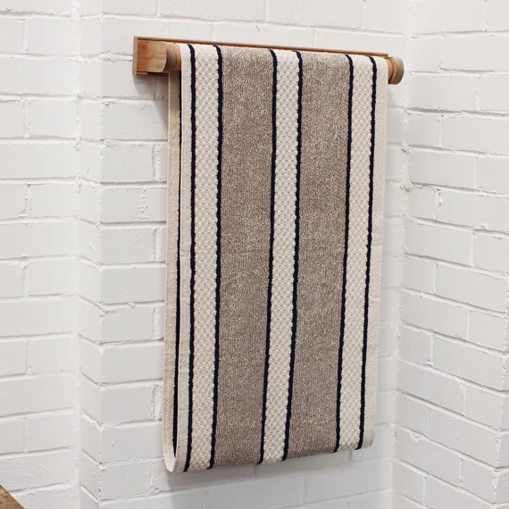  |
|:--:|:--:|

#### soaked through

[⬆️ Paragraph 2](#Paragraph-2)

> I don’t enjoy it so much in the evening, because the roller towel you use is soaked through: one towel has to last all day.

- 表状态的形容行词组

soaked: /soʊkt/; soak: v | n, / soʊk /

- soak: To make something very wet, or to become very wet.
- Soaked: is an adjective that describes something as completely and thoroughly wet.
- soaked through: means something is completely and totally wet, all the way through.

例句：

- My shoes were soaked through after walking in the rain.
- The towel is soaked through; we need a dry one.
- The rain will soak through your jacket if you don't have an umbrella.

#### last

[⬆️ Paragraph 2](#Paragraph-2)

> I don’t enjoy it so much in the evening, because the roller towel you use is soaked through: one towel has to last all day.

这里 last 非做形容词的 “最后的”，而是动词。它有 2 个相近的意思：

- To keep going: "The movie lasted for three hours."（这部电影**持续**了三个小时。）-> 它“保持播放”了三个小时。
- To be enough: "We have to make our water last for two days."（我们必须让我们的水**维持**两天。）-> 我们必须让水“足够”用两天。

#### minor detail

[⬆️ Paragraph 2](#Paragraph-2)

> He told me he was sorry but it was really a minor detail. 

minor: <mark>adj</mark> | n | v, / ˈmaɪnər /, not very large, important or serious.

A minor detail: is a very small and unimportant part of something bigger.

When you tell a friend a story about your day, you might forget to tell them what color shirt you were wearing. That is a minor detail. It is not important for the story.

So, when someone says, "it was really a minor detail," they mean:

"It was not a big problem. It was a very small thing, and it is not important to worry about."

*In your sentence, the man is saying he is sorry, but he also wants to say that the problem was very small and not important.*

#### dispatcher

[⬆️ Paragraph 2](#Paragraph-2)

>  I left a little late, at half past twelve, with Emmanuel, who works as a dispatcher. 

dispatcher: n, / dɪˈspætʃər /

A dispatcher: is a person whose job is to send people or vehicles(车辆, / ˈviːəkl; ˈviːhɪkl /) to the right place. They sit in an office and tell drivers where to go next. They make sure the right person goes to the right place at the right time.

#### overlooks

[⬆️ Paragraph 2](#Paragraph-2)

> The office overlooks the sea, and we took a minute to watch the freighters in the harbor, which was ablaze with sun light. 

- [x] 如果主语是一个地方（如房间、房子、餐厅），overlooks 通常意味着 "有视野，面对着"
  "My hotel room overlooks the pool."（我的酒店房间面对着游泳池。）

- [ ] 如果主语是一个人，overlooks 通常意味着 "忽略，没注意到"。
  "Please overlook his rude comment."（请别计较他粗鲁的评论。）

#### freighters

[⬆️ Paragraph 2](#Paragraph-2)

> The office overlooks the sea, and we took a minute to watch the freighters in the harbor, which was ablaze with sun light. 

n / ˈfreɪtər /

A freighter is a large ship that carries goods and products.

#### harbor

[⬆️ Paragraph 2](#Paragraph-2)

> The office overlooks the sea, and we took a minute to watch the freighters in the <mark>harbor</mark>, which was ablaze with sun light. 

v | n, / ˈhɑːrbər /

A harbor（港口） is a safe place for boats and ships.

#### ablaze

[⬆️ Paragraph 2](#Paragraph-2)

> The office overlooks the sea, and we took a minute to watch the freighters in the harbor, which was ablaze with sun light.

*ablaze*: adj | adv, / əˈbleɪz /

- [ ] 真正的火焰, 意思： 着火了，在燃烧
  "The house was ablaze." （房子着火了。）
- [x] 比喻性的光亮, 意思： 被非常明亮的光照亮，闪耀。
  "The city streets were ablaze with neon lights（霓虹灯）." （城市的街道被霓虹灯照得熠熠生辉。）

#### truck

[⬆️ Paragraph 2](#Paragraph-2)

> Then a truck came toward us with its chains rattling and its engine backfiring.

truck（卡车）: v | n, / trʌk /; 主要用于载货，追求力量和载重能力

#### rattling

[⬆️ Paragraph 2](#Paragraph-2)

> Then a truck came toward us with its chains rattling and its engine backfiring.

*rattle*, v | n, / ˈræt(ə)l /

*rattling*: <mark>adj</mark> | v | adv | n, / ˈrætlɪŋ /, describes a fast series of short, sharp, knocking sounds.

常见的例子

- 窗户在风中振动时会 rattle；
- 摇晃一罐油漆时，里面的小珠子会 rattle；
- 一个老旧汽车的引擎可能会在熄火后发出 rattling 声。

#### backfiring

[⬆️ Paragraph 2](#Paragraph-2)

> Then a truck came toward us with its chains rattling and its engine backfiring.

backfire: v | n, / ˌbækˈfaɪər /

backfiring: v, / ˌbækˈfaɪərɪŋ /

*Backfiring is when a car or truck engine makes a sudden, loud "BANG!" or "POP!" sound.*

#### engulfed

[⬆️ Paragraph 2](#Paragraph-2)

> I was engulfed by the noise and the dust.

engulf: v, / ɪnˈɡʌlf /

engulf 的意思是 被完全包围或吞没。

可以这样想象：如果一个东西 engulfs 你，就意味着它从四面八方围住你，让你无法逃脱或看不到周围的其他东西。

#### dust

[⬆️ Paragraph 2](#Paragraph-2)

> I was engulfed by the noise and the dust.

dust: n | v, / dʌst /

dust 的意思是 灰尘、尘土。

#### conscious of

[⬆️ Paragraph 2](#Paragraph-2)

>  I couldn’t see anything, and all I was conscious of was the sensation of hurtling forward in a mad dash through cranes and winches, masts bobbing on the horizon and the hulls of ships alongside us as we ran.

adj, / ˈkɑːnʃəs /

*Conscious of something means you are aware of it or you notice it.*

例句

- "Are you conscious of the time?" （你注意到时间了吗？）-> 意思是“你知道现在多晚了吗？”

- "He was very conscious of everyone looking at him." （他强烈地**意识到*每个人都在看着他。）-> 他能感觉到别人的目光。

#### sensation

[⬆️ Paragraph 2](#Paragraph-2)

>  I couldn’t see anything, and all I was conscious of was the sensation of hurtling forward in a mad dash through cranes and winches, masts bobbing on the horizon and the hulls of ships alongside us as we ran.

n, / senˈseɪʃ(ə)n /

A sensation（感觉） is a physical feeling that you get from your body.

例子：

- The sensation of cold wind on your face.（冷风吹在脸上的感觉。）

- The sensation of falling when you trip.（绊倒时下坠的感觉。）

- The burning sensation from touching something hot.（碰到热东西时灼烧的感觉。）

#### hurtling

[⬆️ Paragraph 2](#Paragraph-2)

>  I couldn’t see anything, and all I was conscious of was the sensation of hurtling forward in a mad dash through cranes and winches, masts bobbing on the horizon and the hulls of ships alongside us as we ran.

hurtle: vt | vi | n, / ˈhɜːrt(ə)l /

*Hurtling means moving very fast, often in a way that is out of control or dangerous.*

常见的例子

- "The car lost control and went hurtling toward the tree."
（汽车失控，猛地撞向那棵树。）

- "The asteroid was hurtling through space."
（小行星正在太空中急速飞驰。）

#### dash

[⬆️ Paragraph 2](#Paragraph-2)

>  I couldn’t see anything, and all I was conscious of was the sensation of hurtling forward in a mad dash through cranes and winches, masts bobbing on the horizon and the hulls of ships alongside us as we ran.

v | n, / dæʃ /

*A dash is a very fast run or movement for a short distance.*

常见的日常例子

- "I'm in a dash to catch the bus!"（我在猛冲去赶公交车！）

- "The dog made a dash for the door."（狗向门口冲了过去。）

- "We had to make a quick dash to the store before it closed."（我们得在商店关门前飞快地去一趟。）

#### cranes

[⬆️ Paragraph 2](#Paragraph-2)

>  I couldn’t see anything, and all I was conscious of was the sensation of hurtling forward in a mad dash through cranes and winches, masts bobbing on the horizon and the hulls of ships alongside us as we ran.

crane: n | v, / kreɪn /

*A crane（起重机） is a very tall, large machine that is used to lift and move very heavy things.*

#### winches

[⬆️ Paragraph 2](#Paragraph-2)

>  I couldn’t see anything, and all I was conscious of was the sensation of hurtling forward in a mad dash through cranes and winches, masts bobbing on the horizon and the hulls of ships alongside us as we ran.

winch: n | v, / wɪntʃ /

*A winch（绞车） is a smaller machine that uses a rope（/ roʊp /, 绳索） or cable（/ ˈkeɪb(ə)l /, 缆绳） to pull things.*

#### masts

[⬆️ Paragraph 2](#Paragraph-2)

>  I couldn’t see anything, and all I was conscious of was the sensation of hurtling forward in a mad dash through cranes and winches, <mark>masts</mark> bobbing on the horizon and the hulls of ships alongside us as we ran.

n | vt, / mæst /

*A mast（桅杆） is a very tall pole（杆 / poʊl /） on a ship that holds up the sails（船帆 / seɪl /）.*

#### bobbing

[⬆️ Paragraph 2](#Paragraph-2)

>  I couldn’t see anything, and all I was conscious of was the sensation of hurtling forward in a mad dash through cranes and winches, masts <mark>bobbing</mark> on the horizon and the hulls of ships alongside us as we ran.

bob: v | n, / bɑːb /
bobbing: / ˈbɑːbɪŋ /

*Bobbing describes a light, quick, up-and-down movement on the water.*

例句

- The little boat bobbed on the waves.（小船在波浪上轻轻颠簸。）

- Apples bobbed in the barrel of water.（苹果在水桶里上下浮动。）

- A seal's head bobbed up from the water.（一只海豹的头从水里探了出来（然后可能又沉下去）。）

#### hulls

[⬆️ Paragraph 2](#Paragraph-2)

> I couldn’t see anything, and all I was conscious of was the sensation of hurtling forward in a mad dash through cranes and winches, masts bobbing on the horizon and the hulls of ships alongside us as we ran.

hull: n | vt, / hʌl /

*The hull（船体） is the main body or frame of a ship.*

#### alongside

[⬆️ Paragraph 2](#Paragraph-2)

> I couldn’t see anything, and all I was conscious of was the sensation of hurtling forward in a mad dash through cranes and winches, masts bobbing on the horizon and the hulls of ships alongside us as we ran.

Alongside means next to and in line with something（在旁边并与之平行）.

常见的例子

- "He parked his car alongside the curb."（他把车紧靠着路缘停了下来。）

- "The small boat sailed alongside the large ship."（小船沿着大船的一侧航行。）

- "She worked alongside her colleagues on the project."（她和同事们一起进行这个项目。）

#### grab

[⬆️ Paragraph 2](#Paragraph-2)

> I was first to grab hold and take a flying leap.

v | n, / ɡræb /

Grab means to take hold of something suddenly and firmly（有力地 / ˈfɜːrmli /）.

常见的例子

- "He grabbed my arm to stop me from falling."（他一把抓住我的胳膊，防止我摔倒。）

- "I'll just grab my coat and then we can go."（我这就去拿我的外套，然后我们就可以走了。）

- "Quick, grab that seat before someone else does!"（快，抢那个座位，别让别人占了！）

#### flying leap

[⬆️ Paragraph 2](#Paragraph-2)

> I was first to grab hold and take a flying leap.

leap: v | n, / liːp /

Leap means to jump a long way, or to jump with a lot of force.

与 "Jump" 的简单对比

- Jump（跳）: 是一个通用词。你可以 jump up and down（原地跳），jump over a small puddle（跳过一个小水坑）。

- Leap（跃）: 通常意味着跳得更远、更高、更有力，并且常常是向前的。比如，跃过一条沟渠。

A **flying leap*（飞身一跃） is a jump where you move forward through the air very quickly and with a lot of force.

例句

1. 字面意思：跳跃

  - The cat leapt onto the table.（猫跳到了桌子上。）

  - He leapt over the fence to escape the dog.（他跃过栅栏以躲避那只狗。）

  - The frog leapt from one lily pad to another.（青蛙从一片荷叶跳到另一片上。）

2. 比喻意思：激增；飞跃

  - The company's profits leapt by 20% this year.（公司利润今年激增了20%。）

  - She leapt at the chance to study abroad.（她立刻抓住了出国留学的机会。"leap at" 是一个常用短语，意思是“迫不及待地接受”。）

  - Technology has leapt forward in the last decade.（科技在过去十年里取得了飞跃。）

#### reached out

[⬆️ Paragraph 2](#Paragraph-2)

> Then I reached out and helped Emmanuel scramble up.

v | n, / riːtʃ /

*Reached out means to move your arm and hand toward something to touch it, take it, or help someone.*

常见的例子

- [x] "She reached out to pick the flower."（她伸出手去摘那朵花。）

- [x] "He reached out his hand to shake mine."（他伸出手来和我握手。）

- [ ] "If you need help, don't hesitate to reach out to me."（如果你需要帮助，尽管联系我。在现代用语中，"reach out" 也常比喻为“联系某人”，尤其是在需要帮助或支持时。）

#### scramble up

[⬆️ Paragraph 2](#Paragraph-2)

> Then I reached out and helped Emmanuel scramble up.

scramble: `v | n, / ˈskræmb(ə)l /`

*Scramble up means to climb up quickly and awkwardly, often using your hands and feet.*: 可以把它想象成一种紧急的、不那么优雅的攀爬动作。

| 特点 | Climb（爬） | Scramble（仓促攀爬） |
| :--- | :--- | :--- |
| **速度** | 可快可慢 | 通常**很快** |
| **方式** | 可能平稳、有控制 | **仓促、笨拙、手忙脚乱** |
| **难度** | 任何难度 | 通常**更困难**或**不平坦** |
| **感觉** | 通用、中性 | 紧急、费力、挣扎 |

常见的例子

- The children scrambled up the rocky hill.（孩子们手脚并用地爬上了多石的山丘。）

- The puppy tried to scramble up onto the sofa.（小狗试图爬上沙发。）

- He scrambled up the bank after falling into the river.（他掉进河里后，匆忙爬上了河岸。）

#### out of breath

[⬆️ Paragraph 2](#Paragraph-2)

> We were out of breath;

*Out of breath means you are breathing very fast and with difficulty, usually after `hard exercise`（剧烈运动）.*

常见的例子

- "After running for the bus, I was completely out of breath."（跑着赶公交车之后，我完全上气不接下气了。）

- "The stairs were so steep（陡 / stiːp /） that he was out of breath at the top."（楼梯太陡了，他爬到顶上时都喘不过气来了。）

- "She was out of breath from laughing so hard."（她笑得都快喘不过气了。）

#### bumping around

[⬆️ Paragraph 2](#Paragraph-2)

> the truck was bumping around on the uneven cobblestones of the quay in a cloud of dust and sun.

bump: v | n, / bʌmp /

*Bumping around means moving in a rough（粗糙的 / rʌf /）, shaky（摇晃的 / ˈʃeɪki /）, and uneven（不平坦的 / ʌnˈiːv(ə)n /） way, hitting against things.*

常见的例子

- "The old washing machine bumps around a lot when it spins."（那台旧洗衣机在脱水时晃得很厉害。）

- "We bumped around in the back of the truck on the dirt road."（我们在土路上被颠得晃来晃去。）

#### uneven cobblestones

[⬆️ Paragraph 2](#Paragraph-2)

> the truck was [bumping around](#bumping-around) on the <mark>uneven cobblestones</mark> of the quay in a cloud of dust and sun.

cobblestone: n, / ˈkɑːblstoʊn /

*Cobblestones（鹅卵石） are old, round stones that were used to make roads in the past.*

uneven: adj, / ʌnˈiːv(ə)n /

*Uneven means not flat or smooth; having parts that are at different heights.*

例句

- The floor is old and uneven.（地板老旧，不平整。）

- "Be careful walking on the uneven path."（在凹凸不平的小路上走路要小心。）

- "The cake didn't rise properly, so the top is uneven."（蛋糕没发好，所以顶部不平。）

#### quay

[⬆️ Paragraph 2](#Paragraph-2)

> the truck was [bumping around](#bumping-around) on the [uneven cobblestones](#uneven-cobblestones) of the <mark>quay</mark> in a cloud of dust and sun.

quay： n, / kiː /

*A quay（码头） is a stone or concrete（混凝土的 / ˈkɑːnkriːt /） platform at the edge of the sea or a river where boats and ships can dock（停靠 / dɑːk /） to load and unload.*

---

#### dripping with sweat

[⬆️ Paragraph 3](#Paragraph-3)

> We arrived at Céleste's dripping with sweat.

drip: v | n, / drɪp /

*Drip means for a liquid to fall in small, separate drops（落下 / drɑːp /）*

*Dripping with sweat is a very common and descriptive phrase. It means you are so hot and sweaty that the sweat is falling off your body in drops.*

#### belly

[⬆️ Paragraph 3](#Paragraph-3)

> Céleste was there, as always, with his big belly, his apron, and his white moustache.

| v \| n, / ˈbeli / | 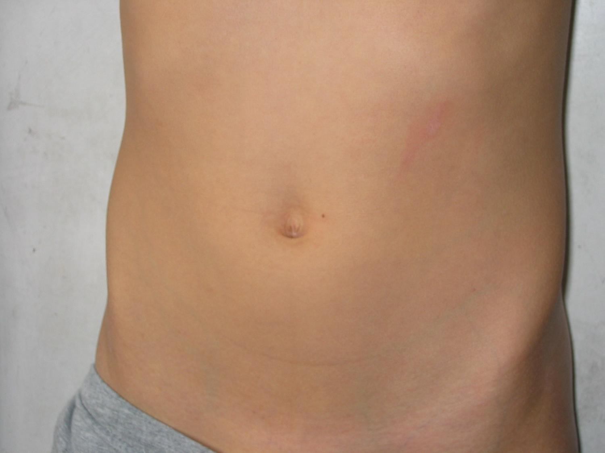  |
|:--:|:--:|

*Your belly（肚子） is the front part of your body between your chest and your legs.*

#### apron

[⬆️ Paragraph 3](#Paragraph-3)

> Céleste was there, as always, with his big belly, his apron, and his white moustache.

| v \| n, / ˈeɪprən / | 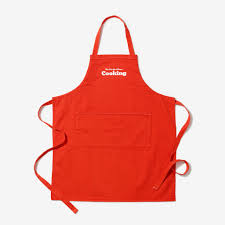  |
|:--:|:--:|

*An apron is a piece of clothing that you wear over your front to protect your normal clothes from getting dirty.*

#### streetcar

[⬆️ Paragraph 3](#Paragraph-3)

[⬆️ Paragraph 7](#Paragraph-7)

> If you're man enough you'll get down off that streetcar.

| n, `/ ˈstriːtkɑːr /` | 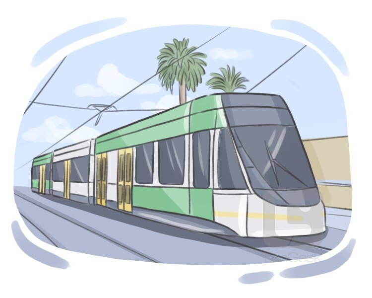 |
|:--:|:--:|

*A streetcar is an electric vehicle（车辆 / ˈviːəkl; ˈviːhɪkl /） that runs on tracks laid in the street, used for public transportation（交通运输系统 / ˌtrænspərˈteɪʃ(ə)n /） in a city.*

#### boil

[⬆️ Paragraph 3](#Paragraph-3)

> But I went straight home because I wanted to boil myself some potatoes.

v | n, / bɔɪl /

*Boil（煮） means to cook something in very hot, bubbling water.*

一个简单的步骤

1. Put potatoes in a pot.（把土豆放进锅里。）

2. Add water until the potatoes are covered.（加水直到没过土豆。）

3. Heat the pot until the water bubbles.（加热锅直到水冒泡泡。）

4. Wait until the potatoes are soft.（等到土豆变软。）

这就是 boiling。

---

#### across the landing

[⬆️ Paragraph 4](#Paragraph-4)

> On my way upstairs, in the dark, I ran into old Salamano, my neighbor across the landing.

my neighbor across the landing: 我对门的邻居

across: 在...的对面

landing: 指的是他们公寓门外、楼梯顶部的那个共享的公共小区域。

例句

- "Her house is across the street from mine." （她的房子在我家街对面。）

- "Wait for me on the landing." （在楼梯平台那儿等我。）

- "She slipped and fell on the landing." （她在楼梯平台上滑倒了。）

#### spaniel

[⬆️ Paragraph 4](#Paragraph-4)

> The spaniel has a skin disease—mange, I think—which makes almost all its hair fall out and leaves it covered with brown sores and scabs.

| n \| vi \| vt / ˈspænjəl / | 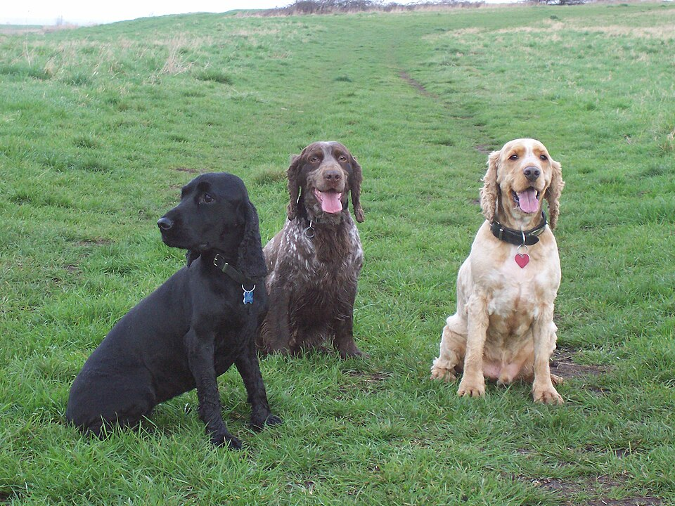 |
|:--:|:--:|

*A spaniel（西班牙猎犬/獚犬） is a type of dog, known for having long, floppy ears and a friendly nature.*

#### sores

[⬆️ Paragraph 4](#Paragraph-4)

> The spaniel has a skin disease—mange, I think—which makes almost all its hair fall out and leaves it covered with brown sores and scabs.

这里的 sores 描绘了一幅非常可怜且不适的画面。这只西班牙猎犬的皮肤病非常严重，导致皮肤上出现了许多*疼痛、发炎、可能还在渗出液体的破损伤口*。这些 sores 是疾病痛苦的直接体现。

n | adj, / sɔːr /

*A sore（疮/痛处） is a painful, red or raw place on the skin or inside the body. / a painful spot on the skin, which is usually red or infectious*

常见的例子

- "I have a sore on my lip from the cold weather."（因为天气冷，我嘴唇上长了个疮（冻疮）。）

- "His new shoes gave him a sore on his heel."（他的新鞋把他的脚后跟磨出了一个水泡/痛处。）

- "I have a sore throat."（我嗓子疼。*注意：在这里，"sore" 是形容词，意思是“疼痛的”。*）

#### mange

[⬆️ Paragraph 4](#Paragraph-4)

> The spaniel has a skin disease—mange, I think—which makes almost all its hair fall out and leaves it covered with brown sores and scabs.

| n, / meɪndʒ / | 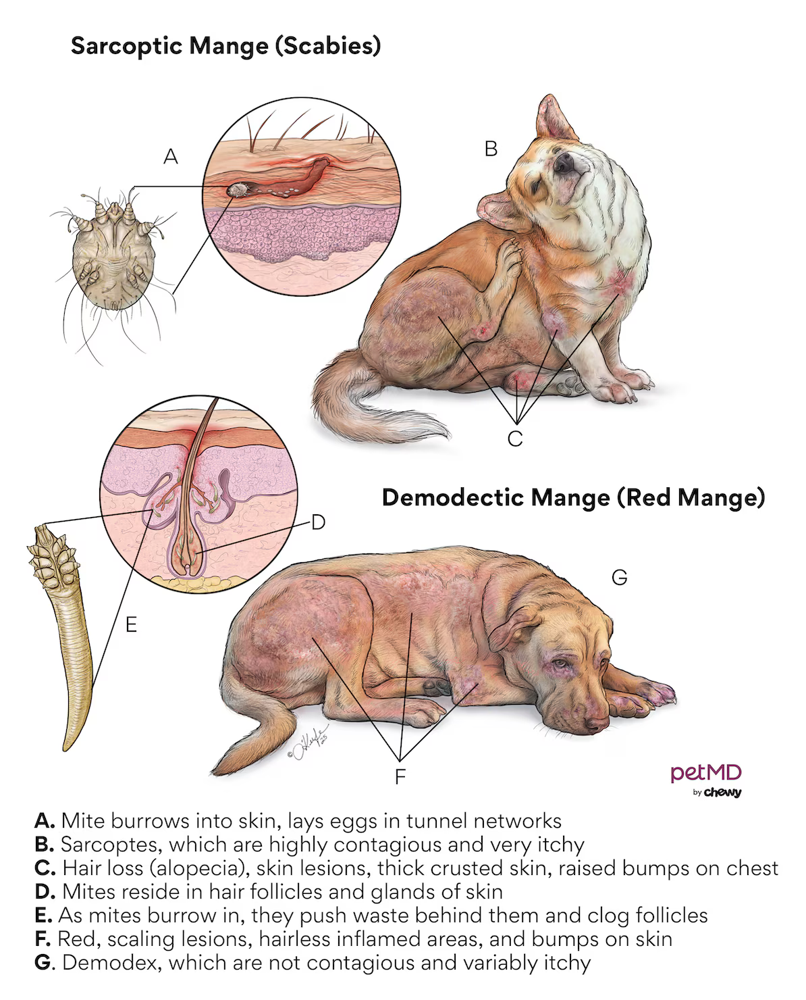 |
|:--:|:--:|

*Mange（兽疥癣（癞皮病） is a skin disease caused by tiny mites（微小螨虫 / maɪt /） that live on an animal's skin, making it very itchy（瘙痒的 / ˈɪtʃi /） and causing the hair to fall out.*

- 原因： 微小的螨虫。

- 症状： 剧烈瘙痒、掉毛、皮肤发红、结痂（scabs）和溃疡（sores）。

- 传染性： 在动物之间具有高度传染性。

- 治疗： 通常可以通过药物治疗，但这只狗显然没有得到妥善的照料。

#### scabs

[⬆️ Paragraph 4](#Paragraph-4)

> The spaniel has a skin disease—mange, I think—which makes almost all its hair fall out and leaves it covered with brown sores and scabs.

*A scab（痂） is the hard, dry covering that forms over a cut or sore on your skin while it is healing.*

| n \| vi \| vt, / skæb / | 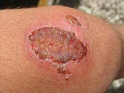 |
|:--:|:--:|

#### wispy

[⬆️ Paragraph 4](#Paragraph-4)

> Old Salamano has reddish scabs on his face and wispy yellow hair.

*Wispy describes something that is thin, fine（纤细的）, and delicate（脆弱的 / ˈdelɪkət /）, and looks like it could be blown（吹 / bloʊ /） away easily.（可以把它想象成一缕轻烟，或者几根细丝，没有重量，也不浓密。）*

常见的例子

- Wispy clouds （缕云/薄云，Thin, delicate clouds high in the sky.）

- Wispy hair （稀疏的头发）：A baby has fine, wispy hair.（婴儿的头发纤细而稀疏。）

- A wisp of smoke （一缕轻烟）：A thin, light line of smoke rising up.

#### sort of

[⬆️ Paragraph 4](#Paragraph-4)

> As for the dog, he’s sort of taken on his master’s stooped look, muzzle down, neck straining. 

“sort of” 是一个固定短语（副词短语），意思是 *“有点儿”、“有几分”*

例句：

- He is sort of tired.（他有点儿累了。）

- The movie was sort of boring.（那部电影有点无聊。）

- It 's sort of difficult to explain.（这有点难解释。）

- I sort of understand what you mean.（我差不多明白你的意思了。）

- "Do you like this plan?" - "Sort of."（“你喜欢这个计划吗？” - “还行吧。” / 表示犹豫或不确定（单独使用））

#### taken on

[⬆️ Paragraph 4](#Paragraph-4)

> As for the dog, he’s sort of taken on his master’s stooped look, muzzle down, neck straining. 

“take on” 是一个*动词短语*，在这里的意思是 *“呈现出、具有了（某种外貌、特性）”*。

**功能**： 描述一种变化，即获得了之前没有的东西。

例句： “His face took on a worried look.”（他的脸上露出了担忧的神色。）

#### stooped look

[⬆️ Paragraph 4](#Paragraph-4)

> As for the dog, he’s sort of taken on his master’s stooped look, muzzle down, neck straining. 

| stoop: v \| n, / stuːp / | 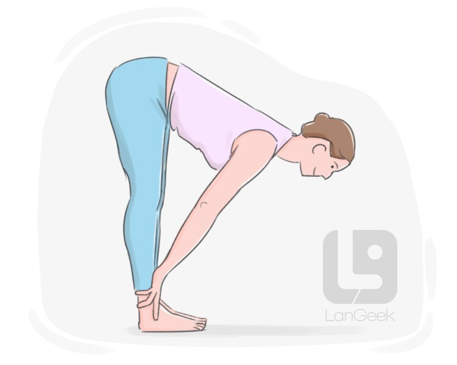 |
|:--:|:--:|

#### muzzle down

[⬆️ Paragraph 4](#Paragraph-4)

> As for the dog, he’s sort of taken on his master’s stooped look, muzzle down, neck straining. 

| muzzle: n \| vt, / ˈmʌzl / | 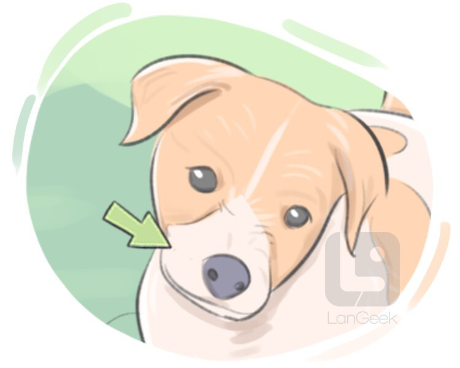 |
|:--:|:--:|

*A muzzle（口鼻，特指动物） is the nose and mouth part of an animal like a dog or a horse.*

*Muzzle down（口鼻朝下） describes the position of the dog's head, pointing toward the ground.*

例句

- The tired old hound walked, muzzle down, barely noticing the world around him.（那只疲惫的老猎犬口鼻耷拉着走着，几乎不注意周围的世界。）

- Sensing my sadness, the dog came and rested its head on my knee, muzzle down.（感觉到我的悲伤，那只狗走过来，口鼻朝下地把它头靠在我的膝盖上。）

- The wolf moved through the forest, muzzle down, intently following the scent of its prey.（那只狼口鼻贴地，穿行在森林中，专注地追踪着猎物的气味。）

#### neck straining

[⬆️ Paragraph 4](#Paragraph-4)

> As for the dog, he’s sort of taken on his master’s stooped look, muzzle down, neck straining. 

strain: n | v, / streɪn /

*Neck straining 描述的是 脖子上的肌肉因为用力而变得紧张、拉紧的状态。*

#### species

[⬆️ Paragraph 4](#Paragraph-4)

> They look as if they belong to the same species, and yet they hate each other.

n | adj, / ˈspiːʃiːz /

*A species（物种） is a group of living things that can breed（交配 / briːd /） with each other and produce healthy babies that can also have babies.*

#### stumbles

[⬆️ Paragraph 4](#Paragraph-4)

> You can see them in the rue de Lyon, the dog pulling the man along until old Salamano stumbles.

v | n, / ˈstʌmb(ə)l /

*Stumbles means to trip or miss a step while walking, almost falling.*

常见的例子

- "He stumbled on the uneven pavement."（他在不平的人行道上绊了一下。）

- "The tired hiker stumbled over a tree root."（疲惫的徒步者被树根绊倒了。）

- "She stumbled on the stairs but managed to grab the railing."（她在楼梯上绊了一下，但设法抓住了栏杆。）

#### swears at

[⬆️ Paragraph 4](#Paragraph-4)

> Then he beats the dog and swears at it.

swear: `v | n`, `/ swer /`

sworn(过去分词): / swɔːrn /

In this sentence, *swear* means to *use very rude and angry words*. When someone *swears at* a person or an animal, they are shouting bad words to show they are very upset.

常见的例子

- "The angry driver swore at the other car."（那个愤怒的司机咒骂另一辆车。）

- "He swore when he hit his thumb with the hammer."（他用锤子砸到拇指时骂了句脏话。）

- "Don't swear in front of the children."（别在孩子面前说脏话。）

#### cowers

[⬆️ Paragraph 4](#Paragraph-4)

> The dog cowers and trails behind.

vi, / ˈkaʊər /

*Cowers means to bend down or move back because you are very frightened（害怕 / ˈfraɪt(ə)n /）.*

常见的例子

- "The puppy cowered in the corner during the thunderstorm."（小狗在雷雨期间蜷缩在角落里。）

- "He cowered away from the raised hand."（他畏缩着躲开那只举起的手。）

#### trails

[⬆️ Paragraph 4](#Paragraph-4)

> The dog cowers and trails behind.

n | v, / treɪl /

*Trails means to walk or move far behind someone, usually slowly and without enthusiasm（热情 / ɪnˈθuːziæzəm /）.*

关键点

- 位置： 在后面，有一段距离。

- 方式： 缓慢、不情愿、垂头丧气。

- 感觉： 被动、顺从、缺乏活力。

常见的例子

- "The children were tired and trailed behind their parents."（孩子们累了，慢吞吞地跟在父母后面。）

- "Her scarf trailed on the ground."（她的围巾拖在了地上。）

- "The losing team trailed by ten points."（落后的队伍落后十分。*在这个体育比喻中，"trail" 意思是“落后”。*）

#### sidewalk

[⬆️ Paragraph 4](#Paragraph-4)

> Then they both stand there on the sidewalk and stare at each other, the dog in terror, the man in hatred.

| n, / ˈsaɪdwɔːk / | 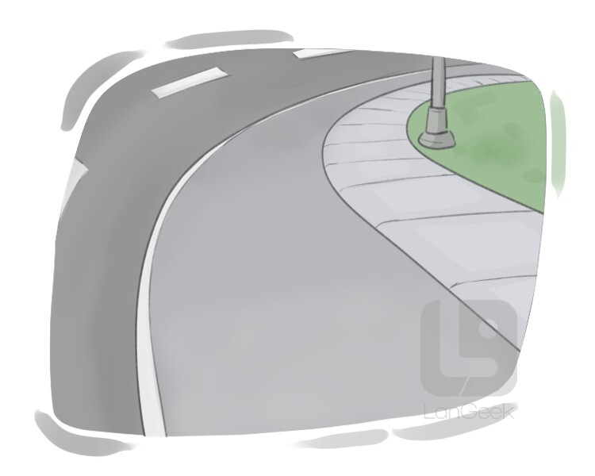 |
|:--:|:--:|

*a pathway typically `made of`（制作） concrete（混凝土 / ˈkɑːnkriːt /） or asphalt（/ ˈæsfɔːlt / 沥青） at the side of a street for people to walk on*

#### hatred

[⬆️ Paragraph 4](#Paragraph-4)

> Then they both stand there on the sidewalk and stare at each other, the dog in terror, the man in hatred.

*Hatred（憎恨，此为原型非分词） is a very, very strong feeling of not liking someone or something at all. It is an intense（十分强烈的 / ɪnˈtens /） and lasting feeling of dislike.*

关键点

- 强度： 比 "dislike"（不喜欢）或 "anger"（愤怒）强烈得多。

- 持续时间： 它通常是一种长期的情感，而不是一时的怒气。

- 感觉： 充满敌意，希望对方不好。

常见的例子

- "He looked at his enemy with pure hatred."（他用纯粹的憎恨的目光看着他的敌人。）

- "Their family was full of hatred after the argument."（那场争吵之后，他们家中充满了怨恨。）

- "She has a deep hatred for lies."（她对谎言深恶痛绝。）

#### urinate

[⬆️ Paragraph 4](#Paragraph-4)

> When the dog wants to urinate, the old man won't give him enough time and yanks at him, so that the spaniel leaves behind a trail of little drops.

| v, / ˈjʊrɪneɪt / | 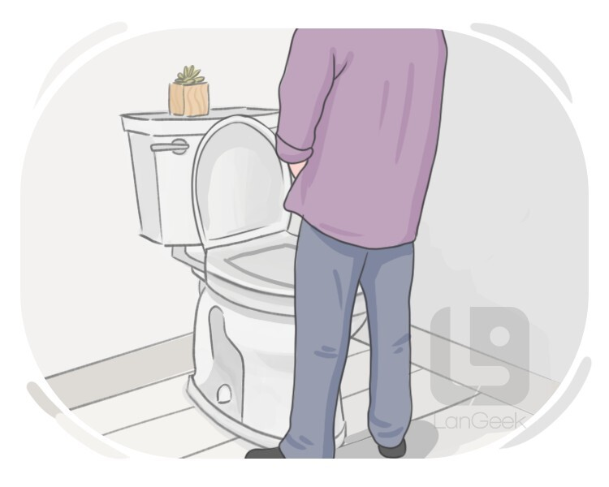 |
|:--:|:--:|

*Urinate 是“小便”的正式或礼貌用语 / to release liquid waste from the body*

关键点

- 意思： 从身体里排出尿液。

- 语体： 正式、临床、礼貌。常用于医学、官方或描述动物行为的文本中。

- 非正式说法： pee（最常用）， piss（非常粗鲁）。

例句

- The doctor asked for a urine sample to test my kidney function.（医生要了尿样来检测我的肾功能。）

- It's important to train your puppy where it is allowed to urinate.（训练你的小狗在指定地方小便很重要。）

- The sign reminded visitors that it is illegal to urinate in public places.（告示牌提醒游客，在公共场所小便是非法的。）

#### yanks

[⬆️ Paragraph 4](#Paragraph-4)

> When the dog wants to urinate, the old man won't give him enough time and yanks at him, so that the spaniel leaves behind a trail of little drops.

| vi \| vt \| n, / jæŋk / | 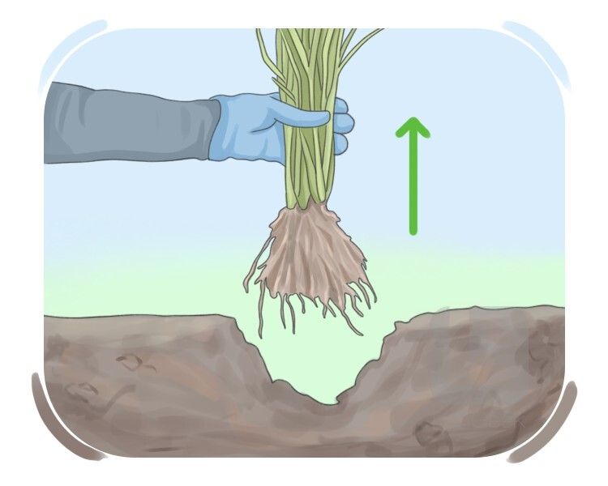 |
|:--:|:--:|

*Yank means to pull something suddenly and very hard.*

常见的例子

- "She yanked the cord out of the wall."（她猛地一下把电线从墙上拔了出来。）

- "He yanked the door open."（他用力一把拉开门。）

- "The child yanked his hand away from his mother's grasp."（孩子猛地从妈妈手里挣脱了自己的手。）

#### drops

[⬆️ Paragraph 4](#Paragraph-4)

> When the dog wants to urinate, the old man won't give him enough time and yanks at him, so that the spaniel leaves behind a trail of little drops.

| v \| n, / drɑːps / |  |
|:--:|:--:|

*Drops are very small, round amounts of a liquid（液体 / ˈlɪkwɪd /）.*

关键点

- 形状： 小小的、圆圆的。

- 数量： 通常很小，但当很多 drops 连在一起时，就形成一条线或一滩水。

- 形成： 液体从某个地方滴落时，就会形成 drops。

常见的例子

- "Rain drops were falling on the window."（雨滴正落在窗户上。）

- "Add a few drops of oil to the water."（在水里加几滴油。）

- "He drank until the last drop."（他喝得一滴不剩。）

#### pitiful

[⬆️ Paragraph 4](#Paragraph-4)

> Céleste is always saying, “It’s pitiful,” but really, who’s to say?

*Pitiful describes something that makes you feel pity（/ ˈpɪti / 同情） or sadness because it is so poor, weak, or unfortunate.*

关键点

- 感觉： 引起同情、悲伤、遗憾。

- 状态： 通常指因为糟糕的境遇而显得可怜。

常见的例子

- "The pitiful puppy was shivering（shiver， / ˈʃɪvər /） in the cold."（那只可怜的小狗在寒冷中瑟瑟发抖。）

- "He made a pitiful attempt to explain himself."（他做了个可怜的（软弱无力的）尝试为自己辩解。）

- "The refugees（refugee， / ˌrefjuˈdʒiː /） were in a pitiful state."（难民们处境凄惨。）

#### Filthy

[⬆️ Paragraph 4](#Paragraph-4)

> He was saying, “Filthy, stinking bastard!” and the dog was whimpering. 

adj | adv, / ˈfɪlθi /

*Filthy means extremely dirty.*

关键点

- 程度： 非常、非常脏。

- 感觉： 令人恶心、厌恶。

- 用法： 既可以形容物体很脏，也可以作为侮辱性词语，骂人卑鄙、下流。

常见的例子

1. 形容物体：

  - "Wash your hands; they're filthy!"（去洗洗手，脏死了！）

  - "He was wearing a filthy old shirt."（他穿着一件脏兮兮的旧衬衫。）

2. 作为侮辱：

  - "Filthy liar!"（卑鄙的骗子！）

#### stinking

[⬆️ Paragraph 4](#Paragraph-4)

> He was saying, “Filthy, stinking bastard!” and the dog was whimpering. 

| stink: v \| n \| adj, / stɪŋk / | 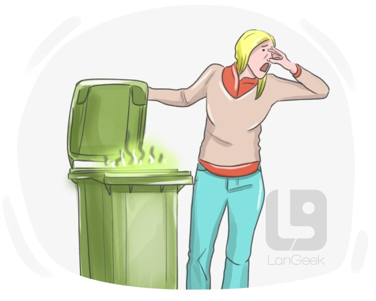 |
|:--:|:--:|

*Stinking means smelling very bad.*

常见的例子

- 形容气味：

  - "Take out the stinking garbage!"（把臭烘烘的垃圾拿出去！）

  - "He took off his stinking socks."（他脱下了他臭气熏天的袜子。）

- 作为侮辱/强调：

  - "I'm sick of this stinking job!"（我受够了这该死的工作！）-> 这里不是指工作有气味，而是表达极度厌恶。

  - "Get out of here, you stinking liar!"（滚出去，你这个该死的骗子！）

#### bastard

[⬆️ Paragraph 4](#Paragraph-4)

> He was saying, “Filthy, stinking bastard!” and the dog was whimpering. 

n | adj, / ˈbæstərd /

*Bastard is a very strong and offensive（侮辱性的 / əˈfensɪv /） swear word used to insult（辱骂 / ɪnˈsʌlt; ˈɪnsʌlt /） someone.*

常见的例子

- "That bastard stole my wallet!"（那个混蛋偷了我的钱包！）

- "He's a lying bastard."（他是个满口谎言的杂种。）

- "You lucky bastard!"（你这个幸运的家伙！）

#### whimpering

[⬆️ Paragraph 4](#Paragraph-4)

> He was saying, “Filthy, stinking bastard!” and the dog was whimpering. 

whimper: v | n, / ˈwɪmpər /

*Whimpering means to make low, weak, crying sounds because you are frightened, hurt, or sad. 可以把它想象成一种可怜、无助的呜咽声。*

常见的例子

- "The lost puppy was whimpering at the door."（迷路的小狗在门口呜呜地哀叫。）

- "The child started whimpering after he fell down."（小孩摔倒后开始抽抽搭搭地哭。）

- "She heard a whimpering sound coming from the dark room."（她听到黑暗的房间里传来一阵呜咽声。）

#### cursing

[⬆️ Paragraph 4](#Paragraph-4)

> I said “Good evening,” but the old man just went on cursing.

curse: v | n, / kɜːrs /

*Cursing means to say rude and offensive words to express anger. 可以把它理解为“咒骂”或“说脏话”。它与我们之前学过的 swear 意思非常接近，经常可以互换使用。*

例句：

- He cursed at the driver who hit his car.（他咒骂那个撞了他车的司机。）-> 他可能在心里希望那个司机倒霉。

- He swore when he dropped his phone.（他手机掉地上时骂了句脏话。）-> 这更可能只是一句发泄

#### collar

[⬆️ Paragraph 4](#Paragraph-4)

> I could barely see him leaning over his dog, trying to fix something on its collar.

*A collar（项圈） is a band that is put around the neck of an animal, especially a dog or cat.*

常见的例子

- "The dog's name tag was attached to its collar."（狗的名牌挂在它的项圈上。）

- "She grabbed the dog by the collar to stop it from running into the street."（她一把抓住狗的项圈，阻止它跑到街上去。）

#### suppressed

[⬆️ Paragraph 4](#Paragraph-4)

> Then, without turning around, he answered with a kind of suppressed rage, “He’s always there.” 

suppress: v, / səˈpres /

*Suppressed means `held back`（被压抑）, kept inside, and not allowed to show.*

常见的例子

- "She spoke with suppressed excitement."（她说话时带着压抑的兴奋。）

- "He could barely control his suppressed anger."（他几乎控制不住他那压抑的怒火。）

- "The government suppressed the news."（政府封锁了那条消息。）-> 在这里，意思是阻止消息被公开。

#### rage

[⬆️ Paragraph 4](#Paragraph-4)

> Then, without turning around, he answered with a kind of suppressed rage, “He’s always there.”

*Rage is a very strong, uncontrollable, and often violent anger.可以把它想象成“愤怒”的最强形式之一。它比 "angry" 或 "mad" 要强烈得多。*

常见的例子

- "He flew into a rage when he saw the damage to his car."（当他看到他的车被损坏时，他勃然大怒。）

- "She was trembling with rage."（她气得浑身发抖。）

- "His cold eyes were filled with rage."（他冰冷的眼睛里充满了怒火。）

---

#### lives off

[⬆️ Paragraph 5](#Paragraph-5)

> The word around the neighborhood is that he lives off women.

"live off"（动词短语）的意思是 *依靠...作为经济来源或生活支持*。

例句：

- "He's 30 years old and still lives off his parents."（他30岁了，仍然靠父母养活。）

- "She accused him of just wanting to live off her money."（她指责他只是想靠她的钱过日子。）

#### warehouse guard

[⬆️ Paragraph 5](#Paragraph-5)

> But when you ask him what he does, he's a "warehouse guard."

| warehouse: n \| v, `/ ˈwerhaʊs /` | 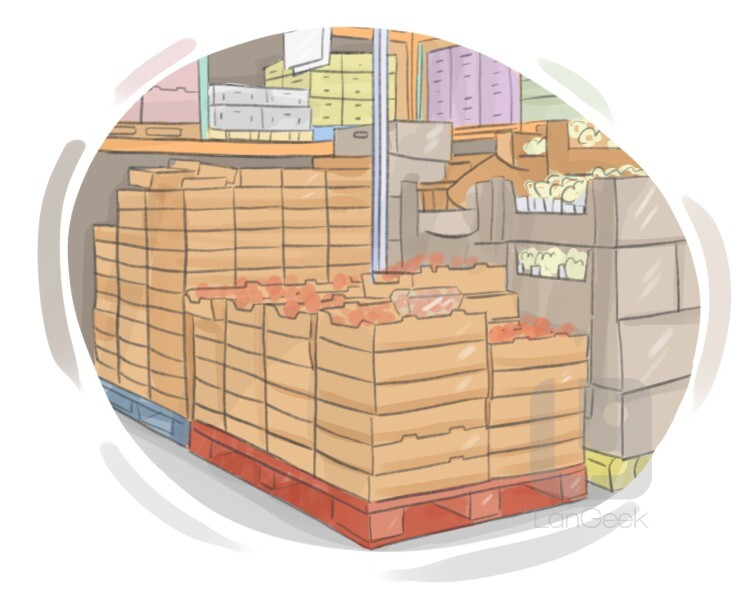 |
|:--:|:--:|

*A `warehouse` is a very large building where goods are stored before they are sold or moved somewhere else.*

`warehouse` 常见的例子

- "They keep all their stock in a warehouse outside the city."（他们把所有的库存都放在城外的仓库里。）

- "I work in a warehouse, packing and shipping orders."（我在一个仓库工作，负责打包和发货。）

- "Amazon has enormous warehouses all over the world."（亚马逊在全世界都有巨大的仓库。）

| guard: n \| v, `/ ɡɑːrd /` | 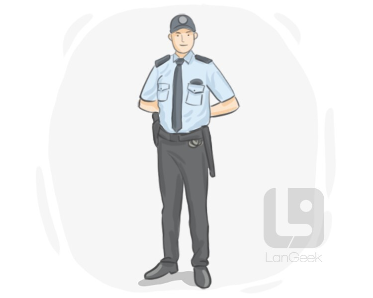 |
|:--:|:--:|

*A `guard` is a person whose job is to protect a person, place, or thing.*

`guard` 常见的例子

- Security guard（保安）

- Prison guard（监狱看守）

- "The soldiers guard the palace."（士兵们守卫着宫殿。）-> 这里 "guard" 是动词。

- "He was hired as a guard for the famous singer."（他被雇来当那名著名歌手的保镖。）

#### broad shoulders

[⬆️ Paragraph 5](#Paragraph-5)

> He's a little on the short side, with broad shoulders and a nose like a boxer's.

| broad: adj \| n \| adv, `/ brɔːd /` | 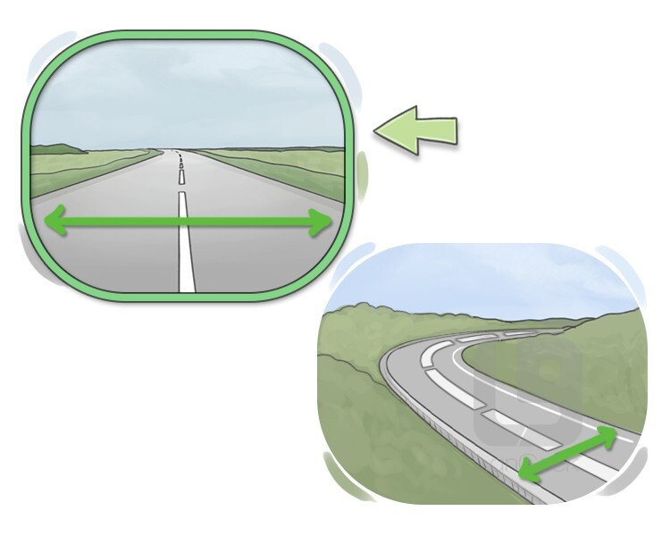 |
|:--:|:--:|

| shoulder: n \| v, `/ ˈʃoʊldər /` | 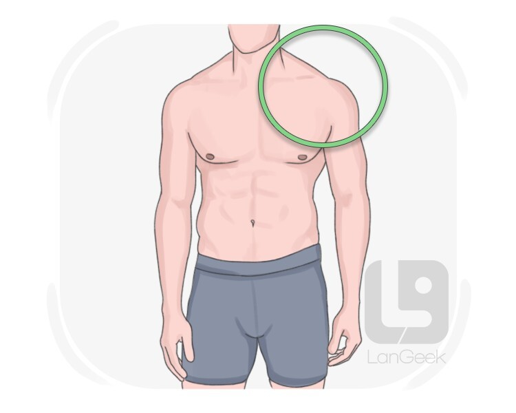 |
|:--:|:--:|

*broad shoulder: means that someone's shoulders are wide and strong-looking.*

常见的例子

- "Swimmers often have broad shoulders."（游泳运动员通常都有宽阔的肩膀。）

- "He was a tall man with broad shoulders."（他是个高个子，肩膀很宽。）

#### on the short side

[⬆️ Paragraph 5](#Paragraph-5)

> He's a little on the short side, with broad shoulders and a nose like a boxer's.

*On the short side 是一种礼貌且委婉的说法，意思是某人有点矮。*

关键点

- 意思： 有点矮。

- 感觉： 委婉、礼貌、不那么生硬。

- 用法： 你可以用这个结构来描述许多事物，表示“稍微有点...”。

  - The price is on the high side.（价格有点高。）
  - The soup is on the salty side.（汤有点咸。）

#### boxer's

[⬆️ Paragraph 5](#Paragraph-5)

> He's a little on the short side, with broad shoulders and a nose like a boxer's.

| boxer: n, `/ ˈbɑːksər /` | 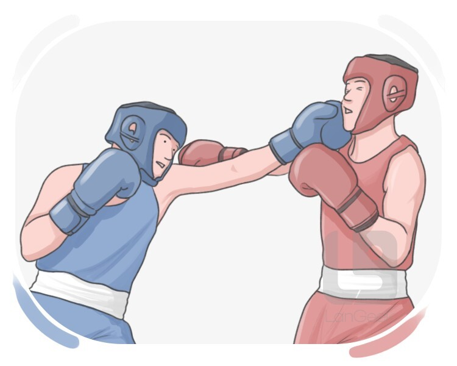 |
|:--:|:--:|

#### sharp

[⬆️ Paragraph 5](#Paragraph-5)

> He always dresses very sharp.

*sharp: (of a person's style or clothes) dressy and fashionable, often conveying a sense of sophistication and elegance.*

| sharp: adj \| adv \| n \| v, `/ ʃɑːrp /` | 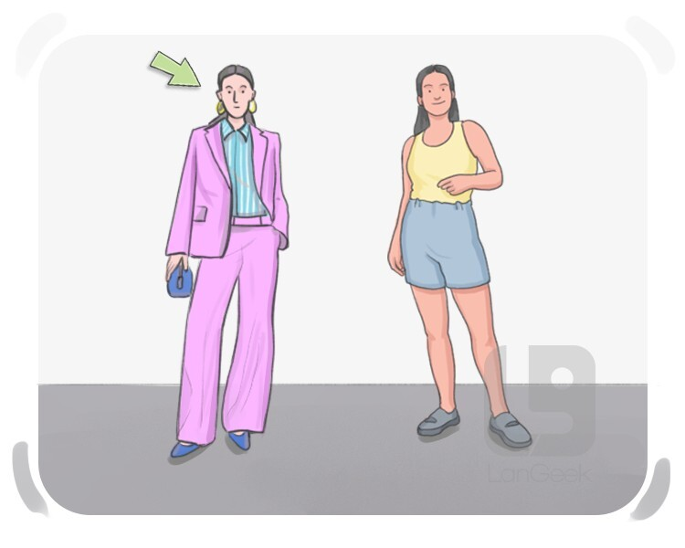 |
|:--:|:--:|

常见的例子

- "You look sharp in that suit!"（你穿那套西装真帅！）

- "That's a sharp jacket you're wearing."（你穿的这件夹克很有型。）

---

#### blood sausage

[⬆️ Paragraph 6](#Paragraph-6)
[⬆️ Paragraph 12](#Paragraph-12)

> “I’ve got some blood sausage and some wine at my place. How about joining me?”

| sausage: n, `/ ˈsɔːsɪdʒ /` | 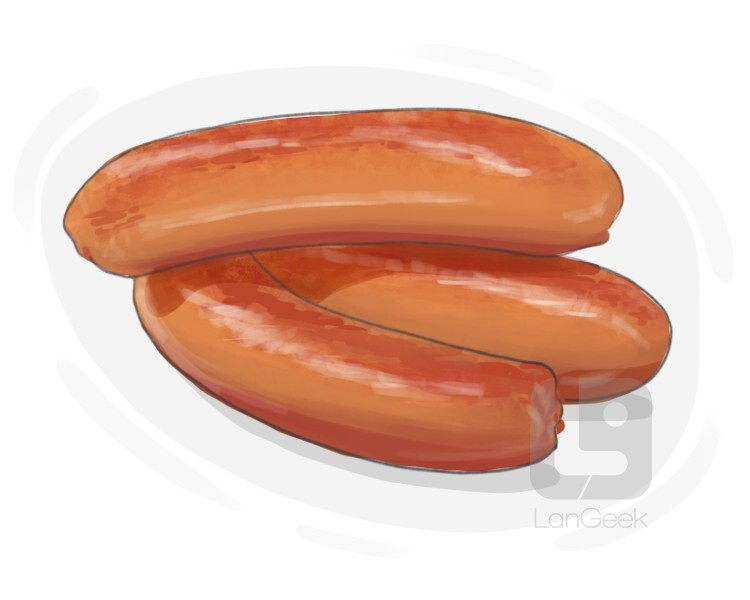 | 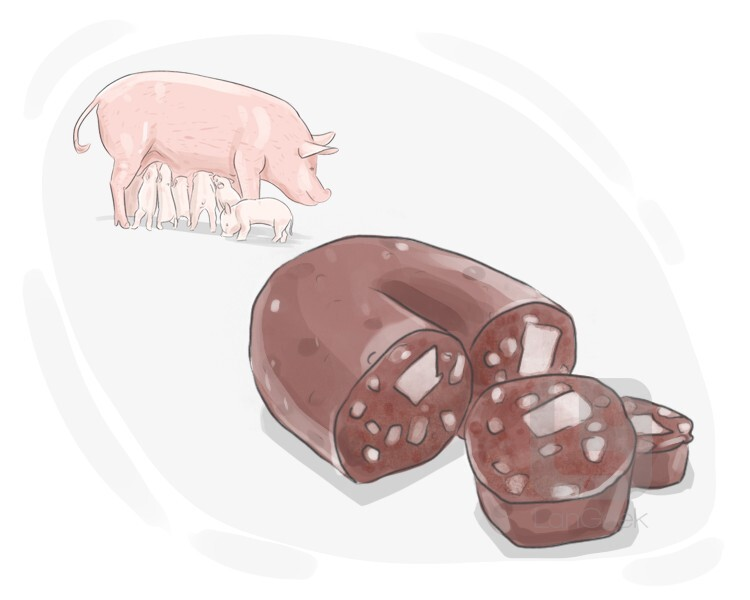 |
|:--:|:--:|:--:|

- *sausage（香肠, 腊肠）: ‌a mixture of meat, bread, etc. cut into small pieces and put into a long tube of skin, typically sold raw to be cooked before eating*

- *blood sausage（血肠）: a type of sausage made from cooked animal blood, typically mixed with fat, meat, and various fillers*

`sausage` 的例句

- "He enjoys a sausage sandwich for his lunch."（他午餐喜欢享用香肠三明治。）

- "He packed a mouthwatering sausage sandwich for his lunch, layered with fresh veggies and a tangy mustard sauce."（他为午餐准备了一个令人垂涎的香肠三明治，夹有新鲜蔬菜和辛辣的芥末酱。）

#### figured

[⬆️ Paragraph 6](#Paragraph-6)

> I figured it would save me the trouble of having to cook for myself, so I accepted.中的figured

n | v, `/ ˈfɪɡjər /`

**In this sentence, `figured` means `thought` or `believed`.**

常见的例子

- "I figured you might be hungry, so I brought you a sandwich."（我想你可能饿了，所以给你带了个三明治。）

- "I figured it was going to rain, so I took an umbrella."（我觉得要下雨了，所以带了把伞。）

- "Can we leave early?" - "I figure so."（“我们能早点走吗？” - “我想可以。”）

#### plaster angel

[⬆️ Paragraph 6](#Paragraph-6)

> Over his bed he has a pink-and-white plaster angel, some pictures of famous athletes, and two or three photographs of naked women.

| plaster: n \| v, `/ ˈplæstər /` | 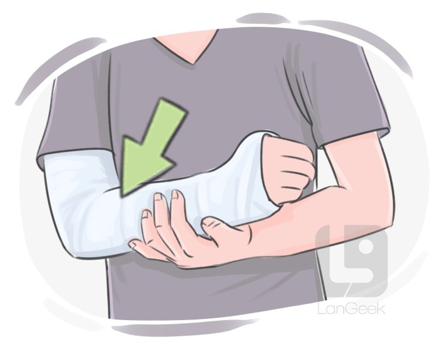 | 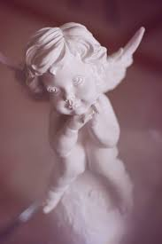 |
|:--:|:--:|:--:|

*Plaster（石膏） is a white powder（/ ˈpaʊdər / 粉末） that you mix with water to make a thick（粘稠的 / θɪk /） paste（糊状物 / peɪst /）. When it dries, it becomes very hard. People use it to make statues（雕像 / ˈstætʃuː /）, to cover walls, or to fix broken bones.*

#### athletes

[⬆️ Paragraph 6](#Paragraph-6)

> Over his bed he has a pink-and-white plaster angel, some pictures of famous athletes, and two or three photographs of naked women.

| athlete: n, `/ ˈæθliːt /` | 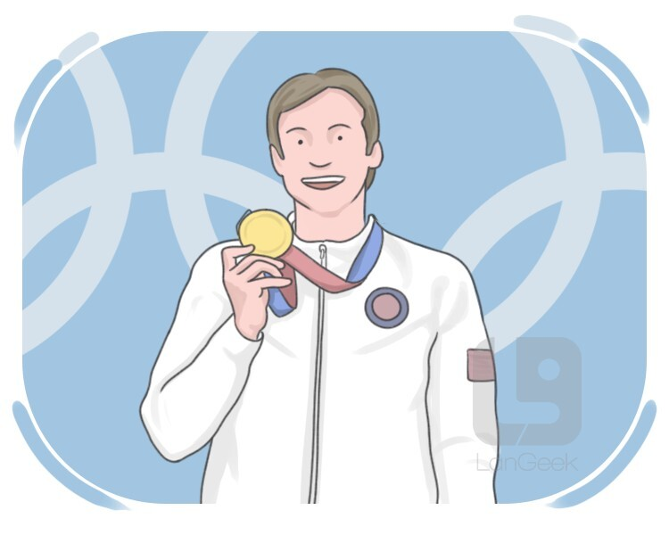 |
|:--:|:--:|

*Athletes(运动员, 体育选手) are people who are very good at sports and often compete in games or races.*

#### naked

[⬆️ Paragraph 6](#Paragraph-6)

> Over his bed he has a pink-and-white plaster angel, some pictures of famous athletes, and two or three photographs of naked women.

| naked(原型即如此): adj, `/ ˈneɪkɪd /` | 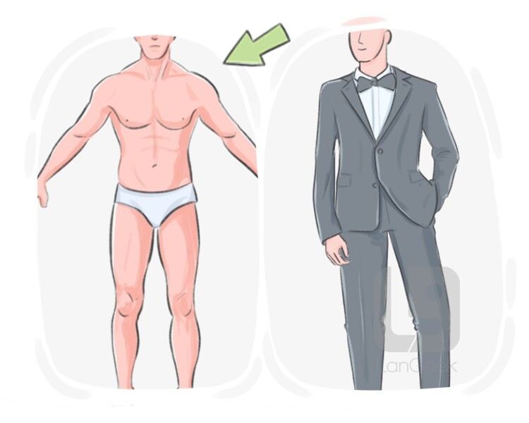 |
|:--:|:--:|

*Naked means wearing no clothes.*

常见的例子

- "The baby was naked in the bath."（婴儿光着身子在洗澡。）

- "He was naked from the waist up."（他光着上半身。）

- "She felt naked without her phone."（没有手机，她感觉像赤身裸体一样。）-> 这是一个比喻，意思是感到脆弱、暴露。

#### unmade

[⬆️ Paragraph 6](#Paragraph-6)

> The room was dirty and the bed was unmade.

*Unmade（unmake的过去分词） 的意思是 床在睡过之后没有被整理好。床单、毯子和枕头都很凌乱，没有放在该放的位置上。*

关键点

- 状态： 凌乱、不整洁。

- 原因： 通常是因为懒惰、匆忙或不拘小节。

- 反义词： Made（整理好的）。"Make the bed" 意思就是“铺床”。

常见的例子

- "I rushed out of the house this morning and left my bed unmade."（我今天早上匆匆出门，床都没整理。）

- "Her room was a mess, with an unmade bed and clothes on the floor."（她的房间一团糟，没整理的床，地上全是衣服。）

#### paraffin lamp

[⬆️ Paragraph 6](#Paragraph-6)

> First he lit his paraffin lamp, then he took a pretty dubious-looking bandage out of his pocket and wrapped it around his right hand.

| paraffin: n \| vt, `/ ˈpærəfɪn /`; lamp: n \| v, `/ læmp /` | 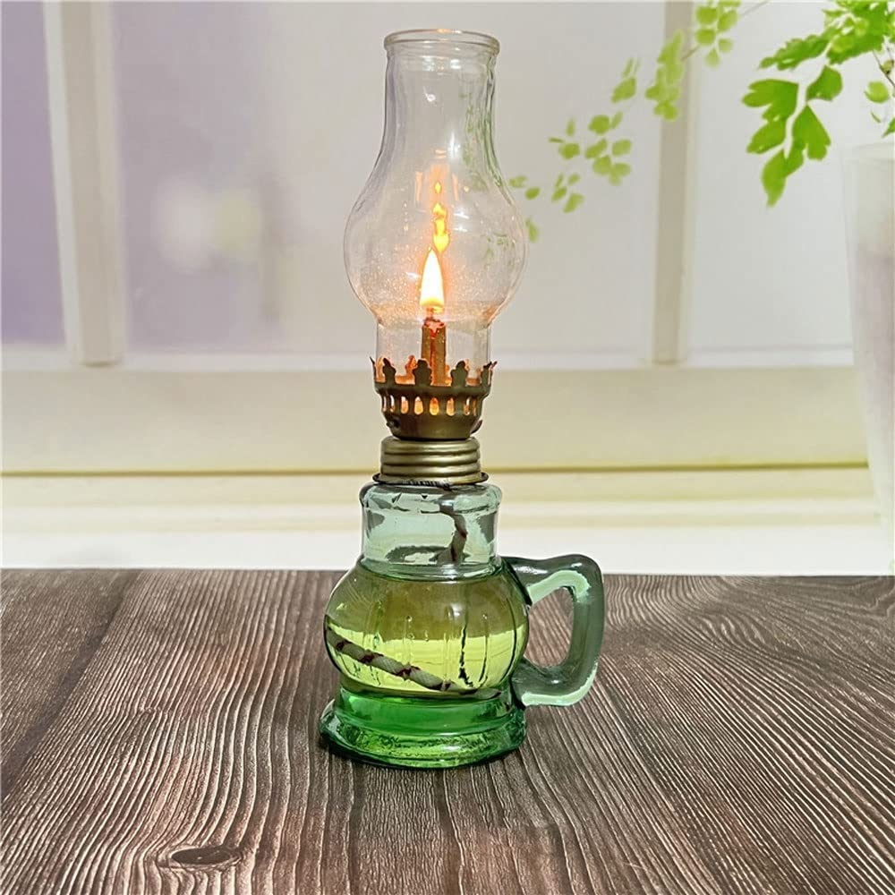 |
|:--:|:--:|

*A paraffin lamp is a lamp that produces light by burning paraffin oil (kerosene, 煤油 `/ ˈkerəsiːn /`).*

#### dubious-looking

[⬆️ Paragraph 6](#Paragraph-6)

> First he lit his paraffin lamp, then he took a pretty dubious-looking bandage out of his pocket and wrapped it around his right hand.

| dubious: adj, `/ ˈduːbiəs /` | 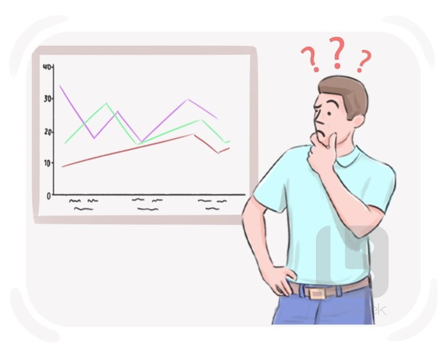 |
|:--:|:--:|

*Dubious-looking describes something that appears untrustworthy, questionable, or of low quality just by its looks.*

常见的例子

- "He was sold a phone by a dubious-looking character on the street."（他在街上从一个看起来可疑的家伙那里买了个手机。）

- "I wouldn't eat that; it has a dubious-looking color."（我不会吃那个的，它的颜色看起来不对劲。）

---

#### a short fuse

[⬆️ Paragraph 7](#Paragraph-7)

> it’s not that I’m a bad guy, but I have a short fuse.

| fuse: n \| v, `/ fjuːz /` | 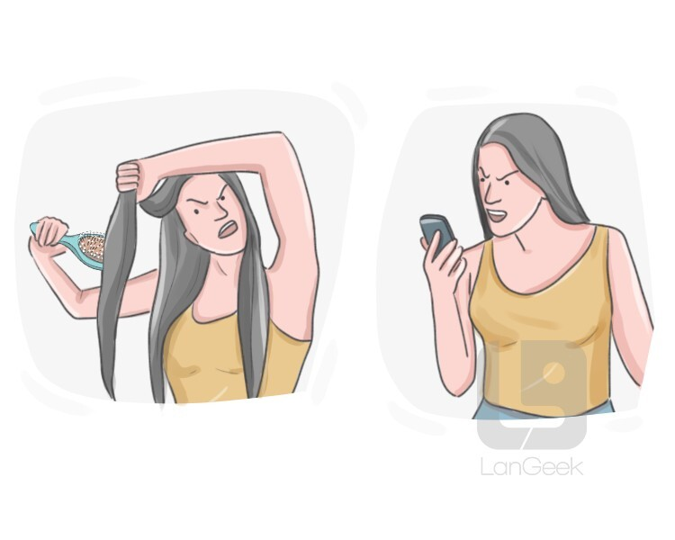 |
|:--:|:--:|

*A short fuse is a metaphor（比喻 `/ ˈmetəfər /`） that means someone gets angry very easily and quickly.*

常见的例子

- "Be careful what you say to the boss; he has a short fuse today."（跟老板说话小心点，他今天脾气一点就着。）

- "Her short fuse often gets her into trouble."（她的暴脾气经常给她惹麻烦。）

#### bloody

[⬆️ Paragraph 7](#Paragraph-7)

> His face was all bloody.

adj | adv | v, `/ ˈblʌdi /`

*Bloody means covered with or full of blood.*

重要的文化提示（英式英语俚语）

在英式英语中，bloody 也是一个非常常见的、轻微的咒骂词，用来加强语气，表示愤怒或惊讶，类似于“该死的”。

例句： "That's a bloody good idea!"（那真是个他妈的好主意！）

常见的例子（字面意思）

- "He had a bloody nose after the fight."（打架后，他鼻子流血了。）

- "There was a bloody knife on the floor."（地板上有一把带血的刀。）

- "The scene of the accident was bloody."（事故现场血淋淋的。）

#### fiddling with

[⬆️ Paragraph 7](#Paragraph-7)

> All this time, Sintès was fiddling with his bandage.

fiddle: v | n, `/ ˈfɪdl /`

*`Fiddle with`（摆弄） something means to keep touching or playing with it in a restless, nervous, or aimless way. 可以把它想象成一个习惯性的小动作，通常是因为感到无聊、紧张或心不在焉。*

关键点

- 动作： 触摸、拨弄、摆弄。

- 方式： 不专注的、重复的、漫无目的的。

- 原因： 通常是由于紧张、焦虑、不耐烦或无聊。

常见的例子

- "He was fiddling with his pen during the entire meeting."（整个会议期间，他一直在摆弄他的笔。）

- "Stop fiddling with the radio and pay attention to the road!"（别瞎摆弄收音机了，注意看路！）

- "She fiddled with her necklace while she was talking, a sign that she was nervous."（她说话时拨弄着她的项链，这是她紧张的一个迹象。）

#### pals

[⬆️ Paragraph 7](#Paragraph-7)

> Then he told me that as a matter of fact he wanted to ask my advice about the whole business, because I was a man, I knew about things, I could help him out, and then we’d be pals.

*Pals means friends.*

*它是一个非常常用、口语化且听起来很亲切的词，用来指关系好的朋友。*

常见的例子

- "We've been pals since we were kids."（我们从小就是好朋友。）

- "Hey, pal, how's it going?"（嘿，哥们儿，最近怎么样？）

- "They're not just colleagues; they're real pals."（他们不只是同事，他们是真正的哥们儿。）

#### glasses

[⬆️ Paragraph 7](#Paragraph-7)

> He got out the blood sausage, fried it up, and set out glasses, plates, knives and forks, and two bottles of wine.

| glass: v \| n, `/ ɡlæs /` | 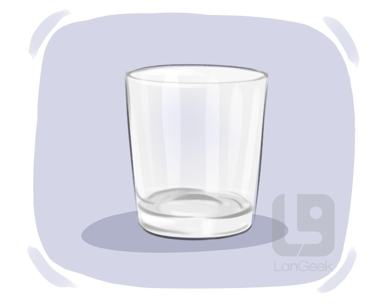 |
|:--:|:--:|

*a container that is used for drinks and is made of glass*

#### plates

[⬆️ Paragraph 7](#Paragraph-7)
[⬆️ Paragraph 12](#Paragraph-12)

> He got out the blood sausage, fried it up, and set out glasses, plates, knives and forks, and two bottles of wine.

| plate: v \| n, `/ pleɪt /` | 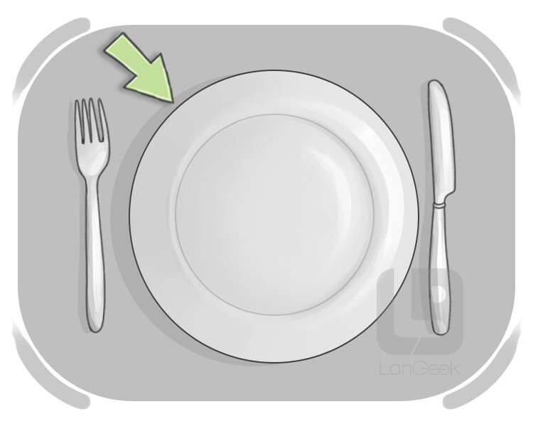 |
|:--:|:--:|

*a flat, typically round dish that we eat from or serve food on*

#### hesitant

[⬆️ Paragraph 7](#Paragraph-7)

> As we ate, he started telling me his story. He was a little hesitant at first.

adj, `/ ˈhezɪtənt /`

*Hesitant means not sure or slow to act or speak because you are nervous or uncertain(不确定 / ʌnˈsɜːrt(ə)n /).*

常见的例子

- "She was hesitant to accept the job offer."（她对是否接受那份工作犹豫不决。）

- "He gave a hesitant answer to the difficult question."（他对那个难题给了一个犹豫的回答。）

- "The dog was hesitant to approach the stranger."（那只狗迟疑着不敢靠近陌生人。）

#### mistress

[⬆️ Paragraph 7](#Paragraph-7)

> “I knew this lady . . . as a matter of fact, well, she was my mistress.”

n, `/ ˈmɪstrəs /`

*A mistress is a woman who is in a long-term sexual relationship with a married man, and that man is usually supporting her financially(金融上 / faɪˈnænʃəliˌfəˈnænʃəli /).*

重要提示

在现代日常英语中，由于这个词带有强烈的旧式色彩和不平等的意味，人们更倾向于使用更中性的短语，如：

- "He's having an affair."（他有一段婚外情。）

- "She's the other woman."（她是那个第三者。）

但在文学或历史语境中，mistress 仍然是一个非常精准和有力的词。

所以，在你的句子里，mistress 准确地描述了一种特定的、通常涉及金钱交易的婚外情关系。

#### conscience

[⬆️ Paragraph 7](#Paragraph-7)

> I didn't say anything, and yet right away he added that he knew what people around the neighborhood were saying, but that his conscience was clear and that he was a warehouse guard.

n, `/ ˈkɑːnʃəns /`

*Your conscience（良心/道德心） is the voice inside you that tells you if what you are doing is right or wrong.*

常见的例子

- "My conscience wouldn't let me cheat on the test."（我的良心不允许我考试作弊。）

- "After he lied, he was plagued(/ pleɪɡ /) by a guilty conscience."（他撒谎后，深受良心的谴责。）

- "She donated money to charity(/ ˈtʃærəti /) for a clear conscience."（她向慈善机构捐款以求问心无愧。）

---

#### francs

[⬆️ Paragraph 8](#Paragraph-8)

> He paid the rent on her room and gave her twenty francs a day for food. 

n, `/ fræŋk /`, 法郎

#### stockings

[⬆️ Paragraph 8](#Paragraph-8)

> Three hundred francs for the room, six hundred for food, a pair of stockings every now and then—that made it a thousand francs.

| n \| v, `/ ˈstɑːkɪŋ /` | 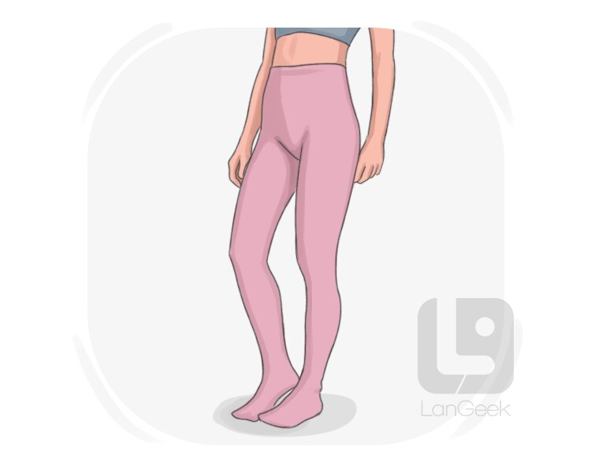 |
|:--:|:--:|

*a tight-fitting women's garment（服装 `/ ˈɡɑːrmənt /`） made of nylon（`/ ˈnaɪlɑːn /` 尼龙） or silk（丝绸 `/ sɪlk /`）, covering the foot and leg, sometimes held up by suspenders（吊带 `/ səˈspendər /`）*

#### Her Highness

[⬆️ Paragraph 8](#Paragraph-8)

> And Her Highness refused to work.

"Highness" 是一个尊称或头衔，专门用于称呼王室成员，如王子、公主、公爵等。它通常不直接翻译为“高大”或“高级”，而是根据上下文和中文习惯进行翻译。

Her Highness：在第三人称提及时使用，意为“女王/公主/王妃殿下”或“女王陛下”。

核心规则是：当这些头衔（如 Highness, Majesty, President, Chairman 等）与所有人称代词（my, your, his, her, their 等）连用，并特指某个具体的人时，它们就变成了该人物专有名称的一部分，因此必须大写。

#### outfit

[⬆️ Paragraph 8](#Paragraph-8)

> I bought you a new outfit just this month, I give you twenty francs a day, I pay your rent, and what do you do?

| n \| v, `/ ˈaʊtfɪt /` | 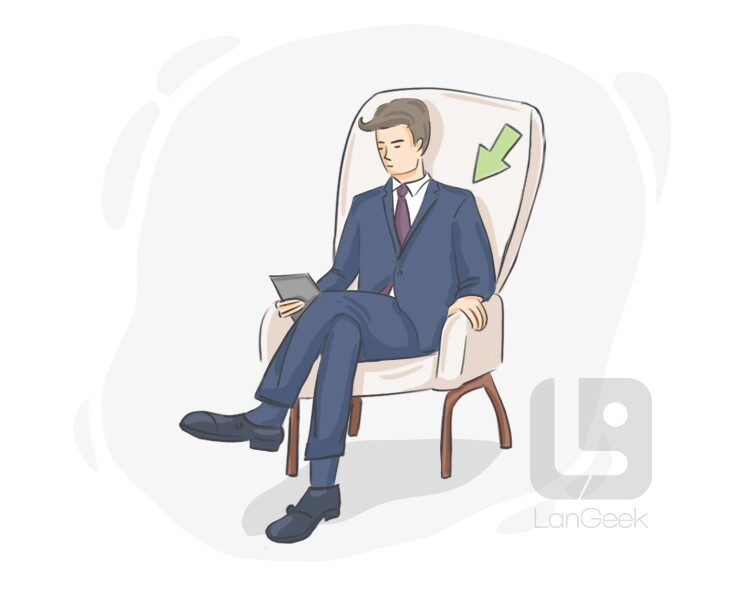 |
|:--:|:--:|

*a set of clothes that one wears together, especially for an event or occasion（特殊或重大场合 `/ əˈkeɪʒn /`）*

常见的例子

- "She wore a stylish outfit to the party."（她穿了一套时髦的衣服去参加派对。）

- "I need to buy a new outfit for my job interview."（我需要为我的工作面试买一身新行头。）

- "That's a cute outfit!"（这身打扮真可爱！）

#### purse

[⬆️ Paragraph 9](#Paragraph-9)

> Then he told me that he’d found a lottery ticket in her purse and she hadn’t been able to explain how she paid for it.

| n \| v, `/ pɜːrs /` | 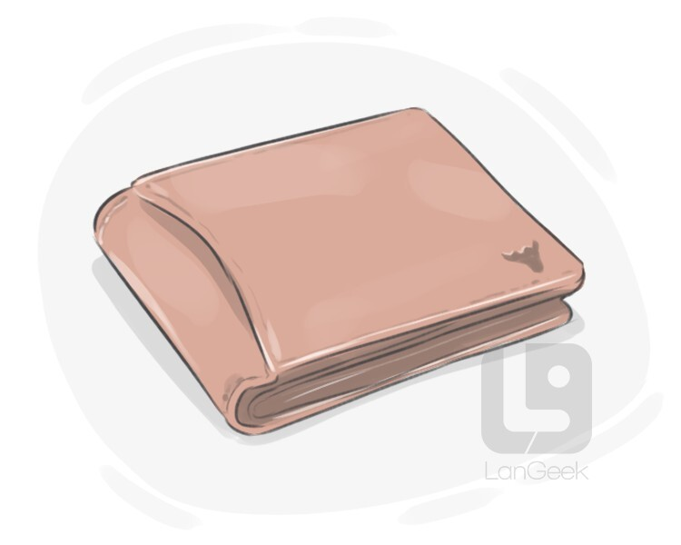 |
|:--:|:--:|

*a small bag used, particularly by women, for <mark>carrying money</mark>*

#### Mont-de-Piété(pawnshop)

[⬆️ Paragraph 9](#Paragraph-9)

> A short time later he’d found a ticket from the shop in Mont-de-Piété in her room which proved that she’d pawned two bracelets. 

| n, `/ ˈpɔːnʃɑːp /` | 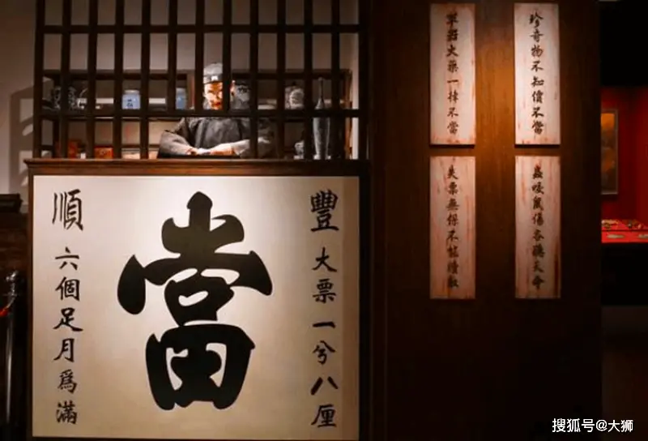 |
|:--:|:--:|

*Mont-de-Piété is the French name for a "pawnshop".*

#### pawned

[⬆️ Paragraph 9](#Paragraph-9)

> A short time later he’d found a ticket from the shop in Mont-de-Piété in her room which proved that she’d pawned two bracelets. 

n | v, `/ pɑːn /`

*To pawn something means to give a valuable item to a special shop (a pawnshop) in exchange for a loan(借用 `/ loʊn /`) of money.*

常见的例子

- "He had to pawn his watch to pay the rent."（他不得不当掉他的手表来付房租。）

- "My guitar is in pawn at the moment."（我的吉他目前押在当铺里。）

#### bracelets

[⬆️ Paragraph 9](#Paragraph-9)

> A short time later he’d found a ticket from the shop in Mont-de-Piété in her room which proved that she’d pawned two bracelets.

| n, `/ ˈbreɪslət /` | 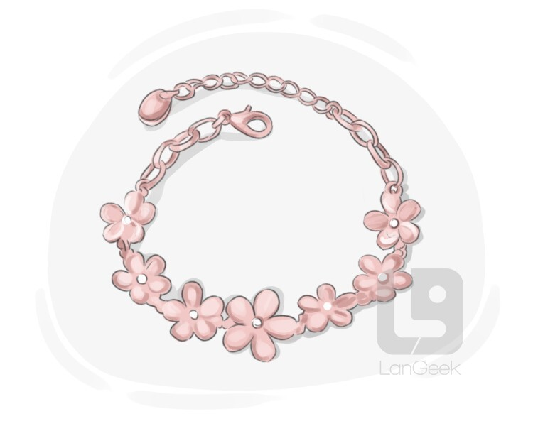 | 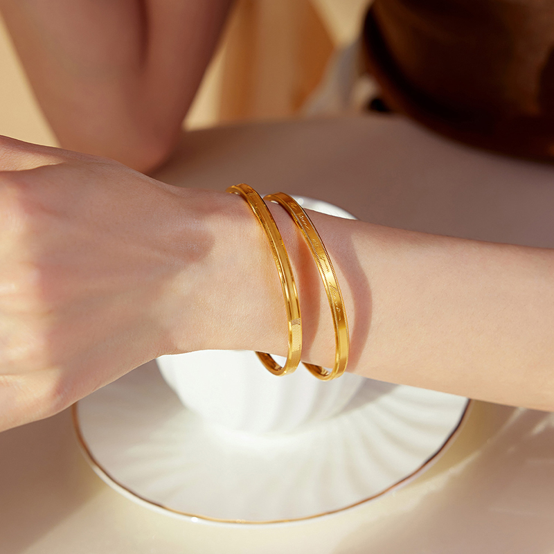 |
|:--:|:--:|:--:|

常见的例子

- "She wore a silver bracelet on her left wrist."（她左手腕上戴着一个银手镯。）

- "He bought her a diamond bracelet for her birthday."（他给她买了一个钻石手镯作为生日礼物。）

#### smacked sb around

[⬆️ Paragraph 9](#Paragraph-9)

> But first I smacked her around.

| n \| v \| adv, `/ smæk /` | 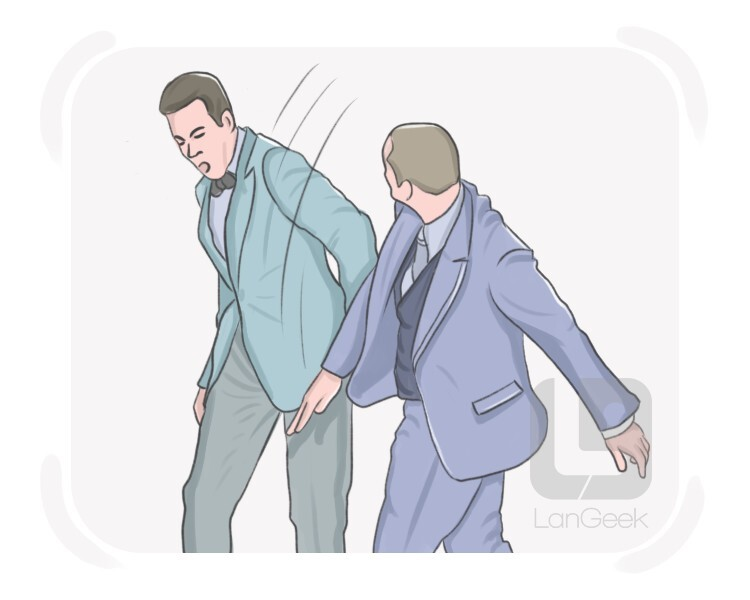 |
|:--:|:--:|

*To smack means to hit someone or something with your open hand, making a sharp sound.*

常见的例子

- "He smacked the table in anger."（他生气地啪一掌拍在桌子上。）

- "I wanted to smack him for saying that."（他说那种话，我真想扇他耳光。）

- "The child was smacked for misbehaving（行为不端 `/ ˌmɪsbɪˈheɪv /`）." （那个孩子因为行为不端被打了。）

**所以，smack 是一个拟声词，核心意思是“掌掴”。但当它与 around 连用时，就变成了一个表示“殴打”的暴力短语。**

*`Smacked her around` is a casual（随意的 `/ ˈkæʒuəl /`） and brutal（残忍的 `/ ˈbruːt(ə)l /`） way to say that he hit her repeatedly.*

#### the sack

[⬆️ Paragraph 9](#Paragraph-9)

> I told her that all she was interested in was `getting into the sack`(性暗示，上床).

| n \| v, `/ sæk /` | 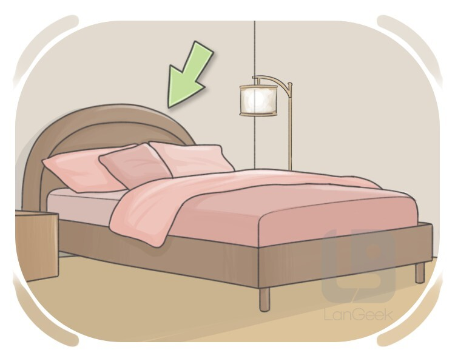 |
|:--:|:--:|

*the sack 是一个俚语，意思是“床”*

常见的例子

- "I'm exhausted; I'm going to hit the sack."（我累死了，我要上床睡觉了。）-> 这里没有性暗示。

- "He's only interested in getting you into the sack."（他只想把你弄上床。）-> 这里有明确的性暗示。

#### jealous

[⬆️ Paragraph 9](#Paragraph-9)

> You don't realize that everybody's jealous of how good you have it with me.

| adj, `/ ˈdʒeləs /` | 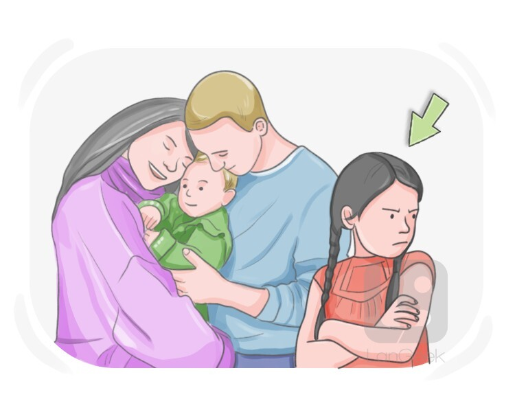 |
|:--:|:--:|

*feeling angry and unhappy because someone else has what we want*

常见的例子

- "She was jealous of her friend's new job."（她嫉妒她朋友的新工作。）

- "He gets jealous if I talk to other guys."（如果我和其他男生说话，他就会吃醋。）

- "Their success made him green with jealousy."（他们的成功让他嫉妒得眼红。）

---

#### till

[⬆️ Paragraph 10](#Paragraph-10)

> He’d beaten her till she bled.

prep | conj | n | v, `/ tɪl /`

*它和 until 的意思完全相同，可以互换使用。till 更口语化一些。*

常见的例子

- "I waited till 10 o'clock."（我一直等到10点钟。）

- "He didn't come home till midnight."（他直到半夜才回家。）

- "Keep stirring the mixture till it gets thick."（不停地搅拌混合物，直到它变稠。）

#### bled

[⬆️ Paragraph 10](#Paragraph-10)

> He’d beaten her till she bled.

**bled（`/ bled /`） 是 bleed 的过去分词**

| v \| n, `/ bliːd /` | 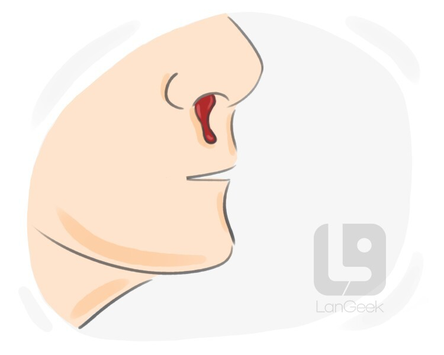 |
|:--:|:--:|

*To bleed means to lose blood from your body because of a cut（割伤） or injury（受伤 `/ ˈɪndʒəri /`）.*

常见的例子

- "He cut his finger and it bled a lot."（他割伤了手指，流了很多血。）

- "Her nose bled after she was hit by the ball."（她被球打中后，鼻子流血了。）

- "The soldiers bled for their country."（战士们为他们的国家流血牺牲。） -> 这是一个比喻用法。

#### nice-like

[⬆️ Paragraph 10](#Paragraph-10)

> I’d smack her around a little, but nice-like, you might say. 

*nice-like 是一种非常不正式且别扭的说法，意思是<mark>用温和或小心的方式</mark>。*说话者试图把他暴力的行为（smack her around）说得不那么严重，甚至是可以接受的。

关键点

- 意图： 弱化行为的严重性。

- 感觉： 听起来非常别扭、虚伪、甚至令人毛骨悚然。因为“打人”和“温和”本身就是完全矛盾的。

- 结构： 这是一个口语中临时造的词，把形容词 "nice" 加上 "-like" 来变成一个副词。标准的说法应该是 "nicely"，但说话者用了这种不规范的形式。

**nice-like 不是一个标准的英语单词，而是一个性格鲜明的口语表达。它的核心作用不是描述，而是揭示说话者试图美化其暴力行为的虚伪和扭曲心态。**

#### shutters

[⬆️ Paragraph 10](#Paragraph-10)

> I'd close the shutters and it always ended the same way.

| n \| v, `/ ˈʃʌtər /`, 百叶窗 | 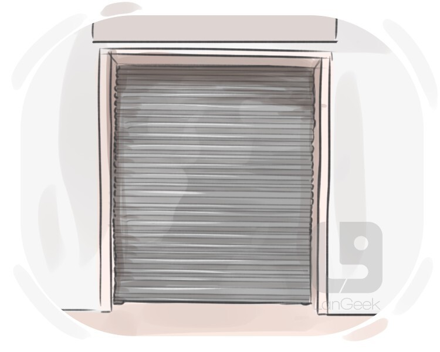 |
|:--:|:--:|

常见的例子

- "We close the shutters at night for security."（我们晚上关上窗板以保证安全。）

- "The storm shutters protected the windows from the hurricane."（防风百叶窗保护窗户免受飓风破坏。）

---

#### wick

[⬆️ Paragraph 11](#Paragraph-11)

> He stopped to adjust the lamp’s wick, which was smoking.

n | vt, `/ wɪk /`

*The wick is the piece of string in the middle of an oil lamp or candle that burns to produce light.*

常见的例子

- "The candle's wick was too long, making the flame flicker(`/ ˈflɪkər /`)."（蜡烛的灯芯太长了，导致火焰闪烁不定。）

- "You need to trim(`/ trɪm /`) the wick for a cleaner burn."（你需要修剪一下灯芯，让它燃烧得更充分。）

#### liter

[⬆️ Paragraph 11](#Paragraph-11)

> I’d drunk close to a liter of wine and my temples were burning.

| n, `/ ˈliːtər /`, 1000ml | 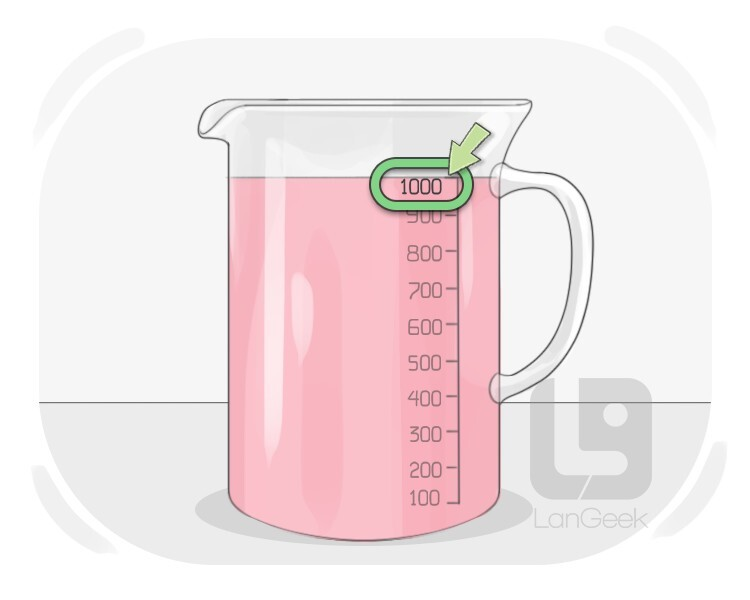 |
|:--:|:--:|

#### temples

[⬆️ Paragraph 11](#Paragraph-11)

> I’d drunk close to a liter of wine and my temples were burning.

| n, `/ ˈtemp(ə)l /`, 太阳穴 | 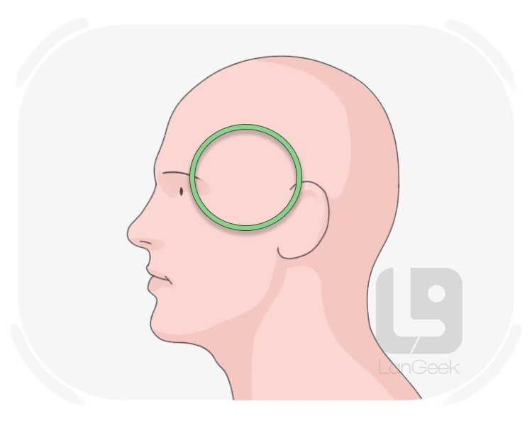 |
|:--:|:--:|

#### going by

[⬆️ Paragraph 11](#Paragraph-11)

> The last streetcars were going by, taking the now distant sounds of the neighborhood with them.

常见的例子

- "Look, the parade(`/ pəˈreɪd /`) is going by right now!"（看，游行队伍正经过！）

- "As time goes by, I understand it more."（随着时间流逝，我更加理解它了。）

- "We sat on the bench(`/ bentʃ /`) and watched the people go by."（我们坐在长椅上，看着人来人往。）

#### the now distant sounds

[⬆️ Paragraph 11](#Paragraph-11)

> The last streetcars were going by, taking the now distant sounds of the neighborhood with them.

The now + `[形容词]` + `[名词]`

- The now： 锁定“此刻”这个时间点。

- `[形容词]`： 描述事物在当前瞬间所呈现出的新状态（如 distant, familiar, empty）。

- `[名词]`： 所描述的核心事物。

*把它想象成用语言拍一张 “状态转变的即时照片”。*

- The now distant sounds 指的是 那些声音（街上的嘈杂声）此刻已经变得遥远。

- Looking at the now empty plate, he sighed with satisfaction.（看着此刻已空空如也的盘子，他满足地叹了口气。）

- She stared at the now silent phone, wondering why he hadn't called back.（她盯着此刻已沉寂无声的电话，想知道他为什么还没回电。）

#### the vice squad

[⬆️ Paragraph 11](#Paragraph-11)

> First he’d thought of taking her to a hotel and calling the vice squad to cause a scandal and have her listed as a common prostitute.

vice: / vaɪs /
squad: / skwɑːd /

*`The vice squad`（缉捕队/风化组） is a special group of police officers whose job is to deal with crimes related to immoral（不道德的，伤风败俗的 `/ ɪˈmɔːrəl /`） activities.*

#### cause

[⬆️ Paragraph 11](#Paragraph-11)

> First he’d thought of taking her to a hotel and calling the vice squad to cause a scandal and have her listed as a common prostitute.

关键点

- 功能： 连接一个动作 和其结果。

- 结构： Cause +「一个结果或事件」

*cause 清晰地表明了“打电话”这个动作的目的：就是为了制造出“丑闻”这个结果。这体现了说话者（雷蒙）的预谋和恶意，他不是在冲动行事，而是在冷静地策划如何毁掉那个女人的名誉。*

常见的例子

- "The heavy rain caused the flood."（大雨引发了洪水。）

- "The driver's carelessness caused the accident."（司机的粗心导致了事故。）

- "I'm sorry if I caused any trouble."（如果我给你造成了任何麻烦，我很抱歉。）

#### scandal

[⬆️ Paragraph 11](#Paragraph-11)

> First he’d thought of taking her to a hotel and calling the vice squad to cause a scandal and have her listed as a common prostitute.

n, / ˈskænd(ə)l /

*A scandal（丑闻） is an action or event that is considered morally or legally wrong and that shocks people, causing public anger and damaging someone's reputation.*

常见的例子

- "The politician(`/ ˌpɑːləˈtɪʃ(ə)n /`) resigned after a corruption(`/ kəˈrʌpʃ(ə)n /`) scandal."（那位政治家在一桩腐败丑闻后辞职了。）

- "Their divorce(`/ dɪˈvɔːrs /`) caused a huge scandal in their small town."（他们的离婚在他们的小镇上引起了巨大的丑闻。）

- "The company is involved(`/ ɪnˈvɑːlvd /`) in a financial(`/ faɪˈnænʃ(ə)l /`) scandal."（这家公司卷入了一桩财务丑闻。）

#### prostitute

[⬆️ Paragraph 11](#Paragraph-11)

> First he’d thought of taking her to a hotel and calling the vice squad to cause a scandal and have her listed as a common prostitute.

v | n | adj, / ˈprɑːstɪtuːt /

*A prostitute is a person who has sex with someone in exchange for money.*

#### underworld friends

[⬆️ Paragraph 11](#Paragraph-11)

> After that he'd looked up some of his underworld friends.

Underworld: 黑社会，犯罪世界。这个词本身就描绘了一个隐藏在社会主流之下的、由罪犯组成的网络。

#### come up with

[⬆️ Paragraph 11](#Paragraph-11)

> But they didn’t come up with anything. 

*To `come up with something` means to think of an idea, a plan, or a solution, or to produce something that is needed.*

关键点

- 动作： 思考并产生结果。

- 结果： 通常是一个想法、计划、答案、一笔钱等。

- 感觉： 常暗示需要一定的创造力或努力才能得到结果。

常见的例子

- "We need to come up with a better plan."（我们需要想出一个更好的计划。）

- "She always comes up with great ideas for the party."（她总是能为派对想出好主意。）

- "How did you come up with the money for the trip?"（你是怎么凑到旅费的？）

#### his wanting

[⬆️ Paragraph 11](#Paragraph-11)

> but I understood his wanting to punish her. 

此为复合结构，主结构是 I understood someting。something 作宾语，而 his wanting to punish her 则是主结构的宾语成份。通过动名词的方式，将 he want to punish her 这个句子改造成一个名词短语，把动词 "want" 变成它的动名词形式 "wanting"（动名词（-ing）的本质就是一个同时具有动词和名词特性的词。），而 he 变化成 his 是因为在动名词前面，逻辑主语要用所有格形式。

更多例句帮助理解

- Do you mind my smoking here?（你介意我在这里抽烟吗？）
  核心是 "Do you mind the smoking?"，而抽烟的人是我，所以是 "my smoking"。

- I appreciate your helping me.（我感谢你帮助我。）
  核心是 "I appreciate the help"，而帮助的人是你，所以是 "your helping"。

- We are excited about his coming to the party.（我们对于他来参加派对感到很兴奋。）
  核心是 "We are excited about the event of coming"，而来的人是他，所以是 "his coming"。

#### let me in on

[⬆️ Paragraph 11](#Paragraph-11)

> He lit a cigarette and let me in on what he was thinking about doing. 

**let someone in on something**: `动词短语` `不可分割习语`，意为*让某人参与进某事当中*

实用例句

关于秘密

- "I'm going to let you in on a little secret: I'm planning a surprise party for Mom."（我要告诉你一个小秘密：我正在为妈妈策划一个惊喜派对。）

- "Can I let you in on something? I think John is going to propose to Mary."（我能跟你透露点事吗？我觉得约翰要向玛丽求婚了。）

关于计划

- "The manager decided to let the team in on the new marketing strategy."（经理决定让团队知晓新的营销策略。）

- "We're planning a prank on David. Should we let Sarah in on it?"（我们正计划捉弄一下大卫。我们要让莎拉也参与进来吗？）

关于内部消息

- "As your friend, I feel I should let you in on the office gossip about you."（作为你的朋友，我觉得我应该让你知道一下办公室里关于你的传闻。）

- "The journalist was let in on some confidential information by her source."（那位记者从她的消息源那里得知了一些机密信息。）

（在对话中直接使用）

- A: "Why is everyone being so mysterious?" （为什么大家都这么神神秘秘的？）
- B: "I'll let you in on it later, I promise." （我保证晚点告诉你内情。）

#### punch

[⬆️ Paragraph 11](#Paragraph-11)

> one with a punch and also some things in it to make her sorry for what she’s done.

n | v, / pʌntʃ /

在这里，punch 的意思是 *力量；冲击力；感染力*。

它并不是指“用拳头击打”这个动作，而是指某物（如一句话、一封电报）所具有的强烈效果或情感冲击。

常见的比喻用法

- "His speech had a real punch."（他的演讲很有感染力/冲击力。）

- "The advertisement needs more punch to get people's attention."（这个广告需要更多冲击力来吸引人们的注意。）

- "The movie's ending really packs a punch."（这部电影的结局真的震撼人心。）

**其中的 `with`**

在这个结构中，"with" 用来表示 “带有”、“具有”、“拥有” 某种特性或附属物。

"with" 的这种用法与定语从句的转换

这种 "with" 结构几乎总是可以转换成一个完整的定语从句，这使得它非常高效简洁。

- "with" 结构： I want a telegram with a punch.

- 定语从句： I want a telegram that has a punch.

更多例句（帮助你彻底掌握）

1. 描述人：
  - He is a man with a kind heart. = He is a man who has a kind heart.（他是一个心地善良的男人。）

2. 描述物体：
  - I'd like a room with a sea view. = I'd like a room that has a sea view.（我想要一间带海景的房间。）
  - She was carrying a bag with a strange symbol on it.（她拿着一个上面有奇怪符号的包。）

3. 描述抽象概念：
  - It's a plan with great potential. = It's a plan that has great potential.（这是一个极具潜力的计划。）

#### came running back

[⬆️ Paragraph 11](#Paragraph-11)

> Then, when she came running back

- came 是主要动词，表示“来”这个移动方向。

- running 是现在分词，它描述了“来”的方式。

*可以把它理解成：她 “跑着回来” 或者 “是跑回来的”。running 生动地描绘了她回来时的状态和姿态。*

**结构分析**

这个结构的基本公式是：

`come/go` + `-ing` 动词

这个结构专门用来描述 *“以某种方式前来或离去”*。

**更多例句（帮助你彻底掌握）**

- The children came running when they heard the ice cream truck.（孩子们听到冰淇淋车的音乐声，就跑着过来了。）

- She went sobbing from the room.（她哭泣着离开了房间。）

- Please don't go shouting the news to everyone.（请不要大声嚷嚷着把这个消息告诉所有人。）

**与“come to do sth”的区别**

这里非常重要的一点是，要区分 `come running` 和 `come to run`：

- `come running`: 强调 *“来”的方式 是“跑着”*。（她是怎么来的？是跑来的。）
  例句：He came running to help. （他跑过来帮忙。）-> 他过来是为了帮忙，而他过来的方式是跑步。

- `come to run`: 强调 *“来”的目的 是“为了跑步”*。
  例句：He came to the park to run. （他来公园是为了跑步。）-> 他来到公园，目的是进行跑步这项运动。

#### right at

[⬆️ Paragraph 11](#Paragraph-11)

> right at the last minute

*"Right at" 是一个用来 强调某个地点或时间点的精确性 的短语。它的作用是加强语气，表示 “恰恰在”、“正好在”，几乎分毫不差。*

**两种主要用法**

1. 强调精确的地点

- "He was standing right at the edge of the cliff."（他就站在悬崖的最边缘。）

- "The keys are right at the bottom of my bag."（钥匙就在我包的最底下。）

2. 强调精确的时间点（如你的原句）

- "He arrived right at 8 o'clock."（他正好八点钟到的。）

- "I woke up right at sunrise."（我正好在日出时醒来。）

- "Right at that moment, the phone rang."（恰恰在那一刻，电话响了。）

#### spit

[⬆️ Paragraph 11](#Paragraph-11)

> he’d spit in her face and throw her out. 

| v \| n, `/ spɪt /` | 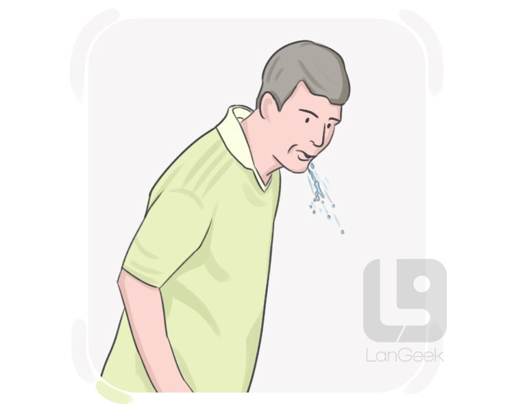 |
|:--:|:--:|

*To spit means to force saliva(`/ səˈlaɪvə /` 唾液) or other liquid from your mouth.*

**常见的例子**

- "It's rude to spit on the sidewalk."（在人行道上吐痰是粗鲁的。）

- "The angry fan was ejected for spitting at the player."（那个愤怒的球迷因为向球员吐口水而被驱逐出场。）

- "He took one taste of the medicine and spat it out."（他尝了一口药，就把它吐了出来。）

#### throw her out

[⬆️ Paragraph 11](#Paragraph-11)

> he’d spit in her face and throw her out.

*To `throw someone out` means to force them to leave a place, often in a rough or sudden way.*

**常见的例子**

- "The bouncer threw the drunk man out of the bar."（保安把那个醉汉轰出了酒吧。）

- "He was thrown out of school for cheating."（他因为作弊被开除出了学校。）

- "If you cause trouble again, I'll throw you out!"（如果你再惹麻烦，我就把你赶出去！）

所以，throw someone out 是一个非常有力且常用的短语，专门描述以强硬、不客气的方式将某人驱逐出一个地方。

---

## Chapter IV
