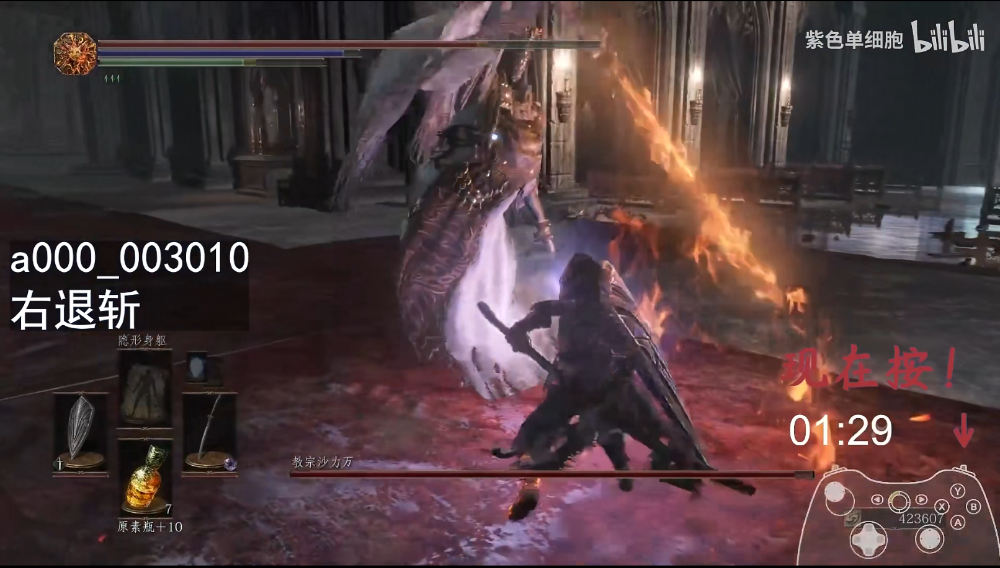
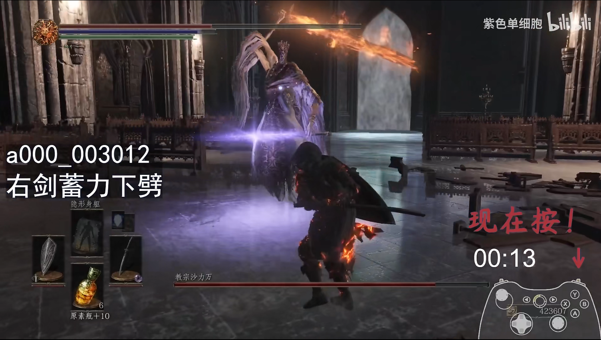
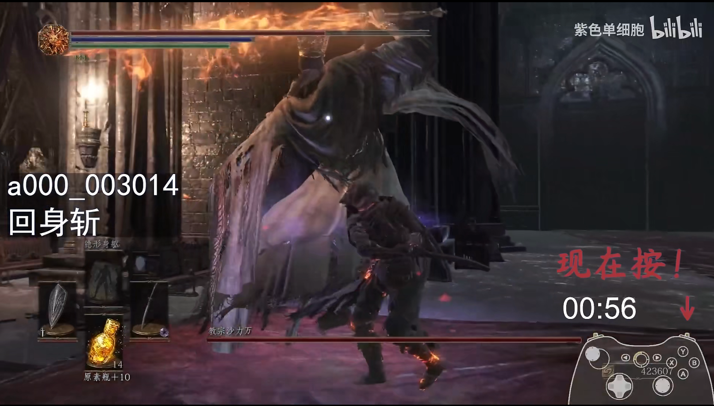
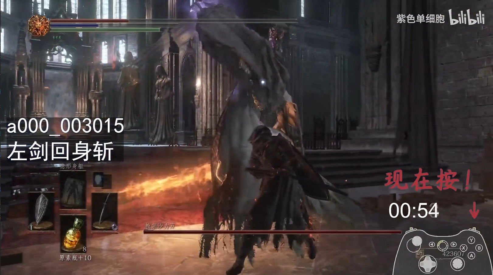

我真是发神经，怎么突然就刷到了魂2的mod视频（旧神之薪），它做得相当的不错，很符合我的审美。在看到被mod优化后的魂2主角套装（法汉），加上长戟时，我被深深地吸引。我迫不及待想玩这个mod，但是很可惜，还没有上线，目前进有实机演示视频。我转而想到了魂3，我有这个游戏，最近我还给它购买了新的DLC，魂3也有战戟，也有法汉一套。最后，我果然是再次开始了黑暗之魂3的传火之旅，yes，indeed！

战戟法汉的传火之旅在今天傍晚为止都算是比较顺利，直到再次遇到老对手——教宗沙立万。真是一生之敌，这个可以弹反的boss，我想学会弹反这个臭boss。沙立万的弹反对于我来说还是比较难，一方面，是错学习成本很高，它对我连击2下，我的角色就会死亡。而且它连击频率异常高！导致大部分时候我都是在跑过去找他的路上，每次进门就会被快速砍死。

我觉得这样的学习方式太愚蠢了，必然会浪费大量的无用时间。我想，有没有mod可以做到角色无敌，让我可以和boss一直对练。我尝试去找了，找的过程中发现这种mod不多！真是让人震惊！而且mod的安装有安全问题和学习成本，最后我放弃这个道路。接着，我去看别人的针对沙立万的弹反教程，[【黑暗之魂3】沙力万全招式弹反分解](https://www.bilibili.com/video/BV1W34y1B7cM/?vd_source=33ac0456d389f10fb21747392b35389b)。对于这个视频我的感受是：它的有效信息确实多，但感觉不像个教程！

我想起以前攻略一些招式比较多、比较复杂的boss，我也回去找视频学习如何攻略。一些将boss招式逐个分析的教程会出现在我们的搜索结果中。这些方法不是说不对，但是感觉缺少最关键的东西。它们都只看到boss当前这一招，不能看到未来几招。只能看到一招的话，如果你想战胜敌人，那么就要求你有超强的反应能力，在无防备的情况下即时应对当前boss出招。

所谓可以看到未来几招的意思是，看到boss当前的出招，可以预判这招之后，下一招是什么。让你在应对当前时就已经做好下一招的准备，这样才能做到游刃有余！这样才是正常人的攻略手段！

如果仅学会了每一招的应对方式，而不懂预判下一招。这样子留给自己的余裕太少，过于被动，很容易陷入手忙脚乱的境地！

准确预判下一招很难，应该主动引导，让它的出招符合预期，让下一招的可选范围缩到最小。换句话说就是，让boss陷入我们的节奏！

# 出招特点

- 所有左手魔剑（蓝色）出招中，仅有一招是可以被弹反的；

- 所有右手火焰剑出招中，仅有一招是无法被弹反的。

# 出招详情

<!-- ❌ ✔️ ✅  ❎ -->

| 序号 | 招式 | 可弹反 | 起手式 |
| -- | -- | :--: | :--: |
| 00 | 右移斩 | ✔️ | ✔️ |
| 01 | 左移刺 | ❌ | ✔️ |
| 02 | 突进斩 | ✔️ | ✔️ |
| 03 | 右踏斩 | ✔️ | ✔️ |
| 04 | 右踏反斩 | ✔️ | ✔️ |
| 05 | 右踏斩·连 | ✔️ | ❌ |
| 06 | 左剑蓄力突刺 | ❌ | ✔️ |
| 07 | 左剑突刺-连 | ❌ | ❌ |
| 08 | 左剑突刺连·无蕾力动作 | ❌ | ❌ |
| 09 | 左剑回旋斩 | ❌ | ✔️ |
| 10 | 右退斩 | ✔️ | ✔️ |
| 11 | 左剑伪突刺 | ❌ | ✔️ |
| 12 | 右剑蓄力下劈 | ✔️ | ✔️ |
| 13 | 回旋二连击 | ✔️ | ✔️ |
| 14 | 回身斩 | ✔️ | ✔️ |
| 15 | 左剑回身斩 | ✔️ | ✔️ |
| 16 | 蓄力后跳下斩 | ✔️ | ✔️ |
| 17 | 跳斩 | ✔️ | ✔️ |
| 18 | 空跳下戳 | ❌ | ✔️ |
| 19 | 空跳右剑下戳 | ❌ | ✔️ |
| 20 | 腾空跳劈 | ✔️ | ✔️ |
| 21 | 混合四连击 | ✔️ | ✔️ |
| 22 | 上挑回旋斩 | ✔️ | ✔️ |
| 23 | 变身 | ❌ | ❌ |
| 24 | 左剑蓄力突刺·起 | ❌ | ✔️ |
| 25 | 蓄力气剑 | ❌ | ✔️ |
| 26 | 分身 | ❌ | ❌ |

# 派生出招

## 右退斩

起手：左剑突刺（举盾挡）-> 右旋双手下劈（举盾挡） -> 右手单剑下劈【#10-右退斩】（弹反）

## 右剑蓄力下劈

起手：右剑蓄力下劈【#12】

## 回身斩

起手：左剑突刺（侧闪，boss冲到后面，自己跟上）- 右手单剑下劈（玩家还在boss身后）- 右手回身斩【#14】（弹反）

## 左剑回身斩

### 派生1

1. 起手，左剑突刺。*应对：前翻滚，转身追boss；*
2. 左剑回身斩【#15】。*应对：弹反*

### 派生2

1. 起手，左剑突刺。*应对：前翻滚，转身追boss；*
2. 右手单剑下劈。*无应对，在攻击范围外，继续靠近boss*
3. 左剑回身斩【#15】。*应对：弹反*

