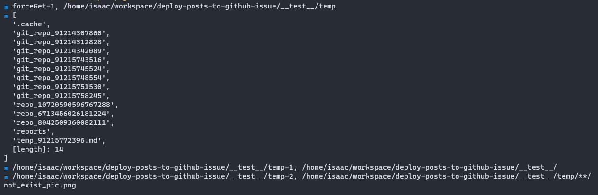

*内存溢出*

单独执行测试文件，不触发

执行全部测试文件，必然触发


---

- 在全文件测试前提下，测试到 post_parse 测试文件时触发异常

---

post_parse测试文件内

使用二分法分批执行测试用例，缩小异常范围。最后确认到的是下面测试用例导致。

```js
test.only('parse invalid asset link', () => {
  const uniqueChars = getTimestampKey();
  const filepath = `__test__/temp/temp_${uniqueChars}.md`;
  writeFileSync(filepath, TEST_CASE_MARKDOWN_ASSET_WITHOUT_URL);
  // expect(() => {
    
  // }).not.toThrowError();

  try {
    const params = {
      path: filepath,
      conf: {
        link_prefix: 'https://isaaxite.github.io/blog/resources/',
        absolute_source_dir: path.resolve('__test__/source'),
        disable_asset_find: false
      },
      // disable_immediate_formatAssetLink: true
    };
    // console.info(params)
    new PostParse(params);
  } catch (error) {
    // expect(false).toBeTruthy();
  }

  removeSync(filepath);
})
```

排除是文件创建、写入和删除导致，确认是 `new PostParse(params)` 触发的异常。


*打印法*

打印方式：

- console

- hinter.info

对于 复杂类型的数据使用 `util.format('%o', data)` 处理后再打印。

----

打印法确认 `PostParse` 构造函数中的 `this.#formatAssetLink(this.#ast?.children);` 触发。

```js
if (!disable_immediate_formatAssetLink) {
  this.#formatAssetLink(this.#ast?.children);
}
```

formatAssetLink 是递归函数，要确认是否异常的递归路径导致溢出。目测不完全是，先继续打印法缩小范围。

```js
#formatAssetLinkHandler(ast) {
  const conf = this.#conf;
  let lastUrl = ast?.url;
  hinter.warnMsg(ast?.url);

  if (!lastUrl) {
    hinter.warnMsg(`Exist empty link`);
    return;
  }
  hinter.warnMsg(`${ast?.url}-1`);

  if (conf.disable_asset_find) {
    hinter.warnMsg(`${ast?.url}-1.1`);
    const formater = new LinkFormater(lastUrl, {
      url_prefix: conf.link_prefix
    });
    ast.url = formater.dest;
    return;
  }

  hinter.warnMsg(`${ast?.url}-2, ${utilFormat('%o', {
    assetPath: lastUrl,
    postpath: this.#filepath,
    sourceDirPath: conf.absolute_source_dir
  })}`);
  

  const assetFinder = new AssetFinder({
    assetPath: lastUrl,
    postpath: this.#filepath,
    sourceDirPath: conf.absolute_source_dir
  });
  hinter.warnMsg(`${ast?.url}-3`);
  lastUrl = assetFinder.getRelativeToSourceDir();

  if (lastUrl) {
    hinter.warnMsg(`${ast?.url}-3.1`);
    const assetpath = assetFinder.get();
    hinter.warnMsg(`${ast?.url}-3.1.1, ${assetpath}`);
    this.#addToAssetPathRelativeRepoSet(assetpath);
    hinter.warnMsg(`${ast?.url}-3.1.2`);
    const formater = new LinkFormater(lastUrl, {
      url_prefix: conf.link_prefix
    });
    hinter.warnMsg(`${ast?.url}-3.1.3`);
    ast.url = formater.dest;
  } else {
    hinter.warnMsg(`${ast?.url}-3.2`);
    const sourceDirname = path.basename(conf.absolute_source_dir);
    const assetname = path.basename(ast.url);
    hinter.warnMsg(`[${assetname}] was not found in the recursive search of the [${sourceDirname}] directory`);
  }
}
```

打印停在

```js
hinter.warnMsg(`${ast?.url}-3.1`)
```

确认是

```js
const assetpath = assetFinder.get();
```

触发的异常。

看 `assetFinder.get` 内容

```js
#loopFind({
  dirPath
}) {
  const breakDirpath = path.join(this.#sourceDirPath, '../');
  if (dirPath === '/home/isaac/workspace/deploy-posts-to-github-issue/__test__/temp') {
    hinter.infoMsg(`${utilFormat('%o', readdirSync(dirPath))}`)
  }
  hinter.infoMsg(`${dirPath}-1, ${breakDirpath}`)
  // path.join(dirPath, './') for promise end with sep. 
  if (path.join(dirPath, './') === breakDirpath) {
    hinter.infoMsg(`${dirPath}-1.1`)
    return '';
  }

  const pattern = path.join(dirPath, `**/${this.#assetName}`);
  hinter.infoMsg(`${dirPath}-2, ${pattern}`)
  const ret = fg.sync(pattern)[0] || '';

  hinter.infoMsg(`${dirPath}-3`)
  if (ret && existsSync(ret)) {
    hinter.infoMsg(`${dirPath}-3.1`)
    return ret;
  }

  hinter.infoMsg(`${dirPath}-4`)
  return this.#loopFind({
    dirPath: path.join(dirPath, '../')
  });
}
```



打印停在

```js
hinter.infoMsg(`${dirPath}-2, ${pattern}`)
```

pattern 的值：

```js
/home/isaac/workspace/deploy-posts-to-github-issue/__test__/temp/**/not_exist_pic.png
```
temp目录下的文件与目录：

```shell
[
  '.cache',
  'git_repo_91214307860',
  'git_repo_91214312828',
  'git_repo_91214342089',
  'git_repo_91215743516',
  'git_repo_91215745524',
  'git_repo_91215748554',
  'git_repo_91215751530',
  'git_repo_91215758245',
  'repo_10720590596767288',
  'repo_6713456026181224',
  'repo_8042509360082111',
  'reports',
  'temp_91215772396.md',
  [length]: 14
]
```
推测是搜索范围太大导致 `fg.sync` 异常，引发溢出。