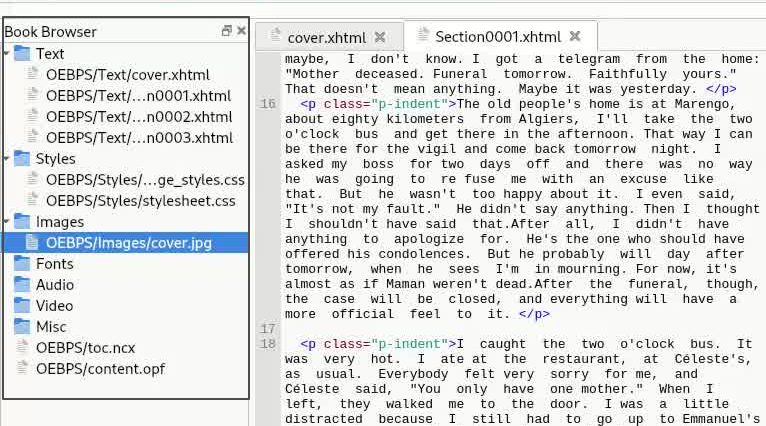

# 初步尝试

使用 [Sigil](https://sigil-ebook.com/sigil/)手动新建 epub 项目，此项目具有目录结构，但非解压的目录结构树，仅可由 Sigil 等项目查看与编辑。

目录结构如：

```shell
mybook/                 # 解压后的根目录
├── mimetype            # （必须）标识文件类型，必须是未压缩的第一个文件
├── META-INF/           # （必须）存放容器和加密元数据
│   └── container.xml   # （必须）指定根文件路径（如 OPF 文件位置）
├── OEBPS/              # （可选）主要内容目录（名称可自定义，常见为 OEBPS 或 EPUB）
│   ├── content.opf     # （必须）核心元数据文件（EPUB 3 通常命名为 package.opf）
│   ├── toc.xhtml       # （必须）EPUB 3 导航文档（替代旧版 toc.ncx）
│   ├── chapter1.xhtml  # 正文内容（XHTML/HTML5 格式）
│   ├── styles/
│   │   └── style.css   # CSS 样式文件
│   └── images/
│       └── cover.jpg   # 图片资源
└── (其他自定义目录)     # 如 fonts/（字体）、audio/（音频）等
```


# OPF文件

## 编辑元数据（`<metadata>`）

元数据存储在 `OEBPS/content.opf` 文件，位于 `<metadata>` 标签中。每一条元数据由 `<meta />` 和 `<dc:xxx/>` 标签存储，见下：

```xml
<!-- 声明元数据使用的命名空间 -->
<metadata 
    xmlns:opf="http://www.idpf.org/2007/opf"  <!-- EPUB 专用元数据扩展 -->
    xmlns:dc="http://purl.org/dc/elements/1.1/"  <!-- 都柏林核心元数据标准 -->
    xmlns:dcterms="http://purl.org/dc/terms/"   <!-- 都柏林核心扩展术语 -->
    xmlns:xsi="http://www.w3.org/2001/XMLSchema-instance"  <!-- XML 模式实例 -->
    xmlns:calibre="http://calibre.kovidgoyal.net/2009/metadata">  <!-- Calibre 软件扩展 -->

    <!-- 书籍语言（ISO 639-1 代码） -->
    <dc:language>zh</dc:language>

    <!-- 书籍标题 -->
    <dc:title>局外人</dc:title>

    <!-- 作者信息 -->
    <dc:creator 
        opf:file-as="[法] 阿尔贝·加缪"  <!-- 排序用名称（如按姓氏排序） -->
        opf:role="aut">  <!-- 角色标识（aut=author） -->
        [法] 阿尔贝·加缪  <!-- 显示用名称 -->
    </dc:creator>

    <!-- 贡献者信息（此处是生成工具） -->
    <dc:contributor opf:role="bkp">  <!-- bkp=backup 或工具标记 -->
        calibre (5.8.1) [https://calibre-ebook.com]  <!-- Calibre 生成记录 -->
    </dc:contributor>

    <!-- 出版社信息 -->
    <dc:publisher>上海译文出版社</dc:publisher>

    <!-- 书籍标识符（多种来源） -->
    <dc:identifier opf:scheme="MOBI-ASIN">B00F84FVKC</dc:identifier>  <!-- Amazon ASIN -->
    <dc:identifier opf:scheme="ISBN">9787532761760</dc:identifier>    <!-- 国际标准书号 -->
    <dc:identifier opf:scheme="DOUBAN">24257486</dc:identifier>       <!-- 豆瓣 ID -->
    <dc:identifier id="uuid_id" opf:scheme="uuid">7cb6b9ec-e7d2-4977-82f3-ff827b3d9f27</dc:identifier>  <!-- 唯一UUID -->
    <dc:identifier opf:scheme="calibre">7cb6b9ec-e7d2-4977-82f3-ff827b3d9f27</dc:identifier>  <!-- Calibre 内部ID -->

    <!-- 出版日期（ISO 8601 格式） -->
    <dc:date>2013-08-14T16:00:00+00:00</dc:date>

    <!-- Calibre 专用元数据：文件生成时间戳 -->
    <meta name="calibre:timestamp" content="2021-10-13T07:08:11.589334+00:00" />

    <!-- 标题排序规则（用于图书馆管理） -->
    <meta name="calibre:title_sort" content="局外人" />

    <!-- 书籍描述（HTML 转义内容） -->
    <dc:description>
        &lt;div&gt;
        &lt;p&gt;阿尔贝•加缪（1913—1960）是法国声名卓著的小说家...&lt;/p&gt;
        &lt;/div&gt;
    </dc:description>

    <!-- 丛书信息（Calibre 扩展） -->
    <meta name="calibre:series" content="加缪作品" />  <!-- 所属丛书名 -->
    <meta name="calibre:series_index" content="1" />  <!-- 丛书中的序号 -->

    <!-- 评分（Calibre 扩展，10分制） -->
    <meta name="calibre:rating" content="10.00" />

    <!-- 主题标签（分类/关键词） -->
    <dc:subject>加缪</dc:subject>
    <dc:subject>阿尔贝·加缪</dc:subject>
    <dc:subject>存在主义</dc:subject>
    <dc:subject>法国文学</dc:subject>
    <dc:subject>小说</dc:subject>
    <dc:subject>法国</dc:subject>
    <dc:subject>哲学</dc:subject>
    <dc:subject>外国文学</dc:subject>

    <!-- 封面图片引用（关联 manifest 中的 cover-item） -->
    <meta name="cover" content="cover" />

    <!-- 书籍排版方向（从左到右的水平书写） -->
    <meta name="primary-writing-mode" content="horizontal-lr" />
</metadata>
```

## 放置待引用数据（`<manifest>`）

`<manifest>` 标签放置的数据不会被渲染，而是作为 `<spine>` 中的 `<itemref>` 标签的引用来源。使用`<manifest>`的子标签（`<item>`）编写每条数据：

```xml
<item id="Section0004.xhtml" href="Text/Section0004.xhtml" media-type="application/xhtml+xml"/>
```

`id`、`href` 和 `media-type` 三者是必要的属性。

- `id`：具有唯一性，这个 `id` 将被使用于引用（即在`<itemref>` 标签的`idref` 属性）；
- `href`：资源路径，默认路径是当前 epub 的根目录；
- `media-type`：数据类型，详细见 [Core media types](https://www.w3.org/TR/epub/#sec-core-media-types)。

**Note：`<manifest>` 标签中定义的元数据不但只用于`<spine>`中，在正文（章节中）引用的资源（比如图片、样式文件）都需要在 manifest 中定义。**

## 使用放置的数据（`<spine>`）

`<spine>` 中的引用将被渲染，并且对编写顺序敏感。

```xml
<spine>
    <itemref idref="Section0004.xhtml"/>
    <itemref idref="nav.xhtml" linear="no"/>
  </spine>
```

> [!NOTE]
> Element Name:
> 
> `itemref`
> 
> Usage:
> 
> As a child of ``[`spine`](https://www.w3.org/TR/epub/#dfn-spine)``. Repeatable.
> 
> Attributes:
> 
> - [`id`](https://www.w3.org/TR/epub/#attrdef-id) `[optional]`
>     
> - [`idref`](https://www.w3.org/TR/epub/#attrdef-itemref-idref) `[required]`
>     
> - [`linear`](https://www.w3.org/TR/epub/#attrdef-itemref-linear) `[optional]`
>     
> - [`properties`](https://www.w3.org/TR/epub/#attrdef-properties) `[optional]`
>     
> 
> Content Model:
> 
> Empty
> 

# 编写目录

目录数据在一个自定义文件中，文件名不作要求，文件后缀是 `xhtml`。该文件需要在 OPF 文件的`<manifest>` 中引入。