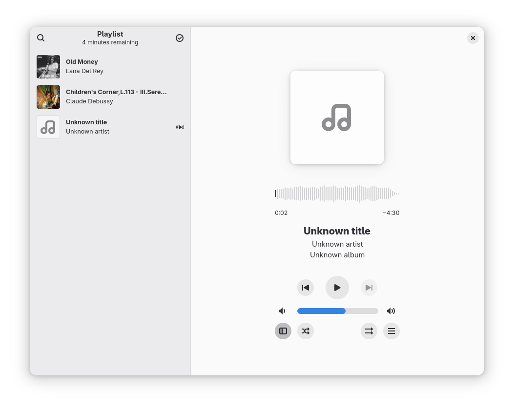
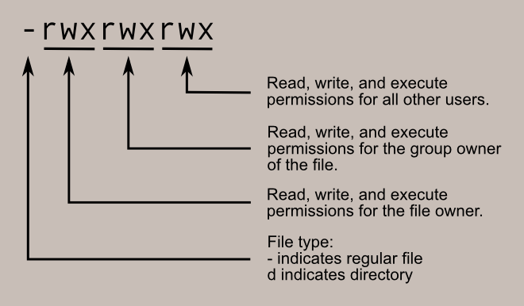

# 背景

## 系统

## Bash 版本

## FFmpeg 版本

# 前言

- 文章目的
  - 学习 bash

- 实现的功能

- 写作模式
  - 增加bash代码优化脚本
  - 列出新知识点，分述知识点

- 核心是 bash ，提前简述用到的 ffmpeg 3个命令：1）附着封面；2）写入元数据；3）提取音频流

- 资料参考
  - 语言大模型（deepseek、chatgpt）
  - [GNU Bash manual](https://www.gnu.org/software/bash/manual/bash.html)
  - [The Shell Scripting Tutorial](https://www.shellscript.sh) 
  - [ffmpeg Documentation](https://www.ffmpeg.org/ffmpeg.html) 

# 概念与术语

## FFmpeg

## Bash

## 音频

音频=音频流+封面+元数据

## 元数据
ps：歌词也是元数据

写明各元数据的标准格式

## 文件封装格式（容器）


## 音频编码标准


# 书写惯例

## 打包音频

## 曲目

打包后的音频

## 音频

打包前的未处理的曲目

# 音频编码标准与封装格式

现存许多音频的编码标准，其倾向性各有不同。亦即是音频其中一部分会被强化；另一部分会被弱化；一部分会被保留；一部分会被舍弃。从而对音频编码前后体积产生影响：未压缩的音频、无损压缩音频和有损压缩音频。音频编码决定了音频被如何组织，而决定如何存储的则是封装格式。与日常交流中提到的“音频格式”，如 `mp3`、`wav` 较为接近，说接近的原因是，可能更多时候说的“音频格式”指的是文件扩展名，如 `.mp3`、`.wav`。而文件扩展名确实一定程度上反映了音频的封装格式，如 `.wav` 文件确实是用 `wav` 封装格式，但也有另例，如 `.m4a` 文件（不存在一种叫 `m4a` 的音频封装格式），实际是使用 `aac` 或 `alac`。下面将以是否压缩、编码标准、封装格式及其扩展名进行分类与简述。


## 未压缩音频

**编码标准**  
  
  - **PCM (Pulse Code Modulation)**  
  - 原始数字音频，无压缩，音质无损。  

**封装格式与扩展名**  

- **WAV** (Waveform Audio File Format)  
  - 扩展名：`.wav`  
  - 特点：Windows 标准，封装PCM或压缩音频。  
- **AIFF** (Audio Interchange File Format)  
  - 扩展名：`.aiff` 或 `.aif`  
  - 特点：苹果开发，类似WAV，支持元数据。  


## 无损压缩音频

**编码标准**  
- **FLAC** (Free Lossless Audio Codec)  
  - 扩展名：`.flac`  
  - 特点：开源无损压缩，独立封装，无额外容器。  
- **ALAC** (Apple Lossless Audio Codec)  
  - 扩展名：`.m4a` 或 `.alac`  
  - 封装：MP4容器（苹果生态专用）。  
- **APE** (Monkey's Audio)  
  - 扩展名：`.ape`  
  - 特点：高压缩率，兼容性较差。  

## 有损压缩音频

**编码标准**  
- **AAC** (Advanced Audio Coding)  
  - 扩展名：  
    - 裸流：`.aac`（少见）  
    - 封装：`.m4a`（标准）、`.mp4`（视频容器也可含AAC音频）。  
  - 特点：苹果/流媒体常用，音质优于MP3。  
- **MP3** (MPEG-1 Audio Layer III)  
  - 扩展名：`.mp3`  
  - 封装：独立格式，无额外容器。  
- **OGG Vorbis**  
  - 扩展名：`.ogg` 或 `.oga`  
  - 封装：OGG容器（开源，多用于游戏/网页）。  
- **Opus**  
  - 扩展名：`.opus`  
  - 封装：通常独立，也可嵌入OGG或WebM。  
- **WMA** (Windows Media Audio)  
  - 扩展名：`.wma`  
  - 封装：ASF容器（微软私有格式）。  

## 特殊用途音频

**编码标准**  
- **MIDI** (Musical Instrument Digital Interface)  
  - 扩展名：`.mid` 或 `.midi`  
  - 特点：记录音符指令，非实际音频波形。  
- **DSD** (Direct Stream Digital)  
  - 扩展名：`.dsf` 或 `.dff`  
  - 封装：专用格式，用于SACD。  


## 封装格式与编码标准的关系
| **编码标准** | **常见封装格式**       | **典型扩展名**       |
|--------------|------------------------|----------------------|
| PCM          | WAV, AIFF              | `.wav`, `.aiff`      |
| FLAC         | 独立封装               | `.flac`              |
| ALAC         | MP4                    | `.m4a`               |
| AAC          | MP4                    | `.m4a`, `.mp4`       |
| MP3          | 独立封装               | `.mp3`               |
| OGG Vorbis   | OGG                    | `.ogg`, `.oga`       |
| Opus         | OGG, WebM              | `.opus`, `.webm`     |
| WMA          | ASF                    | `.wma`               |


我选定的音频格式

略

# 封面

封面格式。选jpg

参考（后续添加到附录-参考）：

- [Image file type and format guide](https://developer.mozilla.org/en-US/docs/Web/Media/Guides/Formats/Image_types)

# 元数据

这是我选择的其中一部分元数据，实际元数据不止这些

|     | **字段名**            | **推荐格式**                      | **示例**                              | **说明**   |
| --- | ------------------ | ----------------------------- | ----------------------------------- | -------- |
| 1   | **`title`**        | 自由文本                          | `title="Song Title"`                | 曲目标题     |
| 2   | **`artist`**       | 自由文本                          | `artist="Artist Name"`              | 艺术家/歌手   |
| 3   | **`album`**        | 自由文本                          | `album="Album Name"`                | 专辑名称     |
| 4   | **`album artist`** | 自由文本                          | `album_artist="Album Artist Name"`  | 专辑艺术家/歌手 |
| 5   | **`date`**         | `YYYY`、`YYYY-MM-DD`（ISO 8601） | `date="2024"` 或 `date="2024-05-20"` | 发行日期     |
| 6   | **`track`**        | `X/Y`（当前曲目/总曲目）               | `track="3/12"`                      | 音轨编号     |
| 7   | **`genre`**        | 自由文本或 ID3v1 流派代码              | `genre="Rock"` 或 `genre="17"`（电子乐）  | 音乐流派     |
| 8   | **`composer`**     | 自由文本                          | `composer="Composer Name"`          | 作曲者      |

我认为决定那些是可选的，那些是必选的

略

我选用的元数据格式

略


--- start ---

`ffprobe` 或许可以验证 metadata，但我暂未研究

--- end ---

# FFmpeg 命令打包音频

```shell
ffmpeg -i ./input.mp3 -i ./cover.jpg" -c copy -map 0 -map 1 -metadata:s:v title="Album cover" -metadata:s:v comment="Cover (front)" ./output_with_cover.mp3
```

```shell
ffmpeg -i "./output_with_cover.mp3" \
  -metadata title="Last Summer Whisper" \
  -metadata artist="Anri" \
  -metadata album="Heaven Beach" \
  -metadata track="8/8" \
  -metadata album_artist="Anri" \
  -metadata genre="City Pop,J-Pop,AOR,Funk" \
  -metadata date="1982/07/21" \
  -metadata composer="Anri,Kunio Tago" \
  -c copy "./output_with_cover_and_metadata.mp3"
```

```shell
ffmpeg -i "./input.mp3" -i "./cover.jpg" -c copy -map 0 -map 1 \
  -metadata title="Last Summer Whisper" \
  -metadata artist="Anri" \
  -metadata album="Heaven Beach" \
  -metadata track="8/8" \
  -metadata album_artist="Anri" \
  -metadata genre="City Pop,J-Pop,AOR,Funk" \
  -metadata date="1982/07/21" \
  -metadata composer="Anri,Kunio Tago" \
  "./output.mp3"
```

# 使用脚本（`muselfic.sh`）

# 复用脚本

元数据的处理方案：

- 元数据文件，以文件保存元数据，将文件路径用位置参数传入脚本
- stdin（read命令读取的就是stdin），执行脚本后，逐一提示，并输入元数据

# 结构化存储

结构化存储适合批量处理

# Base64 目录名


# 批量打包


# 优化打包体验

- select 菜单选择 album 后打包
- 先选择 album，再选 album 下的 audio 后打包

# 脚本创建 metadata


# 整合规则（rule）

# 优化查看体验

list 规则

# 提取音频


# 语义化规则与可选项


------------------------------------

# 获取参数

获取命令行的参数，型如：

```shell
./my_script avg1 avg2
```

一级目录下的主脚本（`main.sh`），需要给它提供同级后代目录下存储数据的目录路径，让 `main.sh` 处理后代目录的数据。

```shell
├── data
│   └── 0x001 # 主角本同级后代目录下存储数据的目录路径
│       ├── audio.mp3
│       ├── cover.jpg
│       └── metadata.sh
├── main.sh # 主脚本
├── metadata
│   └── ...
├── README.md
├── script
├── src
└── temp
```

预期达到的效果：

```shell
./main.sh --data-dir <data dir>
```

- 解析键名，data-dir；
- 解析与键名对应的键值。

对于 `main.sh` 来说，外部参数 `--data-dir`（键名）或着说 `data-dir` 是保留字。后续可能有更多的保留字。因此，有理由存在一个保留字合集，以保留字合集检验“键-值”的合法性。

*QA：shell script 是否支持动态声明变量？*

- `$@`：存储着 `$1 .. whatever` 的参数；
- `$#`：储存着参数个数，见例子01；
- `shift`：`shift` 命令直接操作参数栈，每执行一次 `shift` 命令，参数栈出栈一个参数（被出栈的参数不做存储，类似抛弃），见例子01；

例子01：利用 `$#` + `shift` 获取参数：
```shell
#!/bin/sh
while [ "$#" -gt "0" ]
do
  echo "\$1 is $1"
  shift
done
```

# muselfic

muselfic，利用 ffmpeg 半自动化打包音频的脚本。目前，muselfic 以专辑为单位进行打包。目前功能包括：
- 打包音频；
- 新增专辑元数据；
- 新增音频元数据；
- 提取音频。

## 术语

**专辑**

音频集合

**音频**

此处音频泛指：纯净音频和产物音频，两者详细见下。

**纯净音频**

只有音频流，可以播放。但没有该音频相关的信息（如，封面、曲名、作者等）

**专辑元数据**

包含以下信息：

- 专辑名（album）
- 专辑作者（album artist）
- 专辑曲目总数（total tracks）
- 专辑风格（genre）
- 专辑发行日期（release date）
- 专辑作者（composer）

**音频元数据**

包含以下信息：
- 曲名（title）
- 作者（artist）
- 曲序号（track number）

**专辑封面**

专辑封面，单独文件存放。应用于专辑下所有音频。

音频相关原始数据以下面的结构存放在 `data/` 目录下：

**专辑目录**

`data/` 目录下，每个目录都存储着一个专辑的数据。`data/` 皆由目录组成，且每个目录都对应一个专辑。

**音频目录**

专辑目录的子层级由目录与文件构成，文件为专辑相关数据，而目录则皆为音频目录。每个音频目录存都储着某一音频相关的数据。

**产物音频**

产物音频 = 纯净音频+专辑元数据+音频元数据+专辑封面

产物音频是经上面等式组合后得到的产物。

注意：上面等式中的“纯净音频”和“音频元数据”都是指特定某一个音频相关的。

**资源目录**

`data/` 目录，用于存储未打包音频资源。一级目录以专辑为单位组织，一级目录每个目录都是一个专辑的资源。
专辑目录内由三类资源构成，分别是：a）专辑封面；b）专辑元数据；c）音频目录。a、b 皆为文件。其余同级目录是相互独立的组成专辑的音频目录。
音频目录内，分别是：a）音频元数据；b）纯净音频。

```shell
data/
├── 48bfe073-3518-405a-a5f2-dcb23d9d8871 # 专辑 01
│   ├── 0600cab9-1469-4a58-89fe-fc00458efb57 # 专辑 01 - 音频 01
│   │   ├── audio.mp3 # 专辑 01 - 音频 01（纯净）
│   │   └── metadata.sh #  专辑 01 - 音频 01 - 元数据
│   ├── cover.jpg # 专辑 01 - 封面
│   ├── d527adcf-6fa6-438c-ae57-b6e279e9c422 # 专辑 01 - 音频 02
│   │   ├── audio.mp3
│   │   └── metadata.sh
│   ├── fb554f2f-0e22-4401-a12e-b928d7c1c4e2 # 专辑 01 - 音频 03
│   │   ├── audio.mp3
│   │   └── metadata.sh
│   └── metadata.sh # 专辑 01 - 元数据
└── c7f379bc-b57a-4e9f-8d1d-bfab64021faf
    ├── 820cb4c1-c316-4b1d-be9d-1d8269a2beab
    │   ├── audio.mp3
    │   └── metadata.sh
    ├── cover.jpg
    └── metadata.sh
```

## 功能

### 新建专辑元数据

专辑元数据模板（`data/<album dir>/metadata.sh`）：
```shell
#[required] album name
METADATA_ALBUM=""

#[required] number
METADATA_TOTAL_TRACKS=""

#[required]
METADATA_ALBUM_ARTIST=""

#[required] genre[,genre0][,genre1][,...]
METADATA_GENRE=""

#[required] yyyy/mm/dd
METADATA_RELEASE_DATA=""

#[required] composer[,composer0][,composer1][,...]
METADATA_COMPOSER=""
```
- `METADATA_ALBUM`：专辑名（album）
- `METADATA_TOTAL_TRACKS`：专辑作者（album artist）
- `METADATA_ALBUM_ARTIST`：专辑曲目总数（total tracks）
- `METADATA_GENRE`：专辑风格（genre）
- `METADATA_RELEASE_DATA`：专辑发行日期（release date）
- `METADATA_COMPOSER`：专辑作者（composer）

使用 uuid 作为专辑的目录名。
```
ALBUM_NAME=`uuidgen -x`"
```
在 `data/` 目录下新建 `data/$ALBUM_NAME` 目录。在专辑目录下，新建 `metadata.sh` 文件。使用 `read` 命令，以用户交互的方式，逐个输入专辑信息：

```shell
read -p "Album Name: " nam_album_name

read -p "Total Tracks: " nam_total_tracks

read -p "Album Artist: " nam_album_artist

read -p "Genre(<genre>[,genre0][,genre1][,...]): " nam_genre

read -p "Release Date(<yyyy | yyyy/mm/dd>): " nam_release_date

read -p "Composer(<composer>[,composer0][,composer1][,...]): " nam_composer
```

使用 `echo` 与重定向输出符号（`>>`）将内容写入文件（`$ALBUM_METADATA_PAHT`）

- `echo`：将内容输出到标准输出（stdout）；
- `>>`：重定向内容输出到指定位置，如文件内。`>>` 的特点是以*追加*的方式重定向输出。

```shell  
echo "#[required] album name" >> "$ALBUM_METADATA_PAHT"

echo "METADATA_ALBUM=\"$nam_album_name\"" >> "$ALBUM_METADATA_PAHT"

echo "#[required] number" >> "$ALBUM_METADATA_PAHT"

echo "METADATA_TOTAL_TRACKS=\"$nam_total_tracks\"" >> "$ALBUM_METADATA_PAHT"

echo "#[required]" >> "$ALBUM_METADATA_PAHT"

echo "METADATA_ALBUM_ARTIST=\"$nam_album_artist\"" >> "$ALBUM_METADATA_PAHT"

echo "#[required] genre[,genre0][,genre1][,...]" >> "$ALBUM_METADATA_PAHT"

echo "METADATA_GENRE=\"$nam_genre\"" >> "$ALBUM_METADATA_PAHT"

echo "#[required] yyyy/mm/dd" >> "$ALBUM_METADATA_PAHT"

echo "METADATA_RELEASE_DATA=\"$nam_release_date\"" >> "$ALBUM_METADATA_PAHT"

echo "#[required] composer[,composer0][,composer1][,...]" >> "$ALBUM_METADATA_PAHT"

echo "METADATA_COMPOSER=\"$nam_composer\"" >> "$ALBUM_METADATA_PAHT"
```

#### 待优化点

- [ ] 专辑信息中分可选与必选属性，必选属性使用`while`循环确保。

### 新建音频元数据

音频元数据模板（`data/<album dir>/<audio dir>/metadata.sh`）：
```shell
#[required] song name
METADATA_TITLE=""

#[required]
METADATA_ARTIST=""

#[required] number
METADATA_TRACK_NUMBER=""
```
- `METADATA_TITLE`：曲名（title）
- `METADATA_ARTIST`：作者（artist）
- `METADATA_TRACK_NUMBER`：曲序号（track number）

与新建专辑元数据类似，新建音频元数据同样，
- 使用 uuid 作为音频目录名；
- 使用 `read`，交互式获取音频元数据信息；
- 使用 `echo` 将得到的元数据写入 `metadata.sh`。

另外，还需指定音频目录新增到那一个专辑目录（制定专辑目录路径）。初期计划使用 `select` 命令提供交互式选项，但由于 select 命令的 options 选项无法动态生成（存疑）。后使用兼容方案：专辑目录路径数组 + `read` 读取用户输入的数组索引：

```shell
select_album() {
	SELECTED_ALBUM_PATH=""
	local idx=0
	local arr=();
	
	for dir in data/*
	do
		local album_metadata_path="$dir/metadata.sh"
		. "$album_metadata_path"
		if [ -n "$METADATA_ALBUM" ]; then
		arr[$idx]=$dir
		echo "$idx - $METADATA_ALBUM: $dir"
		((idx++))
		fi
	done
	read -p "Selected Index: " selected_idx
	SELECTED_ALBUM_PATH="${arr[$selected_idx]}"
}
```

- 空数组定义：使用空括号，`arr=()`；
- 数组元素可使用动态索引（变量）读取；
- 双括号执行自增逻辑：`((idx++))`；
- 非全局变量定义：使用 `local` 关键字；
- 正则匹配目录：`for in data/*`（可与变量搭配，如 `$album_dirpath/*/`）
- 函数执行结果返回：通过全局变量（虽然 shell 中有 return 关键字，但它是用于返回状态码）。另外还可使用 `echo`（见下例子）。

使用 `echo` 返回函数执行结果：
```shell
#!/bin/bash

# 定义一个函数，返回一个字符串
get_greeting() {
	local name=$1
	echo "Hello, $name! How are you today?"
}

# 调用函数并捕获返回的字符串
greeting=$(get_greeting "Alice")
echo $greeting
```

### 打包音频

以专辑为单位，进行一次音频打包。使用 `select_album` （自己实现的工具函数，见前文），让用户选择目标专辑，从而得到目录路径（`DATA_DIR`）。为防止在打包过程中污染原专辑目录，将整个专辑目录复制至临时目录（`temp/`）。

复制专辑目录至临时目录：

```shell
echo -e "\r\n[1/$PROCESS_STEP] Copy audio data dir to temp dir."

if [ -d "$TEMP_DIR" ]; then
	rm -r "$TEMP_DIR"
fi

cp -r "$DATA_DIR" "$TEMP_DIR"
```


专辑目录与临时目录对比：
```shell
# 专辑目录
data/233b538c-3cd1-4ff9-90fa-5f538daa1fe8
├── 3e2e54fe-6f94-40d1-bf16-e65d6bee1048
│   ├── audio.mp3
│   └── metadata.sh
├── cover.jpg
└── metadata.sh

# 临时目录
temp
├── 3e2e54fe-6f94-40d1-bf16-e65d6bee1048
│   ├── audio.mp3
│   └── metadata.sh
├── cover.jpg
└── metadata.sh
```

后续的打包作业在 `temp` 目录下进行。使用 `for-in` 与 正则匹配（`temp/*/`）遍历专辑下的音频目录：

```shell
. "$TEMP_DIR/metadata.sh"

for album_dir in $TEMP_DIR/*/
do
	dist_a_audio $album_dir
done
```
- `for-in`：遍历的是一个及以上元素（元素间以空格分隔）的列表（注意不是数组），如：`"ele_1" "ele_2" ... "ele_n"`
- `$TEMP_DIR/*/`：通配符匹配得到的也是一个字符列表

**附着封面（官方用语为，attached pictures）**

```shell
audio_dir_path=$1

input_audio_path="${audio_dir_path}audio.mp3"
output_audio_path="${audio_dir_path}audio_with_cover.mp3"

ffmpeg -i "$input_audio_path" -i "$TEMP_DIR/cover.jpg" -c copy -map 0 -map 1 -metadata:s:v title="Album cover" -metadata:s:v comment="Cover (front)" "$output_audio_path"
```

- `-i`：指定输出的待处理文件（一个及以上）；
- `-c copy`：`-c`，指定用于处理文件的编码器；`copy`，`ffmpeg` 的众多编码器之一，它仅仅用于复制，不做编码与解码；
- `-map`：指定输入文件（对于 `ffmpeg` 而言，文件是由一个及以上的流（stream）组成）的那些流需要被处理并映射输出文件；`-map` 更加常见的值类似 `-map 0:1`，`0`：表示输入文件的索引，索引与 `-i` 的顺序有关，如上面，索引 0 指代 `"$input_audio_path"` 而索引 1 指代 `"$TEMP_DIR/cover.jpg"`；`:1`：表示流的索引（`stream_idx`），因此 `-map 0:1` 表示第一个输入文化的第二个流将被处理并映射到输出文件。上面的是 `-map 0` 是简化写法，表示第一个输入文件的所有流都将被处理并映射到输出文件；
- `-metadata:s:v`：（这是可选设置，此处场景下，不设置元素局并不影响封面的附着）`-metadata`，如其名，是用于编辑某一流（stream）的元数据；而 `:s:v` 则是一个指定器（`specifier`，上文 `-map 0:1` 的 `0:1` 也是个 `specifier`。但语法略有不同），用于定位具体编辑哪个流。1）`:s` → 表示操作的是**流**（stream）而非全局元数据；2）`:v` → 限定为**视频流**（video stream），对于 `ffmpeg` 而言，图片归属于视频流类别。

关于 `ffmpeg` 的 `streamcopy` 处理例子：
```pre
┌──────────┬─────────────────────┐
│ demuxer  │                     │ unused
╞══════════╡ elementary stream 0 ├────────╳
│          │                     │
│INPUT.mkv ├─────────────────────┤          ┌──────────────────────┬───────────┐
│          │                     │ packets  │                      │   muxer   │
│          │ elementary stream 1 ├─────────►│  elementary stream 0 ╞═══════════╡
│          │                     │          │                      │OUTPUT.mp4 │
│          ├─────────────────────┤          └──────────────────────┴───────────┘
│          │                     │ unused
│          │ elementary stream 2 ├────────╳
│          │                     │
└──────────┴─────────────────────┘
```

**写入元数据**

```shell
ffmpeg -i "$input_audio_path" \
	-metadata title="$METADATA_TITLE" \
	-metadata artist="$METADATA_ARTIST" \
	-metadata album="$METADATA_ALBUM" \
	-metadata track="$METADATA_TRACK_NUMBER/$METADATA_TOTAL_TRACKS" \
	-metadata album_artist="$METADATA_ALBUM_ARTIST" \
	-metadata genre="$METADATA_GENRE" \
	-metadata date="$METADATA_RELEASE_DATA" \
	-metadata composer="$METADATA_COMPOSER" \
	-c copy "$output_audio_path"
```

- `-metadata`：与上文稍有不同，没有使用 `:s:v` 类似的指定器。则不会针对某一个流写入元数据，而是应用到全局！


- 参考：[3.1 Streamcopy - 复制编码器（streamcopy）的介绍](https://www.ffmpeg.org/ffmpeg.html#toc-Streamcopy)
- 参考：[5.11 Advanced options > `-map` - `-map` 的使用以及详细参数值使用说明](https://www.ffmpeg.org/ffmpeg.html#toc-Advanced-options)
- 参考：[5.1 Stream specifiers - 选择流的各种方式说明](https://www.ffmpeg.org/ffmpeg.html#toc-Stream-specifiers-1)

## 计划

```shell
./muselfic.sh dist[ all][ --dir <output dir path>]
./muselfic.sh dist album[ album path][ --dir <output dir path>]
./muselfic.sh dist audio[ audio path][ --dir <output dir path>]

./muselfic.sh dist album
./muselfic.sh dist album album path
./muselfic.sh dist album --dir
./muselfic.sh dist album --dir <output dir path>
./muselfic.sh dist album album path --dir
./muselfic.sh dist album album path --dir <output dir path>
```

```shell
./muselfic.sh metadata album[ --template]
./muselfic.sh metadata audio[ --template]
```

```shell
./muselfic.sh extract <audio path>[ --dir <output dirpath>]
```

```shell
./muselfic.sh list [all] <path | metadata>
./muselfic.sh list <path | metadata> album
./muselfic.sh list <path | metadata> album
```

# 待深究

## 函数参数是值传递还是引用传递

```shell
select_album
local selected_album_dirpath=RET_SELECTED_ALBUM_PATH
cp_album2temp_process_distpath $selected_album_dirpath
```

## 默认值

**逻辑或式替代**

```shell
# `${parameter:-word}`

echo "avg1: ${avg1:-none}"
```
输出 `avg1: none`，但不会将 “none” 赋值给变量 `avg1`

**逻辑或式赋值**

```shell
# `${parameter:=word}`

echo "avg1: ${avg1:=none}"
echo "avg1: $avg1"
```

输出：

```shell
avg1: none
avg1: none
```
不但输出 “avg1: none”，还会将 “none” 赋值给变量 `avg1`


## 数组

增加元素

```shell
arr=()
arr+=("new")
new_val="new"
arr+=("$new_val")
```

数组赋值至新变量

```
arr1=("1", "2")

# wrong
arr2=$arr1
```

# 前言

ffmpeg 合并封面、元数据、音频流等多个数据为一个音频容器


# 大纲

```
# 术语
 标准化文章中有歧义的用词

# ffmpeg 合并音频与封面

# ffmpeg 写入元数据

```

# 术语

## 音频流

没有封面、元数据（包含但不限于歌曲标题、艺术家等）的，仅仅只有音频的音频文件，见下图：



## 音频封面


音频封面通常有几种不同的版本和尺寸，以适应不同的音频播放器和平台的需求。

**封面尺寸：**

- **最小尺寸**：一般来说，音频封面的最小尺寸应该为 300x300 像素；
- **推荐尺寸**：推荐的尺寸通常为 600x600 像素或更大。这样可以确保在大多数音频播放器和音乐平台上显示清晰的封面图片；
- **高清尺寸**：有些平台可能支持更高分辨率的封面图片，因此提供 1200x1200 像素或更大的封面图片也是一个不错的选择。

理想情况下，应当给音频流附着以上列出的所有尺寸的封面。至少附着一个尺寸为 600x600的。

**格式要求**：常见的封面图片格式包括 JPEG、PNG 等。大多数音频播放器和音乐平台支持这些常见的图片格式。

## 元数据

- `METADATA_ALBUM`：专辑名（album）
- `METADATA_TOTAL_TRACKS`：专辑作者（album artist）
- `METADATA_ALBUM_ARTIST`：专辑曲目总数（total tracks）
- `METADATA_GENRE`：专辑风格（genre）
- `METADATA_RELEASE_DATA`：专辑发行日期（release date）
- `METADATA_COMPOSER`：专辑作者（composer）
- `METADATA_TITLE`：曲名（title）
- `METADATA_ARTIST`：作者（artist）
- `METADATA_TRACK_NUMBER`：曲序号（track number）

## 音频容器

合并了封面、元数据、音频流的音频文件

## FFmpeg

[FFmpeg](https://www.ffmpeg.org/) 是一个开源的跨平台多媒体处理工具，它可以用于处理音频、视频和多媒体流。


# 附着封面


```shell
ffmpeg -i ./input.mp3 -i ./cover.jpg" -c copy -map 0 -map 1 -metadata:s:v title="Album cover" -metadata:s:v comment="Cover (front)" ./output_with_cover.mp3
```

注意：`-metadata:s:v title="Album cover" -metadata:s:v comment="Cover (front)"` 是可选的。

在 Terminal 中执行后，得到的音频效果见下：


- `-i`：指定输出的待处理文件（一个及以上）；

- `-c copy`：`-c`，指定用于处理文件的编码器；`copy`，`ffmpeg` 的众多编码器之一，它仅仅用于复制，不做编码与解码；

- `-map`：指定输入文件（对于 `ffmpeg` 而言，文件是由一个及以上的流（stream）组成）的那些流需要被处理并映射输出文件；`-map` 更加常见的值类似 `-map 0:1`，`0`：表示输入文件的索引，索引与 `-i` 的顺序有关，如上面，索引 0 指代 `./input.mp3` 而索引 1 指代 `./cover.jpg`；`:1`：表示流的索引（`stream_idx`），因此 `-map 0:1` 表示第一个输入文化的第二个流将被处理并映射到输出文件。上面的是 `-map 0` 是简化写法，表示第一个输入文件的所有流都将被处理并映射到输出文件；

- `-metadata:s:v`：（这是可选设置，此处场景下，不设置元素局并不影响封面的附着）`-metadata`，如其名，是用于编辑某一流（stream）的元数据；而 `:s:v` 则是一个指定器（`specifier`，上文 `-map 0:1` 的 `0:1` 也是个 `specifier`。但语法略有不同），用于定位具体编辑哪个流。1）`:s` → 表示操作的是**流**（stream）而非全局元数据；2）`:v` → 限定为**视频流**（video stream），对于 `ffmpeg` 而言，图片归属于视频流类别。

# 写入元数据

```shell
ffmpeg -i "./output_with_cover.mp3" \
	-metadata title="Last Summer Whisper" \
	-metadata artist="Anri" \
	-metadata album="Heaven Beach" \
	-metadata track="8/8" \
	-metadata album_artist="Anri" \
	-metadata genre="City Pop,J-Pop,AOR,Funk" \
	-metadata date="1982/07/21" \
	-metadata composer="Anri,Kunio Tago" \
	-c copy "./output_with_cover_and_metadata.mp3"
```

在 Terminal 中执行后，得到的音频效果见下：


# 脚本化

- 合并“附着封面”与“写入元数据”为一个命令；
- 使用脚本（`muselfic.sh`）执行。

**创建脚本文件（`./muselfic.sh`），并赋予执行权限：**

```shell
# 创建 `./muselfic.sh` 文件，并向文件写入 `#!/bin/sh`；
echo "#\!/bin/sh" > ./muselfic.sh

# 给予 `./muselfic.sh` 执行权限
chmod 755 ./muselfic.sh
```

*注意：`>` 与 `chmod 755` 的作用见本节附录。*


**合并“附着封面”与“写入元数据”为一个命令，添加到 `./muselfic.sh` 内：**

```shell
#!/bin/sh

ffmpeg -i "./input.mp3" -i "./cover.jpg" -c copy -map 0 -map 1 \
	-metadata title="Last Summer Whisper" \
	-metadata artist="Anri" \
	-metadata album="Heaven Beach" \
	-metadata track="8/8" \
	-metadata album_artist="Anri" \
	-metadata genre="City Pop,J-Pop,AOR,Funk" \
	-metadata date="1982/07/21" \
	-metadata composer="Anri,Kunio Tago" \
	"./output.mp3"
```

**执行 `./muselfic.sh` 文件：**

```shell
./muselfic.sh
```

## 附录

### `>` 的作用

> [!NOTE]
> #### [3.6.2 Redirecting Output](https://www.gnu.org/software/bash/manual/bash.html)
> 
> Redirection of output causes the file whose name results from the expansion of word to be opened for writing on file descriptor n, or the standard output (file descriptor 1) if n is not specified. If the file does not exist it is created; if it does exist it is truncated to zero size.
> 
> The general format for redirecting output is:
> 
> ```shell
> [n]>[|]word
> ```
> 
> If the redirection operator is ‘>’, and the `noclobber` option to the `set` builtin has been enabled, the redirection will fail if the file whose name results from the expansion of word exists and is a regular file. If the redirection operator is ‘>|’, or the redirection operator is ‘>’ and the `noclobber` option is not enabled, the redirection is attempted even if the file named by word exists.

### `chmod 755` 的作用

> [!NOTE]
> **Permissions**
> 
> It is easy to think of the permission settings as a series of bits (which is how the computer thinks about them). Here's how it works:
> 
> ```shell
> rwx rwx rwx = 111 111 111
> rw- rw- rw- = 110 110 110
> rwx --- --- = 111 000 000
> 
> and so on...
> 
> rwx = 111 in binary = 7
> rw- = 110 in binary = 6
> r-x = 101 in binary = 5
> r-- = 100 in binary = 4
> ```

见上引用，每个文件都有三个角色类别的权限归属。每个角色又分别可能具备“读”、“写”和“执行”的权限，按顺序简写为 `rwx`。三个角色类别“从左至右”分别是：文件的拥有者、文件所在组的拥有者和其他所有的用户。

755的含义是，文件的拥有者的权限（`rwx`）是 7；文件所在组的拥有者的权限（`rwx`）是 5；其他所有的用户的权限（`rwx`）是 5。755 是十进制数，转为二进制即有：

- 7：111，对应 `rwx` 即拥有“读”、“写”和“执行”所有权限；
- 5：101，对应 `rwx` 即仅有“写”和“执行”的权限；

因此赋予`755`权限的文件：

- **所有者**：可读、可写、可执行（`rwx`）
- **所属组**：可读、不可写、可执行（`r-x`）
- **其他用户**：可读、不可写、可执行（`r-x`）

# 复用

- 使用变量控制输入、输出；
- 配置文件（脚本文件，`metadata.sh`）储存 `metadata`。

```shell
./
├── metadata.sh
├── cover.jpg
└── input.mp3
```

*注意：抛开配置文件的可读性得优势，仅考虑易用、使用成本，以 shell 变量形式配置 metadata 是目前可知的最优解。*

## metadata 配置文件

配置文件的内容设计，以及 shell 变量的使用见下。shell 变量默认情况下，作用域为全局。

`metadata.sh`
```shell
#[required] album name
METADATA_ALBUM="Heaven Beach"

#[required] number
METADATA_TOTAL_TRACKS="8"

#[required]
METADATA_ALBUM_ARTIST="Anri"

#[required] genre[,genre0][,genre1][,...]
METADATA_GENRE="City Pop,J-Pop,AOR,Funk"

#[required] yyyy/mm/dd
METADATA_RELEASE_DATE="1982/07/21"

#[required] composer[,composer0][,composer1][,...]
METADATA_COMPOSER="Anri,Kunio Tago"

#[required] song name
METADATA_TITLE="Last Summer Whisper"

#[required]
METADATA_ARTIST="Anri"

#[required] number
METADATA_TRACK_NUMBER="8"
```

## 预期的脚本使用

```shell
./muselfic.sh <input audio> <cover> <metadata conf filepath> <output audio dirpath>

./muselfic.sh ./input.mp3 ./cover.jpg ./metadata.sh ./
```

## 读取变量

```shell
#!/bin/sh

+ input_audio_filepath=$1
+ input_cover_filepath=$2
+ input_metadata_filepath=$3
+ output_dirpath=$4

# ...
```

见上文描述的，预期的脚本使用方式：

```shell
./muselfic.sh ./input.mp3 ./cover.jpg ./metadata.sh ./
```

根据 shell 脚本使用手册提供的信息，可以推算他们分别有以下对应关系：

- `./muselfic`：`$0`
- `./input.mp3`：`$1` -> `input_audio_filepath`
- `./cover.jpg`：`$2` -> `input_cover_filepath`
- `./metadata.sh`：`$3` -> `input_metadata_filepath`
- `./`：`$4` -> `output_dirpath`

### 参考

> [!NOTE]
> **[Variables - Part 2](https://www.shellscript.sh/variables2.html)**
> 
> There are a set of variables which are set for you already, and most of these cannot have values assigned to them.  
> These can contain useful information, which can be used by the script to know about the environment in which it is running.
> 
> The first set of variables we will look at are `$0 .. $9` and `$#`.  
> The variable `$0` is the _basename_ of the program as it was called.  
> <mark>`$1 .. $9` are the first 9 additional parameters the script was called with.</mark>
> The variable `$@` is all parameters `$1 .. whatever`. The variable `$*`, is similar, but does not preserve any whitespace, and quoting, so "File with spaces" becomes "File" "with" "spaces". This is similar to the `echo` stuff we looked at in [A First Script](https://www.shellscript.sh/first.html). As a general rule, use `$@` and avoid `$*`.  
> `$#` is the number of parameters the script was called with.


## 引入 metadata .sh

```shell
#!/bin/sh

input_audio_filepath=$1
input_cover_filepath=$2
input_metadata_filepath=$3
output_dirpath=$4

+ . ./metadata.sh
# ...
```

引入 `.sh` 文件并在当前上下文生效的方式有两种：

- 点操作符（`.`）：引入文件到当前上下文（粗暴地说，全局作用域共享）并执行，点操作符来源于 Bourne Shell，是比 Bash 更早出现的也是其他 shell 的上游产物，因此它的兼容性会更强；

- `source`：作用同点操作符，来源于 Bash 是点操作符的别名。但 `source` 相较于 `.` 更新。`source` 是 [Bash Builtin Commands](https://www.gnu.org/software/bash/manual/bash.html#Bash-Builtin-Commands)。

### 参考

#### 点操作符-`.`

> [!NOTE]
> **[4.1 Bourne Shell Builtins](https://www.gnu.org/software/bash/manual/bash.html#Bourne-Shell-Builtins-1)**
> 
> The following shell builtin commands are inherited from the Bourne Shell. These commands are implemented as specified by the POSIX standard.
> 
> [`: (a colon)`](https://www.gnu.org/software/bash/manual/bash.html#index-_003a)
> 
> ```shell
> : [arguments]
> ```
> 
> Do nothing beyond expanding arguments and performing redirections. The return status is zero.
> 
> [`. (a period)`](https://www.gnu.org/software/bash/manual/bash.html#index-_002e)
> 
> ```shell
> . [-p path] filename [arguments]
> ```
> 
> The `.` command reads and execute commands from the filename argument in the current shell context.
> 
> If filename does not contain a slash, `.` searches for it. If -p is supplied, `.` treats path as a colon-separated list of directories in which to find filename; otherwise, `.` uses the directories in `PATH` to find filename. filename does not need to be executable. When Bash is not in POSIX mode, it searches the current directory if filename is not found in `$PATH`, but does not search the current directory if -p is supplied. If the `sourcepath` option (see [The Shopt Builtin](https://www.gnu.org/software/bash/manual/bash.html#The-Shopt-Builtin)) is turned off, `.` does not search `PATH`.
> 
> If any arguments are supplied, they become the positional parameters when filename is executed. Otherwise the positional parameters are unchanged.
> 
> If the -T option is enabled, `.` inherits any trap on `DEBUG`; if it is not, any `DEBUG` trap string is saved and restored around the call to `.`, and `.` unsets the `DEBUG` trap while it executes. If -T is not set, and the sourced file changes the `DEBUG` trap, the new value persists after `.` completes. The return status is the exit status of the last command executed from filename, or zero if no commands are executed. If filename is not found, or cannot be read, the return status is non-zero. This builtin is equivalent to `source`.

#### source 命令

> [!NOTE]
> **[source](https://www.gnu.org/software/bash/manual/bash.html#index-source)**
> 
> ```shell
> source [-p path] filename [arguments]
> ```
> 
> A synonym for `.` (see [Bourne Shell Builtins](https://www.gnu.org/software/bash/manual/bash.html#Bourne-Shell-Builtins)).


## 完整脚本

演示代码：[isaaxite/muselfic/tree/v0.0.1-demo](https://github.com/isaaxite/muselfic/tree/v0.0.1-demo)

```shell
#!/bin/sh

input_audio_filepath=$1
input_cover_filepath=$2
input_metadata_filepath=$3
output_dirpath=$4

. "$input_metadata_filepath"

ffmpeg -i "$input_audio_filepath" -i "$input_cover_filepath" -c copy -map 0 -map 1 \
	-metadata title="$METADATA_TITLE" \
	-metadata artist="$METADATA_ARTIST" \
	-metadata album="$METADATA_ALBUM" \
	-metadata track="$METADATA_TOTAL_TRACKS/$METADATA_TRACK_NUMBER" \
	-metadata album_artist="$METADATA_ALBUM_ARTIST" \
	-metadata genre="$METADATA_GENRE" \
	-metadata date="$METADATA_RELEASE_DATE" \
	-metadata composer="$METADATA_COMPOSER" \
	"${output_dirpath:0:-1}/output.mp3"
```

执行与关键结果

```shell
# isaac @ fedora in ~/Music/temp [14:17:50] C:234
$ ./muselfic.sh ./input.mp3 ./cover.jpg ./metadata.sh ./

# ...

Output #0, mp3, to './output.mp3':
  Metadata:
    TCOM            : Anri,Kunio Tago
    TIT2            : Last Summer Whisper
    TPE1            : Anri
    TALB            : Heaven Beach
    TRCK            : 8/8
    TPE2            : Anri
    TCON            : City Pop,J-Pop,AOR,Funk
    TDRC            : 1982/07/21
    TSSE            : Lavf61.7.100
  Stream #0:0: Audio: mp3, 48000 Hz, stereo, fltp, 255 kb/s
      Metadata:
        encoder         : Lavf
  Stream #0:1: Video: mjpeg (Baseline), yuvj444p(pc, bt470bg/unknown/unknown), 640x640 [SAR 37:37 DAR 1:1], q=2-31, 25 fps, 25 tbr, 25 tbn
Press [q] to stop, [?] for help
[out#0/mp3 @ 0x564c9ab97a00] video:125KiB audio:9307KiB subtitle:0KiB other streams:0KiB global headers:0KiB muxing overhead: 0.010581%
frame=    1 fps=0.0 q=-1.0 Lsize=    9433KiB time=00:00:00.04 bitrate=1931885.0kbits/s speed=0.923x
```


# 复用2

以专辑为单位组织音频。向上，多个专辑组成音乐数据库；向下，专辑为容器，多个音频组成专辑。

## 拆分元数据

### 专辑元数据

```shell
#[required] album name
METADATA_ALBUM=""

#[required] number
METADATA_TOTAL_TRACKS=""

#[required]
METADATA_ALBUM_ARTIST=""

#[required] genre[,genre0][,genre1][,...]
METADATA_GENRE=""

#[required] yyyy/mm/dd
METADATA_RELEASE_DATA=""

#[required] composer[,composer0][,composer1][,...]
METADATA_COMPOSER=""
```
- `METADATA_ALBUM`：专辑名（album）
- `METADATA_TOTAL_TRACKS`：专辑作者（album artist）
- `METADATA_ALBUM_ARTIST`：专辑曲目总数（total tracks）
- `METADATA_GENRE`：专辑风格（genre）
- `METADATA_RELEASE_DATA`：专辑发行日期（release date）
- `METADATA_COMPOSER`：专辑作者（composer）

### 音频元数据

```shell
#[required] song name
METADATA_TITLE=""

#[required]
METADATA_ARTIST=""

#[required] number
METADATA_TRACK_NUMBER=""
```
- `METADATA_TITLE`：曲名（title）
- `METADATA_ARTIST`：作者（artist）
- `METADATA_TRACK_NUMBER`：曲序号（track number）

**使用专辑封面**

使用专辑封面代替单曲封面，以降低封面写入与检索、存储。

**目录结构**

新建 `data/` 目录存放音频数据。

专辑作为二级目录，专辑名可能是不同国家的语言，比如中文，不是目录名的最优解。音频文件名也有同样的问题，可选用 uuid：

```shell
uuidgen -x
```

`uuidgen` 是一个 Linux 命令行工具，用于生成 UUID（Universally Unique Identifier，通用唯一识别码）。UUID是一个标准化的 128 位数字（32 个十六进制数字）序列，用于在计算机系统中唯一标识信息。

`uuidgen` 通常会随着主要的 Linux 发行版（如 Ubuntu、Debian、CentOS、Fedora 等）一起安装。这个工具的兼容性非常好，并且几乎在所有主流的 Linux 发行版中都可以找到。

则有以下，预期的目录结构：

```shell
data/
├── 48bfe073-3518-405a-a5f2-dcb23d9d8871 # 专辑 01
│   ├── 0600cab9-1469-4a58-89fe-fc00458efb57 # 专辑 01 - 音频 01
│   │   ├── audio.mp3 # 专辑 01 - 音频 01（纯净）
│   │   └── metadata.sh #  专辑 01 - 音频 01 - 元数据
│   ├── d527adcf-6fa6-438c-ae57-b6e279e9c422 # 专辑 01 - 音频 02
│   │   ├── audio.mp3
│   │   └── metadata.sh
│   ├── fb554f2f-0e22-4401-a12e-b928d7c1c4e2 # 专辑 01 - 音频 03
│   │   ├── audio.mp3
│   │   └── metadata.sh
│   ├── cover.jpg # 专辑 01 - 封面
│   └── metadata.sh # 专辑 01 - 元数据
└── c7f379bc-b57a-4e9f-8d1d-bfab64021faf # 专辑 02
    ├── 820cb4c1-c316-4b1d-be9d-1d8269a2beab
    │   ├── audio.mp3
    │   └── metadata.sh
    ├── cover.jpg
    └── metadata.sh
```

## 脚本化创建 metadata

既然选择使用 uuid 作为目录名，再手动创建专辑和音频目录以及相关资源文件就不太合适。

新建脚本文件（metadata.sh）以达目的：

```shell
echo "#\!/bin/sh">./metadata.sh
chmod 755 ./metadata.sh
```

预期 `metadata.sh` 的使用规则：

- Rule：`album | audio`
- Option：`<album dirpath>`

```shell
# 创建专辑目录、metadata 配置文件
./metadata.sh album

# 创建音频目录、metadata 配置文件
./metadata.sh audio <album dirpath>
```

前置逻辑：

```shell
#!/bin/sh

metadata_rule=$1
metadata_opt=$2
DATA_DIRPATH="./data"

new_album() {
  echo "new album"
}

new_audio() {
  local album_dirpath=$1

  if [ ! -d "$album_dirpath" ]; then
    echo "Dirpath Not Exist!"
    exit 1
  fi
  echo "new audio. Album dirpath=$album_dirpath"
}

if [ -z "$metadata_rule" ]; then
  echo "Miss rule between \"album\" or \"audio\""
  exit 1
fi

case $metadata_rule in
  ("album") new_album ;;
  ("audio") new_audio "$metadata_opt" ;;
  (*)
    echo "Wrong Rule!"
    exit 1
	;;
esac
```

- 使用 `unary expressions` （`-z`） + `if` 控制流过滤空 Rule；
- `Conditional Constructs`（`case` 控制流的 `(*)`）过滤非 `album | audio` 的 Rule；
- 匹配到 Rule =`audio` 时，使用 `unary expressions` （`-d`） + `if` 控制流过滤空、非法路径。
- shell 函数分离创建音频、专辑相关资源的逻辑。

上文前置逻辑中，使用到了 shell 函数。包含了函数的定义、实参的传递、函数内实参的获取（无需定义形参）。

函数被调用时，是在当前 shell 上下文中执行，不会新开进程执行。在 `new_audio` 函数的定义中，可见实参的获取同全局参数（调用脚本时的 shell arguments），它们的逻辑都是 [Positional Parameters](https://www.gnu.org/software/bash/manual/bash.html#Positional-Parameters-1)。因此，同样可以用数字变量（`$1...$n`）获取实参。并且这些数字变量不受全局数字变量污染。另外，全局数字变量在函数内部是不可见的。


### 参考

#### Unary Expressions（`-d` 和 `-z`）

> [!NOTE]
> **[6.4 Bash Conditional Expressions](https://www.gnu.org/software/bash/manual/bash.html#Bash-Conditional-Expressions-1)**
> 
> **-d file**
> 
>     True if file exists and is a directory.
> 
> **-z string**
> 
>     True if the length of string is zero.
> 


#### Conditional Constructs（`if` 和 `case`）

> [!NOTE]
> **[3.2.5.2 Conditional Constructs](https://www.gnu.org/software/bash/manual/bash.html#Conditional-Constructs-1)**
> 
> **[`if`](https://www.gnu.org/software/bash/manual/bash.html#index-if)**
> 
> The syntax of the `if` command is:
> 
> ```shell
> if test-commands; then
>   consequent-commands;
> [elif more-test-commands; then
>   more-consequents;]
> [else alternate-consequents;]
> fi
> ```
> 
> The test-commands list is executed, and if its return status is zero, the consequent-commands list is executed. If test-commands returns a non-zero status, each `elif` list is executed in turn, and if its exit status is zero, the corresponding more-consequents is executed and the command completes. If ‘else alternate-consequents’ is present, and the final command in the final `if` or `elif` clause has a non-zero exit status, then alternate-consequents is executed. The return status is the exit status of the last command executed, or zero if no condition tested true.
> 
> **[`case`](https://www.gnu.org/software/bash/manual/bash.html#index-case)**
> 
> The syntax of the `case` command is:
> 
> ```shell
> case word in
>     [ [(] pattern [| pattern]...) command-list ;;]...
> esac
> ```
> 
> `case` will selectively execute the command-list corresponding to the first pattern that matches word, proceeding from the first pattern to the last. The match is performed according to the rules described below in [Pattern Matching](https://www.gnu.org/software/bash/manual/bash.html#Pattern-Matching). If the `nocasematch` shell option (see the description of `shopt` in [The Shopt Builtin](https://www.gnu.org/software/bash/manual/bash.html#The-Shopt-Builtin)) is enabled, the match is performed without regard to the case of alphabetic characters. The ‘|’ is used to separate multiple patterns in a pattern list, and the ‘)’ operator terminates the pattern list. A pattern list and an associated command-list is known as a clause.
> 
> Each clause must be terminated with ‘;;’, ‘;&’, or ‘;;&’. The word undergoes tilde expansion, parameter expansion, command substitution, process substitution, arithmetic expansion, and quote removal (see [Shell Parameter Expansion](https://www.gnu.org/software/bash/manual/bash.html#Shell-Parameter-Expansion)) before the shell attempts to match the pattern. Each pattern undergoes tilde expansion, parameter expansion, command substitution, arithmetic expansion, process substitution, and quote removal.
> 
> There may be an arbitrary number of `case` clauses, each terminated by a ‘;;’, ‘;&’, or ‘;;&’. The first pattern that matches determines the command-list that is executed. It’s a common idiom to use ‘*’ as the final pattern to define the default case, since that pattern will always match.
> 
> Here is an example using `case` in a script that could be used to describe one interesting feature of an animal:
> 
> ```shell
> echo -n "Enter the name of an animal: "
> read ANIMAL
> echo -n "The $ANIMAL has "
> case $ANIMAL in
>   horse | dog | cat) echo -n "four";;
>   man | kangaroo ) echo -n "two";;
>   *) echo -n "an unknown number of";;
> esac
> echo " legs."
> ```
> 
> If the ‘;;’ operator is used, the `case` command completes after the first pattern match. Using ‘;&’ in place of ‘;;’ causes execution to continue with the command-list associated with the next clause, if any. Using ‘;;&’ in place of ‘;;’ causes the shell to test the patterns in the next clause, if any, and execute any associated command-list if the match succeeds, continuing the case statement execution as if the pattern list had not matched.
> 
> The return status is zero if no pattern matches. Otherwise, the return status is the exit status of the last command-list executed.

#### Shell Functions

> [!NOTE]
> **[3.3 Shell Functions](https://www.gnu.org/software/bash/manual/bash.html#Shell-Functions-1)**
> 
> Shell functions are a way to group commands for later execution using a single name for the group. They are executed just like a "regular" simple command. When the name of a shell function is used as a simple command name, the shell executes the list of commands associated with that function name. <mark>Shell functions are executed in the current shell context; there is no new process created to interpret them.</mark>
> 
> Functions are declared using this syntax:
> 
> ```shell
> fname () compound-command [ redirections ]
> ```
> 
> or
> 
> ```shell
> function fname [()] compound-command [ redirections ]
> ```
> ...
> 
> <mark>When a function is executed, the arguments to the function become the positional parameters during its execution (see [Positional Parameters](https://www.gnu.org/software/bash/manual/bash.html#Positional-Parameters)).</mark> The special parameter ‘#’ that expands to the number of positional parameters is updated to reflect the new set of positional parameters. Special parameter `0` is unchanged. The first element of the `FUNCNAME` variable is set to the name of the function while the function is executing.
> ...
> 


#### Bash Builtin Commands - local variable（`local`）

> [!NOTE]
> **[Bash Builtin Commands](https://www.gnu.org/software/bash/manual/bash.html#Bash-Builtin-Commands)**
> 
> **[`local`](https://www.gnu.org/software/bash/manual/bash.html#index-local)**
> 
> ```shell
> local [option] name[=value] ...
> ```
> 
> For each argument, create a local variable named name, and assign it value. The option can be any of the options accepted by `declare`. `local` can only be used within a function; it makes the variable name have a visible scope restricted to that function and its children. It is an error to use `local` when not within a function.
> 
> If name is ‘-’, it makes the set of shell options local to the function in which `local` is invoked: any shell options changed using the `set` builtin inside the function after the call to `local` are restored to their original values when the function returns. The restore is performed as if a series of `set` commands were executed to restore the values that were in place before the function.
> 
> With no operands, `local` writes a list of local variables to the standard output.
> 
> The return status is zero unless `local` is used outside a function, an invalid name is supplied, or name is a readonly variable.
> 

## 新建专辑

```shell
new_album() {
  local album_dirname=`uuidgen -x`
  local album_dirpath="$DATA_DIRPATH/$album_dirname"
  local album_metadata_filepath="$album_dirpath/metadata.sh"
  
  mkdir -p "$album_dirpath"

  echo "#[required] album name" > "$album_metadata_filepath"
  echo "METADATA_ALBUM=\"\"" >> "$album_metadata_filepath"

  echo "#[required] number" >> "$album_metadata_filepath"
  echo "METADATA_TOTAL_TRACKS=\"\"" >> "$album_metadata_filepath"

  echo "#[required]" >> "$album_metadata_filepath"
  echo "METADATA_ALBUM_ARTIST=\"\"" >> "$album_metadata_filepath"

  echo "#[required] genre[,genre0][,genre1][,...]" >> "$album_metadata_filepath"
  echo "METADATA_GENRE=\"\"" >> "$album_metadata_filepath"

  echo "#[required] yyyy/mm/dd" >> "$album_metadata_filepath"
  echo "METADATA_RELEASE_DATE=\"\"" >> "$album_metadata_filepath"

  echo "#[required] composer[,composer0][,composer1][,...]" >> "$album_metadata_filepath"
  echo "METADATA_COMPOSER=\"\"" >> "$album_metadata_filepath"
}
```

上面作业目的有 2：

- 创建专辑目录，以及该目录下的 `metadata.sh` 元数据配置文件；

- 写入专辑元数据模板至 `metadata.sh`。

在使用 `uuidgen -x` 获取专辑文件名时，它被一对反引号包裹。反引号（backquote）在 shell 中有特殊的含义，被它包裹的命令将在子 shell 环境执行（可见的不同是：在执行当前脚本中使用它，其中的命令打印的日志不会在 stdout 中输出）。常见用法见上面逻辑：执行命令，并将其输出赋值至变量。在[Bash 使用手册](https://www.gnu.org)中，列举了 2 种使用方式：

推荐：

```shell
$(command)

# e.g.
local album_dirname=$(uuidgen -x)
```

弃用（deprecated）：

*注意：手册中，此种方式被标为“弃用”。实际当前（`GNU bash, version 5.2.37(1)-release (x86_64-redhat-linux-gnu)`）依然可用。实际是指它标记为不推荐使用，并且在未来版本中可能会被移除或替代。虽然它仍然可以工作，但强烈建议不要继续使用，而是转向替代方案。*

```shell
`command`

# e.g.
local album_dirname=`uuidgen -x`
```

---

写入首行内容到 `metadata.sh` 时，使用了 `>` （重定向输出操作符号）。它的作用与 `>>` 基本功能相同，与之有别的是：a）使用 `>` 将内容写入到输出（比如文件）时，会先清空原内容再写入；b）受 `noclobber` 选项限制。详细见本节参考。

```shell
echo "#[required] album name" > "$album_metadata_filepath"
```

注意：`>` 和  `>>` 在文件不存在时会自动创建，但所在目录不存在时将报错，它们不会自动新建目录

### 参考

#### Command Substitution - backquote

> [!NOTE]
> 
> **[3.5.4 Command Substitution](https://www.gnu.org/software/bash/manual/bash.html#Command-Substitution-1)**
> 
> Command substitution allows the output of a command to replace the command itself. The standard form of command substitution occurs when a command is enclosed as follows:
> 
> ```shell
> $(command)
> ```
> 
> or (deprecated)
> 
> ```shell
> `command`.
> ```
> 
> Bash performs command substitution by executing command in a subshell environment and replacing the command substitution with the standard output of the command, with any trailing newlines deleted. Embedded newlines are not deleted, but they may be removed during word splitting. The command substitution `$(cat file)` can be replaced by the equivalent but faster `$(< file)`.
> 
> With the old-style backquote form of substitution, backslash retains its literal meaning except when followed by ‘$’, ‘`’, or ‘\’. The first backquote not preceded by a backslash terminates the command substitution. When using the `$(command)` form, all characters between the parentheses make up the command; none are treated specially.

#### Redirecting Output - `>`

> [!NOTE]
> **[3.6.2 Redirecting Output](https://www.gnu.org/software/bash/manual/bash.html#Redirecting-Output)**
> 
> Redirecting output opens the file whose name results from the expansion of word for writing on file descriptor n, or the standard output (file descriptor 1) if n is not specified. If the file does not exist it is created; if it does exist it is truncated to zero size.
> 
> The general format for redirecting output is:
> 
> ```shell
> [n]>[|]word
> ```
> 
> If the redirection operator is ‘>’, and the `noclobber` option to the `set` builtin command has been enabled, the redirection fails if the file whose name results from the expansion of word exists and is a regular file. If the redirection operator is ‘>|’, or the redirection operator is ‘>’ and the `noclobber` option to the `set` builtin is not enabled, Bash attempts the redirection even if the file named by word exists.


## 新建音频

```shell
new_audio() {
  local album_dirpath=$1

  if [ ! -d "$album_dirpath" ]; then
    echo "Dirpath Not Exist!"
    exit 1
  fi

  local audio_dirname=`uuidgen -x`
  local audio_dirpath="$album_dirpath/$audio_dirname"
  local audio_metadata_filepath="$audio_dirpath/metadata.sh"

  mkdir -p "$audio_dirpath"

  echo "#[required] song name" > "$audio_metadata_filepath"
  echo "METADATA_TITLE=\"\"" >> "$audio_metadata_filepath"

  echo "#[required]" >> "$audio_metadata_filepath"
  echo "METADATA_ARTIST=\"\"" >> "$audio_metadata_filepath"

  echo "#[required] number" >> "$audio_metadata_filepath"
  echo "METADATA_TRACK_NUMBER=\"\"" >> "$audio_metadata_filepath"
}
```

## 完整代码

```shell
.
├── data
│   └── adda6b0c-7605-4813-9065-a8e9ce91d366
│       ├── cover.jpg
│       ├── efde4d4f-0ac2-4b39-b054-cdc9dc799187
│       │   ├── input.mp3
│       │   └── metadata.sh
│       └── metadata.sh
├── metadata.sh
├── muselfic.sh
└── README.md

4 directories, 7 files
```

完整代码：[isaaxite/muselfic/tree/v0.0.2-demo](https://github.com/isaaxite/muselfic/tree/v0.0.2-demo)

## 更新 `muselfic.sh`

上文以固定结构的形式存储输入资源（专辑、音频的元数据、专辑封面和输入音频），原来的 `muselfic.sh` 脚本，其逻辑可以作进一步的优化。

### 打包音频


### 打包脚本


### 默认输出目录


# 优化-交互式写入 `metadata`

## 专辑元数据

使用 `uuid` 作为专辑和音频目录名引入一个问题：无法定位其位置（路径上的）以编辑其 `metadata` 数据。解决方案之一是：在新建 `metadata.sh` 时，一并写入元数据。

### 读取输入的元数据

新建函数，提示并读取输入的数据，逐一将其存入变量：

```shell
prompt2new_album() {
  read -p "Album: " metadata_album_name
  read -p "Total Tracks: " metadata_total_tracks
  read -p "Album Artist: " metadata_album_artist
  read -p "Genre: " metadata_genre
  read -p "Release Date: " metadata_release_date
  read -p "Composer: " metadata_composer
}
```

再对原有的 `new_album` 函数做写改动以接收读取到的数据：

```shell
new_album() {
+  local metadata_album_name=$1
+  local metadata_total_tracks=$2
+  local metadata_album_artist=$3
+  local metadata_genre=$4
+  local metadata_release_date=$5
+  local metadata_composer=$6
  local album_dirname=`uuidgen -x`
  local album_dirpath="$DATA_DIRPATH/$album_dirname"
  local album_metadata_filepath="$album_dirpath/metadata.sh"
  
  mkdir -p "$album_dirpath"

  echo "#[required] album name" > "$album_metadata_filepath"
-  echo "METADATA_ALBUM=\"\"" >> "$album_metadata_filepath"
+  echo "METADATA_ALBUM=\"$metadata_album_name\"" >> "$album_metadata_filepath"

  echo "#[required] number" >> "$album_metadata_filepath"
-  echo "METADATA_TOTAL_TRACKS=\"\"" >> "$album_metadata_filepath"
+  echo "METADATA_TOTAL_TRACKS=\"$metadata_total_tracks\"" >> "$album_metadata_filepath"

  echo "#[required]" >> "$album_metadata_filepath"
-  echo "METADATA_ALBUM_ARTIST=\"\"" >> "$album_metadata_filepath"
+  echo "METADATA_ALBUM_ARTIST=\"$metadata_album_artist\"" >> "$album_metadata_filepath"

  echo "#[required] genre[,genre0][,genre1][,...]" >> "$album_metadata_filepath"
-  echo "METADATA_GENRE=\"\"" >> "$album_metadata_filepath"
+  echo "METADATA_GENRE=\"$metadata_genre\"" >> "$album_metadata_filepath"

  echo "#[required] yyyy/mm/dd" >> "$album_metadata_filepath"
-  echo "METADATA_RELEASE_DATE=\"\"" >> "$album_metadata_filepath"
+  echo "METADATA_RELEASE_DATE=\"$metadata_release_date\"" >> "$album_metadata_filepath"

  echo "#[required] composer[,composer0][,composer1][,...]" >> "$album_metadata_filepath"
-  echo "METADATA_COMPOSER=\"\"" >> "$album_metadata_filepath"
+  echo "METADATA_COMPOSER=\"$metadata_composer\"" >> "$album_metadata_filepath"
}
```

最后则是在 `prompt2new_album` 中结合读取到的数据调用新的 `new_album`：

```shell
prompt2new_album() {
  read -p "Album: " metadata_album_name
  read -p "Total Tracks: " metadata_total_tracks
  read -p "Album Artist: " metadata_album_artist
  read -p "Genre: " metadata_genre
  read -p "Release Date: " metadata_release_date
  read -p "Composer: " metadata_composer
  
+  new_album "$metadata_album_name" \
+    "$metadata_total_tracks" \
+    "$metadata_album_artist" \
+    "$metadata_genre" \
+    "$metadata_release_date" \
+    "$metadata_composer"
}

# ...

case $metadata_rule in
-  ("album") new_album ;;
+  ("album") prompt2new_album ;;
  ("audio") new_audio "$metadata_opt" ;;
  (*)
    echo "Wrong Rule!"
    exit 1
esac
```
---

上文中，使用 Bash 的内建命令（[Bash Builtin Commands](https://www.gnu.org/software/bash/manual/bash.html#Bash-Builtin-Commands)），`read`。读取标准输入的内容，其中 `-p` 可选项则是可添加提示，且无需换行（默认是换行的，实践即可知），详细见参考章节。`-p` 只是 `read` 命令的众多可选项之一，详细见手册原文。

```shell
read -p "Album: " metadata_album_name
```

### 参考

#### Bash Builtin Commands - `read -p`

> [!NOTE]
> **[4.2 Bash Builtin Commands](https://www.gnu.org/software/bash/manual/bash.html#Bash-Builtin-Commands)**
> 
> This section describes builtin commands which are unique to or have been extended in Bash. Some of these commands are specified in the POSIX standard. 
> 
> **[`read`](https://www.gnu.org/software/bash/manual/bash.html#index-read)**
> 
> ```shell
> read [-Eers] [-a aname] [-d delim] [-i text] [-n nchars]
>     [-N nchars] [-p prompt] [-t timeout] [-u fd] [name ...]
> ```
> 
> Read one line from the standard input, or from the file descriptor fd supplied as an argument to the -u option, split it into words as described above in [Word Splitting](https://www.gnu.org/software/bash/manual/bash.html#Word-Splitting), and assign the first word to the first name, the second word to the second name, and so on. If there are more words than names, the remaining words and their intervening delimiters are assigned to the last name. If there are fewer words read from the input stream than names, the remaining names are assigned empty values. The characters in the value of the `IFS` variable are used to split the line into words using the same rules the shell uses for expansion (described above in [Word Splitting](https://www.gnu.org/software/bash/manual/bash.html#Word-Splitting)). The backslash character ‘\’ removes any special meaning for the next character read and is used for line continuation.
> 
> Options, if supplied, have the following meanings:
> 
> ...
> 
> **`-p prompt`**
> 
> <mark>Display prompt, without a trailing newline, before attempting to read any input, but only if input is coming from a terminal.</mark>
> 
> ...


## 音频元数据

音频目录及其元数据文件的新建，需要依赖所属专辑路径。专辑目录名（`uuid`）同样会导致不方便定位当前音频归属的专辑的路径。

```shell
./metadata.sh audio <album dirpath>
```

因此，除了需要交互写入音频元数据外，还需要一个单选列表以选定专辑目录的路径。

### 交互写入元数据

读取输入的音频元数据以下入元数据配置文件，此逻辑与上文的 [读取输入的元数据](#读取输入的元数据) 实现思路一致，稍有不同的是：将读取输入（`read_audio_metadata`）与写入（`new_audio`）的逻辑分离成两个函数。因此不作赘述，仅提供相关完整代码：

```shell
read_audio_metadata() {
  local varname_title=$1
  local varname_artist=$2
  local varname_track_number=$3

  read -p "Title: " title
  read -p "Artist: " artist
  read -p "Track Number: " track_number

  printf -v "$varname_title" "%s" "$title"
  printf -v "$varname_artist" "%s" "$artist"
  printf -v "$varname_track_number" "%s" "$track_number"
}

new_audio() {
  local album_dirpath="$1"
  local metadata_title="$2"
  local metadata_artist="$3"
  local metadata_track_number="$4"

  if [ ! -d "$album_dirpath" ]; then
    echo "Dirpath Not Exist!"
    exit 1
  fi

  local audio_dirname=$(uuidgen -x)
  local audio_dirpath="$album_dirpath/$album_dirname"
  local audio_metadata_filepath="$audio_dirpath/metadata.sh"

  echo "#[required] song name" > "$audio_metadata_filepath"
  echo "METADATA_TITLE=\"$metadata_title\"" >> "$audio_metadata_filepath"

  echo "#[required]" >> "$audio_metadata_filepath"
  echo "METADATA_ARTIST=\"$metadata_artist\"" >> "$audio_metadata_filepath"

  echo "#[required] number" >> "$audio_metadata_filepath"
  echo "METADATA_TRACK_NUMBER=\"$metadata_track_number\"" >> "$audio_metadata_filepath"
}

prompt2new_audio() {
  local album_dirpath
  local metadata_title
  local metadata_artist
  local metadata_track_number

  # 单选列表菜单，选择音频所属专辑的目录路径
  menu_select_album_dirpath "album_dirpath"

  # 【本节重点】读取输入的元数据
  read_audio_metadata "metadata_title" "metadata_artist" "metadata_track_number"

  # 将读取到的元数据写入 metadata.sh
  new_audio "$album_dirpath" \
    "$metadata_title" \
    "$metadata_artist" \
    "$metadata_track_number"
}
```

### 单选列表

下面是单选列表的完整代码，以供下文分述：

```shell
menu_select_album_dirpath() {
  local varname_ret="$1"
  local selected_album_dirpath=""

  PS3="Album Index: "

  declare -A album_dict

  for value in $DATA_DIRPATH/*/; do
    local dirpath=${value:0:-1}
    . "$dirpath/metadata.sh"
    if [ ! -z "$METADATA_ALBUM" ]; then
      album_dict["$METADATA_ALBUM"]="$dirpath"
    fi
  done

  # declare -p album_dict

  select album_name in "${!album_dict[@]}"; do
    if [ ! -v album_dict["$album_name"] ]; then
      echo "Wrong Index!";
      continue
    fi

    selected_album_dirpath="${album_dict[$album_name]}"
    break
  done

  printf -v "$varname_ret" "%s" "$selected_album_dirpath"
}
```

使用单选列表的目的是选择一个人容易识别的选项返回与之对应的人不容易识别的“路径”。这个映射关系的组成可使用：

```shell
<album name> -> <album dirpath>
```

shell 命令——`select`，是内置的、可以快速制作菜单的条件结构（Conditional Constructs）。它将显示一个带索引的有序列表，要求输入索引来选择（详见本节参考的[Conditional Construct - `select`](#Conditional-Construct-select)）。下面是它的语法：

```shell
select name [in words ...]; do commands; done
```

`words` 是需要提供的菜单列表，它的数据结构是一个以空格分隔的字符串列表：

```shell
select name in "opt-1" "opt-2"; do commands; done
```

结合 `<album name> -> <album dirpath>` 映射关系，`words` 将会是一个由专辑名组成的字符串列表。因此需要建立：

- 映射关系；

- 字符串列表；

- 单选列表。

#### 映射关系

使用 `$DATA_DIRPATH/*/` 通配符（GLOB）可以得到专辑目录路径列表（同上文 `words` 结构），比如下面的结构：

```shell
./data/2c2cfc7a-fb66-4346-ab02-99215cd97b6a/ ./data/3a7fd08c-90de-483f-88b9-836d630f85b8/
```

这样的字符串结构正适合配合 `for-in`（详见本节参考 - [Looping Constructs - for](#Looping-Constructs-for)和[Operating on files with a `for` loop](#Operating-on-files-with-a-for-loop)），以此遍历专辑目录路径列表，引入专辑目录下的 `metadata.sh`。引入 `metadata.sh` 后即可得到专辑的 `METADATA_ALBUM` (专辑名)。有了专辑路径和专辑名，即可使用关联数组（Associative arrays）创建映射关系（详见本节参考中的 [Associative Array](#Associative-Array)）：

声明关联数组：

```shell
declare -A album_dict
```

添加映射关系：

```shell
album_dict["$METADATA_ALBUM"]="$dirpath"
```

关联数组的键名（当前为 `$METADATA_ALBUM`）不能为空，因此添加了非空（`! -z`）判断：

```shell
if [ ! -z "$METADATA_ALBUM" ]; then
  album_dict["$METADATA_ALBUM"]="$dirpath"
fi
```

#### 字符串列表

得到映射关系的关联数组（`album_dict`）后，即可使用 `select` 创建单选列表。上文已经提到 `words` 的数据结构形式，因此 `"${!album_dict[@]}"`（见上文*完整代码*）的展开是同样的数据结构，它是对关联数组的键名（专辑名）的展开。

```shell
select album_name in "${!album_dict[@]}";
```

> [!NOTE]
> [3.5.3 Shell Parameter Expansion](https://www.gnu.org/software/bash/manual/bash.html#Shell-Parameter-Expansion-1)
>
>...
>
> **`${!name[@]}`**
> **`${!name[*]}`**
> 
> If name is an array variable, expands to the list of array indices (keys) assigned in name. If name is not an array, expands to 0 if name is set and null otherwise. When ‘@’ is used and the expansion appears within double quotes, each key expands to a separate word.
> 
> ...
> 

#### 单选列表

```shell
select album_name in "${!album_dict[@]}"; do
  if [ ! -v album_dict["$album_name"] ]; then
    echo "Wrong Index!";
    continue
  fi

  selected_album_dirpath="${album_dict[$album_name]}"
  break
done
```

由于输入的索引，不一定是列表提供的索引。会导致 `"$album_name"` 为空值，空键名从关联数组中取值将报异常。因此添加 `! -v`（详见本节参考的[Bash Conditional Expressions - `-v`](#Bash-Conditional-Expressions-v)）判断 `album_dict["$album_name"]` 是否定义。未定义，则 `continue` 重新输入，直到输入有效的索引值。

通过“有效索引”检测后，则建立映射关系。然后使用 `break` 命令退出单选列表（`break` 才能退出 `select` 结构，否则一直处在输入索引的循环中）。

#### 其他

##### 子字符串展开（Substring Expansion）

在“完整代码”中，有这么一段（`local dirpath=${value:0:-1}`）：

```shell
menu_select_album_dirpath() {
  # ...
  for value in $DATA_DIRPATH/*/; do
    local dirpath=${value:0:-1}
    # ...
  done

  # ...
}
```

从上文可知 `$DATA_DIRPATH/*/` 匹配到的值格式形如：`./data/3a7fd08c-90de-483f-88b9-836d630f85b8/`。而 经 `${value:0:-1}` 处理后的 `dirpath` 是 `./data/3a7fd08c-90de-483f-88b9-836d630f85b8`，少了最后的 `/`。可知，它的作用是字符串的处理。详见下引用：

> [!NOTE]
> **[3.5.3 Shell Parameter Expansion](https://www.gnu.org/software/bash/manual/bash.html#Shell-Parameter-Expansion-1)**
> 
> ...
> 
> **`${parameter:offset}`**
> **`${parameter:offset:length}`**
> 
> <mark>This is referred to as Substring Expansion. It expands to up to length characters of the value of parameter starting at the character specified by offset.</mark> If parameter is ‘@’ or ‘*’, an indexed array subscripted by ‘@’ or ‘*’, or an associative array name, the results differ as described below. If :length is omitted (the first form above), this expands to the substring of the value of parameter starting at the character specified by offset and extending to the end of the value. If offset is omitted, it is treated as 0. If length is omitted, but the colon after offset is present, it is treated as 0. length and offset are arithmetic expressions (see [Shell Arithmetic](https://www.gnu.org/software/bash/manual/bash.html#Shell-Arithmetic)).
> 
> If offset evaluates to a number less than zero, the value is used as an offset in characters from the end of the value of parameter. If length evaluates to a number less than zero, it is interpreted as an offset in characters from the end of the value of parameter rather than a number of characters, and the expansion is the characters between offset and that result.
> 
> Note that a negative offset must be separated from the colon by at least one space to avoid being confused with the ‘:-’ expansion.
> 
> Here are some examples illustrating substring expansion on parameters and subscripted arrays:
> 
> ```shell
> $ string=01234567890abcdefgh
> $ echo ${string:7}
> 7890abcdefgh
> # ...
> $ echo ${string:7:-2}
> 7890abcdef
> # ...
> ```
> ...


##### 函数返回（Return）

上文“完整逻辑”（[交互写入元数据](#交互写入元数据)和[单选列表](#单选列表)）的两个函数：`read_audio_metadata` 和 `menu_select_album_dirpath`，它们都返回了一个及以上的字符串：

```shell
read_audio_metadata() {
  local varname_title=$1
  local varname_artist=$2
  local varname_track_number=$3

  # ...

  printf -v "$varname_title" "%s" "$title"
  printf -v "$varname_artist" "%s" "$artist"
  printf -v "$varname_track_number" "%s" "$track_number"
}

menu_select_album_dirpath() {
  local varname_ret="$1"

  # ...

  printf -v "$varname_ret" "%s" "$selected_album_dirpath"
}
```

这是为了增强可读性，做了语义化处理的逻辑，实际上可简写为：

```shell
read_audio_metadata() {
  # ...
  printf -v "$1" "%s" "$title"
  printf -v "$2" "%s" "$artist"
  printf -v "$3" "%s" "$track_number"
}

menu_select_album_dirpath() {
  # ...
  printf -v "$1" "%s" "$selected_album_dirpath"
}
```

这是使用 `printf -v` + 位置参数（positional parameter）实现的，返回函数执行结果。这是笔者已知的、包含但不限于几种返回方式之一，也是较为推荐的一种。其他分别是：

- `return`；

- 全局变量；

- `echo` + 命令替换（Command Substitution）；

- `eval` 动态赋值 + 位置参数。

---

###### `printf -v` + 位置参数（positional parameter）

如果 `DATA_DIRPATH="./data"` 这种变量赋值方式称为主动的变量赋值，那么可以认为 `printf -v` 是被动变量赋值。

```shell
printf -v "$1" "%s" "$selected_album_dirpath"
```

`printf -v` 的作用是将给定数据注入到给定变量中。如上例子，它将 `$selected_album_dirpath` 存储的数据注入到某变量中，而具体那个变量则由 `$1` 存储的内容决定。

```shell
local album_dirpath
menu_select_album_dirpath "album_dirpath"
```

在这个例子中，`$1` 存储的内容是字符串 `"album_dirpath"`，那么此处 `printf -v` 注入的变量就是 `album_dirpath`。另外，还有 `%s`。这是很常见的占位符，不作赘述，详见下面引用：

> [!NOTE]
> 
> **[4.2 Bash Builtin Commands](https://www.gnu.org/software/bash/manual/bash.html#Bash-Builtin-Commands)**
> 
> This section describes builtin commands which are unique to or have been extended in Bash. Some of these commands are specified in the POSIX standard.
> 
> ...
> 
> [`printf`](https://www.gnu.org/software/bash/manual/bash.html#index-printf)
> 
> ```shell
> printf [-v var] format [arguments]
> ```
> 
> <mark>Write the formatted arguments to the standard output under the control of the *format*. The `-v` option assigns the output to the variable var rather than printing it to the standard output.</mark>
> 
> The *format* is a character string which contains three types of objects: plain characters, which are simply copied to standard output, character escape sequences, which are converted and copied to the standard output, and format specifications, each of which causes printing of the next successive *argument*. In addition to the standard `printf(3)` format characters `cCsSndiouxXeEfFgGaA`, `printf` interprets the following additional format specifiers:
> 
> **`%b`**
> 
> Causes `printf` to expand backslash escape sequences in the corresponding argument in the same way as `echo -e` (see [Bash Builtin Commands](https://www.gnu.org/software/bash/manual/bash.html#Bash-Builtins)).
> 
> **`%q`**
> 
> Causes `printf` to output the corresponding argument in a format that can be reused as shell input. `%q` and `%Q`P use the ANSI-C quoting style (see [ANSI-C Quoting](https://www.gnu.org/software/bash/manual/bash.html#ANSI_002dC-Quoting)) if any characters in the argument string require it, and backslash quoting otherwise. If the format string uses the `printf` _alternate form_, these two formats quote the argument string using single quotes.
> 
> **`%Q`**
> 
> like `%q`, but applies any supplied precision to the argument before quoting it.
> 
> **`%(datefmt)T`**
> 
> Causes `printf` to output the date-time string resulting from using datefmt as a format string for `strftime`(3). The corresponding argument is an integer representing the number of seconds since the epoch. This format specifier recognizes Two special argument values: -1 represents the current time, and -2 represents the time the shell was invoked. If no argument is specified, conversion behaves as if -1 had been supplied. This is an exception to the usual `printf` behavior.
> 
> The %b, %q, and %T format specifiers all use the field width and precision arguments from the format specification and write that many bytes from (or use that wide a field for) the expanded argument, which usually contains more characters than the original.
> 
> The %n format specifier accepts a corresponding argument that is treated as a shell variable name.
> 
> <mark>The %s and %c format specifiers accept an l (long) modifier, which forces them to convert the argument string to a wide-character string and apply any supplied field width and precision in terms of characters, not bytes.</mark> The %S and %C format specifiers are equivalent to %ls and %lc, respectively.
> 
> Arguments to non-string format specifiers are treated as C language constants, except that a leading plus or minus sign is allowed, and if the leading character is a single or double quote, the value is the numeric value of the following character, using the current locale.
> 
> The format is reused as necessary to consume all of the arguments. If the format requires more arguments than are supplied, the extra format specifications behave as if a zero value or null string, as appropriate, had been supplied. The return value is zero on success, non-zero if an invalid option is supplied or a write or assignment error occurs.
> 
> ...

###### `retrun`

`return` 是正式的函数返回命令，它的作用是返回代表函数执行情况的状态码（Exit Status，详见下面引用），只能是数字。0 代表无异常；非 0 则代表异常。不适用当前的业务逻辑！


*Bourne Shell Builtins - `return`*
> [!NOTE]
> [4.1 Bourne Shell Builtins](https://www.gnu.org/software/bash/manual/bash.html#Bourne-Shell-Builtins-1)
> 
> The following shell builtin commands are inherited from the Bourne Shell. These commands are implemented as specified by the POSIX standard.
> 
> ...
> 
> **[`return`](https://www.gnu.org/software/bash/manual/bash.html#index-return)**
> 
> ```shell
> return [n]
> ```
> 
> Stop executing a shell function or sourced file and return the value n to its caller. If n is not supplied, <mark>the return value is the exit status of the last command executed. </mark>If `return` is executed by a trap handler, the last command used to determine the status is the last command executed before the trap handler. If `return` is executed during a `DEBUG` trap, the last command used to determine the status is the last command executed by the trap handler before `return` was invoked.
> 
> When `return` is used to terminate execution of a script being executed with the `.` (`source`) builtin, it returns either n or the exit status of the last command executed within the script as the exit status of the script. If n is supplied, the return value is its least significant 8 bits.
> 
> Any command associated with the `RETURN` trap is executed before execution resumes after the function or script.
> 
> The return status is non-zero if `return` is supplied a non-numeric argument or is used outside a function and not during the execution of a script by `.` or `source`.
> 
> ...

*Exit Status*
> [!NOTE]
> **[3.7.5 Exit Status](https://www.gnu.org/software/bash/manual/bash.html#Exit-Status-1)**
> 
> The exit status of an executed command is the value returned by the `waitpid` system call or equivalent function. Exit statuses fall between 0 and 255, though, as explained below, the shell may use values above 125 specially. Exit statuses from shell builtins and compound commands are also limited to this range. Under certain circumstances, the shell will use special values to indicate specific failure modes.
> 
> For the shell’s purposes, a command which exits with a zero exit status has succeeded. So while an exit status of zero indicates success, a non-zero exit status indicates failure. This seemingly counter-intuitive scheme is used so there is one well-defined way to indicate success and a variety of ways to indicate various failure modes.
> 
> When a command terminates on a fatal signal whose number is N, Bash uses the value 128+N as the exit status.
> 
> If a command is not found, the child process created to execute it returns a status of 127. If a command is found but is not executable, the return status is 126.
> 
> If a command fails because of an error during expansion or redirection, the exit status is greater than zero.
> 
> The exit status is used by the Bash conditional commands (see [Conditional Constructs](https://www.gnu.org/software/bash/manual/bash.html#Conditional-Constructs)) and some of the list constructs (see [Lists of Commands](https://www.gnu.org/software/bash/manual/bash.html#Lists)).
> 
> All of the Bash builtins return an exit status of zero if they succeed and a non-zero status on failure, so they may be used by the conditional and list constructs. All builtins return an exit status of 2 to indicate incorrect usage, generally invalid options or missing arguments.
> 
> The exit status of the last command is available in the special parameter $? (see [Special Parameters](https://www.gnu.org/software/bash/manual/bash.html#Special-Parameters)).
> 
> Bash itself returns the exit status of the last command executed, unless a syntax error occurs, in which case it exits with a non-zero value. See also the `exit` builtin command (see [Bourne Shell Builtins](https://www.gnu.org/software/bash/manual/bash.html#Bourne-Shell-Builtins).
> 

###### 全局变量

过于简单，不作赘述。

```shell
menu_select_album_dirpath() {
  # ...
  RET_SELECTED_ALBUM_DIRPATH="$selected_album_dirpath"
}

menu_select_album_dirpath
local album_dirpath="$RET_SELECTED_ALBUM_DIRPATH"
unset RET_SELECTED_ALBUM_DIRPATH
```

###### `echo` + 命令替换（Command Substitution）

> [!NOTE]
> 
> **[3.5.4 Command Substitution](https://www.gnu.org/software/bash/manual/bash.html#Command-Substitution-1)**
>
> Bash performs command substitution by executing command in a subshell environment and replacing the command substitution with the standard output of the command, with any trailing newlines deleted. 

引用中提到命令替换的两个特性：

- 命令替换中的命令将会在子 shell 环境中执行；

- 命令替换中的命令执行完毕后，将被命令的标准输出替换。

回顾上文的 `uuid` 获取：`local audio_dirname=$(uuidgen -x)`，`uuidgen` 是命令，而函数也是一种命令：

> [!NOTE]
>
> **[3.3 Shell Functions](https://www.gnu.org/software/bash/manual/bash.html#Shell-Functions-1)**
>
> Shell functions are a way to group commands for later execution using a single name for the group. They are executed just like a "regular" simple command. When the name of a shell function is used as a simple command name, the shell executes the list of commands associated with that function name. 

因此，只需在函数内部，将返回内容作为标准输出即可！`echo` 命令是常见的方式之一，但 `printf` 也无不可！如前所说：只要将返回的内容输出到标准输出即可。

```shell
menu_select_album_dirpath() {
  # ...
  echo "$selected_album_dirpath"
  # or
  # printf "%s" "$selected_album_dirpath"
}

local album_dirpath=$(menu_select_album_dirpath)
```

**此种方式，在函数调用并赋值给变量这方面，相较其他方式而言，是更优雅、更符合变量赋值直觉的！在无需担心性能开销的情况下，它不失为一种好方法，毕竟它新开辟了 subshell。**


###### `eval` 动态赋值 + 位置参数

`eval` 命令可接收一个字符串，对这个字符串进行完整的 shell 解析（包括变量扩展、命令替换、文件名扩展等），并执行解析后的命令。据此特性，可以实现 [`printf -v` + 位置参数（positional parameter）](#printf-v-位置参数（positional-parameter）) 类似的操作：使用位置参数传递需要被赋值的变量的名字，使用 `eval` 给此名的变量赋值：

```shell
menu_select_album_dirpath() {
  local varname_ret="$1"
  # ...
  eval "$varname_ret=$selected_album_dirpath"
}

local album_dirpath
menu_select_album_dirpath "album_dirpath"
```

虽然和 `printf -v` 的实现逻辑相类似，但实际 `eval` 的性能开销会更大，毕竟它经历了解析、执行的过程。`eval` 是个强大的工具，已经相当于一个 shell 语法解析、执行环境！另外，由于直接解析字符串，若其中包含用户输入的内容，就有被注入的安全风险，因此，应尽量避免使用，优先考虑更安全的替代方案。

### 参考

#### Looping Constructs - `for`

> [!NOTE]
> 
> **[3.2.5.1 Looping Constructs](https://www.gnu.org/software/bash/manual/bash.html#Looping-Constructs-1)**
> 
> Bash supports the following looping constructs.
> 
> Note that wherever a ‘;’ appears in the description of a command’s syntax, it may be replaced with one or more newlines. 
> ...
> 
> **[`for`](https://www.gnu.org/software/bash/manual/bash.html#index-for)**
> 
> The syntax of the `for` command is:
> 
> ```shell
> for name [ [in words ...] ; ] do commands; done
> ```
> 
> Expand words (see [Shell Expansions](https://www.gnu.org/software/bash/manual/bash.html#Shell-Expansions)), and then execute commands once for each word in the resultant list, with name bound to the current word. If ‘in words’ is not present, the `for` command executes the commands once for each positional parameter that is set, as if ‘in "$@"’ had been specified (see [Special Parameters](https://www.gnu.org/software/bash/manual/bash.html#Special-Parameters)).
> 
> The return status is the exit status of the last command that executes. If there are no items in the expansion of words, no commands are executed, and the return status is zero.
> 
> There is an alternate form of the `for` command which is similar to the C language:
> 
> ```shell
> for (( expr1 ; expr2 ; expr3 )) [;] do commands ; done
> ```
> 
> First, evaluate the arithmetic expression expr1 according to the rules described below (see [Shell Arithmetic](https://www.gnu.org/software/bash/manual/bash.html#Shell-Arithmetic)). Then, repeatedly evaluate the arithmetic expression expr2 until it evaluates to zero. Each time expr2 evaluates to a non-zero value, execute commands and evaluate the arithmetic expression expr3. If any expression is omitted, it behaves as if it evaluates to 1. The return value is the exit status of the last command in commands that is executed, or non-zero if any of the expressions is invalid.
> 
> Use the `break` and `continue` builtins (see [Bourne Shell Builtins](https://www.gnu.org/software/bash/manual/bash.html#Bourne-Shell-Builtins)) to control loop execution.
> 
> ...

#### Operating on files with a _for_ loop

> [!NOTE]
> **[Example 11-5. Operating on files with a _for_ loop](https://tldp.org/LDP/abs/html/loops1.html#LISTGLOB)**
> 
> ```shell
> #!/bin/bash
> # list-glob.sh: Generating [list] in a for-loop, using "globbing" ...
> # Globbing = filename expansion.
> 
> echo
> 
> for file in *
> #           ^  Bash performs filename expansion
> #+             on expressions that globbing recognizes.
> do
>   ls -l "$file"  # Lists all files in $PWD (current directory).
>   #  Recall that the wild card character "*" matches every filename,
>   #+ however, in "globbing," it doesn't match dot-files.
> 
>   #  If the pattern matches no file, it is expanded to itself.
>   #  To prevent this, set the nullglob option
>   #+   (shopt -s nullglob).
>   #  Thanks, S.C.
> done
> 
> echo; echo
> 
> for file in [jx]*
> do
>   rm -f $file    # Removes only files beginning with "j" or "x" in $PWD.
>   echo "Removed file \"$file\"".
> done
> 
> echo
> 
> exit 0
> ```
> 
> Omitting the **in [list]** part of a _for loop_ causes the loop to operate on $@ -- the [positional parameters](https://tldp.org/LDP/abs/html/internalvariables.html#POSPARAMREF). A particularly clever illustration of this is [Example A-15](https://tldp.org/LDP/abs/html/contributed-scripts.html#PRIMES). See also [Example 15-17](https://tldp.org/LDP/abs/html/internal.html#REVPOSPARAMS).

#### Associative Array

> [!NOTE]
> 
> **[6.7 Arrays](https://www.gnu.org/software/bash/manual/bash.html#Arrays-1)**
> 
> Bash provides one-dimensional indexed and associative array variables. Any variable may be used as an indexed array; the `declare` builtin explicitly declares an array. There is no maximum limit on the size of an array, nor any requirement that members be indexed or assigned contiguously. Indexed arrays are referenced using arithmetic expressions that must expand to an integer (see [Shell Arithmetic](https://www.gnu.org/software/bash/manual/bash.html#Shell-Arithmetic))) and are zero-based; associative arrays use arbitrary strings. Unless otherwise noted, indexed array indices must be non-negative integers.
> 
> The shell performs parameter and variable expansion, arithmetic expansion, command substitution, and quote removal on indexed array subscripts. Since this can potentially result in empty strings, subscript indexing treats those as expressions that evaluate to 0.
> 
> The shell performs tilde expansion, parameter and variable expansion, arithmetic expansion, command substitution, and quote removal on associative array subscripts. Empty strings cannot be used as associative array keys.
> ...
> 
> Associative arrays are created using
> 
> ```shell
> declare -A name
> ```
> ...
> 
> When assigning to an associative array, the words in a compound assignment may be either assignment statements, for which the subscript is required, or a list of words that is interpreted as a sequence of alternating keys and values: <mark>name=(key1 value1 key2 value2 … ). These are treated identically to name=( [key1]=value1 [key2]=value2 … ). </mark>The first word in the list determines how the remaining words are interpreted; all assignments in a list must be of the same type. When using key/value pairs, the keys may not be missing or empty; a final missing value is treated like the empty string.
> ...
> 

#### Conditional Construct - `select`

> [!NOTE]
> 
> **[3.2.5.2 Conditional Constructs](https://www.gnu.org/software/bash/manual/bash.html#Conditional-Constructs-1)**
>
> ...
> 
> **select**
> 
> The select construct allows the easy generation of menus. It has almost the same syntax as the for command:
> 
> ```shell
> select name [in words ...]; do commands; done
> ```
> 
> First, expand the list of words following in, generating a list of items, and print the set of expanded words on the standard error stream, each preceded by a number. If the ‘in words’ is omitted, print the positional parameters, as if ‘in "$@"’ had been specified. select then displays the PS3 prompt and reads a line from the standard input. If the line consists of a number corresponding to one of the displayed words, then select sets the value of name to that word. If the line is empty, select displays the words and prompt again. If EOF is read, select completes and returns 1. Any other value read causes name to be set to null. The line read is saved in the variable [REPLY](https://www.gnu.org/software/bash/manual/bash.html#index-REPLY).
> 
> The commands are executed after each selection until a break command is executed, at which point the select command completes.
> 
> Here is an example that allows the user to pick a filename from the current directory, and displays the name and index of the file selected.
> 
> ```shell
> select fname in *;
> do
>   echo you picked $fname \($REPLY\)
>   break;
> done
> ```
> ...
>


> [!NOTE]
> **[5.2 Bash Variables](https://www.gnu.org/software/bash/manual/bash.html#Bourne-Shell-Variables-1)**
> 
> These variables are set or used by Bash, but other shells do not normally treat them specially.
> 
> A few variables used by Bash are described in different chapters: variables for controlling the job control facilities (see Job Control Variables). 
> 
> ...
>
> **[PS3](https://www.gnu.org/software/bash/manual/bash.html#index-PS3)**
> 
> The value of this variable is used as the prompt for the select command. If this variable is not set, the select command prompts with ‘#? ’
>
> ...
> 
> **[REPLY](https://www.gnu.org/software/bash/manual/bash.html#index-REPLY)**
> 
> The default variable for the read builtin; set to the line read when read is not supplied a variable name argument.
> 
> ...


#### Bash Conditional Expressions - `-v`

> [!NOTE]
> **[6.4 Bash Conditional Expressions](https://www.gnu.org/software/bash/manual/bash.html#Bash-Conditional-Expressions-1)**
> ...
> 
> **`-v varname`**
> 
> True if the shell variable varname is set (has been assigned a value). If varname is an indexed array variable name subscripted by ‘@’ or ‘*’, this returns true if the array has any set elements. If varname is an associative array variable name subscripted by ‘@’ or ‘*’, this returns true if an element with that key is set.


