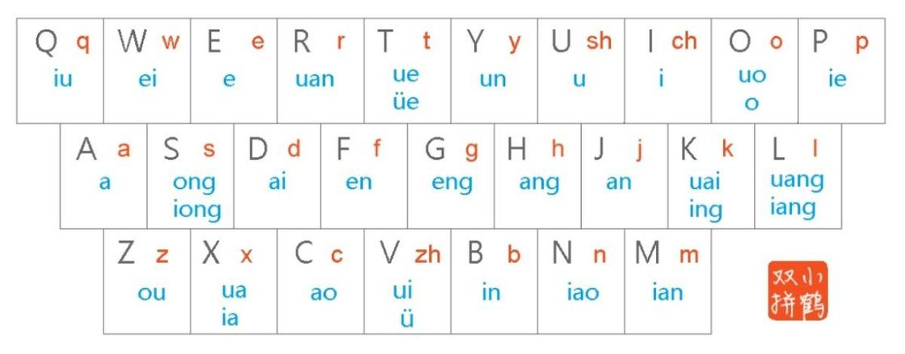

# 前言

这不是劝学文，不是介绍科普文，是大抵没有什么意义的记录。

可能在引入拼音教学后，对于绝大多数人，根据拼音，通过键盘在屏幕上打出汉字的能力就是已经具备的基本能力。基本没有门槛的拼音输入法很自然就成了大多数人最常用的打字输入法。

# 为什么换双拼？

全拼输入法是一种汉字输入法，它基于汉字的拼音音节，将每个汉字的拼音输入到计算机或移动设备中，以输入相应的汉字。全拼输入法的特点是需要输入每个汉字的完整拼音，例如，"你好"的拼音是"ni hao"，需要依次输入这个拼音才能得到对应的汉字。

成也低门槛，败也低门槛！

败因就是每个汉字都需要输入完整拼音。在我的记忆中已经出现过多次输入长串字母，最终得到 2 个汉字的情况。在多种因素的叠加下，比如拼音不熟悉，键盘不好等等。更加加剧了全拼输入的不好的体验。

## 输入效率

双拼基于拼音的输入法，但是它不需要完整输入拼音，每个汉字只需要输入 2 个字母便可得到。比如“你好”是“ni hc”，又比如拼音更加复杂的汉字“双”，全拼是“shuang”，而双拼是“ul”。显然，从输入字母数的角度看，双拼的输入效率更加高。

## 入门门槛低

中文输入法不单只有全拼和双拼，还有输入效率据说更高的五笔。但是五笔的门槛相对更高。这源于五笔的底层逻辑是拆字，需要记忆26个字母分别对应的笔画。记忆成本略高。另外，汉字大多由一个以上的偏旁组成，字体拆分组合的心智成本也不低！

反观双拼的情况。

双拼基于拼音，它的底层逻辑是将字母映射为声母和韵母，比如“好”，声母是“h”韵母是“ao”，声母直接就映射为字母“h”，韵母则映射为字母“c”，当然“c”同样自身也可作为声母“c”。下面是小鹤双拼的 26 个字母所映射的表：

如上图，除了u、i、v外，剩下的每个字母都映射了与字母同形的声母，u 映射为 sh，i 映射为 ch，v 映射为 zh。

字母除了担当声母的映射外，还映射韵母。这些韵母和同键位的声母基本可以组成一个汉字的拼音，比如 “Q” 是 q + iu = qiu，求。

从上可知，双拼的记忆成本是：

1. sh、ch、zh 的键位；

2. 韵母的键位；

对于第 1 点，只能死记。而第 2 点，可以通过同键位的声母与韵母组合，构成拼音记忆，见下表：

| 字母 | 声母 | 韵母 | 汉字 |
|:---|:---:|---:|---:|
| Q | q | iu | 求 |
| W | w | ei | 为 |
| E | - | e | 恶 |
| R | r | uan | 软 |
| T | t | ue / ve | - |
| Y | y | un | 云 |
| U | sh | u | 输 |
| I | ch | i | 吃 |
| O | - | o | 哦 |

| 字母 | 声母 | 韵母 | 汉字 |
|:---|:---:|---:|---:|
| A | - | a | 啊 |
| S | s | ong | 送 |
| D | d | ai | 带 |
| F | f | en |分 |
| G | g |  eng | 更 |
| H | h | ang | 杭 |
| J | j | an | - |
| K | k | ing / uai | 快 |
| L | l | uang / iang | 量 |

| 字母 | 声母 | 韵母 | 汉字 |
|:---|:---:|---:|---:|
| Z | z | ou | 走 |
| X | x | ua / ia | 下 |
| C | c | ao | 草 |
| V | zh | ui / v | 走 |
| B | b |  in | 宾 |
| N | n | iao | 鸟 |
| M | m | ian | 面 |

# 总结

全拼与双拼都是基于拼音的输入法，全拼需要输入完整拼音，双拼需要使用 2 个字母组合声母与韵母。对于从小接受拼音教育的人，全拼可以说是零门槛。而双拼则是需要记忆韵母与 3 个特殊声母的键位和拼音。

从效率的角度看，双拼可以说是全拼的进阶版本！

| 醉 | 里 | 挑 | 灯 | 看 | 剑 |，| 梦 | 回 | 吹 | 角 | 连 | 营 |
|:---|:---:|---:|---:|---:|---:|:---|:---:|---:|---:|---:|---:|---:|
| zv | li | tn | dg | kj | jm |  | mg | hv | iv | jn | lm | yk | 
| zui | li | tiao | deng | kan | jian |  | meng | hui | chui | jiao | lian | ying | 

