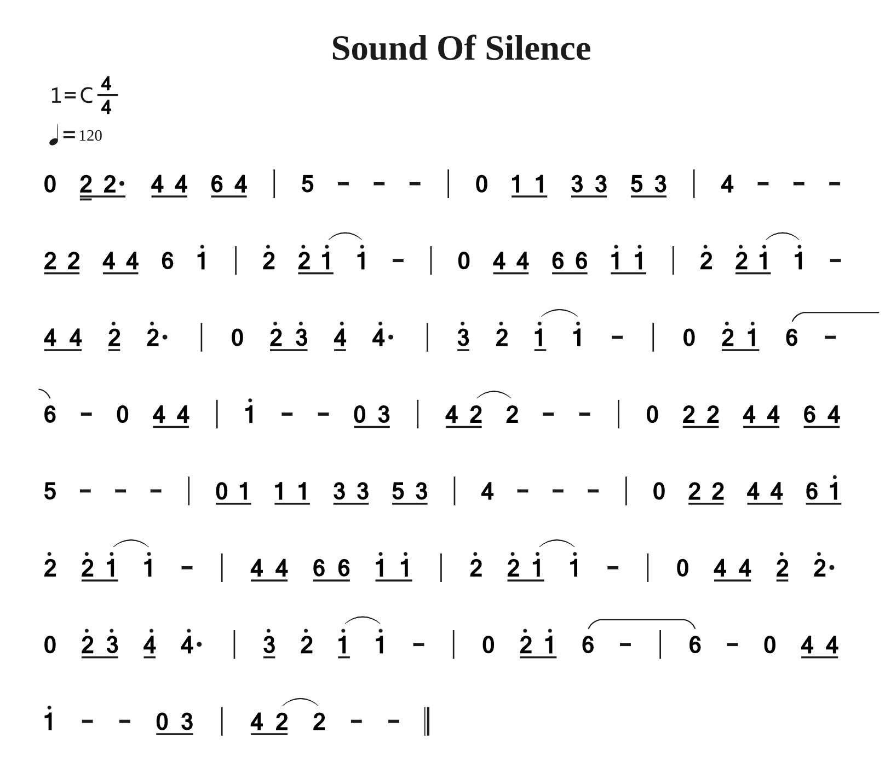

<!--
#============================以下为简谱头部定义==========================
B: Sound Of Silence
D: C
P: 4/4
J: 120
#============================以下开始简谱正文============================
Q: 0 2// 2/. 4/ 4/ 6/ 4/ | 5 - - - | 0 1/ 1/ 3/ 3/ 5/ 3/ | 4 - - -
Q: 2/ 2/ 4/ 4/ 6 1' | 2' 2'/ (1'/ 1') - | 0 4/ 4/ 6/ 6/ 1'/ 1'/ | 2' 2'/ (1'/ 1') -
Q: 4/ 4/ 2'/ 2'. | 0 2'/ 3'/ 4'/ 4'. | 3'/ 2' (1'/ 1') - | 0 2'/ 1'/ (6 -
Q: 6) - 0 4/ 4/ | 1' - - 0/ 3/ | 4/ (2/ 2) - - | 0 2/ 2/ 4/ 4/ 6/ 4/
Q: 5 - - - | 0/ 1/ 1/ 1/ 3/ 3/ 5/ 3/ | 4 - - - | 0 2/ 2/ 4/ 4/ 6/ 1'/
Q: 2' 2'/ (1'/ 1') - | 4/ 4/ 6/ 6/ 1'/ 1'/ | 2' 2'/ (1'/ 1') - | 0 4/ 4/ 2'/ 2'.
Q: 0 2'/ 3'/ 4'/ 4'. | 3'/ 2' (1'/ 1') - | 0 2'/ 1'/ (6 - | 6) - 0 4/ 4/
Q: 1' - - 0/ 3/ | 4/ (2/ 2) - - ||
-->

# 附录

- [番茄制谱网页版](http://zhipu.lezhi99.com/Zhipu-index.html)

- [番茄简谱脚本说明手册](http://doc.lezhi99.com/zhipu#144)

- [【口琴动态简谱】寂静之声⎪The Sound of Silence⎪电影《毕业生》插曲 姜博文口琴](https://www.bilibili.com/video/BV1wv4y1j7Zs/?spm_id_from=333.999.0.0&vd_source=33ac0456d389f10fb21747392b35389b)