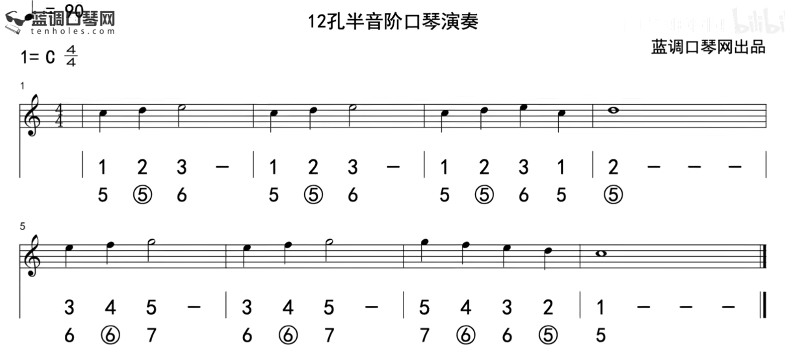
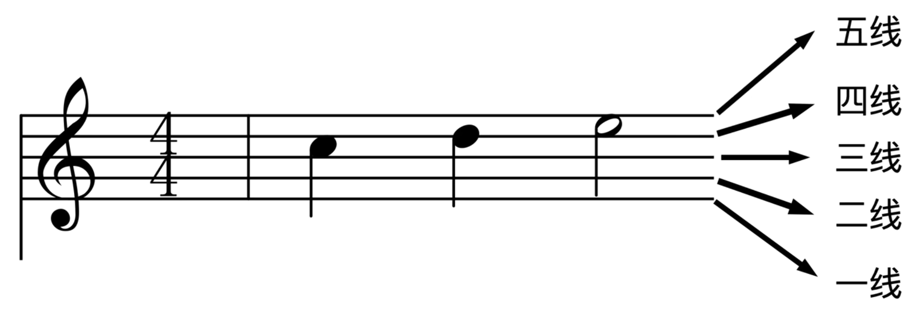
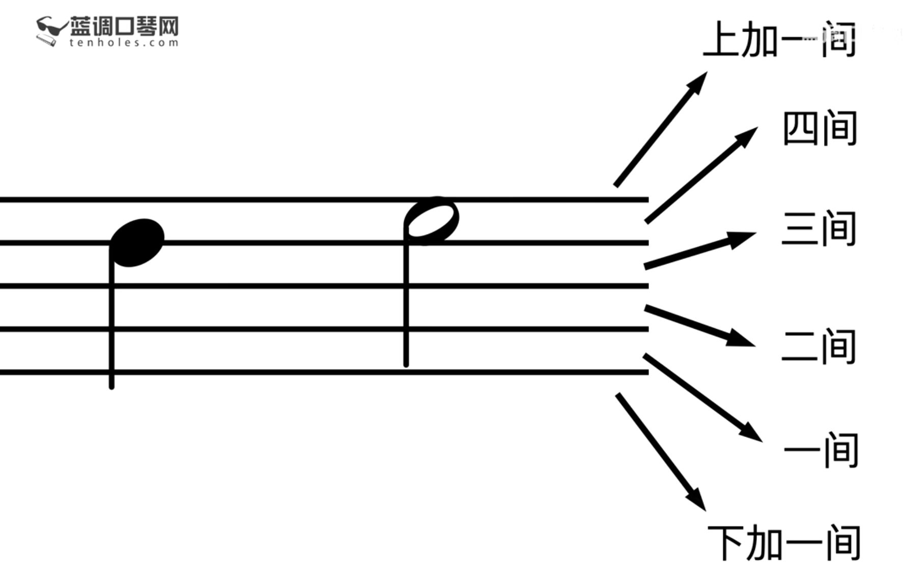
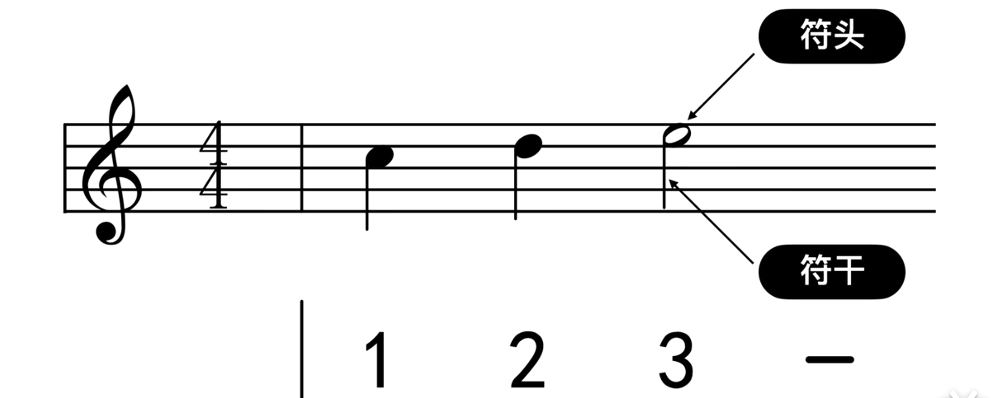

# 持琴

双手持琴，手指朝向自己（下面对于持琴方位参考上图）。左手主要用到三个手指，分别是拇指、食指和中指。琴左端架在虎口，拇指和食指夹住口琴，食指夹在琴的上面末端。中指抵住琴后端。右手主要用到食指，用于按键。食指第二关节按推键，其他手指自由发挥。

参考：[持琴方式](https://www.bilibili.com/video/BV1Lv41117iH?t=28.8&p=2)

# 呼吸

使用腹式呼吸。

## 练习

单音长音练习，参考：[腹式呼吸单音长音练习](https://www.bilibili.com/video/BV1Lv41117iH?t=530.6&p=2)

# 单音演奏

## 嘴型

O 型嘴，嘟嘴成O型，嘴唇往前伸而非内扣。好像自己在吹蜡烛。

## 练习

参考：[练习吹奏片段](https://www.bilibili.com/video/BV1Lv41117iH?t=569.2&p=2)

## 乐理

### 五线谱

线：从下往上分别将线成为：一线、二线、三线、四线和五线。

间：从下往上分别成为：下加一间、一间、二间、三间、四间和上加一间。

线和间都是可以放置音符，音符可以由符头和符干（高度为3个间）组成。

音符按时值（占单位时间的长短）分为三类：

- 全音符：空心符头且无符干，占满4拍；

- 二分音符：空心符头且有符干，占2拍；

- 四分音符：实心符头且有符干，占1拍。

音阶由音符在五线谱放置的位置决定！

### 简谱

略

### 口琴吹吸位置图

- 纯数字：吹数字位置的孔；

- 数字+圈：吸数字位置的孔。

# 附录

[第二课、持琴、呼吸、单音演奏（这一课特别长）](https://www.bilibili.com/video/BV1Lv41117iH?p=2)

