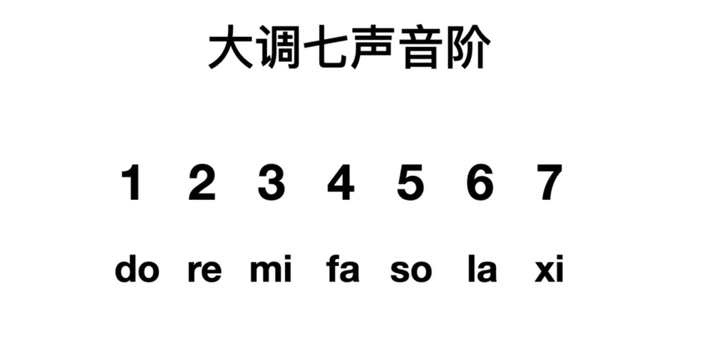
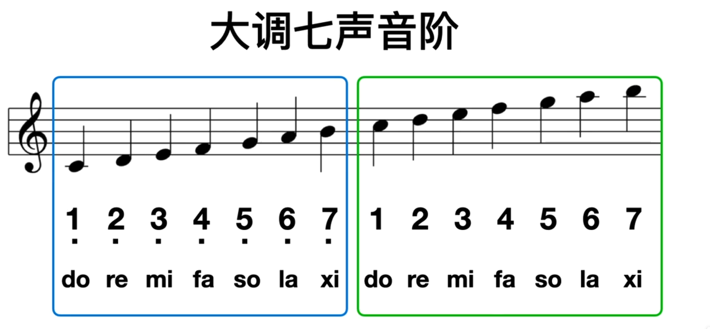
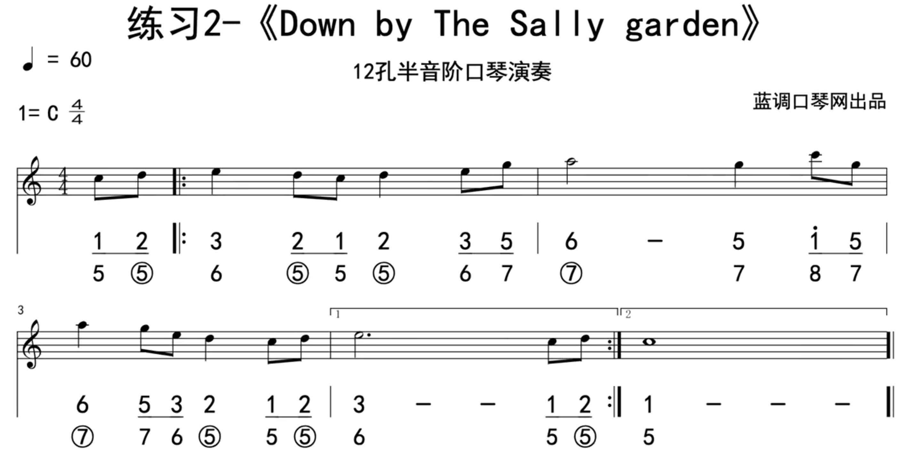
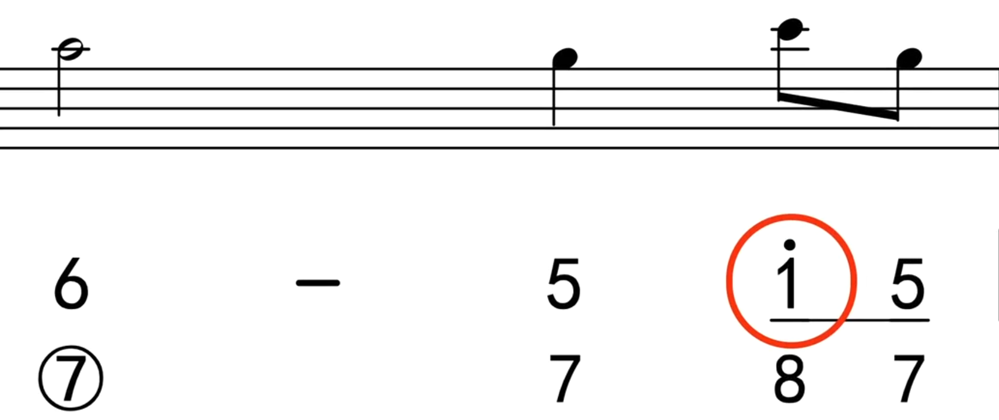
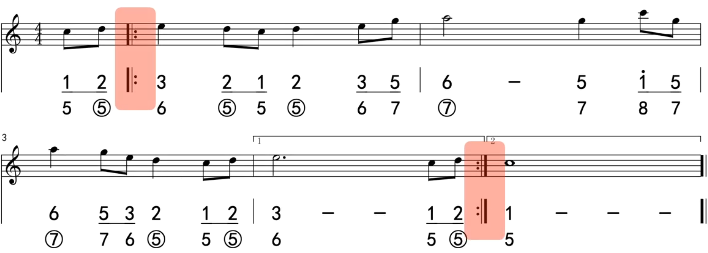
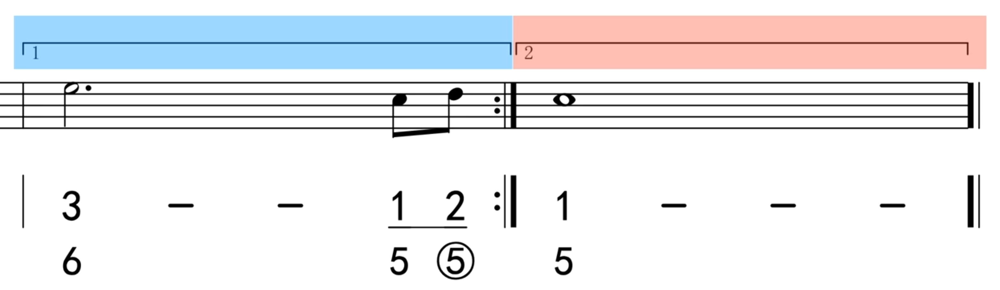

# 简谱

大调七声音阶是最基础最常用的音阶。大调七声音阶由七个音构成，见上图，在简谱中分别使用1、2、3、4、5、6 和 7 表示，发音分别是 do、re、mi、fa、so、la 和 xi。

# 五线谱

大调七声音阶在五线谱中对应的位置与音符见上图。

# 口琴孔位

大调七声音阶在口琴在对应的位置见上图。在不按键的情况下，可以演奏三个八度的 C 大调七声音阶。他们分别是低音区、中音区和高音区。

# 练习曲

参考：[练习曲演示]

## 高音表示

在简谱的音符顶部加一个点表示高音，见上乐谱圆框，表示高音的 do（1）以区分中音的 do（1）。五线谱中，使用上加2线的音符。

## 段落反复记号

见上图高亮的一对符号，分别表示起始和结束的符号。表示符号间的内容需要反复演奏，在演奏到结束符号时需要回到起始符号位置开始再演奏一遍。
这对符号中的起始符号不一定出现，在它不出现时表示第一小节至结束符号的内容需要重复。

在段落反复部分中见上图中高亮的两个部分。它们与段落反复记号结合使用。它们分别标有 1 和 2。它们被成为 1 号房子 和 2 号房子。在第一遍演奏时使用 1 号房子的音符，在第二次演奏时跳过 1 号房子，使用 2 号房子的内容。

参考：[乐理解析]

# 附录

- [第四课、大调七声音阶的构成](https://www.bilibili.com/video/BV1Lv41117iH?p=4)

- [练习曲演示]

- [乐理解析]

[练习曲演示]:https://www.bilibili.com/video/BV1Lv41117iH?t=111.6&p=4
[乐理解析]:https://www.bilibili.com/video/BV1Lv41117iH?t=147.0&p=4
