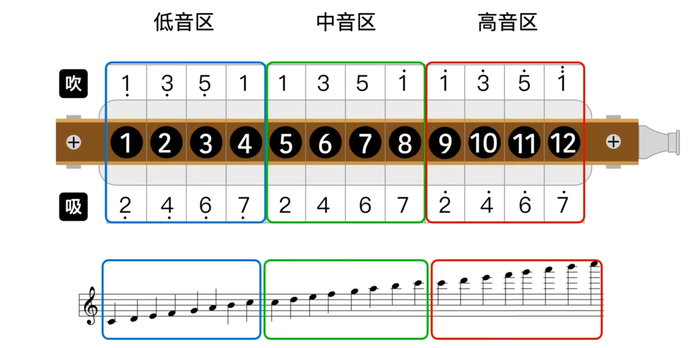
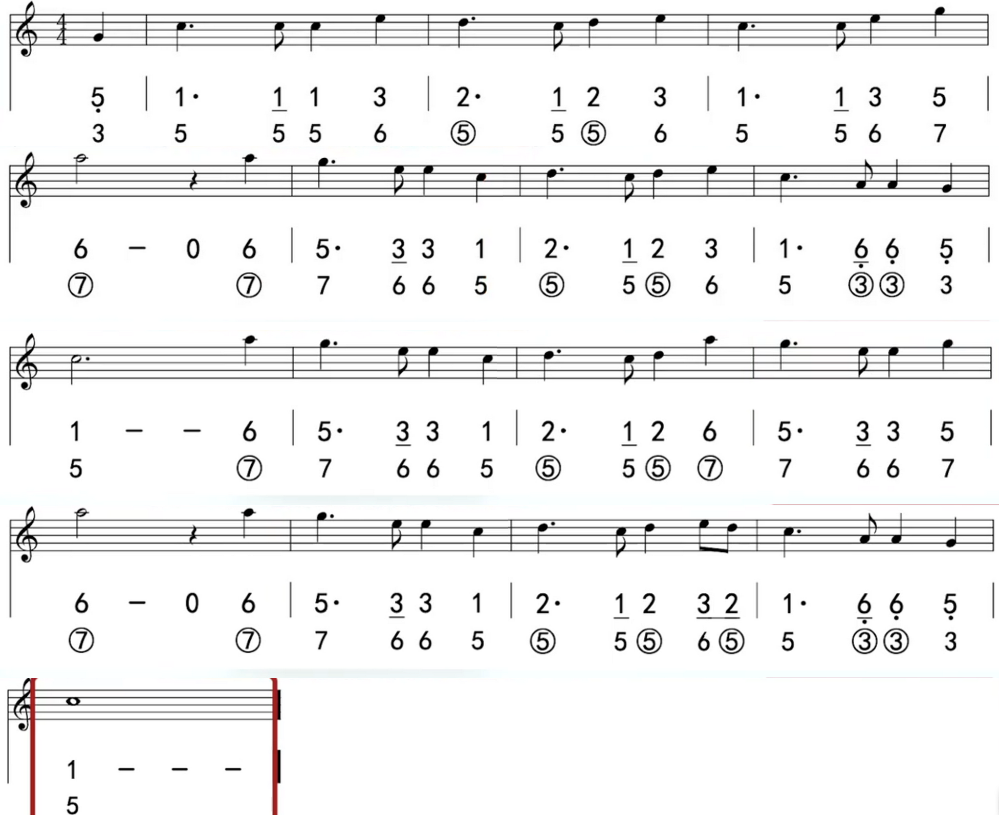
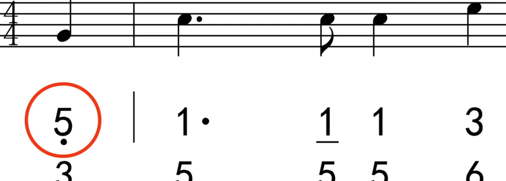
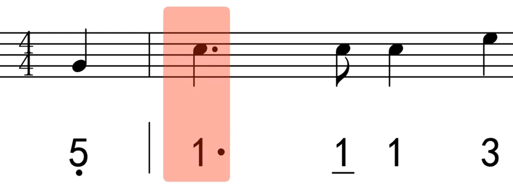
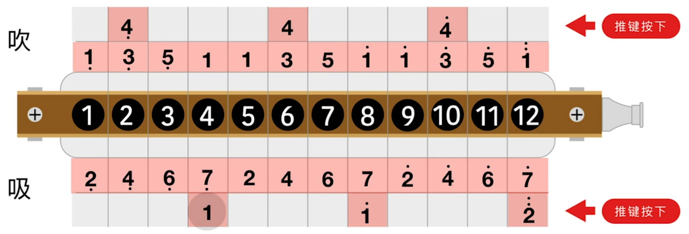
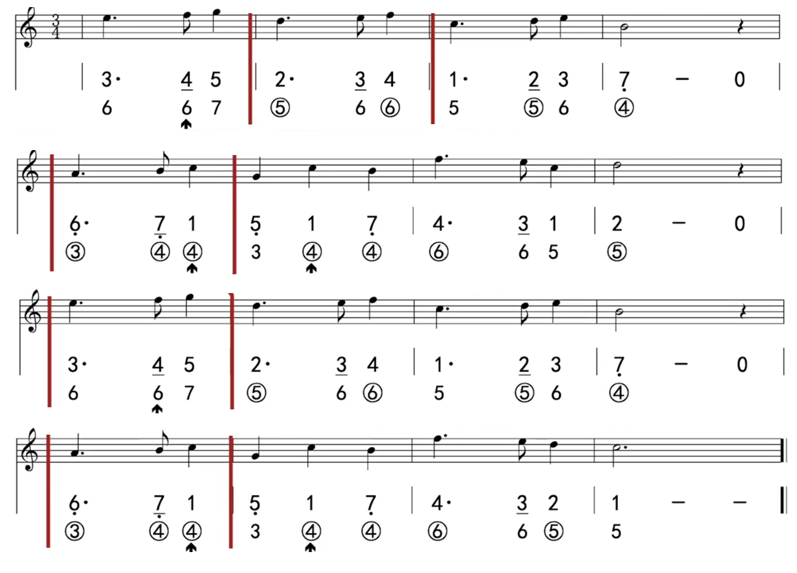

# 前言

本文包含 2 节视频教程内容，分别是 `p5 初探低音区与跨孔演奏` 和 `p6 使用推键获得“1”与“4”的替代音`

# 4 孔与 5 孔

见上图，4 孔与 5 孔的音都是中音的 1（do），发音都是一样的。因此，在吹奏的时候可以按需选择其中之一！

# 4 孔与 5 孔的选择原则

todo

# 跨孔演奏

- 在跨孔的期间需要将气流收住直到下一个孔再放出气息；

- 跨孔需要准确，需要通过练习提升熟练度。

# p5 练习曲

参考：[p5-练习曲演奏]

## 低音的 5（so）

在简谱当中，在中音的 5（so）下面加一个点，表示低音，比中音第一个八度。

- 比中音低几个八度就在下面加几个点；

- 比中音高几个八度就在上面加几个点。

## 附点四分音符

在正常的四分音符（简谱或五线谱）后面加了一个点，这个点成为附点。加上该点后，演奏到对应音符需要延长该音符的时值的一半！对于上面的四分音符来说就是在原来四分音符的时值（一拍）上再延长半拍，即最后时值是一拍半！

# 推键

见上图，在使用推键的情况下可以在音阶上升半个音阶，而在口琴中有 6 对音符是半音阶的关系，可以通过使用推键转变到下一个音符的音，他们分别是：

低音区：

- 低音的 3（mi） -> 低音的 4（fa）；
- 低音的 7（xi） -> 中音的 1（do）；

中音区：

- 中音的 3（mi） -> 中音的 4（fa）；
- 中音的 7（xi） -> 高音的 1（do）；

高音区：

- 高音的 3（mi） -> 高音的 4（fa）
- 高音的 7（do） -> 高音的 2（re）

# 什么时候选择用推键？

选择推键遵循以下几个原则：

- 可以让你的乐句更加流畅、更加连贯（例子：[推键使乐句流畅连贯]）；

- 就近原则，减少移动的距离，让演奏更加舒适（例子：[推键减少移动距离]）；

- 获取装饰音、改善音色

# p6 练习曲

- 3/4 拍的曲子；

- 以四分音符为一拍，每小节有 3 拍。

参考：

- [p6-练习曲演奏]
- [p6-练习曲演奏示范录音](./口琴-p5-p6-初探低音区与跨孔演奏/p6-练习曲录音.aac)

# 附录

- [第五课、初探低音区与跨孔演奏]

- [p5-乐理知识]

- [第六课、使用推键获得“1”与“4”的替代音]

- [什么时候选择用推键？]

[第五课、初探低音区与跨孔演奏]:https://www.bilibili.com/video/BV1Lv41117iH?p=5
[p5-练习曲演奏]:https://www.bilibili.com/video/BV1Lv41117iH?t=304.5&p=5
[p5-乐理知识]:https://www.bilibili.com/video/BV1Lv41117iH?t=355.1&p=5
[什么时候选择用推键？]:https://www.bilibili.com/video/BV1Lv41117iH?t=88.5&p=6
[推键使乐句流畅连贯]:https://www.bilibili.com/video/BV1Lv41117iH?t=115.1&p=6
[推键减少移动距离]:https://www.bilibili.com/video/BV1Lv41117iH?t=179.0&p=6
[第六课、使用推键获得“1”与“4”的替代音]:https://www.bilibili.com/video/BV1Lv41117iH?p=6
[p6-练习曲演奏]:https://www.bilibili.com/video/BV1Lv41117iH?t=395.1&p=6
