# 长音

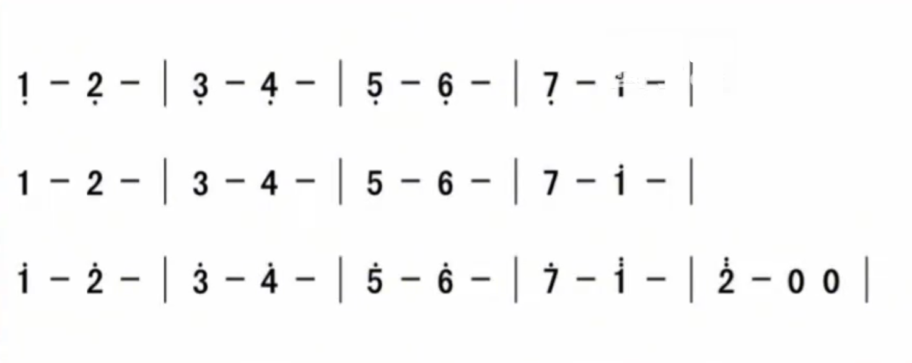

bmp=60

4/4 beats

# 二度音

# 三度音

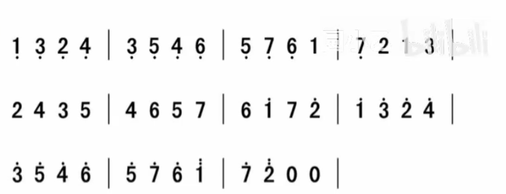

- 同吹同吸：两个孔一口气

# 三度模进

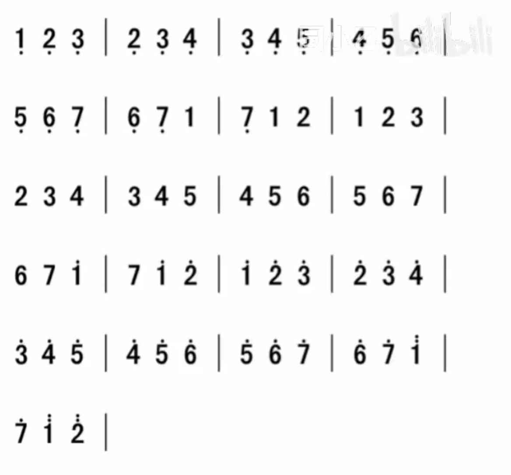

3/4 beats

# 四度音

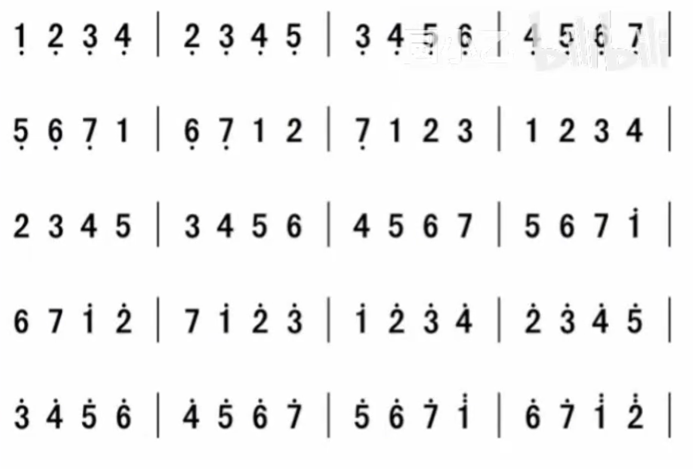

[视频示范|四度音](https://www.bilibili.com/video/BV14h4y1M7M4?t=270.9&p=7)

# 跨孔

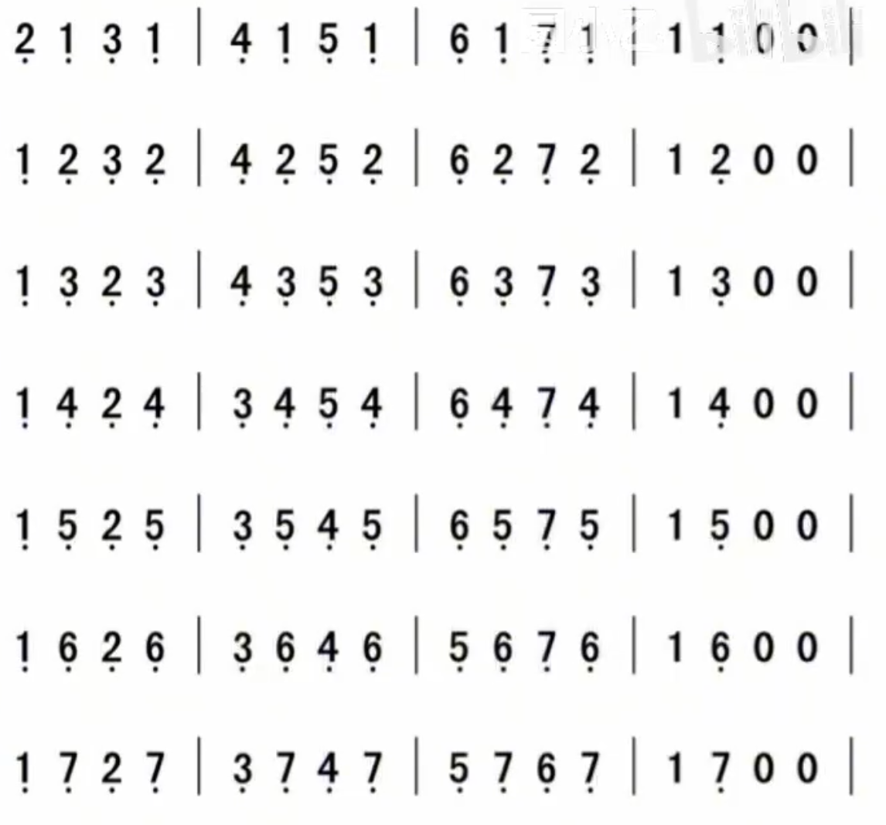

以此为例分别在低音、中音和高音区练习

注意：

- 口不离琴

- 同吸同吹是一口长气

# 节奏练习

注意：

- 使用喉断（[视频演示](https://www.bilibili.com/video/BV1wN411S73T?t=78.8&p=8)）进行断音

## 两种音符混合练习

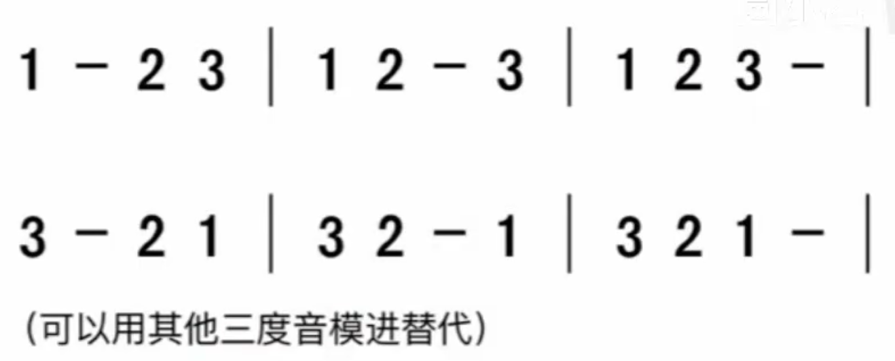

## 三种音符混合练习

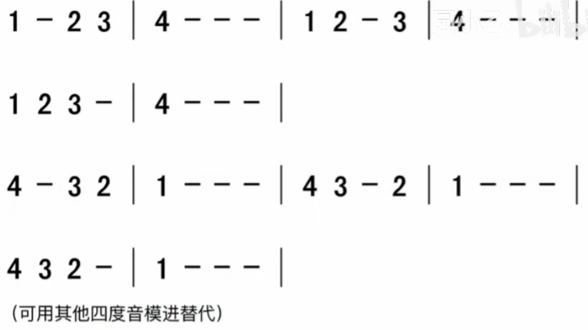

[视频演示](https://www.bilibili.com/video/BV1wN411S73T?t=367.2&p=8)

## 八分音符

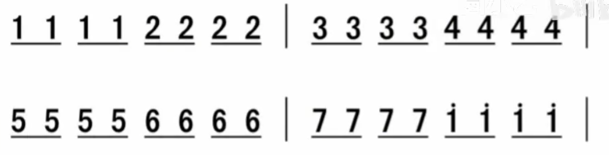

[视频示范](https://www.bilibili.com/video/BV1iM4y17772?t=109.8&p=9)

## 切分音

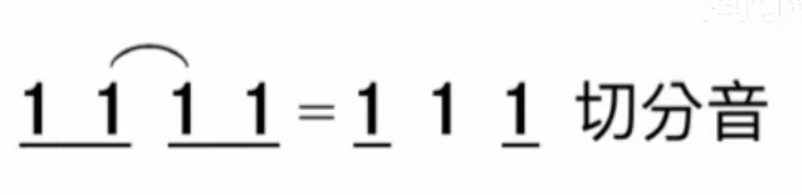

使用延音线将两个相同音符连接，从而延长时值

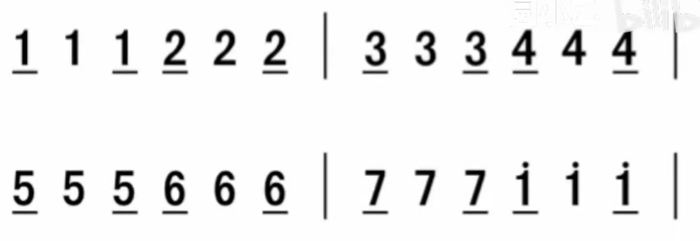

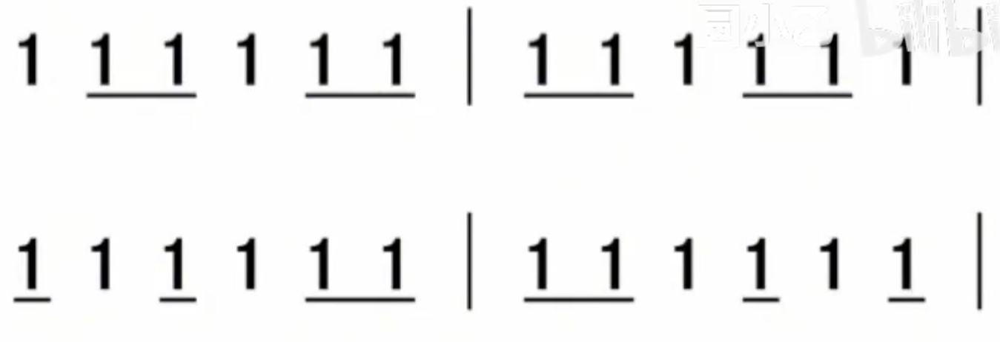

[视频示范](https://www.bilibili.com/video/BV1iM4y17772?t=215.2&p=9)

## 三度音模进的混合练习

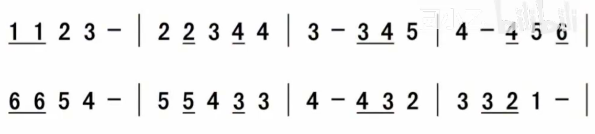

[视频示范](https://www.bilibili.com/video/BV1iM4y17772?t=291.1&p=9)

## 四度音模进的混合练习

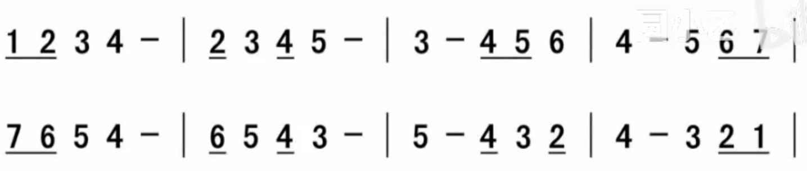

[视频示范](https://www.bilibili.com/video/BV1iM4y17772?t=334.1&p=9)

## 四分附点音符

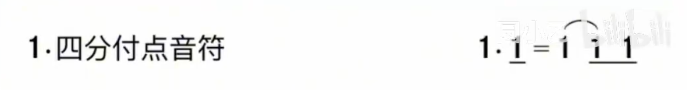

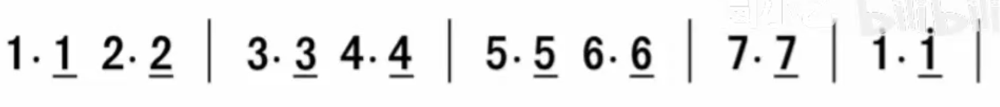

[视频示范](https://www.bilibili.com/video/BV1iM4y17772?t=455.1&p=9)

## 三度音模进的附点

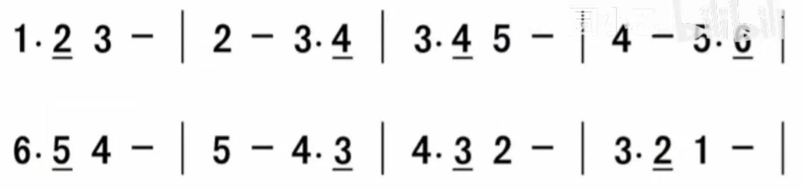

[视频示范](https://www.bilibili.com/video/BV1iM4y17772?t=480.0&p=9)

## 四度音模进的附点

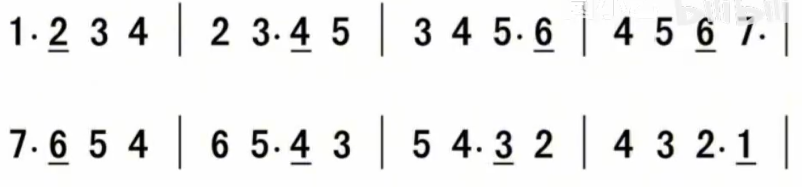

[视频示范](https://www.bilibili.com/video/BV1iM4y17772?t=524.3&p=9)

# 附录
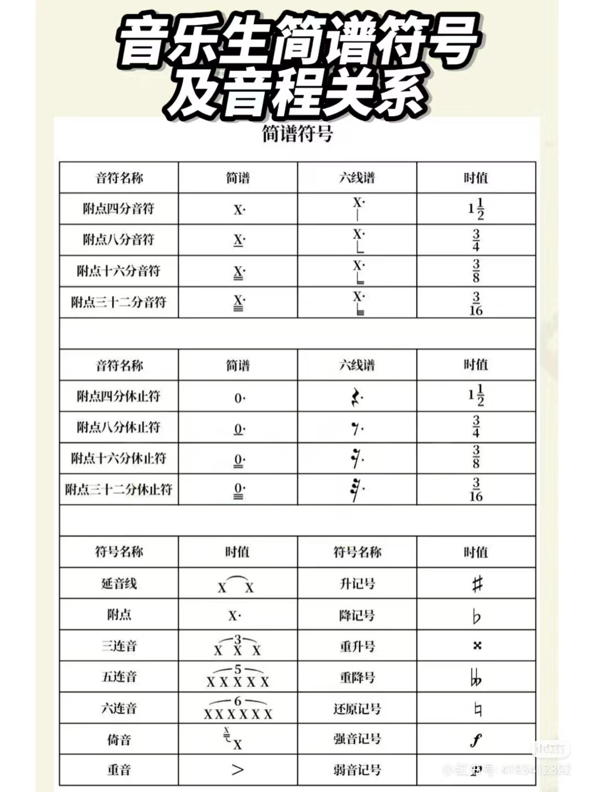
