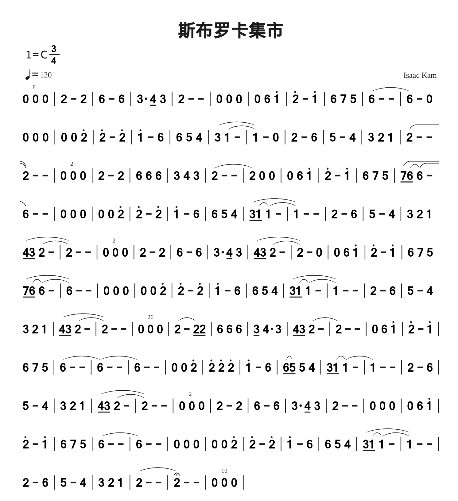

<!--
B: 斯布罗卡集市
D: C
P: 3/4
J: 120
Z: Isaac Kam
Q: 0 0"8" 0 | 2 - 2 | 6 - 6 | 3. 4/ 3 | 2 - - | 0 0 0 | 0 6 1' | 2' - 1' | 6 7 5 | (6 - - | 6) - 0
Q: 0 0 0 | 0 0 2' | 2' - 2' | 1' - 6 | 6 5 4 | (3 (1 - | 1)) - 0 | 2 - 6 | 5 - 4 | 3 2 1 | (2 - -
Q: 2) - - | 0 0"2" 0 | 2 - 2 | 6 6 6 | 3 4 3 | (2 - - | 2) 0 0 | 0 6 1' | 2' - 1' | 6 7 5 | (7/ (6/ 6) (-
Q: 6)) - - | 0 0 0 | 0 0 2' | 2' - 2' | 1' - 6 | 6 5 4 | (3/ (1/ 1) (- | 1)) - - | 2 - 6 | 5 - 4 | 3 2 1
Q:  (4/ 3/ (2 - | 2)) - - | 0 0"2" 0 | 2 - 2 | 6 - 6 | 3. 4/ 3 | (4/ 3/ (2 - | 2)) - 0 | 0 6 1' | 2' - 1' | 6 7 5
Q:  (7/ (6/ 6) (- | 6)) - - | 0 0 0 | 0 0 2' | 2' - 2' | 1' - 6 | 6 5 4 | (3/ (1/ 1) (- | 1)) - - | 2 - 6 | 5 - 4
Q: 3 2 1 | (4/ 3/ (2 - | 2)) - - | 0 0"26" 0 | (2 - 2/) 2/ | 6 6 6 | 3/ 4. 3 | 4/ 3/ (2 - | 2) - - | 0 6 1' | 2' - 1' |
Q: 6 7 5 | (6 - - | 6) (- - | 6) - - | 0 0 2' | 2' 2' 2' | 1' - 6 | (6/ 5/) 5 4 | 3/ (1/ 1) (- | 1) - - | 2 - 6 |
Q: 5 - 4 | 3 2 1 | (4/ 3/ (2 - | 2)) - - | 0 0"2" 0 | 2 - 2 | 6 - 6 | 3. 4/ 3 | 2 - - | 0 0 0 | 0 6 1' |
Q: 2' - 1' | 6 7 5 | (6 - - | 6) - - | 0 0 0 | 0 0 2' | 2' - 2' | 1' - 6 | 6 5 4 | (3/ (1/ 1) (- | 1)) - - |
Q: 2 - 6 | 5 - 4 | 3 2 1 | (2 - - | 2&yc) - - | 0 0"10" 0 |
-->

# 附录

- [番茄制谱网页版](http://zhipu.lezhi99.com/Zhipu-index.html)

- [番茄简谱脚本说明手册](http://doc.lezhi99.com/zhipu#144)