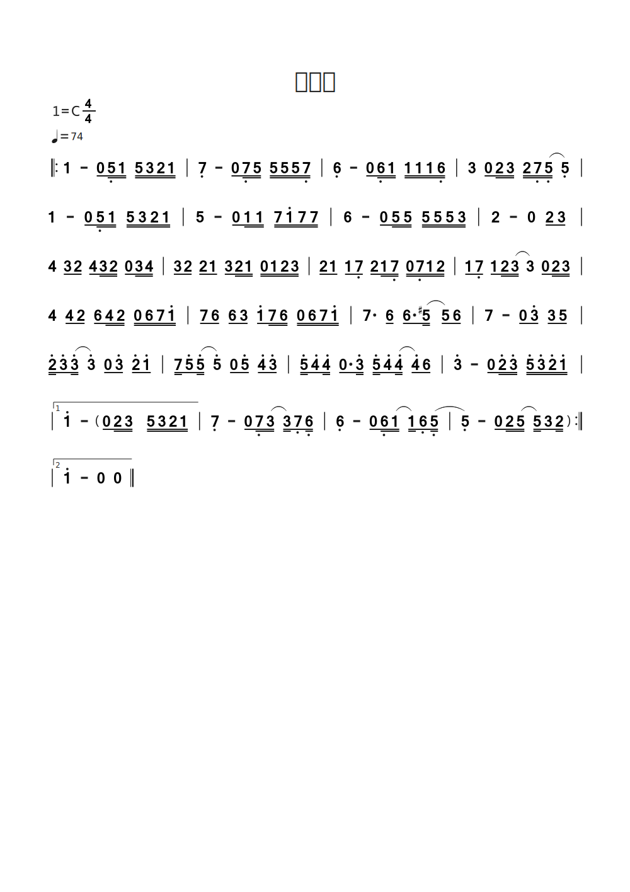

<!--

#============================以下为简谱头部定义==========================
B: 无条件
D: C
P: 4/4
J: 74
#============================以下开始简谱正文============================
Q:  |: 1 - 0/ 5,// 1// 5// 3// 2// 1// | 7, - 0/ 7,// 5// 5// 5// 5// 7,// | 6, - 0/ 6,// 1// 1// 1// 1// 6,// | 3 0/ 2// 3// 2// 7,// (5,// 5,) |
Q: 1 - 0/ 5,// 1// 5// 3// 2// 1// | 5 - 0/ 1// 1// 7// 1'// 7// 7// | 6 - 0/ 5// 5// 5// 5// 5// 3// | 2 - 0 2/ 3/ |
Q: 4 3/ 2/ 4/ 3// 2// 0/ 3// 4// | 3/ 2/ 2/ 1/ 3/ 2// 1// 0// 1// 2// 3// | 2/ 1/ 1/ 7,/ 2/ 1// 7,// 0// 7,// 1// 2// | 1/ 7,/ 1/ 2// (3// 3) 0/ 2// 3// |
Q: 4 4/ 2/ 6/ 4// 2// 0// 6// 7// 1'// | 7/ 6/ 6/ 3/ 1'/ 7// 6// 0// 6// 7// 1'// | 7. 6/ 6./ (5#// 5/) 6/ | 7 - 0/ 3'/ 3/ 5/ |
Q: 2'// 3'/ (3'// 3') 0/ 3'/ 2'/ 1'/ | 7// 5'/ (5'// 5') 0/ 5'/ 4'/ 3'/ | 5'// 4'/ 4'// 0/. 3'// 5'// 4'/ (4'// 4'/) 6/ | 3' - 0/ 2'// 3'// 5'// 3'// 2'// 1'// |
Q:  |["1" 1' - 0/&zkh 2// 3// 5// 3// 2// 1// |]/ 7, - 0/ 7,// (3// 3//) 7,/ 6,// | 6, - 0/ 6,// (1// 1//) 6,/ (5,// | 5,) - 0/ 2// (5// 5//) 3/ 2//&ykh :|
Q:  |["2" 1' - 0 0 ||]/

-->

# 附录

- [番茄制谱网页版](http://zhipu.lezhi99.com/Zhipu-index.html)

- [番茄简谱脚本说明手册](http://doc.lezhi99.com/zhipu#144)
