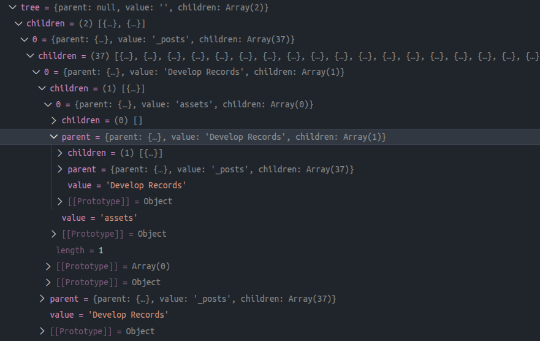

## 环境信息

- OS: LMDE 6 (faye) x86_64
- Kernel: 6.1.0-42-amd64
- node.js: v24.14.0
- pnpm: 10.32.1

## 背景

示例项目：[isaaxite / path-treeify](https://github.com/isaaxite/path-treeify) - 使用 TS 编写源码。其功能是将一个路径或路径数组转换为树形 JavaScript 对象，每个节点均持有指向父节点的循环引用。

预期引入示例项目，使用其能力的语句如下（ES Module / CommonJS）：

```js
const ptf = new PathTreeify({
  base: '/home/isaac/Workspace/blog/source'
});

const tree = ptf.buildBy(['_posts', '_drafts']);

# 此处设置断点，查看 tree 结构
process.exit(0);
```

目前源码已经基本完成，且发布：

- NPM： [path-treeify](https://www.npmjs.com/package/path-treeify)
- NPMX：[path-treeify](https://npmx.dev/package/path-treeify)
- Github Repositry：[isaaxite / path-treeify](https://github.com/isaaxite/path-treeify)

## 初始化

初始目录结构（index.ts 中已有源码，[点击查看](https://github.com/isaaxite/path-treeify/blob/main/index.ts)）：

```bash
.
├── index.ts
├── LICENSE
├── package.json
└── README.md

1 directory, 4 files
```

Step 1 - 安装 node.js 类型库 - `@types/node`：

```bash
pnpm add @types/node -D
```

Step 2 - 安装 `typescript`:

 包`typescript` 提供命令行工具——`tsc`，可使用 `tsc` 生成 `d.ts` 文件。

```bash
pnpm add typescript -D
```

添加 `tsconfig.json`

```json
{
  "compilerOptions": {
    "target": "ES2020",
    "module": "ESNext",
    "moduleResolution": "node",
    "strict": true,
    "esModuleInterop": true,
    "skipLibCheck": true,
    "rootDir": "./",
    "declaration": true,
    "declarationDir": "./dist/types",
    "emitDeclarationOnly": true
  },
  "include": ["./**/*.ts"]
}

```

Step 3 - 安装 `rollup` 打包源码，输出 `esm` 和 `cjs` 模块代码：

```bash
pnpm add rollup @rollup/plugin-typescript tslib -D
```

添加 `rollup.config.mjs` ：

```js
import typescript from '@rollup/plugin-typescript';

export default {
  input: 'src/index.ts',
  output: [
    {
      dir: 'dist/esm',
      format: 'esm',
      entryFileNames: '[name].mjs',
      sourcemap: true
    },
    {
      dir: 'dist/cjs',
      format: 'cjs',
      entryFileNames: '[name].cjs',
      sourcemap: true
    }
  ],
  plugins: [
    typescript({
      tsconfig: './tsconfig.json',
      declaration: false,              # 需要关闭，与 tsc 冲突
      declarationDir: undefined        # 需要关闭，与 tsc 冲突
    })
  ]
};
```

添加 `package.json` 构建脚本：

```json
"build": "tsc && rollup -c"
```

Step 4 - 添加 `nodemon`监听文件变动，动态打包和输出 dts 文件

``` 
# 安装
pnpm add nodemon -D

# 增加脚本
# package.json > scripts:
"dev": "nodemon --watch src -e ts --exec \"npm run build\""
```

完整的依赖列表，[点击查看](https://github.com/isaaxite/path-treeify/blob/main/package.json)。

Step 5 - `package.json` 配置模块引入：

```json
{
  "main": "./dist/index.cjs",
  "module": "./dist/index.mjs",
  "types": "./dist/types/index.d.ts",
  "exports": {
    ".": {
      "require": {
        "types": "./dist/types/index.d.ts",
        "default": "./dist/index.cjs"
      },
      "import": {
        "types": "./dist/types/index.d.ts",
        "default": "./dist/index.mjs"
      }
    }
  },
}
```

## 本地测试

测试关注的指标：

- 引入使用，调试无异常；
- 打包无异常；
- 打包产物运行无异常；

Step 1 - 构建

```bash
# isaac @ LMDE in ~/Workspace/path-treeify on git:main o [8:28:31] 
$ npm run build

> path-treeify@0.0.1 build
> tsc && rollup -c

index.ts → dist, dist...
(!) Unresolved dependencies
https://rollupjs.org/troubleshooting/#warning-treating-module-as-external-dependency
fs (imported by "index.ts")
path (imported by "index.ts")
created dist, dist in 1s

# isaac @ LMDE in ~/Workspace/path-treeify on git:main o [8:28:39] 
$ tree
.
├── dist
│   ├── index.cjs
│   ├── index.cjs.map
│   ├── index.mjs
│   ├── index.mjs.map
│   └── types
│       └── index.d.ts
├── index.ts
├── LICENSE
├── node_modules/
├── package.json
├── pnpm-lock.yaml
├── README.md
├── rollup.config.mjs
└── tsconfig.json
```

注：标准输出中出现 `(!) Unresolved dependencies` 是因为没有安装 `@rollup/plugin-node-resolve`，它让 Rollup 能够找到并打包 node_modules 里的第三方模块并和源码一起打包。但当前 [isaaxite / path-treeify](https://github.com/isaaxite/path-treeify) 项目无生产环境的依赖。

Step 2 - `pnpm link`

```bash
# isaac @ LMDE in ~/Workspace/path-treeify on git:main o [22:50:08] 
$ pnpm link              
 WARN  path-treeify has no binaries

/home/isaac/.local/share/pnpm/global/5:
+ path-treeify 0.0.1 <- ../../../../../Workspace/path-treeify
```

期间可能需要，执行 `pnpm setup`。需要重新加载 shell 的配置文件才能生效：

```bash
# isaac @ LMDE in ~/Workspace/path-treeify on git:main o [22:49:07] C:1
$ pnpm setup
No changes to the environment were made. Everything is already up to date.

# isaac @ LMDE in ~/Workspace/path-treeify on git:main o [22:49:53] 
$ source ~/.zshrc
```

### 测试 CommonJS

Step 1 - 初始化：

```bash
mkdir ./test-cjs
cd test-cjs
npm init
```

Step 2 - 添加 Vscode Debug 配置：

`test-cjs` 目录下创建 Debug 配置（`.vscode/launch.json`），以便查看结果（输出结果是个循环引用的数据结构）

```json
{
  // Use IntelliSense to learn about possible attributes.
  // Hover to view descriptions of existing attributes.
  // For more information, visit: https://go.microsoft.com/fwlink/?linkid=830387
  "version": "0.2.0",
  "configurations": [
    {
      "type": "node",
      "request": "launch",
      "name": "Launch test-cjs",
      "skipFiles": [
        "<node_internals>/**"
      ],
      "program": "${workspaceFolder}/index.js",
      "console": "integratedTerminal",            # 打开 terminal 输出日志
      "outFiles": [
        "${workspaceFolder}/**/*.js"
      ]
    }
  ]
}
```

Step 3 - 添加测试代码（`test-cjs/index.js`）：

```js
const { PathTreeify } = require('path-treeify');

const ptf = new PathTreeify({
  base: '/home/isaac/Workspace/blog/source'
});

const tree = ptf.buildBy(['_posts', '_drafts']);

# 此处设置断点，查看 tree 结构
process.exit(0);
```

Step 4 - 断点调试：

- [x] 引入使用，调试无异常；
- [ ] 打包无异常 - 同为 CommonJS，不做打包处理，略，下同；
- [ ] 打包产物运行无异常 - 略。




### 测试 ES Module

*说明：项目初始化、添加 Vscode Debug 配置以及添加测试代码（引入方式略有差异）三个步骤基本相同，不再详细描述，仅作简述。结果图（断点查看输出的 tree 内容）除非出现异常，否则同样不作展示。*

## 发布前

发布前，完善 package.json 内容：`files`、`exports`、`author`、 `engines`（node.js 版本要求）和 `publishConfig`。

**Step 1** - 发布 files 字段（控制发布内容）：

```json
"files": [
  "dist",
  "README.md",
  "LICENSE"
],
```

注：根目录下的 `README.md`、`README.zh-CN.md`、`LICENSE` 默认收录。文件位置非根目录下即不被收录。

----

**Step 2** - 完善 exports 字段：

添加 `"./package.json"` 导出，允许用户访问 package.json。

```json
{
  "exports": {
    ".": {
      "require": {
        "types": "./dist/types/index.d.ts",
        "default": "./dist/index.cjs"
      },
      "import": {
        "types": "./dist/types/index.d.ts",
        "default": "./dist/index.mjs"
      }
    },
    "./package.json": "./package.json"
  }
}
```

---

**Step 3** - 完善作者信息

```json
"author": {
  "name": "isaaxite",
  "url": "https://github.com/isaaxite"
}
```

---

**Step 4** - Node 版本要求：

Node 14 已停止维护，建议至少使用 18 LTS。

```json
"engines": {
  "node": ">=18.0.0"
}
```


**Step 5** - publishConfig 字段：

- `access: "public"` - 包访问权限公开，任何人都可以安装使用；
- `provenance: true` - 来源验证（npm 9.0+）。注：provenance 只能在支持的 CI 环境中生成。本地发布，provenance 不会生效，会跳过 provenance。

保留 `provenance: true`，这会让包更可信、更专业。公开包，包名是无 @ 作用域，`access` 可省略，否则必须设置 `access: "public"`

```json
"publishConfig": {
  "access": "public",
  "provenance": true
}
```

[点击查看完整 package.json 内容](https://github.com/isaaxite/path-treeify/blob/main/package.json)


## 手动发布

**Step 1** - 发布前预打包：

`npm pack --dry-run` - 确认打包内容无误。

```json
# isaac @ LMDE in ~/Workspace/path-treeify on git:main o [4:17:24] 
$ npm pack --dry-run
npm notice
npm notice 📦  path-treeify@1.0.0
npm notice Tarball Contents
npm notice 1.1kB LICENSE
npm notice 5.8kB README.md
npm notice 2.1kB dist/index.cjs
npm notice 2.1kB dist/index.mjs
npm notice 711B dist/types/index.d.ts
npm notice 2.1kB package.json
npm notice Tarball Details
npm notice name: path-treeify
npm notice version: 1.0.0
npm notice filename: path-treeify-1.0.0.tgz
npm notice package size: 5.0 kB
npm notice unpacked size: 13.8 kB
npm notice shasum: a17ac7018381cf65cdd7b132172b19dce91cda5c
npm notice integrity: sha512-T8vPkMZRfvWF3[...]CV0t26qDdusZw==
npm notice total files: 6
npm notice
path-treeify-1.0.0.tgz
```

**Setp 2** - 获取 Access Token。

当前使用的 Access Token 需要具备：

- This token has **read and write** access to all the packages.
- 勾选 - Bypass two-factor authentication (2FA)

注：目前（2026/03/19）Token 的期限仅有 90 天，确认是否过期，否则需重新生成。

**Step 3** - 配置 Access Token：

```bash
npm set //registry.npmjs.org/:_authToken <access token>

# token 被保存在以下路径
$ npm config ls | grep "\"user\" config from"
; "user" config from /home/isaac/.npmrc
```

**Step 4** - 发布：

```bash
npm publish
```

## 自动化 NPM Package 发布

添加 github-action（workflow） 自动化发布 NPM Package（`registry-url: https://registry.npmjs.org/`）：

- Beta：推送*特定 commit* 到 main 分支 - 发布 beta 标签的包到 NPM；
- Latest（默认）：main 合并 Release PR 后，发布 正式包。

注：*特定 commit* - `fix:`、`feat:`、`feat!:` 、`fix!:` 和 `refactor!:`，以及包含 `!` 的 commit type。参考：[How should I write my commits?](https://github.com/marketplace/actions/release-please-action#how-should-i-write-my-commits)

Setp 1 - 根目录下，创建 `.github/workflows/release-please.yml`

Setp 2 - 设置触发 workflow 的事件：

推送 commit 到 main 分支，触发 workflow。

```yml
name: Release Please

on:
  push:
    branches:
      - main
```

Step 3 - 添加 job（`release-please`）：

使用 `googleapis/release-please-action@v4`。配置它需要的 3 个权限。使用它必须包含：`token: ${{ secrets.GITHUB_TOKEN }}` 和 `release-type: node`。

```yml
name: Release Please
# ...
permissions:
  contents: write
  pull-requests: write
  issues: write  # 添加这个，因为标签操作需要 issues 权限

jobs:
  release-please:
    runs-on: ubuntu-latest
    outputs:
      release_created: ${{ steps.release.outputs.release_created }}
      pr: ${{ steps.release.outputs.pr }}
    steps:
      - uses: googleapis/release-please-action@v4
        id: release
        with:
          token: ${{ secrets.GITHUB_TOKEN }}
          release-type: node
```

Step 4 - 添加 job （`publish-beta`），设置触发 Beta 发布的条件：

```yml
# jobs:
# ...
publish-beta:
  runs-on: ubuntu-latest
  needs: release-please
  if: |
    needs.release-please.outputs.pr != '' &&
    needs.release-please.outputs.release_created != 'true'
```

Step 5 - Beta 版号生成：

Beta 版号构成：当前版号 + 头部 commit 短哈希，如 [1.1.0-beta.94a5d17](https://www.npmjs.com/package/path-treeify/v/1.1.0-beta.94a5d17)。

```yml
# jobs:publish-beta:steps:
# ...
- name: Compute beta version
  id: version
  run: |
    BASE=$(node -p "require('./package.json').version")
    SHA=$(git rev-parse --short HEAD)
    echo "version=${BASE}-beta.${SHA}" >> "$GITHUB_OUTPUT"

- name: Bump version to beta (in-memory, not committed)
  run: npm version "${{ steps.version.outputs.version }}" --no-git-tag-version
```

Step 6 - 配置发布 Beta 包命令

`NPM_TOKEN` 需自行配置，包含键名、键值皆是。配置位置：`<username>/repository` > `Setting` > `Secrets and variables` > `Actions` > `Repository secrets`

```yml
# jobs:publish-beta:steps:
# ...
- name: Publish beta to npm
  run: npm run publish:beta
  env:
    NODE_AUTH_TOKEN: ${{ secrets.NPM_TOKEN }}
```

显式指定 `regisitry-url` - 必须。

```yml
# jobs:publish-beta:steps:
# ...
- name: Setup Node.js
  uses: actions/setup-node@v6
  with:
    node-version: '24'
    registry-url: https://registry.npmjs.org
# ...
- name: Publish beta to npm
```

Step 7 - 添加 job（`publish-latest`），设置仅合并 PR 后执行：

发布 Latest 包的配置与 Beta 大体相同：无需自行计算版号，但同样需要显式指定 `regisitry-url`。

```yml
publish-latest:
    runs-on: ubuntu-latest
    needs: release-please
    if: needs.release-please.outputs.release_created == 'true'
    steps:
      # ...
      - name: Build
        run: npm run build:prod

      - name: Publish latest to npm
        run: npm run publish:latest
        env:
          NODE_AUTH_TOKEN: ${{ secrets.NPM_TOKEN }}
```

## 测试 CJS

使用 `pnpm link` 。

将 `path-treeify` link

```bash
cd ./path-treeify
pnpm link --global
```

出现错误提示：

缺少 `pnpm` 的全局目录

```bash
# isaac @ LMDE in ~/Workspace/path-treeify on git:main o [20:48:37] 
$ pnpm link --global
 ERR_PNPM_NO_GLOBAL_BIN_DIR  Unable to find the global bin directory

Run "pnpm setup" to create it automatically, or set the global-bin-dir setting, or the PNPM_HOME env variable. The global bin directory should be in the PATH.
```

使用 `pnpm setup`自动创建：

```bash
# isaac @ LMDE in ~/Workspace/path-treeify on git:main o [20:48:51] C:1
$ pnpm setup
Appended new lines to /home/isaac/.zshrc

Next configuration changes were made:
export PNPM_HOME="/home/isaac/.local/share/pnpm"
case ":$PATH:" in
  *":$PNPM_HOME:"*) ;;
  *) export PATH="$PNPM_HOME:$PATH" ;;
esac

To start using pnpm, run:
source /home/isaac/.zshrc
```

需要重新加载配置 `source ～/.zshrc` 后方可生效。

```bash
# isaac @ LMDE in ~/Workspace/path-treeify on git:main o [20:52:14] C:1
$ source ~/.zshrc
[oh-my-zsh] Would you like to update? [Y/n] n
[oh-my-zsh] You can update manually by running `omz update`

# isaac @ LMDE in ~/Workspace/path-treeify on git:main o [20:52:40] 
$ pnpm link --global
 WARN  path-treeify has no binaries

/home/isaac/.local/share/pnpm/global/5:
+ path-treeify 0.0.1 <- ../../../../../Workspace/path-treeify

```

初始化测试`cjs`项目

```bash
mkdir test-cjs
cd test-cjs
npm init
```

## pnpm link 异常

这个错误是 pnpm 在 Windows/Linux 下 `link --global` 的一个已知边缘情况。根本原因是 pnpm 在第二步（在测试项目中链接）时，路径解析出现混淆，错误地将目标路径（全局存储中的链接）和要创建的符号链接路径识别为同一个地址，导致操作失败并回滚（这解释了为什么全局链接会被自动删除）

```bash
# isaac @ LMDE in ~/Workspace/test-cjs [21:41:26] 
$ pnpm link --global path-treeify
 ERROR  Symlink path is the same as the target path (/home/isaac/.local/share/pnpm/global/5/node_modules/path-treeify)

pnpm: Symlink path is the same as the target path (/home/isaac/.local/share/pnpm/global/5/node_modules/path-treeify)
    at symlinkDir (/home/isaac/.nvm/versions/node/v18.20.8/lib/node_modules/pnpm/dist/pnpm.cjs:97413:15)
    at symlinkDirectRootDependency (/home/isaac/.nvm/versions/node/v18.20.8/lib/node_modules/pnpm/dist/pnpm.cjs:148623:58)
    at async /home/isaac/.nvm/versions/node/v18.20.8/lib/node_modules/pnpm/dist/pnpm.cjs:150477:11
    at async Promise.all (index 0)
    at async linkDirectDepsOfProject (/home/isaac/.nvm/versions/node/v18.20.8/lib/node_modules/pnpm/dist/pnpm.cjs:150475:7)
    at async Promise.all (index 0)
    at async linkDirectDeps (/home/isaac/.nvm/versions/node/v18.20.8/lib/node_modules/pnpm/dist/pnpm.cjs:150416:34)
    at async linkPackages (/home/isaac/.nvm/versions/node/v18.20.8/lib/node_modules/pnpm/dist/pnpm.cjs:158028:24)
    at async _installInContext (/home/isaac/.nvm/versions/node/v18.20.8/lib/node_modules/pnpm/dist/pnpm.cjs:159315:25)
    at async installInContext (/home/isaac/.nvm/versions/node/v18.20.8/lib/node_modules/pnpm/dist/pnpm.cjs:159656:16)
```

另外，重新在 `path-treeify` 下，`pnpm link --global` 出现同样的错误，且更严重：

```bash
# isaac @ LMDE in ~/Workspace/path-treeify on git:main o [22:14:17] 
$ pnpm link --global
 ERR_PNPM_NO_GLOBAL_BIN_DIR  Unable to find the global bin directory

Run "pnpm setup" to create it automatically, or set the global-bin-dir setting, or the PNPM_HOME env variable. The global bin directory should be in the PATH.

# isaac @ LMDE in ~/Workspace/path-treeify on git:main o [22:14:25] C:1
$ pnpm setup
No changes to the environment were made. Everything is already up to date.
```

全局 `pnpm` 目录下无 `path-treeify`

```bash
# isaac @ LMDE in ~/.local/share/pnpm/global/5/node_modules [22:16:19] 
$ la
total 8.0K
drwxr-xr-x 2 isaac isaac 4.0K Mar 17 20:53 .pnpm
-rw-r--r-- 1 isaac isaac  607 Mar 17 20:53 .pnpm-workspace-state-v1.json
```

```bash
# isaac @ LMDE in ~/.local/share/pnpm/global/5/node_modules [22:17:09] 
$ cat .pnpm-workspace-state-v1.json 
{
  "lastValidatedTimestamp": 1773752004268,
  "projects": {},
  "pnpmfiles": [],
  "settings": {
    "autoInstallPeers": true,
    "dedupeDirectDeps": false,
    "dedupeInjectedDeps": true,
    "dedupePeerDependents": true,
    "dev": true,
    "excludeLinksFromLockfile": false,
    "hoistPattern": [
      "*"
    ],
    "hoistWorkspacePackages": true,
    "injectWorkspacePackages": false,
    "linkWorkspacePackages": false,
    "nodeLinker": "isolated",
    "optional": true,
    "preferWorkspacePackages": false,
    "production": true,
    "publicHoistPattern": []
  },
  "filteredInstall": false
}
```

```bash
$ cat pnpm-workspace.yaml 
overrides:
  path-treeify: link:node_modules/path-treeify
```

## 切换 node.js 和 pnpm 版本

- node v24
- pnpm 10.x

```bash
# isaac @ LMDE in ~/Workspace/path-treeify on git:main o [22:49:07] C:1
$ pnpm setup
No changes to the environment were made. Everything is already up to date.

# isaac @ LMDE in ~/Workspace/path-treeify on git:main o [22:49:53] 
$ source ~/.zshrc

# isaac @ LMDE in ~/Workspace/path-treeify on git:main o [22:50:08] 
$ pnpm link              
 WARN  path-treeify has no binaries

/home/isaac/.local/share/pnpm/global/5:
+ path-treeify 0.0.1 <- ../../../../../Workspace/path-treeify
```

global 中的 `package.json` ：

```bash
# isaac @ LMDE in ~/.local/share/pnpm/global/5 [22:51:07] C:1
$ cat package.json 
{"dependencies":{"path-treeify":"link:../../../../../Workspace/path-treeify"}}
```

global 中的 `pnpm-lock.yaml` ：

```bash
# isaac @ LMDE in ~/.local/share/pnpm/global/5 [22:51:10] 
$ cat pnpm-lock.yaml 
lockfileVersion: '9.0'

settings:
  autoInstallPeers: true
  excludeLinksFromLockfile: false

overrides:
  path-treeify: link:../../../../../Workspace/path-treeify

importers:

  .:
    dependencies:
      path-treeify:
        specifier: link:../../../../../Workspace/path-treeify
        version: link:../../../../../Workspace/path-treeify
```

global 中的 `pnpm-workspace.yaml` ：

```bash
# isaac @ LMDE in ~/.local/share/pnpm/global/5 [22:53:21] 
$ cat pnpm-workspace.yaml 
overrides:
  path-treeify: link:../../../../../Workspace/path-treeify
```

global 中的`node_modules/` 

```bash
# isaac @ LMDE in ~/.local/share/pnpm/global/5/node_modules [22:54:39] 
$ la
total 8.0K
lrwxrwxrwx 1 isaac isaac   40 Mar 17 22:50 path-treeify -> ../../../../../../Workspace/path-treeify
drwxr-xr-x 2 isaac isaac 4.0K Mar 17 22:50 .pnpm
-rw-r--r-- 1 isaac isaac  734 Mar 17 22:50 .pnpm-workspace-state-v1.json
```

测试目录下 `link`：

```bash
# isaac @ LMDE in ~/Workspace/test-cjs [22:46:12] 
$ pnpm link path-treeify

dependencies:
+ path-treeify 0.0.1 <- ../../.local/share/pnpm/global/5/node_modules/path-treeify
```

test-cjs 的 package.json 中，开发依赖情况：

```json
# isaac @ LMDE in ~/Workspace/test-cjs [0:06:22] 
$ cat package.json | grep "path-treeify"
    "path-treeify": "link:../../.local/share/pnpm/global/5/node_modules/path-treeify"
```


## 测试前置准备

`text-cjs` 目录下创建 debug 配置（`.vscode/launch.json`），以便查看结果（输出结果是个循环引用的数据结构）

```json
{
  // Use IntelliSense to learn about possible attributes.
  // Hover to view descriptions of existing attributes.
  // For more information, visit: https://go.microsoft.com/fwlink/?linkid=830387
  "version": "0.2.0",
  "configurations": [
    {
      "type": "node",
      "request": "launch",
      "name": "Launch test-cjs",
      "skipFiles": [
        "<node_internals>/**"
      ],
      "program": "${workspaceFolder}/index.js",
      "console": "integratedTerminal",					# 打开 terminal 输出日志
      "outFiles": [
        "${workspaceFolder}/**/*.js"
      ]
    }
  ]
}
```

添加测试代码（`test-cjs/index.js`）：

```js
const { PathTreeify } = require('path-treeify');

const ptf = new PathTreeify({
  base: '/home/isaac/Workspace/blog/source'
});

const tree = ptf.buildByDirPaths(['_posts', '_drafts']);

process.exit(0);
```


### 取消引用 path-treeify


`pnpm unlink path-treeify` **无用**。

```bash
# isaac @ LMDE in ~/Workspace/test-cjs [1:32:32] 
$ pnpm unlink path-treeify
Nothing to unlink

# isaac @ LMDE in ~/Workspace/test-cjs [1:32:37] 
$ cat package.json | grep "path-treeify"
    "path-treeify": "link:../../.local/share/pnpm/global/5/node_modules/path-treeify"

# isaac @ LMDE in ~/Workspace/test-cjs [1:33:48] 
$ tree ./node_modules 
./node_modules
└── path-treeify -> ../../../.local/share/pnpm/global/5/node_modules/path-treeify

2 directories, 0 files
```

`pnpm remove`（Aliases: `rm`, `uninstall`, `un`）**有用**：

```bash
# isaac @ LMDE in ~/Workspace/test-cjs [1:34:01] 
$ pnpm remove path-treeify 
Already up to date

dependencies:
- path-treeify 0.0.1

Done in 384ms using pnpm v10.17.1

# isaac @ LMDE in ~/Workspace/test-cjs [1:36:13] 
$ cat package.json | grep "path-treeify"

```


## 测试 ESM

关注：

- 引入使用，调试无异常；
- 打包无异常；
- 打包产物运行无异常；


包含 2 部分：

- 原生 mjs
- 语法使用，但打包输出 cjs


初始化 `test-esm` 项目

```bash
cd test-esm
npm init
```

```bash
touch index.mjs
```

配置 `package.json` ：`"type": "module"`


```bash
pnpm link path-treeify
```

添加使用 `path-treeify` 代码：

```js
import { PathTreeify } from 'path-treeify';

const ptf = new PathTreeify({
  base: '/home/isaac/Workspace/blog/source'
});

const tree = ptf.buildByDirPaths(['_posts', '_drafts']);
const path = ptf.getPathBy(tree.children[0].children[1]);

process.exit(0);
```

添加 vscode debug 配置。（同上，不作赘述）。


测试：

- [x] 引入使用，node 运行时调试无异常；
- 未测试打包 `.mjs` 文件。
- 为测试打包产物运行无异常。


### ESM 语法的 .js 文件：rollup 打包 + tsx 调试


#### 打包

安装 rollup 以及相关插件：

```bash
pnpm add -D rollup @rollup/plugin-node-resolve @rollup/plugin-commonjs
```

rollup.config.js 配置内容：

```js
const resolve = require('@rollup/plugin-node-resolve');
const commonjs = require('@rollup/plugin-commonjs');

module.exports = {
  // 你的源文件使用 ES 模块语法
  input: 'index.js',
  
  output: {
    // 输出为 CommonJS 格式
    dir: 'dist',
    format: 'cjs',
    entryFileNames: '[name].js',
    sourcemap: true,
    // 确保 ES 模块被正确转换
    exports: 'auto'
  },
  
  plugins: [
    // 解析 node_modules 中的模块
    resolve({
      // 优先使用 module 字段（ES模块），然后是 main 字段
      mainFields: ['module', 'main'],
      extensions: ['.js', '.mjs', '.cjs', '.json']
    }),
    // 将 CommonJS 模块转换为 ES 模块，以便 Rollup 处理
    commonjs({
      // 明确指定需要转换的模块
      include: /node_modules/,
      // 对于一些动态要求，可以尝试转换
      transformMixedEsModules: true
    })
  ],
  
  // 如果你不想打包某些依赖到输出文件中
  external: []
};
```

注：

- @rollup/plugin-commonjs 当前是可选安装。`path-treeify` 提供了单个完全使用 ESM 语法实现的 `.mjs` 文件，无需它转化为 ES 模块。
- @rollup/plugin-node-resolve 是必须安装的。Rollup **默认完全不处理** `node_modules` 里的第三方模块。它的核心作用是：**让 Rollup 能够找到并打包 node_modules 里的第三方模块。**


打包：

```bash
# isaac @ LMDE in ~/Workspace/test-esm-bundle [5:26:33] 
$ npx rollup -c

index.js → dist...
created dist in 64ms
```

node 运行时执行打包产物：

```bash
# isaac @ LMDE in ~/Workspace/test-esm-bundle [5:27:56] C:1
$ node ./dist/index.js

# isaac @ LMDE in ~/Workspace/test-esm-bundle [5:28:06]
```

- [ ] 引入使用，调试无异常；
- [x] 打包无异常；
- [x] 打包产物运行无异常；


#### 调试

安装 tsx：

```bash
pnpm add tsx -D
```

`.vscode/launch.json` 添加 `"runtimeExecutable": "tsx"`：

```json
  "version": "0.2.0",
  "configurations": [
    {
      "type": "node",
      "request": "launch",
      "name": "Launch test-esm-bundle",
      "skipFiles": [
        "<node_internals>/**"
      ],
      "runtimeExecutable": "tsx",
      "program": "${workspaceFolder}/index.js",
      "console": "integratedTerminal",
      "outFiles": [
        "${workspaceFolder}/**/*.js"
      ]
    }
  ]
}
```

- [x] 引入使用，调试无异常；
- [x] 打包无异常；
- [x] 打包产物运行无异常；

#### 扩展

`tsx` 是一个**增强版的 Node.js 运行时**。`tsx` 能直接执行 ESM 语法的 `.js` 文件，核心在于它**重写了 Node.js 的模块加载机制**。当你执行 `tsx index.js` 时，它本质上是在 Node.js 外面包了一层，做了两件事：

- **拦截文件加载请求**：当 Node.js 试图加载你的 `.js` 文件时，`tsx` 会接管这个请求

- **注入 esbuild 编译器**：在文件被执行前，用 esbuild 进行实时编译

`tsx` 最巧妙的设计在于它的**运行时检测机制**：

- **检测导入方式**：`tsx` 会分析你的代码中是如何加载模块的 —— 使用的是 `import` 还是 `require()` 

- **动态适配**：如果检测到文件中有 `import/export` 语句，`tsx` 会自动将该文件作为 ES Module 处理，**无视** `package.json` 中的 `"type"` 设置 

- **双向兼容**：无论你的依赖是 CommonJS 还是 ESM，`tsx` 都能正确处理


##### 为什么需要 esbuild 实时编译？

Node.js 无法直接运行 ts 和使用 es module 编写的`.js` 的文件类型。

- **TypeScript (`.ts`)**：Node.js 根本不认识。`esbuild` 需要实时地将 TS 编译成 JS。

- **包含 ESM 语法的 `.js` 文件**：在一个默认是 CJS 的项目环境（无 `"type": "module"`）中，Node.js 遇到 `import` 语句会直接报错。`esbuild` 需要将这些 `import/export` 语法**即时编译成 Node.js 此时能理解的 CommonJS 格式**（例如，把 `import` 转换成 `require`）

只是无视 type 而不是改变 type。tsx 面对包含 ESM 语法的 `.js` 文件，并非简单改变 `type`为 `module` 。这样做理论上确实可行，但考虑混用 cjs 和 esm 的情况：

- 第三方包可能不兼容 ESM 的解析规则
- 某些 CJS 包在 ESM 环境下可能报错
- 混合使用 require() 的代码会失败

##### tsx 在处理 import/export 时，对于引入第三包，是引入第三方包的 esm 包还是 cjs 包？

对于使用 ESM 语法的`.js` 文件， `tsx` 在处理 `import` 语句时会**优先引入 ES Module (ESM) 版本**（即 `./dist/esm/index.mjs`），然后将它与当前项目源码一起打包成 cjs 后执行。


## 测试 TS

tsx 调试跳过打包过程，tsx 内置 EsBuild 实时编译。

**Step 1** - 安装依赖：

```bash
pnpm link path-treeify
pnpm add tsx @types/node -D
```

**Step 2** - 添加测试代码（略）

**Step 3** - 添加 `.vscode/launch.json`：

```json
{
  "version": "0.2.0",
  "configurations": [
    {
      "type": "node",
      "request": "launch",
      "name": "Launch test-tsm",
      "skipFiles": [
        "<node_internals>/**"
      ],
      "runtimeExecutable": "tsx",
      "program": "${workspaceFolder}/index.ts",
      "console": "integratedTerminal",
      "outFiles": [
        "${workspaceFolder}/**/*.js"
      ]
    }
  ]
}
```

**Step 4** - vscode 断点：**通过。**

**Step 5** - tsx 执行 `./index.ts`：**通过。**

```bash
# isaac @ LMDE in ~/Workspace/test-tsm [8:17:40] C:1
$ npx tsx ./index.ts

# isaac @ LMDE in ~/Workspace/test-tsm [8:17:46]
```

- [x] 引入使用，调试无异常；
- [x] 打包无异常；
- [x] 打包产物运行无异常；


## 附录

发布：

```bash
npm notice
npm notice 📦  path-treeify@1.0.0
npm notice Tarball Contents
npm notice 1.1kB LICENSE
npm notice 5.7kB README.md
npm notice 2.1kB dist/index.cjs
npm notice 2.1kB dist/index.mjs
npm notice 711B dist/types/index.d.ts
npm notice 2.2kB package.json
npm notice Tarball Details
npm notice name: path-treeify
npm notice version: 1.0.0
npm notice filename: path-treeify-1.0.0.tgz
npm notice package size: 5.1 kB
npm notice unpacked size: 13.9 kB
npm notice shasum: d2cc0568a945399fb083707197fb230a6cfffdf0
npm notice integrity: sha512-0auNS8EZ4CvFg[...]B88sf+1lZwQ9g==
npm notice total files: 6
npm notice
npm error code ENEEDAUTH
npm error need auth This command requires you to be logged in to https://registry.npmjs.org/
npm error need auth You need to authorize this machine using `npm adduser`
npm error A complete log of this run can be found in: /home/isaac/.npm/_logs/2026-03-18T04_33_37_208Z-debug-0.log
```

```bash
# isaac @ LMDE in ~/Workspace/path-treeify on git:main x [12:34:30] C:1
$ npm adduser
npm notice Log in on https://registry.npmjs.org/
Create your account at:
https://www.npmjs.com/login?next=/login/cli/86d910e6-2b8f-4278-a737-d5b779e45440
Press ENTER to open in the browser...
Logged in on https://registry.npmjs.org/.
```

需要在浏览器输入邮箱接受到的验证码。

但依然未有效发布：

```bash
npm notice
npm notice 📦  path-treeify@1.0.0
npm notice Tarball Contents
npm notice 1.1kB LICENSE
npm notice 5.7kB README.md
npm notice 2.1kB dist/index.cjs
npm notice 2.1kB dist/index.mjs
npm notice 711B dist/types/index.d.ts
npm notice 2.2kB package.json
npm notice Tarball Details
npm notice name: path-treeify
npm notice version: 1.0.0
npm notice filename: path-treeify-1.0.0.tgz
npm notice package size: 5.1 kB
npm notice unpacked size: 13.9 kB
npm notice shasum: d2cc0568a945399fb083707197fb230a6cfffdf0
npm notice integrity: sha512-0auNS8EZ4CvFg[...]B88sf+1lZwQ9g==
npm notice total files: 6
npm notice
npm notice Publishing to https://registry.npmjs.org/ with tag latest and public access
npm error code EUSAGE
npm error Automatic provenance generation not supported for provider: null
npm error A complete log of this run can be found in: /home/isaac/.npm/_logs/2026-03-18T04_35_48_875Z-debug-0.log

```


## 参考

- [Awesome Rollup](https://github.com/rollup/awesome?tab=readme-ov-file)：Rollup 官方列出的插件列表。
- [TypeScript Execute (tsx)](https://tsx.is/)：`tsx` 是一个增强版的 Node.js 运行时。`tsx` 能直接执行 ESM 语法的 `.js` 文件，核心在于它重写了 Node.js 的模块加载机制。

