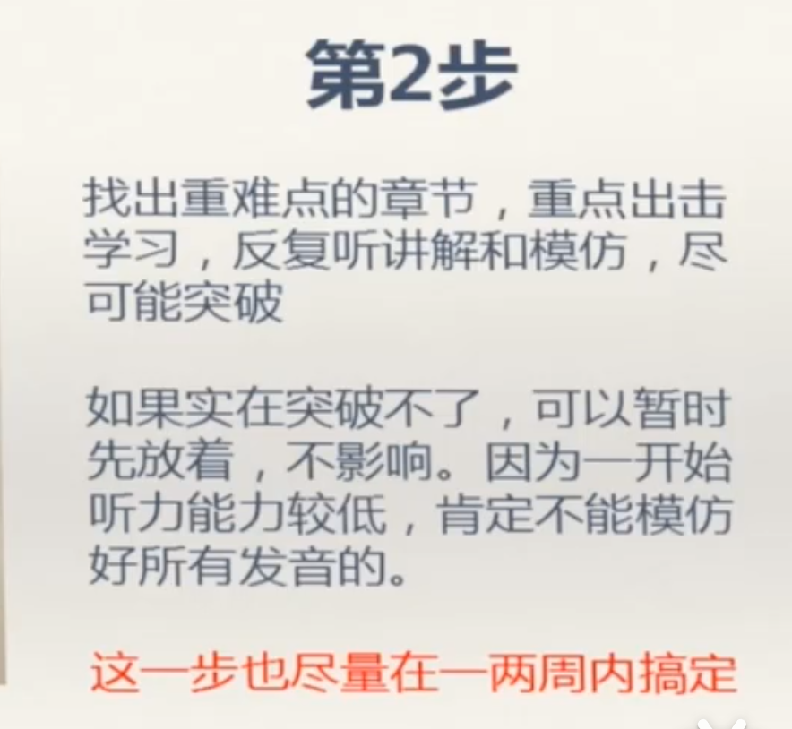

第一阶段

1-3周：正音

[《赖世雄美语音标》](https://pan.baidu.com/disk/main#/index?category=all&path=%2F%E8%B5%96%E4%B8%96%E9%9B%84)

第二阶段

1-2月：日常口语和语流练习

[coach Shane|daily easy english expression](https://www.youtube.com/@DailyEasyEnglish/videos)

第三阶段

1-2月：商业材料听力；商业领域用法；词汇积累

[三本教材推荐的原视频精准播放时间点](https://www.bilibili.com/video/BV1M4411u75G?t=1198.6&p=8)

1 interview questions answered

2 english for business meetings

3 using english at work 

[EnglishPod全新版【1-365期全文本+讲解】英语听力口语学习|未确认是否包含以上三本书](https://www.bilibili.com/video/BV1w7411g7jn?p=1&vd_source=33ac0456d389f10fb21747392b35389b)