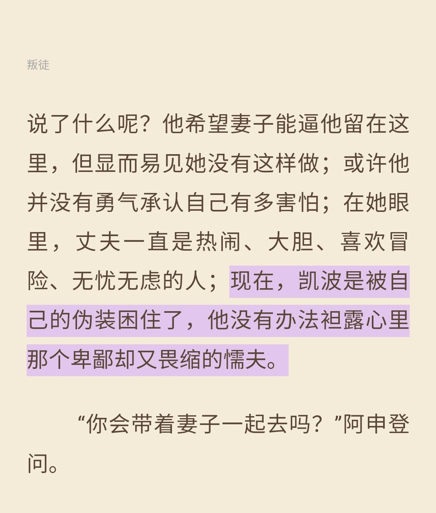

这两天都没有写日记，生病了。不是什么大病，但最是小病耗人精力，浑身无力，对温度和风都很敏感，感觉吹一阵风就会让病情加重，并且整个人由于乏力，导致很嗜睡，大部分时候都在睡觉，但长时间的睡眠并没有让我恢复多少。另外还很容易出汗，有时候出的是冷汗，在我经验中，出的汗需要及时擦干，不然很容易受凉。由于大量的出汗，很多衣服被汗湿，还有毛巾，甚至是洗发帽，可以用到的吸汗的衣物都用到了。到了今天也还在病态中，下午稍有好转，下午也是睡了很久，但是现在还是有比较大的困意。总觉得这几天是都偷走了。

这几天生病的时间中，很多东西都放下了。工作、娱乐等等，大部分时间都在休息，睡觉，甚至和朋友的联系都减少了。

昨天下午本来是要带妈妈去医院，但是我头晕，最后还是让她自己去了。今天我的情况有了好转，我还以为自己已经痊愈了，实际上去到医院后我发现还是没有的，医院很闷热，导致我又除了很多汗，明明是热出汗，但是我感觉到后背是一股寒意，我知道这不是正常的状态。

上午很快就吊完水了，因为只吊了3瓶，尽管在上先去照了CT，我们还是11点半左右就可以离开医院。原本打算是上午可以拿到CT结果，根据结果判断出院时间，好的设想是今天就可以出院。但是，CT结果被告知要下午才能拿到，所以一切被推迟到明天。希望明天可以有个好结果。中午在白土的面馆解决了，回到家我发现自己的病好像严重了，吃了点消炎类的药物就上床休息了，不知道睡到几时，醒来喊了妈妈吃药就又继续睡了，应该差不多到晚饭时分才醒来，状态也还不算很好，还是持续的出汗，甚至不是很敢洗澡，顺便一说，我已经2天没有洗澡。最后，我还是洗澡了，洗澡前还是不断出汗，我只能不断擦干，才敢洗水。最后洗完后还是不断出汗，还是不断擦汗，后面慢慢好转。

**总的来说，今天是很平常无波的一天，什么都没有做，都在休息。没有什么特殊的事情发生。**

好像还是有哪么件事值得稍微高兴的。看完了《英国特工》的一个小章节，但是我没有看动它在表达什么，满章在记录着阿申登对凯波夫妇的记录，她们是一堆间谍夫妇，最后以凯波先生的被捕，凯波夫人的崩溃结尾。倒是有看到一些有趣的句子：

可能我也是大部分时候，会被自己伪装困住的人。
