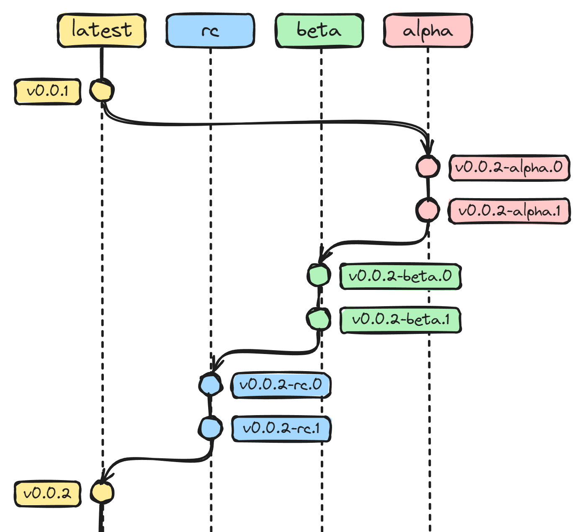
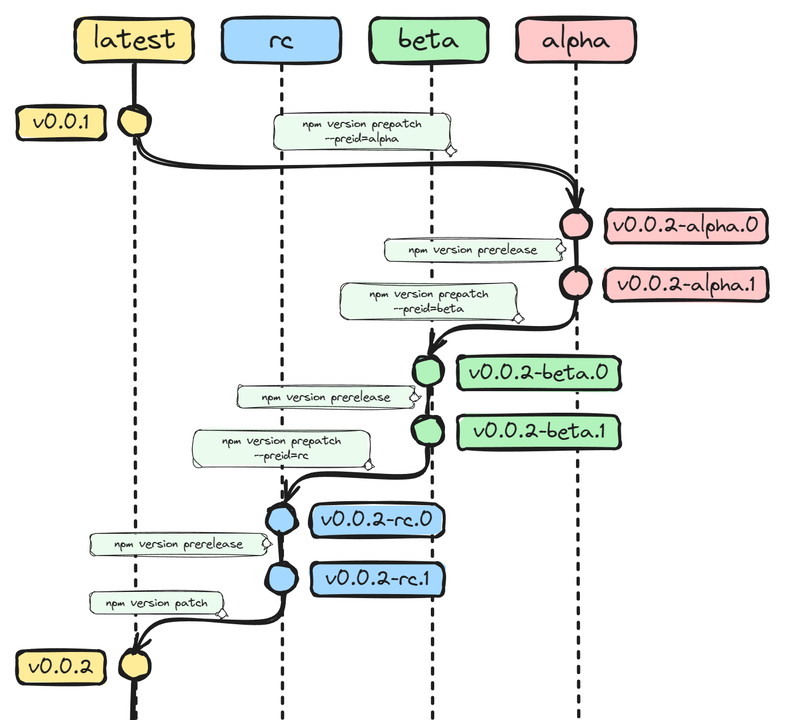

# 前言

TODO

- 为什么要开始自动化 CHANGELOG?

- 现成的自动化 CHANGELOG 有那些解决方案？

- CHANGELOG 的来源是 commits，那些 commmit 应该 自动化到 CHANGELOG ?

- commits 可以被筛选的前提是commits有规律的，意味commits需要被规范化。commits 的规范化标准如何制定？

- 人类的特性是混乱，人类是不可信的。需要强制执行 commits 规范，尽管是要求的自动化的自己！强制执行的解决方案有那些，是否存在现成的？

- 强制commit规范的原理探讨一下。


# Git Commit 规范

首先要解决的问题是

| 规范名称 | 描述 |
| --- | --- |
| [Angular规范 ↗](https://github.com/angular/angular/blob/master/CONTRIBUTING.md#commit) | Angular规范是非常流行的Git Commit规范之一，拥有众多的用户和贡献者。它提供了一套完整的Git Commit规范。Angular规范要求Commit message必须包含三个部分：类型、范围和描述。类型可以是feat、fix、docs、style、refactor、test、chore等。范围是可选的，用于表示代码变更的影响范围。描述应该清晰地描述代码变更的内容。|
| [Conventional Commits规范 ↗](https://www.conventionalcommits.org/) | Conventional Commits是一种通用的Git Commit规范，它要求Commit message必须包含三个部分：类型、作用域和描述。类型可以是feat、fix、docs、style、refactor、test、build等。作用域是可选的，用于表示代码变更的影响范围。描述应该清晰地描述代码变更的内容。Conventional Commits还支持关键词，用于表示代码变更的重要性，例如：BREAKING CHANGE表示这个Commit会破坏向后兼容性。|
| [Gitmoji规范 ↗](https://github.com/carloscuesta/gitmoji) | Gitmoji是一种基于Emoji表情符号的Git Commit规范，它要求Commit message必须包含一个Emoji表情符号，用于表示代码变更的类型。例如：:sparkles:表示新增功能，:bug:表示修复Bug，:pencil2:表示修改文档等等。Gitmoji规范还支持在Emoji后面添加一个简短的描述，用于更详细地描述代码变更的内容。|

下面是每种规范的格式的列表：

## Angular 规范

Angular 规范要求每个 commit message 都包含三个部分：Header、Body 和 Footer。其中，Header 包含一个必填字段和一个可选字段，必填字段为 Type，可选字段为 Scope。Body 和 Footer 都是可选的，用于提供更详细的信息。

**Type 字段包含以下值：**

- `feat`：新功能
- `fix`：修复问题
- `docs`：文档修改
- `style`：代码格式修改，不影响代码逻辑
- `refactor`：重构代码，既不修复错误也不添加功能
- `perf`：性能优化
- `test`：添加或修改测试代码
- `build`：构建系统或外部依赖项修改
- `ci`：持续集成修改
- `chore`：其他修改，如修改构建流程或辅助工具等
- `revert`：回滚到之前的提交

**Angular 规范的格式为：**

```shell
<type>[(scope)]: <subject>

[body]

[footer]

# e.g.
# slim
feat: add user management module

# fully
feat(users): add user management module

This commit adds the user management module to the project.

Closes #123
```
其中，`<type>` 表示 commit 的类型，`[scope]` 表示 commit 的影响范围，`<subject>` 表示 commit 的简短描述，`[body]` 表示 commit 的详细描述，`<footer>` 表示 commit 的元信息，如关闭 issue、引入变更等。


## Conventional Commits 规范

Conventional Commits 规范要求每个 commit message 都包含三个部分：Type、Scope 和 Subject。其中，Type 和 Subject 是必填的，Scope 是可选的。

**Type 包含以下值：**

- `feat`：新功能
- `fix`：修复问题
- `docs`：文档修改
- `style`：代码格式修改，不影响代码逻辑
- `refactor`：重构代码，既不修复错误也不添加功能
- `perf`：性能优化
- `test`：添加或修改测试代码
- `build`：构建系统或外部依赖项修改
- `ci`：持续集成修改
- `chore`：其他修改，如修改构建流程或辅助工具等
- `revert`：回滚到之前的提交
- `feat!`: 不兼容的新功能
- `fix!`: 不兼容的修复问题
- `docs!`: 不兼容的文档修改
- `style!`: 不兼容的代码格式修改
- `refactor!`: 不兼容的重构代码
- `perf!`: 不兼容的性能优化
- `test!`: 不兼容的添加或修改测试代码
- `build!`: 不兼容的构建系统或外部依赖项修改
- `ci!`: 不兼容的持续集成修改
- `chore!`: 不兼容的其他修改，如修改构建流程或辅助工具等

**Conventional Commits 规范的格式为：**

```shell
<type>[scope]: <subject>

[body]

[footer]

# e.g.
# slim
feat: add user management module

# fully
feat(users): add user management module

This commit adds the user management module to the project.

Closes #123
```

其中，`<type>` 表示 commit 的类型，`[scope]` 表示 commit 的影响范围，`<subject>` 表示 commit 的简短描述，`[body]` 表示 commit 的详细描述，`[footer]` 表示 commit 的元信息。

## Gitmoji 规范

以下是 Gitmoji 规范中一些常用的 emoji 和它们的含义：

- ✨ `:sparkles:`：新增功能
- 🐛  `:bug:`：修复 bug
- 📚 `:books:`：修改文档
- 💄 `:lipstick:`：修改样式
- ♻️ `:recycle:`：重构代码。
- ✅ `:white_check_mark:`：修改测试用例
- 🔧 `:wrench:`：修改构建过程或工具
- 🚀 `:rocket:`：优化性能
- 💚 `:green_heart:`：修改持续集成流程
- 📦 `:package:`：修改构建过程
- ⏪ `:rewind:`：撤销之前的提交

Gitmoji 规范的格式为：

```shell
<gitmoji> <description>

[body]

# e.g.
# slim
✨ add user management module

# fully
✨ add user management module

This commit adds the user management module to the project.
```

其中，`<gitmoji>` 是一个表情符号，表示 commit 的类型和含义，`<description>` 表示 commit 的简短描述 ,`[body]`?: commit 的详细描述。

## 小结

从以上可以看出 Conventional Commits 规范 与 Angular 规范有比较多的相同之处。是的，Conventional Commits 规范借鉴了 Angular 规范。

事实上，Conventional Commits 规范的创始人 Tim Pope 是 Karma 团队的成员，他在开发 Karma 过程中使用了 Angular 规范，认为这个规范非常有用。因此，他在 Angular 规范的基础上，扩充和修改了一些内容，提出了 Conventional Commits 规范。可以说，Conventional Commits 规范是在 Angular 规范的基础上发展而来的，但是相对于 Angular 规范，Conventional Commits 规范更加通用，可以适用于更多的项目和开发语言。

*以下是 Angular 规范和 Conventional Commits 规范在某些方面存在的一些差异，具体如下：*

- **Header 格式不同**：Angular 规范要求 Header 必须包含 Type 字段和可选的 Scope 字段，如 "feat(core): add new feature"；而 Conventional Commits 规范要求 Header 必须包含 Type 和 Subject 字段，Scope 字段是可选的，如 "feat: add new feature"。

- **Type 值的定义略有不同**：Angular 规范和 Conventional Commits 规范都定义了一些 Type 值，但有些值的含义略有不同。例如，Conventional Commits 规范将 "build" 和 "ci" 两个 Type 值分别定义为构建和持续集成修改，而 Angular 规范将它们合并为 "build"。

- **Conventional Commits 规范定义了特殊的 Type 值**：Conventional Commits 规范定义了一些特殊的 Type 值，如 "feat!" 和 "fix!"，用于表示不兼容的新功能或修复问题。而 Angular 规范没有这样的定义。

Gitmoji 规范的显著特点是供了大量的 emoji 来描述不同类型和目的的 Git 提交，这使得开发者可以更加准确地描述自己的 Git 提交，简单易懂，具有很强的可读性。Commit的格式在一定程度上与前两者有相似之处，从提出时间上看，它算是采百家之长的集大成者了。

Gitmoji 规范的制定者 Carlos Cuesta 在规范的 Github 页面上并没有明确提到他借鉴了哪些规范。然而，从 Gitmoji 规范的内容来看，它借鉴了一些其他的规范和标准，例如：

- **Emoji**：Gitmoji 规范使用 Emoji 表情符号来表示不同类型的提交，这一做法和 Slack、微信等工具中使用 Emoji 表情符号的方式类似。

- **Semantic Versioning**：Gitmoji 规范中使用了类似 Semantic Versioning 的方式来表示版本，例如 ":bookmark:" 表示打标签，":bookmark: v1.0.0" 表示打了一个 v1.0.0 的标签。

- **Conventional Commits**：Gitmoji 规范和 Conventional Commits 规范类似，都是使用 commit message 来描述代码库的变化。不过，Gitmoji 规范使用 Emoji 表情符号来表示不同类型的提交，而 Conventional Commits 规范使用文本标识符来表示。


# 强制 commit 规范

从上面知道了有Angular 规范、Conventional Commits 规范和 Gitmoji 规范。当然，我们可以自发遵循的这些规范去编写 commit，可是人不是机器，最大的特性是混乱，难免有出错的时候。因此，需要一些工具来辅助输出符合规范的commit。

下面从两个方向去操作：

1. 基础：添加 commit 语法检测；

2. 优化：添加工具辅助编写 commit，提高易用性。

## Commit 语法检测

[Commitlint ↗] 是一个用于检查 commit message 是否符合规范的工具，可以自定义规则和配置。它支持多种规范，如 Angular 规范、Conventional Commits 规范、ESLint 规范等。

[Commitlint ↗] 的作用仅仅是检测 Commit 语法。还需要使用 Git Hook （`commit-msg`）拦截 `git commit` 动作以达到强制执行规范的目的。

> **commit-msg**
> This hook is invoked by [git-commit[1]](https://git-scm.com/docs/git-commit) and [git-merge[1]](https://git-scm.com/docs/git-merge), and can be bypassed with the `--no-verify` option. It takes a single parameter, the name of the file that holds the proposed commit log message. Exiting with a non-zero status causes the command to abort.
>
> <mark>The hook is allowed to edit the message file in place, and can be used to normalize the message into some project standard format. It can also be used to refuse the commit after inspecting the message file.</mark>
>
> The default commit-msg hook, when enabled, detects duplicate `Signed-off-by` trailers, and aborts the commit if one is found.
>
> Refenrence: [githooks - Hooks used by Git]


[Husky ↗](https://typicode.github.io/husky/) 是一个 Git hook 工具，它可以在 Git 执行特定操作时自动触发预定义的脚本。常用于配合 Commitlint 进行 commit message 的校验。与原生的 Git hook 相比，Husky 有以下优点：

- **易于使用**：Husky 提供了简单易用的 API，可以轻松地在项目中添加和配置 Git hook。与原生的 Git hook 相比，Husky 的配置更加直观和简单，不需要手动编写脚本。

- **跨平台支持**：Husky 可以在 Windows、Linux、macOS 等多个平台上运行，而原生的 Git hook 可能会因为操作系统和 shell 的不同而产生兼容性问题。

- **更强大的功能**：Husky 支持多个 Git hook，可以在不同的 Git 操作时自动触发相应的任务。而原生的 Git hook 只支持有限的几个 hook，需要手动编写脚本来实现更复杂的功能。

- **安全性**：Husky 的配置文件存储在项目的 package.json 文件中，这意味着可以将配置文件提交到代码仓库中进行版本控制，保证配置的安全性和一致性。而原生的 Git hook 需要手动将 hook 脚本添加到 .git/hooks 目录中，容易被意外覆盖或删除。

*因此，接下来需要做的事情是，安装 Husky，配置 `commit-msg` 拦截`git commit` 动作，再安装 Commitlint 对拦截到的 commit 信息进行校验。*

### 安装 Husky

```shell
# npm
npm install husky --save-dev

# pnpm
pnpm add husky --save-dev
```

使用 Husky 安装 Git Hooks

```shell
# npx 调用 局部命令 husky 
npx husky install

# 直接路径访问局部命令 husky
./node_modules/.bin/husky install
```

<details open>
  <summary><strong>💡 npx 是什么？</strong></summary>
  <blockquote>
    <br/>
    <p><code>npx</code>是一个Node.js命令行工具，它提供了一种方便的方式来运行本地安装的Node.js包中的可执行文件。npx的作用是在不全局安装包的情况下，运行这些包中的命令。</p>
    <p>通常情况下，在运行命令行工具时，需要全局安装相关的包和依赖项。但是，这种方式可能会导致一些问题，例如不同版本的包之间的冲突，或者需要手动更新全局安装的包等。<code>npx</code>提供了一个解决方案，可以在不全局安装包的情况下，运行这些包中的命令。</p>
    <p>使用<code>npx</code>，可以直接在命令行中指定需要运行的包和命令，<code>npx</code>将会自动查找并运行该包中的命令。例如，可以使用以下命令运行&quot;<code>create-react-app</code>&quot;包中的命令来创建一个新的React应用程序：</p>
    <pre><code>npx create-react-app my-app</code></pre>
    <p>在这个例子中，<code>npx</code>将在本地查找&quot;<code>create-react-app</code>&quot;包，并运行它中的&quot;<code>create-react-app</code>&quot;命令，然后使用&quot;<code>my-app</code>&quot;作为应用程序的名称创建一个新的React应用程序。</p>
    <p>更多 npx 相关信息可参考：<a href="https://docs.npmjs.com/cli/v9/commands/npx">Npx | Run a command from a local or remote npm package</a></p>
    <br/>
  </blockquote>
</details>
<br/>

添加 `prepare` 脚本到 `package.json` 的 `scripts` 中，使得在新环境初始化项目时，自动安装 Git Hooks。

📢 *此为可选操作，不做也不影响后续操作，但是推荐执行*

```shell
npm pkg set scripts.prepare="husky install"

# 执行以上命令得到的结果是：
{
  "scripts": {
+    "prepare": "husky install" 
  }
}
```

> **prepare (since npm@4.0.0)**
>
> Runs BEFORE the package is packed
> Runs BEFORE the package is published
> <mark>Runs on local "npm install" without any arguments</mark>
> Run AFTER `prepublish`, but BEFORE `prepublishOnly`
> NOTE: If a package being installed through git contains a `prepare` script, its `dependencies` and `devDependencies` will be installed, and the prepare script will be run, before the package is packaged and installed.
>
> Refenrence: [How npm handles the "scripts" field]

Husky 配置 Hooks 的方式如下

```shell
npx husky add .husky/<git hook> "<command that needs to be executed when the hook is triggered>"

# e.g.
# 将在 `git commit` 执行前触发 `npm test` 命令
npx husky add .husky/pre-commit "npm test"
```


至此，Git Hooks 的准备工作已经完成，`commit-msg` 钩子的配置要在 commitlint 安装完成后配置。

### 安装 Commitlint

`@commitlint` 是一个由多个相关包组成的集合，可以根据需要安装和配置这些包来实现不同的功能。

`@commitlint` 的核心包是`@commitlint/cli`，它提供了命令行工具，用于检查提交信息是否符合规范。`@commitlint/cli`可以通过命令行参数来指定规范，也可以通过配置文件来指定规范。例如，可以使用`@commitlint/config-conventional`包来定义一个常规的提交信息规范，然后使用`@commitlint/cli`来检查提交信息是否符合该规范。

除了`@commitlint/cli`之外，@commitlint还提供了其他几个相关包，包括：

- `@commitlint/load`: 提供了一个函数，用于加载配置文件并解析它们，以便`@commitlint/cli`可以使用它们进行检查。
- `@commitlint/config-conventional`: 提供了一组常见的规范，用于检查常规的Git提交信息格式。
- `@commitlint/config-angular`: 提供了一个用于检查Angular项目的提交信息规范。
- `@commitlint/config-lerna-scopes`: 提供了一个用于检查Lerna项目的提交信息规范。
- [更多相关包...](https://github.com/conventional-changelog/commitlint/tree/master/%40commitlint)

这些包可以根据具体需要进行安装和配置。

---

📢 *根据当前的需求，接下来则安装 `@commitlint/cli` 和 `@commitlint/config-conventional`(Conventional Commits 规范)*


```shell
# npm
npm install --save-dev @commitlint/config-conventional @commitlint/cli

# pnpm
pnpm add --save-dev @commitlint/config-conventional @commitlint/cli
```

添加 配置文件

`@commitlint/cli` 支持以下这些默认的配置文件名：

- `commitlint.config.js`
- `.commitlintrc.js`
- `.commitlintrc`
- `.commitlintrc.json`
- `.commitlintrc.yml`

为了避免切换模块化语法问题，接下来使用 `.commitlintrc.yml` 作为配置文件

```yml
# .commitlintrc.yml

# 使用 extends 引用 @commitlint/config-conventional 规范
extends:
  - '@commitlint/config-conventional'
```

更多的配置项参考：[Commitlint > Configuration]


### Husky + Commitlint

使用 Husky 设置 `commit-msg` 钩子执行 `commitlint-cli`, 对 `git commit` 动作提交的信息进行校验。

```shell
npx husky add .husky/commit-msg  'npx --no -- commitlint --edit ${1}'
```

在这个命令中，`--no` 参数是用来禁用 `npx` 的默认行为的。

默认情况下，`npx` 会在运行目标命令之前检查本地是否已经安装了目标命令所在的包，如果没有安装，则会先安装该包，然后再运行目标命令。这种行为通常是有用的，因为它可以确保运行的命令使用的是最新的包版本，并且可以避免不同版本之间的兼容性问题。

但是，在某些情况下，我们可能不想让 `npx` 自动安装包，而是希望使用本地已经安装的包。在这种情况下，可以使用 `--no` 参数来禁用 `npx` 的默认行为，以便直接使用本地安装的包。

在这个具体的命令中，`--no` 参数用来禁用 `npx` 自动安装 `commitlint` 包，而是使用本地已经安装的 `commitlint` 包。

`--edit ${1}` 是用来编辑指定文件的第一个参数的提交信息，`${1}` 代表第一个参数的值，通常是一个文件路径。这个命令的作用是使用本地安装的 `commitlint` 包来检查指定文件的提交信息是否符合规范，并在编辑器中打开该文件，以便修改提交信息。


## 半自动编写 Commit

以下是使用 Markdown 表格输出 @commitlint/prompt-cli 和 Commitizen 的信息：

| 工具名称 | 描述 | npm周下载量（2023/07/17） |
| --- | --- | --- |
| [@commitlint/prompt-cli ↗](https://www.npmjs.com/package/@commitlint/prompt-cli) | 一个命令行交互式工具，用于帮助开发人员规范化提交信息。它使用 `commitlint` 配置文件中定义的规则来检查提交信息，确保它们符合预定的格式和风格。该工具还提供了一些提示，帮助开发人员更好地理解如何编写符合规则的提交信息。 | *67,802* |
| [Commitizen ↗](github.com/commitizen/cz-cli) | 一个命令行交互式工具，用于帮助开发人员规范化提交信息。它使用预定义的提交信息模板来引导开发人员编写符合规则的提交信息，并根据模板中的规则进行验证。与@commitlint/prompt-cli不同的是，Commitizen不检查提交信息是否符合commitlint配置文件中定义的规则，而是依靠模板中的规则来确保提交信息的正确性。此外，Commitizen还提供了一些功能，例如自动填充提交信息，以帮助开发人员更快地编写提交信息。 | *917,033* |


```shell
# npm
npm add @commitlint/prompt-cli --save-dev

# pnpm
pnpm add @commitlint/prompt-cli --save-dev
```


# CHANGELOG自动化

## conventional-changelog-cli

`conventional-changelog-cli` 是一个命令行工具，用于生成符合规范的 changelog。它可以根据项目的 commit message 格式，自动解析 commit 信息，并将其转换为人类可读的 changelog。

这个工具的基本原理是将符合规范的 commit message 按照类型（type）和 scope 等信息进行分类，然后根据分类的结果生成 changelog。

`conventional-changelog-cli` 支持使用多种预设（preset）来生成 changelog，包括 `angular`、`atom`、`codemirror`、`conventionalcommits`、`ember`、`eslint`、`express`、`jquery` 和 `jshint` 等。你也可以使用自定义的配置文件来生成 changelog。

以下是 `conventional-changelog-cli` 的一些常用命令：

- `conventional-changelog`: 生成 changelog，默认使用 Angular 规范。

- `conventional-changelog -p [preset]`: 生成指定预设的 changelog。

- `conventional-changelog -i [file]`: 将 changelog 写入到指定文件中。

- `conventional-changelog -s`: 将 changelog 添加到文件的开头而不是结尾。

- `conventional-changelog --release-count [number]`: 指定要包括的版本数量。

- `conventional-changelog --config [file]`: 使用自定义的配置文件生成 changelog。

通过 `conventional-changelog-cli`，你可以方便地生成符合规范的 changelog，并且可以根据自己的需要进行自定义配置和预设，以满足项目的需求。

📢 *在默认情况下，`conventional-changelog-cli` 会匹配 `feat`、`fix` 类型的commits，并根据它们生成CHANGELOG*

<blockquote>
  <br/>
  <pre><code class="language-shell">npm install -g conventional-changelog-cli
  cd my-project
  conventional-changelog -p angular -i CHANGELOG.md -s
  </code></pre>
  <p>This will not overwrite any previous changelogs. <mark>The above generates a changelog based on commits since the last semver tag that matches the pattern of &quot;Feature&quot;, &quot;Fix&quot;, &quot;Performance Improvement&quot; or &quot;Breaking Changes&quot;.</mark></p>
  <br/>
</blockquote>


### 安装

```shell
# npm
npm install conventional-changelog-cli --save-dev

# pnpm
pnpm add conventional-changelog-cli --save-dev
```

### 使用

```shell
npx conventional-changelog -p conventionalcommits -i CHANGELOG.md -s
```
- `-p conventionalcommit`：指定使用 conventionalcommit 规范生成 CHANGELOG 文件。`conventionalcommit` 是一种常见的规范，适用于大多数项目。

- `-i CHANGELOG.md`：指定将生成的 CHANGELOG 文件输出到名为 `CHANGELOG.md` 的文件中。如果该文件不存在，则会创建它；如果已存在，则会覆盖它。

- `-s`：指定生成的 CHANGELOG 文件中是否应包含当前版本之前的所有版本的变更记录。默认情况下，只会生成当前版本的变更记录。


**结合 `npm version` 使用**

```shell
# package.json
{
  "scripts": {
    "version": "conventional-changelog -p angular -i CHANGELOG.md -s && git add CHANGELOG.md"
  }
}

# cli
npm version <version>
```

具体来说，当您执行 `npm version` 命令时，会按照以下顺序执行：

- 执行 `scripts.version` 脚本，如果已经定义的话。`scripts.version` 脚本会返回一个字符串，表示新的版本号，如果没有定义 `scripts.version` 脚本，则使用默认的 SemVer 规范生成版本号。

- 将新的版本号更新到 package.json 文件中。

- 自动化执行 Git 操作，包括添加修改的 package.json 和生成的 changelog 文件、提交代码并打 Git tag。

因此执行 `npm version <version>`的结果是：1）更新 `package.json` 的 `version` 字段；2）更新 CHANGELOG；3）生成包含 1、2 的 commit 和 git-tag。

**修改 version-commit**

默认的 `version-commit` 是下面这样的：

```shell
commit 1d37dcf6dc685d0a49319d0c2e0a0a272af8fa7a (tag: v3.3.8)
Author: isaaxite <isaacgun@outlook.com>
Date:   Tue Jul 25 05:00:36 2023 +0800

    3.3.8
```

显然这样是不符合规范的。下面有 2 个方法可是使之合乎规范。

*手动设置*

```shell
# %s 是版本号的占位符

npm version patch -m "chore: bump version to %s"
```

*配置文件设置*

```shell
# .npmrc

commit-hooks=true
tag-version-prefix=v
message="chore: bump version to %s"
```

### 配置

从 `conventional-changelog-cli` 的 README 中没有太多关于配置的信息，仅仅是引导去查阅 `conventional-changelog` 和 `conventional-changelog-core`。

从其他的一些参考资料确实有介绍 `conventional-changelog-cli` 是基于 `conventional-changelog-core` 开发的。

>To fully customize the tool, please checkout <mark>conventional-changelog</mark> and <mark>conventional-changelog-core</mark> docs. You can find more details there. Note: config here can work with preset, which is different than options.config in conventional-changelog.

但是，实际上 `conventional-changelog` 并没有太多关于配置的信息，仅仅是一个类似一个一级引导页的README!

而 `conventional-changelog-core` 相对有用一点，会介绍 API 的参数，但是并没有明确那些参数是可以复用到配置文件上的。

使用 `conventional-changelog --help` 有看到关于配置相关的描述：


> `-n, --config`  A filepath of your config script Example of a config script: https://github.com/conventional-changelog/conventional-changelog/blob/master/packages/conventional-changelog-cli/test/fixtures/config.js


打开的是一个过于简单的页面，并没有注释介绍参数作用，有用的参考信息约等于没有！

```js
'use strict'

module.exports = {
  writerOpts: {
    mainTemplate: '{{commitGroups.[0].commits.[0].type}}{{testContext}}template'
  }
}
```

*综合以上，基本可以认识到一个事实：*

**`conventional-changelog-cli` 具备配置的能力，但是缺少配置指引，以致配置体验不友好。基本可以认为这个工具的配置能力约等于“无”**

---

*本着研究的态度阅读 `conventional-changelog-cli` 的源码，探索它的配置详情！*

通过阅读 `conventional-changelog-cli/cli.js` 代码，发现以下5个配置项可以从从配置文件中读取：

- `options`

- `templateContext`

- `gitRawCommitsOpts`

- `parserOpts`

- `writerOpts`

```js
try {
  if (flags.context) {
|   templateContext = require(resolve(process.cwd(), flags.context))
  }

  if (flags.config) {
|   config = require(resolve(process.cwd(), flags.config))
    options.config = config

    if (config.options) {
|     options = {
        ...options,
        ...config.options,
        pkg: {
          ...options.pkg,
          ...config.options.pkg
        }
      }
    }
  } else {
    config = {}
  }
} catch (err) {
  console.error('Failed to get file. ' + err)
  process.exit(1)
}

const gitRawCommitsOpts = {
| ...config.gitRawCommitsOpts
}

const changelogStream = conventionalChangelog(
  options, 
  templateContext, 
  gitRawCommitsOpts, 
| config.parserOpts, 
| config.writerOpts
)
```

在源码中可以知道, 以上 5 个配置项分别读取自不同的2个文件，它们分别是 `context` 配置文件 和 `config` 配置文件。

```js
// context
templateContext = require(resolve(process.cwd(), flags.context))

// config
config = require(resolve(process.cwd(), flags.config))
```

`context` 配置文件：

- `templateContext`


`config` 配置文件：

- `options`

- `gitRawCommitsOpts`

- `parserOpts`

- `writerOpts`

`npx conventional-changelog --help` 中关于 `context` 配置文件 和 `config` 配置文件的描述

> `-c, --context` A filepath of a json that is used to define template variables
>
> `-n, --config`  A filepath of your config script. Example of a config script: https://github.com/conventional-changelog/conventional-changelog/blob/master/packages/conventional-changelog-cli/test/fixtures/config.js


结合 `--help`的描述和配置文件的引入方式（`require`），可以推断 `context` 配置文件 和 `config` 配置文件的内容和语法。

*`context` 配置文件*

支持的配置项及其详情参考：[conventional-changelog-writer > context](https://github.com/conventional-changelog/conventional-changelog/tree/master/packages/conventional-changelog-writer#context)

```js
/*
conventional-changelog.context.js

支持的配置项参考：
https://github.com/conventional-changelog/conventional-changelog/tree/master/packages/conventional-changelog-writer#context
*/
module.exports = {
  // ...
}
```

使用`context` 配置文件：

```shell
npx conventional-changelog --context conventional-changelog.context.js
```


*`config` 配置文件*

支持的4个配置项及其详情参考：

- `gitRawCommitsOpts`: [conventional-changelog/packages/git-raw-commits > gitopts](https://github.com/conventional-changelog/conventional-changelog/tree/master/packages/git-raw-commits#gitopts)

- `parserOpts`: [conventional-commits-parser > options](https://github.com/conventional-changelog-archived-repos/conventional-commits-parser#options)

- `writerOpts`: [conventional-changelog-writer > options](https://github.com/conventional-changelog/conventional-changelog/tree/master/packages/conventional-changelog-writer#options)

- `options`: [conventional-changelog-core > options](https://github.com/conventional-changelog/conventional-changelog/tree/master/packages/conventional-changelog-core#options)

```js
// conventional-changelog.config.js

module.exports = {
  // 参考：https://github.com/conventional-changelog/conventional-changelog/tree/master/packages/git-raw-commits#gitopts
  gitRawCommitsOpts: {
    // ...
  },

  // 参考：https://github.com/conventional-changelog-archived-repos/conventional-commits-parser#conventionalcommitsparseroptions
  parserOpts: {
    // ...
  },

  // 参考：https://github.com/conventional-changelog/conventional-changelog/tree/master/packages/conventional-changelog-writer#options
  writerOpts: {
    // ...
  },

  // 参考：https://github.com/conventional-changelog/conventional-changelog/tree/master/packages/conventional-changelog-core#options
  options: {
    // ...
  }
}
```

使用`config` 配置文件：

```shell
npx conventional-changelog --config conventional-changelog.config.js
```


### preset

Standard Version 是一个命令行工具，可用于自动生成符合语义化版本规范的版本标签和 CHANGELOG。它使用 Git 元数据（如提交消息）来确定下一个版本号，然后生成标签和更新日志。

`standard-version` 和 `conventional-changelog-cli` 都是基于 `conventional-changelog` 实现的工具。

但是有别于 `conventional-changelog-cli`, `standard-version` 是明确支持配置文件，并且有较为详细的指引介绍如何配置([Standard Version > configuration](https://github.com/conventional-changelog/standard-version#configuration))。

> **Configuration**
>
> You can configure `standard-version` either by:
>
> Placing a `standard-version` stanza in your package.json (assuming your project is JavaScript).
<mark>Creating a '.versionrc', '.versionrc.json' or '.versionrc.js'.</mark>
> If you are using a `.versionrc.js` your default export must be a configuration object, or a function returning a configuration object.
> Any of the command line parameters accepted by `standard-version` can instead be provided via configuration. <mark>Please refer to the [conventional-changelog-config-spec](https://github.com/conventional-changelog/conventional-changelog-config-spec/) for details on available configuration options.</mark>

`standard-version` 配置文件的包含全部设置项的例子：
```js
// .versionrc.js

module.exports = {
  header: '# Changelog',
  types: [
    { type: 'feat', section: 'Features' },
    { type: 'fix', section: 'Bug Fixes' },
    { type: 'chore', hidden: true },
    { type: 'docs', hidden: true },
    { type: 'style', hidden: true },
    { type: 'refactor', hidden: true },
    { type: 'perf', hidden: true },
    { type: 'test', hidden: true }
  ],
  preMajor: false,
  commitUrlFormat: '{{host}}/{{owner}}/{{repository}}/commit/{{hash}}',
  compareUrlFormat: '{{host}}/{{owner}}/{{repository}}/compare/{{previousTag}}...{{currentTag}}',
  issueUrlFormat: '{{host}}/{{owner}}/{{repository}}/issues/{{id}}',
  userUrlFormat: '{{host}}/{{user}}',
  releaseCommitMessageFormat: 'chore(release): {{currentTag}}',
  issuePrefixes: [ '#' ]
}
```

*两者都基于相同上游库开发，但是只有 `standard-version` 支持配置，而且是有别于上面 `conventional-changelog-cli` 介绍过的配置方式。这是为什么？*

*抱着这个疑问阅读 `standard-version` 相关的代码！*


```js
// standard-version/lib/lifecycles/changelog.js

const changelogStream = conventionalChangelog({
  debug: args.verbose && console.info.bind(console, 'conventional-changelog'),
  preset: presetLoader(args),
  tagPrefix: args.tagPrefix
}, context, { merges: null, path: args.path })
```
 
**🔬 通过“打印”的方式确认了是 `presetLoader(args)` 引入了 `.versionrc.js` 的配置内容**

*与上面例子有所区别是，在例子的基础上有增了 `name` 属性：*

```js
{
  // ...
  name: '/home/isaac/workspace/temp/node_modules/.pnpm/conventional-changelog-conventionalcommits@4.6.3/node_modules/conventional-changelog-conventionalcommits/index.js',
  // ...
}
```

从 `npx conventional-changelog --help` 的描述上看，`--preset` 是指定 commit 规范。而 `--preset` 的设置值仅仅一个较短字符串，而不是上面探索到的对象形式的值。

> `-p, --preset`  Name of the preset you want to use. Must be one of the following: angular, atom, codemirror, conventionalcommits, ember, eslint, express, jquery or jshint

从上面 `standard-version` 的源码可知道， `preset` 是对应到前文 `conventional-changelog.config.js` 中的 `options.preset`，基于以上信息，进行下面的尝试。

```js
// conventional-changelog.config.js

module.exports = {
  // ...
  options: {
    preset: {
      name: '/home/isaac/workspace/temp/node_modules/.pnpm/conventional-changelog-conventionalcommits@4.6.3/node_modules/conventional-changelog-conventionalcommits/index.js',
      header: '# Changelog',
      types: [
        { type: 'feat', section: 'Features' },
        { type: 'fix', section: 'Bug Fixes' },
        { type: 'chore', hidden: true },
        { type: 'docs', hidden: true },
        { type: 'style', hidden: true },
        { type: 'refactor', hidden: true },
        { type: 'perf', hidden: true },
        { type: 'test', hidden: true }
      ],
      preMajor: false,
      commitUrlFormat: '{{host}}/{{owner}}/{{repository}}/commit/{{hash}}',
      compareUrlFormat: '{{host}}/{{owner}}/{{repository}}/compare/{{previousTag}}...{{currentTag}}',
      issueUrlFormat: '{{host}}/{{owner}}/{{repository}}/issues/{{id}}',
      userUrlFormat: '{{host}}/{{user}}',
      releaseCommitMessageFormat: 'chore(release): {{currentTag}}',
      issuePrefixes: [ '#' ]
    }
  }
};
```

详细设置项参考：[conventional-changelog-config-spec](https://github.com/conventional-changelog/conventional-changelog-config-spec/) 

**结论是可以的！**

但是，并不是全部属性都有效果！下面是几个尝试后得到的结论：

- `name`，必选设置，preset 的设置项生效的前提是们需要设置 `name` 属性。这是测试出来的结果，没有继续深挖！`name` 属性在两种设置方式下有效：1）如上面文件的；2）`name: 'conventional-changelog-conventionalcommits'`;

- `header`，无效。查阅了 `standard-version` 的源码。关于 header 的实现，是独立与 `conventional-changelog` 的，所以不生效也正常。

- `types`，正常有效的。

- 其他，正常有效。
  - `preMajor`
  - `commitUrlFormat`
  - `compareUrlFormat`
  - `issueUrlFormat`
  - `userUrlFormat`
  - `releaseCommitMessageFormat`
  - `issuePrefixes`

#### 小结

通过 preset 配置 `conventional-changelog-cli` 是从源码中得到的非正道的知识，在 conventional-changelog 的工具集中并没有相关的资料说明可以使用preset通过对象形式值去配置。所以这是一个不推荐在生产项目下使用的功能，是个不被保证的功能。


## Standard Version

Standard Version 和 conventional-changelog-cli 都是用于自动生成版本更新和 CHANGELOG 的命令行工具。它们都是基于 `conventional-changelog` 事先。

Standard Version 除了能够生成 CHANGELOG 之外，还能够自动创建 Git 标签、增加版本号，以及自动推送标签到 Git 仓库等。conventional-changelog-cli 则只是生成 CHANGELOG 文件。

Standard Version 的社区支持度相对来说更高，有较多的用户和贡献者，开发维护更新也更加频繁。而 conventional-changelog-cli 的社区支持度相对较低，开发维护更新也不如 Standard Version 频繁。


### 安装

```shell
# npm
npm install standard-version --save-dev

# pnpm
pnpm add standard-version --save-dev
```

### 使用

```js
{
  "scripts": {
    "release": "standard-version"
  }
}
```
Standard Version 是推荐使用它来代替 `npm version` 进行版本管理的。

Standard Version 将版本管理与 CHANGELOG 结合在一起，在使用 `standard-version` 更新版本号时，会自动触发 CHANGELOG 的更新。

```shell
# release
npx standard-version -r 0.0.1

npx standard-version -r 0.0.1-0
npx standard-version -r 0.0.1-1

npx standard-version -r 0.0.1-beta.0
npx standard-version -r 0.0.1-beta.1
```

### 配置

默认的配置文件名是：`.versionrc`, `.versionrc.json` or `.versionrc.js`

详细设置项参考：[conventional-changelog-config-spec](https://github.com/conventional-changelog/conventional-changelog-config-spec/) 

```js
// .versionrc.js

module.exports = {
  header: '# Changelog',
  types: [
    { type: 'feat', section: 'Features' },
    { type: 'fix', section: 'Bug Fixes' },
    { type: 'chore', hidden: true },
    { type: 'docs', hidden: true },
    { type: 'style', hidden: true },
    { type: 'refactor', hidden: true },
    { type: 'perf', hidden: true },
    { type: 'test', hidden: true }
  ],
  preMajor: false,
  commitUrlFormat: '{{host}}/{{owner}}/{{repository}}/commit/{{hash}}',
  compareUrlFormat: '{{host}}/{{owner}}/{{repository}}/compare/{{previousTag}}...{{currentTag}}',
  issueUrlFormat: '{{host}}/{{owner}}/{{repository}}/issues/{{id}}',
  userUrlFormat: '{{host}}/{{user}}',
  releaseCommitMessageFormat: 'chore(release): {{currentTag}}',
  issuePrefixes: [ '#' ]
};
```

# 工作流

1. 添加修改；

2. 提交 commits；

3. 重复1、2直到需要发布版本；

4. 生成 CHANGELOG, 并将 CHANGELOG 的变动添加version commit中，生成git-tag；

5. 提交git-tag；

6. 发布版本至 npm；


## 版本管理

Node.js 遵循的版本号命名规范是 **语义化版本号**（SemVer）规范。很多 Node.js 模块和库的版本号也同样如此。

SemVer 规范定义了一个三位数字的版本号，格式为 `MAJOR.MINOR.PATCH`，其中：

- `MAJOR`：主版本号，表示不兼容的 API 变化或重大功能变化。
- `MINOR`：次版本号，表示向后兼容的新功能添加。
- `PATCH`：补丁版本号，表示向后兼容的 bug 修复。

除了这三位数字之外，SemVer 规范还可以包含一个预发布版本号和一个构建版本号。预发布版本号以连字符 `-` 开头，构建版本号以加号 `+` 开头，例如 `1.2.3-beta+build.123` 表示预发布版本号为 `beta`，构建版本号为 `build.123`。

预发布版本号可以使用以下标识符：

- `alpha`：表示内部测试版本或仍在开发中的不稳定版本，可能会包含较多的 bug，不建议用于生产环境。

- `beta`：表示公开测试版本，已经完成了主要功能的开发，但仍需要进行测试和 bug 修复，建议用于测试环境和开发环境。

- `rc`：表示候选版本（Release Candidate），已经完成了所有的功能开发和测试，可以用于生产环境，但仍需要进行最后的测试和验证。

需要注意的是，不同的项目可能会有自己的预发布版本号约定，以上标识符仅是语义化版本号规范中常见的预发布版本号标识符。在实际项目中，可以根据项目的特点和需求，自定义预发布版本号标识符。



*以下是常用的几个命令：*

- 补丁（patch）预发布版本

```shell
# npm-version
npm version prepatch --preid <preid-1>
# ~ or ~
npm version prepatch --preid=<preid-1>

# standard-version
npx standard-version --release-as patch --prerelease <preid-1>
# ~ or ~
npx standard-version -r patch -p <preid-1>
```

- 次（minor）预发布版本

```shell
# npm-version
npm version preminor --preid=<preid-1>

# standard-version
npx standard-version -r minor -p <preid-1>
```

- 主（major）预发布版本

```shell
# npm-version
npm version premajor --preid=<preid-1>

# standard-version
npx standard-version -r major -p <preid-1>
```

- 基于当前预发布的 `preid` 自增预发布版号

```shell
# npm-version
npm version prerelease

# standard-version
npx standard-version -p
```

- 切换至下一个阶段的 `preid`

```shell
# npm-version
npm version prerelease --preid=<preid-next>

# standard-version
npx standard-version -p <preid-next>
```

- 正式发布

```shell
# 如果最初是以 npm version prepatch 开始
# npm-version
npm version patch
# ~ or ~
# standard-version
npx standard-version -r patch

# 如果最初是以 npm version preminor 开始
# npm-version
npm version minor
# ~ or ~
# standard-version
npx standard-version -r minor

# 如果最初是以 npm version premajor 开始
# npm-version
npm version major
# ~ or ~
# standard-version
npx standard-version -r major
```

*下面以发布补丁的预发布版本为例，假定初始版本是 `0.0.1`*

**Step-1**：更新补丁的 `alpha` 预发布版本

```shell
npm version prepatch --preid=alpha
# output: 0.0.2-alpha.0

# standard-version
npx standard-version --release-as patch --prerelease alpha
# ~ or ~
npx standard-version -r patch -p alpha
```

**Step-2**：更新补丁的 `alpha` 预发布版本版号自增

```shell
npm version prerelease
# output: 0.0.2-alpha.1

# standard-version
npx standard-version -p
```

**Step-3**：更新补丁的下一个阶段的预发布版本，`beta`

```shell
# 切换预发布版本至 beta
npm version prerelease --preid=beta
# output: 0.0.2-beta.0

# standard-version
npx standard-version -p beta
```

**Step-4**：更新补丁的 `beta` 预发布版本版号自增

```shell
# 在beta上，自增预发布版号
npm version prerelease
# output: 0.0.2-beta.1

# standard-version
npx standard-version -p
```

**Step-5**：更新补丁的下一个阶段的预发布版本，`rc`

```shell
# 切换预发布版本至 rc
npm version prerelease --preid=rc
# output: 0.0.2-rc.0

# standard-version
npx standard-version -p rc
```

**Step-6**：更新补丁的 `rc` 预发布版本版号自增

```shell
# 在rc上，自增预发布版号
npm version prerelease
# output: 0.0.2-rc.1

# standard-version
npx standard-version -p
```

**Step-7**: 发布正式版本

```shell
npm version patch
# output: 0.0.2

# standard-version
npx standard-version -r patch
```



## Npm-Version生命周期

`npm version <cmd>` 在执行后，按顺序先后执行以下流程：

1. 执行 `preversion` 脚本（如果有定义）；

2. 更新 `package.json` 文件中的版本号；

3. 执行 `version` 脚本（如果有定义）；

4. 提交版本更新；

5. 执行 `postversion` 脚本（如果有定义）；

6. 创建 Git 标签；

7. 推送变更和标签；


*例如，执行 `npm version patch` 命令会触发以下操作：*

**1. 执行 `preversion` 脚本（如果有定义）**：在执行版本更新操作之前执行 `preversion` 脚本。例如，如果在 `package.json` 文件中定义了以下 `preversion` 脚本：

```json
{
  "scripts": {
    "preversion": "npm run lint"
  }
}
```

则在执行 `npm version patch` 命令时，会先执行 `npm run lint` 命令，检查代码是否符合规范。

**2. 更新 `package.json` 文件中的版本号**：`npm version patch` 命令会将 `package.json` 文件中的版本号自动加1，并将新版本号写回 `package.json` 文件中。

**3. 执行 `version` 脚本（如果有定义）**：在更新版本号之后执行 `version` 脚本。例如，如果在 `package.json` 文件中定义了以下 `version` 脚本：

```json
{
  "scripts": {
    "version": "npm run build"
  }
}
```

则在执行 `npm version patch` 命令时，会执行 `npm run build` 命令，自动生成构建文件。

**4. 提交版本更新**：`npm version patch` 命令会自动执行 `git add` 和 `git commit` 命令，将更新后的 `package.json` 文件提交到 Git 仓库中。提交信息默认为 `"v<new-version>"`，例如，如果新版本号为 1.0.1，则提交信息为 "v1.0.1"。

**5. 执行 `postversion` 脚本（如果有定义）**：在提交版本更新之后执行 `postversion` 脚本。例如，如果在 `package.json` 文件中定义了以下 `postversion` 脚本：

```json
{
  "scripts": {
    "postversion": "npm publish"
  }
}
```

则在执行 `npm version patch` 命令并成功提交版本更新后，会执行 `npm publish` 命令，将新版本发布到 npm 仓库中。

**6. 创建 Git 标签**：`npm version patch` 命令会自动执行 `git tag` 命令，为当前提交创建一个新的 Git 标签。标签名默认为 `"v<new-version>"`，例如，如果新版本号为 1.0.1，则标签名为 "v1.0.1"。

**7. 推送变更和标签**：`npm version patch` 命令会自动执行 `git push` 和 `git push --tags` 命令，将提交和标签推送到远程 Git 仓库中。

需要注意的是，`preversion`、 `version` 和 `postversion` 脚本以及 Git 操作都是可选的，如果 `package.json` 文件中没有定义这些脚本或者执行 Git 操作，则相应的步骤不会被触发。此外，在执行 `npm version patch` 命令之前，需要确保代码已经按照新版本号进行了更新。


# 附录

## Husky支持的 Git hook

Husky 支持大部分 Git hook，以下是 Husky 支持的 Git hook 列表：

- `applypatch-msg`：在 Git 执行 `git am` 命令时触发
- `pre-applypatch`：在 Git 执行 `git am` 命令前触发
- `post-applypatch`：在 Git 执行 `git am` 命令后触发
- `pre-commit`：在 Git 执行 `git commit` 命令前触发
- `prepare-commit-msg`：在 Git 执行 `git commit` 命令前触发，用于编辑提交信息
- `commit-msg`：在 Git 执行 `git commit` 命令后触发，用于验证提交信息
- `post-commit`：在 Git 执行 `git commit` 命令后触发
- `pre-rebase`：在 Git 执行 `git rebase` 命令前触发
- `post-checkout`：在 Git 执行 `git checkout` 命令后触发
- `post-merge`：在 Git 执行 `git merge` 命令后触发
- `pre-push`：在 Git 执行 `git push` 命令前触发
- `pre-receive`：在 Git 执行 `git push` 命令时，服务端接收到数据之前触发
- `update`：在 Git 执行 `git push` 命令时，服务端接收到数据之后触发
- `post-receive`：在 Git 执行 `git push` 命令后触发
- `post-update`：在 Git 执行 `git push` 命令后触发
- `pre-auto-gc`：在 Git 执行自动垃圾回收之前触发
- `post-rewrite`：在 Git 执行 `git filter-branch` 和 `git commit --amend` 命令后触发
- `sendemail-validate`：在 Git 执行 `git send-email` 命令前触发

以上 Git hook 具体作用可以参考 Git 的官方文档。Husky 可以通过在 package.json 文件的 `husky.hooks` 中定义相应的命令，来自动触发这些 Git hook。例如，在 `husky.hooks` 中定义 `pre-commit` 命令，就可以在每次执行 `git commit` 命令时自动触发该命令。

## 参考

- [githooks - Hooks used by Git]
- [How npm handles the "scripts" field]
- [Commitlint > Configuration]
- [Npx | Run a command from a local or remote npm package]
- [Husky | Modern native git hooks made easy](https://typicode.github.io/husky/)
- [Commitlint | Helps your team adhere to a commit convention](https://commitlint.js.org/#/)

<!-- Link Defined -->
[Commitlint ↗]: https://commitlint.js.org/#/?id=getting-started

[githooks - Hooks used by Git]: https://git-scm.com/docs/githooks#_commit_msg

[`@commitlint/config-conventional`]: https://github.com/conventional-changelog/commitlint/tree/master/%40commitlint/config-conventional

[How npm handles the "scripts" field]: https://docs.npmjs.com/cli/v9/using-npm/scripts

[`@commitlint/cli`]: https://github.com/conventional-changelog/commitlint/tree/master/%40commitlint/cli

[`@commitlint/config-conventional`]: https://github.com/conventional-changelog/commitlint/tree/master/%40commitlint/config-conventional

[`@commitlint/load`]: https://github.com/conventional-changelog/commitlint/tree/master/%40commitlint/load

[`@commitlint/config-angular`]: https://github.com/conventional-changelog/commitlint/tree/master/%40commitlint/config-angular

[`@commitlint/config-lerna-scopes`]: https://github.com/conventional-changelog/commitlint/tree/master/%40commitlint/config-lerna-scopes

[`Lerna`]: https://github.com/lerna/lerna

[Commitlint > Configuration]: https://commitlint.js.org/#/reference-configuration?id=configuration

[Npx | Run a command from a local or remote npm package]: https://docs.npmjs.com/cli/v9/commands/npx
