# 摘要

最近持续迭代的 npm 包，[isubo]。功能已经完成得七七八八，因此开始逐渐完善与之相关的基本设施，比如自动化的能力。该项目代码使用 Github 管理，在它启动之初已经略有了解 GitHub-Actions，模糊地知道Gtihub Actions 是 Github 提供的 CI/CD 工具。由于各种原因的将此增加自动化能力的工作置后到最近。

本文将围绕 Github Actions 展开，了解 Gtihub Actions、CI/CD概念以及常见的CI/CD工具或平台。接着回归实际问题，详细了解 Github Actions 的使用、配置文件的常用配置项。最后，再实践上面提到的 [isubo] 的自动化能力。通过实践让我们具备一定的，使用 Gtihub Actions 实现CI/CD的能力；具备解决新的Github Actions 相关新的需求点的能力，比如在工作流中增加代码静态分析能力。


<!-- more -->

<details>
  <summary><strong>☕️ isubo 是什么？</strong></summary>
  <blockquote>
    <br/>
    <p>As we known, a lost of developer use github isses as their blog which is so great. However, the bad experience of writing articles on the issue page of github is really hard to describe. And Isubo was born for this 💪.

Isubo is a CLI tool to publish markdown content to github issues. It allows you to focus on writing posts in the local environment to obtain a comfortable experience, and gracefully solve the storage and publishing of posts and resources for you 🤟.</p>
  </blockquote>
</details>


# CI/CD

CI/CD（持续集成和持续交付/部署）是一种软件开发实践，旨在通过自动化构建、测试和部署过程来加快软件交付的速度和质量。CI/CD 流程通常与版本控制系统（如 Git）和自动化工具（如 Jenkins、Travis CI、CircleCI、GitLab CI/CD 等）结合使用。

以下是一个基本的 CI/CD 流程的示例：

1. 代码托管：将代码存储在版本控制系统中，如 Git。

2. 触发构建：当代码被推送到特定的分支（如主分支）或提交到特定的分支时，CI/CD 工具会自动触发构建过程。

3. 构建：CI/CD 工具会从代码仓库中获取最新的代码，并执行构建过程。构建过程可以包括编译代码、运行单元测试、生成构建产物等。

4. 测试：构建完成后，自动化测试工具会运行各种测试，包括单元测试、集成测试、端到端测试等。测试的目的是确保代码的质量和功能的稳定性。

5. 静态分析：可以使用静态代码分析工具来检查代码质量，并提供反馈和建议以改善代码。

6. 部署：如果构建和测试成功，CI/CD 工具会自动将构建产物部署到目标环境，如开发、测试或生产环境。部署可以包括将代码复制到服务器、配置环境变量、启动服务等操作。

7. 自动化流程：整个 CI/CD 过程可以通过配置和脚本自动化执行，以确保一致性和可重复性。

8. 监控和反馈：在部署完成后，可以设置监控和日志记录系统来跟踪应用程序的性能和行为。如果出现问题，可以通过集成警报系统发送通知。

CI/CD 的好处包括减少手动操作、提高开发团队的效率、加速软件交付、提高代码质量和稳定性等。

具体的 CI/CD 流程会因组织和项目的需求而有所不同，可以根据团队的实际情况进行定制和扩展。常见的 CI/CD 工具提供了丰富的功能和配置选项，使您能够根据项目的特定需求来创建自定义的 CI/CD 流程。

# 常见的CI/CD

| 工具/平台 | 描述  | 特点 | 出现时间 |
|----------|------|-----|----------|
| [Jenkins](https://www.jenkins.io/)       | 开源的 CI/CD 工具，提供丰富的插件和扩展性                         | 可扩展性强，支持各种复杂构建和部署场景                              | 2004年   |
| [Bamboo](https://www.atlassian.com/software/bamboo)        | Atlassian 公司提供的 CI/CD 工具，适用于大型企业和团队               | 与其他 Atlassian 产品无缝集成，适用于复杂的开发和部署需求              | 2007年   |
| [TeamCity](https://www.jetbrains.com/teamcity/)      | JetBrains 公司提供的 CI/CD 工具，具有简单易用的界面和强大的可扩展性  | 提供易用的界面和强大的可扩展性，适用于各种构建、测试和部署场景         | 2006年   |
| [Travis CI](https://www.travis-ci.com/)     | 托管的 CI/CD 平台，与 GitHub 集成紧密                             | 简单易用，广泛用于开源项目                                        | 2011年   |
| [CircleCI](https://circleci.com/)      | 基于云的 CI/CD 平台，适用于小型和中型项目                         | 配置简单，提供快速的构建和部署                                    | 2011年   |
| [GitLab CI/CD](https://docs.gitlab.com/ee/ci/)  | GitLab 内置的 CI/CD 工具，与 GitLab 代码托管平台紧密结合            | 与 GitLab 紧密集成，便于代码管理和版本控制                           | 2011年   |
| [Azure DevOps](https://azure.microsoft.com/en-us/products/devops)  | Microsoft 提供的全面开发和交付工具，适用于云原生应用程序开发和部署 | 提供完整的开发和交付生命周期管理，与 Microsoft 技术生态紧密集成        | 2018年   |
| [GitHub Actions](https://github.com/features/actions) | GitHub 提供的集成 CI/CD 服务，与 GitHub 代码仓库紧密结合            | 与 GitHub 紧密集成，提供丰富的操作库和工作流程定义                    | 2019年   |

# Git Actions

> GitHub Actions 是一种持续集成和持续交付 (CI/CD) 平台，可用于自动执行生成、测试和部署管道。 您可以创建工作流程来构建和测试存储库的每个拉取请求，或将合并的拉取请求部署到生产环境。
>
> GitHub Actions 不仅仅是 DevOps，还允许您在存储库中发生其他事件时运行工作流程。 例如，您可以运行工作流程，以便在有人在您的存储库中创建新问题时自动添加相应的标签。

GitHub 提供 Linux、Windows 和 macOS 虚拟机来运行工作流程，或者您可以在自己的数据中心或云基础架构中托管自己的自托管运行器。

Git Actions是一个GitHub提供的持续集成和持续部署（CI/CD）工具。它允许开发团队在代码存储库中配置自动化的工作流程，以响应不同的事件触发器。

使用Git Actions，您可以在代码提交、分支创建、问题提出等事件发生时触发自定义的工作流程。这些工作流程由一个或多个任务（称为“作业”）组成，可以在不同的操作系统和环境中执行，例如Linux、Windows、macOS等。每个作业可以包含多个步骤，用于执行特定的操作，例如构建项目、运行测试、部署应用程序等。

通过在存储库中创建一个名为`.github/workflows`的目录，并在其中定义一个或多个YAML文件，您可以配置Git Actions工作流程。这些YAML文件指定了工作流程的触发条件、作业和步骤，并可以使用丰富的内置操作和自定义脚本来执行各种任务。

Git Actions提供了强大的自动化能力，可以显著简化软件开发过程中的工作流程。它与GitHub的紧密集成使得团队可以更轻松地构建、测试和部署他们的应用程序，并且可以与其他工具和服务（如Docker、AWS、Azure等）无缝集成，以满足各种需求。

# Github Actions 的原理

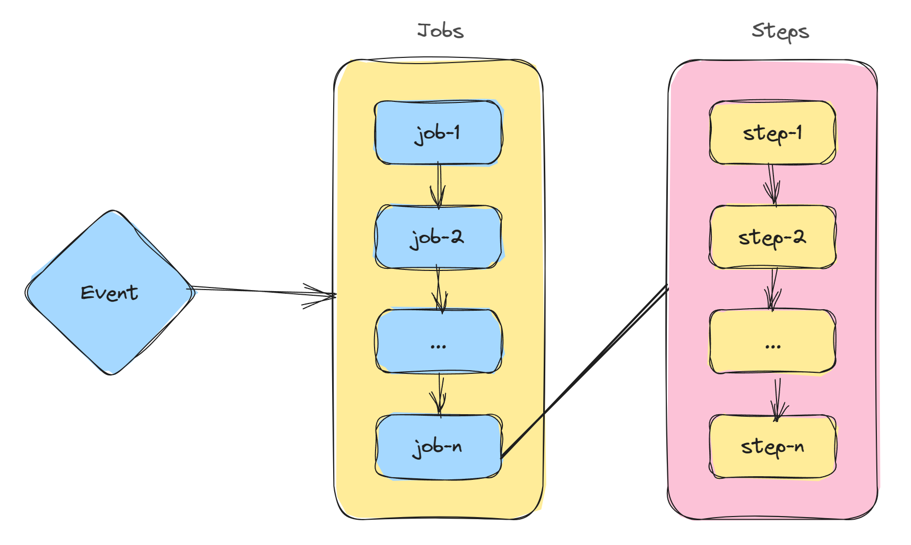

GitHub Actions的工作原理可以简单概括为以下几个步骤：

1. **触发事件**：GitHub Actions会根据代码库中的事件触发工作流程。事件可以是代码提交、分支创建、问题更新等，或者可以通过API手动触发。

2. **选择工作流程**：一旦触发了事件，GitHub会根据库中的配置文件（例如`.github/workflows`目录下的YAML文件）来确定要执行的工作流程。一个库可以定义多个工作流程。

3. **创建作业（Jobs）**：每个工作流程由一个或多个作业（job）组成。作业是指一系列要执行的任务。一个工作流程可以包含并行或顺序运行的多个作业。

4. **运行步骤（Steps）**：每个作业由一个或多个步骤（step）组成。步骤是要在作业中执行的独立任务。每个步骤可以运行特定的命令、脚本或操作。


在每个作业中，需要执行作业运行的执行环境（Runner），GitHub Actions提供了托管的执行环境（称为Runner），用于运行工作流程中的作业和步骤。Runner可以是GitHub托管的虚拟机器，也可以是自己托管的物理机器、虚拟机器或容器。

GitHub Actions会监视工作流程的执行，并生成相应的日志记录。开发者可以在Github项目的Action面板查看日志，了解每个步骤的执行情况，以及发现和解决任何潜在的问题。


# 从一个例子开始

通过 Github 的 Actions 面板创建发布npm包的工作流配置模板。下面将通过这个模板，逐步了解配置文件的使用、相关语法以及相关知识。

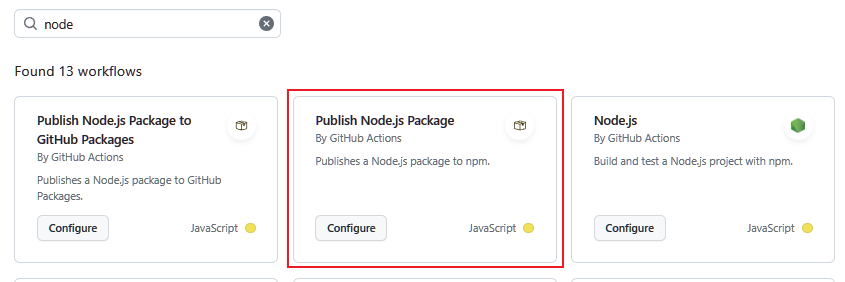


```yml
# This workflow will run tests using node and then publish a package to GitHub Packages when a release is created
# For more information see: https://docs.github.com/en/actions/publishing-packages/publishing-nodejs-packages

name: Node.js Package

on:
  release:
    types: [created]

jobs:
  build:
    runs-on: ubuntu-latest
    steps:
      - uses: actions/checkout@v3
      - uses: actions/setup-node@v3
        with:
          node-version: 16
      - run: npm ci
      - run: npm test

  publish-npm:
    needs: build
    runs-on: ubuntu-latest
    steps:
      - uses: actions/checkout@v3
      - uses: actions/setup-node@v3
        with:
          node-version: 16
          registry-url: https://registry.npmjs.org/
      - run: npm ci
      - run: npm publish
        env:
          NODE_AUTH_TOKEN: ${{secrets.npm_token}}
```

在工作流中，它会按顺序从上到下执行配置文件中的内容。

## `name: Node.js Package`

工作流程的名称是"Node.js Package"。


## `on: release`

指定了触发工作流程的事件。在这种情况下，当创建一个新的发布时触发工作流程。

使用 `on` 监听工作流事件。

除了 `release` 事件外，Github Actions还支持其他更多的事件，详细参考：[Events that trigger workflows]

在指定完事件后，还支持通过设置事件属性`types`继续细化地约束事件的触发条件，如上：

```yml
  release:
    types: [created]
```

指定了触发工作流程的发布类型。在这种情况下，只有在创建发布时才会触发工作流程。

在 [Events that trigger workflows] 中，可以查阅对应事件支持的 `types`（Activity types）：

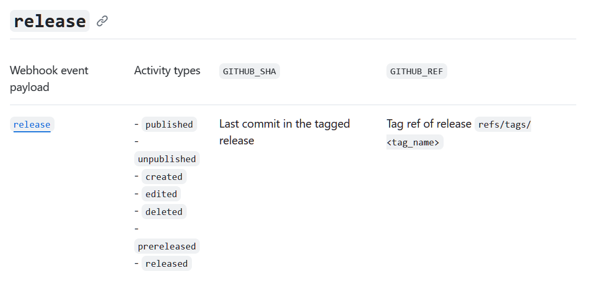


## `jobs`

定义了工作流程中的作业。

它是一个数组，成员是一系列具名的作业组成，比如上面的 `build` 和 `publish-npm`


## `build`

*第一个作业的名称是"build"，用于构建和测试Node.js代码。*

在这个作业中，分别定义了 `runs-on` 和 `steps` 两个属性。

作业的详细配置可参考：[Using jobs in a workflow](https://docs.github.com/en/actions/using-jobs/using-jobs-in-a-workflow)

## `runs-on: ubuntu-latest`
  
*指定作业在Ubuntu操作系统上运行。*

使用 `run-on` 指定作业运行的环境，

Github Actions支持的作业环境有下面这些，详细参考：[Choosing GitHub-hosted runners](https://docs.github.com/en/actions/using-jobs/choosing-the-runner-for-a-job#choosing-github-hosted-runners)

| Runner image |YAML workflow label| Notes |
|--|--|--|
| Windows Server 2022	| `windows-latest` or `windows-2022` | The windows-latest label currently uses the Windows Server 2022 runner image. |
| Windows Server 2019 |	`windows-2019` | None |
| Ubuntu 22.04	| `ubuntu-latest` or `ubuntu-22.04` |	The ubuntu-latest label currently uses the Ubuntu 22.04 runner image. |
| Ubuntu 20.04 |	`ubuntu-20.04` |	None |
| macOS 13 Ventura `[Beta]` |	`macos-13` or `macos-13-xl` |	None |
| macOS 12 Monterey |	`macos-latest`, `macos-12`, `macos-latest-xl` or `macos-12-xl` |	The macos-latest and macos-latest-xl workflow labels currently uses the macOS 12 runner image. |
| macOS 11 Big Sur |	`macos-11` |	None |

## `steps`

*定义了作业中的步骤。*

在 GitHub Actions 中，steps 是一个用于定义工作流程中步骤的部分。steps 部分包含一个或多个步骤，每个步骤定义了要执行的特定任务或操作。

每个步骤由一个唯一的名称、一个或多个操作以及可选的其他属性组成。操作可以是官方操作、自定义操作或命令行命令。


在这个 `steps` 中，定义了4个数组元素，分别是两个 `uses` 和 两个 `run`:

- `uses: actions/checkout@v3`：使用GitHub官方的"checkout"操作，用于检查代码库。

- `uses: actions/setup-node@v3`：使用GitHub官方的"setup-node"操作来设置Node.js运行时环境。
  - `with: node-version: 16`：指定要使用的Node.js版本为16。

- `run: npm ci`：运行`npm ci`命令，用于安装项目的依赖项。

- `run: npm test`：运行`npm test`命令，用于运行测试。

<details open>
  <summary><strong>☕️ <code>npm ci</code> 是什么？</strong></summary>
  <blockquote>
    <br/>
    <p><code>npm ci</code> 是 npm（Node Package Manager）命令的一种形式，用于执行项目的快速、干净的安装过程。它的作用如下：</p>
<ol>
<li><p><strong>确定性安装：</strong> <code>npm ci</code> 的主要目的是在项目中进行确定性的依赖项安装。它会根据 <code>package-lock.json</code>（或 <code>npm-shrinkwrap.json</code>）文件中记录的确切依赖项版本，安装项目所需的依赖项。这样可以确保在不同环境下的安装结果始终一致，减少了可能出现的依赖项版本冲突问题。</p>
</li>
<li><p><strong>忽略 package.json：</strong> 与 <code>npm install</code> 不同，<code>npm ci</code> 在安装依赖时忽略 <code>package.json</code> 文件，而是直接使用 <code>package-lock.json</code>（或 <code>npm-shrinkwrap.json</code>）作为依赖项清单。这样可以确保只安装指定版本的依赖项，而不考虑 <code>package.json</code> 中可能存在的不精确或不确定的版本范围。</p>
</li>
<li><p><strong>快速安装：</strong> <code>npm ci</code> 在执行时会进行一些优化，以提高安装速度。它会跳过创建或更新 <code>node_modules</code> 目录中的符号链接，而是直接将依赖项从 <code>package-lock.json</code>（或 <code>npm-shrinkwrap.json</code>）解析并安装到适当的位置。这种简化的安装过程使得安装速度更快。</p>
</li>
</ol>
<p>需要注意的是，<code>npm ci</code> 命令要求项目中必须存在 <code>package-lock.json</code>（或 <code>npm-shrinkwrap.json</code>）文件，以确保安装的依赖项版本的确定性。因此，它通常用于生产环境或持续集成（CI）环境中，以确保在不同的环境中构建和部署项目时使用相同的依赖项版本。对于开发环境，通常使用 <code>npm install</code> 命令来安装依赖项，以便可以更灵活地处理版本范围和开发依赖项的安装。</p>
    <br/>
  </blockquote>
</details>


### `uses`

在 GitHub Actions 中，`uses` 是一个关键字，用于指定在工作流程中使用的操作（action）或容器（container）。它指定了要运行的操作或容器的位置，可以是一个 GitHub 存储库、一个公共操作或一个 Docker 容器。

使用 `uses` 可以通过以下方式指定操作或容器：

1. GitHub 存储库：

   ```
   uses: <owner>/<repo>@<ref>
   ```

   这将从指定的 GitHub 存储库中获取操作或容器。`<owner>` 是存储库的所有者，`<repo>` 是存储库的名称，`<ref>` 是存储库的引用（分支、标签或提交哈希）。

2. 公共操作（Public Actions）：

   ```
   uses: <owner>/<repo>/<path>@<ref>
   ```

   这将从 GitHub Marketplace 或其他公共存储库中获取公共操作。`<owner>` 是操作的所有者，`<repo>` 是存储库的名称，`<path>` 是操作的路径，`<ref>` 是操作的引用。

3. Docker 容器：

   ```
   uses: docker://<image>:<tag>
   ```

   这将从 Docker Hub 中获取指定的容器镜像。`<image>` 是容器镜像的名称，`<tag>` 是镜像的标签。

例如，以下是使用 `uses` 指定操作或容器的示例：

- 使用 GitHub 存储库中的操作：

  ```
  uses: actions/checkout@v3
  ```

- 使用公共操作：

  ```
  uses: actions/setup-node@v3
  ```

- 使用 Docker 容器：

  ```
  uses: docker://node:14
  ```

这些示例演示了如何在工作流程中使用 `uses` 来引用所需的操作或容器。在 [Github Marketplace] 可以搜索相关的 actions，上面使用到的 `actions/checkout@v3` 和 `actions/setup-node@v3` 都是 Github 官方的 action，同样可以在 [Github Marketplace] 中搜到。

### `run`

在 GitHub Actions 中，`run` 是一个用于执行命令或脚本的步骤。它允许你在工作流程中运行自定义的命令或脚本来完成特定的任务。

下面是一个使用 `run` 步骤的简单示例：

```yaml
steps:
  - name: Run a command
    run: echo "Hello, world!"
```

在上面的示例中，`run` 步骤被命名为 "Run a command"，并使用 `echo` 命令输出 "Hello, world!"。

你也可以运行多个命令或脚本，只需将它们放在同一个 `run` 步骤中，并使用换行符或分号进行分隔。例如：

```yaml
steps:
  - name: Run multiple commands
    run: |
      echo "Command 1"
      echo "Command 2"
      echo "Command 3"
```

此外，`run` 步骤还支持在不同的操作系统上运行不同的命令。你可以使用 `if` 条件来指定特定操作系统下要运行的命令。例如：

```yaml
steps:
  - name: Run commands based on the operating system
    run: |
      if [ "$OSTYPE" == "linux-gnu" ]; then
        echo "Running on Linux"
        # Linux commands here
      elif [ "$OSTYPE" == "darwin"* ]; then
        echo "Running on macOS"
        # macOS commands here
      else
        echo "Running on Windows"
        # Windows commands here
      fi
```

在上述示例中，根据操作系统类型运行不同的命令。

## `needs: build`

在 GitHub Actions 中，needs 是一个用于指定工作流程中步骤之间依赖关系的关键字。它允许你定义一个步骤需要依赖其他步骤的完成状态，以确保正确的顺序和并发控制。

通过使用 needs，你可以指定一个步骤依赖于另一个或多个步骤。这意味着，只有在所依赖的步骤执行成功后，才会执行当前步骤。

通过使用 needs 关键字，你可以控制步骤之间的执行顺序，并确保依赖关系正确地处理。这对于有多个步骤需要按照特定顺序执行的复杂工作流程非常有用。

`needs: build` 被定义在第二个作业`publish-npm`，含义即是这个作业依赖前面的 `build` 作业。

以下是一个示例：

```yml
steps:
  - name: Step 1
    run: echo "This is step 1"

  - name: Step 2
    needs: Step 1
    run: echo "This is step 2"
```

在上面的示例中，Step 2 步骤使用 needs 关键字指定它依赖于 Step 1 步骤。这意味着只有在 Step 1 执行成功后，才会执行 Step 2。

你还可以指定多个依赖项，以确保多个步骤的完成状态。例如：

```yml
steps:
  - name: Step 1
    run: echo "This is step 1"

  - name: Step 2
    needs: Step 1
    run: echo "This is step 2"

  - name: Step 3
    needs: [Step 1, Step 2]
    run: echo "This is step 3"
```

在上面的示例中，Step 3 步骤指定它依赖于 Step 1 和 Step 2 步骤。只有在这两个步骤成功完成后，才会执行 Step 3。

## env


```yml
env:
  NODE_AUTH_TOKEN: ${{secrets.npm_token}}
```

*设置一个名为 `NODE_AUTH_TOKEN` 的环境变量，该变量的值从 GitHub 存储库的 secrets 中获取。这个令牌用于进行身份验证，以便将包发布到npm注册表。*

在 GitHub Actions 中，`env` 是一个用于定义环境变量的关键字。通过在工作流程中使用 `env`，你可以设置和传递环境变量给步骤，以供步骤中的命令或操作使用。

以下是一个示例，演示如何在步骤中使用 `env` 定义环境变量：

```yaml
steps:
  - name: Set environment variables
    env:
      ENV_VAR1: "value1"
      ENV_VAR2: "value2"
    run: echo "Environment variables are set"
```

在上面的示例中，`env` 部分定义了两个环境变量 `ENV_VAR1` 和 `ENV_VAR2`，分别设置为 `"value1"` 和 `"value2"`。`run` 步骤中的命令可以使用这些环境变量。

你可以在同一个步骤中定义多个环境变量，通过键值对的形式指定变量名和值。这些环境变量在步骤中的所有命令或操作中都可用。你还可以在不同的步骤中定义和使用环境变量。

以下示例演示了在不同步骤中使用环境变量：

```yaml
steps:
  - name: Set environment variables
    env:
      ENV_VAR1: "value1"
    run: echo "Environment variable ENV_VAR1 is set"

  - name: Use environment variable
    run: echo "The value of ENV_VAR1 is ${{ env.ENV_VAR1 }}"
```

在上面的示例中，第一个步骤设置了环境变量 `ENV_VAR1`，第二个步骤使用了该环境变量并打印出其值。

使用环境变量可以方便地传递配置信息、密钥、API 凭据等敏感或特定于环境的值，从而使你的工作流程更灵活和可配置。

需要注意的是，环境变量的值可以通过 `${{ ... }}` 语法进行引用。在表达式中使用 `env` 关键字和点表示法来引用特定的环境变量值。例如，`${{ env.ENV_VAR1 }}` 表示引用 `ENV_VAR1` 环境变量的值。

通过使用 `env` 关键字，你可以在 GitHub Actions 的工作流程中轻松定义和使用环境变量。


## secrets.npm_token

在 `${{ secrets.npm_token }}` 中，secrets 是一个表示 GitHub 仓库 "Secrets" 的对象，npm_token 是你在 "Secrets" 中定义的一个具体的密钥。

需要注意的是，`${{ secrets.npm_token }}` 只能在 GitHub Actions 的上下文中使用，而不能在其他环境中直接使用。它是 GitHub Actions 提供的一种安全访问敏感信息的方式。

这个 npm_token 并非自动生成的（GITHUB_TOKEN是自动生成的）。它需要你在当前项目的setting中配置名为 npm_token 的secrets变量，变量值则是从npm中获取。

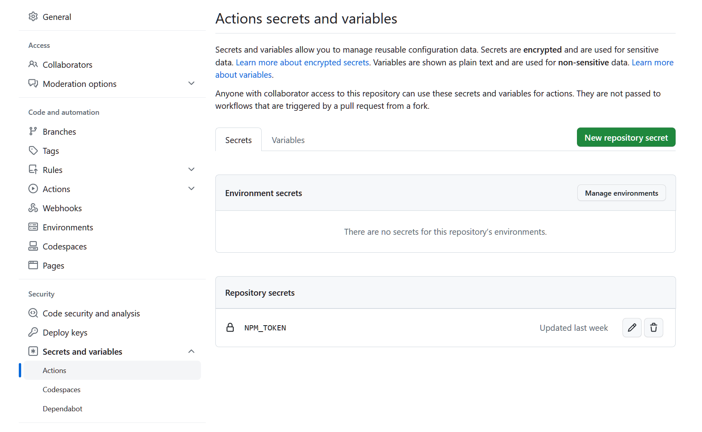


值得注意的是，`secrets` 是 Github Actions 提供的 Contexts （上下文）之一，除了它之外还有更多，比如 `github`，它可以获取工作流程中任何作业或步骤期间可用的顶层上下文，通过 `github.workflow` 可以获取工作流的名称，更多的 Contexts 可以参考：[GitHub Actions / Learn GitHub Actions / Contexts](https://docs.github.com/zh/actions/learn-github-actions/contexts)


| 上下文名称      | 类型       | 说明                                               |
| ---------- | -------- | ------------------------------------------------ |
| `github`   | `object` | 工作流程运行的相关信息。有关更多信息，请参阅 [github 上下文](https://docs.github.com/zh/actions/learn-github-actions/contexts#github-context)。             |
| `env`      | `object` | 包含工作流、作业或步骤中设置的变量。有关更多信息，请参阅 [env 上下文](https://docs.github.com/zh/actions/learn-github-actions/contexts#env-context)。          |
| `vars`     | `object` | 包含存储库、组织或环境级别设置的变量。有关更多信息，请参阅 [vars 上下文](https://docs.github.com/zh/actions/learn-github-actions/contexts#vars-context)。        |
| `job`      | `object` | 有关当前运行的作业的信息。有关更多信息，请参阅 [`job` 上下文](https://docs.github.com/zh/actions/learn-github-actions/contexts#job-context)。               |
| `jobs`     | `object` | 仅适用于可重用工作流，包含可重用工作流中的作业输出。有关更多信息，请参阅 [jobs 上下文](https://docs.github.com/zh/actions/learn-github-actions/contexts#jobs-context)。 |
| `steps`    | `object` | 有关当前作业中已运行的步骤的信息。有关更多信息，请参阅 [steps 上下文](https://docs.github.com/zh/actions/learn-github-actions/contexts#steps-context)。         |
| `runner`   | `object` | 有关运行当前作业的运行器的信息。有关更多信息，请参阅 [runner 上下文](https://docs.github.com/zh/actions/learn-github-actions/contexts#runner-context)。         |
| `secrets`  | `object` | 包含可用于工作流运行的机密的名称和值。有关更多信息，请参阅 [secrets 上下文](https://docs.github.com/zh/actions/learn-github-actions/contexts#secrets-context)。     |
| `strategy` | `object` | 有关当前作业的矩阵执行策略的信息。有关更多信息，请参阅 [strategy 上下文](https://docs.github.com/zh/actions/learn-github-actions/contexts#strategy-context)。      |
| `matrix`   | `object` | 包含在工作流中定义的应用于当前作业的矩阵属性。有关更多信息，请参阅 [matrix 上下文](https://docs.github.com/zh/actions/learn-github-actions/contexts#matrix-context)。  |
| `needs`    | `object` | 包含定义为当前作业依赖项的所有作业的输出。有关更多信息，请参阅 [needs 上下文](https://docs.github.com/zh/actions/learn-github-actions/contexts#needs-context)。     |
| `inputs`   | `object` | 包含可重用或手动触发的工作流的输入。有关更多信息，请参阅 [inputs 上下文](https://docs.github.com/zh/actions/learn-github-actions/contexts#inputs-context)。       |


## 监视与故障排查

参考：https://docs.github.com/zh/actions/monitoring-and-troubleshooting-workflows/about-monitoring-and-troubleshooting

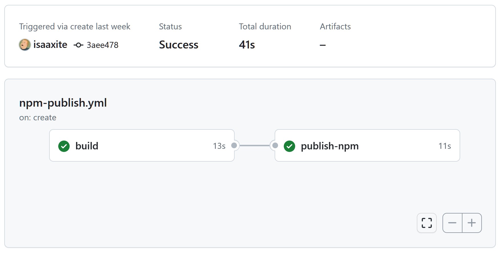

在 GitHub 仓库页面的 "Actions" 选项卡中，你可以访问 GitHub Actions Dashboard。在 Dashboard 上，你可以查看最近执行的工作流程列表。点击工作流程进入详细页面后，你将看到工作流程的执行历史和每个作业的执行状态。

## 执行日志

GitHub Actions 会为每个工作流程和作业生成执行日志。你可以查看执行日志以了解工作流程的执行情况、步骤的输出和错误信息。执行日志可以帮助你快速定位问题并进行故障排查。

每个步骤和作业都有一个状态，可以指示其执行结果。你可以检查每个步骤和作业的状态以确定是否成功完成。如果有步骤或作业失败，你可以查看相关的错误信息和日志以找出问题所在。

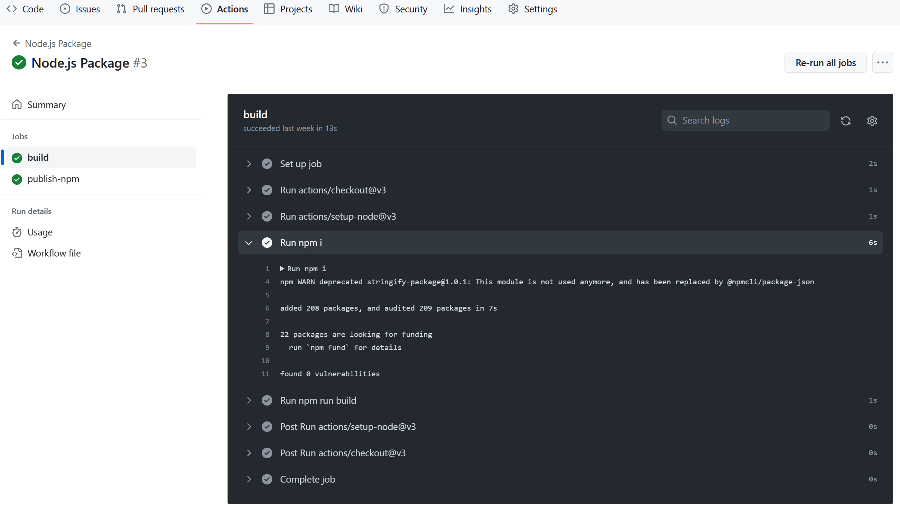

# 实践

下面将创建工作流将源码打包并发布到npm，为此会创建工作流配置文件。通过推送新tag到github创库触发工作流。在工作流中会做以下几件事：

1. build 源码，生成用于发布的代码包；

2. 发布到npm；


## 配置触发事件


首先，在项目目录下创建工作流配置文件 `.github/workflows/npm-publish.yml`。

```yml
on:
  create:
    tags:
      - "*"
```
当创建一个新的 Git 标签时，将会触发该工作流程。而在tags部分，"*"表示适用于所有的标签。换句话说，无论创建什么样的标签，都会触发该工作流程的执行

## 添加 build 作业

添加 build 作业，安装前置依赖，然后执行build脚本，打包源码。

```yml
build:
  runs-on: ubuntu-latest
  steps:
    - uses: actions/checkout@v3

    - uses: actions/setup-node@v3
      with:
        node-version: 16

    - name: Install pnpm
      run: npm install -g pnpm

    - name: Install dependencies
      run: pnpm install

    - name: Build artifact
      run: node ./scripts/build.js
```

- 指定了执行环境，前置安装了 `pnpm`，可见作业中，各个步骤默认是同步而非异步执行；

- 指定了node版本；

- 执行了 `./scripts/build.js`，将源码打包至 `./dist`


## 添加 publish-npm 作业

```yml
publish-npm:
  needs: build
  runs-on: ubuntu-latest
  steps:
    - uses: actions/checkout@v3

    - uses: actions/setup-node@v3
      with:
        node-version: 16
        registry-url: https://registry.npmjs.org/

    - name: Publish artifact to npm
      run: npx isubo-publish --skin-login --skin-build
      env:
        NODE_AUTH_TOKEN: ${{secrets.npm_token}}
```

- 声明依赖build作业；

- 使用 isubo-publish 发布在 `./dist` 的包。`isubo-publish` 是 cli 工具，它默认以`./dist`作为工作目录，可以解析`package.json`的 `version`值，生成发布命令并执行，例如 `version: "0.0.1-alpha.0"` 将会生成 `npm publish --tag alpha`。它默认会执行 `npm login` 登录，以及执行在 `package.json`中的`scripts.build`脚本，因此增加了两个相关的`skin`可选项。

## 添加 npm_token

在 publish-npm作业 中使用了 `secrets.npm_token`，这个 `secrets` 有别于 `GITHUB_TOKEN`，需要手动添加这个变量。

首先，是获得 npm 的 Access Tokens

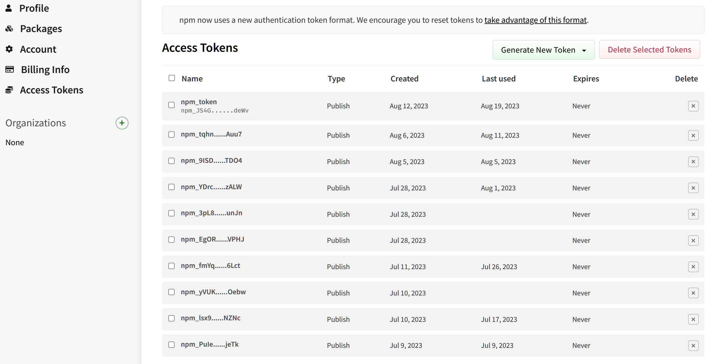

接着，配置`secrets.npm_token`变量


## 推送 git-tag

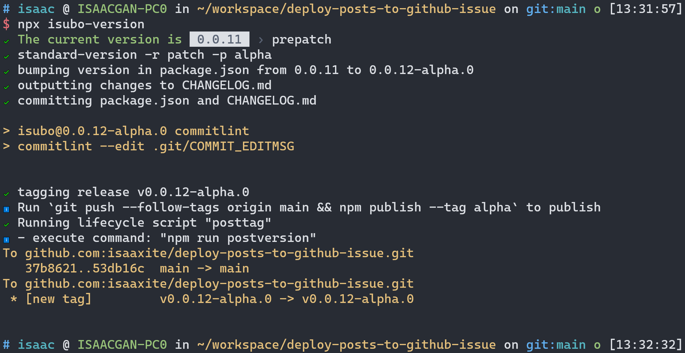

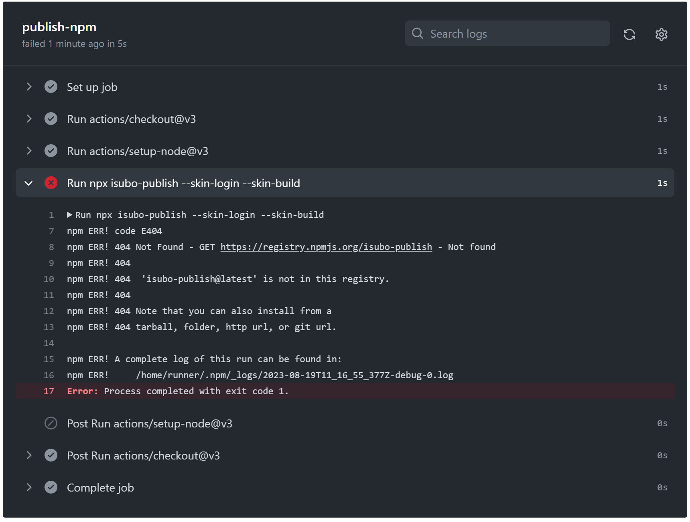

从提示来看，没有安装 `isubo-publish` 包。在build作业的依赖安装并没有在publish-npm作业中发挥作用，看来在依赖安装上，两个作业之间是相互独立的。

## 添加手动触发

为了方便调试，增加手动触发工作流的事件。默认情况下 Github 没有提供手动触发的入口，需要在配置文件中添加 [`workflow_dispatch` 事件](https://docs.github.com/zh/actions/using-workflows/events-that-trigger-workflows#workflow_dispatch)。

在推送配置文件后，Github 仓库的 Actions 卡片，对应工作流面板便会出现 `Run workflow` 按钮，见下入，如此便无需重复创建 git-tag 以触发工作流。

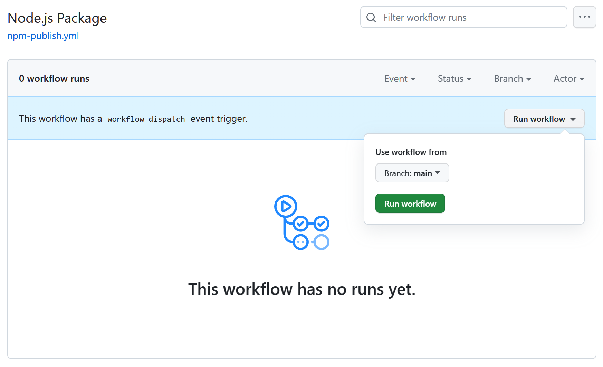

```yml
on:
+ workflow_dispatch:
  create:
    tags:
      - "*"
```


## 添加依赖安装步骤

```yml
publish-npm:
  needs: build
  runs-on: ubuntu-latest
  steps:
    - uses: actions/checkout@v3

    - uses: actions/setup-node@v3
      with:
        node-version: 16
        registry-url: https://registry.npmjs.org/

+   - name: Install pnpm
+     run: npm install -g pnpm
+
+   - name: Install dependencies
+     run: pnpm install

    - name: Publish artifact to npm
      run: npx isubo-publish --skin-login --skin-build
      env:
        NODE_AUTH_TOKEN: ${{secrets.npm_token}}
```

出现新的问题，在build作业中，将源码打包到了`./dist`目录。工作流执行到publish-npm的`npx isubo-publish --skin-login --skin-build`命令时，提示缺少`./dist`目录了。

看起来是和上面的问题一样，作业间的独立性！

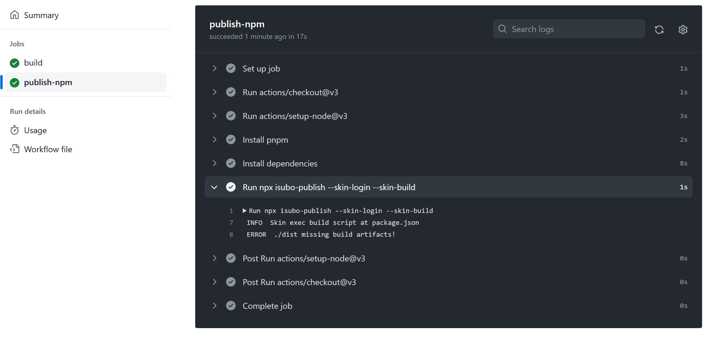

## 共享作业产物

需要让两个作业共享dist的产物，或者将两个作业合并为一个。合并在实践的目的下是下策，先尝试前者。我想到的是“定义作业的输出”

在 build 作业中定义 `outputs`，然后在 publish-npm 作业中获取。

下面是官网文档给出的示例：

```yml
jobs:
  job1:
    runs-on: ubuntu-latest
    # Map a step output to a job output
    outputs:
      output1: ${{ steps.step1.outputs.test }}
      output2: ${{ steps.step2.outputs.test }}
    steps:
      - id: step1
        run: echo "test=hello" >> "$GITHUB_OUTPUT"
      - id: step2
        run: echo "test=world" >> "$GITHUB_OUTPUT"
  job2:
    runs-on: ubuntu-latest
    needs: job1
    steps:
      - env:
          OUTPUT1: ${{needs.job1.outputs.output1}}
          OUTPUT2: ${{needs.job1.outputs.output2}}
        run: echo "$OUTPUT1 $OUTPUT2"
```

从示例来看，`outputs` 保存的像是字符串。

> 可以使用 `jobs.<job_id>.outputs` 为作业创建输出的 map。 作业输出可用于所有依赖此作业的下游作业。 有关定义作业依赖项的详细信息，请参阅 `jobs.<job_id>.needs`。
>
> 输出是 Unicode 字符串，最大为 1 MB。 工作流运行中所有输出的总和最大为 50 MB。

从上面的官网信息可知，单个output的存储量仅仅1MB，这不满足上面`./dist`大小，并且实际上`./dist`是目录而非单个压缩文件，要写入单个标量显然不容易！

得改用其他方案。文档中有提到“[工作流程级别的共享文件（Artifacts）](https://docs.github.com/zh/actions/learn-github-actions/essential-features-of-github-actions#sharing-data-between-jobs)”！

- **[Upload-Artifact](https://github.com/marketplace/actions/upload-a-build-artifact)**: 这将上传工作流程的产物，允许您在作业之间共享数据，并在工作流程完成后存储数据。
  >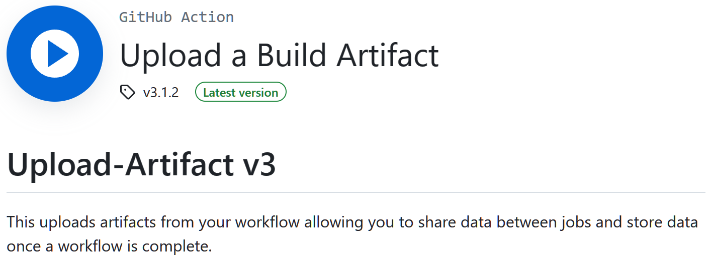
  
  Upload an Entire Directory:
  
  ```yml
  - uses: actions/upload-artifact@v3
    with:
      name: my-artifact
      path: path/to/artifact/ # or path/to/artifact
  ```
- **[Download-Artifact](https://github.com/marketplace/actions/download-a-build-artifact)**: 这将从您的构建中下载产物。
  >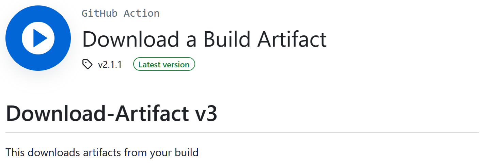

  Download to a specific directory:

  ```yml
  steps:
    - uses: actions/checkout@v3

    - uses: actions/download-artifact@v3
      with:
        name: my-artifact
        path: path/to/artifact
        
    - name: Display structure of downloaded files
      run: ls -R
      working-directory: path/to/artifact
  ```
  
*分别添加上面 2 个 actions 到 build 和 publish-npm 作业。*

### 修改 build 作业

```yml
build:
  runs-on: ubuntu-latest
  steps:
    - uses: actions/checkout@v3

    - uses: actions/setup-node@v3
      with:
        node-version: 16

    - name: Install pnpm
      run: npm install -g pnpm

    - name: Install dependencies
      run: pnpm install

    - name: Build artifact
      run: node ./scripts/build.js

+   - name: Upload build artifact
+     uses: actions/upload-artifact@v3
+     with:
+       name: build-artifact
+       path: ./dist
```

### 修改 publish-npm 作业

```yml
publish-npm:
  needs: build
  runs-on: ubuntu-latest
  steps:
    - uses: actions/checkout@v3

    - uses: actions/setup-node@v3
      with:
        node-version: 16
        registry-url: https://registry.npmjs.org/

    - name: Install pnpm
      run: npm install -g pnpm

    - name: Install dependencies
      run: pnpm install

+   - name: Download build artifact
+     uses: actions/download-artifact@v3
+     with:
+       name: build-artifact
+       path: ./dist

    - name: Publish artifact to npm
      run: npx isubo-publish --skin-login --skin-build
      env:
        NODE_AUTH_TOKEN: ${{secrets.npm_token}}
```

### 上传 artifact 成功

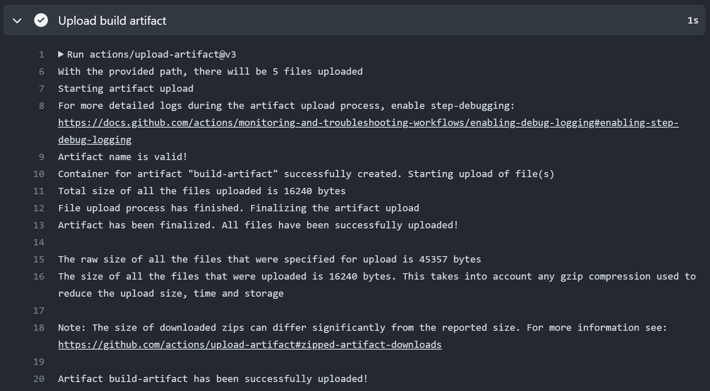

### 下载 artifact 成功

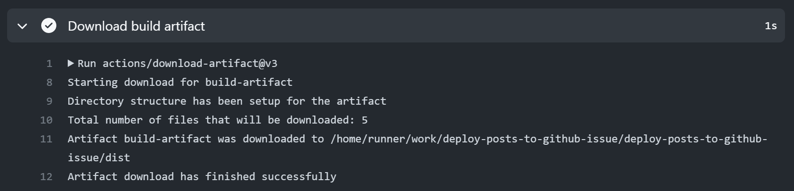

### 发布成功

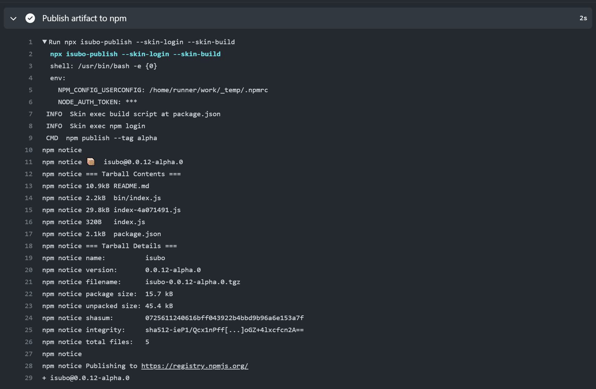

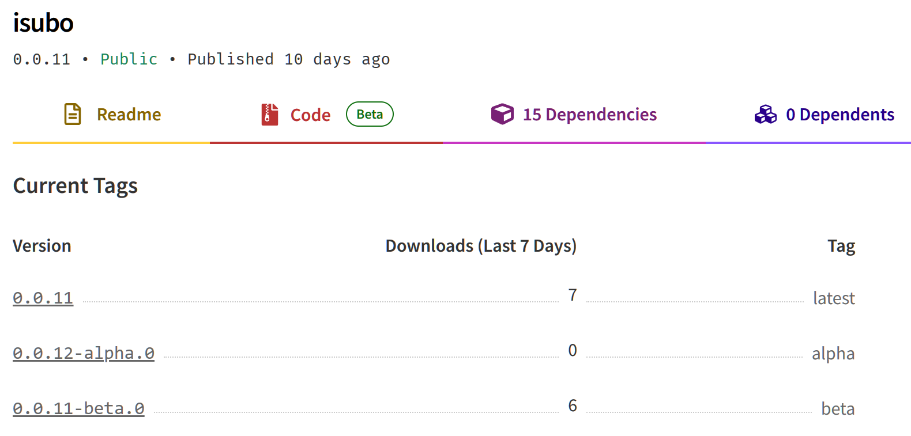

### 完整的配置

```yml
name: Node.js Package

on:
  workflow_dispatch:
  create:
    tags:
      - "*"

jobs:
  build:
    runs-on: ubuntu-latest
    steps:
      - uses: actions/checkout@v3
      - uses: actions/setup-node@v3
        with:
          node-version: 16
      - name: Install pnpm
        run: npm install -g pnpm

      - name: Install dependencies
        run: pnpm install
      
      - name: Build artifact
        run: node ./scripts/build.js

      - name: Upload build artifact
        uses: actions/upload-artifact@v3
        with:
          name: build-artifact
          path: ./dist

  publish-npm:
    needs: build
    runs-on: ubuntu-latest
    steps:
      - uses: actions/checkout@v3
      - uses: actions/setup-node@v3
        with:
          node-version: 16
          registry-url: https://registry.npmjs.org/

      - name: Install pnpm
        run: npm install -g pnpm

      - name: Install dependencies
        run: pnpm install

      - name: Download build artifact
        uses: actions/download-artifact@v3
        with:
          name: build-artifact
          path: ./dist

      - name: Publish artifact to npm
        run: npx isubo-publish --skin-login --skin-build
        env:
          NODE_AUTH_TOKEN: ${{secrets.npm_token}}
```

## 优化依赖安装

在上面实践中可以看到，build 作业和 publish-npm 作业重复安装 pnpm 和 package.json 中的依赖。

下面将使用 actions/cache 在作业 build 缓存依赖，然后在 publish-npm 作业中直接使用缓存的依赖。以此，避免重复的安装，从而加快工作流的进度。

>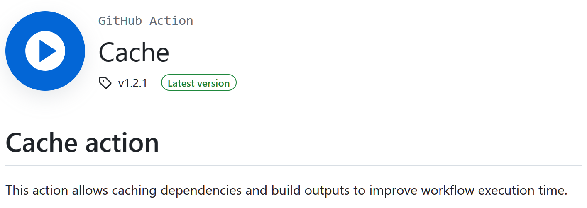

### build 作业缓存依赖

- 合并pnpm与依赖的安装；

- 缓存依赖；

```yml
build:
  runs-on: ubuntu-latest
  steps:
    - uses: actions/checkout@v3
    - uses: actions/setup-node@v3
      with:
        node-version: 16
-   - name: Install pnpm
-     run: npm install -g pnpm
-
-   - name: Install dependencies
-     run: pnpm install

+   - name: Install dependencies
+     run: npm install -g pnpm && pnpm install

+   - name: Cache dependencies
+     uses: actions/cache@v3
+     with:
+       path: ./node_modules
+       key: ${{ runner.os }}-node-${{ hashFiles('./pnpm-lock.yaml') }}
    
    - name: Build artifact
      run: node ./scripts/build.js

    - name: Upload build artifact
      uses: actions/upload-artifact@v3
      with:
        name: build-artifact
        path: ./dist
```

### publish-npm 作业使用缓存

- 删除原有的依赖安装；

- 命中缓存，恢复依赖；

```yml
publish-npm:
  needs: build
  runs-on: ubuntu-latest
  steps:
    - uses: actions/checkout@v3
    - uses: actions/setup-node@v3
      with:
        node-version: 16
        registry-url: https://registry.npmjs.org/

-   - name: Install pnpm
-     run: npm install -g pnpm
-
-   - name: Install dependencies
-     run: pnpm install

+   - name: Restore dependencies cache
+     uses: actions/cache@v3
+     with:
+       path: ./node_modules
+       key: ${{ runner.os }}-node-${{ hashFiles('./pnpm-lock.yaml') }}

    - name: Download build artifact
      uses: actions/download-artifact@v3
      with:
        name: build-artifact
        path: ./dist

    - name: Publish artifact to npm
      run: npx isubo-publish --skin-login --skin-build
      env:
        NODE_AUTH_TOKEN: ${{secrets.npm_token}}
```

### publish-npm 作业的日志

下面是 publish-npm 作业的日志截图。

可以看到在“Restore dependencies cache”中，依赖被成功从缓存中恢复。在 "Publish artifact to npm" 中，`isubo-publish` 被正常使用无异常。

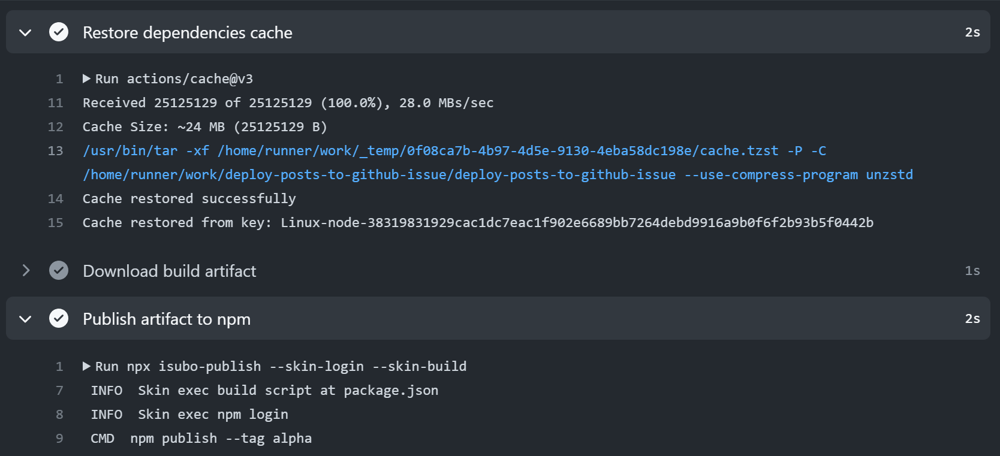

### 减少依赖重复安装

从上面的工作流配置中，可以看到，build 作业每次执行都会安装依赖，然后再缓存依赖以供 publish-npm 作业使用。接下来是优化 build 作业的安装，让 build 作业也可以使用缓存。

> **Skipping steps based on cache-hit**
> Using the <mark>cache-hit</mark> output, subsequent steps (such as install or build) can be skipped when a cache hit occurs on the key. It is recommended to install missing/updated dependencies in case of a partial key match when the key is dependent on the hash of the package file.
>
> Example:
>```yml
>  steps:
>  - uses: actions/checkout@v3
>
>  - uses: actions/cache@v3
>    id: cache
>    with:
>      path: path/to/dependencies
>      key: ${{ runner.os }}-${{ hashFiles('**/lockfiles') }}
>
>  - name: Install Dependencies
>    if: steps.cache.outputs.cache-hit != 'true'
>    run: /install.sh
>```

从 [actions/cache > Skipping steps based on cache-hit](https://github.com/marketplace/actions/cache) 中知道，可以通过判断 `cache-hit` 是否为 `'true'` 来判断缓存可用与否。缓存可用的话就可以跳过依赖的安装！

```yml
build:
  runs-on: ubuntu-latest
  steps:
    - uses: actions/checkout@v3
    - uses: actions/setup-node@v3
      with:
        node-version: 16

-   - name: Install dependencies
-     run: npm install -g pnpm && pnpm install

    - name: Cache dependencies
+     id: cache-dependencies
      uses: actions/cache@v3
      with:
        path: ./node_modules
        key: ${{ runner.os }}-node-${{ hashFiles('./pnpm-lock.yaml') }}

+   - name: Install dependencies
+     if: steps.cache-dependencies.outputs.cache-hit != 'true'
+     run: npm install -g pnpm && pnpm install
    
    - name: Build artifact
      run: node ./scripts/build.js

    - name: Upload build artifact
      uses: actions/upload-artifact@v3
      with:
        name: build-artifact
        path: ./dist
```

从 build 作业的日志可见：

- `Cache dependencies` 步骤中，由于前面几次的工作流执行已经缓存依赖，因此当前依赖如期从缓存中恢复；

- `Install dependencies` 步骤已经被跳过。尽管跳过，但整个作业是完成的，因此从缓存中恢复的依赖确实有效。

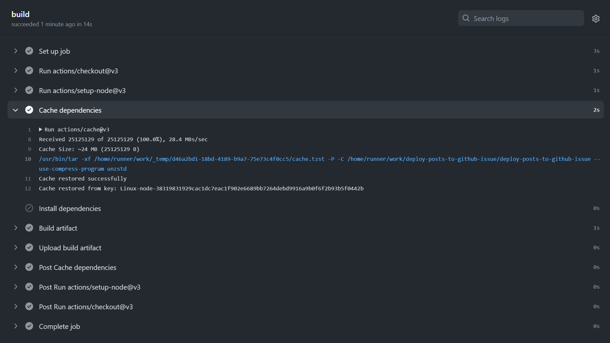

# 更多

- [表达式](https://docs.github.com/zh/actions/learn-github-actions/expressions)

- [托管自己的运行器](https://docs.github.com/zh/actions/guides#%E6%89%98%E7%AE%A1%E8%87%AA%E5%B7%B1%E7%9A%84%E8%BF%90%E8%A1%8C%E5%99%A8)

- [创建操作](https://docs.github.com/zh/actions/guides#%E5%88%9B%E5%BB%BA%E6%93%8D%E4%BD%9C)


# 总结

GitHub Actions 是 GitHub 的持续集成和持续部署(CI/CD)平台，允许开发者在 GitHub 上自动化他们的软件开发工作流程。它众多常见的 CI/CD 平台之一，比如Jenkins、Travis CI、CircleCI等等。

要使用这个能力需要在项目根目录下创建 `.github/workflows` 目录，并在此目录中添加 yml 后缀的配置文件。

在配置文件中需要配置触发条件，以及自动化逻辑。

触发条件通过 `on` 属性声明监听事件定义，Github 有多种事件供使用，比如上文中的 `workflow_dispatch`、`create`事件， 它们可以在 [Events that trigger workflows] 中查阅。

自动化逻辑由一个或多个作业（job）组成，作业则是由一个或多个步骤（step）组成。每个作业都是相对独立的存在，作业中需要使用 `run-on` 指定运行环境，Github 提供了一系列可供使用的环境，比如上文中的 `ubuntu-latest`，更多可查阅 [选择 GitHub 托管的运行器](https://docs.github.com/zh/actions/using-jobs/choosing-the-runner-for-a-job#%E9%80%89%E6%8B%A9-github-%E6%89%98%E7%AE%A1%E7%9A%84%E8%BF%90%E8%A1%8C%E5%99%A8)。作业下的步骤在所指定的环境执行。作业和步骤在默认情况下都是自上向下同步执行。在作业中，可以定义自动化的细节，比如通过 `uses` 调用 actions，actions 是官方或第三方发布的工作自动化逻辑；通过 `run` 调用 shell 命令或自定义的脚本。

从上文中，先是通过一个例子展开，了解工作流配置的构成。除了上面的基本概念外，还了解到环境变量、上下文、密钥的配置和使用、工作流的监视和执行日志的查看。

然后实践工作流的使用，通过工作流build源码，并将源码发布到npm。在实践中，配置个人访问令牌以发布源码；使用`actions/upload-artifact` 和 `actions/download-artifact` 两个 actions实现作业间共享目录；添加 `actions/cache` actions 缓存依赖，从而优化工作流执行速度。

# 附录

## 参考

- [GitHub Actions 的基本功能](https://docs.github.com/zh/actions/learn-github-actions/essential-features-of-github-actions)
- [表达式](https://docs.github.com/zh/actions/learn-github-actions/expressions)
- [上下文](https://docs.github.com/zh/actions/learn-github-actions/contexts)
- [触发工作流程](https://docs.github.com/zh/actions/using-workflows/triggering-a-workflow)
- [手动运行工作流程](https://docs.github.com/zh/actions/using-workflows/manually-running-a-workflow)
- [触发工作流的事件](https://docs.github.com/zh/actions/using-workflows/events-that-trigger-workflows)
- [GitHub Actions 的工作流语法](https://docs.github.com/zh/actions/using-workflows/workflow-syntax-for-github-actions)
- [选择作业的运行器](https://docs.github.com/zh/actions/using-jobs/choosing-the-runner-for-a-job)
- [使用条件控制作业执行](https://docs.github.com/zh/actions/using-jobs/using-conditions-to-control-job-execution)
- [发布 Node.js 包](https://docs.github.com/zh/actions/publishing-packages/publishing-nodejs-packages)
- [使用可视化图表](https://docs.github.com/zh/actions/monitoring-and-troubleshooting-workflows/using-the-visualization-graph)
- [使用工作流运行日志](https://docs.github.com/zh/actions/monitoring-and-troubleshooting-workflows/using-workflow-run-logs)
- [Marketplace / Actions / Upload a Build Artifact](https://github.com/marketplace/actions/upload-a-build-artifact)
- [Marketplace / Actions / Download a Build Artifact](https://github.com/marketplace/actions/download-a-build-artifact)
- [Marketplace / Actions / Cache](https://github.com/marketplace/actions/cache)
- [在作业之间共享数据](https://docs.github.com/zh/actions/learn-github-actions/essential-features-of-github-actions#sharing-data-between-jobs)
- [缓存依赖项以加快工作流程](https://docs.github.com/zh/actions/using-workflows/caching-dependencies-to-speed-up-workflows)

<!-- Defined Refs -->
[isubo]: https://github.com/isaaxite/deploy-posts-to-github-issue
[Events that trigger workflows]:https://docs.github.com/en/actions/using-workflows/events-that-trigger-workflows
[Github Marketplace]:https://github.com/marketplace?type=actions