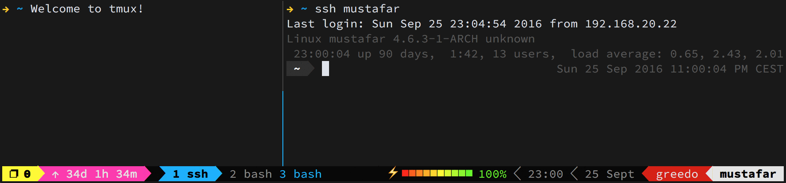

本文的首要目的是记录，而非完全性的指南，不免会有缺漏。目标是随时间的推移逐步完善此记录，最终达到指南的程度。将以 tmux 的官方文档为核心其他资料为辅介绍 tmux 的基本概念和术语，让 tmux 的潜在用户对它有基本的了解，以达到无痛入门，降低心智消耗的作用。涉及 tmux 的会话（session）、视窗（window）、窗格（pane）和其他的核心内容的基本使用，以达到开箱即用，为 tmux 拾一根薪火（赞美太阳🔥）。

<!--more-->

下文涉及到的 tmux 相关概念和术语除首次出现外大部分将尽量使用原文，以免产生歧义，以及养成熟悉度方便未来阅读原文。

再次言明，本文系结合 tmux wiki 原文等资料与笔者的实践与理解写就，仅供参考，不具备权威性，请以辩证思维进行阅读。

# 背景

## 设备

>System:
>  Kernel: 5.15.0-76-generic x86_64 bits: 64 compiler: gcc v: 11.3.0 <mark>Desktop: Cinnamon 5.8.4</mark>
>    tk: GTK 3.24.33 wm: muffin dm: LightDM <mark>Distro: Linux Mint 21.2 Victoria base: Ubuntu 22.04 jammy</mark>
>
>CPU:
>  Info: 8-core <mark>model: AMD Ryzen 7 5800HS Creator Edition bits: 64</mark> type: MT MCP arch: Zen 3 rev: 0
>    cache: L1: 512 KiB L2: 4 MiB L3: 16 MiB
>  Speed (MHz): avg: 2705 high: 3887 min/max: 1200/3200 boost: enabled cores: 1: 2938 2: 578
>    3: 2473 4: 2268 5: 2233 6: 3057 7: 2560 8: 2473 9: 2524 10: 2734 11: 3887 12: 3467 13: 2903
>    14: 2943 15: 2931 16: 3311 bogomips: 102206
>  Flags: avx avx2 ht lm nx pae sse sse2 sse3 sse4_1 sse4_2 sse4a ssse3 svm

## Tmux 版本

```shell
# isaac @ Mint-Yoga in ~ [4:15:33] 
$ tmux -V
tmux 3.2a
```

## 终端模拟器

- [Tilix](https://gnunn1.github.io/tilix-web/): Tilix is an advanced GTK3 tiling terminal emulator that follows the Gnome Human Interface Guidelines；

- [Gnome-Terminal](https://help.gnome.org/users/gnome-terminal/stable/introduction.html.en): Terminal is a terminal emulator application for accessing a UNIX shell environment which can be used to run programs available on your system.

## 终端类型（$TERM）

- Tilix：
```shell
# isaac @ Mint-Yoga in ~ [5:03:08] 
$ echo $TERM 
xterm-256color
```

- Gnome-Terminal：
```shell
# isaac @ Mint-Yoga in ~ [5:04:25] 
$ echo $TERM
xterm-256color
```
## 其他

- 图形窗口系统：X11（X Window System）；
- shell：zsh

# 关于 Tmux


Tmux 是一个功能强大的终端复用器，它可以大大提高用户的生产力和工作效率。它的主要特点包括：

1. **会话管理**：Tmux 允许用户在同一个终端窗口中创建、管理和切换多个独立的会话。这使得用户可以同时运行和访问多个程序。
2. **窗口和窗格**：每个会话都可以包含多个窗口,每个窗口又可以被分割成多个窗格。这使得用户可以在同一个会话中同时查看和操作多个程序。
3. **持久性**：Tmux 会话可以在用户断开连接后继续运行，当用户重新连接时可以恢复之前的会话状态。这对于长时间运行的任务非常有用。
4. **自定义配置**：Tmux 有一个强大的配置系统，允许用户自定义快捷键、外观和行为,以满足个人需求。
5. **插件系统**：Tmux 有一个丰富的插件生态系统，用户可以安装各种插件来扩展它的功能,如状态栏、窗口管理器等。
6. **跨平台**：Tmux 可以在多种操作系统上运行，包括 Linux、macOS 和 Windows (通过 WSL)。

总的来说，Tmux 是一个非常强大和灵活的终端复用器，它可以帮助用户提高工作效率和生产力。通过学习和使用 Tmux 的各种特性，用户可以根据自己的需求定制一个高度个性化的终端工作环境。

# 说明

## 热键组合的使用

> When the prefix key is pressed, tmux waits for another key press and that determines what tmux command is executed. Keys like this are shown here with a space between them: <mark>`C-b c` means first the prefix key `C-b` is pressed, then it is released and then the `c` key is pressed.</mark> Care must be taken to release the `Ctrl` key after pressing `C-b` if necessary - `C-b c` is different from `C-b C-c`.
> Refer from [Tmux Wiki | The prefix key](https://github.com/tmux/tmux/wiki/Getting-Started#the-prefix-key)

使用 `-` 连接的按键表示需要同时按住（不需要同一时间点按下，只需全部按住）；使用 `+` 连接的，表示有前后顺序：先松开 `+` 左边的按键组合，再按 `+` 右边的按键组合

## 热键的书写

为避免歧义，下文中书写的热键组合均大小写敏感！比如： `Ctrl` - `b` + `s` 中只需按 `Ctrl`、 `b` 和 `s`；而 `Ctrl` - `b` + `D` 则需要按 `Ctrl`、 `b` 和 `Shift`、`d`。涉及到的非字母符号均为半角的，比如热键：`Ctrl-b` + `?`。

tmux 的语境中有按键前缀的概念，默认情况下是 `Ctrl` - `b` ，下文不考虑已通过配置文件修改前缀的情况，统一使用`Ctrl` - `b` 指代 tmux 的按键前缀，如已修改，请在阅读下文时自行脑内替换。另外，下文会使用 `C-b` 的简写代替`Ctrl` - `b` （参考官方写法）。

> The default prefix key is `C-b`, which means the `Ctrl` key and `b`. <mark>In tmux, modifier keys are shown by prefixing a key with `C-` for the control key, `M-` for the meta key (normally `Alt` on modern computers) and `S-` for the shift key. </mark>These may be combined together, so `C-M-x` means pressing the control key, meta key and `x` together.
> Refer from [Tmux Wiki | The prefix key](https://github.com/tmux/tmux/wiki/Getting-Started#the-prefix-key)

tmux 除了使用频率较高的 `C-b` 按键前缀中的 `C-`（`Ctrl`键） 外，还有 `M-`（`Alt` 键，也称为 `meta` 键） 和 `S-`（`Shift` 键）两个。

## `Tab` 自动补全

下文中提到的 `tab` 键自动补全以及触发选择 prompt 的能力非默认自带，而是安装 `zsh` shell 带来的。


# 概念解析

本章节将介绍 tmux 的相关概念与术语，但仅限于本文涉及到的，非暗示 tmux 仅有以下相关概念与术语。完整的内容请参考原文，[Tmux Wiki](https://github.com/tmux/tmux/wiki/)。

## 命令与热键

tmux 支持使用命令和热键，它们是为在合适场景下使用 tmux 提供的能力。使用 `tmux list-conmands` 命令（详细见[附录](#tmux-list-commands)）可查看 tmux 支持的命令；使用 `C-b` + `?` 热键（详细见[附录](#C-b)）可查看 tmux 支持的热键。 

命令与热键部分能力重合，有提高效率的原因，也有因在特定场景下某一方无法使用时进行替换。比如执行的一些植守程序（如启动 hexo 服务：`npx hexo s`）后无法使用命令，则可使用热键。比如需要使用 `tmux choose-session` 选择 session，则可以使用热键（`C-b` + `s`） 代替。

命令与热键也有各自独有的能力，如用于绑定热键的命令（`tmux bind-key`）；用于显示 pane 序号的热键（`C-b` + `q`）这两都是各自一方所独有。

需要注意：热键仅在 tmux 内部可用。大部分命令于 tmux 内部使用，但也有部分特例，如附着 会话（seesion） 到客户端（client）——`tmux attach-session`——仅可在外部使用。

## tmux 的组成

这个章节将介绍 tmux-server、客户端（client）、会话（session）、窗口（window）和窗格（pane）的概念以及它们的关系。tmux 的组成可分为两个部分。其一是 client；其二是以 tmux-server 为根节点的，会话（session）、窗口（window）和窗格（pane）为子节点的树。
### tmux-server

tmux-server 如它名称是个服务器，是一个进程（使用 `ps -e | grep tmux` 即可看到名为 `tmux:server` 的进程），是 tmux 的根基。

```shell
# isaac @ Mint-Yoga in ~ [5:43:03] 
$ ps -e | grep tmux 
  16603 ?        00:00:00 tmux: server
  18950 pts/1    00:00:00 tmux: client
```

tmux-server 有且仅有一个，无需手动创建。伴随首个 session 的创建（需要 tmux 命令手动新建）tmux-server 便会启动。它的基本单位是 session，由多个 session 组成。因此，当 tmux-server 销毁时，所有 session， 以及 session 下的所有程序都将被销毁。

### 客户端（client）和会话（session）

客户端（client）是指各个终端模拟器（terminal）、比如 gnome-terminal。有些 terminal 是可以“分屏”的，比如 tilix，每个子屏对于 tmux 也是一个 client。client 是 tmux 用于“展示” 会话（session）的进程。

session 正如 [tmux-server](#tmux-server) 章节所说是 tmux-server 的基本单位。每个 session 都是相互独立且在同一层级，意味着 session 是不可嵌套的。session 默认情况是与 client 无关联的。session 是后台程序，不可见的，因此 session 需要在 client 才能查看与使用，client 可以说是用户与 tmux 交互的工具。

在 client 中使用命令创建 session，默认就会将这个 client 和 session 关联在一起，在 tmux 的语境中，这样的现象叫：这个 session 附着（attach）到这个 client。tmux-server 可以有多个 session，这些 session 都可以 attach 在某个client 上，session 与 client 的附着关系是一对一的，即每次有且仅有一个 session 附着在某个 client 上。client 可以切换 session，指定哪个 seesion 附着在它上。

既然有这种“附着”的情况，也会有将 session 与 client 分离的操作：`tmux detach-client`，在 tmux 会话中执行此命令就会在不影响当前 session 的情况下回到 client 的默认shell（对 tmux 而言则是“外部shell”）。

### 窗口（window）和窗格（pane）

每个 session 在创建时显示的界面就是一个 window ——视觉上类似浏览器的标签页。一个 session 可以创建多个 window，每个 window 从展示的角度上看是相互独立的，不能同时展示，视觉上类似浏览器的各个标签页的展示逻辑。可以在当前会话的 window 执行 `tmux new-window` 命令创建新的 window ——视觉上类似浏览器新建标签页。

而 pane 则是 与 session 交互的基本单位。每个 window 至少有一个 pane，一个 window 可以创建多个 pane，这些 pane 同时展示，它们的展示区域组成 window 的区域。而每个窗口可以使用热键（水平：`C-b` + `"`；竖直：`C-b` + `%`）或命令（水平：`tmux split-window -h`；竖直：`tmux split-window -v`；）分割（视觉上的分割，类似分屏）为多个 pane 。

## 模式

本章节将介绍四种模式：树模式（tree mode）、复制模式（copy mode）、客户端模式（client mode）和缓冲区模式（buffer mode），以及用于消除歧义而特殊说明的查看模式（view mode）。Tmux 非仅有以上几种模式，更多相关模式可参考：[Tmux Wiki](https://github.com/tmux/tmux/wiki/)。
### 树模式（tree mode）

> **[Choosing sessions, windows and panes](https://github.com/tmux/tmux/wiki/Getting-Started#choosing-sessions-windows-and-panes)**
> <mark>tmux includes a mode where sessions, windows or panes can be chosen from a tree, this is called tree mode.</mark> It can be used to browse sessions, windows and panes;

树模式（tree mode）是通过热键（ `C-b` + `s` 或 `C-b` + `w` ）触发的可交互视窗。在视窗中，可以使用方向键等热键选择 session、window 和 pane。

进入 tree mode，用于交互的常用热键见下表：

| Key     | Function                          |
| ------- | --------------------------------- |
| `Enter` | 提交（确认）当前选中的 session、window 或 pane |
| `Up`    | 切换至上面一个选项                         |
| `Down`  | 切换至下面一个选项                         |
| `Right` | 展开当前选项                            |
| `Left`  | 折叠当前选项                            |
| `x`     | 删除（kill）当前选项                      |
| `q`     | 退出 tree mode                      |

除了以上的交互热键外，还有更多，可参考：[Choosing sessions, windows and panes](https://github.com/tmux/tmux/wiki/Getting-Started#choosing-sessions-windows-and-panes)
*注意：tree mode 仅能由热键触发，执行 tmux 命令无法触发。*

### 客户端模式（client mode）

> **[Detaching other clients](https://github.com/tmux/tmux/wiki/Getting-Started#detaching-other-clients)**
> A list of clients is available by pressing `C-b D` (that is, `C-b S-d`). This is similar to tree mode and is called client mode.

客户端模式（client mode）是类似 tree mode 的视窗，与 tree mode 不同的是它展示一个 client 列表。在 tmux 中通过热键（`C-b` + `D`，使用命令——`tmux choose-client`——亦可，但此命令仅在 tmux 内使用）可以触发 client mode，在此可查看当前的 client，方向键切换高亮的 client 选项，`t` 切换标记（标记的作用是操作多个client，比如一次性删除多个），`Enter` 键分离选中的 client 与附着在它上的 session。与其他 mode。

除了上面提到的几个热键外，下表是 client mode 下 tmux 提供的所有热键：

| Key     | Function                         |
| ------- | -------------------------------- |
| `Enter` | 分离选中的 client 与附着在其上的 session     |
| `d`     | 同 `Enter`                        |
| `D`     | 分离标记的选项（作用类似 `Enter`，但它是一次性分离多个） |
| `x`     | 分离选中的选项并关闭 client 所在的终端模拟器       |
| `X`     | 分离标记的选项并关闭 client 所在的终端模拟器       |

### 复制模式（copy mode）

> **[Copy and paste](https://github.com/tmux/tmux/wiki/Getting-Started#copy-and-paste)**
> tmux has its own copy and paste system. A piece of copied text is called a paste buffer. Text is copied using copy mode, entered with `C-b [`, and the most recently copied text is pasted into the active pane with `C-b ]`.

复制模式（copy mode）如其名是为了复制 pane 中的内容而存在的。和 tree mode 不同，它不会触发视窗。而是让光标可以在 pane 中内容中移动，对内容选择并复制。

可通过热键（`C-b` + `[`） 进入 copy mode。然后，使用方向键等等热键在 pane 的内容中移动，到达目标位置后，使用热键（`C-Space`）开始选中——锚定选中的起点，接着使用方向键等等热键扩大选中范围——锚定选中结束点。最后使用热键（`C-w`）复制选中并退出 copy mode。

在 tmux 中可以使用热键（`C-b` + `]`）粘贴刚刚复制的选中内容。

*注意：tmux 自有一套剪切板，它有别于系统剪切板的。因此，默认情况下 copy mode 复制的内容在系统其他软件中无法使用，比如浏览器中（更多信息及解决方案见“[复制/粘贴](#复制-x2F-粘贴)”章节）。*

除了上面提到的几个热键外，更多常用热键见下表：

| Key                           | Action                                    |
| ----------------------------- | ----------------------------------------- |
| `Up`, `Down`, `Left`, `Right` | 在 pane 中内容移动光标                            |
| `C-Space`                     | 开始选中，锚定选中的起点（在开始选中后，再次使用 `C-Space` 可取消选中） |
| `q`                           | 退出 copy mode                              |
| `C-a`                         | 移动光标到光标所在行的行首                             |
| `C-e`                         | 移动光标到光标所在行的行尾                             |
| `M-f`                         | 移动光标到下一个词                                 |
| `M-b`                         | 移动光标到前一个词                                 |

除以上外，其他不太常用的热键可参考：[Copy and paste](https://github.com/tmux/tmux/wiki/Getting-Started#copy-and-paste) 的表格。

### 缓冲区模式（buffer mode）

> <mark>Once some text is copied, the most recent may be pasted with `C-b ]` or an older buffer pasted by using buffer mode, entered with `C-b =`. </mark>Buffer mode is similar to client mode and tree mode and offers a list of buffers together with a preview of their contents.
> *Refer from [Copy and paste](https://github.com/tmux/tmux/wiki/Getting-Started#copy-and-paste)*

缓冲区模式（buffer mode）基于 copy mode 复制的内容，通过热键（`C-b` + `=`）可以触发一个类似 tree mode 的视窗。在视窗中，可以查看历史的复制内容，通过热键交互、选择这些内容。

在 buffer mode 中，可使用方向键切换选项。使用 `t` 键可标记（tagging）选项——在标记状态下按 `t` 键可取消标记，更多的标记热键参考 [Choosing sessions, windows and panes](https://github.com/tmux/tmux/wiki/Getting-Started#choosing-sessions-windows-and-panes) 的表格。同其他模式一样可以使用 `q` 退出 buffer mode。

除以上提到的热键外，下表是 buffer mode 下 tmux 提供的所有热键：

| Key     | Function                                 |
| ------- | ---------------------------------------- |
| `Enter` | 选中，并粘贴该选项的“复制内容”                         |
| `p`     | 同 `Enter` 的作用                            |
| `P`     | 粘贴标记的选项的“复制内容”，当前无标记的选项则直接退出 buffer mode |
| `d`     | 删除当前高亮选项的“复制内容”                          |
| `D`     | 删除标记的选项                                  |

### 查看模式（view mode）

查看模式（view mode）与 tree mode、client mode 等不同，非某一特定场景下的交互方案。比起交互方案，它更接近一个在 tmux 语境下的术语或词语，表达进入一种仅可阅读的场景，比如热键（`C-b` + `？`）查看 tmux 支持的热键的列表。在原文的出现频率也不高，严格说，tmux 的模式中并不包含 view mode——此章节中对 view mode 特殊说明仅为避免歧义，以及阅读原文时引起的误会。

## 命令输入行（command prompt）

> **[The command prompt](https://github.com/tmux/tmux/wiki/Getting-Started#the-command-prompt)**
> tmux has an interactive command prompt. <mark>This can be opened by pressing `C-b :` and appears instead of the status line</mark>, as shown in this screenshot.

命令输入行（command prompt）是通过热键（`C-b` + `:`）触发命令输入行，它位于视窗的底部（原 status line 位置）。在 command prompt 中，可以输入 tmux 命令，比如输入 `tmux choose-session` 选择 session，并且它是支持去 “tmux” 前缀的，即输入 `choose-session` 同样有效。若需要同时输入多个 tmux 命令，使用 `;` 分隔即可。


# 基本使用

本章节将介绍 tmux 的 session、window 和 pane 的基本使用，仅列出常用且基本的命令与热键的详细使用，更多请参考 [tmux wiki](https://github.com/tmux/tmux/wiki/) 或使用 `C-b` + `?`（详细见[附录](#C-b)） 和 `tmux list-commands` （详细见[附录](#tmux-list-commands)）查阅。
## 会话（session）

session 是 tmux-server 的基本单位，是“后台”程序。它属于任一终端模拟器，需要附着在 client（可以粗俗理解为某一终端）才能被交互。本章节将介绍 session 的新建、查看、删除、切换、进入（附着）、分离和重命名。

### 新建（new）

tmux 中是不能会话嵌套的，因此，在 session 内不可使用 `tmux new` 创建新的会话，只能在外部 shell 中创建，也因此创建会话仅可使用命令创建。

`tmux / tmux new`：创建会话，并自动分配会话名；

`tmux new -s <session name>`：指定会话名并创建；

### 查看（ls / list-session）

`tmux ls` 或 `tmux list-session`，此命令执行后，将会以文本日志的形式打印出来（不可交互），此命令在 tmux 内、外部均可使用。

### 删除（kill-session）


使用 `tmux kill-session`，使用 `tab` 按键可以触发更多可选项，不做扩展赘述，下面仅说明删除特定的会话。

```shell
tmux kill-session -t <session name>
```

`-t` 后面可以使用 `tab` 按键触发选择模式指定会话。 

*PS：`-t` 后面的参数值可以和 `-t` 连在一起。后面同样场景依然如此，不再赘述*

进入 tree mode（使用热键 `C-b` + `s` 或 `C-b` + `w` ，也可使用命令：`tmux choose-tree`），在 tree mode 下切换（方向键）到目标会话选项，再使用 `x` 键（小写）即可删高亮的会话。

若需一次性删除多个会话，可在 tree mode 下，使用 `t` 标记待删除的会话选项，然后使用 `X`键（大写）即可。

### 切换会话

在 tree mode 下，切换至目标 session 的选项，然后使用 `Enter` 键即可切换至选中的session。

### 分离会话

在 tmux 内部，使用热键分离当前 session：`C-b` + `d`

在 tree mode 下，分离单个 session ：对高亮的 session 选项使用 `d`；分离多个则，使用 `t` 标记后，使用 `D` 键。

### 进入会话（attach-session）

在 session 与 client 分离后，若需要从 tmux 外部再次进入（附着）session，只可使用命令：

```shell
tmux attach-session -t <session name>
```

### 重命名会话（rename-session）

```shell
tmux rename -t <old session name> <new session name>
```

## 视窗（window）

在 session 被新建时，即会创建一个 window。换句话说，session 被创建后看到的区域即是 window。每个 session 下可以创建多个 window。window 在视觉上类似浏览器的标签页，同样可创建多个，区域占满软件的可视区域。本章节将介绍 session 下 window 的新建、删除和切换。

### 新建

使用热键：`C-b` + `c`；

使用命令：

```shell
tmux new-window

# 指定在哪个 session 下创建
tmux new-window -t <session name>

# 指定 window 名
tmux new-window -n <window name>
```

创建 window 的命令可在 tmux 内、外部使用，但在外部使用后需要进入 tmux 内才能看到，不会自动进入 tmux 的 session。

### 删除

使用热键：

1. `C-b` + `&`：删除当前 window；
2. 删除单个：进入 tree mode，使用 `x` 删除指定 window。
3. 删除多个：进入 tree mode，使用 `t` 标记待删除的 window 选项，最后使用 `X` 一次性删除标记的 window。

使用命令：

```shell
tmux kill-window <window 的序号或 window name>
```

注意：命令可在 tmux 内、外部使用。

### 切换

使用热键：

- 切换至前一个 window：`C-b` + `p`；
- 切换至后一个 window：`C-b` + `n`；
- 切换至某一window：
	1. 序号为 0～9 的 window：`C-b` + `0` | `C-b` + `1` | ... | `C-b` + `9`  ;
	2. 进入 tree mode，切换至目标 window 选项，使用 `Enter` 进入目标 window。

除了使用 tree mode 外的其他三个方式仅可在当前 session 内切换 window。

使用命令：

```shell
# 切换至指定 window
tmux select-window -t <window 序号或 window name>

# 切换至前一个 window
tmux select-window -p

# 切换至后一个 window
tmux select-window -n
```


## 窗格（pane）

在 window 被创建时，即会有一个 pane。pane 正如其名——“窗格”，它是用于分割 window 为多个区域，从而产生多个可交互的 shell 区域的。本章节将介绍 window 下 pane 的新建、删除、切换和缩放。
### 新建

在 tmux 中，可以基于当前 pane 向竖直与水平两个方向进行平均分割，从而创建新的窗格。

使用热键：

- 水平方向（左右分割）：`C-b` + `%`；
- 竖直方向（上下分割）：`C-b` + `"` 。

使用命令：

```shell
# 水平方向（左右分割）
tmux split-window -h

# 竖直方向（上下分割）
tmux split-window -v
```

### 切换

下面介绍是在当前 window 下的 pane 之间进行切换。

使用热键：

- 切换至上方 pane：`C-b` + `up`；
- 切换至右方 pane：`C-b` + `right`；
- 切换至下方 pane：`C-b` + `down`；
- 切换至左方 pane：`C-b` + `left`。

使用命令：

```shell
# 切换至上方 pane
tmux select-pane -U

# 切换至右方 pane
tmux select-pane -R

# 切换至下方 pane
tmux select-pane -D

# 切换至左方 pane
tmux select-pane -L
```

### 缩放

在某些场景下（比如 pane 区域太小不便查看内容）可以使用缩放功能让当前 pane 的大小占满整个 window 区域。

使用热键：`C-b` + `z`，可在占满当前 window 的尺寸与原尺寸间切换。

使用命令：无

### 删除

下面介绍的是删除（kill）当前的 pane。

使用热键：`C-b` + `x`

使用命令：

```shell
tmux kill-pane
```


# 复制/粘贴

tmux 自有一个与系统不同的剪切板，并且他们默认是不同步的。在 [Tmux Wiki | Clipboard](https://github.com/tmux/tmux/wiki/Clipboard) 提供了 2 种方案实现 tmux 剪切板与系统剪切板的同步，分别是[The set-clipboard option](https://github.com/tmux/tmux/wiki/Clipboard#the-set-clipboard-option) 和 [External tools](https://github.com/tmux/tmux/wiki/Clipboard#external-tools)！

## 使用第三方工具（External tools）

正如 [The set-clipboard option](https://github.com/tmux/tmux/wiki/Clipboard#the-set-clipboard-option)  中提到的：`set-option` 支持不完整并且配置略棘手，实际操作确如其事（配置难度不低，需要一定的 linux 知识储备）。

> tmux supports this through the `set-clipboard` option. The big advantage of this is that it works over an _ssh(1)_ connection even if X11 forwarding is not configured. <mark>The disadvantages are that it is patchily supported and can be tricky to configure.</mark>

因此，本文不展开讨论  [The set-clipboard option](https://github.com/tmux/tmux/wiki/Clipboard#the-set-clipboard-option) 方案。下面将针对  [External tools](https://github.com/tmux/tmux/wiki/Clipboard#external-tools) 方案展开。

在  [Tmux Wiki | How to configure - tmux 3.2 and later](https://github.com/tmux/tmux/wiki/Clipboard#how-to-configure---tmux-32-and-later) 中可以看到 tmux 给到的配置方案：

> **How to configure - tmux 3.2 and later**
>
> tmux 3.2 introduced an option called `copy-command` to set a command to pipe to for all key bindings. This is used when `copy-pipe` is called with no arguments which is now the default. If the option is empty, the copied text is not piped.
>
> To pipe to _xsel(1)_:
>
> ```
> set -s copy-command 'xsel -i'
> ```

在 tmux 3.2 及以后的版本，可以通过 `copy-command` 监听所有复制行为。使用 `set -s copy-command '<script>'`，可把监听到的复制的内容写入 `<script>`，形如：`echo 'hello world!' | <script>` 。

首先，需安装 `xsel` ：

```shell
sudo apt install xsel -y
```

编辑 `～/.tmux.conf` 添加配置。具体配置的 `xsel` 命令视发行版而定，当前发行版本（见背景说明）则使用 `xsel -b`：

```shell
set -s copy-command 'xsel -b'
```

保存 `～/.tmux.conf` 配置文件，并重启 tmux server （`tmux kill-server`）。

`xsel --help`（[见附录](#xsel-–help)）提供了几个可将内容的写入剪切板的可选参数，分别是 `-i`、`-p` 、`-s` 和 `-b` 。若不清楚应选择那个可选参数，一个简单的验证方法是，执行 `echo 'test' | xsel <option>`（`<option>` 自行替换），然后使用“系统粘贴”确认那个输出的是与 echo 的内容一致的。

## 使用 oh-my-tmux

在 [Github repotory | gpakosz/.tmux](https://github.com/gpakosz/.tmux) 的特性中指出，`on-my-tmux` 提供了将复制的内容从 tmux 剪切板同步至系统剪切板的能力：

>  **Features**
> 
> - `C-a` acts as secondary prefix, while keeping default `C-b` prefix
> - visual theme inspired by [Powerline](https://github.com/Lokaltog/powerline)
> - [maximize any pane to a new window with `<prefix> +`](http://pempek.net/articles/2013/04/14/maximizing-tmux-pane-new-window/)
> - SSH/Mosh aware username and hostname status line information
> - mouse mode toggle with `<prefix> m`
> - laptop battery status line information
> - uptime status line information
> - optional highlight of focused pane
> - configurable new windows and panes behavior (optionally retain current path)
> - SSH/Mosh aware split pane (reconnects to remote server)
> - <mark>copy to OS clipboard (needs `xsel`, `xclip`, or `wl-copy` on Linux)</mark>
> - support for 4-digit hexadecimal Unicode characters
> - [Facebook PathPicker](https://facebook.github.io/PathPicker/) integration if available
> - [Urlscan](https://github.com/firecat53/urlscan) (preferred) or [Urlview](https://packages.debian.org/stable/misc/urlview) integration if available

关于 `on-my-tmux` 的安装等详细信息在此小节不做展开，请参考下文的 [美化 tmux](#美化-tmux) 章节。
## 其他

另外，值得注意的是 tmux 提供的方案是单向的同步——tmux 的复制操作得到内容向系统剪切板，无相反的流向——即会有以下情况：

| 操作      | tmux 剪切板 | 系统剪切板 |
| ------- | -------- | ----- |
| tmux 复制 | 同步       | 同步    |
| 系统复制    | 未同步      | 同步    |

当然，这样也不影响使用，只需在外部复制内容到 tmux 中是，使用系统的粘贴即可。


# 查看日志

*注：这里的“查看日志”非进入 tmux 的日志并查阅的行为。而是在 tmux 会话中，使用者执行的命令（此命令无特指，也非指 tmux 的命令）所输出的内容，比如：`ls`、`tree` 等等，这些内容即是当前章节讨论的“日志”。*

随时间推移累计的内容或者单次输出的内容过多，不免就会需要有“翻页”，“滚动内容”的行为以查看非视窗内的日志。而 tmux 默认情况是不支持 “滚动” 操作（但可配置）。下面将说明“翻页”的使用和“滚动”的配置。

## 滚动

> **[Using the mouse](https://github.com/tmux/tmux/wiki/Getting-Started#using-the-mouse)**
>
> tmux has rich support for the mouse. It can be used to change the active pane or window, to resize panes, to copy text, or to choose items from menus.
>
> Support for the mouse is enabled with the `mouse` option; options and the configuration file are described in detail in the next section. To turn the mouse on from the command prompt, use the `set-option` command:
>
> ```
> :set -g mouse on
> ```

tmux 默认未提供仅用于“滚动”的模式或热键。但可使用 `set-option` 命令或编辑配置文件添加相关配置项，使“鼠标的滚轮”在 tmux 中生效，从而可以滚动 pane 的内容。

### 使用命令

```shell
tmux set-option -g mouse on
```

### 使用配置文件

打开 `~/.tmux.conf`（若无则创建），添加以下内容并保存，然后执行 `source ～/.tmux.conf` 试配置即使生效，或新建会话也可。

```shell
set -g mouse on
```

添加配置后，重载配置即可生效。更多配置相关的内容可查阅 [tmux wiki | Getting-Started | Configuring tmux](https://github.com/tmux/tmux/wiki/Getting-Started#configuring-tmux) 获得。

## 翻页

tmux 未提供仅用于翻页的热键。折中的方案是，进入复制模式（copy mode）：`C-b` + `[`， 在复制模式下，可以使用方向键移动光标从而查看视窗外的日志，`pageUp` 和 `pageDown` 同样有效。

## 搜索

此处的“搜索”单指在 pane 输出的内容中进行搜索。tmux 未提供“直接搜索”的能力，需要先进入 copy mode，二次使用热键方可。因此，没有命令可以用于“搜索”，只能使用热键。

> - `C-g`: Stop selecting without copying, or stop searching;
> - `C-r`: Search interactively backwards;
> - `M-f`: Move the cursor to the next word;
> - `M-b`: Move the cursor to the previous word.
> 
> *The above content is excerpted from the table in Chapter [Copy and paste](https://github.com/tmux/tmux/wiki/Getting-Started#copy-and-paste)*

在 copy mode 下，使用 热键（`C-r` ）进入搜索状态，即可输入搜索的关键词，若内容中存在搜索相关文本则会自动高亮它们。使用热键（`M-f`）可在高亮的文本间向前切换，使用热键（`M-b`）则可向后切换。使用热键（`C-g`）可退出搜索状态，回到 copy mode。

# 其他

## 查看 tmux 版本

```shell
tmux -V
```

## 美化 tmux

本章节将使用 oh-my-tmux（[gpakosz/.tmux](https://github.com/gpakosz/.tmux)）对 tmux 进行美化。oh-my-tmux 是一个针对 Tmux 的预配置方案，由 Mathieu Merkens (gpakosz) 开发维护。它提供了一个功能丰富、高度可定制的 Tmux 环境，帮助用户提高终端使用效率和生产力。



### 特性

>  **[Features](https://github.com/gpakosz/.tmux?tab=readme-ov-file#features)**
> 
> - `C-a` acts as secondary prefix, while keeping default `C-b` prefix
> - visual theme inspired by [Powerline](https://github.com/Lokaltog/powerline)
> - [maximize any pane to a new window with `<prefix> +`](http://pempek.net/articles/2013/04/14/maximizing-tmux-pane-new-window/)
> - SSH/Mosh aware username and hostname status line information
> - mouse mode toggle with `<prefix> m`
> - laptop battery status line information
> - uptime status line information
> - optional highlight of focused pane
> - configurable new windows and panes behavior (optionally retain current path)
> - SSH/Mosh aware split pane (reconnects to remote server)
> - copy to OS clipboard (needs `xsel`, `xclip`, or `wl-copy` on Linux)
> - support for 4-digit hexadecimal Unicode characters
> - [Facebook PathPicker](https://facebook.github.io/PathPicker/) integration if available
> - [Urlscan](https://github.com/firecat53/urlscan) (preferred) or [Urlview](https://packages.debian.org/stable/misc/urlview) integration if available

- 在保留默认的 `C-b` 前缀键前提下，增加`C-a` 作为辅助前缀键；
- 增加受 [Powerline](https://github.com/Lokaltog/powerline) 启发的主题；
- [使用 `<prefix> +` 键可最大化任何窗格到新窗口](http://pempek.net/articles/2013/04/14/maximizing-tmux-pane-new-window/)；
- 能感知 SSH/Mosh 连接，在状态栏显示当前用户名和主机名信息；
- 使用 `<prefix> m` 可快捷切换鼠标模式（Using mouse）；
- 在状态栏显示笔记本电池状态信息；
- 在状态栏显示系统运行时间信息；
- 可选择高亮显示当前聚焦的窗格；
- 可配置新窗口和窗格的行为（可选择保留当前路径）；
- 能感知 SSH/Mosh 连接，在分割窗格时自动重连到远程服务器；
- 支持将缓冲区内容复制到操作系统剪贴板（需要 `xsel`、`xclip` 或 `wl-copy` 等工具）；
- 支持 4 位十六进制 Unicode 字符；
- 如果可用，集成了 [Facebook PathPicker](https://facebook.github.io/PathPicker/) 功能；
- 如果可用，集成了 [Urlscan](https://github.com/firecat53/urlscan) (优先) 或 [Urlview](https://packages.debian.org/stable/misc/urlview) 功能。

### 前置必要条件

> Requirements:
> 
> - tmux **`>= 2.6`** running inside Linux, Mac, OpenBSD, Cygwin or WSL
> - awk, perl and sed
> - outside of tmux, `$TERM` must be set to `xterm-256color`
> 
> —— [Github Repository | gpakosz/.tmux | Installation](https://github.com/gpakosz/.tmux?tab=readme-ov-file#installation)

- tmux 版本需大于等于 `2.6`；

- 系统环境需确保已安装 `awk`、`perl` 和 `sed`；

- 终端模拟器类型（$TERM）需是 `xterm-256color`。

#### awk、perl 和 sed

`awk`、`perl` 和 `sed` 都是命令行工具，这些命令行工具通常在 Linux 和 macOS 系统上都可以使用，但在 Windows 系统上可能需要安装附加的软件包（如 Git Bash 或 WSL）才能使用。

- **awk**：Awk 是一种强大的文本处理语言，通常用于格式化和分析文本数据。在这个 Tmux 配置中，awk 可能被用来处理和操作一些文本输出，以实现特定的功能；

- **perl**：Perl 是一种通用的编程语言，广泛应用于文本处理、系统管理、网络编程等领域。在这个 Tmux 配置中，perl 可能被用来执行一些复杂的字符串操作或脚本逻辑。

- **sed**：Sed 是一个强大的流编辑器，通常用于对文本进行细粒度的替换、删除和插入操作。在这个 Tmux 配置中，sed 可能被用来执行一些正则表达式匹配和文本替换操作，以实现特定的配置需求。

因此，如果你要使用这个 Tmux 配置文件，确保你的系统上已经安装了这些工具，否则可能会导致配置无法正常工作。

#### 终端模拟器类型（$TERM）

在 Linux 下，`$TERM` 是一个环境变量，用于指定当前终端类型或终端仿真器的类型。它告诉操作系统和应用程序如何与终端进行交互和显示输出。

`$TERM` 变量的值通常是一个字符串，代表特定的终端类型。常见的 `$TERM` 值包括：

- `xterm`：用于基于 X Window System 的终端仿真器，如 xterm、gnome-terminal 等。
- `xterm-256color`：带有 256 色支持的 xterm 终端仿真器。
- `gnome`：GNOME 终端仿真器。
- `konsole`：KDE Konsole 终端仿真器。
- `rxvt`：rxvt 终端仿真器。
- `linux`：Linux 虚拟终端。

这些只是一些常见的 `$TERM` 值，实际上还有许多其他终端类型的值可用。

通过检查 `$TERM` 变量的值，应用程序可以根据终端类型来选择适当的显示方式和功能。例如，某些应用程序可以根据终端类型启用特定的颜色支持或功能键绑定。

可以使用以下命令来查看当前终端的 `$TERM` 值：

```
echo $TERM
```

如果它不是 `xterm-256color`，则需要设置它。具体操作取决于使用的终端和操作系统:

**在 Linux/macOS 终端中**:

- 编辑你的 shell 配置文件(例如 `.bashrc`、`.zshrc`)；

- 添加：`export TERM=xterm-256color`；

- 保存文件并重新登录或重启终端以使更改生效。

**在 Windows 终端中**：

- 如果使用的是 Windows 自带的终端, 可能需要使用第三方终端模拟器,如 Windows Terminal、PuTTY 或 mintty（通过 Git Bash）。这些终端模拟器通常支持 `xterm-256color` 环境。

- 在终端的设置或属性中，查找并将 `$TERM` 环境变量设置为 `xterm-256color`。具体步骤因终端而异，请参考使用的终端模拟器的文档。

### 安装

> You can install Oh my tmux! at any of the following locations:
>
> - `~`
> - `$XDG_CONFIG_HOME/tmux`
> - `~/.config/tmux`
>
> Installing in `~`:
>
> ```
> $ cd
> $ git clone https://github.com/gpakosz/.tmux.git
> $ ln -s -f .tmux/.tmux.conf
> $ cp .tmux/.tmux.conf.local .
> ```

1. 切换至 `～` 目录下：`cd ～`；
2. 克隆 `gpakosz/.tmux` 至 `～` 目录下：`git clone https://github.com/gpakosz/.tmux.git`；
3. 将预配置好的 Tmux 配置文件集成到当前的 Tmux 环境中：`ln -s -f .tmux/.tmux.conf`；
4. 复制`.tmux.conf.local` 到 `～` 目录：`cp .tmux/.tmux.conf.local .`，这个文件包含了一些可选的 Tmux 配置，可以根据需要进行修改和自定义。

到此即完成 oh-my-tmux 的安装，重启 tmux 即可看到“新的” tmux。

### 配置

> ❗️ You should never alter the main `.tmux.conf` or `tmux.conf` file. If you do, you're on your own. Instead, <mark>every customization should happen in your `.tmux.conf.local` or `tmux.conf.local` customization file copy.</mark>

在配置时，oh-my-tmux 建议不可直接修改 `.tmux.conf` 以免造成不必要的误操作，而应在 `.tmux.conf.local` 中进行个人配置。

本章节不展开介绍 oh-my-tmux 的所有配置，仅针对 “复制/粘贴” 的配置做说明，更多的配置内容可查阅  [Github Repository | gpakosz/.tmux](https://github.com/gpakosz/.tmux)获取更多信息。

#### 复制/粘贴

 oh-my-tmux 提供的 “同步 tmux 复制内容至系统剪切板” 是基于第三方软件的（ `xsel`、`xclip` 或 `wl-copy` 等工具），因此需确保已安装。

在完成 oh-my-tmux 的安装后，可以在 tmux 内部直接使用 热键（`C-b` + `e`）打开配置文件。

在配置文件中，找到 `tmux_conf_copy_to_os_clipboard=false`（见下），修改为  `tmux_conf_copy_to_os_clipboard=true`，保存。重启 tmux 即可（也可使用 oh-my-tmux 提供的热键——`C-b` + `r`——重载配置）。
```shell
# -- clipboard -----------------------------------------------------------------

# in copy mode, copying selection also copies to the OS clipboard
#   - true
#   - false (default)
#   - disabled
# on Linux, this requires xsel, xclip or wl-copy
tmux_conf_copy_to_os_clipboard=false
```

### 热键增强

oh-my-tmux 在 tmux 的基础上增加了许多颇为有用的热键组合，比如：

- 在 session 内快捷新建 session（非嵌套）：`C-b` + `c`；

- 快速切换 鼠标的启用（Using mouse）：`C-b` + `m`；

- 快速打开配置文件（`.tmux.conf.local`）：`C-b` + `e`；

- 重载配置文件：`C-b` + `r`；

以上列出的仅是 oh-my-tmux 增加的一部分热键组合，完整内容可查阅 [gpakosz/.tmux | Bindings](https://github.com/gpakosz/.tmux?tab=readme-ov-file#bindings)。

# 附录 

## 树模式的热键

This is a list of the keys available in tree mode without pressing the prefix key:

| Key     | Function                                                              |
| ------- | --------------------------------------------------------------------- |
| `Enter` | Change the attached session, current window or active pane            |
| `Up`    | Select previous item                                                  |
| `Down`  | Select next item                                                      |
| `Right` | Expand item                                                           |
| `Left`  | Collapse item                                                         |
| `x`     | Kill selected item                                                    |
| `X`     | Kill tagged items                                                     |
| `<`     | Scroll preview left                                                   |
| `>`     | Scroll preview right                                                  |
| `C-s`   | Search by name                                                        |
| `n`     | Repeat last search                                                    |
| `t`     | Toggle if item is tagged                                              |
| `T`     | Tag no items                                                          |
| `C-t`   | Tag all items                                                         |
| `:`     | Prompt for a command to run for the selected item or each tagged item |
| `O`     | Change sort field                                                     |
| `r`     | Reverse sort order                                                    |
| `v`     | Toggle preview                                                        |
| `q`     | Exit tree mode                                                        |

引用自—— [Choosing sessions, windows and panes](https://github.com/tmux/tmux/wiki/Getting-Started#choosing-sessions-windows-and-panes)

## xsel --help

```shell
# isaac @ Mint-Yoga in ~ [20:22:06] 
$ xsel --help
Usage: xsel [options]
Manipulate the X selection.

By default the current selection is output and not modified if both
standard input and standard output are terminals (ttys).  Otherwise,
the current selection is output if standard output is not a terminal
(tty), and the selection is set from standard input if standard input
is not a terminal (tty). If any input or output options are given then
the program behaves only in the requested mode.

If both input and output is required then the previous selection is
output before being replaced by the contents of standard input.

Input options
  -a, --append          Append standard input to the selection
  -f, --follow          Append to selection as standard input grows
  -z, --zeroflush       Overwrites selection when zero ('\0') is received
  -i, --input           Read standard input into the selection

Output options
  -o, --output          Write the selection to standard output

Action options
  -c, --clear           Clear the selection
  -d, --delete          Request that the selection be cleared and that
                        the application owning it delete its contents

Selection options
  -p, --primary         Operate on the PRIMARY selection (default)
  -s, --secondary       Operate on the SECONDARY selection
  -b, --clipboard       Operate on the CLIPBOARD selection

  -k, --keep            Do not modify the selections, but make the PRIMARY
                        and SECONDARY selections persist even after the
                        programs they were selected in exit.
  -x, --exchange        Exchange the PRIMARY and SECONDARY selections

X options
  --display displayname
                        Specify the connection to the X server
  -t ms, --selectionTimeout ms
                        Specify the timeout in milliseconds within which the
                        selection must be retrieved. A value of 0 (zero)
                        specifies no timeout (default)

Miscellaneous options
  -l, --logfile         Specify file to log errors to when detached.
  -n, --nodetach        Do not detach from the controlling terminal. Without
                        this option, xsel will fork to become a background
                        process in input, exchange and keep modes.

  -h, --help            Display this help and exit
  -v, --verbose         Print informative messages
  --version             Output version information and exit

Please report bugs to <conrad@vergenet.net>.


```

其中提到了 PRIMARY、SECONDARY 和 CLIPBOARD，这些术语与 X Window 系统（[详见附录](#X-Window-系统)）中的不同剪贴板选择有关。在 X Window 系统中，存在多个剪贴板选择，每个选择用于不同的目的。

1. PRIMARY（主要选择）：PRIMARY 是最常用的剪贴板选择。当你在一个程序中选中文本时，该文本会被自动放入 PRIMARY 选择中。你可以使用鼠标中键来粘贴PRIMARY 选择中的内容，或者使用 `xsel` 命令来读取和操作 PRIMARY 选择的内容。

2. SECONDARY（次要选择）：SECONDARY 是另一个剪贴板选择，其使用场景相对较少。它通常不会被程序自动使用，而是需要手动操作。你可以使用鼠标右键菜单或特定的键盘快捷键将文本放入 SECONDARY 选择中，然后使用 `xsel` 命令来读取和操作 SECONDARY 选择的内容。

3. CLIPBOARD（剪贴板）：CLIPBOARD 是一个通用的剪贴板选择，可以用于复制和粘贴文本。通过使用鼠标右键菜单或特定的键盘快捷键，你可以将文本放入CLIPBOARD 选择中。与 PRIMARY 和 SECONDARY 不同，CLIPBOARD 的内容可以在不同的程序之间共享。使用 `xsel` 命令可以读取和操作 CLIPBOARD 选择的内容。


## X Window 系统

X Window System（通常简称为X或X11）是一种用于图形界面的开放标准和软件协议。它提供了一个跨平台的图形窗口环境，使得在计算机上可以显示图形界面和处理用户输入。

X Window System最初于1984年由麻省理工学院（MIT）开发，并在之后成为一个开放标准。它的设计目标是将图形显示和用户输入分离，使得可以通过网络远程访问和控制图形界面。X Window System采用了客户端-服务器架构，在这个架构中，图形应用程序（客户端）通过网络连接到X服务器，而X服务器负责处理图形显示和用户输入。

X Window System的主要特点包括：

1. 跨平台：X Window System是跨平台的，可以在各种操作系统上运行，包括Linux、Unix、BSD等。

2. 网络透明：X Window System的客户端-服务器架构使得可以通过网络进行远程访问和控制。你可以在一台计算机上运行X服务器，然后在另一台计算机上通过网络连接到该服务器并显示图形界面。

3. 窗口管理：X Window System提供了窗口管理功能，允许用户在图形界面中创建、移动、调整大小和关闭窗口。

4. 可扩展性：X Window System的协议和架构具有可扩展性，可以支持不同的图形和输入设备，以及各种窗口管理器和桌面环境。

5. 开放标准：X Window System是一个开放的标准和协议，有许多不同的实现和工具集可供选择，例如X.Org Server、XFree86等。

由于X Window System的灵活性和可扩展性，它成为了许多Unix和Linux系统上默认的图形界面基础，提供了图形应用程序的显示和用户交互能力。


## tmux list-commands

| 命令（`tmux [cmmmand]`）        | 可选参数                                                                                                                                                           |
| --------------------------- | -------------------------------------------------------------------------------------------------------------------------------------------------------------- |
| attach-session (attach)     | [-dErx] [-c working-directory] [-f flags] [-t target-session]                                                                                                  |
| bind-key (bind)             | [-nr] [-T key-table] [-N note] key [command [arguments]]                                                                                                       |
| break-pane (breakp)         | [-abdP] [-F format] [-n window-name] [-s src-pane] [-t dst-window]                                                                                             |
| capture-pane (capturep)     | [-aCeJNpPq] [-b buffer-name] [-E end-line] [-S start-line] [-t target-pane]                                                                                    |
| choose-buffer               | [-NrZ] [-F format] [-f filter] [-K key-format] [-O sort-order] [-t target-pane] [template]                                                                     |
| choose-client               | [-NrZ] [-F format] [-f filter] [-K key-format] [-O sort-order] [-t target-pane] [template]                                                                     |
| choose-tree                 | [-GNrswZ] [-F format] [-f filter] [-K key-format] [-O sort-order] [-t target-pane] [template]                                                                  |
| clear-history (clearhist)   | [-t target-pane]                                                                                                                                               |
| clock-mode                  | [-t target-pane]                                                                                                                                               |
| command-prompt              | [-1kiNTW] [-I inputs] [-p prompts] [-t target-client] [template]                                                                                               |
| confirm-before (confirm)    | [-p prompt] [-t target-client] command                                                                                                                         |
| copy-mode                   | [-eHMuq] [-s src-pane] [-t target-pane]                                                                                                                        |
| customize-mode              | [-NZ] [-F format] [-f filter] [-t target-pane]                                                                                                                 |
| delete-buffer (deleteb)     | [-b buffer-name]                                                                                                                                               |
| detach-client (detach)      | [-aP] [-E shell-command] [-s target-session] [-t target-client]                                                                                                |
| display-menu (menu)         | [-O] [-c target-client] [-t target-pane] [-T title] [-x position] [-y position] name key command ...                                                           |
| display-message (display)   | [-aINpv] [-c target-client] [-d delay] [-F format] [-t target-pane] [message]                                                                                  |
| display-popup (popup)       | [-CE] [-c target-client] [-d start-directory] [-h height] [-t target-pane] [-w width] [-x position] [-y position] [command]                                    |
| display-panes (displayp)    | [-bN] [-d duration] [-t target-client] [template]                                                                                                              |
| find-window (findw)         | [-CiNrTZ] [-t target-pane] match-string                                                                                                                        |
| has-session (has)           | [-t target-session]                                                                                                                                            |
| if-shell (if)               | [-bF] [-t target-pane] shell-command command [command]                                                                                                         |
| join-pane (joinp)           | [-bdfhv] [-l size] [-s src-pane] [-t dst-pane]                                                                                                                 |
| kill-pane (killp)           | [-a] [-t target-pane]                                                                                                                                          |
| kill-server                 | N/A                                                                                                                                                            |
| kill-session                | [-aC] [-t target-session]                                                                                                                                      |
| kill-window (killw)         | [-a] [-t target-window]                                                                                                                                        |
| last-pane (lastp)           | [-deZ] [-t target-window]                                                                                                                                      |
| last-window (last)          | [-t target-session]                                                                                                                                            |
| link-window (linkw)         | [-abdk] [-s src-window] [-t dst-window]                                                                                                                        |
| list-buffers (lsb)          | [-F format] [-f filter]                                                                                                                                        |
| list-clients (lsc)          | [-F format] [-t target-session]                                                                                                                                |
| list-commands (lscm)        | [-F format] [command]                                                                                                                                          |
| list-keys (lsk)             | [-1aN] [-P prefix-string] [-T key-table] [key]                                                                                                                 |
| list-panes (lsp)            | [-as] [-F format] [-f filter] [-t target-window]                                                                                                               |
| list-sessions (ls)          | [-F format] [-f filter]                                                                                                                                        |
| list-windows (lsw)          | [-a] [-F format] [-f filter] [-t target-session]                                                                                                               |
| load-buffer (loadb)         | [-b buffer-name] [-t target-client] path                                                                                                                       |
| lock-client (lockc)         | [-t target-client]                                                                                                                                             |
| lock-server (lock)          | N/A                                                                                                                                                            |
| lock-session (locks)        | [-t target-session]                                                                                                                                            |
| move-pane (movep)           | [-bdfhv] [-l size] [-s src-pane] [-t dst-pane]                                                                                                                 |
| move-window (movew)         | [-abdkr] [-s src-window] [-t dst-window]                                                                                                                       |
| new-session (new)           | [-AdDEPX] [-c start-directory] [-e environment] [-F format] [-f flags] [-n window-name] [-s session-name] [-t target-session] [-x width] [-y height] [command] |
| new-window (neww)           | [-abdkPS] [-c start-directory] [-e environment] [-F format] [-n window-name] [-t target-window] [command]                                                      |
| next-layout (nextl)         | [-t target-window]                                                                                                                                             |
| next-window (next)          | [-a] [-t target-session]                                                                                                                                       |
| paste-buffer (pasteb)       | [-dpr] [-s separator] [-b buffer-name] [-t target-pane]                                                                                                        |
| pipe-pane (pipep)           | [-IOo] [-t target-pane] [command]                                                                                                                              |
| previous-layout (prevl)     | [-t target-window]                                                                                                                                             |
| previous-window (prev)      | [-a] [-t target-session]                                                                                                                                       |
| refresh-client (refresh)    | [-cDlLRSU] [-A pane:state] [-B name:what:format] [-C XxY] [-f flags] [-t target-client] [adjustment]                                                           |
| rename-session (rename)     | [-t target-session] new-name                                                                                                                                   |
| rename-window (renamew)     | [-t target-window] new-name                                                                                                                                    |
| resize-pane (resizep)       | [-DLMRTUZ] [-x width] [-y height] [-t target-pane] [adjustment]                                                                                                |
| resize-window (resizew)     | [-aADLRU] [-x width] [-y height] [-t target-window] [adjustment]                                                                                               |
| respawn-pane (respawnp)     | [-k] [-c start-directory] [-e environment] [-t target-pane] [command]                                                                                          |
| respawn-window (respawnw)   | [-k] [-c start-directory] [-e environment] [-t target-window] [command]                                                                                        |
| rotate-window (rotatew)     | [-DUZ] [-t target-window]                                                                                                                                      |
| run-shell (run)             | [-bC] [-d delay] [-t target-pane] [shell-command]                                                                                                              |
| save-buffer (saveb)         | [-a] [-b buffer-name] path                                                                                                                                     |
| select-layout (selectl)     | [-Enop] [-t target-pane] [layout-name]                                                                                                                         |
| select-pane (selectp)       | [-DdeLlMmRUZ] [-T title] [-t target-pane]                                                                                                                      |
| select-window (selectw)     | [-lnpT] [-t target-window]                                                                                                                                     |
| send-keys (send)            | [-FHlMRX] [-N repeat-count] [-t target-pane] key ...                                                                                                           |
| send-prefix                 | [-2] [-t target-pane]                                                                                                                                          |
| set-buffer (setb)           | [-aw] [-b buffer-name] [-n new-buffer-name] [-t target-client] data                                                                                            |
| set-environment (setenv)    | [-Fhgru] [-t target-session] name [value]                                                                                                                      |
| set-hook                    | [-agpRuw] [-t target-pane] hook [command]                                                                                                                      |
| set-option (set)            | [-aFgopqsuUw] [-t target-pane] option [value]                                                                                                                  |
| set-window-option (setw)    | [-aFgoqu] [-t target-window] option [value]                                                                                                                    |
| show-buffer (showb)         | [-b buffer-name]                                                                                                                                               |
| show-environment (showenv)  | [-hgs] [-t target-session] [name]                                                                                                                              |
| show-hooks                  | [-gpw] [-t target-pane]                                                                                                                                        |
| show-messages (showmsgs)    | [-JT] [-t target-client]                                                                                                                                       |
| show-options (show)         | [-AgHpqsvw] [-t target-pane] [option]                                                                                                                          |
| show-window-options (showw) | [-gv] [-t target-window] [option]                                                                                                                              |
| source-file (source)        | [-Fnqv] path ...                                                                                                                                               |
| split-window (splitw)       | [-bdefhIPvZ] [-c start-directory] [-e environment] [-F format] [-l size] [-t target-pane] [command]                                                            |
| start-server (start)        | N/A                                                                                                                                                            |
| suspend-client (suspendc)   | [-t target-client]                                                                                                                                             |
| swap-pane (swapp)           | [-dDUZ] [-s src-pane] [-t dst-pane]                                                                                                                            |
| swap-window (swapw)         | [-d] [-s src-window] [-t dst-window]                                                                                                                           |
| switch-client (switchc)     | [-ElnprZ] [-c target-client] [-t target-session] [-T key-table]                                                                                                |
| unbind-key (unbind)         | [-anq] [-T key-table] key                                                                                                                                      |
| unlink-window (unlinkw)     | [-k] [-t target-window]                                                                                                                                        |
| wait-for (wait)             | [-L\|-S\|-U] channel                                                                                                                                           |

## C-b + ?

```
C-b C-b     Send the prefix key                       
C-b C-o     Rotate through the panes                  
C-b C-z     Suspend the current client                
C-b Space   Select next layout                        
C-b !       Break pane to a new window                
C-b #       List all paste buffers                    
C-b $       Rename current session                    
C-b &       Kill current window                       
C-b '       Prompt for window index to select             
C-b (       Switch to previous client                 
C-b )       Switch to next client                       
C-b ,       Rename current window
C-b .       Move the current window
C-b /       Describe key binding
C-b 0       Select window 0
C-b 1       Select window 1
C-b 2       Select window 2
C-b 3       Select window 3
C-b 4       Select window 4
C-b 5       Select window 5
C-b 6       Select window 6
C-b 7       Select window 7
C-b 8       Select window 8
C-b 9       Select window 9
C-b :       Prompt for a command
C-b ;       Move to the previously active pane
C-b =       Choose a paste buffer from a list
C-b ?       List key bindings
C-b C       Customize options
C-b D       Choose a client from a list
C-b E       Spread panes out evenly
C-b M       Clear the marked pane
C-b [       Enter copy mode
C-b ]       Paste the most recent paste buffer                          
C-b d       Detach the current client                 
C-b f       Search for a pane                         
C-b i       Display window information                
C-b o       Select the next pane                      
C-b q       Display pane numbers              
C-b s       Choose a session from a list                           
C-b t       Show a clock                              
C-b w       Choose a window from a list               
C-b x       Kill the active pane 
C-b z       Zoom the active pane   
C-b {       Swap the active pane with the pane above
C-b }       Swap the active pane with the pane below
C-b ~       Show messages  
C-b DC      Reset so the visible part of the window follows the cursor
C-b PPage   Enter copy mode and scroll up
C-b Up      Select the pane above the active pane
C-b Down    Select the pane below the active pane
C-b Left    Select the pane to the left of the active pane
C-b Right   Select the pane to the right of the active pane
C-b M-1     Set the even-horizontal layout
C-b M-2     Set the even-vertical layout
C-b M-3     Set the main-horizontal layout
C-b M-4     Set the main-vertical layout      
C-b M-5     Select the tiled layout          
C-b M-n     Select the next window with an alert
C-b M-o     Rotate through the panes in reverse
C-b M-p     Select the previous window with an alert
C-b M-Up    Resize the pane up by 5
C-b M-Down  Resize the pane down by 5
C-b M-Left  Resize the pane left by 5
C-b C-Right Resize the pane right              
C-b S-Up    Move the visible part of the window up  
C-b S-Down  Move the visible part of the window down
C-b S-Left  Move the visible part of the window left
C-b S-Right Move the visible part of the window right
```

## 参考

- [Awesome Tmux Overview](https://www.trackawesomelist.com/rothgar/awesome-tmux/readme/)

- [Github repository | tmux/tmux | Wiki | Getting Started](https://github.com/tmux/tmux/wiki/Getting-Started)

- [Github repository | tmux/tmux | Wiki | Clipboard](https://github.com/tmux/tmux/wiki/Clipboard)

- [Wiki | X Window System](https://en.wikipedia.org/wiki/X_Window_System)

- [OpenBSD manual page server | tmux](https://man.openbsd.org/tmux)
