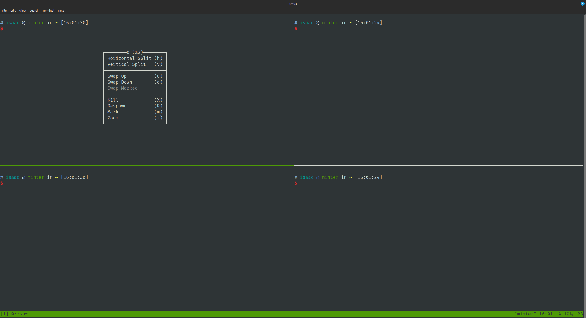
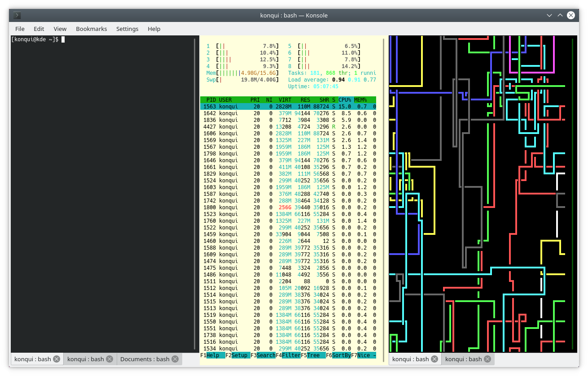
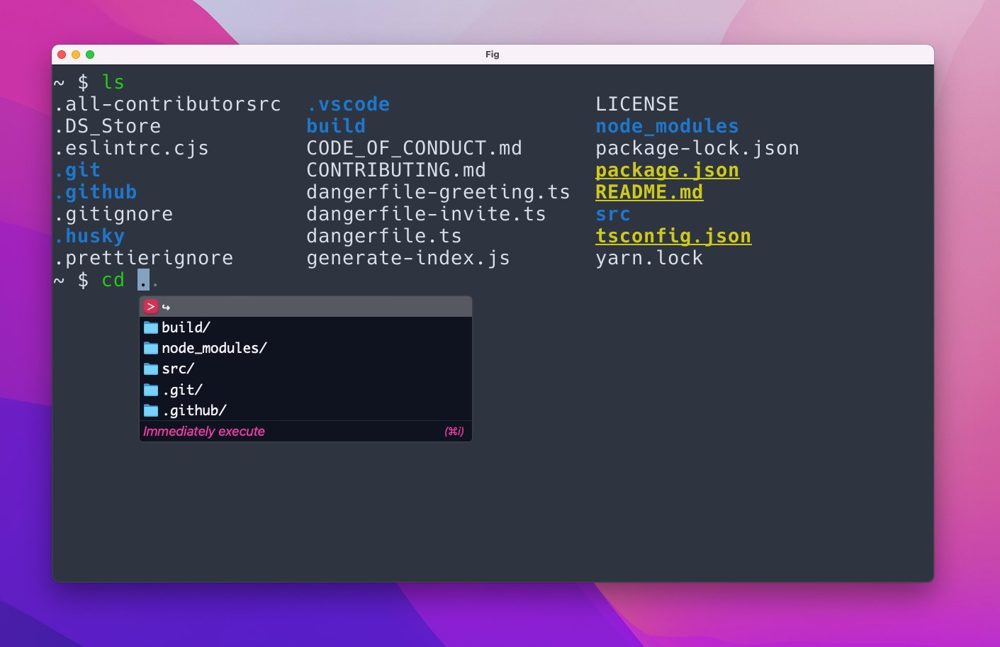

# 前言

使用 Linux 很久，用过多个发行版本，每个版本都有内置的终端模拟器。有 Gnome Terminal、Konsole、GUAKE 等等。使用 MacOS 时遇到了让我觉得刚刚好的终端模拟器 - Iterm2，各种原因下，我不再使用 MacOS，后来就很少让我觉得趁手的终端模拟器。后来，一直使用 Windows 和 Linux。Windows 下用的是 Windows Terminal（这是应用名），配合 WSL2，够用也漂亮，知道在开发中遇到 WSL2 无法解决的情况，再次投身到 Linux 的海洋中。目前使用 Linux Mint 21，它是个漂亮且好用的发行版本。Linux 下的终端始终是我内心深处的刺呢，一直在尝试着其他终端：Konsole、Kitty、tmux、Tabby、Terminator、Tilda等等，花了不少的时间安装、配置，遇到不少的问题，都没有达到心目中期望的样子。直到遇到了 Tilix。

<!-- more -->

# 摘要

todo

- 提 tmux、kconsole 和 kitty，他们都是不错的。为什么最后没有继续用。

- 我期待的终端是怎么样的？

- tilix 的安装、配置

# 背景

- Kernel: 5.15.0-86-generic x86_64 
- bits: 64 
- compiler: gcc 
- v: 11.4.0 
- Desktop: <mark>Cinnamon 5.8.4</mark>
- tk: GTK 3.24.33
- dm: LightDM 
- Distro: <mark>Linux Mint 21.2 Victoria</mark>
- base: Ubuntu 22.04 jammy

# Tmux

## 简述

Tmux 是一个终端复用器，可以在一个终端窗口中同时运行多个终端会话。它允许用户在一个终端中创建、管理和切换多个虚拟终端，从而提高工作效率。

使用 tmux，你可以在一个终端窗口中创建多个窗格和标签页，每个窗格和标签页都可以运行独立的终端会话。这意味着你可以同时查看和操作多个终端，而无需打开多个终端窗口。

tmux 提供了一系列命令和快捷键，用于管理和控制终端会话。你可以轻松地创建、关闭、切换和重命名窗格和标签页，调整它们的大小和布局，以适应你的工作需求。你还可以在不同的窗格和标签页之间进行复制粘贴操作，共享剪贴板内容。

另外，tmux 还支持会话的分离和附加功能。这意味着你可以在一个tmux会话中运行命令，然后将会话分离，保持命令在后台运行。稍后，你可以重新附加到该会话，恢复之前的终端会话状态。

tmux 是一个强大的工具，特别适用于需要同时处理多个终端会话的情况，如远程服务器管理、开发调试等。它提供了灵活的配置选项，允许用户自定义外观、键绑定和其他行为。

它功能丰富、灵活且强大的终端复用器，为用户提供了更高效地管理和控制终端会话的能力。它是命令行界面的一个有用工具，广泛应用于Unix-like系统中。

## 为什么选择了 Tmux

实话说，我会使用 Tmux 是看中了他分屏的功能。在经历多多个终端模拟器的试用无果后，我也倦怠于此。我打算着使用 Mint 自带的 Gnome Terminal（不支持分屏） 配合 Tmux 使用。

距离上次使用 Tmux 已经是 4、5 年前，现在 Tmux 已经变得更加优秀，更好的鼠标指针支持，让我惊艳的是它已经支持右键菜单，分屏、关闭、切换都已经很轻松，一句话的配置就已经解决了大部分的问题。

```shell
# ~/.tmux.conf
set -g mouse on
```




## 放弃的原因

最大的问题来源于剪切板。Tmux 自有一套剪切板，并且它与系统剪切板并不是双向共享的。这让我难受，可以想像：你执行某个命令是出现了异常，提供了异常信息。你发现你解决不了，因此你打算复制异常信息到浏览器或其他地方以寻找答案。此时你发现此路不通！你只好手打了异常信息关键字进行搜索。天可怜见，你找到了答案。你复制答案的解决命令尝试解决，突然你发现你复制的内容在终端内变了样！此时此刻，你只想数数天上的草泥马。

因此，我花了不少的时间尝试去解决这个问题。安装 xclip，编辑配置文件尝试让 tmux 剪切板自动写入系统的剪切板。但是都不尽如人意，最终，我选择后退一步，编写了 2 个 shell 命令，以在有需要时手动写入对应的剪切板：

*读取 tmux 的剪切板内容，写入 xclip，`sysclip-read-tmux`*

```shell
#!/bin/bash
tmux show-buffer | xclip -selection clipboard
```

在 tmux 中复制内容后，执行 `sysclip-read-tmux`。

*读取系统剪切板，写入 tmux，`sysclip-write-tmux`*

```shell
echo "$(xclip -o -selection clipboard)" | tmux load-buffer -
```

在非 tmux 中复制内容后，在 tmux 下执行 `sysclip-write-tmux`。

以上这个解决方案是我最后可以使用的解决方案，是我最后的倔强。

除了剪切板问题外，有几个审美上的问题，我可以接受，但是希望更好的是：

1. 窗口分割线，分割窗口后的分割线不符合我的审美，并且未找到方案修改。我也不愿意继续花更多时间寻找它的解决方案；

2. 右键菜单，虽然支持右键菜单，功能更好了，但是难看是不争的事实；

3. 底部状态栏，同上。


# Konsole



## 简述

Konsole 是一个流行的终端模拟器，用于在 Linux 和其他 UNIX-like 操作系统上提供命令行界面。它是 KDE 桌面环境的一部分，并且是 Konqueror 项目的一部分。

Konsole 提供了一个功能丰富的用户界面，使用户可以通过命令行与计算机系统进行交互。它支持多标签页，允许用户同时打开多个终端会话，并在它们之间轻松切换。每个标签页可以独立设置，包括配色方案、字体、背景图像等。

Konsole 还具有许多其他功能，如自动完成、命令历史记录、拖放文本等。它支持多种终端模拟协议，包括本地终端、远程 SSH、Telnet 和串口连接，使用户能够通过网络或串口访问和管理其他计算机或设备。

除了基本的终端功能外，Konsole 还支持一些高级特性，如分屏显示和垂直拆分，使用户可以在同一个终端窗口中同时查看和操作多个终端会话。

## 为什么选择了 Konsole

最开始接触 Konsole 是安装 Manjora（KDE） 时，也是我第一次安装 KDE 桌面环境。Konsole 是它自带的终端模拟器。它自带的分屏的功能实在是让我惊艳。在使用其他发行版本时，Konsole 一直是我首选的终端模拟器。

## 放弃的原因

成也 KDE，败也 KDE。正如文章前面的背景所见，我当前使用的 Cinnamon，KDE 虽然不错，但是 Cinnamon 的更让我爱不释手。而 Konsole 作为 KDE 所设计的终端模拟器，它自身常见的问题被放大！

尽管 Konsole 是一个稳定且功能强大的终端模拟器，但在某些情况下，用户可能会遇到一些常见的问题。以下是一些可能出现的问题和解决方法：

1. 字符编码问题：有时候，Konsole 可能无法正确显示特定字符或文本文件。这可能是由于字符编码设置不正确导致的。解决方法是确保 Konsole 的字符编码与所使用的文本文件或终端环境的字符编码一致。

2. 配色方案问题：Konsole 提供了自定义配色方案的功能，但有时用户可能会遇到配色方案无法正常加载或显示的问题。这可能是由于配色方案文件的格式错误或不兼容导致的。解决方法是检查配色方案文件的格式，并确保它与 Konsole 的版本兼容。

3. 快捷键冲突：Konsole 允许用户自定义键盘快捷键，但有时可能会出现与系统或其他应用程序的快捷键冲突的问题。这可能导致快捷键无法正常工作或产生意外的结果。解决方法是检查和调整 Konsole 的快捷键设置，避免与其他应用程序的快捷键冲突。

4. 闪烁或屏幕损坏：在某些情况下，Konsole 的窗口可能出现闪烁或显示异常的情况。这可能是由于图形驱动程序或 Konsole 本身的兼容性问题引起的。解决方法包括更新图形驱动程序、升级 Konsole 到最新版本或尝试其他终端模拟器。

5. 远程连接问题：如果使用 Konsole 进行远程连接（如 SSH），可能会遇到连接失败、断开或延迟等问题。这可能是由于网络问题、远程服务器配置或安全设置等原因引起的。解决方法包括检查网络连接、确认远程服务器设置正确并调整Konsole的连接参数。

这些问题在 Cinnamon 桌面环境下变得更加常见，并且一些样式也走形。它的这些劣质化现象，让我宁愿使用 Gnome Terminal + Tmux，也不使用它。在安装它 1 小时后就被我扔进了垃圾桶。另外，在 KDE 下可以忍受的问题也变得如眼中刺，比如它“常在”的滚动条，在分屏后更加让人无法忍受的丑陋！

# Kitty


## 简述

Kitty 是一个现代化的终端模拟器，设计用于提供强大的命令行界面和丰富的功能。它是一个跨平台的终端模拟器，可在 Linux、macOS 和 Windows 等操作系统上使用。

Kitty 的目标是提供高性能和可定制性。它采用 GPU 加速技术，可以处理大量字符和图形渲染，从而实现流畅的终端体验。此外，Kitty 还支持像素级的渲染，使用户可以在终端中显示高分辨率的图像和图标。

Kitty 具有许多先进的功能，包括多标签页和分屏显示，使用户可以同时管理多个终端会话。它支持自动完成、命令历史记录、滚动回放等常见的终端功能。Kitty 还支持基于鼠标的交互，用户可以使用鼠标选择文本、复制粘贴内容等。

除此之外，Kitty 还提供了丰富的自定义选项，用户可以自定义配色方案、字体、键盘快捷键等，以满足个人偏好和需求。它还支持脚本扩展和插件，允许用户根据自己的需求添加额外的功能和扩展。

## 为什么选择了 Kitty

正如简述中提到的，“它采用 GPU 加速技术”，因此它渲染出来而文字以及色彩，让人眼前一量，打开两个终端就可以看到肉眼可见的差距。仿如你第一次看到苹果视网膜屏幕的惊艳。在阅读文档后，我知道它支持分屏的功能，更加让我认定它了！它渲染的细腻程度更甚于我推崇的 Tilix！尽管它的配置方式（通过配置文件）让我觉得麻烦，但是我还是愿意花更多时间去阅读文档研究它，设置好了配色方案、分屏对应的快捷键等等。欣喜地在接下来几天都在使用它。

## 放弃的原因

todo
