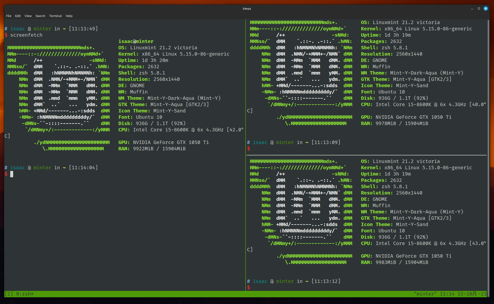
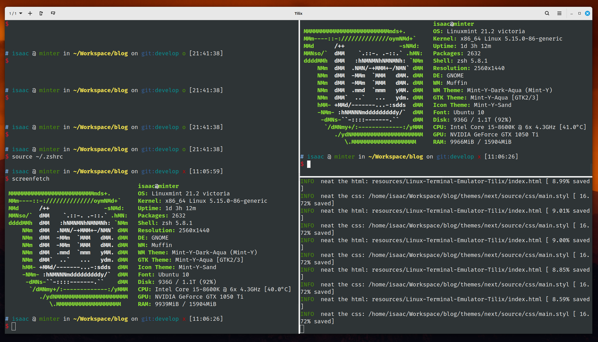

# 前言

使用 Linux 很久，用过多个发行版本，每个版本都有内置的终端模拟器。有 Gnome Terminal、Konsole、GUAKE 等等。使用 MacOS 时遇到了让我觉得刚刚好的终端模拟器 - Iterm2，各种原因下，我不再使用 MacOS，后来就很少让我觉得趁手的终端模拟器。后来，一直使用 Windows 和 Linux。Windows 下用的是 Windows Terminal（这是应用名），配合 WSL2，够用也漂亮，知道在开发中遇到 WSL2 无法解决的情况，再次投身到 Linux 的海洋中。目前使用 Linux Mint 21，它是个漂亮且好用的发行版本。Linux 下的终端始终是我内心深处的刺呢，一直在尝试着其他终端：Konsole、Kitty、tmux、Tabby、Terminator、Tilda等等，花了不少的时间安装、配置，遇到不少的问题，都没有达到心目中期望的样子。直到遇到了 Tilix。

<!-- more -->

# 摘要

该文章首先介绍了 Tilix 终端模拟器的基本信息和特点。它强调了 Tilix 的配置简单性，通过直观的图形界面使得用户可以轻松地自定义终端的外观和行为。此外，文章还强调了 Tilix 的原生分屏功能，允许用户在一个终端窗口中同时运行多个程序或命令。

接下来，文章详细介绍了 Tilix 的特性和功能。它强调了 Tilix 的分屏功能对于多任务处理的便利性，用户可以轻松地在一个窗口中切换和管理多个终端会话。文章还提到了 Tilix 支持的其他功能，如标签页、会话管理、快捷键等，这些功能使得 Tilix 成为一个强大而灵活的终端模拟器。

此外，文章还探讨了 Tilix 的外观定制性。它介绍了 Tilix 提供的丰富的配色方案和字体选项，以及与桌面环境整体外观风格一致的 GTK 主题集成。这使得用户可以根据自己的喜好和需求来个性化定制终端的外观。

最后，文章总结了 Tilix 的优点，并提到了它与其他终端模拟器（如 kitty、tmux、gnome-terminal 和 konsole）的比较。它强调了 Tilix 在配置简单性、原生分屏支持和外观美观性方面的优势，使得 Tilix 成为一个备受欢迎的终端模拟器。


# 背景

```shell
System:
  Kernel: 5.15.0-86-generic x86_64 bits: 64 compiler: gcc v: 11.4.0 Desktop: Cinnamon 5.8.4
    tk: GTK 3.24.33 wm: muffin dm: LightDM Distro: Linux Mint 21.2 Victoria base: Ubuntu 22.04 jammy
Machine:
  Type: Desktop Mobo: ASUSTeK model: TUF B360M-PLUS GAMING S v: Rev X.0x
    serial: <superuser required> UEFI: American Megatrends v: 2418 date: 06/04/2019
CPU:
  Info: 6-core model: Intel Core i5-8600K bits: 64 type: MCP arch: Coffee Lake rev: A cache:
    L1: 384 KiB L2: 1.5 MiB L3: 9 MiB
  Speed (MHz): avg: 4100 min/max: 800/4300 cores: 1: 4100 2: 4100 3: 4100 4: 4100 5: 4100
    6: 4100 bogomips: 43200
  Flags: avx avx2 ht lm nx pae sse sse2 sse3 sse4_1 sse4_2 ssse3 vmx
```
# Tmux



## 简述

Tmux 是一个终端复用器，可以在一个终端窗口中同时运行多个终端会话。它允许用户在一个终端中创建、管理和切换多个虚拟终端，从而提高工作效率。

使用 tmux，你可以在一个终端窗口中创建多个窗格和标签页，每个窗格和标签页都可以运行独立的终端会话。这意味着你可以同时查看和操作多个终端，而无需打开多个终端窗口。

tmux 提供了一系列命令和快捷键，用于管理和控制终端会话。你可以轻松地创建、关闭、切换和重命名窗格和标签页，调整它们的大小和布局，以适应你的工作需求。你还可以在不同的窗格和标签页之间进行复制粘贴操作，共享剪贴板内容。

另外，tmux 还支持会话的分离和附加功能。这意味着你可以在一个tmux会话中运行命令，然后将会话分离，保持命令在后台运行。稍后，你可以重新附加到该会话，恢复之前的终端会话状态。

tmux 是一个强大的工具，特别适用于需要同时处理多个终端会话的情况，如远程服务器管理、开发调试等。它提供了灵活的配置选项，允许用户自定义外观、键绑定和其他行为。

它功能丰富、灵活且强大的终端复用器，为用户提供了更高效地管理和控制终端会话的能力。它是命令行界面的一个有用工具，广泛应用于Unix-like系统中。

## 为什么选择了 Tmux

实话说，我会使用 Tmux 是看中了他分屏的功能。在经历多多个终端模拟器的试用无果后，我也倦怠于此。我打算着使用 Mint 自带的 Gnome Terminal（不支持分屏） 配合 Tmux 使用。

距离上次使用 Tmux 已经是 4、5 年前，现在 Tmux 已经变得更加优秀，更好的鼠标指针支持，让我惊艳的是它已经支持右键菜单，分屏、关闭、切换都已经很轻松，一句话的配置就已经解决了大部分的问题。

```shell
# ~/.tmux.conf
set -g mouse on
```


## 放弃的原因

最大的问题来源于剪切板。Tmux 自有一套剪切板，并且它与系统剪切板并不是双向共享的。这让我难受，可以想像：你执行某个命令是出现了异常，提供了异常信息。你发现你解决不了，因此你打算复制异常信息到浏览器或其他地方以寻找答案。此时你发现此路不通！你只好手打了异常信息关键字进行搜索。天可怜见，你找到了答案。你复制答案的解决命令尝试解决，突然你发现你复制的内容在终端内变了样！此时此刻，你只想数数天上的草泥马。

因此，我花了不少的时间尝试去解决这个问题。安装 xclip，编辑配置文件尝试让 tmux 剪切板自动写入系统的剪切板。但是都不尽如人意，最终，我选择后退一步，编写了 2 个 shell 命令，以在有需要时手动写入对应的剪切板：

*读取 tmux 的剪切板内容，写入 xclip，`sysclip-read-tmux`*

```shell
#!/bin/bash
tmux show-buffer | xclip -selection clipboard
```

在 tmux 中复制内容后，执行 `sysclip-read-tmux`。

*读取系统剪切板，写入 tmux，`sysclip-write-tmux`*

```shell
echo "$(xclip -o -selection clipboard)" | tmux load-buffer -
```

在非 tmux 中复制内容后，在 tmux 下执行 `sysclip-write-tmux`。

以上这个解决方案是我最后可以使用的解决方案，是我最后的倔强。

除了剪切板问题外，有几个审美上的问题，我可以接受，但是希望更好的是：

1. 窗口分割线，分割窗口后的分割线不符合我的审美，并且未找到方案修改。我也不愿意继续花更多时间寻找它的解决方案；

2. 右键菜单，虽然支持右键菜单，功能更好了，但是难看是不争的事实；

3. 底部状态栏，同上。


# Konsole


## 简述

Konsole 是一个流行的终端模拟器，用于在 Linux 和其他 UNIX-like 操作系统上提供命令行界面。它是 KDE 桌面环境的一部分，并且是 Konqueror 项目的一部分。

Konsole 提供了一个功能丰富的用户界面，使用户可以通过命令行与计算机系统进行交互。它支持多标签页，允许用户同时打开多个终端会话，并在它们之间轻松切换。每个标签页可以独立设置，包括配色方案、字体、背景图像等。

Konsole 还具有许多其他功能，如自动完成、命令历史记录、拖放文本等。它支持多种终端模拟协议，包括本地终端、远程 SSH、Telnet 和串口连接，使用户能够通过网络或串口访问和管理其他计算机或设备。

除了基本的终端功能外，Konsole 还支持一些高级特性，如分屏显示和垂直拆分，使用户可以在同一个终端窗口中同时查看和操作多个终端会话。

## 为什么选择了 Konsole

最开始接触 Konsole 是安装 Manjora（KDE） 时，也是我第一次安装 KDE 桌面环境。Konsole 是它自带的终端模拟器。它自带的分屏的功能实在是让我惊艳。在使用其他发行版本时，Konsole 一直是我首选的终端模拟器。

## 放弃的原因

成也 KDE，败也 KDE。正如文章前面的背景所见，我当前使用的 Cinnamon，KDE 虽然不错，但是 Cinnamon 的更让我爱不释手。而 Konsole 作为 KDE 所设计的终端模拟器，它自身常见的问题被放大！

尽管 Konsole 是一个稳定且功能强大的终端模拟器，但在某些情况下，用户可能会遇到一些常见的问题。以下是一些可能出现的问题和解决方法：

1. 字符编码问题：有时候，Konsole 可能无法正确显示特定字符或文本文件。这可能是由于字符编码设置不正确导致的。解决方法是确保 Konsole 的字符编码与所使用的文本文件或终端环境的字符编码一致。

2. 配色方案问题：Konsole 提供了自定义配色方案的功能，但有时用户可能会遇到配色方案无法正常加载或显示的问题。这可能是由于配色方案文件的格式错误或不兼容导致的。解决方法是检查配色方案文件的格式，并确保它与 Konsole 的版本兼容。

3. 快捷键冲突：Konsole 允许用户自定义键盘快捷键，但有时可能会出现与系统或其他应用程序的快捷键冲突的问题。这可能导致快捷键无法正常工作或产生意外的结果。解决方法是检查和调整 Konsole 的快捷键设置，避免与其他应用程序的快捷键冲突。

4. 闪烁或屏幕损坏：在某些情况下，Konsole 的窗口可能出现闪烁或显示异常的情况。这可能是由于图形驱动程序或 Konsole 本身的兼容性问题引起的。解决方法包括更新图形驱动程序、升级 Konsole 到最新版本或尝试其他终端模拟器。

5. 远程连接问题：如果使用 Konsole 进行远程连接（如 SSH），可能会遇到连接失败、断开或延迟等问题。这可能是由于网络问题、远程服务器配置或安全设置等原因引起的。解决方法包括检查网络连接、确认远程服务器设置正确并调整Konsole的连接参数。

这些问题在 Cinnamon 桌面环境下变得更加常见，并且一些样式也走形。它的这些劣质化现象，让我宁愿使用 Gnome Terminal + Tmux，也不使用它。在安装它 1 小时后就被我扔进了垃圾桶。另外，在 KDE 下可以忍受的问题也变得如眼中刺，比如它“常在”的滚动条，在分屏后更加让人无法忍受的丑陋！

# Kitty


## 简述

Kitty 是一个现代化的终端模拟器，设计用于提供强大的命令行界面和丰富的功能。它是一个跨平台的终端模拟器，可在 Linux、macOS 和 Windows 等操作系统上使用。

Kitty 的目标是提供高性能和可定制性。它采用 GPU 加速技术，可以处理大量字符和图形渲染，从而实现流畅的终端体验。此外，Kitty 还支持像素级的渲染，使用户可以在终端中显示高分辨率的图像和图标。

Kitty 具有许多先进的功能，包括多标签页和分屏显示，使用户可以同时管理多个终端会话。它支持自动完成、命令历史记录、滚动回放等常见的终端功能。Kitty 还支持基于鼠标的交互，用户可以使用鼠标选择文本、复制粘贴内容等。

除此之外，Kitty 还提供了丰富的自定义选项，用户可以自定义配色方案、字体、键盘快捷键等，以满足个人偏好和需求。它还支持脚本扩展和插件，允许用户根据自己的需求添加额外的功能和扩展。

## 为什么选择了 Kitty

正如简述中提到的，“它采用 GPU 加速技术”，因此它渲染出来而文字以及色彩，让人眼前一量，打开两个终端就可以看到肉眼可见的差距。仿如你第一次看到苹果视网膜屏幕的惊艳。在阅读文档后，我知道它支持分屏的功能，更加让我认定它了！它渲染的细腻程度更甚于我推崇的 Tilix！尽管它的配置方式（通过配置文件）让我觉得麻烦，但是我还是愿意花更多时间去阅读文档研究它，设置好了配色方案、分屏对应的快捷键等等。欣喜地在接下来几天都在使用它。

## 放弃的原因

Kitty 默认不支持 Fctix，我无法在 Kitty 中切换输入法，中文无法输入！我本以为这只是个不难解决问题。但经历一天的煎熬之下，我依然无法解决这个问题。

在看到 [ kitten for IME input #469 ](https://github.com/kovidgoyal/kitty/issues/469) 后得知 Kitty 天然对 IME 是不友好的。Kitty 的作者  kovidgoyal 明言，为了输入速度和优化，已经默认关闭 IME 的支持！

在 issue 中你可以看到一些人通过设置环境变量（`GLFW_IM_MODULE=ibus`）解决了，但也有同样操作而无效的人，这无疑是相当于开盲盒。像个美丽而脆弱的工艺品，只能说 Kitty 不适合 IME 的用户，不适合中文开发者。

抛开 Kitty 细腻的渲染不谈，它也是有一些让我不喜欢的点：

1. 窗口分割，虽然支持，但是仅能在子窗口中进行分割；

2. 配置方式，仅仅支持通过配置文件配置，无图形界面，主要它的默认功能也没满足我需求；

3. 无右键菜单；

虽然 Kitty 漂亮，但得承认它是个需要折腾，并且不容易折腾的工具！

# Tilix



## 简述

Tilix 是一个功能强大的终端模拟器，旨在提供先进的功能和用户友好的界面。它是为 GNOME 桌面环境设计的，但也可以在其他桌面环境中使用。

Tilix 具有多标签页和分屏显示功能，允许用户在一个窗口中同时打开和管理多个终端会话。这使得在同一界面中同时进行多个任务变得更加方便。用户可以自定义标签页和窗格的布局、大小和外观，以适应个人工作流程和偏好。

Tilix 还支持配置文件和会话管理功能，允许用户保存和加载特定的终端会话设置。这对于经常需要在不同项目或工作环境之间切换的用户来说非常有用。

除了基本的终端功能外，Tilix 提供了许多其他实用的特性。它支持拆分窗格、滚动回放和自动隐藏等功能，使用户能够更灵活地管理和浏览终端输出。Tilix 还支持自定义命令、快捷键和配色方案，以满足用户的个性化需求。

Tilix 还具有一些高级功能，如书签、自动完成、透明度调节和跨平台支持等。它还支持标签页间的拖放操作，方便用户在不同标签页之间移动终端会话。


## 安装

```shell
sudo apt install tilix -y
```

## 为什么选择了 Tilix

正如文章的标题，一切都是刚刚好，它准确戳中了我的 G 点上。分屏、配置都不用花费什么功夫即可达到我期望的模样！

### 分屏


Tilix 原生支持分屏功能。各个分屏窗口相互独立，不会相互影响，至少目前没有发现类似 tmux 旧版的“选中内容跨窗口”的现象。

- **调用分屏功能**：调用分屏功能使用简单方便。在顶部 menu 栏左边分别包含“水平左右分屏”和“竖直上下分屏”按钮。另外，在内容区域内，使用鼠标右键激活的菜单中同上包含上面 2 个分屏选项。

- **调节分屏窗口大小**：各个分屏窗口的分割线支持使用鼠标进行拖动以调节分屏窗口的大小。

- **分屏位置**：不像 Kitty 那样只能在子窗口中分割，Tilix 支持基于任意窗口中进行上下、左右分割。

### 配置

Tilix 支持可以可视化配置，基本功能的配置都可以通过此方式配置，只需要右击右上菜单按钮的 `preferences` 即可进入设置面板！。是不想折腾人的福音，如我，并不打算花大量的时间在配置、调节上。这样做对于我来说是本末倒置。花费的时间不一定获得好的结果。退一步说，假如是好的结果。在新的环境中，我不得不继续花大量的时间配置才能获得相同的体验。


下面是我所关注的几个配置：

- **配色方案**：Tilix 提供 9 个可选的配色方案选择。另外，亦可以自定义配色方案；

- **字体设置**：可视化配置 font family 和 font size；

除了上面 2 个配置项外，还支持更多的。其他则交由你自己去探索了。

### 加分项

- 聪明的滚动条：适时地出现，不如 konsole 那样，不可设置地固定常驻，并且是丑陋的拉老旧样式；鼠标指针悬浮时有“激活”的交互效果以便更容易拖动；


- **Quake 模式**：Tilix 原生支持 Quake 模式，通过快捷键即可快捷弹出终端窗口；

- **漂亮的分割线**：这个只能说是我个人审美。并且提供宽、窄两种尺寸的供选择。

## 总结

在与其他终端模拟器（kitty、tmux、gnome-terminal、konsole）进行比较时，Tilix 突出的优点主要体现在以下几个方面：

1. **简单易用的配置**：Tilix 提供了直观的图形界面，使得配置终端外观和行为变得简单明了。与其他终端模拟器相比，Tilix 的配置选项更易于理解和操作，无需深入了解复杂的配置文件。

2. **原生支持分屏**：Tilix 内置了强大的分屏功能，允许在一个终端窗口中分割出多个面板，每个面板可以运行不同的程序或命令。这使得在一个窗口中同时进行多个操作或监视多个任务变得非常方便，而无需额外的终端复用工具。

3. **外观好看**：Tilix 提供了吸引人的外观选项，可以自定义终端的颜色、字体、透明度等。此外，它还支持与桌面环境的整体外观风格保持一致的 GTK 主题集成，使得终端在视觉上更加美观、一致且个性化。

相比之下：

- kitty 是一个快速、跨平台的终端模拟器，它支持 GPU 加速和高度可定制的配置。然而，Tilix 提供更简单的配置界面和原生的分屏支持，使得初学者更容易上手并使用分屏功能。

- tmux 是一个功能强大的终端复用器，可以在一个终端窗口中管理多个会话和窗格。但是，Tilix 提供了直观的图形界面和对分屏的原生支持，无需额外的终端复用工具。

- gnome-terminal 是 GNOME 桌面环境的默认终端模拟器，它提供基本的终端功能和配置选项。与之相比，Tilix 提供了更丰富的功能，特别是分屏和外观定制方面的选项，使得 Tilix 在多任务处理和个性化方面更具优势。

- konsole 是 KDE 桌面环境的默认终端模拟器，它也提供一些高级功能和配置选项。然而，Tilix 的配置界面更加直观，同时也更好地与 GNOME 桌面环境集成，适合在 GNOME 环境下使用。

综上所述，Tilix 在配置简单易用、原生支持分屏和外观美观方面表现出色。这使得 Tilix 成为一个强大且受欢迎的终端模拟器，无论是新手还是有经验的用户，都可以从 Tilix 的功能和可定制性中受益。