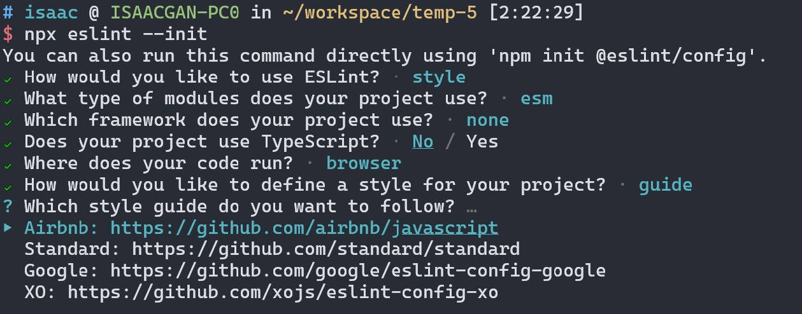
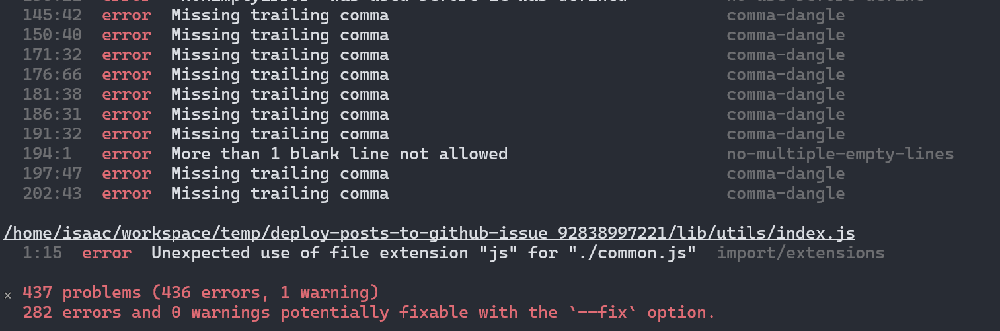
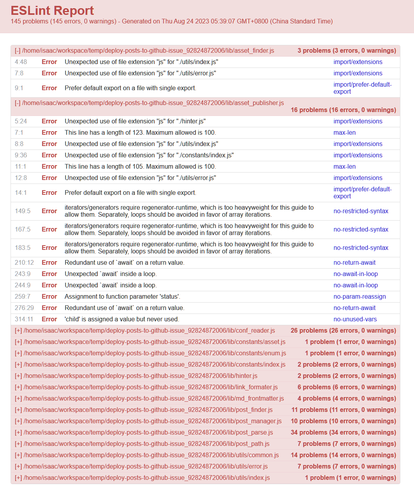
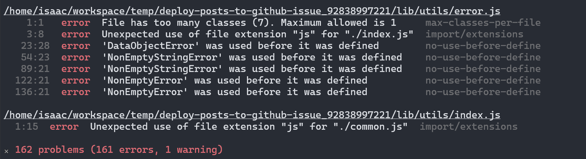
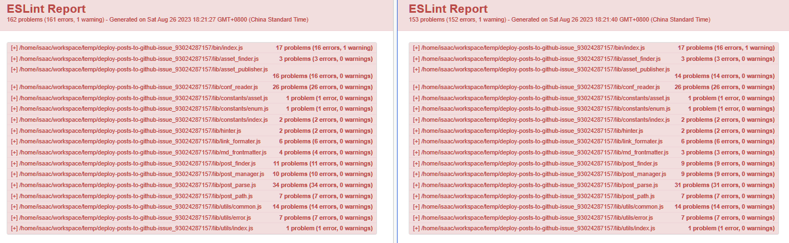
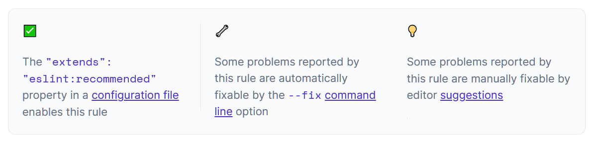
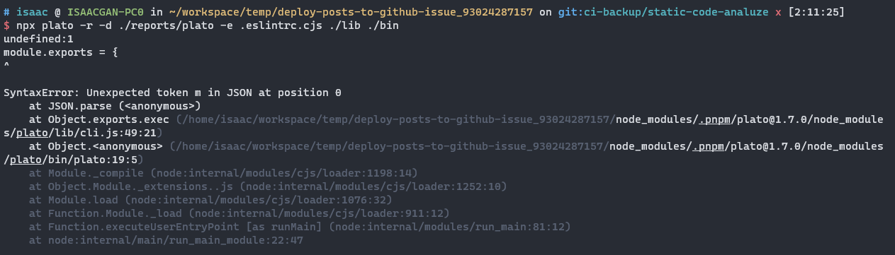
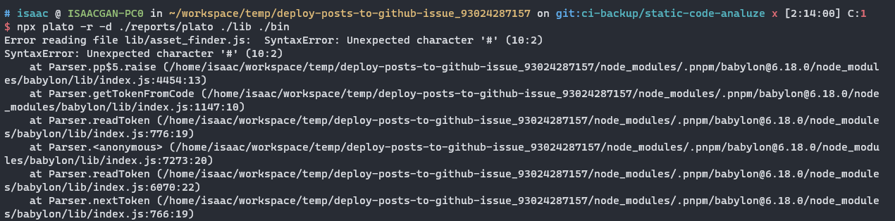
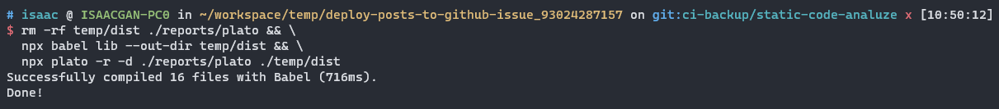
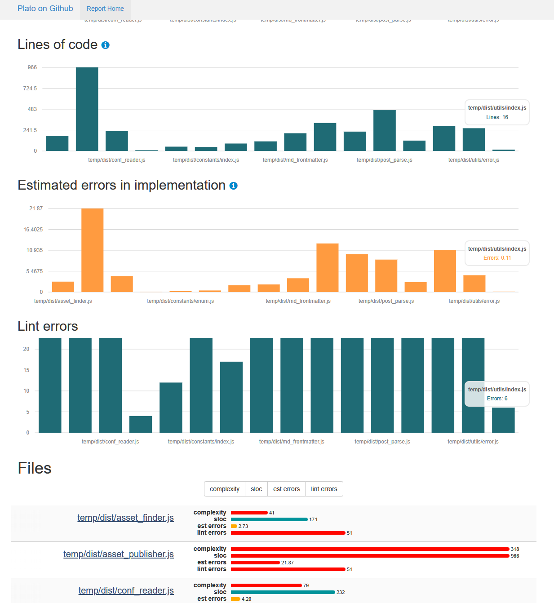

# 摘要


# 静态代码分析

静态代码分析指的是在不实际执行代码的情况下，对源代码进行分析，并识别潜在问题、漏洞或代码质量违规。它是在持续集成和持续部署（CI/CD）流程中进行代码分析的自动化方法。

静态代码分析工具会检查各种编程语言的源代码，检查常见的编码错误、安全漏洞、遵循编码规范和其他最佳实践。这些工具可以检测语法错误、未使用的变量、代码重复、潜在的安全漏洞以及遵循编码风格指南等问题。

通过将静态代码分析集成到 CI/CD 流程中，开发人员可以及早发现并解决代码问题。这有助于提高代码质量、可维护性和安全性，通过在代码进入生产环境之前识别和修复问题。


# 内容构成

静态代码分析的实践主要包括以下几个部分:

1. 语法检查：静态代码分析工具应该能够对 JavaScript 代码进行语法检查，确保代码符合语言规范，避免常见的语法错误。

1. 代码规范检查：静态代码分析工具可以应用各种规范（如ESLint、JSLint等）来检查代码的风格和规范是否符合约定。这包括缩进、命名约定、注释风格等。

1. 代码质量评估：静态代码分析工具应该能够评估代码的质量，包括代码复杂性、重复代码等方面。这些评估可以帮助开发者发现潜在的问题，改进代码结构和性能。

1. 依赖关系分析：对于 JavaScript 项目而言，依赖关系管理是重要的一部分。静态代码分析工具可以分析项目的依赖关系，检查依赖的版本、冲突和安全漏洞，并提供相关建议。

1. 安全漏洞检测：静态代码分析工具应该能够检测 JavaScript 代码中的常见安全漏洞，如跨站脚本攻击（XSS）、SQL 注入、不安全的数据处理等，并提供修复建议。

1. 性能优化建议：静态代码分析工具应该能够分析代码并提供性能优化的建议，帮助开发者改善代码的执行效率、减少资源消耗等。

1. 异步代码分析：JavaScript 中的异步编程是常见的模式之一。静态代码分析工具应该能够处理和分析异步代码，以检测可能的异步错误、回调地狱和资源竞争等问题。

1. 可读性和一致性评估：良好的代码可读性和一致性对于维护和团队协作至关重要。静态代码分析工具应该能够评估代码的可读性和一致性，并提供有关代码风格、命名规范等方面的建议。


这些能力使得静态代码分析工具成为 JavaScript 开发中有力的辅助工具，可以帮助开发者提高代码质量、发现潜在问题，并改进代码风格和实践。常见的静态代码分析工具包括 ESLint、JSHint、JSLint、TSLint 等。

# 实践背景

## 项目

下面将使用 [deploy-posts-to-github-issue] 作为实践的项目，期间部分实践内容会以此项目的克隆作为载体实现。

[](https://github.com/isaaxite/deploy-posts-to-github-issue)

- 模块打包器：rollup

- 测试框架：jest

- 其他：
  - husky：是一个用于在 Git 提交和推送前执行脚本的工具，帮助开发者在关键事件发生前自动运行定制化的操作和脚本。

## 目录结构

```shell
deploy-posts-to-github-issue
├── assets
├── bin
├── CHANGELOG.md
├── commitlint.config.js
├── dist
├── index.js
├── inspiration-flash.md
├── jest.config.mjs
├── jest.dev.config.mjs
├── jest.js
├── lib
├── LICENSE
├── MANUAL.md
├── package.json
├── pnpm-lock.yaml
├── README.md
├── reports
├── rollup.config.js
├── scripts
└── __test__
```

核心代码目录：

```shell
bin/
  └── index.js

lib/
  ├── asset_finder.js
  ├── asset_publisher.js
  ├── conf_reader.js
  ├── constants
  │   ├── asset.js
  │   ├── enum.js
  │   └── index.js
  ├── hinter.js
  ├── link_formater.js
  ├── md_frontmatter.js
  ├── post_finder.js
  ├── post_manager.js
  ├── post_parse.js
  ├── post_path.js
  └── utils
      ├── common.js
      ├── error.js
      └── index.js
```

# 分析工具

## 选型

| 工具                                            | 描述                                                                                | 提出时间  | GitHub Star 数量 |
| ----------------------------------------------- | --------------------------------------------------------------------------------- | ----- | -------------- |
| [ESLint](https://eslint.org/)                   | 可配置的 JavaScript/JS 代码检查工具和静态分析器，替代 JSHint，提供更大的灵活性和可配置性                           | 2013年 | 23.3k          |
| [JSHint](https://jshint.com/)                   | JavaScript/JS 的静态代码分析工具，支持可定制的规则，延续 JSLint 的思想，提供更好的可定制性和适应性                      | 2011年 | 8.9k           |
| [TSLint](https://palantir.github.io/tslint/)    | 针对 TypeScript 的静态代码分析工具，已被 ESLint 取代，提供静态代码检查和规范性的支持                              | 2012年 | 5.9k              |
| [TypeScript](https://www.typescriptlang.org/)   | JavaScript 的超集，带有静态类型检查和编译时静态代码分析能力，提供更严格的类型检查和更好的 IDE 支持，增强 JavaScript 开发环境的可靠性  | 2012年 | 93.5k          |
| [Flow](https://flow.org/)                       | Facebook 开发的 JavaScript/JS 静态类型检查器，为 JavaScript 开发者提供静态类型检查，提高代码质量和可维护性           | 2014年 | 22k          |

从功能性与和流行趋势，TSLint 和 JSHint 已经被 ESLint 替代。而 TypeScript，与其说它是静态代码分析的工具，不如说它是个类似JS的语言。当然它具备静态代码分析的能力，但如果已经开发到一定程度的项目所使用的开发语言是JS的话，使用TS的会有不小的迁移成本！

剩下的是 ESLint 和 Flow，它们提出时间和流行程度都差不多。不妨针对它们做一下对比分析。

下面是使用表格对比 ESLint 和 Flow 的功能：

| 功能            | ESLint                                    | Flow                                 |
| ------------- | ----------------------------------------- | ------------------------------------ |
| 代码检查          | ✔️                                        | ✔️                                   |
| 类型检查          | ❌                                         | ✔️                                   |
| 静态类型推断        | ❌                                         | ✔️                                   |
| 编译时类型检查       | ❌                                         | ✔️                                   |
| 支持 JavaScript | ✔️                                        | ✔️                                   |
| 支持 TypeScript | ✔️                                        | ❌                                    |
| 可配置性          | 高                                         | 中                                    |
| 社区支持          | 大型活跃社区，广泛的插件和扩展库可用                        | 较小的社区，插件和扩展库相对较少                     |
| IDE 集成        | 广泛支持，与许多主流编辑器（如 VS Code、Sublime Text）集成良好 | 有限的 IDE 集成，可能不如 ESLint 的支持广泛和完善      |
| 项目可移植性        | 高                                         | 较低，Flow 的类型注释和配置文件需要进行迁移和调整才能与其他工具兼容 |

需要注意的是，ESLint 和 Flow 在某些功能上有所重叠，但也有一些区别。ESLint 主要关注代码规范和质量检查，而 Flow 则专注于静态类型检查和类型推断。ESLint 的可配置性和社区支持相对较高，适用于 JavaScript 和 TypeScript 项目，并与各种编辑器集成良好。Flow 在类型检查和静态类型推断方面表现出色，但它的社区支持相对较小，与编辑器的集成程度可能不如 ESLint 那么广泛。此外，如果要将项目从 Flow 迁移到其他工具或框架，可能需要进行一些调整和改动。


## ESLint

ESLint 是一个用于检查和规范 JavaScript 代码的开源工具。它可以帮助开发者在编写代码时发现潜在的问题、遵循一致的代码风格，并提供自定义的代码规则。ESLint 具有高度可配置性和灵活性，可以适应不同项目和团队的需求。

以下是 ESLint 的一些主要特点和功能：

1. 代码规范检查： ESLint 可以静态地分析 JavaScript 代码，并根据预定义的规则集检查代码是否符合规范。它可以发现常见的错误、潜在的问题和不一致之处，如未声明的变量、使用未定义的函数、潜在的歧义等。

2. 可配置性： ESLint 具有高度的可配置性，允许开发者根据项目需求和团队的代码风格指南自定义规则。你可以启用、禁用或修改规则，并设置不同的错误级别（警告或错误）。此外，ESLint 还支持配置文件的继承和共享，以便在多个项目中共享和重用配置。

3. 插件和扩展： ESLint 具有丰富的插件生态系统，可以通过插件扩展其功能。插件可以添加额外的规则、支持其他文件类型（如 TypeScript、Vue 等），或提供特定框架或库的规则集。通过安装和配置这些插件，你可以在 ESLint 中使用更多的规则和功能。

4. 自动修复问题： ESLint 具备自动修复问题的能力，可以通过 --fix 标志自动修复一些常见的问题，如不一致的缩进、缺少分号等。这样可以减轻开发者手动修复问题的负担，并提高代码的一致性。

5. 与编辑器和构建工具的集成： ESLint 可以与各种编辑器和构建工具集成，以提供实时的代码检查和反馈。大多数编辑器都支持 ESLint 插件，可以在保存文件时自动运行 ESLint，并在编辑器中显示错误和警告。此外，ESLint 还可以与构建工具（如 webpack、gulp 等）集成，以便在构建过程中进行代码检查。

ESLint 是一个非常强大和流行的工具，被广泛用于 JavaScript 项目中。它可以帮助开发团队保持一致的代码风格、规范代码质量，并提高代码的可读性和可维护性。通过使用 ESLint，开发者可以在早期发现和解决潜在的问题，提高代码的可靠性和稳定性。


eslint 对代码静态分析实践的部分：

- 语法检查；

- 代码规范检查；

- 代码质量评估；

## 安装

```shell
pnpm add --save-dev eslint
```

## 初始化

使用 eslint 提供的能力进行初始化。

```shell
npm init @eslint/config
# ~ or ~
npx eslint --init
```


上面 init 命令分别做了下面几件事：

- 配置 Eslint 的能力范围，prompt 提供三个选项：
    1. 仅作代码检查；
  2. 代码检查与反馈问题；
  3. 代码检查、反馈问题以及格式化。

- 指定模块风格：
  1. JavaScript modules；
  2. CommonJS；
  3. 不设置。

- 选择框架，目前会提供 `Reat` 和 `Vue` 或者不设置；

- 配置是否使用了 TypeScript；

- 配置项目的运行时，Node 或 浏览器（但貌似有 Bug）；

- 选择代码风格的配置方式，提供下面两种方式：
  1. 先择现成的解决方案；
  2. 自定义配置；



在初始化过程中，需要我们选择 Eslint 代码风格。在 Prompt 中可以看到有 Airbnb、Standard，Google 和 XO 四种提供。下面以表格的形式对四种规范做简短说明。

| 代码规范   | 特点                                                         | 缩进    | 引号  | 分号  | 严格相等和不严格相等 | 对象字面量属性排序 | Github Star |
| ---------- | ------------------------------------------------------------ | ----- | --- | --- | ---------- | --------- | --------- |
| [Airbnb](https://github.com/airbnb/javascript)      | - 强调代码的可读性和一致性<br>- 鼓励使用现代的JavaScript语言特性和最佳实践<br>- 包括对代码风格、命名约定、缩进、注释等的建议<br>- 要求使用ES6及以上版本的JavaScript并强制一些严格的规则 | 2 个空格 | 单引号 | 可选  | 推荐使用       | 推荐排序      | 136k |
| [Standard](https://github.com/standard/standard)   | - 简洁明了的JavaScript代码规范<br>- 减少代码样式的争议<br>- 鼓励一种统一的代码风格<br>- 使用两个空格的缩进、禁止使用分号等的具体规则<br>- 遵循ES5的语法 | 2 个空格 | 单引号 | 禁止  | 推荐使用       | 推荐排序      | 28.4k |
| [Google](https://github.com/google/eslint-config-google)     | - Google公司内部广泛使用的规范<br>- 强调可读性、可维护性和性能<br>- 提供了详细的代码编写指南<br>- 支持ES5和ES6语法<br>- 提供一些特定于Google编码风格的规则 | 2 个空格 | 双引号 | 强制  | 推荐使用       | 推荐排序      | 1.7k |
| [XO](https://github.com/xojs/eslint-config-xo)         | - 具有严格规则集的JavaScript代码规范和代码检查工具<br>- 基于ESLint构建<br>- 提供零配置的规范<br>- 强制执行高级规则，如使用ES6模块、禁止使用`console`等<br>- 提供可选的规则来适应不同的开发需求 | 2 个空格 | 单引号 | 禁止  | 推荐使用       | 推荐排序      | 248 |

请注意，以上表格只列出了一些主要的规范特点，并不能穷尽所有规范的细节。对于更详细的规范内容和具体规则，建议查阅各自的官方文档或 GitHub 仓库。选择适合自己或团队的代码规范时，可以深入研究每个规范的详细规则，并根据实际需求进行定制。

在 init 的过程中选择了 airbnb。airbnb发布的ESLint配置规则广为人知,我们可以从以下几个方面对其规则进行分类:

- **代码质量**：包含无用代码检测、最佳实践、复杂度限制等,如no-unused-vars、no-implicit-globals、complexity等。

- **错误防范**：包含可能导致错误的代码模式检测,如no-console、no-debugger、no-alert等。

- **风格统一**：包含代码风格方面的规则,强制一致的代码风格,如quotes、indent、space-before-function-paren等。

- **ES6优先**：包含优先使用ES6新特性的规则,如prefer-const、prefer-rest-params、prefer-spread等。

- **浏览器环境**：包含针对浏览器环境的规则,如no-restricted-globals、no-alert等。

- **Node.js环境**：包含针对Node.js环境的规则,如handle-callback-err、no-mixed-requires等。

- **规范与习惯**：根据通用代码编写规范制定的规则,如camelcase、new-cap、curly等。

- **可读性**：关注代码可读性的规则,如max-len、max-lines、max-params等。

- **变量声明**：规范变量声明方式的规则,如no-var、prefer-const等。

以上分类让我们更直观地看到airbnb规则的覆盖面和侧重点。


初始化完成后，会得到如下的配置文件：

```js
// .eslintrc.cjs

module.exports = {
  env: {
    browser: true,
    es2021: true,
  },
  extends: 'airbnb-base',
  overrides: [
    {
      env: {
        node: true,
      },
      files: [
        '.eslintrc.{js,cjs}',
      ],
      parserOptions: {
        sourceType: 'script',
      },
    },
  ],
  parserOptions: {
    ecmaVersion: 'latest',
    sourceType: 'module',
  },
  rules: {
  },
};
```

其中 env 的配置与上面 init 过程中选择运行时明显不同，下面手动修改为：

```js
  // ...
  env: {
    browser: false,
    node: true,
    es2021: true,
  },
  // ...
```

下面对生成的配置文件中几个配置项做简单说明：

- `env`：指定代码运行的环境，如浏览器环境 (browser)、Node.js 环境 (node) 等；

- `extends`：引用其他配置文件或扩展，可以是已经定义好的配置（如 airbnb-base）、共享配置（如 eslint:recommended）或自定义的配置；

- `globals`：定义全局变量，避免因为全局变量未定义而产生警告；

- `parser`：指定代码解析器，例如 Babel 解析器 (babel-eslint) 或 TypeScript 解析器 (@typescript-eslint/parser)；

- `parserOptions`：指定解析器选项，如 ECMAScript 版本 (ecmaVersion)、源代码类型 (sourceType)、额外的语言特性支持等；

- `plugins`：加载并使用 ESLint 插件，扩展额外的规则和功能；

- `rules`：定义规则，用于检查和强制执行代码的编码规范，可以启用、禁用、配置规则的错误级别等；

- `overrides`：允许对特定文件或文件类型进行额外的配置，可以覆盖全局配置；

ESLint 常用的插件包括:

- [eslint-plugin-react](https://github.com/jsx-eslint/eslint-plugin-react) - 检查 React 代码,支持 JSX 语法等。

- [eslint-plugin-vue](https://github.com/vuejs/eslint-plugin-vue) - 检查 Vue 代码,支持 *.vue 文件。

- [eslint-plugin-angular](https://github.com/Gillespie59/eslint-plugin-angular) - 检查 Angular 代码,支持指令、模块等特性。

- [eslint-plugin-jquery](https://github.com/jquery/eslint-plugin-jquery) - 检查 jQuery 代码。

- [eslint-plugin-node](https://github.com/mysticatea/eslint-plugin-node) - 添加Node.js环境下的JavaScript代码检查。

- [eslint-plugin-import](https://github.com/benmosher/eslint-plugin-import) - 检查ES6+ 的 import/export 语法。

- [eslint-plugin-jsx-a11y](https://github.com/jsx-eslint/eslint-plugin-jsx-a11y) - 辅助检查JSX元素的可访问性。

- [eslint-plugin-promise](https://github.com/xjamundx/eslint-plugin-promise) - 添加Promise相关的规则。

- [eslint-plugin-standard](https://github.com/standard/eslint-plugin-standard) - 实现standard代码风格的规则。

- [eslint-plugin-html](https://github.com/BenoitZugmeyer/eslint-plugin-html) - 检查HTML文件中的JavaScript代码。

- [eslint-plugin-markdown](https://github.com/eslint/eslint-plugin-markdown) - 检查Markdown文件中的代码。

- [eslint-plugin-compat](https://github.com/amilajack/eslint-plugin-compat) - 检查浏览器兼容性问题。

- [eslint-plugin-jest](https://github.com/jest-community/eslint-plugin-jest) - 检查Jest测试框架的代码。

- [eslint-plugin-typescript](https://github.com/typescript-eslint/typescript-eslint) - 添加TypeScript语法支持。

- [eslint-plugin-security](https://github.com/eslint-community/eslint-plugin-security) - 用于检测 JavaScript 代码中的潜在安全漏洞。它提供了一系列规则，用于查找并警告可能导致安全问题的代码模式。

通过使用不同的插件可以大大扩展ESLint的功能范围,适应不同的项目需求。

## 扫描代码

```shell
deploy-posts-to-github-issue
├── assets
├── bin
├── CHANGELOG.md
├── commitlint.config.js
├── dist
├── index.js
├── inspiration-flash.md
├── jest.config.mjs
├── jest.dev.config.mjs
├── jest.js
├── lib
├── LICENSE
├── MANUAL.md
├── package.json
├── pnpm-lock.yaml
├── README.md
├── reports
├── rollup.config.js
├── scripts
└── __test__
```

```shell
npx eslint ./lib/ ./bin/
```




## 质量报告

```shell
npx eslint ./lib ./bin --format=html --output-file=reports/eslint-report.html
```

使用 anywhere 启动 http 服务:



其他支持的输出的格式：

- checkstyle：以 Checkstyle XML 格式输出，适合与其他工具集成；

- compact：以紧凑的格式输出，适合在终端上显示；

- html：以 HTML 格式输出，适合在浏览器中查看；

- jslint-xml：以 JSLint XML 格式输出，适合与其他工具集成；

- json-with-metadata：以 JSON 格式输出，包含元数据信息；

- json：以纯 JSON 格式输出；

- junit：以 JUnit XML 格式输出，适合与持续集成工具集成；

- stylish：以类似于代码样式的格式输出，适合在终端上显示；

- tap：以 TAP（Test Anything Protocol）格式输出，适合与测试框架集成；

- unix：以类 Unix 风格的格式输出，适合在终端上显示；

- visualstudio：以 Visual Studio Code 的问题报告格式输出，适合在编辑器中显示。


## 自动修复

使用 `--fix` 可选项修复部分问题。

```shell
npx eslint --fix ./lib/ ./bin/
```

修复后的报告见下。对比前面的报告，eslint 修复了大部分问题，但实际上 eslint 尽可以修复部分类型的问题。

以下是一些常见的 ESLint 可以自动修复的问题类型：

- 格式问题：例如缩进、空格、换行等方面的问题可以通过自动修复功能进行修复；

- 引号问题：例如单引号和双引号之间的一致性问题可以自动修复；

- 无用代码：例如未使用的变量、未使用的导入等可以通过自动修复进行删除；

- 标准化问题：例如统一函数命名、统一变量命名等可以通过自动修复进行标准化；

- 基本语法问题：例如缺少分号、多余的逗号等可以通过自动修复进行修复。



在了解自动修复的相关内容时，另一款据说相较 Eslint 更强的工具，prettier 出现在我的视线。

根据 prettier 的文档（[Integrating with Linters](https://prettier.io/docs/en/integrating-with-linters)）指引安装了扩展（eslint-config-prettier）和插件（eslint-plugin-prettier）。最终修过没有达到预期，剩下大部分问题依然无法自动格式化，下面是使用 prettier 前（左）后（右）的对比：



- 使用后，问题从162个减少到153个，共11个；

- 对比后得知，被自动修复的问题是 `max-len` 类问题（如下）；

  ```log
  11:1	Error	This line has a length of 105. Maximum allowed is 100.	max-len
  ```


根据 ESLint 报告里面的错误信息,可以将检测到的问题分类如下:

1. 导入语句问题

- Unexpected use of file extension "js" for imports: 应该直接导入模块名,不需要添加.js后缀

- Prefer default export on a file with single export: 当模块只有一个导出时应设置为default导出

2. 代码质量问题

- no-use-before-define: 在定义前使用变量
- no-nested-ternary: 不要嵌套三元表达式 
- no-plusplus: 不要使用++/--运算符
- no-restricted-syntax: 不允许使用语法结构generate/yield

3. 最佳实践问题

- no-param-reassign: 不要修改函数参数
- no-console: 不要使用console语句
- no-alert: 不要使用alert

4. 风格问题

- camelcase: 变量名应使用驼峰命名
- max-classes-per-file: 每个文件类的数量不应超过1个

5. 可读性问题

- no-magic-numbers: 不要使用难懂的数字常量
- no-nested-ternary: 不要嵌套三元表达式

6. 未使用变量问题  

- no-unused-vars: 定义后未使用的变量

7. 循环问题

- no-loop-func: 循环中不要定义函数

以上这些问题都是确实 Eslint 和 prettier 无法自动格式化的问题。实际上，EsLint 的官网也有对那些规则无法格式化有做简短说明，可查阅：[Rules Reference](https://eslint.org/docs/latest/rules/)。

> 

## IDE 集成

TODO

## 强制执行

### git-hook

TODO

## 小结

- [x] 语法检查
- [x] 代码规范检查
- [x] 代码质量评估
- [ ] 依赖关系分析
- [ ] 安全漏洞检测
- [ ] 性能优化建议
- [ ] 异步代码分析
- [ ] 可读性和一致性评估


# 统计报告

## Plato

Plato 是一个基于 JavaScript 的代码分析和可视化工具，用于生成代码复杂度报告和可视化图表。它提供了对圈复杂度、函数长度、类复杂度等指标的详细分析和可视化展示。

## 安装与使用

```shell
# 安装
pnpm add plato --save-dev

# 使用
npx plato -r -d ./reports/plato -e .eslintrc.cjs ./lib ./bin
```

这句命令是使用 `plato` 工具生成代码复杂度报告的命令。它的作用是在指定的目录下分析 JavaScript 文件，并生成递归的代码复杂度报告，报告输出到 `./reports/plato` 目录。同时，还会使用指定的 ESLint 配置文件进行代码分析。

下面对命令中的各个部分进行解释：

- `-r`: 表示生成递归报告。递归报告会分析指定目录下的所有 JavaScript 文件及其子目录中的文件。

- `-d ./reports/plato`: `-d` 是 `plato` 的一个命令行选项，用于指定报告输出目录。在这个命令中，将报告输出到 `./reports/plato` 目录。

- `-e .eslintrc.cjs`: `-e` 是 `plato` 的一个命令行选项，用于指定 ESLint 配置文件。在这个命令中，使用 `.eslintrc.cjs` 文件作为 ESLint 的配置文件。

- `./lib ./bin`: `./lib ./bin` 是指定要分析的 JavaScript 文件或目录。在这个命令中，分析 `./lib` 和 `./bin` 目录下的 JavaScript 文件。

## 遇到的问题


### 配置文件扩展名

*遇到第一个问题：不支持 `cjs` 扩展名的配置文件，根据提示推断是要求 json 格式的。*



这个先按下，跳过指定 eslint 的配置文件。

```shell
npx plato -r -d ./reports/plato ./lib ./bin
```

出现了第二个问题：plato 不支持 ES6+ 的 Class 死有属性语法。时至今日，不支持这个语法，或许可以认为这个工具已经被抛弃。从目前的状况确实是这样，最后一次更新已经是 7 年前！但是它确实目前我可以找到功能比较完备的带质量报告生成工具。



既然是语法的兼容性问题，那就用 babel 做转译兼容。最终目的是在保留目录解构的前提下，做最小程度的兼容：

安装 babel 相关 pkg：

```shell
pnpm add --save-dev @babel/core @babel/cli
```

添加插件编译私有方法与属性：

```shell
pnpm add --save-dev \
  @babel/plugin-transform-class-properties \
  @babel/plugin-transform-private-methods \
  @babel/plugin-transform-private-property-in-object
```

配置文件（`.babelrc`）

```json
{
  "plugins": [
    "@babel/plugin-transform-class-properties",
    "@babel/plugin-transform-private-property-in-object",
    "@babel/plugin-transform-private-methods"
  ]
}
```

编译与生成质量报告：

```shell
rm -rf temp/dist ./reports/plato && \
  npx babel lib --out-dir temp/dist && \
  npx plato -r -d ./reports/plato ./temp/dist
```

### 点操作符的可选语法

出现另外的问题：plato 不支持点操作符的可选语法。安装 `@babel/plugin-transform-optional-chaining` 插件转译此语法，再此生成报告：



生成 html 格式的质量报告，使用 `anywhere` 渲染后，在浏览器打开：




## Plato报告概述

Plato 提供了一系列质量指标来评估代码的质量和复杂性。以下是一些常见的 Plato 提供的质量指标：
好的,我来重新说明一下Plato的各项代码质量指标以及数值变化的含义:

- Lines of Code(LOC) - 源代码总行数。

- Total Complexity - 整体复杂度评分。增加表示代码整体复杂度上升。

- Average Complexity - 每个函数的平均复杂度。增加表示每个函数复杂度提高。

- Function Declarations - 函数声明数量。增加表示函数数增多。

- Global Variables - 全局变量使用数量。增加表示使用更多全局变量。

- Cyclomatic Complexity - 圈复杂度。增加表示代码路径增加,逻辑更复杂。

- Halstead metrics - 几项代码复杂度度量。提高表示代码更复杂。

- Maintainability Index - 可维护性指数。下降代表可维护性降低。

- Lint Errors - Lint检查出的错误数。增加表示代码质量问题更多。 

- Estimated Errors - 预测出的错误数。增加表示可能出错机会上升。

综上, Plato的指标上升通常代表代码质量和可维护性下降,复杂度提高,这可以帮助我们分析和改进代码。


## 最终实现


### Palto 报告

使用 babel 解决 palto 的兼容问题。babel 将核心源码配合下面示例中的四个插件做最小程序的编译，输出到 `./temp/dist` 目录。

palto 基于 `./temp/dist` 目录的代码生成报告，输出到 `./reports/plato`。


**`./scripts/plato.report.js`：**

```js
import { execSync } from 'child_process';

const plugins = [
  '@babel/plugin-transform-optional-chaining',
  '@babel/plugin-transform-class-properties',
  '@babel/plugin-transform-private-property-in-object',
  '@babel/plugin-transform-private-methods',
].join(',');

const cmd = [
  'rm -rf temp/dist ./reports/plato',
  `npx babel ./bin ./lib --plugins ${plugins} --out-dir temp/dist`,
  'npx plato -r -d ./reports/plato ./temp/dist',
  'rm -rf temp/dist',
].join(' && ');

process.stderr.write(`${cmd}\n`);

execSync(cmd, {
  stdio: 'inherit',
  shell: true,
});
```

**`package.json`：**

```json
"scripts": {
  // ...
  "plato-report": "node scripts/plato.report.js",
  // ...
},
```

### 组合 Eslint

简单组合 Eslint。同时生成 Eslint 与 Palto 报告。

**`package.json`：**

```json
"scripts": {
  // ...
  "plato-report": "node scripts/plato.report.js",
  "eslint-report": "rm -rf reports/eslint-report.html && npx eslint ./lib ./bin --format=html --output-file=reports/eslint-report.html",
  "static-report": "npm run plato-report && npm run eslint-report"
},
```

使用 `npm run static-report` 生成两份报告。

## 小结

进一步加强“代码质量评估”部分的实践。增加更多的代码质量指标，比如“整体复杂度”、“圈复杂度”、“预测出的错误数”等等。

但是由于 Palto 对于 ES6+ 的语法兼容性不足，以致需要使用 Babel 做向下兼容的编译。导致报告中出现非预期的兼容性代码和报告内容，让报告的可读性下降。虽然如此，Palto 生成的报告依然比Eslint的更加详尽。

# 依赖分析

下面将使用其他工具针对 “依赖关系分析” 部分进行实践。将列出常用几款工具做对比，然后会选择其中一款进行安装与使用。

## 常见工具

| 工具  | 指标  | 说明   | GitHub Star |
|------|--------|-------|---|
| [Code Maat ↗](https://github.com/adamtornhill/code-maat)                | - 模块间的循环依赖关系<br>- 无效引用<br>- 模块的入度和出度<br>- 模块的内部复杂性<br>- 模块的外部复杂性<br>- 模块的深度<br>- 模块的大小                | Code Maat 是一个通用的代码度量工具，支持多种指标，包括循环依赖关系、无效引用、模块的入度和出度、模块的内部复杂性、模块的外部复杂性、模块的深度和模块的大小等。它提供了灵活的配置选项和可视化功能，适用于多种编程语言。 | 2.2k        |
| [Dependency-Cruiser ↗](https://github.com/sverweij/dependency-cruiser)       | - 可持续性指标<br>- 简单性指标<br>- 复杂性指标<br>- 规模指标                                     | Dependency-Cruiser 提供了可持续性指标、简单性指标、复杂性指标和规模指标。可持续性指标包括模块间的循环依赖关系和无效引用。简单性指标包括模块的入度和出度、模块的内部复杂性。复杂性指标包括模块的外部复杂性和模块的深度。规模指标包括模块的大小。它提供了自定义规则和配置的功能，可用于 JavaScript 项目的依赖分析和优化。| 4.4k        |
| [Webpack Bundle Analyzer ↗](https://github.com/webpack-contrib/webpack-bundle-analyzer)  | - 模块大小<br>- 模块依赖关系<br>- 模块的引用路径<br>- 模块的体积占比                         | Webpack Bundle Analyzer 提供了模块大小、模块依赖关系、模块的引用路径和模块的体积占比等指标。它通过可视化图表和图形的方式展示这些指标，帮助你分析和优化 Webpack 打包后的代码。 | 12.4k       |
| [Rollup Plugin Visualizer ↗](https://github.com/btd/rollup-plugin-visualizer) | - 模块大小<br>- 模块依赖关系<br>- 模块的引用路径<br>- 模块的体积占比                         | Rollup Plugin Visualizer 提供了模块大小、模块依赖关系、模块的引用路径和模块的体积占比等指标。它通过可视化图表和图形的方式展示这些指标，帮助你分析和优化使用 Rollup 打包后的代码。 | 1.5k        |


Code Maat 是一个通用的代码度量工具，由于它是基于 Java 开发的，所以要在 Node.js 环境中安装和使用 Code Maat，你需要确保你的系统已经安装了 Java 运行时环境 (JRE) 或者 Java 开发工具包 (JDK)。

*考虑到环境配置的复杂度问题，Code Maat 的优先级会下降，暂不考虑它！*

Webpack Bundle Analyzer 是以往有使用过的一款工具，确实不错。它提供的参考指标也符合预期，流行程度也是上面 4 款中最高的，但是考虑到当前实践项目的背景（rollup），因此优先级也是往下降的。

**因此，就目前情况优先考虑 Rollup Plugin Visualizer 和 Dependency-Cruiser。**

下面将先后安装 Rollup Plugin Visualizer 和 Dependency-Cruiser，在看它们最后的实际效果。如果两者相差不大，考虑到实践项目背景，当优先选择前者。

<!-- ref dep -->

[deploy-posts-to-github-issue]: https://github.com/isaaxite/deploy-posts-to-github-issue