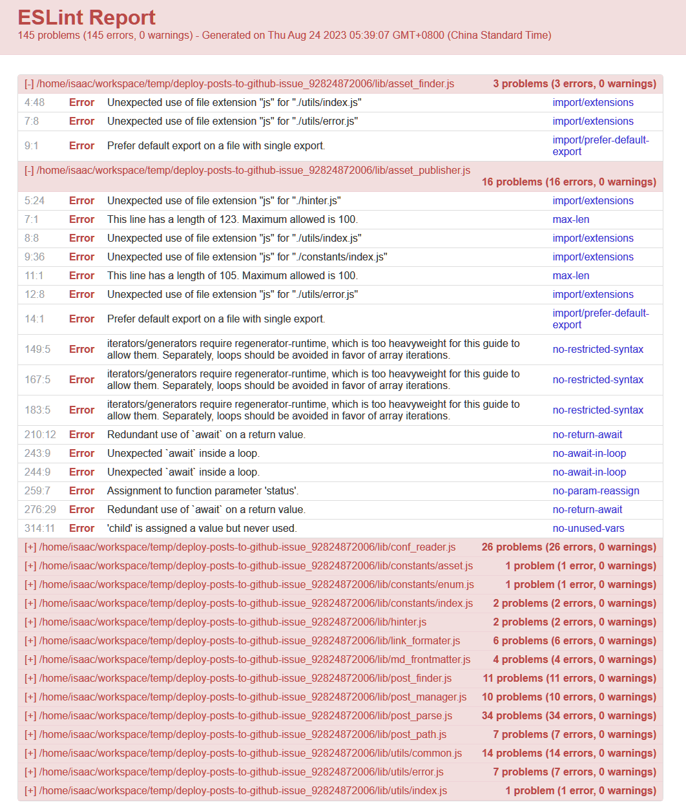

安装后新增的dev

```json
    "eslint-config-standard": "^17.1.0",
    "eslint-plugin-import": "^2.25.2",
    "eslint-plugin-n": "^15.0.0 || ^16.0.0 ",
    "eslint-plugin-promise": "^6.0.0",
```

```shell
Airbnb: https://github.com/airbnb/javascript
▸ Standard: https://github.com/standard/standard
  Google: https://github.com/google/eslint-config-google
  XO: https://github.com/xojs/eslint-config-xo
```

下面是一个表格，对比了 Airbnb、Standard、Google 和 XO 这四种 ESLint 代码规范的一些主要特点：

| 规范       | 风格和格式        | 缩进    | 引号  | 分号  | 严格相等和不严格相等 | 对象字面量属性排序 |
| -------- | ------------ | ----- | --- | --- | ---------- | --------- |
| [Airbnb](https://github.com/airbnb/javascript)   | 简洁、可读性、一致性   | 2 个空格 | 单引号 | 可选  | 推荐使用       | 推荐排序      |
| [Standard](Standard) | 简洁、可读性、一致性   | 2 个空格 | 单引号 | 禁止  | 推荐使用       | 推荐排序      |
| [Google](https://github.com/google/eslint-config-google)   | 可读性、一致性、可维护性 | 2 个空格 | 双引号 | 强制  | 推荐使用       | 推荐排序      |
| [XO](https://github.com/xojs/eslint-config-xo)       | 可定制的规范       | 2 个空格 | 单引号 | 禁止  | 推荐使用       | 推荐排序      |

请注意，以上表格只列出了一些主要的规范特点，并不能穷尽所有规范的细节。对于更详细的规范内容和具体规则，建议查阅各自的官方文档或 GitHub 仓库。选择适合自己或团队的代码规范时，可以深入研究每个规范的详细规则，并根据实际需求进行定制。

下面是使用表格形式输出以上信息：

| 代码规范   | 特点                                                         | 缩进    | 引号  | 分号  | 严格相等和不严格相等 | 对象字面量属性排序 |
| ---------- | ------------------------------------------------------------ | ----- | --- | --- | ---------- | --------- |
| [Airbnb](https://github.com/airbnb/javascript)      | - 强调代码的可读性和一致性<br>- 鼓励使用现代的JavaScript语言特性和最佳实践<br>- 包括对代码风格、命名约定、缩进、注释等的建议<br>- 要求使用ES6及以上版本的JavaScript并强制一些严格的规则 | 2 个空格 | 单引号 | 可选  | 推荐使用       | 推荐排序      |
| [Standard](https://github.com/standard/standard)   | - 简洁明了的JavaScript代码规范<br>- 减少代码样式的争议<br>- 鼓励一种统一的代码风格<br>- 使用两个空格的缩进、禁止使用分号等的具体规则<br>- 遵循ES5的语法 | 2 个空格 | 单引号 | 禁止  | 推荐使用       | 推荐排序      |
| [Google](https://github.com/google/eslint-config-google)     | - Google公司内部广泛使用的规范<br>- 强调可读性、可维护性和性能<br>- 提供了详细的代码编写指南<br>- 支持ES5和ES6语法<br>- 提供一些特定于Google编码风格的规则 | 2 个空格 | 双引号 | 强制  | 推荐使用       | 推荐排序      |
| [XO](https://github.com/xojs/eslint-config-xo)         | - 具有严格规则集的JavaScript代码规范和代码检查工具<br>- 基于ESLint构建<br>- 提供零配置的规范<br>- 强制执行高级规则，如使用ES6模块、禁止使用`console`等<br>- 提供可选的规则来适应不同的开发需求 | 2 个空格 | 单引号 | 禁止  | 推荐使用       | 推荐排序      |

请注意，上述表格中的特点仅是对每个代码规范的简要概述，每个代码规范可能还有更多的规则和细节。建议在实际使用时参考官方文档以获取更详细和准确的信息。


通过配置ESLint规则集，您可以启用与代码质量相关的规则，例如：

代码复杂性规则：ESLint提供了一些规则来评估代码的复杂性，如圈复杂度、函数长度等。这些规则可以帮助您识别复杂的代码结构，并提供建议来简化代码。

代码一致性规则：ESLint可以帮助您确保代码在整个项目中保持一致的风格和编码习惯。一致的代码风格有助于提高代码的可读性和可维护性，从而提升代码质量。

潜在错误规则：尽管ESLint主要用于静态代码分析，但它也可以检测一些常见的潜在错误，如未使用的变量、未定义的变量等。通过及时发现这些问题，可以提高代码的质量和稳定性。


生成质量报告

```shell
npx eslint ./lib --format=html --output-file=reports/eslint-report.html
```
要了解支持的文件扩展可查阅：https://eslint.org/docs/latest/use/formatters/




要了解如何将整合到开发各个方面可查阅：https://eslint.org/docs/latest/use/integrations


ESLint 常用的插件包括:

- [eslint-plugin-react](https://github.com/jsx-eslint/eslint-plugin-react) - 检查 React 代码,支持 JSX 语法等。

- [eslint-plugin-vue](https://github.com/vuejs/eslint-plugin-vue) - 检查 Vue 代码,支持 *.vue 文件。

- [eslint-plugin-angular](https://github.com/Gillespie59/eslint-plugin-angular) - 检查 Angular 代码,支持指令、模块等特性。

- [eslint-plugin-jquery](https://github.com/jquery/eslint-plugin-jquery) - 检查 jQuery 代码。

- [eslint-plugin-node](https://github.com/mysticatea/eslint-plugin-node) - 添加Node.js环境下的JavaScript代码检查。

- [eslint-plugin-import](https://github.com/benmosher/eslint-plugin-import) - 检查ES6+ 的 import/export 语法。

- [eslint-plugin-jsx-a11y](https://github.com/jsx-eslint/eslint-plugin-jsx-a11y) - 辅助检查JSX元素的可访问性。

- [eslint-plugin-promise](https://github.com/xjamundx/eslint-plugin-promise) - 添加Promise相关的规则。

- [eslint-plugin-standard](https://github.com/standard/eslint-plugin-standard) - 实现standard代码风格的规则。

- [eslint-plugin-html](https://github.com/BenoitZugmeyer/eslint-plugin-html) - 检查HTML文件中的JavaScript代码。

- [eslint-plugin-markdown](https://github.com/eslint/eslint-plugin-markdown) - 检查Markdown文件中的代码。

- [eslint-plugin-compat](https://github.com/amilajack/eslint-plugin-compat) - 检查浏览器兼容性问题。

- [eslint-plugin-jest](https://github.com/jest-community/eslint-plugin-jest) - 检查Jest测试框架的代码。

- [eslint-plugin-typescript](https://github.com/typescript-eslint/typescript-eslint) - 添加TypeScript语法支持。

- [eslint-plugin-security](https://github.com/eslint-community/eslint-plugin-security) - 用于检测 JavaScript 代码中的潜在安全漏洞。它提供了一系列规则，用于查找并警告可能导致安全问题的代码模式。

通过使用不同的插件可以大大扩展ESLint的功能范围,适应不同的项目需求。