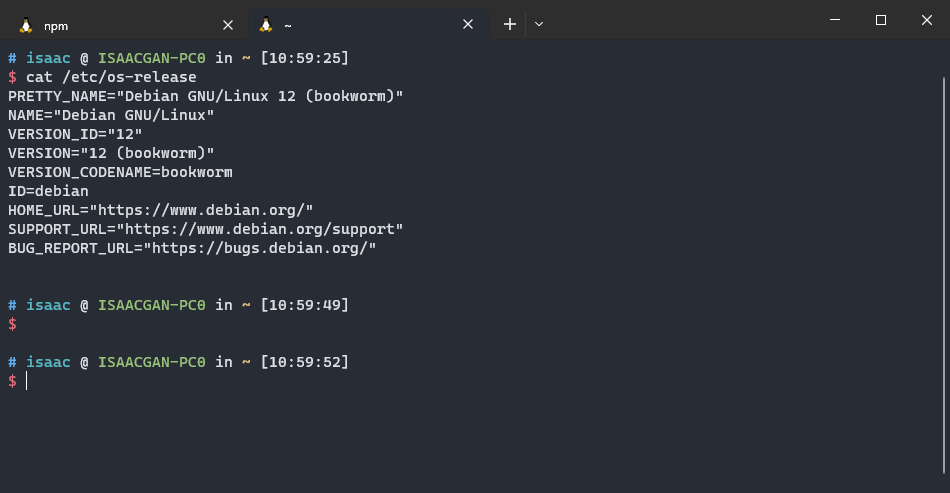
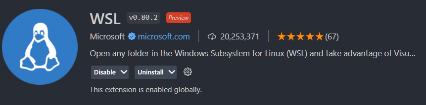
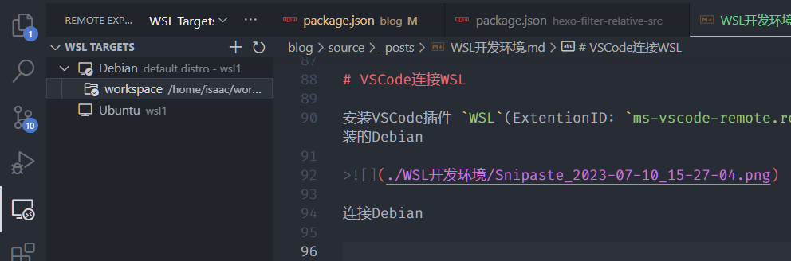
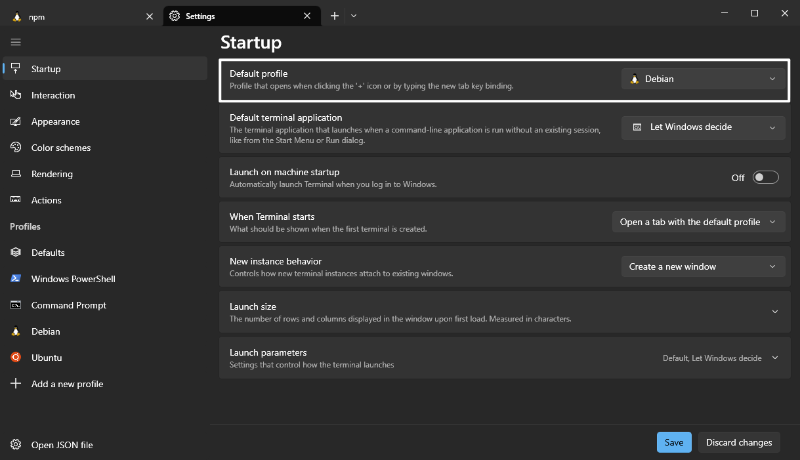
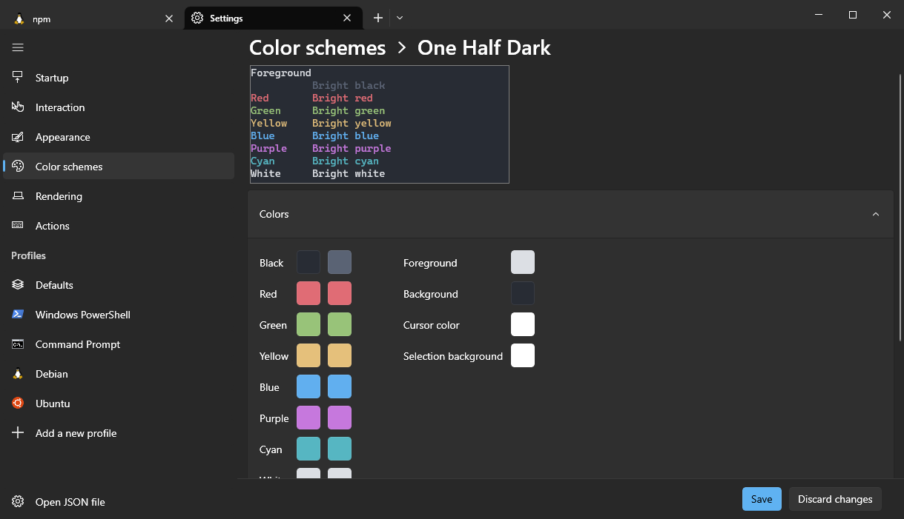
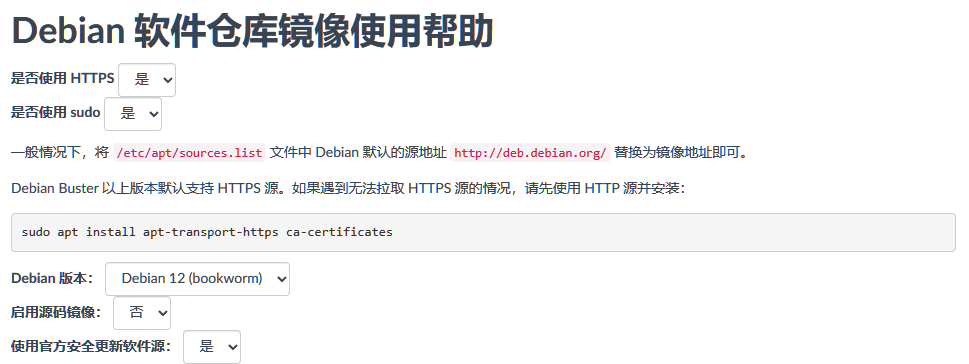
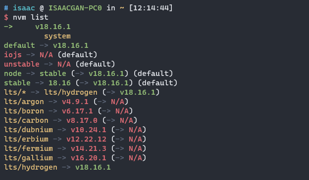

# 前言

本手册基于已经安装WSL2的前提编写，因此需要将windows系统升级到对应的版本，并已经安装WSL2。若未安装可参考 [初识WSL2](https://isaaxite.github.io/blog/resources/%E5%88%9D%E8%AF%86WSL2)。

环境初始化分为三块：编辑器、终端 和 Linux系统。编辑器将使用VSCode；终端使用windows Terminal；Linux使用Debian。

💬 **为什么是 VSCode？**

VSCode (Visual Studio Code) 是一款由微软推出的免费、开源的现代化代码编辑器，它具有许多优点，其中一个显著的优点是其对 WSL (Windows Subsystem for Linux) 的支持。

使用 VSCode 连接 WSL的好处包含不限于：

- **跨平台使用**，VSCode 支持 Windows、Linux 和 macOS 三种主流操作系统，与 WSL 的结合可以让开发人员在 Windows 操作系统中使用 Linux 环境下的开发工具，无需切换到 Linux 操作系统

- **编辑 Linux 文件系统**，通过在 VSCode 中使用 WSL，开发人员可以轻松地编辑 Linux 文件系统中的文件，无需在 Windows 和 Linux 操作系统之间切换

- **与 WSL 集成的终端**，VSCode 提供了一个终端，可以与 WSL 集成。这个终端可以让开发人员在一个窗口中同时运行 Windows 和 WSL 命令，并且可以轻松地切换到不同的 WSL 发行版

- **支持调试 WSL 中的应用程序**，通过在 VSCode 中配置 WSL，开发人员可以使用 VSCode 的调试器来调试运行在 WSL 中的应用程序，这使得调试变得更加便捷和高效。

- **对 Docker 的支持**，WSL 支持在 Linux 应用程序中运行 Docker。通过在 VSCode 中使用 WSL，开发人员可以轻松地开发和调试 Docker 容器。


💬 **为什么是 Windows Terminal？**

选择的基本原则首先是可以访问WSL无中文编码问题其次是不难看、不需要太多初始化。

windows下好用终端不多，可供选择的个人认为有下面几款：

| 终端模拟器 | 描述 | 主要特点 | Star 数量 |
| --- | --- | --- | --- |
| [Windows Terminal ↗](https://github.com/microsoft/terminal) | 微软官方开发，现代化终端模拟器 | 多标签页、多窗口、自定义主题 | 13.1k |
| [ConEmu ↗](https://github.com/ConEmu-Maximus5/ConEmu) | 免费、开源，多功能终端模拟器 | 多标签页、自定义主题、自动滚动 | 8.1k |
| [Hyper ↗](https://github.com/vercel/hyper) | 基于Electron，支持插件扩展 | 多标签页、自定义主题、快捷键 | 33.7k |
| [Terminus ↗](https://github.com/Eugeny/terminus) | 跨平台，支持插件扩展 | 多标签页、多窗口、自定义主题 | 7.4k |
| [MobaXterm ↗](https://mobaxterm.mobatek.net/) | 支持多种协议，具有多项功能 | SSH、Telnet、RDP、文件传输、X11转发、远程桌面 | N/A | 

相比之下，`Windows Terminal` 天然支持 WSL，不难看，而且无 `Cmder` 等的中文编码问题。

当然，有更好的选择也可以择优而用。

💬 **为什么是 Debian？**

WSL2可供选择linux发行不多，商用推荐使用CentOS但是，WSL2没有，退而求其次选Debian。

这个无太多且别，按个人喜好选择。

**📢 本手册说明流程如下：**

1. [首先会使用WSL2安装Debian](#安装-Debian)；

2. [VSCode安装插件，连接Debian](#VSCode连接WSL)；

3. [Windows Terminal添加Debian](#Windows-Terminal连接Debian)；

4. [使用Windows Terminal对Debian进行初始化](#替换-apt-软件源)。

📌 *流程种会着重描述对Debian的初始化，初始化的策略是先做必要的，再做可选的。*

**必要的初始化：**

- [替换 apt 软件源](#替换-apt-软件源)

- [设置Debian全局代理](#设置代理)

- [NodeJS环境初始化](#初始化-NodeJS-环境)

**可选的初始化：**

- [Linux基础软件安装](#基础软件)

- [修改Git默认编辑器](#修改Git默认编辑器)

- [SSH公约生成](#生成SSH公钥)

- [替换默认shell](#替换默认Shell)


# 安装 Debian

在 `PowerShell` 使用 `wsl --list -o` 可查看当前支持安装的 linux 发行版本，使用 `--install` 可安装你需要的 linux 发行版本，更多的 WSL 可选项可以通过 `--help` 查看 或 阅读 [Advanced settings configuration in WSL](https://learn.microsoft.com/en-us/windows/wsl/wsl-config)。

```shell
wsl --install --distribution Debian
```

接着是耐心的等待。

安装完成之后，需要初始化账号和密码，然后即可在 Windows Terminal添加Debian。



# VSCode连接WSL

安装VSCode插件 `WSL`(ExtentionID: `ms-vscode-remote.remote-wsl`)，它让我们可以便捷地远程访问WSL安装的Debian

>

连接Debian




# Windows Terminal连接Debian

📢 Windows Terminal可以直接在 `MicroSoft Store` 安装。

将 Debian 设为默认：



修改配置方案：




# 替换 apt 软件源

Debian 12 默认使用的软件管理工具是 [apt](https://manpages.ubuntu.com/manpages/xenial/man8/apt.8.html)。为了更快的软件安装速度，首先要做的是把 apt 的软件源从官方源替换为国内源

软件源保存在 [`/etc/apt/source.list`](https://manpages.ubuntu.com/manpages/focal/en/man5/sources.list.5.html)，通过编辑此文件内容修改源。

💡 *Debian 12 默认支持 `vi`，因此可使用 `vi` 编辑。可使用 `dpkg -l` 查看当前安装的系统软件*

## 国内源

国内有好几个软件源，包含但不限于：

- [清华源镜像]

- [腾讯软件源](https://mirrors.cloud.tencent.com/)

- [阿里源](https://developer.aliyun.com/mirror/)

- [华为源](https://mirrors.huaweicloud.com/home)

- [中科大源](http://mirrors.ustc.edu.cn/)

下面会使用 [清华源镜像], 它有个 [help页面](https://mirrors.tuna.tsinghua.edu.cn/help/debian/) 可方便快速生成 Debian 的 apt 源内容。

>

## 修改 source.list

备份旧源

```shell
sudo mv /etc/apt/source.list /etc/apt/source.list.backup
```

使用新源

```shell
sudo vi /etc/apt/source.list
```

替换内容为：

```shell
# 默认注释了源码镜像以提高 apt update 速度，如有需要可自行取消注释
deb https://mirrors.tuna.tsinghua.edu.cn/debian/ bookworm main contrib non-free non-free-firmware
# deb-src https://mirrors.tuna.tsinghua.edu.cn/debian/ bookworm main contrib non-free non-free-firmware

deb https://mirrors.tuna.tsinghua.edu.cn/debian/ bookworm-updates main contrib non-free non-free-firmware
# deb-src https://mirrors.tuna.tsinghua.edu.cn/debian/ bookworm-updates main contrib non-free non-free-firmware

deb https://mirrors.tuna.tsinghua.edu.cn/debian/ bookworm-backports main contrib non-free non-free-firmware
# deb-src https://mirrors.tuna.tsinghua.edu.cn/debian/ bookworm-backports main contrib non-free non-free-firmware

# deb https://mirrors.tuna.tsinghua.edu.cn/debian-security bookworm-security main contrib non-free non-free-firmware
# # deb-src https://mirrors.tuna.tsinghua.edu.cn/debian-security bookworm-security main contrib non-free non-free-firmware

deb https://security.debian.org/debian-security bookworm-security main contrib non-free non-free-firmware
# deb-src https://security.debian.org/debian-security bookworm-security main contrib non-free non-free-firmware
```

## 更新源

```shell
sudo apt update
```
接着是耐心的等待。

**📢 Debian Buster 以上版本默认支持 HTTPS 源。如果遇到无法拉取 HTTPS 源的情况，请先使用 HTTP 源并安装：**

```shell
sudo apt install apt-transport-https ca-certificates
```

# 设置代理

📢 *此为可选操作，若无科学上网方法可跳过*

由于某些原因访问github资源速度会较慢，假如有梯子的话，可设置代理让访问速度更顺畅！

设置代理的方式是通过添加 `http_proxy` 和 `https_proxy` 两个环境变量。添加方式有几个，下面仅通过`profile` 方式添加。

```shell
# 编辑profile
vi ~/.profile

# 文件底部追加
export http_proxy=<http_proxy>
export https_proxy=https_proxy

# e.g.
export http_proxy=http://127.0.0.1:7890
export https_proxy=http://127.0.0.1:7890

# 保存后，重载配置
source ~/.profile
```

# 初始化 NodeJS 环境

接下来不会直接使用apt安装nodejs，而是使用 nodejs 的版本管理工具，以便后续按需在不同的node版本间切换。

常用的NodeJS版本管理工具有：

| 工具名称 | 描述 | 主要特点 | Star 数量 |
| --- | --- | --- | --- |
| [nvm (Node Version Manager) ↗](https://github.com/nvm-sh/nvm) | 最受欢迎的版本管理工具之一，可安装和管理多个Node.js版本 | 可以轻松切换不同版本的Node.js，兼容macOS、Linux和Windows | *68.4k* |
| [n (Node.js Version Management) ↗](https://github.com/tj/n) | 另一种流行的版本管理工具，可以快速安装和切换Node.js版本 | 命令简单易用，支持在终端中直接安装和升级Node.js | *17.8k* |
| [nvs (Node Version Switcher) ↗](https://github.com/jasongin/nvs) | 具有自动切换Node.js版本的版本管理工具 | 支持Windows、macOS和Linux，可以自动在不同的项目中使用不同版本的Node.js | *2.4k* |
| [fnm (Fast Node Manager) ↗](https://github.com/Schniz/fnm) | 快速、简单的Node.js版本管理工具 | 支持在不同的项目中使用不同版本的Node.js，可与 Fish Shell 和 PowerShell 集成 | *12.4k* |

## 安装 [nvm]

```shell
curl -o- https://raw.githubusercontent.com/nvm-sh/nvm/v0.39.3/install.sh | bash
```

## nvm 常用命令

```shell
# 查看本地node版本
nvm ls

# 查看可安装node版本
nvm ls-remote

# 安装
nvm install <node version>

# 删除
nvm uninstall <node version>

# 切换
nvm use <node version>

# 设置默认 nodejs 版本
nvm alias default <node version>
```



# 基础软件

- **git**：分布式版本控制系统，用于管理和跟踪计算机文件的更改

- **curl**：用于在命令行中进行数据传输的工具，它可以通过各种协议（包括HTTP、HTTPS、FTP、SMTP等）获取或发送数据

- **wget**：用于从命令行中下载文件的工具。它可以通过HTTP、HTTPS、FTP等协议下载文件，并支持断点续传和递归下载

- **vim**：文本编辑器，它是Unix和Linux系统中最常用的编辑器之一。它是vi编辑器的改进版本，因此它的名字也有时解释为"Vi IMproved"

- **lsof**：用于列出打开文件的工具，它可以显示当前系统中所有正在使用的文件和进程

```shell
sudo apt install git curl wget vim lsof -y
```

# 修改Git默认编辑器

Git默认编辑器是 `nano`，使用体验对于来说一言难尽，习惯使用 `vim`。

```shell
git config --global core.editor vim

# 查看配置
git config --list
```

# 生成SSH公钥

生成SSH公钥以便从Github等代码托管平台clone代码。

**生成：**

```shell
ssh-keygen -t rsa -C "your_email@example.com"

# e.g.

ssh-keygen -t rsa -C "pc-wsl-debian"
```

**获取：**

生成时会输出SSH key的输出文件，公钥默认在 `~/.ssh/id_rsa.pub`

```shell
cat ~/.ssh/id_rsa.pub
```

# 替换默认Shell

📢 Debian 默认 shell 是 bash。相比于bash，zsh有更好的自动补全、更强大的模式匹配、更好的可定制性、更好的历史记录和更好的作业控制。

下面将安装 zsh、设为默认的 shell和添加主题。

⚠️ *改用 zsh 后，需要将 [设置代理](#设置代理) 中的的环境变量迁移到 `~/.zshrc` 中*

**使用apt安装**

```shell
sudo apt install zsh -y
```

**设为默认shell**

```shell
# 列出当前支持的shell
cat /etc/shells

# 设为默认shell
chsh -s /bin/zsh

# 查看当前使用的shell
echo $SHELL
```

**添加主题（oh-my-zsh）**

安装： 

```shell
sh -c "$(curl -fsSL https://raw.githubusercontent.com/ohmyzsh/ohmyzsh/master/tools/install.sh)"
```

修改 theme：

```shell
# 编辑配置文件
vim ~/.zshrc

# 修改 ZSH_THEME 属性
# Set name of the theme to load --- if set to "random", it will
# load a random theme each time oh-my-zsh is loaded, in which case,
# to know which specific one was loaded, run: echo $RANDOM_THEME
# See https://github.com/ohmyzsh/ohmyzsh/wiki/Themes
ZSH_THEME="ys"

# 查看支持的主题
ls ~/.oh-my-zsh/themes
```

主题预览参考：https://github.com/ohmyzsh/ohmyzsh/wiki/Themes

重载配置

```shell
source ~/.zshrc
```

# 附录

## 参考

- [清华大学开源软件镜像站](https://mirrors.tuna.tsinghua.edu.cn/)
- [Oh My Zsh - a delightful & open source framework for Zsh](https://ohmyz.sh/)
- [How To Set System Proxy on Debian 11/10/9](https://computingforgeeks.com/how-to-set-system-proxy-on-debian-linux/)
- [Git on the Server - Generating Your SSH Public Key](https://git-scm.com/book/en/v2/Git-on-the-Server-Generating-Your-SSH-Public-Key)
- [nvm (Node Version Manager) ](https://github.com/nvm-sh/nvm)
- [apt - command-line interface](https://manpages.ubuntu.com/manpages/xenial/man8/apt.8.html)
- [Startup settings in Windows Terminal](https://learn.microsoft.com/en-us/windows/terminal/customize-settings/startup)


[清华源镜像]:https://mirrors.tuna.tsinghua.edu.cn
[nvm]:https://github.com/nvm-sh/nvm