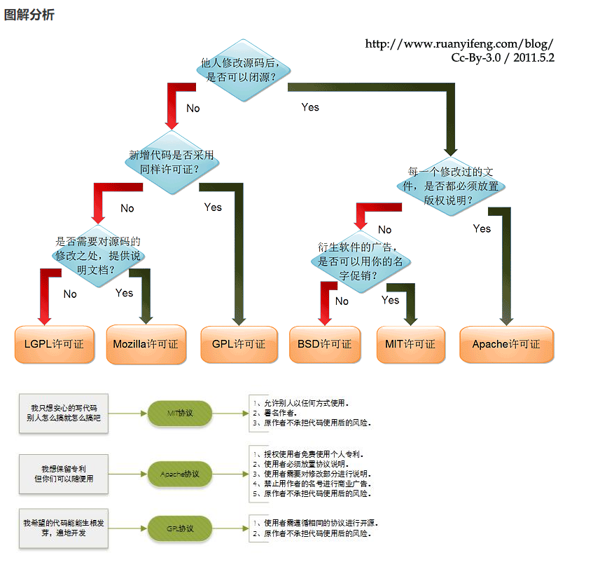
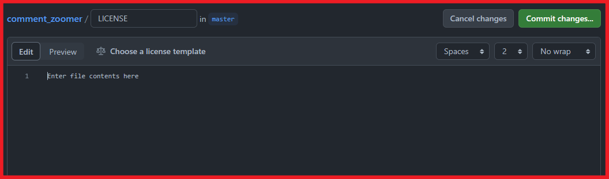
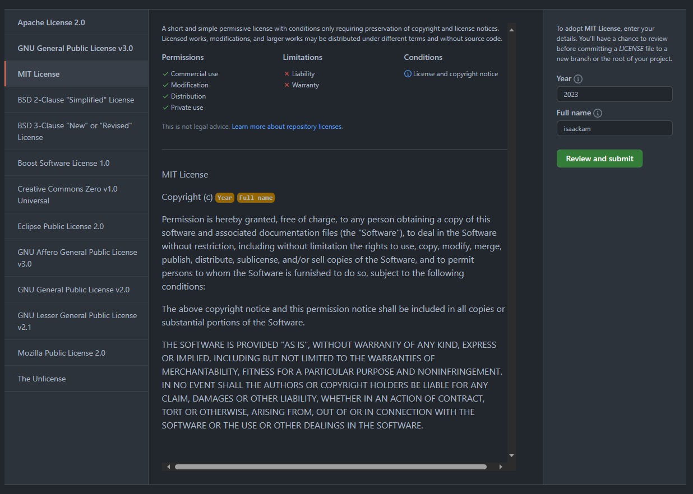

# 前言

本文旨在介绍何为license，如何选择license，以及开发常用的MIT license如何使用。

<!-- more -->

# LICENSE

LICENCE 是软件的授权许可，详细说明了获得代码后拥有的权利，哪些操作是允许的，哪些操作是禁止的。软件的版权许可证可有很多方式，本文仅限于讨论开源软件协议 Open Source License。

Open Source License 是指符合开源定义的许可证——简而言之，它们允许软件自由使用、修改和共享。要获得开源计划（也称为OSI）的批准，许可证必须经过开源计划的许可证审查过程。

对于大多数人来说，没必要花大把时间去写许可协议，选择一种比较流行的开源协议就足够了，省时省力，更便于自己作品的传播，于人于己都有利。


# 常见的LICENSE

世界上的开源许可证（Open Source License）大概有上百种，今天我们来介绍下几种我们常见的开源协议。大致有GPL、BSD、MIT、Mozilla、Apache和LGPL等。


# 选择LICENSE

下面是来自 Paul Bagwell 整理的许可证选择流程：


下面是 阮一峰整理的选择流程，图已经略过时，但仍然有一定的参考价值，英文好的同学建议看 Paul Bagwell 整理的选择。

||
|:--:|

# MIT LICENSE

MIT许可协议之名源自麻省理工学院（Massachusetts Institute of Technology, MIT），又称“X许可协议”（X License）或“X11许可协议”（X11 License）

MIT内容与三条款BSD许可协议（3-clause BSD license）内容颇为近似，但是赋予软件被许可人更大的权利与更少的限制。

有许多团体均采用MIT许可证。例如著名的SSH连线软件PuTTY与X窗口系统。Expat、Mono开发平台库、Ruby on Rails、Lua、微软的Visual Studio Code源代码等等也都采用MIT许可协议。


以下是 [MIT LICENSE的原本](https://www.mit-license.org/) 的内容：

> Copyright \<YEAR\> \<COPYRIGHT HOLDER\>
>
>Permission is hereby granted, free of charge, to any person obtaining a copy of this software and associated documentation files (the “Software”), to deal in the Software without restriction, including without limitation the rights to use, copy, modify, merge, publish, distribute, sublicense, and/or sell copies of the Software, and to permit persons to whom the Software is furnished to do so, subject to the following conditions:
>
>The above copyright notice and this permission notice shall be included in all copies or substantial portions of the Software.
>
>THE SOFTWARE IS PROVIDED “AS IS”, WITHOUT WARRANTY OF ANY KIND, EXPRESS OR IMPLIED, INCLUDING BUT NOT LIMITED TO THE WARRANTIES OF MERCHANTABILITY, FITNESS FOR A PARTICULAR PURPOSE AND NONINFRINGEMENT. IN NO EVENT SHALL THE AUTHORS OR COPYRIGHT HOLDERS BE LIABLE FOR ANY CLAIM, DAMAGES OR OTHER LIABILITY, WHETHER IN AN ACTION OF CONTRACT, TORT OR OTHERWISE, ARISING FROM, OUT OF OR IN CONNECTION WITH THE SOFTWARE OR THE USE OR OTHER DEALINGS IN THE SOFTWARE.


对于个人开发者来说，可能没有太关注许可，最初注重的只是代码的合法与传播。所以如果不想管或不知道该选那个许可，可直接使用MIT许可。

以上引用的即是 MIT 的模板。需要修改的只有两个位置：

1. **YEAR**：是版权使用的年份。如果你在2015年申请版权（当你写作品时会自动发生），请在2015年提交。有些人喜欢设定一系列年份（即2015-2020年）——这没有必要。
2. **COPYRIGHT HOLDER**：是拥有版权的实体的全名。如果拥有实体是私人则写上自己的名字即可。

## 生成 MIT

比较流程化的操作是手动在项目目录下新建 LICENSE 文件，复制 MIT LICENSE 模板，修改 YEAR 和 COPYRIGHT HOLDER 即可。

另外，还可以在 Github 上直接创建 LICENSE 文件并选择MIT协议；

或者使用npm cli生成。

### Github

Github是支持半自动化的方式创建LICENSE的。

#### 创建LICESE文件

创建LICESE文件，会自动出现选择LICENSE协议的按钮（“Choose a license template”）



#### 选择MIT协议




### Npm Lib

[Ovyerus](https://github.com/Ovyerus) 提供了一个很方便生成LICESE的Npm Lib：[license](https://www.npmjs.com/package/license)。

#### 安装

```shell
npm i -g license
```

### 使用

```shell
license [license]

# 指定 YEAR 和 COPYRIGHT HOLDER

license [license] -n <COPYRIGHT HOLDER> -y <YEAR>
```

# 附录

## 参考

- [LICENSE WIKI](https://zh.wikipedia.org/zh-cn/%E6%8E%88%E6%AC%8A_(%E6%B3%95%E5%BE%8B))
- [Open Source License](https://opensource.org/licenses/)
- [开源授权 WIKI](https://zh.wikipedia.org/wiki/%E9%96%8B%E6%BA%90%E6%8E%88%E6%AC%8A)
- [description-of-popular-software-licenses](https://web.archive.org/web/20110503183702/http://pbagwl.com/post/5078147450/description-of-popular-software-licenses)
- [What should be written in MIT license (year, full name)?](https://opensource.stackexchange.com/questions/1522/what-should-be-written-in-mit-license-year-full-name)