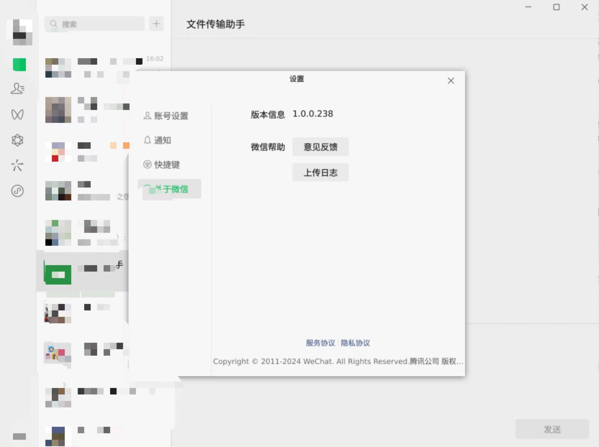

# 前言

我当前使用的大部分软件都有被 Deb（Chromium、VS Code 等） Appimage （Motrix、Qv2ray等）覆盖到，其他一部分使用 WebApp （Neat Reader、Google Translate等）代替，实在无解则使用 win7 虚拟机（微信、迅雷等）。

最近听闻微信发布了 linux 版本，但实际并无较为正式的公告。仅在一些视频网站偶尔刷到 linux 版本微信的演示，才让人对此有了一定的可信度。

<!-- more -->

在[微信更新日志]中并未提到 linux 版本的发布动作，主页亦无相关下载入口。较为正式的消息来自：

> IT之家 3 月 13 日消息，统信软件和麒麟软件宣布，微信（Universal）UOS 版功能全面革新，体验全新升级，新版本现已上架统信应用商店和麒麟软件商店，UOS 用户可直接在统信应用商店搜索“微信（Universal）”下载体验，银河麒麟用户可在银河麒麟桌面操作系统 V10 安装使用。
>
>据IT之家此前报道，微信将迎来 Linux 原生版重构，支持 X86、ARM、龙芯 LoongArch64 架构，系统方面支持麒麟和统信 UOS。
>
> ——[IT之家 | 微信（Universal）UOS / 银河麒麟版全新升级：Linux 原生跨平台方案，现已开放下载]


从[星火软件商店](https://www.spark-app.store/store/sort/chat) 和 [Archlinux wiki](https://aur.archlinux.org/packages/wechat-universal-bwrap) 我分别下载了三个版本：微信（Universal）、Freechat 版本微信和 wechat-universal-bwrap 1.0.0.238-13。各有各的问题导致无法使用，不展开。这也是可以预见的，从消息来源中可知，此 linux 版本的微信是面向 UOS 和银河麒麟，目标非我当前所使用的发行版本。当然我估计是可以通过花费时间解决这些使用问题，但私以为性价比过低，因此搁置，抛之脑后。

后面了解到 [web1n](https://github.com/web1n) 打包了 [fatpak 版本的 wechat-universal-flatpak](https://github.com/web1n/wechat-universal-flatpak)，基于 flatpak 的沙盒特性，我认为可以顺利使用的可能性很大。安装后体验确实如此！基本使用无问题：



# plan

wechat 发布了 linux 版本

linux wechat 在那里发布了？

linux wechat不适合我的系统

我的系统是什么？A：在背景中说明

有人在github发布了flatpak版本

下载地址，如何安装，安装flatpak软件的背景？

wechat flatpak 出现样式问题，需要描述


wechat 的 flatpak 信息

```shell
$ flatpak info -M com.tencent.WeChat master 
[Context]
shared=network;ipc;
sockets=x11;pulseaudio;
devices=all;
features=devel;
filesystems=xdg-download;xdg-pictures;xdg-music;xdg-config/gtk-3.0:ro;/home/isaac/.icons:ro;xdg-config/fontconfig:ro;/usr/share/icons:ro;
persistent=.xwechat;xwechat_files;
unset-environment=QT_QPA_PLATFORM;

[Session Bus Policy]
org.kde.StatusNotifierWatcher=talk
org.freedesktop.Notifications=talk
org.kde.*=own

[Environment]
XCURSOR_THEME=Bibata-Modern-Classic
QT_QPA_PLATFORM=
XCURSOR_PATH=~/.icons
QT_AUTO_SCREEN_SCALE_FACTOR=1
XCURSOR_SIZE=48

```

> IT之家 3 月 13 日消息，统信软件和麒麟软件宣布，微信（Universal）UOS 版功能全面革新，体验全新升级，新版本现已上架统信应用商店和麒麟软件商店，UOS 用户可直接在统信应用商店搜索“微信（Universal）”下载体验，银河麒麟用户可在银河麒麟桌面操作系统 V10 安装使用。
>
>据IT之家此前报道，微信将迎来 Linux 原生版重构，支持 X86、ARM、龙芯 LoongArch64 架构，系统方面支持麒麟和统信 UOS。
>
> ——[IT之家 | 微信（Universal）UOS / 银河麒麟版全新升级：Linux 原生跨平台方案，现已开放下载]

# 附录

## 参考

- [Github issue | flatpak/flatpak | Different cursor theme in flatpak apps #709](https://github.com/flatpak/flatpak/issues/709)

- [Github issue | flatpak/flatpak | Different cursor theme in flatpak apps #709 | the solution too on Linux Mint](https://github.com/flatpak/flatpak/issues/709#issuecomment-1381482007)

- [Flatpak | Applications do not use the correct cursor theme](https://wiki.archlinux.org/title/Flatpak#Applications_do_not_use_the_correct_cursor_theme)

- [Reddit | Flatpak App Changing Cursor Theme And Size (Is This Normal Behavior?)](https://www.reddit.com/r/flatpak/comments/rxnyh7/flatpak_app_changing_cursor_theme_and_size_is/)

### 未使用

- [Archlinux | xdg-desktop-portal-gtk 1.15.1-1](https://archlinux.org/packages/extra/x86_64/xdg-desktop-portal-gtk/)

- [Github repository | flatpak/xdg-desktop-portal-gtk](https://github.com/flatpak/xdg-desktop-portal-gtk)

- [Archlinux | XDG Desktop Portal](https://wiki.archlinux.org/title/XDG_Desktop_Portal)

- [Archlinux | Flatpak | Flatpak applications not picking up the default system theme](https://wiki.archlinux.org/title/Flatpak#Flatpak_applications_not_picking_up_the_default_system_theme)

- [Github issue | flatpak/flatpak | Apps are not aware of desktop themes #114](https://github.com/flatpak/flatpak/issues/114)

- [Archlinux | stylepak-git 16.124fbdc-1](https://aur.archlinux.org/packages/stylepak-git)

- [Reddit | Is there any way to manually install/copy themes into flatpak, that aren't available via flathub?](https://www.reddit.com/r/flatpak/comments/uv7nqb/is_there_any_way_to_manually_installcopy_themes/)

- [Github repository | refi64/stylepak](https://github.com/refi64/stylepak)

- [微信更新日志]

- [IT之家 | 微信（Universal）UOS / 银河麒麟版全新升级：Linux 原生跨平台方案，现已开放下载]


[IT之家 | 微信（Universal）UOS / 银河麒麟版全新升级：Linux 原生跨平台方案，现已开放下载]:https://www.ithome.com/0/755/450.htm

[微信更新日志]:https://weixin.qq.com/cgi-bin/readtemplate?lang=zh_CN&t=weixin_faq_list&head=true