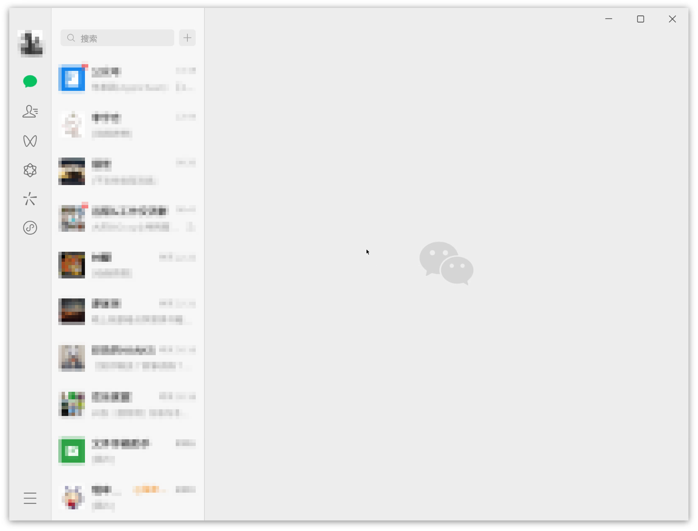

# 前言

我当前使用的大部分软件都有被 Deb（Chromium、VS Code 等） Appimage （Motrix、Qv2ray等）覆盖到，其他一部分使用 WebApp （Neat Reader、Google Translate等）代替，实在无解则使用 win7 虚拟机（微信、迅雷等）。

最近听闻微信发布了 linux 版本，但实际并无较为正式的公告。仅在一些视频网站偶尔刷到 linux 版本微信的演示，才让人对此有了一定的可信度。

<!-- more -->

在[微信更新日志]中并未提到 linux 版本的发布动作，主页亦无相关下载入口。较为正式的消息来自：

> IT之家 3 月 13 日消息，统信软件和麒麟软件宣布，微信（Universal）UOS 版功能全面革新，体验全新升级，新版本现已上架统信应用商店和麒麟软件商店，UOS 用户可直接在统信应用商店搜索“微信（Universal）”下载体验，银河麒麟用户可在银河麒麟桌面操作系统 V10 安装使用。
>
>据IT之家此前报道，微信将迎来 Linux 原生版重构，支持 X86、ARM、龙芯 LoongArch64 架构，系统方面支持麒麟和统信 UOS。
>
> ——[IT之家 | 微信（Universal）UOS / 银河麒麟版全新升级：Linux 原生跨平台方案，现已开放下载]

其他的消息来源有：

- [Archlinux Wiki | 微信 | 微信 Linux 原生版重构](https://wiki.archlinuxcn.org/wiki/%E5%BE%AE%E4%BF%A1#%E5%BE%AE%E4%BF%A1_Linux_%E5%8E%9F%E7%94%9F%E7%89%88%E9%87%8D%E6%9E%84)；

- [吾爱破解 | [其他] 【国产系统】史诗级更新Linux 微信wechat-beta_1.0.0.150（快来还热乎）](https://www.52pojie.cn/thread-1896902-1-1.html)。


从[星火软件商店](https://www.spark-app.store/store/sort/chat) 和 [Archlinux wiki](https://aur.archlinux.org/packages/wechat-universal-bwrap) 我分别下载了三个版本：微信（Universal）、Freechat 版本微信和 wechat-universal-bwrap 1.0.0.238-13。各有各的问题导致无法使用，不展开。这也是可以预见的，从消息来源中可知，此 linux 版本的微信是面向 UOS 和银河麒麟，目标非我当前所使用的发行版本。当然我估计是可以通过花费时间解决这些使用问题，但私以为性价比过低，因此搁置，抛之脑后。

缘法妙不可言（估计是推荐机制），后面了解到 [web1n](https://github.com/web1n) 打包了 [fatpak 版本的 wechat-universal-flatpak](https://github.com/web1n/wechat-universal-flatpak)，基于 flatpak 的沙盒特性，我认为可以顺利使用的可能性很大。安装后体验确实如此！基本使用无问题：



直接可见的 bug 是 cursor 的样式异常：

- cursor 的类型（Adwaita）与全局（Bibata-Modern-Classic）的不一致；

- 尺寸过小，若正常使用的尺寸定位为 10，那么目前的估计是 1；

其他功能性的 bug 按下不讨论。对于这个样式性的 bug，回顾过往使用与安装的 Flatpak 软件，似乎大多是有类似的问题。这是 Flatpak 自身的问题？

以此引出本文讨论与探索的主题：*从解决实际问题——wechat-universal-flatpak 的 cursor 样式异常——探索 Flatpak*。


# 背景

## 设备

>System:
>  Kernel: 5.15.0-76-generic x86_64 bits: 64 compiler: gcc v: 11.3.0 Desktop: Cinnamon 5.8.4
>    tk: GTK 3.24.33 wm: muffin dm: LightDM Distro: Linux Mint 21.2 Victoria base: Ubuntu 22.04 jammy
>
>Machine:
>  Type: Laptop System: LENOVO product: 82NJ v: Yoga 14sACH 2021 D serial: \<superuser required\>
>    Chassis: type: 10 v: Yoga 14sACH 2021 D serial: \<superuser required\>
>  Mobo: LENOVO model: LNVNB161216 v: SDK0T76479 WIN serial: \<superuser required\> UEFI: LENOVO
>    v: HECN23WW date: 10/15/2021
>
>CPU:
>  Info: 8-core model: AMD Ryzen 7 5800HS Creator Edition bits: 64 type: MT MCP arch: Zen 3 rev: 0
>    cache: L1: 512 KiB L2: 4 MiB L3: 16 MiB
>  Speed (MHz): avg: 2705 high: 3887 min/max: 1200/3200 boost: enabled cores: 1: 2938 2: 578
>    3: 2473 4: 2268 5: 2233 6: 3057 7: 2560 8: 2473 9: 2524 10: 2734 11: 3887 12: 3467 13: 2903
>    14: 2943 15: 2931 16: 3311 bogomips: 102206
>  Flags: avx avx2 ht lm nx pae sse sse2 sse3 sse4_1 sse4_2 sse4a ssse3 svm

## Flatpak 版本

```shell
# isaac @ Mint-Yoga in ~ [11:26:56] 
$ flatpak --version                        
Flatpak 1.12.7
```

## Flatpak Application

保持安装 `wechat-universal-flatpak` 后状态，不新增 Flatpak 软件。

```shell
# isaac @ Mint-Yoga in ~ [13:07:51] 
$ flatpak list
Name                         Application ID                 Version   Branch      Origin        Installation
WeChat                       com.tencent.WeChat             1.0.0.238 master      wechat-origin system
Freedesktop Platform         org.freedesktop.Platform       23.08.14  23.08       flathub       system
Mesa                         …eedesktop.Platform.GL.default 23.3.5    22.08       flathub       system
Mesa (Extra)                 …eedesktop.Platform.GL.default 23.3.5    22.08-extra flathub       system
Mesa                         …eedesktop.Platform.GL.default 24.0.3    23.08       flathub       system
Mesa (Extra)                 …eedesktop.Platform.GL.default 24.0.3    23.08-extra flathub       system
openh264                     …freedesktop.Platform.openh264 2.1.0     2.2.0       flathub       system
GNOME Application Platform … org.gnome.Platform                       44          flathub       system
GMetronome                   ….gnome.gitlab.dqpb.GMetronome 0.3.2     stable      flathub       system
Mint-Y-Aqua Gtk Theme        org.gtk.Gtk3theme.Mint-Y-Aqua            3.22        flathub       system
```

# 实践

wechat-universal-flatpak 的 cursor 样式异常，这个问题据目前可知的信息，可以推断是与 Flatpak 相关性更大而非微信本身。因此，根据 Flatpak 与 cursor 样式做一定的资料搜集，以及解决方案的搜索。下面是经过滤后较有可行性的方案：

## 实践一

从 [Reddit | Flatpak App Changing Cursor Theme And Size (Is This Normal Behavior?)] 的一个评论中得到一个解决方案，在此评论的回复中不少人表示有效：

>[@Relevant_Ferret8075](https://www.reddit.com/user/Relevant_Ferret8075/)
>Try these commands:
>
>```
> flatpak --user override --filesystem=/home/$USER/.icons/:ro
> flatpak --user override --filesystem=/usr/share/icons/:ro
>```

根据评论中给出的 2 条命令在终端执行，结果是顺利执行无报错，但遗憾的是并未解决。

PS：*为一定程度的严谨性，在执行命令后会重启微信，后面的每次实践可能的解决方案亦会重复此步骤。*


## 实践二

从 [Github issue | flatpak/flatpak | Different cursor theme in flatpak apps #709 | the solution too on Linux Mint] 得到相对更全面的方案。且评论中的用户使用的发行版与当前实验的接近（见背景说明）。

> [@garfieldairlines](https://github.com/garfieldairlines) commented on Jan 13, 2023
> That was the solution too on Linux Mint, thank you I was getting crazy !
> 
> > As of Jan 12th, 2023, I ran the following commands (in this order) on Fedora 37 (Gnome 43) and all my Flatpak apps now see the correct cursor icons:
> > ```
> > cp /usr/share/icons ~/.icons -r
> > flatpak --user override --filesystem=/home/$USER/.icons/:ro 
> > flatpak --user override --filesystem=/usr/share/icons/:ro
> > flatpak override --user --env=XCURSOR_PATH=~/.icons
> > flatpak override --user --filesystem=xdg-config/gtk-3.0:ro
> > ```

这个方案中增加了对 `xdg-config/gtk-3.0` 目录访问权限的用户级别的覆盖，和设置 `XCURSOR_PATH` 环境变量。

实践新增内容部分，结果是顺利执行无报错，但遗憾的是并未解决。

## 实践三

[Archlinux Wiki | Flatpak](https://wiki.archlinux.org/title/Flatpak#) 有着关于 Flatpak 较为全面的信息，其中 [Archlinux | Flatpak | Troubleshooting  | Applications do not use the correct cursor theme] 更是直指 Flatpak 的 cursor 问题，一定程度上也印证了前面关于 cursor 异常的推测。

> **5.6 Applications do not use the correct cursor theme**
> Applications do not use the correct cursor theme
> There is no single standard to set the cursor properly. Some programs only need read access to the cursors directory, others also rely on other mechanisms. For [GTK](https://wiki.archlinux.org/title/GTK) applications, ensure that [xdg-desktop-portal-gtk](https://archlinux.org/packages/?name=xdg-desktop-portal-gtk) is installed.
>
> Otherwise, the following overrides should work for most common desktop applications.
> ```
> $ flatpak -u override --filesystem=/usr/share/icons/:ro
> $ flatpak -u override --filesystem=/home/$USER/.icons/:ro 
> $ flatpak -u override --filesystem=xdg-config/gtk-3.0:ro
> $ flatpak -u override --env=XCURSOR_PATH=~/.icons
> ```
> In some cases you may also need to override the environment variables `XCURSOR_THEME` and `XCURSOR_SIZE`:
> ```
> $ flatpak -u override --env=XCURSOR_THEME=Adwaita
> $ flatpak -u override --env=XCURSOR_SIZE=24
> ```
> See [this discussion](https://github.com/flatpak/flatpak/issues/709) for additional details.


相比实践一、二，增加的是 `XCURSOR_THEME` 和 `XCURSOR_SIZE` 环境变量的设置。

实践新增内容部分，结果是顺利执行无报错，但遗憾的是并未解决。


## 实践四

以上三个方案是过滤后，目前解决问题可能性最大的，至少当前未发现更加有用的信息。根据以上的资料，做出合理的推论，应大概率可以解决（毕竟已经常见到被明确收录进 Wiki 的问题），但经实践后依然未达预期。此刻当做二次梳理以排除误操作。

实践三中 `XCURSOR_THEME` 和 `XCURSOR_SIZE` 根据语义推测应分别是指定 cursor 的类型和尺寸。尝试调整尺寸以判断是否因设置的尺寸太小迷惑导致无效的假象。

```shell
flatpak --user override --env=XCURSOR_SIZE=48
```

调整为原来的一倍。结果是顺利执行无报错，但无变化。

再检查前面设置的目录：

`/usr/share/icons/`：

```shell
$ cd /usr/share/icons/
$ tree -L 1  
.
├── Adwaita
├── Bibata-Modern-Classic
├── ...
└── Yaru-viridian-dark

88 directories, 2 files
```

`/home/$USER/.icons/`：

```shell
$ cd ~/.icons 
$ tree -L 1
.
└── icons

1 directory, 0 files
```

此目录下仅 `icons` 一个。回顾**实践二**中执行的其中一条命令：

```shell
cp /usr/share/icons ~/.icons -r
```

`icons` 目录是由 `/usr/share/icons` 拷贝而来，说明 `～/.icons/` 原本是空的。 

**实践二**中执行的其中另外一条命令：

```shell
flatpak override --user --env=XCURSOR_PATH=~/.icons
```

打印 `wechat-universal-flatpak` 的状态信息：

```shell
$ flatpak info -M com.tencent.WeChat master    
[Context]
shared=network;ipc;
sockets=x11;pulseaudio;
devices=all;
features=devel;
filesystems=xdg-download;xdg-pictures;xdg-music;xdg-config/gtk-3.0:ro;\
  /home/isaac/.icons:ro;xdg-config/fontconfig:ro;/usr/share/icons:ro;
persistent=.xwechat;xwechat_files;
unset-environment=QT_QPA_PLATFORM;

[Session Bus Policy]
org.kde.StatusNotifierWatcher=talk
org.freedesktop.Notifications=talk
org.kde.*=own

[Environment]
XCURSOR_THEME=Adwaita
QT_QPA_PLATFORM=
XCURSOR_PATH=~/.icons
QT_AUTO_SCREEN_SCALE_FACTOR=1
XCURSOR_SIZE=48
```

确实已经成功设置 `XCURSOR_PATH`，根据语义推断是 cursor 的主题类型目录。结合以上信息，`XCURSOR_PATH` 应设置为 `XCURSOR_PATH=~/.icons/icons/` 或 将 `~/.icons/icons/` 目录的内容转移到 `~/.icons/` 目录下。

此处为保持统一，选择后者。实践变动的部分，结果是顺利执行无报错，重启微信后，确实生效！

```shell
# isaac @ Mint-Yoga in ~/.icons [21:45:54] 
$ mv ~/.icons/icons/* ~/.icons/

# isaac @ Mint-Yoga in ~/.icons [21:46:32] C:1
$ rm -rf icons
```


# 复盘

虽然在实践四中问题得到了解决，但实际导致异常的原因仍然未明了，那些是有效的、那些是无效的设置。逐步回溯。

## 回溯“实践三”

在实践三中，设置了两个环境变量：`XCURSOR_THEME` 和 `XCURSOR_SIZE`。因此，需对此进行撤销。从 `flatpak override --help`（[见附录](#flatpak-override-help)）可以得到撤销的方法：

> ```shell
> $ flatpak override --help
> Usage:
>  flatpak override [OPTION…] [APP] - Override settings [for application]
>   ...
> Application Options:
>   ...
>   --unset-env=VAR                         Remove variable from environment
>   ...
> ```

由此可得：

```shell
$ flatpak --user override --unset-env=XCURSOR_THEME
$ flatpak --user override --unset-env=XCURSOR_SIZE
```

执行以上命令，结果是顺利执行无报错。打印状态确认已生效，见：

```shell
$ flatpak info -M com.tencent.WeChat master                 
[Context]
shared=network;ipc;
sockets=x11;pulseaudio;
devices=all;
features=devel;
filesystems=xdg-download;xdg-pictures;xdg-music;xdg-config/gtk-3.0:ro;/home/isaac/.icons:ro;xdg-config/fontconfig:ro;/usr/share/icons:ro;
persistent=.xwechat;xwechat_files;
unset-environment=XCURSOR_THEME;QT_QPA_PLATFORM;XCURSOR_SIZE;

[Session Bus Policy]
org.kde.StatusNotifierWatcher=talk
org.freedesktop.Notifications=talk
org.kde.*=own

[Environment]
XCURSOR_THEME=
QT_QPA_PLATFORM=
XCURSOR_PATH=~/.icons/icons/
QT_AUTO_SCREEN_SCALE_FACTOR=1
XCURSOR_SIZE=
```
重启微信的结果：异常出现。

为避免默认的 cursor 尺寸过小导致误判，重设 `XCURSOR_SIZE` 为 `48`。设置后，重启微信，异常依旧。

*可以判断 `XCURSOR_THEME` 无默认值，且需要手动设置。*

撤销以上，仅设置 `XCURSOR_THEME=Adwaita`。重启微信的结果：异常消失，cursor 大小正常。

*可以判断 `XCURSOR_SIZE` 有默认值，无需要手动设置。*


## 回溯“实践二”

在实践二中，覆盖了 `xdg-config/gtk-3.0` 目录，以及设置了 `XCURSOR_PATH` 环境变量。

接下来将保留**回溯“实践三”**的结果分别撤销二者，以判断覆盖 `xdg-config/gtk-3.0` 目录的必要性，以及 `XCURSOR_PATH` 是否有默认值且为 `/home/$USER/.icons/` 或 `/usr/share/icons/` 两者之一。

撤销环境变量的方法见上，撤销目录覆盖的方法参考 `flatpak override --help`（[见附录](#flatpak-override-help)），并无撤销的方法，但存在可选参数——`--nofilesystem`，根据参数的描述可知，此参数类似禁用的作用。如此亦不影响实验目的。

> ```shell
> $ flatpak override --help
> Usage:
>  flatpak override [OPTION…] [APP] - Override settings [for application]
>  ...
> Application Options:
>  ...
>  --filesystem=FILESYSTEM[:ro]            Expose filesystem to app (:ro for read-only)
>  --nofilesystem=FILESYSTEM               Don't expose filesystem to app
>  ...
> ```

撤销 `XCURSOR_PATH`，撤销成功（已打印状态确认，见[附录-撤销“设置 XCURSOR_PATH”](#撤销“设置-XCURSOR-PATH”)），重启微信的结果：无异常。

*可以判断 `XCURSOR_PATH` 有默认值，且为 `/home/$USER/.icons/` 或 `/usr/share/icons/` 两者之一，`XCURSOR_PATH` 无需手动设置。*

*另外也进一步确认 `--unset-env` 的作用是撤销而非禁用。*


撤销覆盖 `xdg-config/gtk-3.0`：

```shell
$ flatpak --user override --nofilesystem=xdg-config/gtk-3.0
```

据打印的状态（详细见[附录-禁用“xdg-config-x2F-gtk-3-0”目录](#禁用“xdg-config-x2F-gtk-3-0”目录)）：

```shell
filesystems=xdg-download;xdg-pictures;xdg-music;!xdg-config/gtk-3.0;/home/isaac/.icons:ro;xdg-config/fontconfig:ro;/usr/share/icons:ro;
persistent=.xwechat;xwechat_files;
```

确为“禁用”操作，且已禁用成功。重启微信的结果：无异常。

*可以判断无需覆盖 `xdg-config/gtk-3.0` 目录。*

## 回溯“实践一”

实践一中分别覆盖了 `/home/$USER/.icons/` 和 `/usr/share/icons/`，由以上可知，这两目录都是主题相关的。

由[**回溯“实践三”**](#回溯“实践三”)中的结论——`XCURSOR_THEME` 无默认值，且需要手动设置——且 `--nofilesystem` 的作用是禁用而非撤销（见[回溯“实践二”](#回溯“实践二”)），因此当前暂无方案验证仅仅设置 `XCURSOR_THEME` 即可解决异常（可以使用虚拟机隔离或重装 Flatpak 环境，但性价比过大，搁置之）。

下面将通过分别禁用以上两个目录，以验证那个目录是非必要覆盖的，同样验证 `XCURSOR_PATH` 默认值。

仅禁用 `/usr/share/icons/`，确认禁用成功，详见[附录-禁用 “/usr/share/icons/” 目录](#禁用“-x2F-usr-x2F-share-x2F-icons-x2F-”目录)，重启微信的结果：无异常。

仅禁用 `/home/$USER/.icons/`，使用 `--filesystem` 再次覆盖 `/usr/share/icons/`，以撤销上面的操作，确认禁用 `/home/$USER/.icons/` 成功，详见[仅禁用 “/home/$USER/.icons/” 目录](#仅禁用“-x2F-home-x2F-USER-x2F-icons-x2F-”目录)），重启微信的结果：无异常。

*出现了意料之外的情况（预期以上两次操作之一会导致异常再次出现）！*

根据目前情况有以下推测：

1. `XCURSOR_PATH` 的默认值非 `/home/$USER/.icons/` 或 `/usr/share/icons/`，而是存在第三个路径；

2. `XCURSOR_THEME` 的默认值非单一固定值，可能是一个由 `/home/$USER/.icons/` 和 `/usr/share/icons/` 组成的具有优先级的队列；

3. `--nofilesystem` 不是预期的禁用效果，而是其他。

### 验证“推测 1”

由于不确定 `--nofilesystem` 的作用，当前选择“删除法”，分别删除 `/home/$USER/.icons/` 或 `/usr/share/icons/` 以验证 推测 1，若删除两者依然无异常则推测 1 成立。

<!-- 对于推测 1，若 `--nofilesystem` 不是预期的禁用效果，那么 [回溯“实践二”](#回溯“实践二”)中的推论——可以判断无需覆盖 xdg-config/gtk-3.0 目录——也将失效。 -->

<!-- 为初步验证推测 1，将进行同时禁用 `/usr/share/icons/` 和 `/home/$USER/.icons/`。若 -->

<!-- （详见[同时禁用 “/usr/share/icons/“与 “/home/$USER/.icons/”](#同时禁用“-x2F-usr-x2F-share-x2F-icons-x2F-“与“-x2F-home-x2F-USER-x2F-icons-x2F-”)），重启微信的结果：无异常。 -->

为避免多余干扰，先使用 `--filesystem` 撤销 `--nofilesystem` 下的作用：

```shell
flatpak --user override --filesystem=/home/$USER/.icons/:ro 
flatpak --user override --filesystem=/usr/share/icons/:ro
```
首先删除 `/home/$USER/.icons/icons/` 目录

```shell
# isaac @ Mint-Yoga in ~/.icons [16:36:10] 
$ rm -rf ~/.icons/icons  

# isaac @ Mint-Yoga in ~/.icons [16:39:01] 
$ tree -L 1
.

0 directories, 0 files
```

重启微信的结果：无异常。

接着删除 `/usr/share/icons/`目录。由于 `/usr/share/icons/` 目录是 root 层级的，直接删除为危险操作，不可取！

由以上信息知，cursor 使用主题是 `Adwaita`，因此可通过备份且移除 `/usr/share/icons/` 下的 `Adwaita` 目录，模拟“删除”的效果。

```shell
# isaac @ Mint-Yoga in ~/.icons [16:39:06]
$ mkdir ~/backup/

# isaac @ Mint-Yoga in /usr/share/icons [16:41:18]
$ sudo mv ./Adwaita ~/backup/
[sudo] password for isaac: *******
```

重启微信的结果：异常复现。

*可以推翻推测 1，XCURSOR_PATH 的默认值在 `/home/$USER/.icons/icons/` 和`/usr/share/icons/` 中，而非第三路径。*

### 验证“推测 2”

基于[验证“推测 1”](#验证“推测-1”)的实验状态，验证推测 2。保持 `/usr/share/icons/` 下缺少 `Adwaita` 目录。并拷贝 `Adwaita` 目录至 `/home/$USER/.icons/icons/` 目录下。若异常消失，则推论 2 成立。

```shell
# isaac @ Mint-Yoga in /usr/share/icons [17:16:27] C:130
$ cp -r ~/backup/Adwaita ~/.icons/icons/Adwaita/

# isaac @ Mint-Yoga in /usr/share/icons [17:16:44]
$ cd ~/.icons/icons 

# isaac @ Mint-Yoga in ~/.icons/icons [17:16:55]
$ tree -L 1
.
└── Adwaita

1 directory, 0 files
```

重启微信的结果：无明显变化，异常依旧。


*至此，可以推翻推测 2。`XCURSOR_THEME` 的默认值非是一个由 `/home/$USER/.icons/` 和 `/usr/share/icons/` 组成的具有优先级的队列。结合 [验证“推测 1”](#验证“推测-1”) 的结论，可以确认 `XCURSOR_THEME` 的默认值是单一值，且为 `/usr/share/icons/`。*

基于此结论，同时可确认：*无需覆盖 `/home/$USER/.icons/` 目录。*

### 验证“推测 3”

从 [验证“推测 2”](#验证“推测-2”)已知 `XCURSOR_THEME` 的默认值是 `/usr/share/icons/`。在恢复 `/usr/share/icons/` 下的 `Adwaita` （异常消失）的前提下使用 `--nofilesystem` “禁用” `/usr/share/icons/`，若无异常出现，则推测成立。


拷贝 `Adwaita` 目录至 `/home/$USER/.icons/` 目录下：

```shell
# isaac @ Mint-Yoga in ~/.icons/icons [17:34:35] 
$ cp -r ~/backup/Adwaita /usr/share/icons/Adwaita/      

# isaac @ Mint-Yoga in /usr/share/icons [17:35:37] 
$ tree -L 1
.
├── Adwaita
├── ...
└── Yaru-viridian-dark

88 directories, 2 files
```

重启微信的结果：无明显变化，无异常。

至此，可以确定：*`--nofilesystem` 不是预期的禁用效果，而是其他。*

### 结论

综合三个验证实验可知：导致[回溯“实践一”]()操作未达预期的原因是：`--nofilesystem` 不是预期的禁用效果，而是其他。

若 `--nofilesystem` 不是预期的禁用效果，那么 [回溯“实践二”](#回溯“实践二”)中的推论——可以判断无需覆盖 `xdg-config/gtk-3.0` 目录——也将失效。

另外，三个验证实验的结果也可确定以下两点：

1. `XCURSOR_PATH` 的默认值是 `/usr/share/icons/` 而非 `/home/$USER/.icons/` 或 `/usr/share/icons/` 外的第三者；

2. `XCURSOR_PATH` 的默认值是单一值，而非优先级队列。

回顾[回溯“实践一”]()的目的：是为确定以下两条命令是否必要：

```shell
flatpak --user override --filesystem=/home/$USER/.icons/:ro
flatpak --user override --filesystem=/usr/share/icons/:ro
```

由第 1 点可以断定*针对 `/home/$USER/.icons/` 目录的覆盖，在当前环境下是没有必要的。*

由于 `--nofilesystem` 的作用未达预期，且暂无其他方式撤销对 `/usr/share/icons/` 目录的覆盖，因此暂无法确定。

## 使用 `--reset` 参数

在 `flatpak override --help` 中存在可选参数：`--reset`，根据描述可知它的作用是移除所有的覆盖操作（详见[附录](#flatpak-override-help)）。

>```shell
> $ flatpak override --help
> Usage:
>  flatpak override [OPTION…] [APP] - Override settings [for application]
>  ...
> Application Options:
>  ...
>  --reset                                 Remove existing overrides
>  ...
>```

但 `--reset` 实际效果未知，为避免破坏原有的实验状态，故前面使用了回溯法进行实验。就目前情况而言，是时候使用 `--reset`。

`--reset` 实验将在[实践](#实践)结果（已解决 cursor 异常）的前提下进行，以一定程度上检验 `--reset` 的作用。

```shell
# isaac @ Mint-Yoga in ~/.icons [22:00:17] C:1
$ flatpak --user override --reset

# isaac @ Mint-Yoga in ~/.icons [22:00:27] 
$ flatpak info -M com.tencent.WeChat master    
[Context]
shared=network;ipc;
sockets=x11;pulseaudio;
devices=all;
features=devel;
filesystems=xdg-download;xdg-pictures;xdg-music;xdg-config/fontconfig:ro;
persistent=.xwechat;xwechat_files;
unset-environment=QT_QPA_PLATFORM;

[Session Bus Policy]
org.kde.StatusNotifierWatcher=talk
org.freedesktop.Notifications=talk
org.kde.*=own

[Environment]
QT_QPA_PLATFORM=
QT_AUTO_SCREEN_SCALE_FACTOR=1
```
重启微信的结果：异常出现。

*从打印的状态信息（实践过程中覆盖的目录和设置的环境变量都从状态信息中消失）和异常再现的现象可以一定程度上认为，`--reset` 具备重置的作用。*

下面将在认定 `--reset` 将状态重置成功的前提下，进行正向实验：做最小程度的操作解决异常——设置 `XCURSOR_THEME=Adwaita`：

```shell
$ flatpak --user override --env=XCURSOR_THEME=Adwaita
```

重启微信的结果：异常消失。

*可以判断在当前环境下，仅需设置 `XCURSOR_THEME=Adwaita` 即可解决 wechat-universal-flatpak 的 cursor 样式异常。*

## 结论

由于无法完全确定 `--reset` 的作用，将按 `--reset` 是否达预期重置作用进行总结。

当 `--reset` 达预期重置，则在当前环境下，仅需设置 `XCURSOR_THEME=Adwaita` 即可解决异常；

当 `--reset` 未达预期重置，则可能需要：

```shell
$ flatpak --user override --filesystem=/usr/share/icons/:ro
$ flatpak --user override --filesystem=xdg-config/gtk-3.0:ro
$ flatpak --user override --env=XCURSOR_THEME=Adwaita
```

下面对实践一至四操作结果进行分析。

- **实践一**：覆盖了 `/home/$USER/.icons/` 和 `/usr/share/icons/`，但未设置 `XCURSOR_THEME=Adwaita`， 因此未解决异常；

- **实践二**：增量覆盖了 `xdg-config/gtk-3.0` 和 设置 `XCURSOR_PATH=~/.icons`，未设置 `XCURSOR_THEME=Adwaita`， 因此未解决异常；

- **实践三**：增量设置了 `XCURSOR_THEME=Adwaita` 和 `XCURSOR_SIZE=24`，前者是有效操作，后者则是冗余的。仍然失败的原因是因实践二中设置了 `XCURSOR_PATH=~/.icons`，指向了空目录(`~/.icons/Adwaita/` 是空目录)；

- **实践四**：成功的原因是解决了实践三中的问题——`~/.icons/Adwaita/` 是空目录。

# 扩展

GTK

# 附录

## `flatpak override --help`

```shell
$ flatpak override --help
Usage:
  flatpak override [OPTION…] [APP] - Override settings [for application]

Help Options:
  -h, --help                              Show help options
  --help-all                              Show all help options

Application Options:
  --user                                  Work on the user installation
  --system                                Work on the system-wide installation (default)
  --installation=NAME                     Work on a non-default system-wide installation
  --reset                                 Remove existing overrides
  --show                                  Show existing overrides
  -v, --verbose                           Show debug information, -vv for more detail
  --ostree-verbose                        Show OSTree debug information
  --share=SHARE                           Share with host
  --unshare=SHARE                         Unshare with host
  --socket=SOCKET                         Expose socket to app
  --nosocket=SOCKET                       Don't expose socket to app
  --device=DEVICE                         Expose device to app
  --nodevice=DEVICE                       Don't expose device to app
  --allow=FEATURE                         Allow feature
  --disallow=FEATURE                      Don't allow feature
  --filesystem=FILESYSTEM[:ro]            Expose filesystem to app (:ro for read-only)
  --nofilesystem=FILESYSTEM               Don't expose filesystem to app
  --env=VAR=VALUE                         Set environment variable
  --env-fd=FD                             Read environment variables in env -0 format from FD
  --unset-env=VAR                         Remove variable from environment
  --own-name=DBUS_NAME                    Allow app to own name on the session bus
  --talk-name=DBUS_NAME                   Allow app to talk to name on the session bus
  --no-talk-name=DBUS_NAME                Don't allow app to talk to name on the session bus
  --system-own-name=DBUS_NAME             Allow app to own name on the system bus
  --system-talk-name=DBUS_NAME            Allow app to talk to name on the system bus
  --system-no-talk-name=DBUS_NAME         Don't allow app to talk to name on the system bus
  --add-policy=SUBSYSTEM.KEY=VALUE        Add generic policy option
  --remove-policy=SUBSYSTEM.KEY=VALUE     Remove generic policy option
  --persist=FILENAME                      Persist home directory subpath
```

## 撤销“设置 XCURSOR_PATH”

```shell
# isaac @ Mint-Yoga in ~/.icons [17:11:23] 
$ flatpak --user override --unset-env=XCURSOR_PATH

# isaac @ Mint-Yoga in ~/.icons [17:12:42] C:130
$ flatpak info -M com.tencent.WeChat master       
[Context]
shared=network;ipc;
sockets=x11;pulseaudio;
devices=all;
features=devel;
filesystems=xdg-download;xdg-pictures;xdg-music;xdg-config/gtk-3.0:ro;/home/isaac/.icons:ro;xdg-config/fontconfig:ro;/usr/share/icons:ro;
persistent=.xwechat;xwechat_files;
unset-environment=QT_QPA_PLATFORM;XCURSOR_PATH;XCURSOR_SIZE;

[Session Bus Policy]
org.kde.StatusNotifierWatcher=talk
org.freedesktop.Notifications=talk
org.kde.*=own

[Environment]
XCURSOR_THEME=Adwaita
QT_QPA_PLATFORM=
XCURSOR_PATH=
QT_AUTO_SCREEN_SCALE_FACTOR=1
XCURSOR_SIZE=
```

## 禁用“xdg-config/gtk-3.0”目录

```shell
# isaac @ Mint-Yoga in ~/.icons [17:12:43] 
$ flatpak --user override --nofilesystem=xdg-config/gtk-3.0

# isaac @ Mint-Yoga in ~/.icons [17:27:34] 
$ flatpak info -M com.tencent.WeChat master                
[Context]
shared=network;ipc;
sockets=x11;pulseaudio;
devices=all;
features=devel;
filesystems=xdg-download;xdg-pictures;xdg-music;!xdg-config/gtk-3.0;/home/isaac/.icons:ro;xdg-config/fontconfig:ro;/usr/share/icons:ro;
persistent=.xwechat;xwechat_files;
unset-environment=QT_QPA_PLATFORM;XCURSOR_PATH;XCURSOR_SIZE;

[Session Bus Policy]
org.kde.StatusNotifierWatcher=talk
org.freedesktop.Notifications=talk
org.kde.*=own

[Environment]
XCURSOR_THEME=Adwaita
QT_QPA_PLATFORM=
XCURSOR_PATH=
QT_AUTO_SCREEN_SCALE_FACTOR=1
XCURSOR_SIZE=
```

## 禁用“/usr/share/icons/”目录

```shell
# isaac @ Mint-Yoga in ~/.icons [20:37:58] 
$ flatpak --user override --nofilesystem=/usr/share/icons/ 

# isaac @ Mint-Yoga in ~/.icons [20:39:04] 
$ flatpak info -M com.tencent.WeChat master               
[Context]
shared=network;ipc;
sockets=x11;pulseaudio;
devices=all;
features=devel;
filesystems=xdg-download;xdg-pictures;xdg-music;!xdg-config/gtk-3.0;/home/isaac/.icons:ro;xdg-config/fontconfig:ro;!/usr/share/icons;
persistent=.xwechat;xwechat_files;
unset-environment=QT_QPA_PLATFORM;XCURSOR_PATH;XCURSOR_SIZE;

[Session Bus Policy]
org.kde.StatusNotifierWatcher=talk
org.freedesktop.Notifications=talk
org.kde.*=own

[Environment]
XCURSOR_THEME=Adwaita
QT_QPA_PLATFORM=
XCURSOR_PATH=
QT_AUTO_SCREEN_SCALE_FACTOR=1
XCURSOR_SIZE=
```

## 仅禁用“/home/$USER/.icons/”目录

```shell
# isaac @ Mint-Yoga in ~/.icons [20:39:09] 
$ flatpak --user override --filesystem=/usr/share/icons/ 

# isaac @ Mint-Yoga in ~/.icons [20:43:36] 
$ flatpak info -M com.tencent.WeChat master             
[Context]
shared=network;ipc;
sockets=x11;pulseaudio;
devices=all;
features=devel;
filesystems=xdg-download;xdg-pictures;xdg-music;!xdg-config/gtk-3.0;/home/isaac/.icons:ro;xdg-config/fontconfig:ro;/usr/share/icons;
persistent=.xwechat;xwechat_files;
unset-environment=QT_QPA_PLATFORM;XCURSOR_PATH;XCURSOR_SIZE;

[Session Bus Policy]
org.kde.StatusNotifierWatcher=talk
org.freedesktop.Notifications=talk
org.kde.*=own

[Environment]
XCURSOR_THEME=Adwaita
QT_QPA_PLATFORM=
XCURSOR_PATH=
QT_AUTO_SCREEN_SCALE_FACTOR=1
XCURSOR_SIZE=

# isaac @ Mint-Yoga in ~/.icons [20:43:40] 
$ flatpak --user override --nofilesystem=/home/$USER/.icons/

# isaac @ Mint-Yoga in ~/.icons [20:44:26] 
$ flatpak info -M com.tencent.WeChat master                 
[Context]
shared=network;ipc;
sockets=x11;pulseaudio;
devices=all;
features=devel;
filesystems=xdg-download;xdg-pictures;xdg-music;!xdg-config/gtk-3.0;!/home/isaac/.icons;xdg-config/fontconfig:ro;/usr/share/icons;
persistent=.xwechat;xwechat_files;
unset-environment=QT_QPA_PLATFORM;XCURSOR_PATH;XCURSOR_SIZE;

[Session Bus Policy]
org.kde.StatusNotifierWatcher=talk
org.freedesktop.Notifications=talk
org.kde.*=own

[Environment]
XCURSOR_THEME=Adwaita
QT_QPA_PLATFORM=
XCURSOR_PATH=
QT_AUTO_SCREEN_SCALE_FACTOR=1
XCURSOR_SIZE=
```

## 参考

- [Github issue | flatpak/flatpak | Different cursor theme in flatpak apps #709](https://github.com/flatpak/flatpak/issues/709)

- [Github issue | flatpak/flatpak | Different cursor theme in flatpak apps #709 | the solution too on Linux Mint]

- [Reddit | Flatpak App Changing Cursor Theme And Size (Is This Normal Behavior?)]

- [Archlinux | Flatpak | Troubleshooting  | Applications do not use the correct cursor theme]

### 未使用

- [Archlinux | xdg-desktop-portal-gtk 1.15.1-1](https://archlinux.org/packages/extra/x86_64/xdg-desktop-portal-gtk/)

- [Github repository | flatpak/xdg-desktop-portal-gtk](https://github.com/flatpak/xdg-desktop-portal-gtk)

- [Archlinux | XDG Desktop Portal](https://wiki.archlinux.org/title/XDG_Desktop_Portal)

- [Archlinux | Flatpak | Flatpak applications not picking up the default system theme](https://wiki.archlinux.org/title/Flatpak#Flatpak_applications_not_picking_up_the_default_system_theme)

- [Github issue | flatpak/flatpak | Apps are not aware of desktop themes #114](https://github.com/flatpak/flatpak/issues/114)

- [Archlinux | stylepak-git 16.124fbdc-1](https://aur.archlinux.org/packages/stylepak-git)

- [Reddit | Is there any way to manually install/copy themes into flatpak, that aren't available via flathub?]

- [Github repository | refi64/stylepak](https://github.com/refi64/stylepak)

- [微信更新日志]

- [IT之家 | 微信（Universal）UOS / 银河麒麟版全新升级：Linux 原生跨平台方案，现已开放下载]


[IT之家 | 微信（Universal）UOS / 银河麒麟版全新升级：Linux 原生跨平台方案，现已开放下载]:https://www.ithome.com/0/755/450.htm

[微信更新日志]:https://weixin.qq.com/cgi-bin/readtemplate?lang=zh_CN&t=weixin_faq_list&head=true

[Reddit | Is there any way to manually install/copy themes into flatpak, that aren't available via flathub?]:https://www.reddit.com/r/flatpak/comments/uv7nqb/is_there_any_way_to_manually_installcopy_themes/

[Reddit | Flatpak App Changing Cursor Theme And Size (Is This Normal Behavior?)]:https://www.reddit.com/r/flatpak/comments/rxnyh7/flatpak_app_changing_cursor_theme_and_size_is/

[Github issue | flatpak/flatpak | Different cursor theme in flatpak apps #709 | the solution too on Linux Mint]:https://github.com/flatpak/flatpak/issues/709#issuecomment-1381482007

[Archlinux | Flatpak | Troubleshooting | Applications do not use the correct cursor theme]:https://wiki.archlinux.org/title/Flatpak#Applications_do_not_use_the_correct_cursor_theme