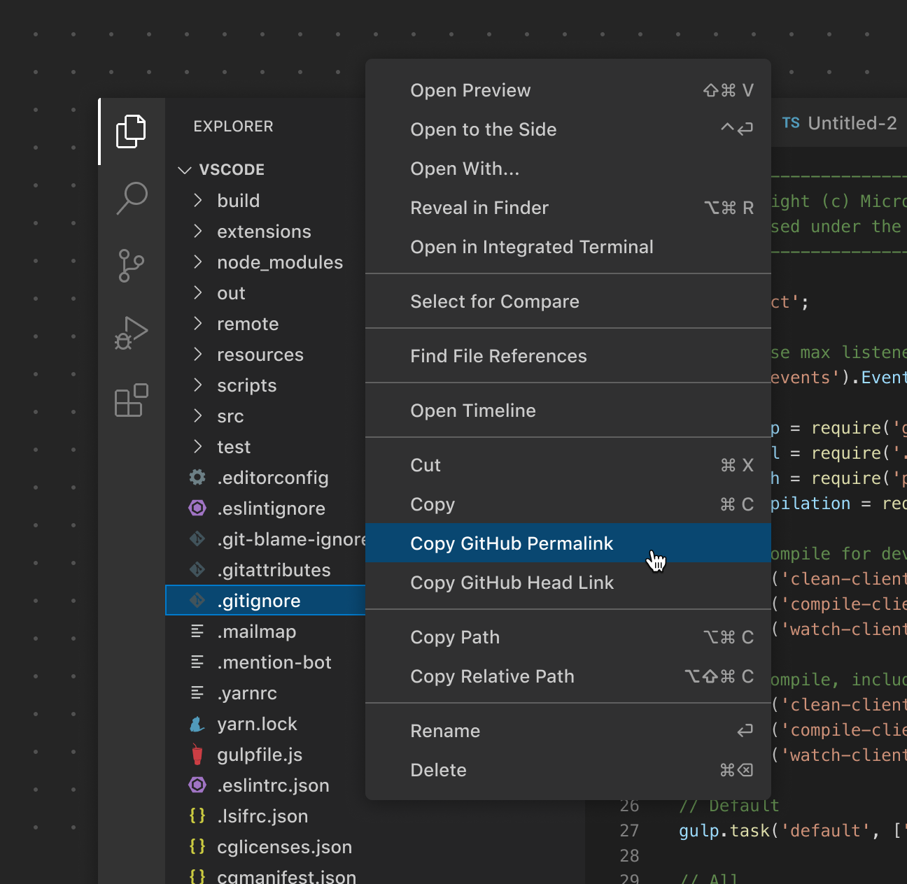
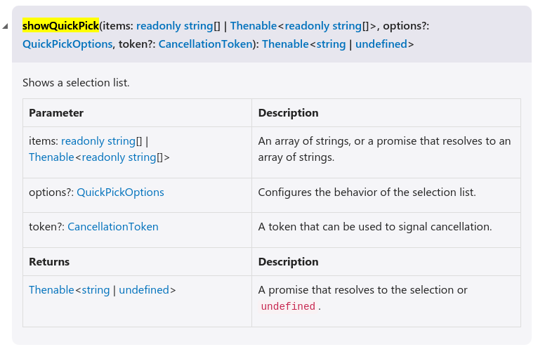

# 前言

这是针对 isubo 的 vscode 插件开发可行性调研记录，下面将简述第一个版本的 vscode 插件设计规划。

# isubo

- 选择文章：选择需要发布的文章，最终需要得到文章名以及文章的路径；

- 读取配置：读取所选文章的配置文件，获取必要信息；

- loading：推送文章或资源都需要时间，需要添加防抖与提示；

- 确认框交互：推送文章到 github-issue 成功后，需要与用户交互决定是否推送文章关联的资源；

- 使用 Git：文章关联的资源使用 Git 推送；

# 选择文章

vsode 的侧边栏是项目的文件树，可以对单个或多个文件，进行右键呼出选择菜单。计划在菜单中添加推送选项：

- publish；

- update;

- create;

因此，需要调研添加选项到菜单的可行性，以及选择后获取文章路径的可行性。

- [ ] 添加菜单项；

- [ ] 获取路径；

开发文档的 [Overview - Context Menus](https://code.visualstudio.com/api/ux-guidelines/overview#context-menus) 说明添加选项的可行性。




在 [ux-guidelines - context-menus](https://code.visualstudio.com/api/ux-guidelines/context-menus) 说明了最佳实践。

在 [contributes.menus](https://code.visualstudio.com/api/references/contribution-points#contributes.menus) 说明了菜单相关的多个配置项。但是未明说每个配置所对应的菜单。

据推断 `explorer/context` 应该是目标。下面以此展开实践：

声明的配置（package.json）：

```json
// 第 2 维的属性
"contributes": {
  "commands": [{
    "command": "isubo-ext.helloWorld",
    "title": "Hello World"
  }],
  "menus": {
    "explorer/context": [{
      "command": "isubo-ext.helloWorld"
    }]
  }
},
```

`isubo-ext.helloWorld` 对应在 `extension.js` 中使用 `vscode.commands.registerCommand` 注册的命令。

```js
// extonsion.js
function activate(context) {
  // 注册命令：isubo-ext.helloWorld
  let disposable = vscode.commands.registerCommand('isubo-ext.helloWorld', async function (...rest) {
    // ...
  });
  
  context.subscriptions.push(disposable);
}
```

执行后，菜单中出现：“Hello World”。`commands` 配置中的 `title` 即是菜单项的文案。

- [x] 添加菜单项；

- [ ] 获取路径；

在注册的命令的对调该函数中打印入参，得到 `vscode.commands.registerCommand` 的第一个回调参数是 `file` 对象，形如：

```shell
{scheme: 'file', authority: '', path: '/home/isaac/Workspace/blog/source/_posts/Get-Start-Of-Github-Action.md', query: '', fragment: '', …}
extensionHostProcess.js:113
_formatted:
'file:///home/isaac/Workspace/blog/source/_posts/Get-Start-Of-Github-Action.md'
_fsPath:
'/home/isaac/Workspace/blog/source/_posts/Get-Start-Of-Github-Action.md'
authority:
''
fragment:
''
fsPath:
ƒ fsPath(){return this._fsPath||(this._fsPath=w(this,!1)),this._fsPath}
path:
'/home/isaac/Workspace/blog/source/_posts/Get-Start-Of-Github-Action.md'
query:
''
scheme:
'file'
[[Prototype]]:
k
```

`vscode.commands.registerCommand` 注册的命令可以使用多种方式触发，其中就有 `control+shift+p` 或 对侧边栏的文件树右键选择。后者方式触发，回调函数的第一个参数会是 file 对象。


- [x] 添加菜单项；

- [x] 获取路径；


# 读取配置文件

在上面已经确认可以拿到文章的路径，配置文件名是确定的，可以通过路径向上检索配置文件。因此需要确认 vscode 插件时都提供 nodejs api（fs.readFileSync）

vscode 本身使用 Electron 框架开发，而 Electron 是内置 nodejs 的！并且不同的 vscode 内置不同的 nodejs。通过 vsode的版本信息就可以知道对应的nodejs版本，比如：

```shell
Version: 1.82.2
Commit: abd2f3db4bdb28f9e95536dfa84d8479f1eb312d
Date: 2023-09-14T05:51:20.981Z
Electron: 25.8.1
ElectronBuildId: 23779380
Chromium: 114.0.5735.289
Node.js: 18.15.0
V8: 11.4.183.29-electron.0
OS: Linux x64 6.1.0-12-amd64
```

- [x] 读取配置文件

## loading 提示

防抖逻辑实现不是问题，剩下需要确认 loading 提示的

参考：https://code.visualstudio.com/api/references/vscode-api

## withProgress

> Show progress in the editor. Progress is shown while running the given callback and while the promise it returned isn't resolved nor rejected. The location at which progress should show (and other details) is defined via the passed ProgressOptions.

```shell
vscode.window.withProgress({
  location: vscode.ProgressLocation.Window,
  title: 'Loading',
  cancellable: false
}, (progress) => {
  return new Promise((resolve) => {
    let cnt = 0;
    const timer = setInterval(() => {
      cnt += 10;
      // 可选
      progress.report({ increment: 10 });

      if (cnt >= 100) {
        clearInterval(timer);
        resolve();
      }
    }, 1000);
  });
});
```

在vsocde底部状态栏左边有loading动态图标的提示，点击可以在右下呼起提示框。

- [x] loading 提示

# 确认框交互



实现方式：

```js
const options = ['Option 1', 'Option 2', 'Option 3'];

vscode.window.showQuickPick(options, {
  placeHolder: 'Select an option'
}).then((selectedOption) => {
  console.info(selectedOption);
});
```

测试有效。会在vscode窗口顶部弹出单选项。
