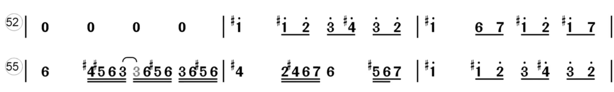

# 音符

使用阿拉伯数字表示音符

| C | D | E | F | G | A | B |
|:---:|---:|---:|---:|---:|---:|---:|
| 1(do) | 2(re) | 3(mi) | 4(fa) | 5(so) | 6(la) | 7(xi) |

# 音域

中音：单纯使用阿拉伯数字表示；

低音：在音符低下加点，比中音低一个八度则在数字下面加一个点，如此类推；

高音：在音符顶下加点，加点数量同低音。

# #

`#` 是升调符号，在简谱音符前面添加。表示升高半个音阶。

在半音阶口琴中，对此种情况则需要按推键。

# 按时值区分音符

注意：下面按 4 拍一节

- 全音符：占满一节，使用 `-` 占位，如：| 1 - - -|

- 二分音符：| 1 2 - - |

- 四分音符：单纯一个数字就是。如，| 1 2 3 2 |

- 八分音符：在数字下面添加下划线，如| 2 1 <u>65</u> 1 |

| 名称 |  | 时值 |
|:--:|:--:|:--:|
| 全音符 | `1 - - -`，使用 3 个 `-` 占位 | 4 拍 |
| 二分音符 | `3 -` 使用那个 1 个 `-` 占位如 1 2 3 - | 2 拍 |
| 四分音符 | 单独数字 | 1 拍 |
| 八分音符 | 音符下 1 条下划线， <u>6</u>，相邻会连写如：2 1 <u>65</u> 1 | 1/2 拍 |
| 十六分音符 | 音符下 2 条下划线 | 1/4 拍 |
| 三十二分音符 | 音符下 3 条下划线 | 1/8 拍 |
