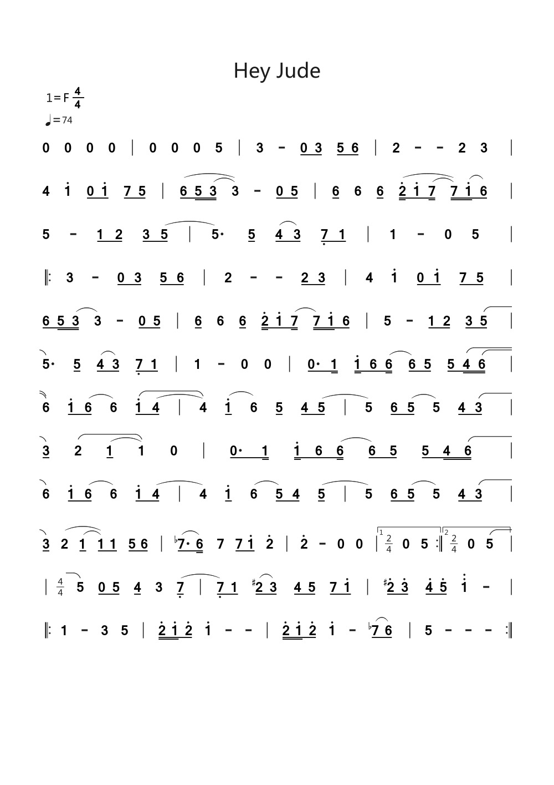

<!--

#============================以下为简谱头部定义==========================
B: Hey Jude
D: F
P: 4/4
J: 74
#============================以下开始简谱正文============================
Q: 0 0 0 0 | 0 0 0 5 | 3 - 0/ 3/ 5/ 6/ | 2 - - 2 3 |
Q: 4 1' 0/ 1'/ 7/ 5/ | (6/ 5// (3// 3)) - 0/ 5/ | 6/ 6 6/^ (2'// 1'/ (7// 7//)) (1'// 6/) |
Q: 5 - 1/ 2/ 3/ (5/ | 5.) 5/ (4/ 3/) 7,/ 1/ | 1 - 0 5 |
Q:  |: 3 - 0/ 3/ 5/ 6/ | 2 - - 2/ 3/ | 4 1' 0/ 1'/ 7/ 5/ |
Q: 6/ 5// (3// 3) - 0/ 5/ | 6/ 6 6/^ 2'// 1'/ (7// 7//) 1'// 6/ | 5 - 1/ 2/ 3/ (5/ |
Q: 5.) 5/ (4/ 3/) 7,/ 1/ | 1 - 0 0 | 0./ 1// 1'// 6/ (6// 6/) 5/ 5/ (4// (6// |
Q: 6)) 1'/ (6/ 6) (1'/ (4/ | 4)) (1'/ 6) 5/^ 4/ (5/ | 5) 6/ (5/ 5) 4/ (3/ |
Q: 3/) (2 (1/ 1)) 0 | 0./ 1// 1'// 6/ (6// 6/) 5/ 5/ 4// (6// |
Q: 6) 1'/ (6/ 6) 1'/ (4/ | 4) 1'/ (6 5/) 4/ (5/ | 5) 6/ (5/ 5) 4/ (3/ |
Q: 3/) (2 (1/^ 1/)) 1/ 5/ 6/ | (7$./ 6//) 7 7/ 1'/ 2' | 2' - 0 0 |["1""p:2/4" 0 5 :|]["2""p:2/4" 0 (5 |]
Q:  |"p:4/4" 5) 0/ 5/ 4/ 3 (7,/ | 7,/) 1/ (2#/ 3/) 4/ 5/ 7/ 1'/ | 2'#/ 3'/ 4'/ 5'/ 1'' - |
Q:  |: 1 - 3 5 | 2'// 1'// 2'/ 1' - - | 2'// 1'// 2'/ 1' - (7$/ 6/) | 5 - - - :|

-->