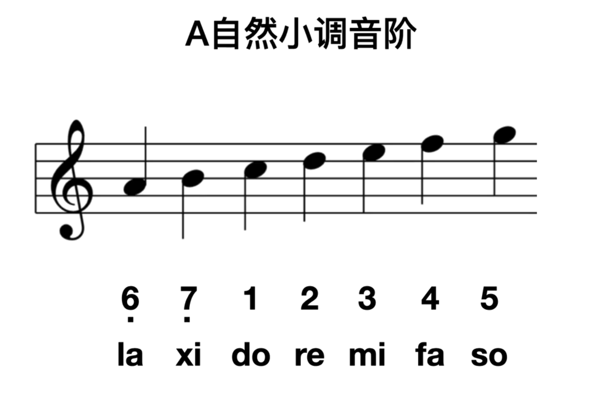
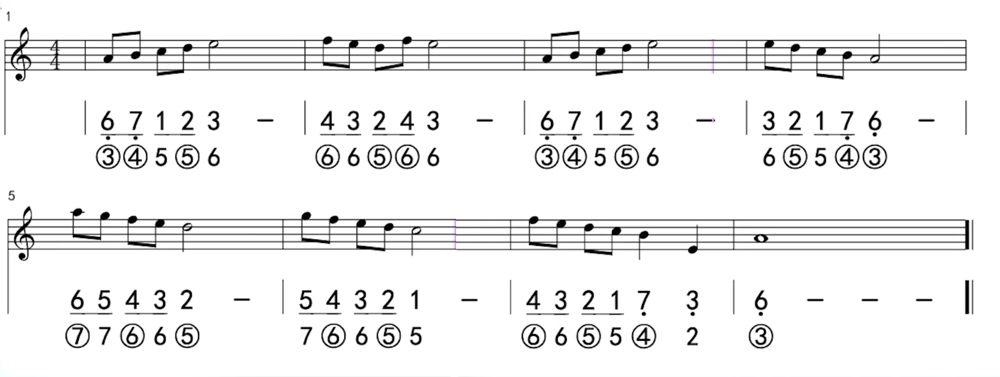

大调七声音阶：1、2、3、4、5、6、7、1（高）

A 自然小调音阶：6（低）、7（低）、1、2、3、4、5

大调七声音阶也叫 C 大调七声音阶，在西方音乐中，也使用字母指代音符，它们简谱的对应分别是：

| C | D | E | F | G | A | B |
|:---:|---:|---:|---:|---:|---:|---:|
| 1(do) | 2(re) | 3(mi) | 4(fa) | 5(so) | 6(la) | 7(xi) |

大调七声音阶以 C 音为根音，因此也叫 C 大调七声音阶。

由此，可知 A 自然小调音阶中的 A 为何含义！

# 练习曲

参考：[练习曲演奏片段]

[练习曲演奏片段]:https://www.bilibili.com/video/BV1Lv41117iH?t=153.0&p=10