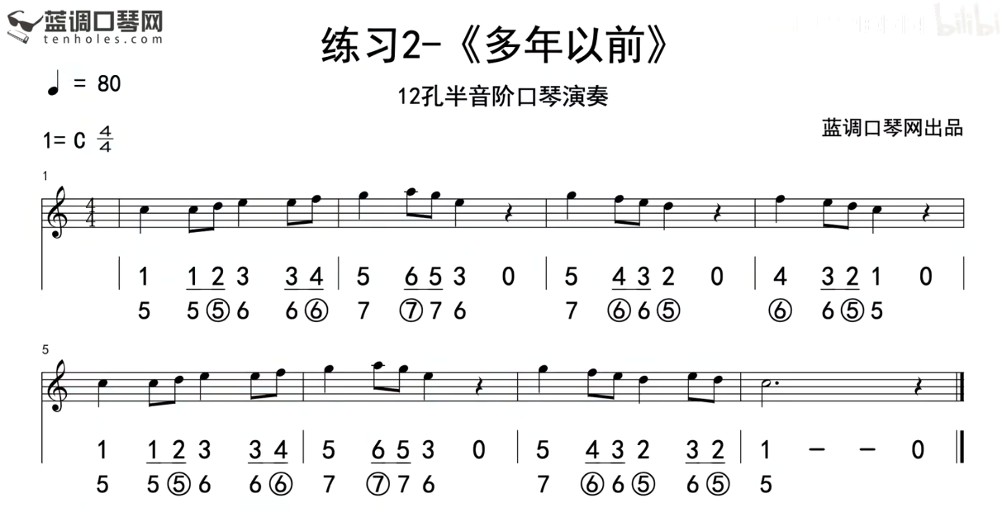
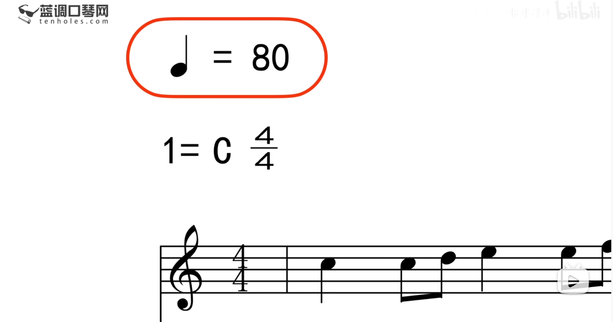
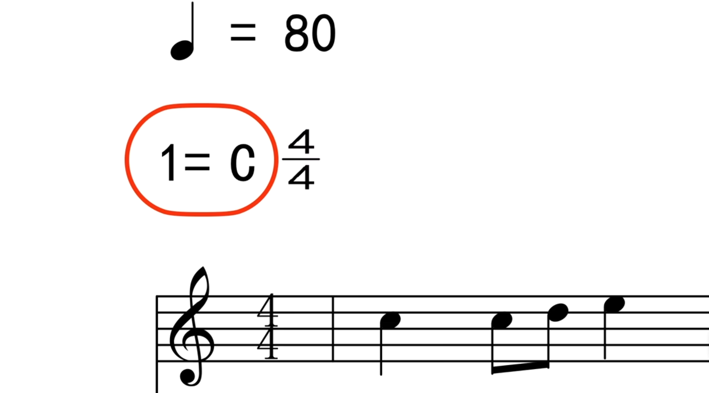
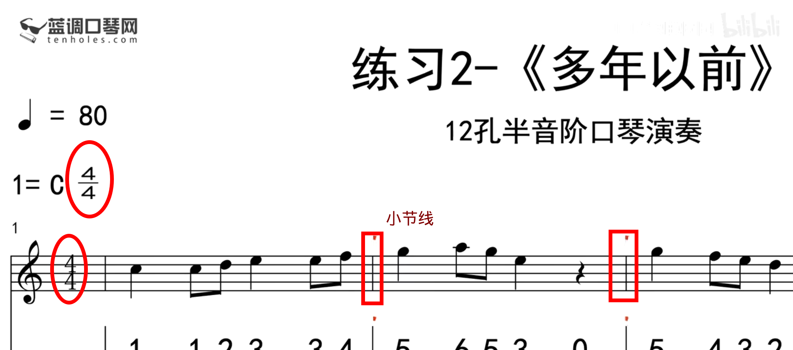
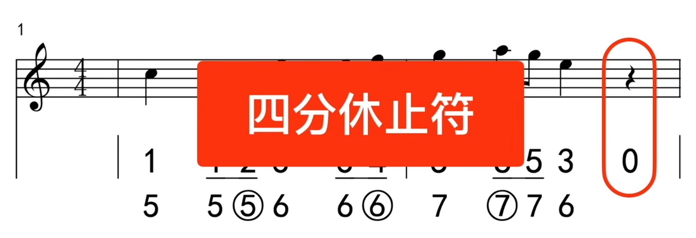
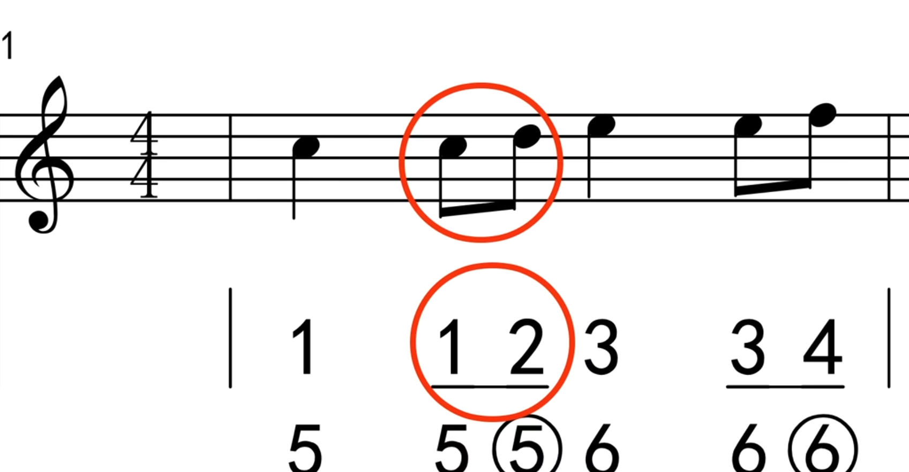
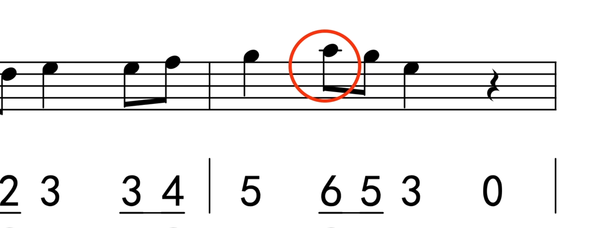

# 问题1：移动时，嘴唇粘在盖板上怎么办？

- 使用嘴唇湿润部分含住口琴，让口水作为润滑剂；

- 乐句节点（不要影响节奏的情况下）见缝插针地舔一下嘴唇；

参考：[问题1：移动时，嘴唇粘在盖板上怎么办？]

# 问题2：移动时，头动还是手动？

头和手都不是单一移动，而是相对且自然地动。

琴在动的时候需要注意不要前后摇动，而是在一条线上左右移动！

在课程中，老师的嘴在移动的同时，头会跟着节奏摇动！

参考：[问题2：移动时，头动还是手动？]

# 问题3：如何准确地移动到下一个音符的所在位置？

练！练！练！

通过练习产生手感，熟悉音孔距离。

## 练习

将中音区的1、2、3、4、5、6和7（简谱）练习熟悉！

参考： 

- [问题3：如何准确地移动到下一个音符的所在位置？]

- [练习例子](https://www.bilibili.com/video/BV1Lv41117iH?t=270.4&p=3)

# 问题4：如何解决演奏不连贯？

- 演奏一个乐句时，嘴唇不要离开口琴，气息不要断开。

- 对孔位要熟悉。参见问题3。

参考：[问题4：如何解决演奏不连贯？]

# 练习曲

参考：[练习曲片段]

## 乐理

### 乐曲速度

左上角标识表示乐曲的速度，以上图为例。

- 一个四分音符等于80；
- 曲子是以四分音符为一拍；
- 每分钟有 80 拍；

#### 大调

- 1 = C（这是简谱的标识）,表示乐曲是 C 调；

- 五线谱左端如果没有标明升降调，就说明是 C 调（图片中乐曲即为 C 调）。

#### 4 / 4

- 曲子是 四四拍 的乐曲；
- 四分音符为一拍；
- 每小节有四拍；
- 方框部分即是小节线，组成一个小节；

#### 四分休止符

四分休止符，就是时值占四分音符的不出声的音符。

#### 八分音符

八分音符的时值是四分音符的一半，两个八分音符相加就是一拍。

- 在简谱中，以数字加下划线表示。相邻的两个八分音符的下划线会连在一起；

- 在五线谱中，使用符尾（上图中的粗斜线）表示；

#### 上加线/下加线

在五线谱中，音符超出了五条线所涵盖的范围时就会在音符上加线。上图的加线称为上加一线，也有上加二线，如此类推。

参考：[练习曲乐理讲解]

# 附录

- [第三课、轻松移动换孔的诀窍](https://www.bilibili.com/video/BV1Lv41117iH?p=3)

- [问题1：移动时，嘴唇粘在盖板上怎么办？]

- [问题2：移动时，头动还是手动？]

- [问题3：如何准确地移动到下一个音符的所在位置？]

- [问题4：如何解决演奏不连贯？]

- [练习曲片段]

- [练习曲乐理讲解]

[问题1：移动时，嘴唇粘在盖板上怎么办？]:https://www.bilibili.com/video/BV1Lv41117iH?t=63.9&p=3
[问题2：移动时，头动还是手动？]:https://www.bilibili.com/video/BV1Lv41117iH?t=144.1&p=3
[问题3：如何准确地移动到下一个音符的所在位置？]:https://www.bilibili.com/video/BV1Lv41117iH?t=234.8&p=3
[问题4：如何解决演奏不连贯？]:https://www.bilibili.com/video/BV1Lv41117iH?t=284.7&p=3
[练习曲片段]:https://www.bilibili.com/video/BV1Lv41117iH?t=434.9&p=3
[练习曲乐理讲解]:https://www.bilibili.com/video/BV1Lv41117iH?t=460.7&p=3
