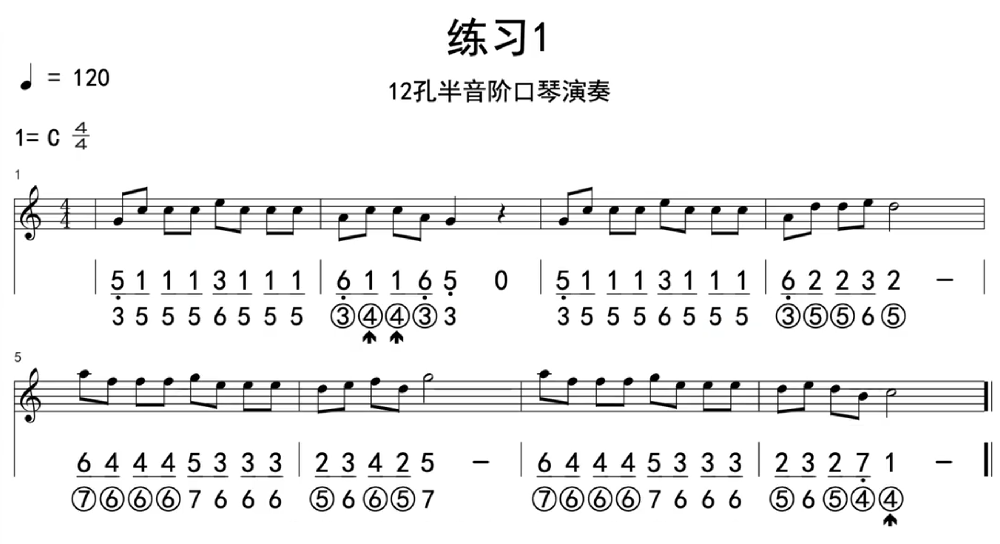

# 吐音技巧是什么

用舌头辅助起到断音的技巧。音断气不断

它的作用是：

- 断开相同音符，把音符断得很干净、有颗粒感；

- 营造出跳跃感（完全get不到，我只想顺利演奏）；

- 作为音头，强调乐句（所以是可以在乐句开始时使用）；

参考：

- [吐音技巧演示]

- [吐音技巧演示2]

# 吐音怎么做

参考：

- [5孔吹吸吐音演示]
- [5孔吹吸吐音演示（音频）](./口琴-p7-使用吐音技巧来改善你的演奏/5孔吹吸吐音.aac)

# 练习曲

参考：

- [练习曲片段]

- [练习曲片段（音频）](./口琴-p7-使用吐音技巧来改善你的演奏/练习曲片段.aac)

# 附录

- [第七课、使用吐音技巧来改善你的演奏]

- [练习曲片段]

[第七课、使用吐音技巧来改善你的演奏]:https://www.bilibili.com/video/BV1Lv41117iH?p=7
[吐音技巧演示]:https://www.bilibili.com/video/BV1Lv41117iH?t=16.7&p=7
[吐音技巧演示2]:https://www.bilibili.com/video/BV1Lv41117iH?t=44.3&p=7
[5孔吹吸吐音演示]:https://www.bilibili.com/video/BV1Lv41117iH?t=209.3&p=7
[练习曲片段]:https://www.bilibili.com/video/BV1Lv41117iH?t=378.4&p=7