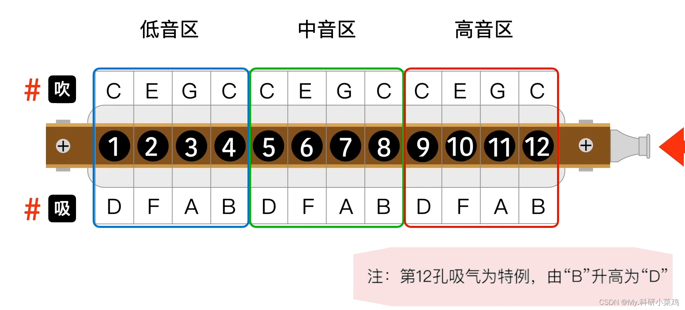
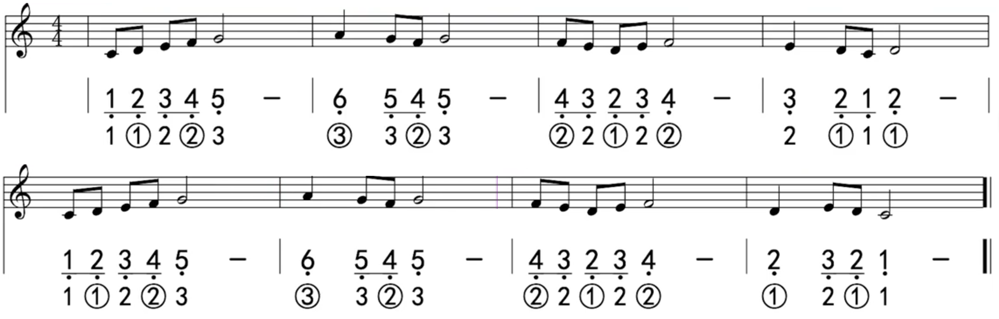
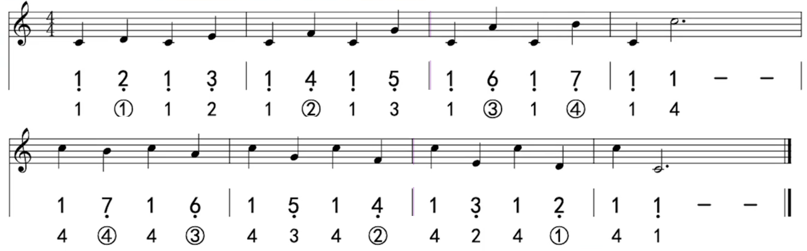

# 前言

本节记录包含 [第八课、低音区的演奏要领和误区] 和 [第九课、跨越低音区和中音区的大跨度演奏] 两个课程。

# 低音区

## 演奏错误出现的现象

- 吸不响；

- 音偏低；

- 舌头在根部拱起。

吸不响的原因可能是单音演奏不够标准；音偏低的可能原因是含琴浅、口腔扁，它也会导致吸不响的后果；口腔打开情况下，舌头在根部拱起导致气息被阻挡（参考错误示范：[舌头根部拱起引起不标准问题]）。

## 演奏正确的关键点

- 打开口腔；

- 舌头放平不要拱起；

- 保持气息通常。

## 练习辅助

- 抬头吸气，这会让气息更加通畅，以此感受，再把头摆正找到气息通畅的感觉，然后保持住口腔状态去练习、熟悉；

- 练习低音区的单音长音。

*注意：低音区比中音区对气息的要求要高很多！要注意呼吸方法*

# 练习曲

参考：

- [p8练习曲]

- [p8练习曲音频]

# 大跨度演奏

大幅度跨越孔位演奏在乐曲中是常见的，需要针对乐曲中的跨越部分做练习。

# 练习曲

参考：

- [p9练习曲]

- [p9练习曲音频]

其他练习曲：《over the rainbow》

# 附录

- [第八课、低音区的演奏要领和误区]

- [第九课、跨越低音区和中音区的大跨度演奏]

- [低音区演奏示范]

- [低音区2孔错误示范演奏]

- [舌头根部拱起引起不标准问题]

- [抬头练习辅助]

- [p8练习曲]

- [p9练习曲]

[第八课、低音区的演奏要领和误区]:https://www.bilibili.com/video/BV1Lv41117iH?p=8
[第九课、跨越低音区和中音区的大跨度演奏]:https://www.bilibili.com/video/BV1Lv41117iH?p=9
[低音区演奏示范]:https://www.bilibili.com/video/BV1Lv41117iH?t=45.6&p=8
[低音区2孔错误示范演奏]:https://www.bilibili.com/video/BV1Lv41117iH?t=58.5&p=8
[舌头根部拱起引起不标准问题]:https://www.bilibili.com/video/BV1Lv41117iH?t=108.1&p=8
[抬头练习辅助]:https://www.bilibili.com/video/BV1Lv41117iH?t=143.9&p=8
[p8练习曲]:https://www.bilibili.com/video/BV1Lv41117iH?t=217.4&p=8
[p8练习曲音频]:./口琴-p8-p9-低音区的演奏要领和误区/p8-练习曲.aac
[p9练习曲]:https://www.bilibili.com/video/BV1Lv41117iH?t=115.8&p=9
[p9练习曲音频]:./口琴-p8-p9-低音区的演奏要领和误区/p9-练习曲.aac