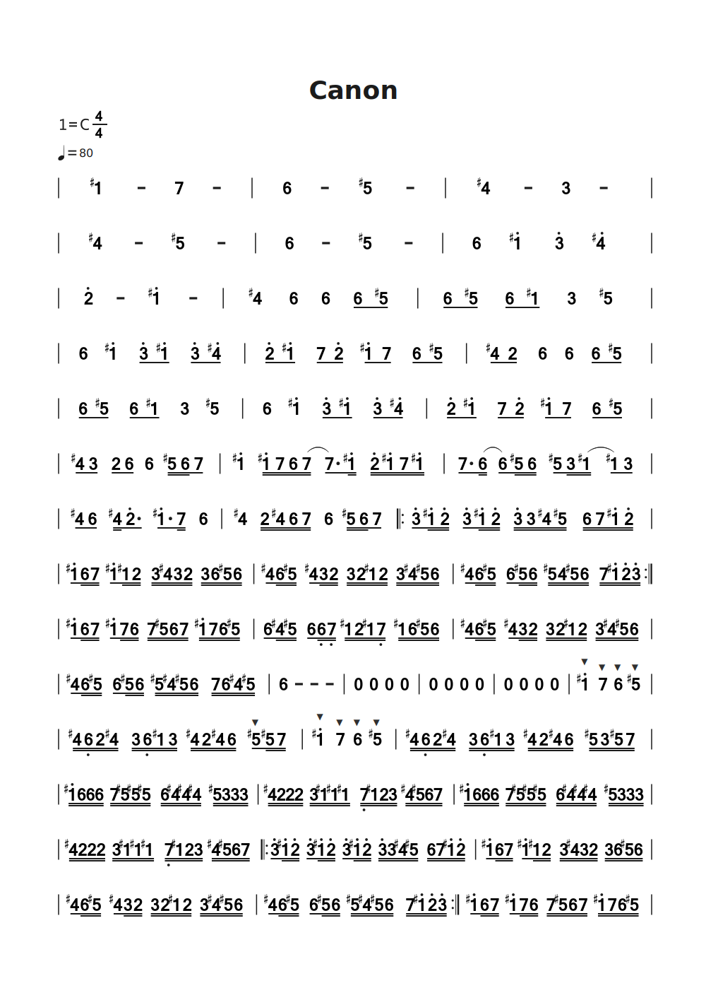
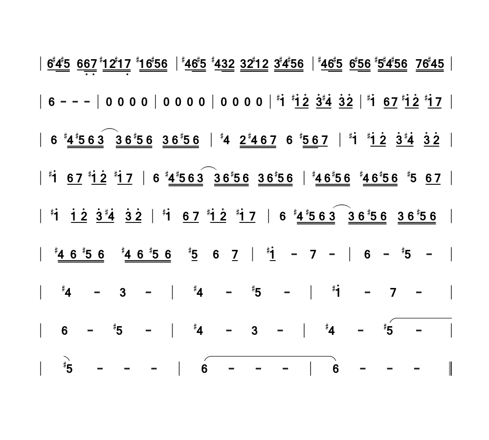

<!-- 
#============================以下为简谱头部定义==========================
B: 卡农
D: C
P: 4/4
J: 80
#============================以下开始简谱正文============================
Q:  | 1‘# - 7 - | 6 - 5# - | 4# - 3 - |
Q:  | 4# - 5# - | 6 - 5# - | 6 1'# 3' 4'# |
Q:  | 2' - 1'# - | 4# 6 6 6/ 5#/ | 6/ 5#/ 6/ 1#/ 3 5# |
Q:  | 6 1'# 3'/ 1'#/ 3'/ 4'#/ | 2'/ 1'#/ 7/ 2'/ 1'#/ 7/ 6/ 5#/ | 4#/ 2/ 6 6 6/ 5#/ |
Q:  | 6/ 5#/ 6/ 1#/ 3 5# | 6 1'# 3'/ 1'#/ 3'/ 4'#/ | 2'/ 1'#/ 7/ 2'/ 1'#/ 7/ 6/ 5#/ |
Q:  | 4#/ 3/ 2/ 6/ 6 5#// 6// 7/ | 1'# 1'#// 7// 6// (7// 7./) 1'#// 2'// 1'#// 7// 1'#// | 7./ (6// 6/) 5#// 6// 5#/ 3// (1#// 1#/) 3/ |
Q:  | 4#/ 6/ 4#// 2'./ 1'#./ 7// 6 | 4# 2// 4#// 6// 7// 6 5#// 6// 7/ |: 3'/ 1'#// 2'// 3'/ 1'#// 2'// 3'// 3// 4#// 5#// 6// 7// 1'#// 2'// |
Q:  | 1'#/ 6// 7// 1'#/ 1#// 2// 3// 4#// 3// 2// 3// 6// 5#// 6// | 4#/ 6// 5#// 4#/ 3// 2// 3// 2// 1#// 2// 3// 4#// 5#// 6// | 4#/ 6// 5#// 6/ 5#// 6// 5#// 4// 5#// 6// 7// 1'#// 2'// 3'// :|
Q:  | 1'#/ 6// 7// 1'#/ 7// 6// 7// 5#// 6// 7// 1'#// 7// 6// 5#// | 6/ 4#// 5#// 6/ 6,// 7,// 1#// 2// 1#// 7,// 1#// 6// 5#// 6// | 4#/ 6// 5#// 4#/ 3// 2// 3// 2// 1#// 2// 3// 4#// 5#// 6// |
Q:  | 4#/ 6// 5#// 6/ 5#// 6// 5#// 4#// 5#// 6// 7// 6// 4#// 5#// | 6 - - - | 0 0 0 0 |
Q:  | 0 0 0 0 | 0 0 0 0 | 1'#&mf 7&mf 6&mf 5#&mf |
Q:  | 4#// 6,// 2// 4#// 3// 6,// 1#// 3// 4#// 2// 4#// 6// 5#&mf/ 5#// 7// | 1'#&mf 7&mf 6&mf 5#&mf | 4#// 6,// 2// 4#// 3// 6,// 1#// 3// 4#// 2// 4#// 6// 5#// 3// 5#// 7// |
Q:  | 1'#// 6// 6// 6// 7// 5#// 5#// 5#// 6// 4#// 4#// 4#// 5#// 3// 3// 3// | 4#// 2// 2// 2// 3// 1#// 1#// 1#// 7,// 1#// 2// 3// 4#// 5#// 6// 7// | 1'#// 6// 6// 6// 7// 5#// 5#// 5#// 6// 4#// 4#// 4#// 5#// 3// 3// 3// |
Q:  | 4#// 2// 2// 2// 3// 1#// 1#// 1#// 7,// 1#// 2// 3// 4#// 5#// 6// 7// |: 3'/ 1'#// 2'// 3'/ 1'#// 2'// 3'/ 1'#// 2'// 3'// 3// 4#// 5#// 6// 7// 1'#// 2'// | 1'#/ 6// 7// 1'#/ 1#// 2// 3// 4#// 3// 2// 3// 6// 5#// 6// |
Q:  | 4#/ 6// 5#// 4#/ 3// 2// 3// 2// 1#// 2// 3// 4#// 5#// 6// | 4#/ 6// 5#// 6/ 5#// 6// 5#// 4#// 5#// 6// 7// 1'#// 2'// 3'// :| 1'#/ 6// 7// 1'#/ 7// 6// 7// 5#// 6// 7// 1'#// 7// 6// 5#// |
[fenye]
Q:  | 6/ 4#// 5#// 6/ 6,// 7,// 1#// 2// 1#// 7,// 1#// 6// 5#// 6// | 4#/ 6// 5#// 4#/ 3// 2// 3// 2// 1#// 2// 3// 4#// 5#// 6// | 4#/ 6// 5#// 6/ 5#// 6// 5#// 4#// 5#// 6// 7// 6// 4#// 5// |
Q:  | 6 - - - | 0 0 0 0 | 0 0 0 0 |
Q:  | 0 0 0 0 | 1'# 1'#/ 2'/ 3'/ 4'#/ 3'/ 2'/ | 1'# 6/ 7/ 1'#/ 2'/ 1'#/ 7/ |
Q:  | 6 4#// 5#// 6// (3// 3//) 6// 5#// 6// 3// 6// 5#// 6// | 4# 2// 4#// 6// 7// 6 5#// 6// 7/ | 1'# 1'#/ 2'/ 3'/ 4'#/ 3'/ 2'/ |
Q:  | 1'# 6/ 7/ 1'#/ 2'/ 1'#/ 7/ | 6 4#// 5#// 6// (3// 3//) 6// 5#// 6// 3// 6// 5#// 6// | 4#// 6// 5#// 6// 4#// 6// 5#// 6// 5# 6/ 7/ |
Q:  | 1'# 1'!/ 2'/ 3'/ 4'#/ 3'/ 2'/ | 1'# 6/ 7/ 1'#/ 2'/ 1'#/ 7/ | 6 4#// 5#// 6// (3// 3//) 6// 5#// 6// 3// 6// 5#// 6// |
Q:  | 4#// 6// 5#// 6// 4#// 6// 5#// 6// 5#/ 6 7/ | 1'#/ - 7 - | 6 - 5# - |
Q:  | 4# - 3 - | 4# - 5# - | 1'# - 7 - |
Q:  | 6 - 5# - | 4# - 3 - | 4# - (5# - |
Q:  | 5#) - - - | (6 - - - | 6) - - - ||

 -->

# 附录

[参考视频|卡农 半音阶口琴动态曲谱](https://www.bilibili.com/video/BV1Lq4y1c7h8/?spm_id_from=333.337.search-card.all.click&vd_source=33ac0456d389f10fb21747392b35389b)