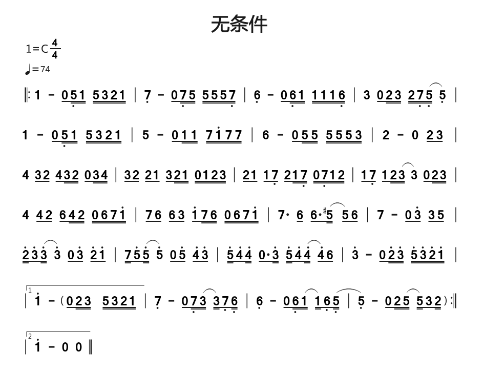
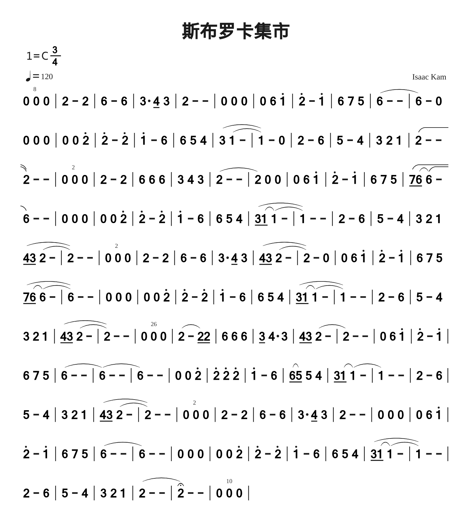
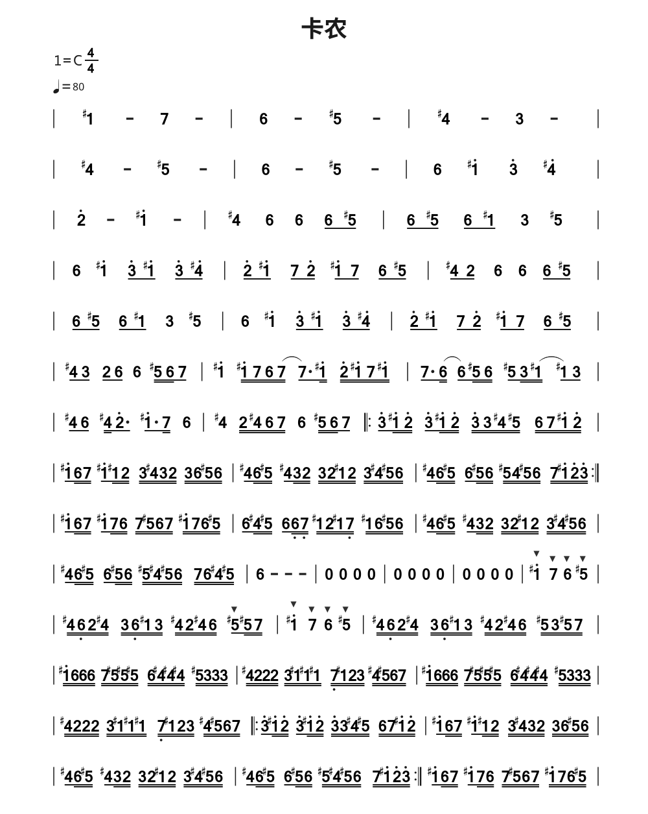
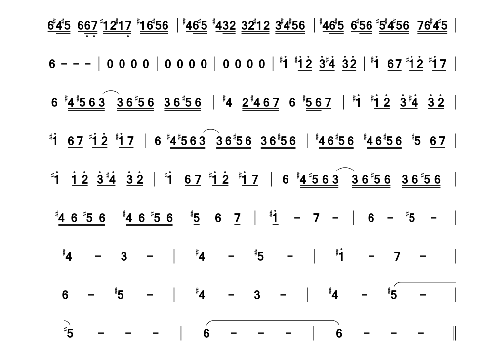
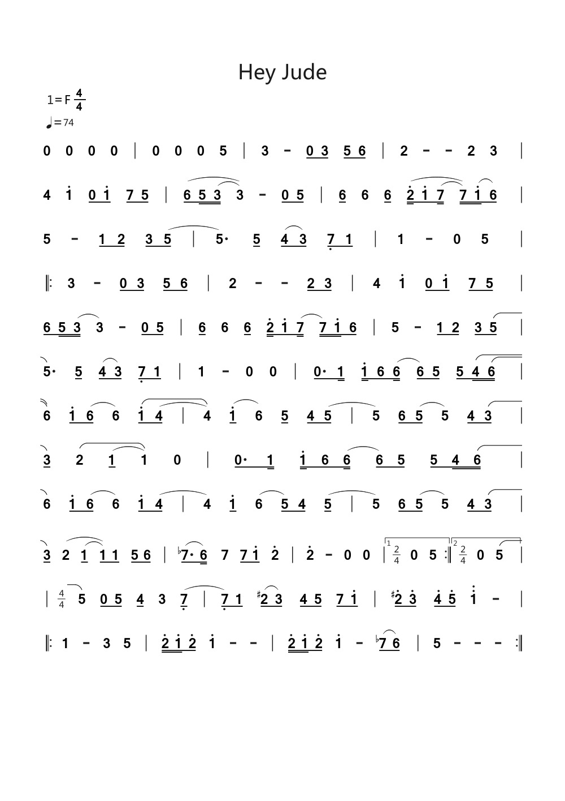
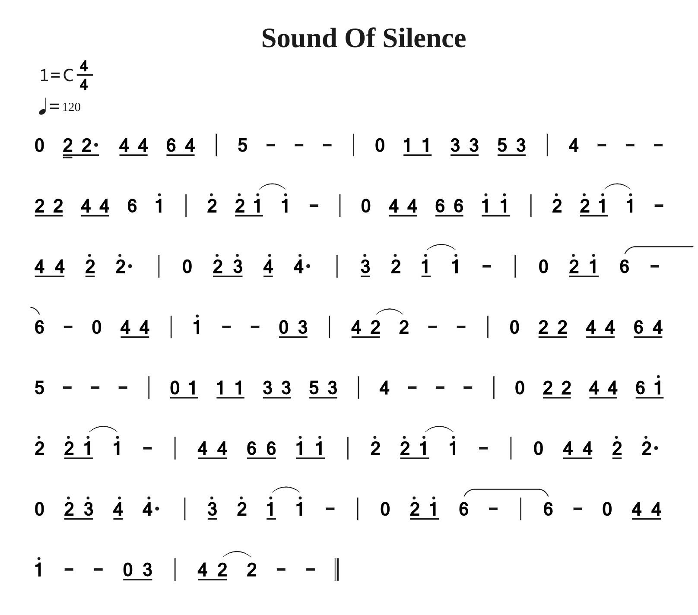

## 无条件

<!--

#============================以下为简谱头部定义==========================
B: 无条件
D: C
P: 4/4
J: 74
#============================以下开始简谱正文============================
Q:  |: 1 - 0/ 5,// 1// 5// 3// 2// 1// | 7, - 0/ 7,// 5// 5// 5// 5// 7,// | 6, - 0/ 6,// 1// 1// 1// 1// 6,// | 3 0/ 2// 3// 2// 7,// (5,// 5,) |
Q: 1 - 0/ 5,// 1// 5// 3// 2// 1// | 5 - 0/ 1// 1// 7// 1'// 7// 7// | 6 - 0/ 5// 5// 5// 5// 5// 3// | 2 - 0 2/ 3/ |
Q: 4 3/ 2/ 4/ 3// 2// 0/ 3// 4// | 3/ 2/ 2/ 1/ 3/ 2// 1// 0// 1// 2// 3// | 2/ 1/ 1/ 7,/ 2/ 1// 7,// 0// 7,// 1// 2// | 1/ 7,/ 1/ 2// (3// 3) 0/ 2// 3// |
Q: 4 4/ 2/ 6/ 4// 2// 0// 6// 7// 1'// | 7/ 6/ 6/ 3/ 1'/ 7// 6// 0// 6// 7// 1'// | 7. 6/ 6./ (5#// 5/) 6/ | 7 - 0/ 3'/ 3/ 5/ |
Q: 2'// 3'/ (3'// 3') 0/ 3'/ 2'/ 1'/ | 7// 5'/ (5'// 5') 0/ 5'/ 4'/ 3'/ | 5'// 4'/ 4'// 0/. 3'// 5'// 4'/ (4'// 4'/) 6/ | 3' - 0/ 2'// 3'// 5'// 3'// 2'// 1'// |
Q:  |["1" 1' - 0/&zkh 2// 3// 5// 3// 2// 1// |]/ 7, - 0/ 7,// (3// 3//) 7,/ 6,// | 6, - 0/ 6,// (1// 1//) 6,/ (5,// | 5,) - 0/ 2// (5// 5//) 3/ 2//&ykh :|
Q:  |["2" 1' - 0 0 ||]/

-->

## 斯布罗卡集市

<!--
B: 斯布罗卡集市
D: C
P: 3/4
J: 120
Z: Isaac Kam
Q: 0 0"8" 0 | 2 - 2 | 6 - 6 | 3. 4/ 3 | 2 - - | 0 0 0 | 0 6 1' | 2' - 1' | 6 7 5 | (6 - - | 6) - 0
Q: 0 0 0 | 0 0 2' | 2' - 2' | 1' - 6 | 6 5 4 | (3 (1 - | 1)) - 0 | 2 - 6 | 5 - 4 | 3 2 1 | (2 - -
Q: 2) - - | 0 0"2" 0 | 2 - 2 | 6 6 6 | 3 4 3 | (2 - - | 2) 0 0 | 0 6 1' | 2' - 1' | 6 7 5 | (7/ (6/ 6) (-
Q: 6)) - - | 0 0 0 | 0 0 2' | 2' - 2' | 1' - 6 | 6 5 4 | (3/ (1/ 1) (- | 1)) - - | 2 - 6 | 5 - 4 | 3 2 1
Q:  (4/ 3/ (2 - | 2)) - - | 0 0"2" 0 | 2 - 2 | 6 - 6 | 3. 4/ 3 | (4/ 3/ (2 - | 2)) - 0 | 0 6 1' | 2' - 1' | 6 7 5
Q:  (7/ (6/ 6) (- | 6)) - - | 0 0 0 | 0 0 2' | 2' - 2' | 1' - 6 | 6 5 4 | (3/ (1/ 1) (- | 1)) - - | 2 - 6 | 5 - 4
Q: 3 2 1 | (4/ 3/ (2 - | 2)) - - | 0 0"26" 0 | (2 - 2/) 2/ | 6 6 6 | 3/ 4. 3 | 4/ 3/ (2 - | 2) - - | 0 6 1' | 2' - 1' |
Q: 6 7 5 | (6 - - | 6) (- - | 6) - - | 0 0 2' | 2' 2' 2' | 1' - 6 | (6/ 5/) 5 4 | 3/ (1/ 1) (- | 1) - - | 2 - 6 |
Q: 5 - 4 | 3 2 1 | (4/ 3/ (2 - | 2)) - - | 0 0"2" 0 | 2 - 2 | 6 - 6 | 3. 4/ 3 | 2 - - | 0 0 0 | 0 6 1' |
Q: 2' - 1' | 6 7 5 | (6 - - | 6) - - | 0 0 0 | 0 0 2' | 2' - 2' | 1' - 6 | 6 5 4 | (3/ (1/ 1) (- | 1)) - - |
Q: 2 - 6 | 5 - 4 | 3 2 1 | (2 - - | 2&yc) - - | 0 0"10" 0 |
-->

## 卡农

<!-- 
#============================以下为简谱头部定义==========================
B: 卡农
D: C
P: 4/4
J: 80
#============================以下开始简谱正文============================
Q:  | 1‘# - 7 - | 6 - 5# - | 4# - 3 - |
Q:  | 4# - 5# - | 6 - 5# - | 6 1'# 3' 4'# |
Q:  | 2' - 1'# - | 4# 6 6 6/ 5#/ | 6/ 5#/ 6/ 1#/ 3 5# |
Q:  | 6 1'# 3'/ 1'#/ 3'/ 4'#/ | 2'/ 1'#/ 7/ 2'/ 1'#/ 7/ 6/ 5#/ | 4#/ 2/ 6 6 6/ 5#/ |
Q:  | 6/ 5#/ 6/ 1#/ 3 5# | 6 1'# 3'/ 1'#/ 3'/ 4'#/ | 2'/ 1'#/ 7/ 2'/ 1'#/ 7/ 6/ 5#/ |
Q:  | 4#/ 3/ 2/ 6/ 6 5#// 6// 7/ | 1'# 1'#// 7// 6// (7// 7./) 1'#// 2'// 1'#// 7// 1'#// | 7./ (6// 6/) 5#// 6// 5#/ 3// (1#// 1#/) 3/ |
Q:  | 4#/ 6/ 4#// 2'./ 1'#./ 7// 6 | 4# 2// 4#// 6// 7// 6 5#// 6// 7/ |: 3'/ 1'#// 2'// 3'/ 1'#// 2'// 3'// 3// 4#// 5#// 6// 7// 1'#// 2'// |
Q:  | 1'#/ 6// 7// 1'#/ 1#// 2// 3// 4#// 3// 2// 3// 6// 5#// 6// | 4#/ 6// 5#// 4#/ 3// 2// 3// 2// 1#// 2// 3// 4#// 5#// 6// | 4#/ 6// 5#// 6/ 5#// 6// 5#// 4// 5#// 6// 7// 1'#// 2'// 3'// :|
Q:  | 1'#/ 6// 7// 1'#/ 7// 6// 7// 5#// 6// 7// 1'#// 7// 6// 5#// | 6/ 4#// 5#// 6/ 6,// 7,// 1#// 2// 1#// 7,// 1#// 6// 5#// 6// | 4#/ 6// 5#// 4#/ 3// 2// 3// 2// 1#// 2// 3// 4#// 5#// 6// |
Q:  | 4#/ 6// 5#// 6/ 5#// 6// 5#// 4#// 5#// 6// 7// 6// 4#// 5#// | 6 - - - | 0 0 0 0 |
Q:  | 0 0 0 0 | 0 0 0 0 | 1'#&mf 7&mf 6&mf 5#&mf |
Q:  | 4#// 6,// 2// 4#// 3// 6,// 1#// 3// 4#// 2// 4#// 6// 5#&mf/ 5#// 7// | 1'#&mf 7&mf 6&mf 5#&mf | 4#// 6,// 2// 4#// 3// 6,// 1#// 3// 4#// 2// 4#// 6// 5#// 3// 5#// 7// |
Q:  | 1'#// 6// 6// 6// 7// 5#// 5#// 5#// 6// 4#// 4#// 4#// 5#// 3// 3// 3// | 4#// 2// 2// 2// 3// 1#// 1#// 1#// 7,// 1#// 2// 3// 4#// 5#// 6// 7// | 1'#// 6// 6// 6// 7// 5#// 5#// 5#// 6// 4#// 4#// 4#// 5#// 3// 3// 3// |
Q:  | 4#// 2// 2// 2// 3// 1#// 1#// 1#// 7,// 1#// 2// 3// 4#// 5#// 6// 7// |: 3'/ 1'#// 2'// 3'/ 1'#// 2'// 3'/ 1'#// 2'// 3'// 3// 4#// 5#// 6// 7// 1'#// 2'// | 1'#/ 6// 7// 1'#/ 1#// 2// 3// 4#// 3// 2// 3// 6// 5#// 6// |
Q:  | 4#/ 6// 5#// 4#/ 3// 2// 3// 2// 1#// 2// 3// 4#// 5#// 6// | 4#/ 6// 5#// 6/ 5#// 6// 5#// 4#// 5#// 6// 7// 1'#// 2'// 3'// :| 1'#/ 6// 7// 1'#/ 7// 6// 7// 5#// 6// 7// 1'#// 7// 6// 5#// |
[fenye]
Q:  | 6/ 4#// 5#// 6/ 6,// 7,// 1#// 2// 1#// 7,// 1#// 6// 5#// 6// | 4#/ 6// 5#// 4#/ 3// 2// 3// 2// 1#// 2// 3// 4#// 5#// 6// | 4#/ 6// 5#// 6/ 5#// 6// 5#// 4#// 5#// 6// 7// 6// 4#// 5// |
Q:  | 6 - - - | 0 0 0 0 | 0 0 0 0 |
Q:  | 0 0 0 0 | 1'# 1'#/ 2'/ 3'/ 4'#/ 3'/ 2'/ | 1'# 6/ 7/ 1'#/ 2'/ 1'#/ 7/ |
Q:  | 6 4#// 5#// 6// (3// 3//) 6// 5#// 6// 3// 6// 5#// 6// | 4# 2// 4#// 6// 7// 6 5#// 6// 7/ | 1'# 1'#/ 2'/ 3'/ 4'#/ 3'/ 2'/ |
Q:  | 1'# 6/ 7/ 1'#/ 2'/ 1'#/ 7/ | 6 4#// 5#// 6// (3// 3//) 6// 5#// 6// 3// 6// 5#// 6// | 4#// 6// 5#// 6// 4#// 6// 5#// 6// 5# 6/ 7/ |
Q:  | 1'# 1'!/ 2'/ 3'/ 4'#/ 3'/ 2'/ | 1'# 6/ 7/ 1'#/ 2'/ 1'#/ 7/ | 6 4#// 5#// 6// (3// 3//) 6// 5#// 6// 3// 6// 5#// 6// |
Q:  | 4#// 6// 5#// 6// 4#// 6// 5#// 6// 5#/ 6 7/ | 1'#/ - 7 - | 6 - 5# - |
Q:  | 4# - 3 - | 4# - 5# - | 1'# - 7 - |
Q:  | 6 - 5# - | 4# - 3 - | 4# - (5# - |
Q:  | 5#) - - - | (6 - - - | 6) - - - ||

-->

## Hey Jude

<!--

#============================以下为简谱头部定义==========================
B: Hey Jude
D: F
P: 4/4
J: 74
#============================以下开始简谱正文============================
Q: 0 0 0 0 | 0 0 0 5 | 3 - 0/ 3/ 5/ 6/ | 2 - - 2 3 |
Q: 4 1' 0/ 1'/ 7/ 5/ | (6/ 5// (3// 3)) - 0/ 5/ | 6/ 6 6/^ (2'// 1'/ (7// 7//)) (1'// 6/) |
Q: 5 - 1/ 2/ 3/ (5/ | 5.) 5/ (4/ 3/) 7,/ 1/ | 1 - 0 5 |
Q:  |: 3 - 0/ 3/ 5/ 6/ | 2 - - 2/ 3/ | 4 1' 0/ 1'/ 7/ 5/ |
Q: 6/ 5// (3// 3) - 0/ 5/ | 6/ 6 6/^ 2'// 1'/ (7// 7//) 1'// 6/ | 5 - 1/ 2/ 3/ (5/ |
Q: 5.) 5/ (4/ 3/) 7,/ 1/ | 1 - 0 0 | 0./ 1// 1'// 6/ (6// 6/) 5/ 5/ (4// (6// |
Q: 6)) 1'/ (6/ 6) (1'/ (4/ | 4)) (1'/ 6) 5/^ 4/ (5/ | 5) 6/ (5/ 5) 4/ (3/ |
Q: 3/) (2 (1/ 1)) 0 | 0./ 1// 1'// 6/ (6// 6/) 5/ 5/ 4// (6// |
Q: 6) 1'/ (6/ 6) 1'/ (4/ | 4) 1'/ (6 5/) 4/ (5/ | 5) 6/ (5/ 5) 4/ (3/ |
Q: 3/) (2 (1/^ 1/)) 1/ 5/ 6/ | (7$./ 6//) 7 7/ 1'/ 2' | 2' - 0 0 |["1""p:2/4" 0 5 :|]["2""p:2/4" 0 (5 |]
Q:  |"p:4/4" 5) 0/ 5/ 4/ 3 (7,/ | 7,/) 1/ (2#/ 3/) 4/ 5/ 7/ 1'/ | 2'#/ 3'/ 4'/ 5'/ 1'' - |
Q:  |: 1 - 3 5 | 2'// 1'// 2'/ 1' - - | 2'// 1'// 2'/ 1' - (7$/ 6/) | 5 - - - :|

-->

## Sound of Silence

<!--
#============================以下为简谱头部定义==========================
B: Sound Of Silence
D: C
P: 4/4
J: 120
#============================以下开始简谱正文============================
Q: 0 2// 2/. 4/ 4/ 6/ 4/ | 5 - - - | 0 1/ 1/ 3/ 3/ 5/ 3/ | 4 - - -
Q: 2/ 2/ 4/ 4/ 6 1' | 2' 2'/ (1'/ 1') - | 0 4/ 4/ 6/ 6/ 1'/ 1'/ | 2' 2'/ (1'/ 1') -
Q: 4/ 4/ 2'/ 2'. | 0 2'/ 3'/ 4'/ 4'. | 3'/ 2' (1'/ 1') - | 0 2'/ 1'/ (6 -
Q: 6) - 0 4/ 4/ | 1' - - 0/ 3/ | 4/ (2/ 2) - - | 0 2/ 2/ 4/ 4/ 6/ 4/
Q: 5 - - - | 0/ 1/ 1/ 1/ 3/ 3/ 5/ 3/ | 4 - - - | 0 2/ 2/ 4/ 4/ 6/ 1'/
Q: 2' 2'/ (1'/ 1') - | 4/ 4/ 6/ 6/ 1'/ 1'/ | 2' 2'/ (1'/ 1') - | 0 4/ 4/ 2'/ 2'.
Q: 0 2'/ 3'/ 4'/ 4'. | 3'/ 2' (1'/ 1') - | 0 2'/ 1'/ (6 - | 6) - 0 4/ 4/
Q: 1' - - 0/ 3/ | 4/ (2/ 2) - - ||
-->

## 附录

- [番茄制谱网页版](http://zhipu.lezhi99.com/Zhipu-index.html)

- [番茄简谱脚本说明手册](http://doc.lezhi99.com/zhipu#144)