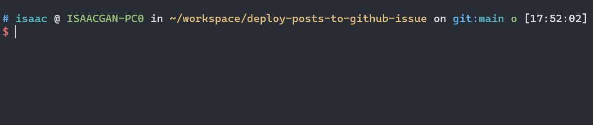

# 前言

npx 可以访问局部安装的pkg，但是无法补这些包的cli命令，在输入时较容易出错。

查阅 npm docs 无果，参考网上的解决方案，使用脚本补全npx的命令。

📣 **思路是：**

1. 遍历 `node_modules/.bin` 目录下查找可执行文件。

2. 使用 `compgen` 命令生成补全候选项。

3. 基于得到的补全候选项，使用 `complete` 命令为 `npx` 命令设置自动补全功能。


# 自动补全逻辑

接下来将给出完整的脚本内容，然后再逐行分析脚本的实现逻辑。

**以下是完整的脚本内容：**

```shell
_autocomplete() {
  local dir=$(pwd -P)
  while [[ -n "$dir" ]]; do
    if [[ ! -d $dir/node_modules/.bin ]]; then
      dir=${dir%/*}
      continue
    fi
    local execs=( `cd $dir/node_modules/.bin; find -L . -type f -executable` )
    execs=( ${execs[@]/#.\//} )
    local cur=${COMP_WORDS[COMP_CWORD]}
    COMPREPLY=( $(compgen -W "${execs[*]}" -- "$cur" ) )
    break
  done
}

complete -F _autocomplete npx
```

**下面是对该脚本的逐行解释：**

`local dir=$(pwd -P)` 将当前工作目录的绝对路径赋值给局部变量 `dir`。

```shell
_autocomplete() {
  local dir=$(pwd -P)
```


开始一个 while 循环，只要 `dir` 变量非空，就会执行循环体。

```shell
  while [[ -n "$dir" ]]; do
```

检查当前目录的 `node_modules/.bin` 文件夹是否存在。如果不存在，将 `dir` 变量设置为上一级目录，并继续下一次循环。

```shell
    if [[ ! -d $dir/node_modules/.bin ]]; then
      dir=${dir%/*}
      continue
    fi
```

进入 `node_modules/.bin` 目录，使用 `find` 命令查找可执行文件，并将结果存储在 `execs` 数组变量中。`${execs[@]/#.\//}` 将数组中的每个元素（文件路径）的开头的 `./` 替换为空字符串。

```shell
    local execs=( `cd $dir/node_modules/.bin; find -L . -type f -executable` )
    execs=( ${execs[@]/#.\//} )
```

将当前命令行参数数组中光标所在位置的参数赋值给局部变量 `cur`。`compgen -W` 命令生成基于给定单词列表的补全候选项，并将结果存储在 `COMPREPLY` 数组变量中。

```shell
    local cur=${COMP_WORDS[COMP_CWORD]}
    COMPREPLY=( $(compgen -W "${execs[*]}" -- "$cur" ) )
```

[📑 compgen 是什么？](#compgen)

使用 `complete` 命令为 `npx` 命令设置自动补全功能，其中 `-F _autocomplete` 指定了使用 `_autocomplete` 函数进行补全。

```shell
complete -F _autocomplete npx
```

[📑 complete 是什么？](#complete)

# 添加脚本

在 Shell 配置文件（如 ~/.zshrc 或 ~/.bashrc）中使用 [source命令] 加载了补全脚本，那么每次打开一个新的 Shell 会话时，该补全脚本会被加载并生效。


**1. 新建脚本文件，并将上面逻辑添加到脚本中**

```shell
vim ~/npx_autocomplete.sh
```

**2. 给脚本添加可执行权限**

```shell
chmod +x ~/npx_autocomplete.sh
```

**3. 编辑shell配置文件，在底部使用 [source命令] 引入脚本**

```shell
# vim ~/.zshrc

source ~/npx_autocomplete.sh
```

**4. 保存，退出。使用 `source ~/.zshrc` 重载配置文件，让脚本立即生效**

```shell
source ~/.zshrc
```




# 附录

## `source`

`source` 命令（或其等效命令 `.`）用于在当前 Shell 环境中读取并执行指定文件中的命令。它的作用是在当前 Shell 会话中将指定文件中的命令加载到环境中，使其立即生效。

具体来说，当您在 Shell 中执行 `source filename` 或 `. filename` 时，Shell 会打开指定的文件并按顺序读取其中的命令。这些命令将在当前 Shell 环境中执行，就好像您直接在命令行中输入这些命令一样。这意味着任何定义的变量、函数、别名或其他 Shell 设置都会在执行后立即生效。

对于您提到的补全脚本的情况，如果您在 Shell 配置文件（如 `~/.zshrc` 或 `~/.bashrc`）中使用 `source` 命令加载了补全脚本，那么每次打开一个新的 Shell 会话时，该补全脚本会被加载并生效。此外，当您切换到不同的目录时，如果补全脚本中的逻辑包括查找当前目录或其父目录中的特定文件或配置文件，那么脚本可能会根据目录结构的不同而提供不同的补全选项。

总结起来，`source` 命令的作用是在当前 Shell 环境中加载并执行指定文件中的命令，使其立即生效。在配置文件中使用 `source` 命令可以确保补全脚本在每次打开新的 Shell 会话时都会被加载，而在切换目录时，补全脚本可以根据目录的不同提供不同的补全选项。

## `complete`

`complete` 命令是用于在 Shell 中配置命令的自动补全行为。它可以告诉 Shell 在输入命令时如何生成补全选项，并指定要使用的补全函数或补全方式。

`complete` 命令的一般语法如下：

```
complete [options] command
```

其中，`options` 是一些选项参数，可以用于指定补全的行为，例如补全的方式、补全函数等。`command` 是要配置补全的命令名称。

`complete` 命令的作用包括：

- 指定使用的补全函数：通过使用 `-F` 选项，可以指定要使用的自定义补全函数。该函数将根据需要生成补全选项。

- 指定使用的补全方式：通过使用不同的选项，如 `-c`、`-d`、`-a` 等，可以指定不同的补全方式。例如，`-c` 表示使用命令名补全，`-d` 表示使用目录名补全，`-a` 表示使用别名补全。

- 指定补全的条件：可以使用 `-X` 选项来指定补全应该在何时触发。例如，`-X "!*.txt"` 表示只在输入命令时后缀不是 `.txt` 的情况下触发补全。

- 禁用命令补全：使用 `-r` 选项可以禁用命令的自动补全功能。

- 显示或修改补全配置：使用 `-p` 选项可以显示当前命令的补全配置，而 `-r` 选项可以删除或重置补全的配置。

通过使用 `complete` 命令，您可以根据需要对命令的自动补全进行灵活的配置，以满足您的特定需求。

*如何触发 `complete` 命令？*

`complete` 命令的效果通常在配置之后立即生效。一旦配置了自动补全行为，可以在输入命令时尝试按下 `Tab 键`，看看是否触发了补全，并生成了相应的补全选项。


## `compgen`

`compgen` 是一个用于生成补全列表的 Bash 内置命令。它可以帮助您列出与特定上下文相关的补全选项，包括命令、变量、函数、别名等。

`compgen` 命令的一般语法如下：

```
compgen [options] [word]
```

其中，`options` 是一些选项参数，用于指定补全的类型或行为。`word` 是要补全的单词或前缀。

`compgen` 命令的作用包括：

1. 生成命令补全列表：通过省略选项或使用 `-c` 选项，可以生成可用的命令补全列表。
1. 生成别名补全列表：使用 `-a` 选项可以生成可用的别名补全列表。
1. 生成变量补全列表：使用 `-v` 选项可以生成可用的变量补全列表。
1. 生成函数补全列表：使用 `-f` 选项可以生成可用的函数补全列表。
1. 生成用户自定义补全列表：使用 `-A` 选项可以指定自定义的补全类型，例如 `-A function` 生成函数补全列表。
1. 生成以指定前缀开头的补全列表：通过在命令中提供 `word` 参数，可以生成以指定前缀开头的补全列表。

通过使用 `compgen` 命令，您可以在编写脚本或配置自动补全时，动态生成适当的补全选项，并将其用于自定义补全函数或其他用途。


# 参考

- [Bash Reference Manual | Source](https://www.gnu.org/software/bash/manual/bash.html#index-source)

- [Bash Reference Manual | Programmable Completion Builtins](https://www.gnu.org/software/bash/manual/html_node/Programmable-Completion-Builtins.html)

- [Bash Reference Manual | Programmable Completion](https://www.gnu.org/software/bash/manual/html_node/Programmable-Completion.html)


<!-- Defined Ref -->

[source命令]: #source
[source]: #source
[`source`]: #source