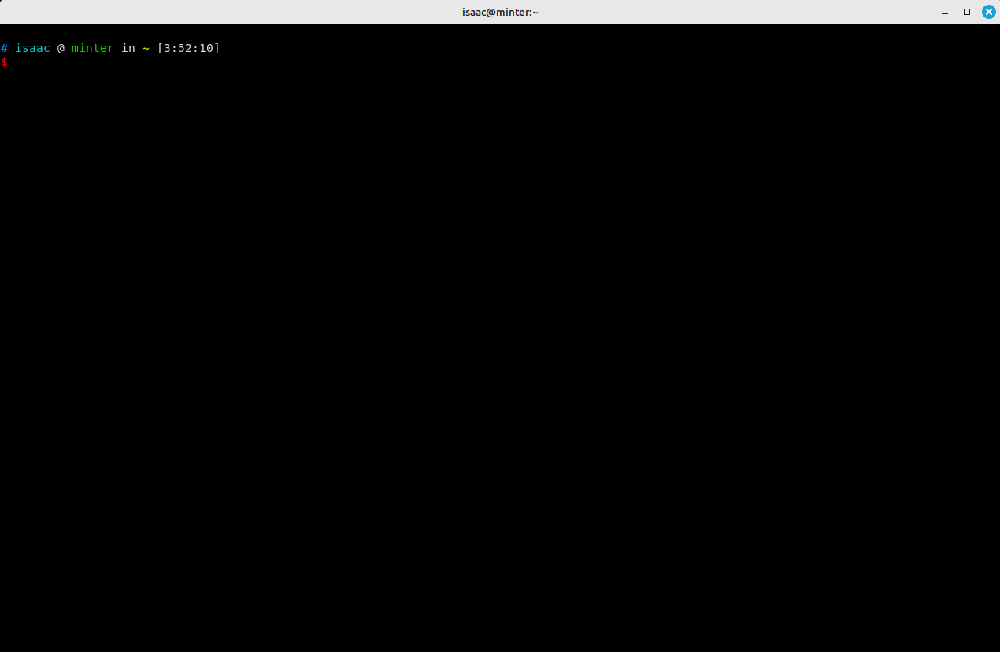

# 前言

背景：

System:
  Kernel: 5.15.0-86-generic x86_64 bits: 64 compiler: gcc v: 11.4.0 Desktop: Cinnamon 5.8.4
    tk: GTK 3.24.33 wm: Tabby dm: LightDM Distro: Linux Mint 21.2 Victoria base: Ubuntu 22.04 jammy

# Kitty

kitty是一个跨平台的终端模拟器，它被设计为一个快速、灵活和可定制的终端应用程序。以下是一些关于kitty终端的特点和功能的介绍：

1. GPU 渲染：kitty利用现代显卡的能力，使用GPU进行终端内容的渲染，以提供更快的显示速度和更平滑的滚动体验。

2. 支持多窗口布局：kitty允许你在一个终端窗口中创建多个分割窗格，以同时运行和管理多个终端会话。

3. 内置图像和图标支持：kitty可以直接在终端中显示图像和图标，包括常见的图像格式和TrueType字体中的图标。

4. 支持不透明度和背景模糊：kitty允许你调整终端窗口的不透明度，并提供背景模糊效果，以增强视觉效果。

5. 内置跨平台脚本支持：kitty支持通过脚本来自动化和扩展其功能。你可以使用脚本来创建自定义键绑定、自动化任务、自定义外观等。

6. Unicode 和字体支持：kitty完全支持Unicode字符集，并允许你在终端中使用各种字体，包括等宽字体和图标字体。

7. 高级配置选项：kitty提供了广泛的配置选项，允许你自定义终端的外观、行为和键绑定，以满足个人偏好和需求。

8. 跨平台支持：kitty可以在多个操作系统上运行，包括Linux、macOS和Windows。

总而言之，kitty终端模拟器通过其快速性能、多窗口布局、图像支持、定制能力和跨平台支持等特点，为用户提供了一个功能强大且灵活的终端环境。无论是日常使用还是开发工作，kitty都是一个值得考虑的终端选择。

# 安装

```shell
sudo apt install kitty -y
```



# 配置文件

配置文件的位置在：`～/.config/kitty/kitty.conf`，如果没有则新建配置文件。

修改配置后，需要重新启动 Kitty 才会生效！

# 窗口分割（Split Pane）

默认情况下，Kitty 没有提供快捷键对窗口进行分割。需要手动编辑配置文件，配置分割、关闭窗口的快捷键。

下面是手动配置的 3 个快捷键，分别是：

`ctrl+r`：在水平方向上左右分割窗口。

```shell
map ctrl+d launch --location=hsplit
```

`ctrl+r`：在竖直方向上上下分割窗口。

```shell
map ctrl+r launch --location=vsplit
```

`ctrl+w`：关闭当前分割的窗口

```shell
map Ctrl+W close_window
```

# 配置字体

```shell
# Fonts
font_family      Fira Code
bold_font        auto
italic_font      auto
bold_italic_font auto

font_size 14.0
```

# 配置背景色

```shell
# Background
background #282c34
```

# 遇到的问题

## Kitty 无法切换输入法

TODO

