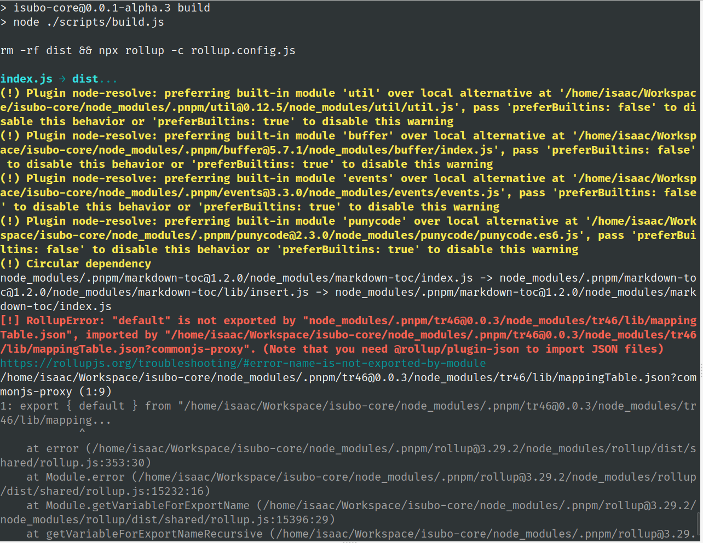
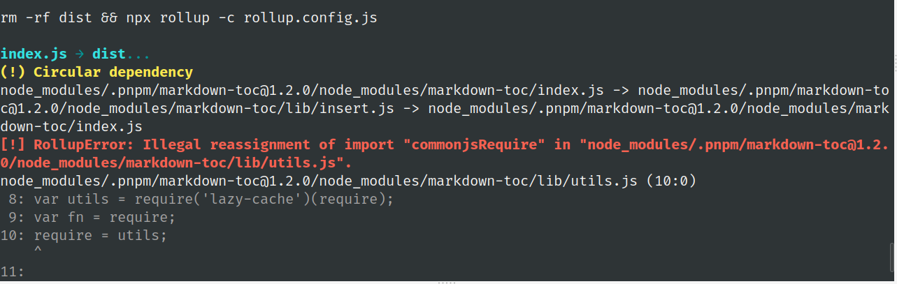

主题：将一个 ESM 语法实现的 NodeJS 包转化为 CJS 模块语法的包。

最终目的：不单只是将内容转化为 CJS 模块语法，需要连带所依赖的第三方包一并转化。保证在 CJS 语境下有效运行！

- `package.json` 中使用 `type` 字段强制指定为 `module`，以方便在 `.js` 文件中使用 ESM 模块语法。

- 包的内容使用 ESM 模块语法，推测部分依赖包也是仅仅支持 ESM 语法。

- Rollup 有几个插件组成之后，他们支持将 ESM 转化为 CJS。但是就目前观察的情况来看，仅仅支持将包内容转化，对依赖暂无解法。有待深入研究。


esm转cjs的探索

```js
import resolve from '@rollup/plugin-node-resolve';
import commonjs from '@rollup/plugin-commonjs';

export default {
  input: {
    index: 'index.js',
  },
  output: {
    dir: 'dist',
    format: 'cjs'
  },
  plugins: [
    resolve(),
    commonjs(),
  ]
};
```

出现的问题：



*先尝试解决 warning：`preferBuiltins`。从 chatgpt 查阅 node-resolve 的这个属性。*

在使用`@rollup/plugin-node-resolve`插件时，你可以使用`preferBuiltins`选项来指定哪些模块应该优先使用 Node.js 内置的模块。

`preferBuiltins`选项接受一个布尔值或一个对象，用于配置内置模块的优先级。以下是一些常见的用法：

1. 使用布尔值：
   - `preferBuiltins: true`：表示所有内置模块都优先使用。
   - `preferBuiltins: false`：表示所有内置模块都不优先使用。

2. 使用对象：
   - `preferBuiltins: { moduleA: true, moduleB: false }`：表示只有指定的模块（moduleA）会优先使用内置模块，而其他模块（moduleB）不会优先使用。

这样，当引入第三方包时，`@rollup/plugin-node-resolve`插件会根据配置的`preferBuiltins`选项来决定是否优先使用内置模块。如果指定的模块在 Node.js 中存在内置实现，插件将尝试使用内置模块，而不是将其打包到最终的输出中。

例如，以下是使用`@rollup/plugin-node-resolve`插件的示例配置，其中指定了某个模块（例如`fs`）优先使用内置模块：

```javascript
import resolve from '@rollup/plugin-node-resolve';

export default {
  // ...
  plugins: [
    resolve({
      preferBuiltins: { fs: true }
    }),
    // ...
  ],
  // ...
};
```

在这个示例中，如果第三方包中导入了`fs`模块，`@rollup/plugin-node-resolve`插件将尝试使用 Node.js 中的内置`fs`模块，而不是将其打包到输出中。

请注意，`preferBuiltins`选项只会在使用`@rollup/plugin-node-resolve`插件时起作用，对其他插件或工具没有影响。

添加以下修改：

```js
  plugins: [
    resolve({
+     preferBuiltins: true,
    }),
    commonjs(),
  ]
```

warning 消失！

*尝试解决错误（`@rollup/plugin-json`）引发的问题*

下面是 chatgpt 给出的解决方案：

根据错误提示，你需要使用`@rollup/plugin-json`插件来处理导入的JSON文件。该插件允许你在Rollup中导入和处理JSON模块。

请按照以下步骤进行配置：

1. 安装`@rollup/plugin-json`插件：
   ````shell
   npm install --save-dev @rollup/plugin-json
   ```

2. 在你的Rollup配置文件中引入和使用`@rollup/plugin-json`插件：
   ````js
   import resolve from '@rollup/plugin-node-resolve';
   import commonjs from '@rollup/plugin-commonjs';
   import json from '@rollup/plugin-json';

   export default {
     input: {
       index: 'index.js',
     },
     output: {
       dir: 'dist',
       format: 'cjs'
     },
     plugins: [
       resolve(),
       commonjs(),
       json() // Add the json() plugin here
     ]
   };
   ```

通过添加`json()`插件，Rollup将能够正确处理导入的JSON模块，并解决你遇到的错误。重新运行打包命令后，应该能够成功地打包你的项目。

在添加 json 插件后，json 问题已经解决。但是出现了新的编译错误！



暂时无法解决 markdown-toc 导致的问题，而且它本身也是使用cjs实现，因此暂时将它排除在外。


**添加 resolve、commonjs 插件成功编译后，第三方包被编译进包内容中。**